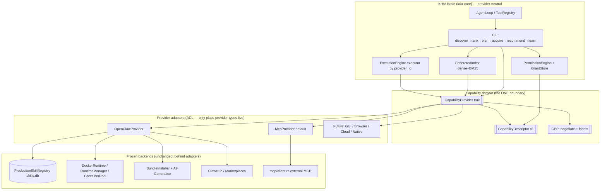
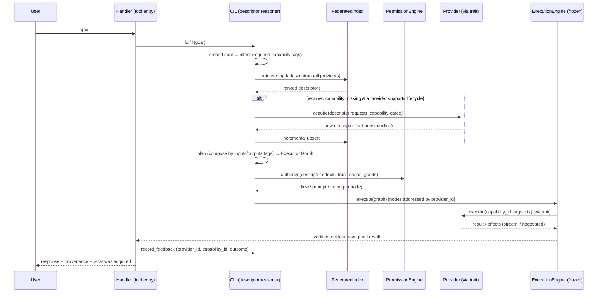
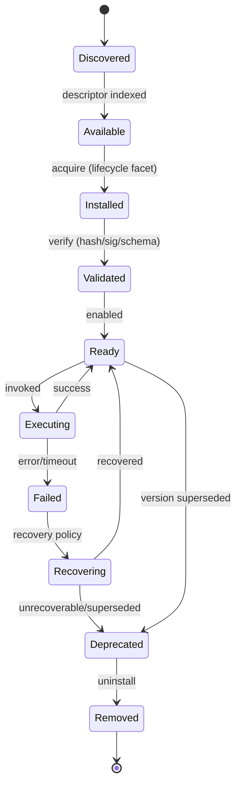
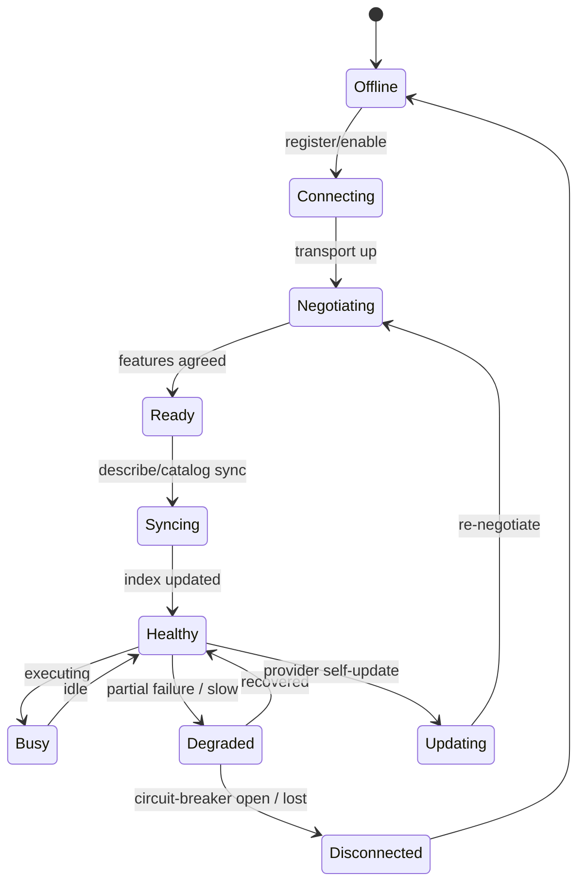
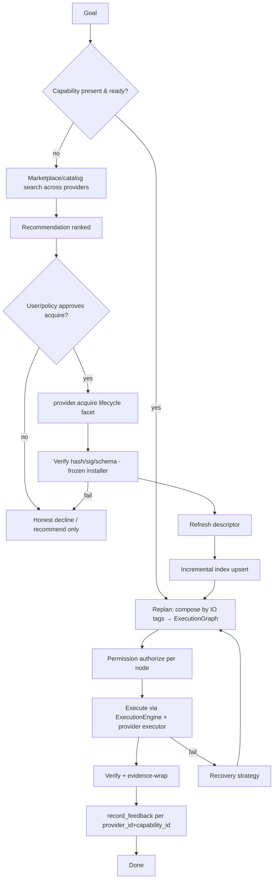
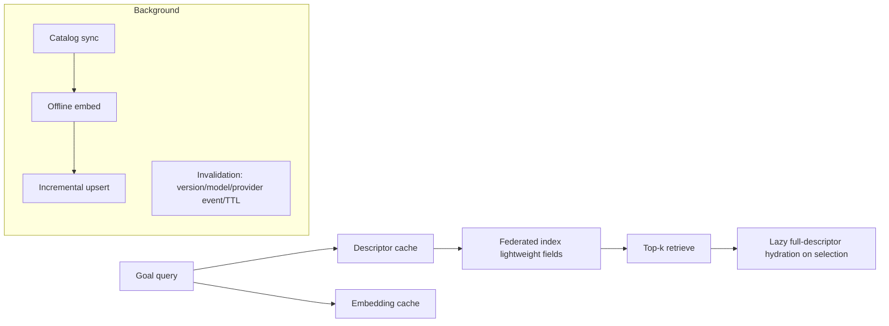

# Design Document: Capability Provider Platform (CPP)

> **Spec type:** Architecture/Feature · **Workflow:** Design-first · **Language:** Rust (`kria-core`) for
> traits/contracts/schemas; SolidJS/TypeScript for desktop surfaces. Mermaid for diagrams.
> **Scope:** Introduce the provider-neutral boundary (Anti-Corruption Layer), the Capability Provider
> Protocol (CPP), the Capability Descriptor v1.1, a provider-neutral permission/approval model, and a baseline
> multi-provider foundation. **Extends** the existing CIL and frozen OpenClaw A0–A9; does not redesign them.

## Overview

The Capability Provider Platform (CPP) introduces one provider-neutral boundary — a `CapabilityProvider`
trait, a rich `CapabilityDescriptor` v1, and an MCP-based negotiation protocol — so KRIA's Brain discovers,
ranks, plans, permissions, acquires, executes, and learns from capabilities without knowing which provider
supplied them. OpenClaw becomes the first provider behind an anti-corruption adapter; the CIL is refactored
to reason over descriptors only; permission becomes descriptor-effects-driven with a real approval flow. All
behavior is flag-gated with byte-for-byte flag-off parity to today.

## Grounding — Verified Current Implementation

Every anchor below was read from the codebase this session.

### 0.1 What exists and works

- **CIL** (`crates/kria-core/src/openclaw/cil/`) — goal→discover→rank→acquire→plan→recommend→learn, gated by
  `openclaw_icp_enabled` (currently ON in `kria_config.toml`). Facade `CapabilityIntelligence::fulfill`
  (`cil/facade.rs`) → `Fulfillment::{Plan, Recommend, Decline}`.
- **Execution seam** — `execution::Executor` trait + `ExecutorRegistry` + `ExecutionEngine`; `OpenClawExecutor`
  wraps `DockerRuntime`/`RuntimeManager`. **`ExecutorKind` is a closed enum** (`OpenClaw`, `Gui`, …) — a
  hardcoded seam.
- **Registry** — `ProductionSkillRegistry` (`skills.db`) is OpenClaw's source of truth; `RegistryEvent`
  broadcast drives live index/graph rebuild.
- **Permission** — `perm/engine.rs` `DefaultPermissionEngine::authorize` (tiers from `classify_risk` + caps +
  trust), `perm/grant_store.rs` `GrantStore` over `capability_grants_scoped` (default in-memory).
- **MCP at the wire** — the substrate `openclaw-substrate/src/mcp-bridge.js` speaks MCP JSON-RPC
  (`initialize`/`tools/list`/`tools/call`, Content-Length framed); KRIA speaks it via `openclaw/bridge.rs`
  `McpBridge` over `docker exec`. A separate `mcp/client.rs` speaks line-delimited MCP to external servers.
- **Descriptor today** = `SkillMetadata` + substrate `tools/list` (`name`/`description`/`inputSchema`) +
  `capability::Capability` (permission kind/mode/scope). The CIL adds `CapabilityProfile`/`CapabilityTag`.

### 0.2 Verified coupling to remove (the debt this spec pays down)

Direct `kria_core::openclaw::*` imports from non-openclaw KRIA-core modules (no ACL):

| Site | Concrete OpenClaw dependency |
|---|---|
| `config.rs` | `openclaw::OpenClawConfig`, `openclaw::clawhub::DEFAULT_REGISTRY_URL` |
| `mcp/tool_bridge.rs` | `openclaw::sanitizer::EvidenceWrapper`, `openclaw::types::ExecutionSource` |
| `execution/executors/openclaw.rs` | `openclaw::runtime::{LaunchSpec, RuntimeContext, RuntimeKind, SkillRuntime}`, `openclaw::pool::ContainerPool`, `openclaw::runtime::DockerRuntime`, `openclaw::types::ResourceClass` |
| `execution/{graph,recovery,executor}.rs` | `ExecutorKind`/`ExecutorKindTag` enum variants naming providers |
| Fragmented `capability` / `capability_registry` modules | present in `mcp/`, `resource/authority/`, `openclaw/`, `platform/intent/` — no single owner |

### 0.3 Design intent

Introduce **one** provider-neutral boundary that these sites depend on instead of OpenClaw, turn OpenClaw
into an **adapter** behind that boundary, and refactor the CIL to consume the boundary. Nothing is
re-implemented; the frozen execution/runtime/registry/generation stay put behind the OpenClaw adapter.

---

## 1. North-Star Invariant

> Will this still hold with N providers (OpenClaw, MCP servers, native tools, GUI cognition, browser, cloud,
> unknown-future), tens of thousands of capabilities, multiple marketplaces, and evolving protocols — with
> **zero KRIA-core code change** to add a provider? If not, it is redesigned.

Every decision below is checked against this.

---

## 2. Architecture Iteration Log (why each version is better)

The final design is stabilized across four iterations. This log is retained deliberately as the rationale of
record for the freeze.

### V1 — Thin ACL
Define a `CapabilityProvider` trait with `list()`/`execute()`, wrap OpenClaw. **Why it failed:** the
descriptor was still `tools/list`-thin, so permission and planning had to reach back into OpenClaw types for
effects/risk; `execute()` overfit to OpenClaw's single request→result shape (no streaming, no multi-modal I/O,
no batch); provider identity was still an enum. Net: boundary existed but leaked.

### V2 — Rich descriptor + negotiation + effects
Add the rich `CapabilityDescriptor` (effects, I/O modality, triggers, extensions) and a negotiation handshake;
move permission + planning onto descriptor `effects` and `inputs`/`outputs` tags. **Improvement:** permission
and planning became provider-neutral; the LLM plans/explains from descriptors. **Why it still failed:**
acquisition and the registry were still OpenClaw-bound (the CIL called `BundleInstaller` and
`ProductionSkillRegistry` directly), risking a second authoritative store; lifecycle was assumed mandatory,
which is wrong for read-only providers (a plain MCP server can't "install").

### V3 — Federated, capability-gated, descriptor-only (final)
Three changes stabilized it:
1. **Registry federation, single truth per provider.** Each provider owns its catalog; KRIA holds only a
   derived, rebuildable federated index. OpenClaw's `ProductionSkillRegistry` stays authoritative *for
   OpenClaw*.
2. **Lifecycle is an optional negotiated facet.** A provider advertises whether it supports
   install/update/remove; acquisition is offered only for capable providers. Read-only providers still fully
   discover/plan/execute.
3. **CIL consumes descriptors only.** The facade, index, ranker, planner, recommender, and permission engine
   reference `CapabilityDescriptor` + the provider trait — never OpenClaw types. The ACL adapter is the sole
   place provider-native types live. Negotiation + `extensions` give forward-compat.

Result: adding a provider = write an adapter (or use the default MCP adapter) + register it. No KRIA-core
change. The invariant holds.

### V4 — Production hardening (this refinement)
V3 stabilized the boundary; V4 hardens it for real long-term operation without changing the boundary. It
adds, by grounding each in an existing subsystem rather than inventing parallel machinery: explicit
capability + provider **state machines** (reusing `SkillState`/`ContainerState`/`HealthStatus`), an enriched
**descriptor v1.1** (guidance + expectations, additive), a unified **observability** stream/timeline over the
existing `AuditLedger`/`ExecutionMetrics`/`event` streams, a **performance/caching** layer (descriptor/
catalog/embedding/session/result caches + lazy hydration + background sync), a provider-neutral **resource
broker** wrapping the existing HRA `admit`/`RuntimeScheduler`, a **recovery/fallback** strategy over the
existing `RecoverySystem` + a per-provider circuit breaker, a first-class desktop **Capabilities area**
(elevating the four already-built views), a **Production Definition of Done**, and an explicit
**dead-code/deprecation removal** endpoint. V4 introduces no new boundary type; it makes the V3 boundary
operable, observable, and maintainable at scale.

**Stress-test answers (why V4 survives):**
- *100,000 capabilities* — lazy descriptor hydration + lightweight index fields + incremental upsert (full
  rebuild forbidden at scale) + virtualized UI lists.
- *OpenClaw v5 tomorrow* — protocol negotiation + additive descriptor versioning + `extensions` absorb new
  facets inside the adapter; KRIA-core unchanged.
- *Replace OpenClaw entirely* — Brain depends only on the trait + descriptor; replacement is a new adapter.
- *100 providers* — provider registry keyed by open `provider_id`, per-provider session/health, bounded
  concurrent sync, and a per-provider circuit breaker so one bad provider cannot stall discovery.
- *Desktop 10x* — a dedicated Capabilities area with virtualization + push/poll replaces today's
  buried-in-Settings surfaces.

---

## 3. Guiding Principles

1. **One boundary.** A single `capability` domain module in KRIA-core owns the trait, descriptor, and neutral
   value types. The scattered `capability_registry` modules are consolidated or made to depend on it.
2. **Extend, never fork.** Execution stays on the frozen `ExecutionEngine`; OpenClaw runtime/registry/
   generation stay frozen behind the adapter; the CIL keeps its algorithms.
3. **Descriptors are data.** New capability kinds, modalities, effects, and domains are tag strings and
   `extensions` entries — never new enums or branches in KRIA-core.
4. **MCP is the substrate.** CPP is a descriptor + negotiation profile on MCP. Plain MCP servers are valid
   providers with derived defaults.
5. **Deny-by-default, evidence-based escalation.** Permission is a pure function of descriptor effects +
   trust + prior grants.
6. **Honesty + reversibility.** Every stage is audited; degraded states are first-class; everything is
   flag-gated with flag-off parity.

---

## 4. Component → Owner Map (extend, never duplicate)

| New/refactored component | Responsibility | Extends / wraps | Additive guarantee |
|---|---|---|---|
| `capability::provider::CapabilityProvider` (trait) | The anti-corruption boundary | new | Only trait + neutral types; no provider type |
| `capability::descriptor::CapabilityDescriptor` (v1.1) | Rich self-describing capability doc | supersedes ad-hoc `CapabilityProfile` view (derived from it) | Versioned, additive `extensions` |
| `capability::protocol` (negotiation + facets) | Version/feature handshake, facet gating | layered on MCP (`mcp/`, `openclaw/bridge.rs`) | Baseline = plain MCP |
| `capability::registry::FederatedIndex` | Derived cross-provider descriptor index | reuses CIL `CapabilityIndex` (dense+BM25) generalized | Rebuildable; no new truth |
| `capability::acl::openclaw::OpenClawProvider` | OpenClaw as a provider | wraps `ProductionSkillRegistry`, `SemanticSkillRouter`, `BundleInstaller`, `GenerationPipeline`, `DockerRuntime` | Sole home of OpenClaw types |
| `capability::acl::mcp::McpProvider` | Plain MCP servers as providers | wraps `mcp/client.rs` | Default descriptor derivation |
| `cil::*` (refactor) | Goal reasoner over descriptors | existing CIL modules, retyped to descriptors | Algorithms unchanged |
| `perm::PermissionEngine` (generalize) | Descriptor-effects permission | existing `perm/engine.rs` | Tier logic reused, keyed on effects |
| `perm::GrantStore` (persist) | Durable scoped grants | existing `perm/grant_store.rs` | Wire to real DB + approval UI |
| Execution seam (`provider_id`) | Replace `ExecutorKind` enum | `execution::Executor`/`ExecutorRegistry` | Open-vocab id; enum removed |
| Desktop provider surfaces | Provider/approval/log UI | existing `commands/openclaw.rs` + views | New commands/events; names preserved |
| `kria-eval::capability_eval` | Provider conformance harness | reuses `openclaw_eval` rig | Provider-neutral suite |

---

## Architecture



The Brain depends only on the boundary. Every arrow into a frozen backend passes through an adapter.

---

## 6. Capability Flow (goal → response)



---

## Data Models

All types live in a new `crates/kria-core/src/capability/` module. They contain **no** provider-specific type.

### 7.1 Provider identity and protocol

```rust
/// Open-vocabulary provider id (e.g. "openclaw", "mcp:github", "gui.cognition",
/// "browser", "cloud.dalle"). NEVER an enum. Replaces execution::ExecutorKind.
pub type ProviderId = String;

/// Negotiated protocol state for one provider.
#[derive(Debug, Clone)]
pub struct ProtocolSession {
    pub provider_id: ProviderId,
    pub version: ProtocolVersion,            // highest mutually supported
    pub features: FeatureSet,                // agreed intersection
    /// Forward-compatible, provider-advertised features KRIA does not (yet) know.
    pub extensions: serde_json::Map<String, serde_json::Value>,
}

#[derive(Debug, Clone, Copy, PartialEq, Eq, PartialOrd, Ord)]
pub struct ProtocolVersion(pub u16, pub u16); // (major, minor); additive minor bumps

bitflags-like FeatureSet {
    DESCRIBE,        // mandatory
    DISCOVER,        // mandatory (or KRIA-side retrieval over descriptors)
    EXECUTE,         // mandatory
    STREAMING,       // optional
    LIFECYCLE,       // optional: install/update/remove (acquisition)
    BATCH,           // optional
    MULTIMODAL_IO,   // optional
    // Unknown future features carried in ProtocolSession.extensions.
}
```

### 7.2 Capability Descriptor v1 (the anti-hardcoding primitive)

```rust
#[derive(Debug, Clone, Serialize, Deserialize)]
pub struct CapabilityDescriptor {
    pub schema_version: DescriptorVersion,       // v1; forward-only additive
    // ── Identity
    pub provider_id: ProviderId,
    pub capability_id: String,                   // unique within provider
    pub version: String,
    // ── Semantics (LLM-readable)
    pub name: String,
    pub description: String,
    /// Open, namespaced capability tags (e.g. "media.image.ocr", "net.http.fetch").
    pub tags: Vec<CapabilityTag>,
    // ── I/O contract (for validation + composition)
    pub input_schema: serde_json::Value,         // JSON Schema
    pub output_schema: Option<serde_json::Value>,
    pub io_modality: Vec<Modality>,              // open: text/file/image/audio/stream/...
    pub inputs: Vec<String>,                     // open type tags for composition
    pub outputs: Vec<String>,
    // ── Triggers (retrieval hints, NOT hardcoded routing)
    pub examples: Vec<TriggerExample>,           // example prompt + expected intent
    // ── Effects (drives permission + planning without provider knowledge)
    pub effects: Effects,
    // ── Permission (neutral)
    pub permissions: Vec<Effect>,                // requested effect classes
    // ── Trust & quality (derived/provider-supplied)
    pub trust: TrustInfo,                        // publisher, signature state, tier
    pub quality: QualitySignals,                 // stars/validator score/etc (optional)
    pub stats: Option<UsageStats>,               // derived: success/popularity/latency
    // ── v1.1 guidance (LLM-readable; additive over v1). All optional.
    pub guidance: Option<Guidance>,
    // ── v1.1 expectations (drive planning/permission/UX without executing).
    pub expectations: Option<Expectations>,
    // ── Forward-compat: anything a newer provider advertises.
    #[serde(default)]
    pub extensions: serde_json::Map<String, serde_json::Value>,
}

/// v1.1 — self-describing guidance for selection, planning, and user-facing
/// explanation. Every field optional; omitted → treated as unknown.
#[derive(Debug, Clone, Default, Serialize, Deserialize)]
pub struct Guidance {
    pub execution_examples: Vec<IoExample>,      // input → expected output
    pub output_examples: Vec<serde_json::Value>,
    pub failure_examples: Vec<FailureExample>,   // input → failure mode
    pub common_mistakes: Vec<String>,
    pub best_prompts: Vec<String>,
    pub known_limitations: Vec<String>,
    pub confidence: Option<f32>,                 // 0.0..=1.0 provider/validator confidence
}

/// v1.1 — expectation metadata. Maps existing SkillCapabilities/ResourceProfile
/// onto neutral fields; NOT a second copy — the OpenClaw adapter derives these.
#[derive(Debug, Clone, Default, Serialize, Deserialize)]
pub struct Expectations {
    pub typical_latency_ms: Option<u64>,
    pub cost: Option<CostHint>,                  // free | metered { unit, amount }
    pub gpu_required: Option<bool>,
    pub min_ram_mb: Option<u64>,
    pub offline_supported: Option<bool>,
    pub host_requirement: Option<String>,        // open: "linux", "docker", "chrome", ...
    pub compatibility: Vec<String>,              // open compatibility tags
    pub version_constraints: Option<String>,     // semver range for deps/host
}

#[derive(Debug, Clone, Serialize, Deserialize)]
pub struct Effects {
    pub classes: Vec<Effect>,                    // read/write/network/subprocess/gpu/... (open)
    pub reversible: Reversibility,               // Reversible | Irreversible | Unknown
    pub idempotent: bool,
    pub resource_class: ResourceClass,           // Light/Medium/Heavy (neutral mirror)
}

/// Open effect class string; NOT a closed enum (unknown → treated as elevated).
pub type Effect = String;
pub type Modality = String;

#[derive(Debug, Clone, Serialize, Deserialize)]
pub struct TriggerExample { pub prompt: String, pub intent: Option<String> }
```

> **Anti-hardcoding proof.** OCR, GPU, k8s, browser, email, GUI-automation, and unknown-future domains are all
> `tags`/`effects`/`extensions` strings supplied by the provider. KRIA-core has zero branches on any of them.
> A thin MCP provider yields a `v1` descriptor with `effects = {classes:[], reversible: Unknown}` →
> conservatively elevated permission (R3.3).

### 7.3 Execution request/result (neutral)

```rust
#[derive(Debug, Clone)]
pub struct CapabilityRequest {
    pub provider_id: ProviderId,
    pub capability_id: String,
    pub args: serde_json::Value,                 // validated against input_schema
    pub context: RequestContext,                 // correlation id, cancellation, scope
    pub granted_effects: Vec<Effect>,            // from the PermissionEngine decision
}

pub enum CapabilityOutcome {
    Value(serde_json::Value),                    // final result
    Stream(BoxStream<CapabilityChunk>),          // only if STREAMING negotiated
    Declined { reason: String },                 // honest, never fake success
}
```

### 7.4 Derived persistence (additive, forward-only)

Reuse the existing additive-migration discipline. CPP tables are derived and rebuildable; each provider's
own store remains authoritative.

```sql
-- provider_descriptors: the federated derived index backing store
CREATE TABLE IF NOT EXISTS provider_descriptors (
    provider_id   TEXT NOT NULL,
    capability_id TEXT NOT NULL,
    version       TEXT NOT NULL,
    descriptor_json TEXT NOT NULL,       -- full CapabilityDescriptor v1
    embedding     BLOB,                  -- f32 vector, nullable (degraded → NULL)
    tags_index    TEXT NOT NULL DEFAULT '[]',
    trust_tier    TEXT,
    deprecated    INTEGER NOT NULL DEFAULT 0,
    offline       INTEGER NOT NULL DEFAULT 0,
    fetched_at    TEXT NOT NULL,
    PRIMARY KEY (provider_id, capability_id)
);

-- provider_sessions: last negotiated protocol state (observability + reconnect)
CREATE TABLE IF NOT EXISTS provider_sessions (
    provider_id TEXT PRIMARY KEY,
    version_major INTEGER NOT NULL,
    version_minor INTEGER NOT NULL,
    features_json TEXT NOT NULL,
    extensions_json TEXT NOT NULL DEFAULT '{}',
    negotiated_at TEXT NOT NULL,
    health TEXT NOT NULL                 -- ready | degraded | offline
);

-- grants are the EXISTING capability_grants_scoped table, generalized to
-- key on (provider_id, capability_id) via an additive provider_id column.
ALTER TABLE capability_grants_scoped ADD COLUMN provider_id TEXT NOT NULL DEFAULT 'openclaw';
```

Every derived table rebuilds from providers' catalogs; corruption/version drift recovers by full reindex.

---

## Components and Interfaces

### 8.1 The provider trait (the boundary)

```rust
#[async_trait]
pub trait CapabilityProvider: Send + Sync {
    fn provider_id(&self) -> &ProviderId;

    /// Negotiate version + features. Mandatory. Baseline = MCP tools.
    async fn negotiate(&self, client: &ClientCapabilities) -> Result<ProtocolSession, CapError>;

    /// Self-describe: return the provider's current capability descriptors.
    /// Mandatory. A thin provider derives conservative defaults.
    async fn describe(&self, session: &ProtocolSession) -> Result<Vec<CapabilityDescriptor>, CapError>;

    /// Execute one capability. Mandatory.
    async fn execute(&self, req: CapabilityRequest) -> Result<CapabilityOutcome, CapError>;

    /// Optional lifecycle facet — offered ONLY if session.features has LIFECYCLE.
    async fn acquire(&self, _req: &AcquireRequest) -> Result<CapabilityDescriptor, CapError> {
        Err(CapError::Unsupported("lifecycle".into()))     // default: read-only provider
    }
    async fn remove(&self, _capability_id: &str) -> Result<(), CapError> {
        Err(CapError::Unsupported("lifecycle".into()))
    }

    /// Health for observability + degraded handling.
    async fn health(&self) -> ProviderHealth;
}
```

The trait is deliberately small: describe / negotiate / execute are mandatory; everything else is a negotiated
optional facet with a safe default. This is why a plain MCP server is a valid provider.

### 8.2 Registry of providers + federated index

```rust
/// Holds the set of registered providers (by open-vocab id) and the derived
/// federated descriptor index. No provider-native type crosses this API.
pub struct ProviderRegistry { /* Vec<Arc<dyn CapabilityProvider>> keyed by id */ }

impl ProviderRegistry {
    pub fn register(&self, provider: Arc<dyn CapabilityProvider>);
    pub fn get(&self, id: &ProviderId) -> Option<Arc<dyn CapabilityProvider>>;
    /// Negotiate + describe all providers → rebuild the federated index.
    pub async fn refresh(&self) -> RefreshReport;
}

/// The federated index reuses the CIL's dense+BM25 fusion, generalized to
/// descriptors keyed by (provider_id, capability_id).
pub trait FederatedIndex: Send + Sync {
    fn rebuild(&self, descriptors: &[CapabilityDescriptor]);
    fn upsert(&self, descriptor: &CapabilityDescriptor);
    fn search(&self, goal_embedding: &[f32], text: &str, k: usize) -> Vec<ScoredDescriptor>;
}
```

### 8.3 CIL refactor (descriptor reasoner)

The CIL facade keeps its stages but is retyped:

- `derive_goal_intent` — unchanged (embed + one structured LLM call).
- discovery — `FederatedIndex::search` over descriptors (was `CapabilityIndex` over `SkillMetadata`).
- ranking — `CapabilityRanker` scores `ScoredDescriptor` using descriptor fields + stats.
- planning — `CapabilityPlanner` composes by descriptor `inputs`/`outputs`; emits `ExecutionGraph` with nodes
  addressed by `provider_id`.
- acquisition — `AcquisitionOrchestrator` calls `provider.acquire(...)` (capability-gated) instead of
  `BundleInstaller` directly. For OpenClaw, the adapter's `acquire` drives the frozen installer/generation.
- recommend/learn — pure reads / stats writes keyed by `(provider_id, capability_id)`.

No CIL algorithm is rewritten; the types it consumes change from OpenClaw-specific to neutral.

### 8.4 Permission engine (descriptor-effects driven)

```rust
pub trait PermissionEngine: Send + Sync {
    /// Pure function of descriptor Effects + trust + scope + prior grants.
    fn authorize(&self, req: &AuthorizeRequest, grants: &GrantStore) -> PermissionDecision;
    fn revoke(&self, grant_id: &str, grants: &GrantStore) -> Result<(), CapError>;
}
```

Tier assignment (reusing today's logic, re-keyed on effects, not skill names):
- low risk + no write/network/subprocess/gpu effect ⇒ `NeverAsk`.
- irreversible write / host-scope subprocess / high-critical risk ⇒ `AlwaysAsk` unless `Silent` policy grant.
- otherwise ⇒ context tier (session/workspace/persistent) with grant reuse; widening ⇒ re-prompt.

`GrantStore` is the existing table, extended with `provider_id`, wired to a real DB and an approval UI so
YELLOW/RED capabilities are no longer dead-ends (the biggest current pain point).

### 8.5 Execution seam change

`execution::ExecutorKind` (closed enum) is replaced by `provider_id: ProviderId` on graph nodes and executor
registration. The `ExecutionEngine` gains an executor that dispatches `CapabilityRequest` to the provider via
the trait. `OpenClawExecutor` becomes a thin dispatch into `OpenClawProvider::execute`. `ExecutorKindTag`
serialization becomes a string. This is the only frozen-seam signature change and is additive-compatible via
a serde default mapping old enum values → strings.

### 8.6 OpenClaw adapter (reference provider)

`capability::acl::openclaw::OpenClawProvider` is the sole home of OpenClaw types. It:
- `negotiate` → advertises `DESCRIBE|DISCOVER|EXECUTE|LIFECYCLE|STREAMING?` based on runtime availability.
- `describe` → builds `CapabilityDescriptor v1` from `ProductionSkillRegistry` + substrate `tools/list`
  (effects derived from `capability::Capability` + `classify_risk`; tags/examples from metadata).
- `execute` → maps `CapabilityRequest` → `LaunchSpec` → `DockerRuntime::execute` (frozen), wraps result.
- `acquire` → marketplace install via frozen `BundleInstaller` or A9 generation → registry → new descriptor.
- `health` → substrate/pool status.

The `config.rs`, `mcp/tool_bridge.rs`, and `execution/executors/openclaw.rs` couplings are re-routed: config
gains a neutral `providers` section; `tool_bridge` uses the neutral evidence/execution-source types; the
executor uses the neutral request type.

### 8.7 Desktop surfaces

New Tauri commands/events (existing names preserved): provider list + health + negotiated version/features,
descriptor catalog browser, approval flow (approve/scope/deny), grant list + revoke, execution logs per
provider. Backed by `ProviderRegistry`, `GrantStore`, audit stream.

---

## Correctness Properties

These invariants are asserted by tests, not assumed.

### Property 1: Boundary integrity
No KRIA-core module outside a provider adapter references a provider-native type (compile/grep-time: adapters
are the only modules importing `openclaw::*`/`mcp::client`). **Validates: Requirements 1.1, 1.2**

### Property 2: Open extensibility
A synthetic novel provider with a novel capability tag/effect flows through
discover→rank→plan→permission→execute with no code change and no enum edit. **Validates: Requirements 1.4, 3.2**

### Property 3: Negotiation safety
For any provider feature set, absent optional facets never produce errors; a plain MCP provider is fully
usable at baseline. **Validates: Requirements 2.2, 2.3**

### Property 4: Descriptor validity
Every provider's descriptors validate against `v1`; a thin provider yields a conservative default;
forward-compat fields survive round-trip. **Validates: Requirements 3.3, 3.5**

### Property 5: Federation single-truth
Rebuilding the federated index from providers' catalogs yields identical query results (idempotent).
**Validates: Requirements 4.3**

### Property 6: Composition type-safety
Every plan edge `a→b` satisfies `a.outputs ∩ b.inputs ≠ ∅`; plans may cross providers. **Validates: Requirements 5.1**

### Property 7: Permission monotonicity + deny-by-default
Narrowing never turns allow→prompt; widening re-prompts; irreversible/host-scope/high-risk ⇒ always-ask
unless a Silent policy grant exists. **Validates: Requirements 6.3, 6.5**

### Property 8: Lifecycle gating
Acquisition is offered only for providers advertising LIFECYCLE; read-only providers still
discover/plan/execute. **Validates: Requirements 7.1, 7.5**

### Property 9: Honesty
No fake success; every stage emits a `provider_id`-tagged audit record; degraded states reported. **Validates: Requirements 11.1, 11.2**

### Property 10: Flag-off parity
With `capability_provider_platform_enabled=false`, behavior is byte-for-byte the current CIL/OpenClaw path.
**Validates: Requirements 11.3**

### Property 11: Leak-freedom
After completed/failed/cancelled runs, provider resources (containers/leases) return to baseline (via the
frozen leak detector through the OpenClaw adapter). **Validates: Requirements 11.1, 11.2**

---

## Testing Strategy

- **Layer 0 (CI, no Docker):** trait/descriptor/negotiation/permission logic with a `FakeProvider`; property
  tests for Properties 1–10; flag-off parity test.
- **Layer 1 (rig, real Docker):** OpenClaw adapter conformance end-to-end (describe/negotiate/execute/acquire),
  leak-freedom, installer convergence — reuse `openclaw_eval` rig.
- **Layer 2 (live desktop):** real goal → federated discovery → permission/approval UI → cross-provider plan →
  execute; provider health + negotiated version shown in UI.
- **Multi-provider proof:** the minimal `McpProvider` (a plain MCP server) is registered alongside OpenClaw and
  federated; a plan composes a step from each (Property 6, prevents OpenClaw overfit).
- **Conformance suite (`capability_eval`):** provider-neutral checks any adapter must pass; run for OpenClaw +
  the MCP reference provider.
- **Diversity over repetition:** the manual/live prompt suite covers distinct capability categories and
  execution paths (arithmetic, file/PDF, web fetch, image, multi-skill, cross-provider) rather than repeating
  identical prompts.

## Error Handling

Single `CapError` (thiserror) with user-actionable variants: `Negotiation`, `Unsupported(facet)`,
`Descriptor`, `Discovery`, `Permission`, `Acquire`, `Execute`, `Degraded`, `Provider(offline)`, `Io`. No
variant swallows failures; every error maps to an honest user message and an audit record.

## 12. Long-Term Extensibility (reference)

- **New provider:** implement the adapter (or reuse `McpProvider`) + register. Zero KRIA-core change.
- **New capability domain:** provider emits new tags/effects/`extensions`. Zero code change.
- **New protocol feature:** additive minor version bump + a new `FeatureSet` flag negotiated; older KRIA
  ignores it via `extensions`.
- **New marketplace/runtime:** a provider or marketplace-provider adapter; frozen fetch/install paths unchanged.
- **Distributed scale:** swap the in-process `FederatedIndex` for a distributed vector store behind the trait.

## State Machines

Both machines reuse existing authoritative enums; CPP documents and generalizes them rather than adding
parallel state.

### Capability state machine (generalizes `openclaw::registry::SkillState`)



`SkillState` already provides Discovered/Verified/Installed/Enabled/Disabled/Deprecated/Removed/Broken/
Recovering. CPP maps `Available`→indexed descriptor, `Validated`→`Verified`, `Ready`→`Enabled`,
`Failed`→`Broken`. No new store; the registry (per provider) remains authoritative and the federated index
mirrors `Available`/`Ready`.

### Provider state machine (derived from `ProtocolSession` + `ProviderHealth`)



Persisted in `provider_sessions.health`. A `Disconnected`/circuit-open provider is excluded from discovery and
execution but its last-known descriptors remain in the index flagged `offline` (R4.6).

### Execution, installation, and recovery lifecycles (reuse existing machines — no new ones)

These are not new state machines; they are named views over the two authoritative machines above plus the
frozen `ContainerState`:

- **Installation lifecycle** = the capability machine subsequence `Available → Installed → Validated → Ready`
  (acquire → verify → enable), owned by the provider's registry.
- **Execution lifecycle** = the frozen `openclaw::runtime_manager::ContainerState`
  (`Reserved → Executing → Cooling → Idle`) for containerized providers; for non-container providers it
  collapses to the capability machine's `Ready → Executing → Ready|Failed`.
- **Recovery lifecycle** = `Failed → Recovering → Ready | Deprecated` on the capability machine and
  `Failed → Recovering → Ready | Destroyed` on `ContainerState`, both driven by the existing `RecoverySystem`
  (Requirement 17). No parallel recovery state is introduced.

## Capability Lifecycle Flow (goal → done)

The complete acquisition-on-miss path (checklist #1), all through the boundary:



Every stage emits a `provider_id`-tagged audit event; no stage fabricates success.

## Desktop User Flows

Each major workflow follows User → Brain → UI → Capability → Execution → Verification → Completion. Backed by
existing (preserved) commands/events plus additive CPP commands.

- **Install:** user requests / accepts a recommendation → Brain ranks catalog → Approval Center surfaces
  descriptor effects → user approves scope → `provider.acquire` → verify → index upsert → capability shows
  `Ready` in Capability Browser → confirmation toast.
- **Marketplace:** user browses Marketplace (virtualized catalog from cache) → selects a descriptor → viewer
  shows guidance/expectations/limitations → install flow above.
- **Permission:** execution hits an elevated capability → Approval Center prompt shows effects + scope options
  → user approves/denies/scopes → grant persisted → execution resumes or declines honestly → grant visible/
  revocable in Provider Manager.
- **Execution:** user goal → Agent Timeline shows plan + per-node progress (push events) → result rendered →
  Execution History records it.
- **Recovery:** node fails → Recovery screen shows failure reason + policy (retry/fallback/alt provider) →
  outcome surfaced honestly; on exhaustion, real reason (never "unknown error").
- **Updates:** provider/capability update available (from catalog version/supersedes) → user sees update
  badge → applies via lifecycle facet → re-negotiate/re-index → history records it.

## Observability Architecture

One provider-neutral, correlation-linked pipeline, built on existing subsystems:

| Layer | Source (existing) | CPP addition |
|---|---|---|
| Events | `openclaw::event`, `bundle::events`, `RegistryEvent` | Neutral `CapabilityEvent { provider_id, capability_id, stage, correlation_id, outcome }` fan-in |
| Logs | `tracing` | Structured, `provider_id`-tagged fields |
| Metrics | `ExecutionMetrics`, `PlatformMetrics` | Per-provider/per-capability counters (extend, not duplicate) |
| Tracing | `tracing-subscriber` | Spans per stage; optional OTel/Prom export |
| Timeline | — | Ordered per-goal reconstruction from the event stream |
| Audit | `AuditLedger` | Every decision + state transition, append-only |
| Health | `HealthMonitor`, provider `health()` | Aggregated per-provider health surface |
| Diagnostics | — | Descriptor viewer, negotiated-feature inspector, grant inspector (Developer Mode) |

## Performance and Caching



Rules: retrieval uses lightweight indexed fields (tags, embedding, trust) so memory is bounded; full
descriptors hydrate lazily on selection; single-capability change → incremental upsert (never full rebuild);
sync/embed/reindex run under a bounded background queue; each cache has an explicit invalidation trigger.
Budgets (recorded, miss = honest failure): cache hit < 5 ms, discovery < 50 ms at 10k, permission decision <
5 ms, incremental upsert bounded and independent of catalog size.

## Resource Scheduling

A provider-neutral `ResourceBroker` facade wraps the **existing** schedulers — no second scheduler:

- OpenClaw runtime work → existing `openclaw::admission::admit` + `RuntimeScheduler`/`Priority`.
- GPU/device work → existing Hardware Resource Authority `resource/authority/scheduler.rs::admit`
  (with preemption).
- The broker admits/queues/prioritizes/preempts/cancels by descriptor `effects.resource_class` + priority,
  generically for any provider (Docker, GPU, embeddings, LLM, MCP, sidecar, Python, Rust, future).
- Cancellation releases containers/leases/GPU reservations to baseline; queue position/backpressure surfaced
  honestly; unavailable runtime → capabilities needing it excluded (honest degrade).

## Recovery Strategy

Built on the existing `RecoverySystem`/`RecoveryManager`/`RecoveryPolicy`:

| Failure | Policy |
|---|---|
| Skill/capability error | retry (bounded backoff) → fallback to alternative capability (same tag) → honest decline |
| Provider failure | mark degraded; retry negotiate; **circuit breaker** after N failures → exclude provider |
| Docker/runtime failure | recover container (existing `RecoverySystem`); if runtime down → honest degrade |
| Marketplace failure | serve stale cache flagged offline |
| Timeout | cancel + release resources + real reason |

Invariants: bounded attempts/time; user always gets the real reason on exhaustion; resources restored to
baseline after any failed/cancelled/recovered run (Property 11); an alternative provider/capability is offered
where one exists (subject to permission).

## Desktop Experience and Information Architecture

Today the four built views (`CapabilityManagerView`, `CapabilityGraphView`, `ExecutionLogsView`,
`PermissionManagerView`) live inside `SettingsModal`; top-level nav is only `home|dashboard|vm-management|
settings|tasks`. CPP elevates them into a first-class **Capabilities** area and fills the gaps.

| Surface | Status | Backing |
|---|---|---|
| Capability Browser | exists (`CapabilityManagerView`) → elevate | federated index + descriptors |
| Marketplace | exists (`SkillMarketplace`) → elevate | catalog cache |
| Provider Manager | **new** | provider registry + `provider_sessions` + health |
| Approval Center | extend `PermissionManagerView` | `PermissionEngine` + `GrantStore` |
| Agent Timeline / Execution History | extend `ExecutionLogsView` | event stream + timeline |
| Capability Health | **new** | health aggregation |
| Descriptor Viewer | **new** | descriptor v1.1 (guidance/expectations) |
| Runtime Monitor | **new** | `ResourceBroker` + metrics |
| Recovery screen | **new** | recovery events |
| Capability Graph | exists (`CapabilityGraphView`) → elevate | `capability_edges` |
| Developer Mode | exists (toggle) | gates non-production surfaces |

All lists virtualized; all surfaces push+poll; all existing command/event names preserved.

## Production Definition of Done

Release gate (evidence-backed, `real` only — checklist #12): marketplace, recommendation, installation,
verification, execution, recovery, permission/approval, restart, offline, upgrade, migration, logs, and
tracing all proven on the real desktop with real Docker + real LLM; zero leaked containers/processes/threads/
leases/grants after 100+ diverse prompts and a long-running session; manual usability of the Capabilities
area confirmed; boundary-integrity check green; ≥2 providers federated. Any missing evidence → No-Go
(Skipped ≠ Passed, fixture ≠ real).

## Dead-Code Removal and Migration

CPP does not carry two architectures forever. The migration has an explicit **debt-removal point**.

Phased: (1) CPP ships behind the flag with flag-off parity; (2) CPP made default-on after soak + validation;
(3) at the debt-removal point, legacy is removed in verified steps:

| Target (verified in repo) | Removal step |
|---|---|
| `openclaw::handler::register_skill` (`#[deprecated]`) | delete after confirming no caller |
| `execution::ExecutorKind` closed enum + `ExecutorKindTag` | retire in favor of `provider_id` string (serde compat kept through migration, then dropped) |
| Flag-off direct-router compatibility branch in `execute_semantic` | remove once CPP default-on + soaked |
| Reserved `#[allow(dead_code)]` fields in `runtime_manager.rs` | implement or remove |
| `automation/workflows.rs`, `agent/execution_verifier_impl.rs` (`#[deprecated]`) | remove/fold if unreachable |
| Fragmented `capability`/`capability_registry` modules (`mcp/`, `resource/authority/`, `platform/intent/`) | consolidate to one owner of the CPP boundary |

Rules: a dead-code/unused-trait/unused-config detection pass records findings before any removal; nothing
reachable in a supported configuration is removed; every removal proves no supported flow regresses; after
migration, exactly one owner remains for registry/runtime/execution/marketplace/installer/generation/routing/
permission/desktop integration. Until the debt-removal point, the legacy path stays behind the flag for safe
rollback.
