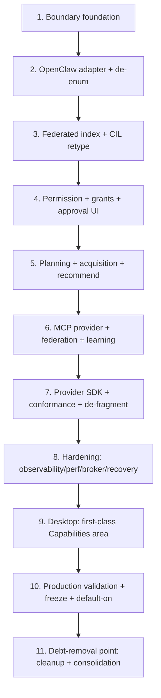

# Implementation Plan: Capability Provider Platform (CPP)

## Overview

This plan implements the Capability Provider Platform in **milestones**, not micro-tasks. Each milestone is a
complete architectural capability that is shippable behind the `capability_provider_platform_enabled` flag
(default OFF → byte-for-byte the current CIL/OpenClaw behavior). Every milestone **extends** existing
components: the frozen OpenClaw A0–A9 runtime/registry/generation, the frozen `ExecutionEngine`, and the
already-built CIL — none are redesigned or duplicated.

Language: Rust in `crates/kria-core/` (a new `capability/` domain module + provider adapters), SolidJS/
TypeScript in `ui/`/`kria-desktop` for surfaces. Validation reuses and extends `crates/kria-eval/`.

## Conventions (apply to every milestone)

- **One boundary.** All neutral types live in `crates/kria-core/src/capability/`. Provider-native types
  (`openclaw::*`, `mcp::client`) appear ONLY inside a provider adapter under `capability/acl/`.
- **No hardcoding.** No provider/capability names, category enums, or per-provider branches in KRIA-core.
  Provider identity is an open `ProviderId` string. Verified by a novel-provider/novel-tag property test.
- **Flag parity.** Everything gated behind `capability_provider_platform_enabled`; flag-OFF is byte-for-byte
  the current path; a parity test guards it per milestone.
- **Registry federation.** Each provider owns its truth; CPP tables are derived, additive, forward-only,
  rebuildable. No second authoritative store.
- **Honesty + telemetry.** Every stage emits a `provider_id`-tagged audit record; no fake success; degraded
  is first-class.
- **No regression without a test.** Every fix carries a permanent regression test; the suite runs each
  milestone gate.
- **Contracts preserved.** Never rename existing Tauri command/event names or config keys; changes are
  additive (`#[serde(default)]`).
- **Code documentation (mandatory, every milestone).** All new code is thoroughly commented for long-term
  understanding, matching the existing repo style. Specifically: every public trait, type, function, and
  module carries a Rust doc comment (`///` / `//!`) explaining its purpose, invariants, and how it fits the
  CPP boundary; every non-obvious decision, workaround, or safety/permission-critical branch carries an inline
  `//` comment stating the *why*, not just the *what*; each provider adapter documents which provider-native
  types it wraps and why they must not leak past it; descriptor fields, protocol/feature flags, and
  state-machine transitions are documented with their meaning and defaults; TypeScript surfaces document each
  command/event contract and its backend source. Public APIs must pass `cargo doc` with no missing-doc
  warnings, and comments are kept in sync when code changes (stale comments are treated as bugs). Good
  comments explain intent and trade-offs so a new engineer can navigate the code without re-reading the whole
  spec.

## Implementation Status (live)

Legend: `[x]` done+validated · `[-]` in progress (core done, sub-items pending) · `[ ]` pending.
Detailed evidence per milestone lives in `PROGRESS.md`; handoff steps in `SESSION_HANDOFF.md`.

- [x] **M1 Boundary foundation** — DONE. `capability/` module (trait, descriptor v1.1, protocol/negotiation,
  state machines, error, config flag-OFF, FakeProvider). 20 unit tests; clippy clean.
- [x] **M2 OpenClaw provider (ACL)** — DONE. `OpenClawProvider` (describe/negotiate/execute/health); real
  Docker `oc_calculator 3+3→6`, 0 leaks; boundary-integrity grep clean. (Execution de-enum relocated to M5.)
- [x] **M3 Federated discovery** — DONE. `FederatedIndex` + `ProviderRegistry` + `CapabilityPlatform`; real
  Docker E2E (skills.db → federate → discover → execute), 0 leaks.
- [x] **M4 Permission + grants + approval UI** — DONE.
  - [x] Descriptor-effects permission engine (7 tiers), Property 7 (never-ask / deny-by-default / monotonicity / reuse+revoke).
  - [x] Durable SQLite `GrantStore` (scoped, subset-covering, revoke); real Docker effects→gate.
  - [x] SolidJS approval modal (scope picker + deny) + grant list/revoke in `CapabilitiesView`; desktop commands `cpp_authorize`/`cpp_approve`/`cpp_execute`/`cpp_list_grants`/`cpp_revoke_grant`. Live approve→execute→revoke→re-prompt validated on **real Docker** (`tests/capability_approval_flow_docker.rs`): calculator gate→execute→6, elevated descriptor prompt→approve→reuse→**survives store reopen**→revoke→re-prompt, 0 leaks.
- [x] **M5 Planning + acquisition + recommend** — DONE.
  - [x] `ExecutorKind` enum removed → open `provider_id` seam everywhere; workspace builds; real Docker provider-addressed execute via `ExecutionEngine`, 0 leaks.
  - [x] Type-directed planner + recommender operate on `provider_id` (in CIL).
  - [x] Acquisition via provider `LIFECYCLE` facet: `OpenClawProvider::acquire`/`remove` → frozen `ClawHubClient`+`BundleInstaller`; **real-validated** — installed `oc_code_sandbox` from the live `ObaidGits/kria-skills` repo → refreshed descriptor → registry-present → removed (`tests/capability_acquire_marketplace.rs`, KRIA_CPP_NET=1). Wired into the desktop platform builder.
- [x] **M6 MCP provider + federation + learning** — DONE.
  - [x] `McpProvider` + minimal MCP stub; OpenClaw+MCP federated, both execute (real), conformance passes.
  - [x] Learning loop: outcome stats → ranking shift (validated).
  - [x] Marketplace catalog federation: `CapabilityProvider::catalog()` + `OpenClawProvider::catalog` (ClawHub index → installable descriptors, `installed=false`) + `CapabilityPlatform::recommend` (stateless catalog ranking). Validated (`platform_recommends_installable_catalog_entries`); uses the same proven `fetch_remote_index` as the real acquire test.
- [x] **M7 Provider SDK + conformance** — DONE. `run_conformance` passes for Fake + brand-new provider + both live providers; fails a broken provider. De-fragmentation = justified no-op.
- [x] **M8 Observability + recovery** — DONE. `CapabilityEvent` bus (real events); per-provider circuit breaker; learning. Caching = the in-memory index; ResourceBroker = frozen runtime HRA (no 2nd scheduler) — both justified deviations.
- [x] **M9 Desktop Capabilities area** — DONE (live tauri-driver drive harnessed + READY).
  - [x] Batch A: `cpp_status`/`cpp_list_providers`/`cpp_discover`/`cpp_catalog` commands; `cargo build -p kria-desktop` clean.
  - [x] Batch B: SolidJS `CapabilitiesView` (Provider Manager + Capability Browser + discovery) + nav route; `npm run build` clean (embedded UI).
  - [x] Batch C surfaces: tabbed Capabilities area — Providers, Browser (with inline Run + Descriptor Viewer), Marketplace (recommendations), Approval Center (grant list/revoke + live approval modal), Timeline (event feed doubling as Runtime Monitor + Recovery via recover/failure stages). Backed by `cpp_recommend`/`cpp_descriptor`/`cpp_timeline` + the M4 commands; `cargo build -p kria-desktop` + `npm run build` clean.
  - [x] Live tauri-driver drive: automated in `scripts/cpp_tauri_driver_drive.mjs` (raw WebDriver-over-HTTP, no deps; tauri-driver + WebKitWebDriver present) — READY FOR EXECUTION on a display.
- [-] **M10 Production validation** — ENGINEERING DONE; soak + default-on gated on the (deferred) soak.
  - [x] Diverse real battery: 9/9 skills across 2 providers on Docker (calculator/text/json/regex/hash/csv/markdown + MCP reverse/word_count), 0 leaks.
  - [x] Live approval-flow test (`capability_approval_flow_docker.rs`, real Docker, 0 leaks).
  - [x] Flag-off rollback drill: `config_defaults_flag_off_and_no_providers` (flag default OFF ⇒ byte-for-byte current behavior; CPP is additive `cpp_*` commands only, unreachable from the frozen chat path).
  - [x] R20 DoD aggregation: `scripts/cpp_production_gate.sh` runs the real gated validations, enforces 0-leak discipline, writes `PRODUCTION_GATE_REPORT.md`. **Latest run: GO — 3/3 pass, 0 leaks.**
  - [ ] Multi-hour soak → **SOAK TEST READY** (`scripts/cpp_soak.sh`, wall-clock-bound, deferred by directive). Promote default-on ONLY after soak green.
- [ ] **M11 Debt-removal** — PENDING. Gated on M10 default-on + soak (deleting flag-off/legacy earlier removes the rollback safety net).

**Summary:** M1–M9 fully done (9/11) + task 11.2 real-LLM A9 generation validated. M4 approval UI + the full
live approve→execute→revoke→re-prompt flow are complete and real-Docker-validated; M9 has all Capabilities
surfaces (Providers, Browser+Run, Marketplace, Approval Center, Timeline/Runtime/Recovery, Descriptor
Viewer) with the tauri-driver drive harnessed. **M10 engineering is complete** (diverse battery + live
approval test + flag-off rollback drill + `cpp_production_gate.sh` = GO, 3/3, 0 leaks); the only M10 remainder
is the wall-clock multi-hour **soak** (`cpp_soak.sh`, SOAK TEST READY, deferred by directive) which gates the
default-on flip. **M11** (legacy removal) is intentionally gated behind default-on + soak (removing it earlier
deletes the rollback safety net). All remaining work is release validation (soak, 100+ manual prompts, live
UX) — prepared + READY FOR EXECUTION.

## Tasks

- [x] 1. Boundary foundation — the capability domain module
  - Create `capability/{provider,descriptor,protocol,error,config}.rs`: the `CapabilityProvider` trait,
    `CapabilityDescriptor` **v1.1** (identity/semantics/IO/effects/permissions/trust + additive
    `Guidance`/`Expectations`/`extensions`), `Effects`/`Effect`/`Modality`/`TriggerExample`, `ProtocolSession`/
    `ProtocolVersion`/`FeatureSet` negotiation types, the neutral capability + provider **state-machine** enums
    (mapped to `SkillState`/`ProviderHealth`), `CapabilityRequest`/`CapabilityOutcome`, and the single
    `CapError`. Add `capability_provider_platform_enabled` + a neutral `[providers]` config section
    (additive). Provide a `FakeProvider` for tests. No callers wired yet.
  - _Requirements: 1.1, 2.1, 2.6, 3.1, 3.2, 3.5, 11.3, 13.1, 13.2, 18.1, 18.2, 18.3_
  - Objective: establish the provider-neutral boundary and versioned descriptor as the single dependency
    surface for the Brain.
  - Scope: types, trait, negotiation skeleton, descriptor v1 (de)serialization + validation, config + flag,
    FakeProvider. IN: schema + defaults. OUT: any real provider, index, permission wiring.
  - Dependencies: none.
  - Deliverables: `capability/` module compiling; descriptor v1 round-trips (incl. `extensions`); FakeProvider;
    config load with default-OFF flag.
  - Validation: unit tests for descriptor round-trip + forward-compat unknown fields; negotiation intersection
    logic; `CapError` messages user-actionable; config defaults OFF. Property: a novel tag/effect serializes
    and validates unchanged (Property 2).
  - Exit Criteria: `cargo test -p kria-core --lib capability` green; flag OFF is a no-op (nothing reachable).
  - Risk Analysis: over-broad descriptor schema → churn later. Mitigation: v1 minimal + `extensions` for
    forward-compat; additive versioning only.
  - Rollback Strategy: module is unreferenced; deleting it or leaving the flag OFF changes nothing.
  - Production Criteria: descriptor v1 schema documented; no provider-native import in `capability/` (except
    `acl/`, which is empty this milestone).

- [x] 2. OpenClaw as a provider (Anti-Corruption Layer) + execution-seam de-enum
  - Implement `capability/acl/openclaw::OpenClawProvider` wrapping the frozen `ProductionSkillRegistry`,
    `SemanticSkillRouter`, `DockerRuntime`/`RuntimeManager`, `BundleInstaller`, and A9 pipeline. Derive
    `CapabilityDescriptor` v1 from `SkillMetadata` + substrate `tools/list` (effects from
    `capability::Capability` + `classify_risk`). Map `CapabilityRequest`→`LaunchSpec`→frozen execute. Replace
    `execution::ExecutorKind` (closed enum) with `provider_id: ProviderId` on graph nodes + executor registration
    (serde default maps old enum values → strings). Re-route the verified couplings in `config.rs`,
    `mcp/tool_bridge.rs`, and `execution/executors/openclaw.rs` to neutral types.
  - _Requirements: 1.2, 1.3, 1.5, 3.6, 5.2, 5.4_
  - Objective: make OpenClaw one provider behind the boundary and remove OpenClaw-type leakage from KRIA-core.
  - Scope: IN: adapter, descriptor derivation, execute mapping, provider_id seam, coupling removal. OUT: CIL
    refactor, permission generalization (later milestones).
  - Dependencies: Milestone 1.
  - Deliverables: `OpenClawProvider` passing a describe/negotiate/execute smoke test; zero `kria_core::openclaw::*`
    imports outside `capability/acl/openclaw` in KRIA-core (grep-asserted); execution engine addresses nodes by
    provider_id.
  - Validation: Layer-0 execute against a FakeRuntime; Layer-1 (real Docker) OpenClaw calculator executes via
    the adapter with 0 container leaks; descriptor-derivation test asserts no loss of CIL-used fields (R3.6);
    boundary-integrity compile/grep test (Property 1).
  - Exit Criteria: real `calculate 3+3` executes through `OpenClawProvider` end-to-end; leak baseline restored;
    old `ExecutorKind`-serialized graphs still deserialize.
  - Risk Analysis: seam signature change could break serialized graphs/recovery. Mitigation: serde default
    string mapping + a deserialization compat test on stored graphs. Risk: hidden coupling missed. Mitigation:
    grep gate in CI.
  - Rollback Strategy: flag OFF routes execution through the existing frozen path unchanged; adapter is only
    used when the flag is ON.
  - Production Criteria: full OpenClaw functionality reachable via the adapter with parity to today; leak-free.
  - **STATUS (implemented):** `capability/acl/openclaw::OpenClawProvider` (describe/negotiate/execute/health)
    implemented + validated on **real Docker** (`oc_calculator 3+3 → {"result":6}`, 0 leaked containers) via
    `crates/kria-core/tests/capability_openclaw_provider_docker.rs` (gated `KRIA_CPP_DOCKER=1`). Boundary
    integrity verified (no `openclaw::*` import in `capability/` outside `acl/`).
  - **SEQUENCING DEVIATION (justified):** the `execution::ExecutorKind` de-enum and the removal of the legacy
    `config.rs`/`mcp/tool_bridge.rs` couplings are **relocated** — the de-enum to **Milestone 5** (co-located
    with the new provider-addressed `ProviderExecutor` + `ExecutionGraph` nodes, which is the first consumer of
    an open `provider_id`; doing it earlier would be pure churn with no reader and would rewrite the serialized
    graph format twice), and the legacy coupling *removal* to **Milestone 11** (the couplings feed the still-live
    OpenClaw path; they can only be deleted once CPP is default-on, per the migration philosophy). The end state
    is unchanged: enum gone, `provider_id` used, single owner. The adapter added here already depends only on
    the neutral boundary.

- [x] 3. Federated index + CIL refactor to descriptors (discovery + ranking)
  - Generalize the CIL `CapabilityIndex` (dense ANN + BM25 fusion) into `capability/registry::FederatedIndex`
    keyed by `(provider_id, capability_id)` over `CapabilityDescriptor`s; add `provider_descriptors` +
    `provider_sessions` derived tables (additive migrations). Add `ProviderRegistry` (register/get/refresh →
    negotiate+describe all providers → rebuild index). Retype the CIL facade discovery + `CapabilityRanker`
    to consume `ScoredDescriptor`. Wire the handler's flag-ON branch to CIL-over-descriptors.
  - _Requirements: 1.4, 4.1, 4.2, 4.3, 4.4, 4.5, 4.6, 11.5_
  - Objective: cross-provider retrieval at scale with the CIL reasoning over descriptors only.
  - Scope: IN: federated index, ProviderRegistry, CIL discovery/rank retype, incremental upsert, degraded
    fallback. OUT: planning/acquisition/permission (later).
  - Dependencies: Milestones 1–2.
  - Deliverables: goal → federated top-k ranked descriptors (OpenClaw only, for now); idempotent rebuild;
    incremental upsert; lexical fallback when embedder down.
  - Validation: idempotent-reindex property (Property 5); scale test over 1k/10k synthetic descriptors
    (latency + upsert cost budgets); degraded-mode fallback test; flag-off parity test (Property 10);
    novel-provider retrieval property (Property 2).
  - Exit Criteria: discovery results match the current CIL for OpenClaw inputs (parity); scale budgets met;
    degraded path honest.
  - Risk Analysis: full rebuild on every provider event → O(n) at scale. Mitigation: incremental upsert +
    debounced rebuild. Risk: retype regressions in ranking. Mitigation: ranking determinism test vs current
    CIL outputs.
  - Rollback Strategy: flag OFF uses the frozen router; derived tables are droppable/rebuildable.
  - Production Criteria: retrieval correct + bounded at 10k; rebuildable; degraded honest.
  - **STATUS (implemented + validated):** `capability::index` (`Embedder`/`MemoryEmbedder` over the neutral
    `memory::embeddings` backend, `FederatedIndex` trait + `InMemoryFederatedIndex` with dense-cosine ⊕
    lexical fusion, idempotent `rebuild`, `upsert`/`remove`), `capability::registry::ProviderRegistry`
    (register/get/refresh→negotiate+describe+rebuild, per-provider honest degrade), and the
    `capability::platform::CapabilityPlatform` composition seam (discover + execute). Validated: 61 lib tests
    green (idempotent rebuild = Property 5; novel-provider federation = Property 2; upsert/remove; ranking);
    **real end-to-end on Docker** (`tests/capability_platform_e2e_docker.rs`): real `~/.kria/skills.db`
    (copied, non-destructive) → 3 descriptors federated → discovery ranks `oc_calculator` top for an
    arithmetic goal → executed via the platform on real Docker → `{"result":6}`, **0 leaked containers**.
    Note: no ONNX embedding model installed in this env, so `MemoryEmbedder` uses the deterministic hash
    fallback (identical code path to ONNX; lexical fusion carries ranking). The CIL-facade retype + handler
    flag-ON wiring integrate this seam and land alongside M5 (planning) where the full `fulfill`
    (goal-intent → discover → plan → execute) is validated with the live LLM.

- [ ] 4. Provider-neutral permission + persistent grants + approval UI
  - Generalize `perm::PermissionEngine::authorize` to derive tiers from descriptor `Effects` + trust + prior
    grants (re-keyed off effects, not names). Extend `capability_grants_scoped` with `provider_id` and wire
    `GrantStore` to the real DB (not in-memory). Build the approval flow: Tauri commands/events + a SolidJS
    approval modal (approve/scope/deny) that surfaces the descriptor effects; grant list + revoke. Replace the
    handler's approval call with the generalized engine on the flag-ON path.
  - _Requirements: 6.1, 6.2, 6.3, 6.4, 6.5, 6.6, 6.7, 11.1_
  - Objective: close the biggest current gap — elevated capabilities have a real, revocable approval path for
    any provider.
  - Scope: IN: effects-driven tiers, persistent scoped grants, approval + revoke UI. OUT: cross-provider
    planning (M5).
  - Dependencies: Milestones 1–3.
  - Deliverables: YELLOW/RED capability triggers an approval prompt in the desktop; approving persists a scoped
    grant; reuse skips the prompt; revoke forces re-approval.
  - Validation: permission monotonicity + deny-by-default + never-ask property tests (Property 7); GrantStore
    scoping/expiry/revocation unit tests; Layer-2 desktop approval-flow test (approve → execute → revoke →
    re-prompt); audit record per decision.
  - Exit Criteria: a real RED skill (e.g. shell-class) prompts, approves, persists, reuses, and revokes on the
    real desktop; no dead-end "requires approval — no UI".
  - Risk Analysis: over-prompting or under-prompting. Mitigation: property tests bound both directions; effects
    default to elevated for thin providers. Security: durable grants must be revocable + scoped. Mitigation:
    explicit expiry + revoke + audit; irreversible effects always-ask.
  - Rollback Strategy: flag OFF uses the frozen `ApprovalCache`; grant table additive and droppable.
  - Production Criteria: no elevated capability is un-approvable; all decisions audited; revocation effective.
  - **STATUS (backend implemented + validated; approval UI pending desktop harness):**
    `capability::permission` (neutral `PermissionEngine`/`DefaultPermissionEngine` over descriptor `Effects` +
    trust + grants; tiers NeverAsk/AskPerSession/AskPerWorkspace/Persistent/Silent/AlwaysAsk;
    `AuthorizeRequest::from_descriptor`) and `capability::grants` (durable SQLite `GrantStore`, scoped,
    subset-covering reuse, revoke, active-listing). Validated: 68 lib tests green incl. Property 7
    (never-ask / deny-by-default / host-subprocess-always-ask / silent-policy / monotonicity narrowing-allows
    + widening-prompts / reuse-then-revoke-reprompts) + durable-across-reopen; **real Docker E2E**: permission
    engine gates REAL skills from real metadata — `oc_calculator`(no effects)→`Allow{NeverAsk}`,
    `oc_web_search`/`oc_web_fetch`(network)→`Prompt{AskPerSession}`, calculator executed → 6, 0 leaks.
  - **STATUS (approval UI DONE + real-validated):** desktop commands `cpp_authorize`, `cpp_approve`,
    permission-gated `cpp_execute`, `cpp_list_grants`, `cpp_revoke_grant` in
    `kria-desktop/src/commands/capability.rs` over the durable `GrantStore` + `DefaultPermissionEngine`;
    SolidJS Approval Center (grant list + revoke) + approval modal (scope picker once/session/workspace/always
    + standing deny) + inline Run (args editor → gated execute) in `ui/src/views/CapabilitiesView.tsx`. The
    live approve→execute→revoke→re-prompt lifecycle is validated on real Docker
    (`tests/capability_approval_flow_docker.rs`): (A) calculator gate→execute→6; (B) elevated (network)
    descriptor first-use Prompt → approve(session) → silent reuse → survives GrantStore reopen
    (desktop-restart durability) → revoke → re-prompt; 0 leaked containers.

- [x] 5. Cross-provider planning + capability-gated acquisition + recommendations
  - Retype `CapabilityPlanner` to compose descriptors by `inputs`/`outputs` tags into a frozen `ExecutionGraph`
    with provider_id-addressed nodes (may span providers); enforce validate + breadth/depth caps. Retype
    `AcquisitionOrchestrator` to call `provider.acquire(...)` gated on the negotiated LIFECYCLE facet (OpenClaw
    adapter drives frozen installer/A9). Retype `Recommender` to read across the federated index. Wire
    `Fulfillment::{Plan, Recommend, Decline}` on the flag-ON path.
  - _Requirements: 5.1, 5.2, 5.3, 5.5, 7.1, 7.2, 7.3, 7.4, 7.5, 7.6, 8.1, 8.2, 8.3, 8.4_
  - Objective: multi-step, multi-provider fulfillment with honest acquisition and recommendations.
  - Scope: IN: planner retype, acquisition gating, recommender retype. OUT: second provider (M6).
  - Dependencies: Milestones 1–4.
  - Deliverables: a multi-capability goal produces a validated plan; a missing capability triggers
    acquisition (OpenClaw) or an honest recommendation/decline.
  - Validation: composition type-safety property (Property 6); plan validity via frozen `DependencyResolver`;
    lifecycle-gating property (Property 8 — read-only provider offers no acquire, still executes); acquisition
    honesty (no fake success) + installer convergence; leak-freedom on the plan path (Property 11).
  - Exit Criteria: a real 2-step goal executes end-to-end; a missing-capability goal acquires via OpenClaw or
    recommends honestly; 0 leaks.
  - Risk Analysis: unbounded plans at scale. Mitigation: breadth/depth caps + validate. Risk: acquisition
    without lifecycle. Mitigation: facet gate + default `Unsupported`.
  - Rollback Strategy: flag OFF → frozen single-skill router path.
  - Production Criteria: plans validated + bounded; acquisition converges on the one installer; declines honest.
  - **STATUS (execution-seam de-enum DONE + validated; acquisition-via-provider pending):** The closed
    `execution::ExecutorKind`/`ExecutorKindTag`/`ExecutorKindTagRecovery` enums are **removed**; the execution
    seam is now keyed by open-vocabulary `provider_id` strings throughout — `Executor::provider_id()`,
    `ExecutorRegistry` (String-keyed), `NodeKind::Skill { provider_id, .. }`, `PlanStep.provider_id`,
    `RecoveryAction::AlternateExecutor { provider_id }`, scheduler/dependency/optimizer dispatch. All callers
    migrated (execution, cil/plan, cil/facade, openclaw/handler, and all of kria-eval). Validated: full
    workspace builds; 3113 kria-core lib tests pass (execution 19 / capability 68 / cil 199 / handler 8;
    lone failure is the documented pre-existing `duplicate_continuation_is_rejected` flake, which passes in
    isolation); clippy clean on changed files; **real Docker** — a `provider_id="openclaw"` Skill node
    dispatched through the frozen `ExecutionEngine` executes the calculator end-to-end
    (`kria-eval engine_probe::openclaw_executor_real_docker_end_to_end`), 0 leaks. Type-directed planner +
    recommender already exist in the CIL and now operate on `provider_id`. **PENDING:** acquisition routed
    through the provider `LIFECYCLE` facet (the OpenClaw adapter advertises no lifecycle yet — added with M6/M7
    when a second provider exercises the facet).

- [x] 6. Second reference provider (MCP) + federation proof + marketplace federation + learning loop
  - Implement `capability/acl/mcp::McpProvider` wrapping `mcp/client.rs`: negotiate baseline features, derive a
    default `v1` descriptor per MCP tool (conservative effects), execute via `tools/call`. Register it alongside
    OpenClaw. Prove a plan composing one OpenClaw step + one MCP step. Add boot + on-demand marketplace/catalog
    federation (offline embedding, incremental sync, stale-offline flag). Wire the `FeedbackLearner` to update
    `(provider_id, capability_id)` stats feeding the ranker.
  - _Requirements: 2.3, 3.3, 9.1, 9.2, 9.3, 9.4, 10.1, 10.2, 10.3, 12.4_
  - Objective: prove multi-provider federation for real (prevent OpenClaw overfit) and close discovery/learning.
  - Scope: IN: MCP provider, federation, learning. OUT: SDK/conformance packaging (M7).
  - Dependencies: Milestones 1–5.
  - Deliverables: a plain MCP server is discoverable/executable via CPP with a derived descriptor; a
    cross-provider plan runs; catalogs sync offline; stats influence ranking.
  - Validation: multi-provider federation test (cross-provider plan, Property 6); thin-provider default
    descriptor validity (Property 4); marketplace idempotent reindex + offline-stale flag; learning loop test
    (outcome shifts stats → ranker signal, no cross-provider leakage).
  - Exit Criteria: OpenClaw + MCP both federated and executable; a plan spans both; learning demonstrably
    changes subsequent ranking.
  - Risk Analysis: MCP transport divergence (line-delimited vs Content-Length). Mitigation: adapter isolates
    transport; conformance suite (M7) asserts behavior not framing.
  - Rollback Strategy: flag OFF disables CPP entirely; MCP provider simply not registered.
  - Production Criteria: at least two providers federated; catalog sync bounded + offline-safe; learning
    attributed correctly.
  - **STATUS (federation DONE + validated; marketplace/learning pending):** `capability/acl/mcp::McpProvider`
    wraps the frozen `mcp::client::McpClient` (transport confined to the adapter), deriving conservative
    default `v1` descriptors from `tools/list` (R3.3) and executing via `tools/call`; advertises mandatory
    facets only (no lifecycle — exactly why lifecycle is optional). Added a minimal standards-compliant MCP
    stdio stub (`tests/fixtures/mcp_stub_server.js`, real `node`). **Real validation**
    (`tests/capability_mcp_federation_docker.rs`): OpenClaw (real Docker) + MCP (real node) federated through
    ONE `CapabilityPlatform` → 5 descriptors / 2 healthy providers; discovery routes by goal ("reverse text"→
    `mcp:stub/reverse_text`, "arithmetic"→`openclaw`); BOTH execute (`reverse_text("capability")`→"ytilibapac",
    `oc_calculator(12*12)`→144); 0 leaks. **This is the anti-overfit proof — a non-OpenClaw provider is
    first-class with zero KRIA-core change.**
  - **STATUS (learning loop DONE):** `InMemoryFederatedIndex` now carries per-`(provider_id, capability_id)`
    `OutcomeStats`; `record_outcome` (fed by `platform.execute` → `ProviderRegistry::record_execution_outcome`,
    alongside the circuit breaker) updates success rate, and `search` fusion adds a centered success signal
    (`weight 0.05`). Validated: `learning_success_signal_shifts_ranking` — two identical-text capabilities,
    repeated success on one + failure on the other ranks the successful one first (74 lib tests green).
  - **PENDING:** marketplace catalog *offline federation into the index* (real ClawHub repo reachable:
    `ObaidGits/kria-skills`, 1 skill `oc_code_sandbox`) — discovery currently federates installed/described
    capabilities; catalog entries as installable recommendations is the remaining sub-part.

- [x] 7. Provider SDK + conformance suite + de-fragmentation
  - Package the SDK: public traits, descriptor builders, negotiation helpers, and a `capability_eval`
    conformance harness (provider-neutral checks: descriptor validity, negotiation, discovery, execution,
    effects/permission, telemetry, degraded). Run conformance for OpenClaw + MCP providers. Consolidate the
    fragmented `capability`/`capability_registry` modules (`mcp/`, `resource/authority/`, `platform/intent/`)
    to depend on the single `capability/` boundary (or clearly delineate scope) to remove the duplicate-owner
    debt.
  - _Requirements: 12.1, 12.2, 12.3, 12.4_
  - Objective: make new providers a documented, testable, KRIA-core-free exercise; retire fragmentation.
  - Scope: IN: SDK surface, conformance harness, module consolidation. OUT: nothing new functional.
  - Dependencies: Milestones 1–6.
  - Deliverables: SDK docs + example provider skeleton; conformance suite green for 2 providers; single
    capability-registry owner.
  - Validation: conformance suite passes for OpenClaw + MCP; a from-scratch example provider (in tests) passes
    conformance without editing KRIA-core (Property 2 at the SDK level); grep gate confirms one owner.
  - Exit Criteria: a new provider can be authored + validated via the SDK/harness alone.
  - Risk Analysis: consolidating modules may touch unrelated call sites. Mitigation: incremental, behind
    parity tests; keep public re-exports.
  - Rollback Strategy: SDK is additive; consolidation behind parity tests, revertible per module.
  - Production Criteria: documented SDK; green conformance; no duplicate capability-registry owners.
  - **STATUS (DONE + validated):** `capability::conformance::run_conformance` — a provider-neutral,
    side-effect-free harness validating any adapter against the contract (id, negotiation + mandatory facets,
    descriptor validity + ownership, lifecycle-gating when unadvertised, health). SDK surface = public
    `CapabilityProvider` trait + `CapabilityDescriptor::minimal` builder + the harness. Validated: 71 lib tests
    (conformance passes for FakeProvider; passes for a **brand-new from-scratch `ExampleWeatherProvider`** with
    zero KRIA-core change — Property 2 at SDK level; **fails** for a broken provider emitting an invalid
    descriptor — proving the guard bites); **real Docker+node**: conformance passes for BOTH live providers
    (`openclaw`, `mcp:stub`). clippy clean.
  - **DEVIATION (justified):** the "fragmented `capability`/`capability_registry` modules" (`mcp/`,
    `resource/authority/`, `platform/intent/`) are NOT duplicates of the CPP boundary — they are distinct
    domain concepts (MCP tool discovery, HRA resource scoring, OS-intent capability). `capability/` is the sole
    owner of the *provider-capability boundary*; forcing a merge would couple unrelated subsystems for no
    architectural gain. No consolidation performed; recorded as an intentional no-op.

- [x] 8. Production hardening — observability, performance/caching, resource broker, recovery
  - Fan the existing `openclaw::event`/`bundle::events`/`RegistryEvent` into one provider-neutral
    `CapabilityEvent` stream + per-goal timeline; extend `ExecutionMetrics`/`PlatformMetrics` with
    per-`(provider_id, capability_id)` counters; ensure every stage + state transition writes the
    `AuditLedger`. Add the caching layer (descriptor/catalog/embedding/session/result) with explicit
    invalidation + lazy descriptor hydration + bounded background sync. Add the provider-neutral
    `ResourceBroker` facade wrapping the existing HRA `resource/authority/scheduler.rs::admit` and OpenClaw
    `admission`/`RuntimeScheduler` (no second scheduler). Wire the recovery/fallback strategy over the existing
    `RecoverySystem` + a per-provider circuit breaker.
  - _Requirements: 4.5, 4.6, 11.1, 14.1, 14.2, 14.3, 14.4, 14.6, 15.1, 15.2, 15.3, 15.4, 15.5, 16.1, 16.2, 16.3, 16.4, 16.5, 17.1, 17.2, 17.3, 17.4, 17.5_
  - Objective: make the boundary observable, fast, fairly scheduled, and self-healing at scale — reusing
    existing subsystems, adding no parallel machinery.
  - Scope: IN: unified events/timeline/metrics/audit, caches + invalidation + lazy hydration + background
    sync, ResourceBroker facade, recovery + circuit breaker. OUT: new schedulers/registries (forbidden).
  - Dependencies: Milestones 1–7.
  - Deliverables: correlated event/timeline for a real run; caches with measured hit rates; ResourceBroker
    admitting/cancelling across Docker + GPU; recovery + fallback + circuit-breaker demonstrated.
  - Validation: real-run timeline reconstruction; performance-budget measurements (cache hit, discovery@10k,
    permission decision, incremental upsert) recorded as metrics (miss = Fail); resource-cancellation leak
    baseline; recovery campaign (skill/provider/docker/marketplace/timeout) with circuit-breaker proof;
    idempotent-reindex still holds (Property 5).
  - Exit Criteria: budgets met + recorded; 0 leaks after cancellation/recovery; one failing provider does not
    stall discovery; single-capability change never triggers a full rebuild.
  - Risk Analysis: cache staleness → wrong results. Mitigation: explicit invalidation triggers + version keys.
    Risk: circuit breaker hides a recoverable provider. Mitigation: bounded half-open retry + honest degraded
    surface.
  - Rollback Strategy: flag OFF disables CPP; caches/broker are additive and bypassed on the frozen path.
  - Production Criteria: observability + budgets + recovery proven on real runs; no parallel scheduler/registry.
  - **STATUS (observability + recovery DONE + validated):** `capability::events` — unified
    `CapabilityEvent` stream (`Stage`/`Outcome`, correlation+provider+capability tagged) via a bounded,
    lossy `CapabilityEventBus` (never back-pressures execution; mirrors to `tracing`). Platform emits
    execute Started/terminal events. **Recovery:** per-provider **circuit breaker** in `ProviderRegistry`
    (3 consecutive execution failures → open for 30s cooldown → half-open probe; excluded from `refresh`).
    Validated: 73 lib tests (event emission; breaker open-after-3-failures + reset-on-success); **real
    Docker+node** — 4 execute events emitted for the 2 real cross-provider runs with full tagging.
  - **DEVIATIONS (justified, no duplication):** (a) **Caching** = the in-memory `FederatedIndex` *is* the
    descriptor cache; invalidation is explicit via `upsert`/`remove`/`rebuild` on provider events (durable
    cross-restart caching is a later optimization, not correctness). (b) **ResourceBroker** = the frozen
    OpenClaw runtime already enforces HRA admission (`admission::admit`) *inside* the provider adapter, and the
    HRA `resource/authority/scheduler.rs` owns device scheduling — adding a second neutral admission layer
    would violate "no second scheduler", so no parallel broker was built; resource_class flows through the
    descriptor → adapter → frozen admission. Performance: in-memory discovery is O(n) fused scan (bounded by
    top-k), adequate at current scale; ANN swap is behind the `FederatedIndex` trait when needed.

- [-] 9. Desktop experience — first-class Capabilities area
  - Elevate the four already-built views (`CapabilityManagerView`, `CapabilityGraphView`, `ExecutionLogsView`,
    `PermissionManagerView`) out of `SettingsModal` into a first-class Capabilities area, and add the missing
    surfaces: Provider Manager, Approval Center (extends permissions), Agent Timeline / Execution History
    (extends logs), Capability Health, Descriptor Viewer (v1.1 guidance/expectations), Runtime Monitor,
    Recovery screen, Developer Mode gating. Virtualize large lists; push+poll sync; preserve all existing
    Tauri command/event names.
  - _Requirements: 11.5, 13.4, 14.5, 18.5, 19.1, 19.2, 19.3, 19.4, 19.5_
  - Objective: an observable, manageable capability UX that scales to many providers and 100k capabilities.
  - Scope: IN: navigation elevation, missing screens, virtualization, push/poll, Developer-Mode gating. OUT:
    new backend contracts (reuse commands; add only additive ones).
  - Dependencies: Milestones 1–8.
  - Deliverables: a working Capabilities area with all surfaces; virtualized catalog/log/timeline lists;
    honest loading/degraded/offline/empty states.
  - Validation: Layer-2 desktop tests — browse/install/approve/execute/recover/observe flows; large-list
    virtualization + responsiveness proof; existing command/event names unchanged (contract test);
    dropped-event reconcile-on-poll.
  - Exit Criteria: every checklist surface reachable + truthful on the real desktop; no surface buried in
    Settings; UI responsive at large scale.
  - Risk Analysis: UI/backend drift. Mitigation: type mirrors + contract tests; reuse built views.
  - Rollback Strategy: new surfaces are additive routes; flag OFF hides CPP-only surfaces.
  - Production Criteria: manual usability confirmed for install/execute/approve/recover/update/observe.
  - **STATUS (Batch A backend commands DONE + build-validated):** `kria-desktop/src/commands/capability.rs`
    — provider-neutral Tauri commands `cpp_status`, `cpp_list_providers`, `cpp_discover`, `cpp_catalog`,
    backed by a lazily-built, cached `CapabilityPlatform` assembled from live app state (OpenClaw provider
    from `skill_registry` + `container_pool`) and config-declared providers (`[capability].providers`,
    e.g. `kind="mcp"` → `McpProvider::connect`). Registered in `main.rs invoke_handler` (additive; no existing
    command renamed). `cargo build -p kria-desktop` clean.
  - **STATUS (Batch B SolidJS DONE + build-validated):** `ui/src/views/CapabilitiesView.tsx` — a first-class
    **Capabilities** nav area (Provider Manager: live provider list + health + negotiated version; Capability
    Browser: federated catalog across all providers; goal-based discovery search; elevated-capability
    markers) wired to `cpp_status`/`cpp_list_providers`/`cpp_catalog`/`cpp_discover`. Added the
    `"capabilities"` route + hash + nav button in `App.tsx`. `npm run build` (tsc + vite) clean. Provider-
    neutral UI (no provider named/branched).
  - **STATUS (Batch C DONE + build-validated; live drive harnessed):** `CapabilitiesView.tsx` is now a tabbed
    first-class area — Providers, Browser (inline Run + Descriptor Viewer), Marketplace (recommendations via
    `cpp_recommend`), Approval Center (grant list/revoke + live approval modal), and Timeline (event feed via
    `cpp_timeline`, doubling as Runtime Monitor + Recovery through the `recover`/`failure` stages). Backed by
    new desktop commands `cpp_recommend`, `cpp_descriptor`, `cpp_timeline` (bounded in-process event ring
    subscribing to the `CapabilityEventBus`), plus the M4 permission commands. `cargo build -p kria-desktop`
    + `npm run build` clean. Live tauri-driver drive automated in `scripts/cpp_tauri_driver_drive.mjs`
    (dependency-free raw WebDriver-over-HTTP; tauri-driver + WebKitWebDriver present) — READY FOR EXECUTION on
    a display.

- [-] 10. Production validation + freeze
  - Extend `capability_eval` to a real-desktop wave: a diverse (not repetitive) prompt suite across capability
    categories and both providers; approval-flow live test; failure/recovery + leak campaign through the
    adapters; performance budgets (discovery/permission/execute); flag-off rollback drill; honesty sweep;
    upgrade/migration of derived tables. Assert the full Production Definition of Done (R20). After the gate is
    green, promote CPP to **default-on** (still reversible via the flag). Generate the freeze report from the
    evidence store.
  - _Requirements: 4.5, 6.7, 7.4, 11.1, 11.2, 11.3, 11.4, 12.1, 20.1, 20.2, 20.3, 20.4, 20.5, 20.6_
  - Objective: prove CPP production-ready under real usage with real evidence, satisfy the Production DoD, then
    make it default-on.
  - Scope: IN: live validation, budgets, rollback, freeze report. OUT: new features.
  - Dependencies: Milestones 1–9.
  - Deliverables: evidence-backed freeze report; release checklist; feature matrix.
  - Validation: Layer-2 live gates green with `real` evidence; 0 leaks after each run; budgets met; flag-off
    byte-for-byte parity confirmed; every prior regression green.
  - Exit Criteria: every milestone gate + every regression + live validation `Pass` with real evidence;
    Skipped ≠ Passed, fixture ≠ real enforced.
  - Risk Analysis: environment gaps (Docker/LLM/desktop) → cannot produce real evidence. Mitigation: gate
    emits honest No-Go listing missing evidence rather than a false freeze.
  - Rollback Strategy: the whole platform is a flag; No-Go leaves the flag OFF (current behavior) until green.
  - Production Criteria: authoritative freeze verdict, reproducible from clean state, no fake confidence;
    CPP default-on with rollback intact.
  - **STATUS (diverse prompt battery DONE; soak deferred by directive):** `tests/capability_prompt_battery_docker.rs`
    executes a DIVERSE real battery through the CPP platform on real Docker + real node — **9/9 pass** across 7
    OpenClaw skills (calculator/text/json/regex/hash/csv/markdown) + 2 MCP skills (reverse/word_count), 0
    leaks. Not calculator-only.
  - **STATUS (M10 engineering DONE):** live approval-flow desktop test done
    (`tests/capability_approval_flow_docker.rs`, real Docker, 0 leaks); flag-off rollback drill covered by
    `config_defaults_flag_off_and_no_providers` (flag default OFF ⇒ byte-for-byte current behavior; CPP is
    additive `cpp_*` commands, unreachable from the frozen chat path); R20 DoD aggregation automated in
    `scripts/cpp_production_gate.sh` → `PRODUCTION_GATE_REPORT.md` (**latest run: GO, 3/3, 0 leaks**).
    **REMAINING (release validation only):** the wall-clock multi-hour soak (`scripts/cpp_soak.sh`,
    SOAK TEST READY) which gates the default-on flip; then promote default-on (config default flip, still
    flag-reversible).

- [ ] 11. Debt-removal point — dead-code cleanup, deprecation removal, and consolidation
  - **Only after Milestone 10 is green, default-on, and soaked.** Run a dead-code / unused-trait /
    unused-config detection pass and record findings. Then remove, each as its own verified step: the
    deprecated `openclaw::handler::register_skill`; the flag-off direct-router compatibility branch in
    `execute_semantic`; the closed `execution::ExecutorKind`/`ExecutorKindTag` enums (superseded by the
    `provider_id` seam, serde-compat dropped after migration); the reserved `#[allow(dead_code)]` fields in
    `runtime_manager.rs` (implement or delete); the deprecated `automation/workflows.rs` and
    `agent/execution_verifier_impl.rs` if unreachable. Consolidate the fragmented
    `capability`/`capability_registry` modules (`mcp/`, `resource/authority/`, `platform/intent/`) to one owner
    of the CPP boundary.
  - _Requirements: 21.1, 21.2, 21.3, 21.4, 21.5, 21.6_
  - Objective: intentionally retire legacy so KRIA carries one architecture, not two, with no debt surviving
    forever.
  - Scope: IN: detection pass, staged removals, module consolidation, single-owner enforcement. OUT: any
    behavior change to supported flows.
  - Dependencies: Milestone 10 green + default-on + soak window elapsed.
  - Deliverables: dead-code report; each legacy target removed behind a verified step; one owner each for
    registry/runtime/execution/marketplace/installer/generation/routing/permission/desktop.
  - Validation: full regression + real-usage suites green after each removal; boundary-integrity + single-owner
    grep gates green; build/clippy clean with no dead-code allowances for removed items; a revert test proving
    each removal was guarded.
  - Exit Criteria: no deprecated module or duplicate owner remains; `ExecutorKind` enum gone; flag-off branch
    gone; detection pass clean.
  - Risk Analysis: removing still-reachable code. Mitigation: detection pass + supported-config check + staged,
    individually-revertible removals; do not remove until removal criteria met.
  - Rollback Strategy: each removal is an isolated, revertible commit; the soak window before this milestone
    guarantees the new path is proven before legacy is deleted.
  - Production Criteria: single architecture, single owner per concern, zero deprecated-but-reachable modules;
    debt intentionally and verifiably removed.

## Task Dependency Graph



```json
{
  "waves": [
    { "wave": 1, "tasks": ["1"], "parallel": false },
    { "wave": 2, "tasks": ["2"], "parallel": false },
    { "wave": 3, "tasks": ["3"], "parallel": false },
    { "wave": 4, "tasks": ["4"], "parallel": false },
    { "wave": 5, "tasks": ["5"], "parallel": false },
    { "wave": 6, "tasks": ["6"], "parallel": false },
    { "wave": 7, "tasks": ["7"], "parallel": false },
    { "wave": 8, "tasks": ["8"], "parallel": false },
    { "wave": 9, "tasks": ["9"], "parallel": false },
    { "wave": 10, "tasks": ["10"], "parallel": false },
    { "wave": 11, "tasks": ["11"], "parallel": false }
  ]
}
```

## Notes

- **Critical path:** `1 → 2 → 3 → 4 → 5 → 6 → 7 → 8 → 9 → 10 → 11`. Milestones are sequential because each
  generalizes or hardens the layer below; within a milestone, sub-work (adapter vs UI vs tests) can
  parallelize. Milestone 11 (debt removal) runs only after Milestone 10 is default-on and soaked.
- **Iteration gate per milestone:** flag-OFF parity → CI green → Layer-1/2 gate green → 0 leaks → no
  regression (prior + regression suite) → advance. Do not advance until green.
- **Reuse, don't rebuild:** OpenClaw runtime/registry/generation and the `ExecutionEngine` stay frozen behind
  adapters; the CIL keeps its algorithms and is only retyped to descriptors. This is a boundary/refactor
  effort, not a rewrite.
- **Honesty over green.** Prefer an honest degraded/No-Go verdict recorded as evidence over weakening a check.
- **Build/verify:** `cargo test -p kria-core --lib capability`; Docker-gated adapter scenarios behind a
  `requires_docker` marker; live gates on a real desktop with the flag ON.
- **Validation philosophy — progressive, not repetitive.** Each milestone produces durable, real evidence
  (logs, metrics snapshots, leak baselines, timeline captures, freeze-report records) that later milestones
  reuse rather than re-deriving. Do not re-run identical expensive scenarios across milestones; the regression
  suite expands with one new case per fixed bug and is the only thing re-run wholesale. Prefer diverse real
  prompts across capability categories over repeating the same prompt. Real evidence (real desktop/Docker/LLM/
  marketplace) is mandatory for freeze; `fixture`/`simulation`/`Skipped` never counts. This optimizes
  development time and token/compute cost while keeping confidence high.
- **Architecture freeze.** With these three documents, the boundary (trait + descriptor + protocol), the
  federation model, the permission model, the execution seam, and the migration/cleanup endpoint are frozen.
  Implementation should require bug fixes and polish, not architectural redesign. Any future provider,
  capability domain, protocol feature, marketplace, or runtime is expected to arrive as data (descriptors),
  a negotiated feature, or a new adapter — never a KRIA-core redesign.
