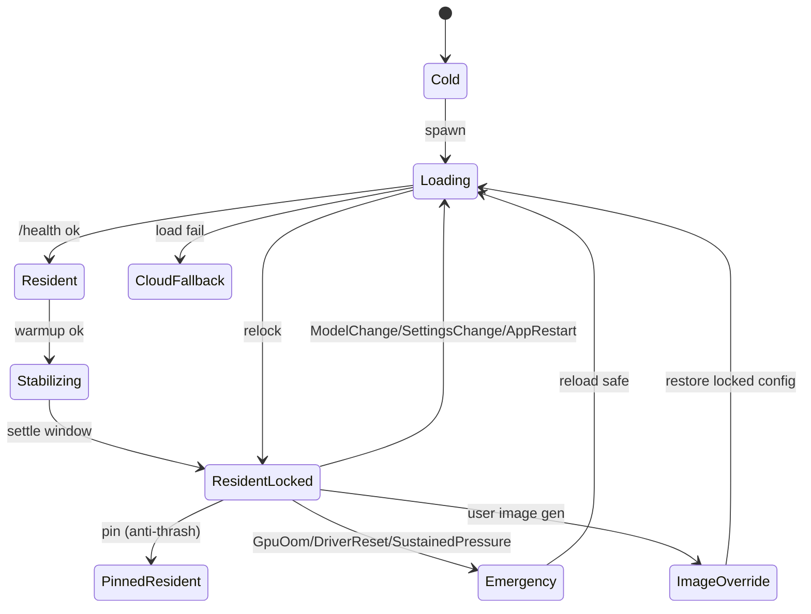
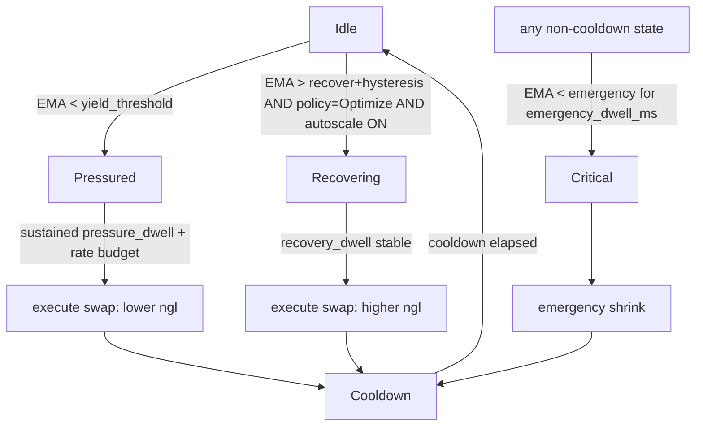
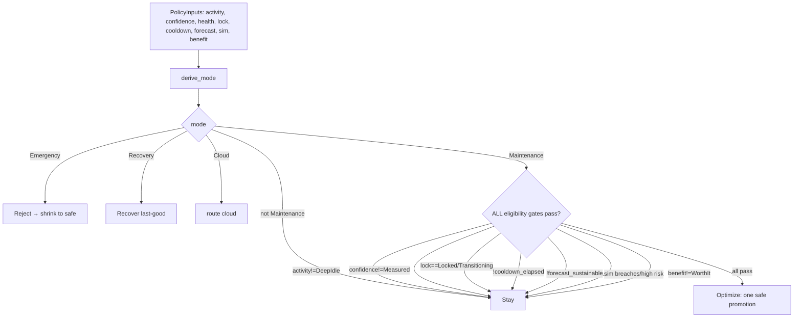

# KRIA GPU Hardware Orchestrator — Architecture & Control Flow (Deep Reference)

> Grounded in the actual code (file paths are real) and the observed runtime on an RTX 4050
> (6141 MB VRAM, `--no-default-features` / no NVML feature). Read top-to-bottom for a full mental
> model; jump to §4–§8 for the live control loops.

---

## 0. The governing law (the single rule everything serves)

> **Never restart the model engine for performance. A process restart (the only way to change
> `n_gpu_layers` in llama.cpp) is permitted ONLY for (a) correctness/safety (OOM, driver reset,
> proven-unsafe state) or (b) an explicit user workflow (image generation, model/settings change).**

Why it exists: `n_gpu_layers` (ngl) is a **launch-time** parameter in llama.cpp. Changing model size
= killing and respawning `llama-server`. That respawn is the "Optimizing GPU layers / LLM server not
reachable" flash. So the whole design minimizes restarts instead of trying to make resize seamless
(impossible for ngl).

Every action is tagged with a disruption class:
- **None** — pure observation / cache reuse. Always allowed.
- **Background** — cloud calls, warm-in-RAM, prewarm into free headroom. Allowed when idle.
- **Restart** — kill + respawn `llama-server` (ngl/ctx change, image Tier-B swap). Forbidden unless law (a)/(b).

---

## 1. Two cooperating planes

```
┌──────────────────────────────────────────────────────────────────────────────┐
│  EXECUTION PLANE  (llm/orchestrator/*)        owns the actual llama-server      │
│  - Orchestrator  : lifecycle façade (start, ensure_ready, snapshot)             │
│  - LlamaServerManager : spawn/kill/health/params/cooldown                       │
│  - GpuWatchdog   : telemetry loop + state machine (EXECUTOR of decisions)       │
│  - strategy      : pure VRAM→(ngl,ctx) sizing  +  gpu_policy tunables           │
│  - telemetry     : TelemetryActor (OS thread, nvidia-smi/NVML)                  │
└───────────────▲───────────────────────────────────────────────▲────────────────┘
                │ reads snapshot                                  │ asks "may I?"
                │                                                 │
┌───────────────┴─────────────────────────────────────────────────┴──────────────┐
│  CONTROL PLANE  (resource/authority/*  +  resource/telemetry_hub.rs)            │
│  - TelemetryHub  : ONE process-wide sampler (single device context)             │
│  - DeviceTable / Planner / Scheduler / Lease  : admission + placement           │
│  - policy (G2/G4/G7) : pure Decision engine  | activity (G6) | benefit (G5)     │
│  - simulator (G4)    : pre-commit feasibility | ResidencyManager + ResidentLock │
│  - CoResidencyManager : multi-model GPU sharing | Journal | Reconciler          │
│  - HraService.admit_gpu → AdmissionGuard  (shadow = inert / enforce = owns)     │
└──────────────────────────────────────────────────────────────────────────────┘
```

- **Execution plane** = the legacy-but-hardened owner that actually runs the model today.
- **Control plane** (HRA) = the authority. Default **shadow** (advises + logs, does not gate);
  under `KRIA_HRA_ENFORCE=1` it becomes the owner of GPU admission.

---

## 2. Component map (real files)

| Component | File | Role |
|---|---|---|
| Orchestrator | `llm/orchestrator/mod.rs` | Top façade. `start()`, `ensure_ready()`, `snapshot()`, L1 lease reconcile. |
| LlamaServerManager | `llm/orchestrator/server_manager.rs` | Spawn/kill `llama-server`, `/health` probe, `current_params()`, `gpu_in_cooldown()`, `has_active_streams()`, GPU failure ceiling. |
| GpuWatchdog | `llm/orchestrator/gpu_watchdog.rs` | Telemetry poll loop + hysteresis state machine. Now an **executor**: routes scale-up through the Policy Engine. |
| Sizing (pure) | `llm/orchestrator/strategy.rs` | `calculate_target_params[_prod/_measured]`, volatility reserve, bounded calibration. |
| GPU policy tunables | `llm/orchestrator/gpu_policy.rs` | Process-global `gpu_autoscale` / `cuda_reserve_mb` / `vram_volatility_cap_mb` (Settings UI + env override). |
| TelemetryActor | `llm/orchestrator/telemetry.rs` | Dedicated OS thread owning NVML/nvidia-smi for the orchestrator/watchdog. |
| Thresholds | `llm/orchestrator/threshold.rs` | Dynamic yield/emergency/recover/hysteresis from total VRAM. |
| TelemetryHub | `resource/telemetry_hub.rs` | The single process-wide sampler (one device context); `sample_now()`. |
| CLI VRAM profiler | `platform/vram.rs` | `CliVramProfiler` (nvidia-smi), `build_profiler()` chain NVML→ROCm→CLI→Null. |
| Policy Engine | `resource/authority/policy.rs` | `RuntimeMode`, `derive_mode`, `decide()`, `decide_image_admission()`, `PolicyLog`. |
| Activity model | `resource/authority/activity.rs` | `Active/Idle/DeepIdle` from runtime signals. |
| Benefit engine | `resource/authority/benefit.rs` | `WorthIt/NotWorthIt` for a proposed restart. |
| Simulator | `resource/authority/simulator.rs` | Pure pre-commit `Estimate` (VRAM/RAM/latency/risk). |
| ResidencyManager + ResidentLock | `resource/authority/residency_manager.rs` | Single transition executor + the lock state machine (G3). |
| CoResidencyManager | `resource/authority/co_residency.rs` | Multi-model GPU residency, preemption, anti-thrash pinning. |
| DeviceTable/Planner/Scheduler | `resource/authority/{device_table,planner,scheduler}.rs` | Admission + deterministic placement + leases/preemption. |
| Journal | `resource/authority/{journal,journal_store}.rs` | Decision journal + crash-safe disk persistence. |
| HraService | `resource/authority/service.rs` | Runtime assembly; `admit_gpu()` → `AdmissionGuard`; shadow/enforce. |
| Consumer bridge | `resource/gpu_lease.rs` | `GpuLeaseManager::acquire_guard_gated` — shadow→legacy / enforce→HRA. |

---

## 3. Telemetry — why there are TWO samplers (intentional)

```
                 ┌───────────────────────────┐
nvidia-smi / NVML│ TelemetryActor (OS thread)│→ watch channel → Orchestrator sizing + GpuWatchdog
   (device)      └───────────────────────────┘     (execution plane; feature-robust under --no-default-features)

                 ┌───────────────────────────┐
nvidia-smi / NVML│ TelemetryHub (1 sampler)  │→ HostSnapshot → shared lease, image barrier, HRA, dashboard
   (device)      └───────────────────────────┘     (control plane; single device context for everyone else)
```

- The **TelemetryActor** exists because the orchestrator must work even when the `nvidia` NVML
  feature is NOT compiled (`cargo tauri dev`). Its nvidia-smi CLI fallback is what makes sizing see
  real VRAM. The hub's profiler is feature-gated and would read 0 in that build — so the orchestrator
  deliberately uses the actor, not the hub.
- The **TelemetryHub** is the single sampler for everything in the control plane (lease recovery,
  image VRAM barrier, HRA snapshot, dashboard) so those readers stay coherent.
- `HubTelemetry` (a former bridge between them) was **dead code and is removed** (G12).

**Cold-start guard (the recent flap fix):** at `start()`, the actor's first poll may not have run yet,
so the very first snapshot can read `total=0`. Sizing on that lands the model on CPU (ngl=0) → endless
scale-up flap. Fix: on a GPU backend, if `total_vram_mb == 0`, force a **fresh synchronous read**
(`TelemetryHub::sample_now` → else one-shot `CliVramProfiler`) before sizing.

---

## 4. STARTUP control flow (`Orchestrator::start`)

```mermaid
flowchart TD
  A[start: detect backend (nvidia-smi)] --> B[spawn TelemetryActor OS thread]
  B --> C[snapshot = telemetry.snapshot()]
  C --> D{GPU backend AND total_vram_mb == 0?}
  D -- yes --> E[FRESH read: TelemetryHub.sample_now / CliVramProfiler]
  D -- no --> F[use snapshot]
  E --> F
  F --> G[calculate_target_params_prod(free_vram, safety+cuda_reserve)]
  G --> H[LlamaServerManager.spawn(ngl, ctx, vision)]
  H --> I[/health probe until ready/]
  I --> J[emit orchestrator:ready + runtime:core_llm_ready]
  J --> K[spawn GpuWatchdog.run loop]
  K --> L[claim L1 lease + reconcile_l1_lease(ngl>0)]
```

Real example on the RTX 4050: `free=5759, total=6141` → `calculate_target_params_prod` →
**ngl=29, ctx=4096 (partial_offload)** — fits 6 GB, loads once, no scale-up needed.

The sizing math (`strategy.rs`, pure):
```
available      = free_vram − (safety_margin + cuda_reserve)      # cuda_reserve default 1024, settable
budget         = available − base_overhead − mmproj
ngl            = min(total_layers, budget / per_layer_vram)
ctx            = clamp(remaining / kv_per_1k, min_context, max_context)
# measured-first variant additionally subtracts a telemetry-variance volatility_reserve and sizes
# for the sustained FLOOR of recent free-VRAM samples, not the instantaneous peak.
```

---

## 5. STEADY STATE — the Resident Lock (G3)



- `ResidentLocked` is the state for ~all of a session: **no resize, no optimization, no migration, no
  automatic restart for performance**. `perf_optimization_eligible()` returns `false` here — the
  structural guarantee that a locked model can never be restarted for performance.
- Only the listed **break conditions** (correctness/safety or explicit user workflow) leave the lock;
  after the reload it returns to `ResidentLocked`.
- `LockState::user_banner()` maps each state to the exact UX string (G10) — locked states are silent
  (no banner). The generic "Optimizing GPU layers" string is banned.

---

## 6. PER-TURN control flow (every prompt)

```mermaid
flowchart TD
  P[prompt dispatched] --> Q[orchestrator_helpers: ensure_ready(reason)]
  Q --> R{has_live_process AND is_healthy AND ngl>0 ?}
  R -- yes (fast path) --> S[claim L1 lease + reconcile + ensure watchdog] --> T[run inference]
  R -- no, ngl==0 idle-suspended --> U[api_load_model + restore slot] --> T
  R -- no live process --> V[respawn llama-server] --> T
```

- The **fast path** (the normal case once locked on GPU) does zero restarts.
- The CPU-suspended / no-process branches are the only per-turn paths that can touch the server, and
  they exist for idle-release resume and crash recovery — not performance.
- A live foreground turn sets `has_active_streams() == true` → activity `Active` → the watchdog/policy
  can only `Stay` (no restart mid-answer).

---

## 7. WATCHDOG state machine (`gpu_watchdog.rs`) — the executor loop

Polls telemetry every `poll_interval_secs`, smooths free VRAM with a 3-sample EMA, and runs:



Anti-thrash guarantees baked in:
- **EMA debounce** — single-sample spikes don't trigger transitions.
- **Hysteresis band** — exit from Pressured needs `EMA > yield + hysteresis`.
- **Dwell timers** — pressure/emergency/recovery must persist before acting.
- **Rate buckets** — separate hourly budgets for normal vs emergency swaps.
- **GPU failure ceiling + cooldown** — after a failed GPU spawn, back off below the failed ngl and
  hold a cooldown (`gpu_in_cooldown()`), so a failing target can't loop (the exact loop your stale log
  showed at ngl 36→33→30).

**G2 demotion:** the scale-UP branch no longer decides on its own. It builds live `PolicyInputs` and
calls `policy::decide`; it only proceeds to `Recovering` on `Action::Optimize`. The whole scale-up
path is also gated by `gpu_autoscale` (**default OFF**). Scale-DOWN under real pressure and the
emergency reflex stay local to the watchdog for sub-second correctness response.

---

## 8. POLICY ENGINE decision flow (`policy.rs`, pure)



Inputs come from:
- **Activity (G6)** — `Active` if streaming/voice/tool/queued or recent input; `DeepIdle` only after a
  quiet dwell with no focus. Only `DeepIdle` permits a perf restart.
- **Mode (G7)** — health dominates activity: Faulted/Pressure→Emergency, Recovering→Recovery,
  LocalUnhealthy→Cloud, else Active→Interactive / DeepIdle→Maintenance.
- **Simulator (G4)** — estimates the swap; a hard-band breach or High risk → `Stay`.
- **Benefit (G5)** — resident-at-good-size ⇒ speedup≈1.0 ⇒ NotWorthIt; CPU→GPU while idle ⇒ WorthIt.
- **Confidence** — `total==0` telemetry ⇒ Unknown ⇒ never optimize (C2/C5).

Default in `Interactive` mode = **`Stay`**. Every decision is journaled via `PolicyLog::emit` (G11).

---

## 9. IMAGE generation flow (the one legitimate restart, G9)

```mermaid
flowchart TD
  IR[image request] --> AD[decide_image_admission(required_vram, llm_vram, state, activity, cloud_ok)]
  AD -- fits free VRAM --> CR[CoResident: no restart — "Preparing image…"]
  AD -- doesn't fit, user Active --> CF[CloudFallback — "Using cloud…"]
  AD -- idle + simulator says safe --> TB[Tier-B: evict LLM→RAM, run image, restore — "Freeing GPU…"→"Restoring chat…"]
  AD -- eviction unsafe/insufficient --> CF
  AD -- no path + cloud off --> RX[Reject with reason]
```

Wired in `image/orchestrator.rs::generate_with_swap`: the admission check runs **before** a Tier-B
restart. If the simulator says eviction can't safely free `required_mb`, it returns early and the
caller routes to cloud — avoiding the doomed local restart/OOM on a tight GPU. Restoration after
Tier-B is deterministic (reuse the locked LLM config), not a fresh sizing decision.

---

## 10. CONTROL-PLANE admission (HRA) & consumer cutover

```
consumer (image/vision/STT/TTS/LLM)
        │  acquire_guard_gated(owner, label, ttl, need_mb)        [resource/gpu_lease.rs]
        ▼
   KRIA_HRA_ENFORCE ?
   ├─ unset (SHADOW)  → legacy GpuLeaseManager grants; HRA logs an advisory verdict (no gating)
   └─ set   (ENFORCE) → HraService.admit_gpu → AdmissionGuard
                              │  LocalAuthority.request_on_gpu → Planner + Scheduler + CoResidencyManager
                              ▼
                       grant / preempt-a-victim / co-reside / deny → guard held for the turn
```

- **LLM** integrates via `Orchestrator::reconcile_l1_lease` (holds an L1 lease in shadow; an HRA
  co-residency admission under enforce).
- **CoResidencyManager** allows multiple models to share the GPU with priority-ordered preemption,
  cooperative revocation, foreground protection, anti-thrash pinning, and refcount dedup.
- Default is **shadow** so the legacy execution plane stays authoritative until a hardware soak proves
  the enforce path (Tasks 62/64).

---

## 11. Configuration & tunables (Settings UI + env override)

| Setting | Config key (`[orchestrator]`) | Settings UI (Hardware tab) | Env override | Default |
|---|---|---|---|---|
| Background GPU auto-upgrade | `gpu_autoscale` | "Allow background GPU auto-upgrade" | `KRIA_GPU_AUTOSCALE` | **false** |
| CUDA runtime reserve (MB) | `cuda_reserve_mb` | "GPU memory reserve (MB)" | `KRIA_CUDA_RESERVE_MB` | 1024 |
| Volatility reserve cap (MB) | `vram_volatility_cap_mb` | "Desktop volatility reserve cap (MB)" | `KRIA_VRAM_VOLATILITY_CAP_MB` | 1536 |
| HRA enforce | (runtime) | — | `KRIA_HRA_ENFORCE` | shadow |
| GPU spawn cooldown | (runtime) | — | `KRIA_GPU_COOLDOWN_SECS` | 120 |

Precedence: **env var > config (Settings UI) > built-in default.** `gpu_policy::apply_settings` is
called at startup and on every settings save, so UI changes are live without a restart.

Plus the watchdog/threshold knobs in `[orchestrator]`: `poll_interval_secs`, `yield/emergency/
recover_threshold_mb`, `hysteresis_band_mb`, `pressure/emergency/recovery_dwell`, `cooldown_secs`,
`max_transitions_per_hour`, `min_ngl_delta[_up]`, `idle_release_*`, `safety_margin_mb`,
`model_profile` (layers, per-layer VRAM, kv, mmproj).

---

## 12. FAILURE & recovery paths

| Failure | Detector | Response |
|---|---|---|
| GPU spawn fails (OOM/timeout) | LlamaServerManager spawn result | record failure ceiling → back off below failed ngl → **CPU recovery spawn** (ngl=0 always fits) → cooldown |
| VRAM pressure (sustained) | watchdog EMA < yield, dwell | scale-DOWN swap (lower ngl) — correctness, allowed |
| Critical VRAM (OOM-imminent) | watchdog EMA < emergency, dwell-ms | emergency shrink immediately |
| Telemetry Unknown (`total==0`) | snapshot | treated as Unknown ≠ 0 → never optimize; cold-start fresh read at boot |
| llama-server crash | `/health` probe + `has_live_process` | `ensure_ready` respawns on next turn |
| Image Tier-B can't free VRAM | `decide_image_admission` + VramBarrier | cloud fallback (no doomed restart) |
| Core/authority restart | Journal + epoch fencing + Reconciler | reclaim orphan PIDs; pre-epoch leases rejected; fail-open default plan |

---

## 13. End-to-end timeline (healthy session, after the fix)

```
boot ─▶ detect Cuda ─▶ fresh VRAM read (5759/6141) ─▶ size ngl=29 ─▶ spawn llama-server
     ─▶ /health ok ─▶ emit core_llm_ready ─▶ footer "Assistant ready"
     ─▶ Resident ─▶ Stabilizing ─▶ ResidentLocked   (silent, stable)
prompt ─▶ ensure_ready FAST PATH (ngl>0, healthy) ─▶ inference ─▶ reply
         (watchdog: Idle; activity Active during turn → policy Stay; NO restart)
idle ─▶ (optional) idle-release after N s ─▶ next prompt resumes via api_load
image ─▶ decide_image_admission ─▶ CoResident or simulator-gated Tier-B or cloud
```

The old (buggy, stale-binary) timeline instead did: `size ngl=0 (CPU)` → watchdog `Recovering` →
`spawn ngl=36` → 60 s timeout → `CPU recovery` → repeat — i.e. the "not reachable" flap. The cold-start
read + measured sizing + autoscale-off removes every step of that loop.

---

## 14. Known gaps (hardware-gated, honest)

- **Task 74** — tune `cuda_reserve_mb` / volatility / benefit thresholds on real silicon; confirm a
  full interactive session has zero perf restarts and the ngl=29 load completes within the health
  timeout. Hardware-only.
- **Tasks 62 / 64** — delete the legacy `GpuLeaseManager` and run the multi-GPU + 24 h enforce soak
  ONLY after the enforce path is hardware-proven. Until then HRA stays in shadow and the execution
  plane is authoritative.

---

## 15. One-paragraph mental model

The orchestrator sizes the model **once**, at startup, from a **fresh measured** free-VRAM reading,
onto the GPU at a size that fits (e.g. ngl=29 on a 6 GB card), then **locks** it. A telemetry-driven
watchdog watches for real danger (VRAM pressure, OOM) and may shrink for safety, but it is now an
**executor** that only performs a performance promotion when a pure **Policy Engine** says all of
{deep-idle, measured telemetry, pre-lock, cooldown elapsed, forecast sustainable, simulator-safe,
benefit worth-it} hold — which, with auto-upgrade default-off, is essentially never during normal use.
Image generation is the one routine restart, and it is user-initiated, simulator-gated, and narrated.
A parallel control plane (HRA) shadows every decision and can become the sole GPU authority under a
flag once hardware soak proves it. The result: load once, lock, stay — no surprise restarts.
```
