# Implementation Plan: Linux OS Control Production

## Overview

This plan implements OSC-001–OSC-036 from backend foundations through prompt-routable Ubuntu desktop capabilities. Work proceeds in strict gates `F0 → F1 → F2 → F3 → F4 → F5`; later work cannot bypass an incomplete safety or provider foundation.

**Status:** Verified 2026-08-13 against the codebase by running the tests, not
against prior checkbox state.

**The pipeline now actually operates the host.** The single blocker — the governed
child-process launcher — is built, and every live provider read is implemented.
Verified by execution:

| Gate | Result |
|---|---|
| `cargo test -p kria-core --no-default-features --features os-control-test --lib` | **5429 passed, 0 failed**, 2 ignored (77s) |
| `tests/os_control_command_launcher.rs` | 12 passed |
| `tests/os_control_bluetooth_lifecycle.rs` | 9 passed |
| `tests/os_control_prompt_contract.rs` | 22 passed |
| `tests/os_control_capability_catalog.rs` | 6 passed |
| `tests/os_control_governed_pipeline.rs` | 5 passed |
| `tests/os_control_handler_wiring.rs` | 4 passed (ratchet 72) |
| `tests/os_control_audio_lifecycle.rs` | 8 passed |
| `cargo check -p kria-desktop` / `--features os-control-live` | 0 errors each |
| `examples/live_smoke` on the real host | 15 domains composed, snapshot rev 1 |

### What changed to get here

1. **`StructuredCommandRequest::dispatch()` was itself a placeholder** returning
   `"live structured-command launch is not composed in this build"`. It is now
   `linux/command_launch.rs`, the single place in KRIA that spawns a process:
   hermetic allowlisted environment, null stdin, bounded output drained to EOF,
   own process group, deadline and cancellation. It preserves the error type's
   invariant — every variant is named `…BeforeMutation`, so an `Err` *means*
   provably no effect. After `spawn()` succeeds an interruption can only return
   `Ok(Uncertain)`.
2. **`linux/structured_query.rs`** adds the read counterpart: the same
   containment, minus the authority a mutation needs, because a read changes
   nothing and takes no lease.
3. **All live provider reads implemented** — 60 fail-closed placeholders reduced
   to **0**. Parsers live in each domain's `selection.rs` and every one of them
   fails closed: unparseable output is an error, never a default, because a
   fabricated observation would let a mutation "verify" against a fact nobody
   read.
4. **D-Bus / syscall mutations wired**: `linux/signal.rs` (shared signal
   transport with PID-reuse protection), udisks mount/unmount/eject, notifications,
   secret-service store/replace/delete over the existing D-Bus seam.
5. **A governed secret stdin channel** (`SecretStdin`) so clipboard and credential
   payloads never enter argv, the argv digest, an audit record, or
   `/proc/<pid>/cmdline`.
6. **The privilege broker's client path** — real Unix-socket transport with a nonce
   preamble, live Polkit authorizer via `pkcheck`, two implemented privileged
   operations, and a `kria-os-broker` daemon. Deliberately **not installed**; see
   `deploy/broker/README.md`.

### What remains

* **72 frozen manifest tools still have no handler** (F3–F5 breadth). The
  `UNIMPLEMENTED_TOOL_BUDGET` ratchet in `tests/os_control_handler_wiring.rs`
  enforces that this number may only shrink.
* **Per-domain lifecycle suites** for 9 domains still need their test doubles
  before the `[-]` tasks can be certified.
* **Four of six broker operations** (package plans, firewall, privacy controls,
  printers) report *unsupported* — declared honestly rather than half-implemented.
* The broker's replay store is in memory; grant expiry is the backstop.

Marks are `[x]` only where the task's own listed tests are observed passing.
Full audit trail: `stage1-audit-report.md`.

## Checkbox Legend

- `[ ]` Not implemented under this specification.
- `[-]` Partially implemented but missing required code-level evidence.
- `[x]` Implemented with the listed code-level tests and checks passing.

Existing code may be reused, but its presence does not pre-check a task. Each task closes only when the target architecture, safety path, provider injection, verification behavior, and focused code tests are complete.

## Execution Contract

- Inspect target files before each task and adapt existing modules rather than creating a parallel tool stack.
- Keep `kria-core` authoritative; Tauri/Axum/UI changes are limited to composition or additive presentation fields.
- Preserve existing Tauri and WebSocket command/event names.
- Use a hard cutover from direct Linux subprocess handlers once provider parity is established; delete superseded code and tests.
- Use exact dependency versions and existing workspace dependencies wherever possible.
- Every mutating slice includes parsing, preflight, provider operation, verification, audit redaction, error mapping, routing, and unit tests.
- Tests are code-level only. They must use fake providers, fake D-Bus proxies, private in-process buses, temporary directories, captured structured command requests, and deterministic fixtures.
- Never run live suspend, hibernate, shutdown, reboot, logout, Wi-Fi, VPN, Bluetooth, firewall, display-mode, package, update, mount, notification, clipboard, microphone, printer, or session mutations as part of this spec's validation.
- Do not add ignored live tests as completion evidence. A later validation plan will own real-device and disruptive campaigns.
- Run focused tests serially on the owner laptop under `--no-default-features --features os-control-test`; escalate from the corresponding deny-live `cargo check -p kria-core` only when a phase gate requires it.

## Notes

Tasks name target files subject to repository discovery. Preserve existing ownership and relocate implementation rather than duplicating it. A task may be checked only when its implementation and focused code-level evidence exist; no live host behavior is claimed.

## Task Dependency Graph

```mermaid
flowchart LR
  T01[0.1 Spec/legacy inventory freeze] --> T02[0.2 BLACK scope]
  T01 --> T04[0.4 Test safety]
  T02 --> T03[0.3 Policy reconciliation]
  T03 --> T11[1.1 Base contracts and grants]
  T04 --> T11
  T11 --> T12[1.2 Registry/runtime injection]
  T11 --> T16[1.6 Resource primitives]
  T12 --> T16
  T12 --> T13[1.3 Capability probing]
  T12 --> T18[1.8 Audit admission/recovery]
  T16 --> T18
  T13 --> T17[1.7 Runtime sealing/verification]
  T16 --> T17
  T18 --> T17
  T17 --> T14[1.4 Structured fallback]
  T17 --> T15[1.5 Privileged broker]
  T18 --> T15
  T15 --> T19[1.9 Rollback]
  T17 --> T19
  T18 --> T19
  T12 --> T110[1.10 Secrets/grants]
  T13 --> T110
  T17 --> T110
  T18 --> T110
  T11 --> T111[1.11 Prompt contract harness]
  T12 --> T111
  T13 --> T111
  T14 --> T111
  T15 --> T111
  T16 --> T111
  T17 --> T111
  T18 --> T111
  T19 --> T111
  T110 --> T111
  T111 --> T21[2.1 Audio]
  T111 --> T22[2.2 Display]
  T111 --> T23[2.3 Connectivity]
  T111 --> T24[2.4 Power]
  T21 --> T25[2.5 Remaining existing tools]
  T22 --> T25
  T23 --> T25
  T24 --> T25
  T25 --> T26[2.6 Delete direct paths]
  T26 --> G3[3.1-3.4 and 3.6-3.9]
  T26 --> T35[3.5 Connectivity consumer]
  T35 --> T310[3.10 Secret/skill integration]
  T110 --> T310
  G3 --> T311[3.11 F3 gate]
  T310 --> T311
  T311 --> F4[F4 Important v1 completeness]
  F4 --> F5[F5 v2 scope and hardening]
```



```json
{
  "waves": [
    { "wave": 0, "tasks": ["0.1"], "dependsOn": [], "description": "Freeze the normative manifest and record legacy differences without runtime implementation" },
    { "wave": 1, "tasks": ["0.2", "0.4"], "dependsOn": ["0.1"], "description": "BLACK-scope containment and mutually exclusive host-safe test composition" },
    { "wave": 2, "tasks": ["0.3"], "dependsOn": ["0.1", "0.2"], "description": "Reconcile ExecutionGate, command policy, and extension CapabilityPlatform authority" },
    { "wave": 3, "tasks": ["1.1"], "dependsOn": ["0.1", "0.2", "0.3", "0.4"], "description": "Base IDs, grants, narrow receipt sums, durable decisions, and exact errors" },
    { "wave": 4, "tasks": ["1.2"], "dependsOn": ["1.1"], "description": "Strict registry metadata and OsControlRuntime injection" },
    { "wave": 5, "tasks": ["1.3", "1.6"], "dependsOn": ["0.1", "1.1", "1.2"], "description": "Capability probes and deterministic resource-lease primitives" },
    { "wave": 6, "tasks": ["1.8"], "dependsOn": ["1.1", "1.2", "1.6"], "description": "Append-only audit admission/tokens, redaction, terminal idempotency, and incomplete-admission recovery" },
    { "wave": 7, "tasks": ["1.7"], "dependsOn": ["1.1", "1.2", "1.3", "1.6", "1.8"], "description": "Runtime mutation-permit sealing, narrow state transitions, and typed verification" },
    { "wave": 8, "tasks": ["1.4", "1.5"], "dependsOn": ["0.3", "1.2", "1.3", "1.6", "1.7", "1.8"], "description": "Governed structured fallback and closed six-operation broker protocol" },
    { "wave": 9, "tasks": ["1.9"], "dependsOn": ["1.5", "1.7", "1.8"], "description": "Rollback and compensation coordination" },
    { "wave": 10, "tasks": ["1.10"], "dependsOn": ["1.2", "1.3", "1.7", "1.8"], "description": "Secret Service and extension sandbox grants" },
    { "wave": 11, "tasks": ["1.11"], "dependsOn": ["1.1", "1.2", "1.3", "1.4", "1.5", "1.6", "1.7", "1.8", "1.9", "1.10"], "description": "Full fake-backed prompt-to-provider execution harness" },
    { "wave": 12, "tasks": ["2.1", "2.2", "2.3", "2.4"], "dependsOn": ["1.11"], "description": "Migrate initial audio, display, connectivity, and power slices" },
    { "wave": 13, "tasks": ["2.5"], "dependsOn": ["2.1", "2.2", "2.3", "2.4"], "description": "Apply proven migration patterns to remaining existing OS tools" },
    { "wave": 14, "tasks": ["2.6"], "dependsOn": ["2.1", "2.2", "2.3", "2.4", "2.5"], "description": "Delete superseded direct execution paths" },
    { "wave": 15, "tasks": ["3.1", "3.2", "3.3", "3.4", "3.5", "3.6", "3.7", "3.8", "3.9"], "dependsOn": ["2.6"], "description": "Complete critical daily desktop domain providers" },
    { "wave": 16, "tasks": ["3.10"], "dependsOn": ["1.10", "3.5"], "description": "Integrate Secret Service with connectivity and then-current consumers; later domains integrate in their owning tasks" },
    { "wave": 17, "tasks": ["3.11"], "dependsOn": ["3.1", "3.2", "3.3", "3.4", "3.5", "3.6", "3.7", "3.8", "3.9", "3.10"], "description": "F3 prompt and code validation gate" },
    { "wave": 18, "tasks": ["4.1", "4.2", "4.3", "4.4", "4.5", "4.6", "4.7", "4.8", "4.9"], "dependsOn": ["3.11"], "description": "Important v1 completeness domains" },
    { "wave": 19, "tasks": ["4.10"], "dependsOn": ["4.1", "4.2", "4.3", "4.4", "4.5", "4.6", "4.7", "4.8", "4.9"], "description": "v1 code-completeness gate" },
    { "wave": 20, "tasks": ["5.1", "5.2", "5.3", "5.4", "5.5", "5.6"], "dependsOn": ["4.10"], "description": "Frozen v2 provider and tool contracts" },
    { "wave": 21, "tasks": ["5.7"], "dependsOn": ["5.1", "5.2", "5.3", "5.4", "5.5", "5.6"], "description": "Re-prove deferred and BLACK boundaries" },
    { "wave": 22, "tasks": ["5.8"], "dependsOn": ["5.7"], "description": "Final hard cutover and dead-code deletion" },
    { "wave": 23, "tasks": ["5.9"], "dependsOn": ["5.8"], "description": "Final traceability and implementation-readiness gate" }
  ]
}
```

Within each wave, listed tasks may use bounded independent work, but every `dependsOn` task must be complete first. The F1 safety-critical path is `0.1→0.2→0.3→1.1→1.2→1.6→1.8→1.7→1.5→1.9→1.11`; `0.4`, `1.3`, `1.4`, and independently ordered `1.10` join at their declared barriers. Task `2.5` starts only after patterns `2.1–2.4`; Task `3.10` integrates the F1 secret foundation with the F3 connectivity/current consumers, while later credential consumers integrate in their owning tasks. Later phase gates are explicit waves and do not weaken task-level prerequisites.

## Tasks

## F0 — Contract, Scope, and Safety Freeze

- [-] 0.1 Freeze the canonical capability and tool contract inventory

  **Objective:** Record the already-normative §§10.1–10.4 closed manifest — including the total output-type, slash-risk resolver, §13.1 rollback-claim, and single-ID trace tables — plus a truthful legacy-difference inventory before runtime behavior changes; this task makes no registry/provider implementation claim.
  **Targets:** `.kiro/specs/linux-os-control-production/*`; read-only inventory of `crates/kria-core/src/tools/registry.rs`, router/fallback/policy references; new deterministic contract-manifest fixture under the OS-control test fixtures.
  **Prerequisites:** Approved OSC-001–OSC-036 and normative design §§4, 10, 12, and 14.
  **Invariants:** Existing Tauri/WebSocket event names do not change; BLACK operations are absent; no alias conceals drift; every operation has exactly one frozen schema/output/target/resume/resource/provider/risk/verification/rollback/redaction/requirement/task/oracle entry; implementation does not choose missing metadata.
  **Implementation:** Transcribe the normative manifest without altering production registration; inventory every live name/schema/tier/router/provider reference as `match`, `replace`, or `delete`; record explicit hard-cutover work in the owning later task. Any missing/ambiguous normative value requires a spec amendment before 0.1 can close.
  **Failure behavior:** Duplicate, orphaned, aliased, placeholder, unclassified, non-total, or missing trace entries fail the manifest validator; a legacy difference is reported, not silently normalized.
  **Code-level validation:** Pure fixture/schema tests parse the complete manifest, enforce closed IDs and reverse orphans, and assert one exact requirement/provider/task/oracle edge per operation; a bidirectional design↔manifest parity oracle asserts that `operation-contracts.json` and design §§10.1–10.3 agree on the exact tool-name set (149) and on every operation's phase, resolved risk, output-type resolution, and §13.1 `rollbackClaim`, and that §13.1 buckets are mutually exclusive and total over all mutation rows; the closed schema graph is fully reachable with zero dangling or orphan definitions; no production registry mutation and no provider invocation.
  **Failure behavior (additional):** Any tool-name, phase, risk, output-type, or rollback-claim disagreement between the JSON manifest and the design tables, any double-bucketed or unbucketed mutation row, or any unreachable/dangling schema definition fails the parity oracle before implementation proceeds.
  **Completion proof:** One versioned manifest exactly projects §§10.1–10.4, the parity oracle passes with zero design↔manifest disagreements, the schema graph is closed, and a complete truthful legacy-difference report exists; strict runtime registry implementation remains owned by Task 1.2.
  **IDs:** OSC-003, OSC-004, OSC-009, OSC-035, OSC-036.

- [-] 0.2 Freeze BLACK scope and raw-shell containment

  **Objective:** Ensure prohibited administration cannot be reached through normal tools, prompt routing, automation, recovery, or provider fallback.
  **Targets:** `safety/policy.rs`; `safety/policy_gate.rs`; `tools/shell.rs`; routing and workflow admission modules.
  **Prerequisites:** 0.1.
  **Invariants:** Structured approved actions are not blocked merely because their underlying system operation is dangerous; generic shell remains separately restricted.
  **Implementation:** Add explicit prohibited capability IDs; remove aliases that route OS administration to Bash; gate shell behind Expert Mode; prohibit unattended shell and secret interpolation; keep command-level destructive blocks for generic execution.
  **Failure behavior:** A normal prompt for BLACK scope returns refusal/handoff and never a tool call.
  **Code-level validation:** Table-driven policy and routing tests for partitioning, formatting, GRUB, kernel, users, raw firewall, firmware flash, fan control, PKI, SELinux/AppArmor, systemd-unit creation, and privilege bypass.
  **Completion proof:** All prohibited fixtures are blocked before provider/resource acquisition.
  **IDs:** OSC-002, OSC-004, OSC-030.

- [-] 0.3 Reconcile the two existing policy paths

  **Objective:** Establish `ExecutionGate`/`OsControlRuntime` as the only native OS admission authority while retaining command policy and `CapabilityPlatform` only in their narrower roles.
  **Targets:** `agent/execution_gate.rs`; `agent/gui_wiring.rs`; `agent/resume_executor.rs`; `safety/policy.rs`; `safety/policy_gate.rs`; `tools/subprocess_executor.rs`; `tools/capability_dispatch.rs`; `capability/{platform,permission,grants,provider}.rs`.
  **Prerequisites:** 0.1–0.2.
  **Implementation:** Make `ExecutionGate` authoritative for typed native OS actions; make command policy subordinate fixed-executable/argv validation; exclude native OS descriptors/providers from `CapabilityPlatform`; require extension-requested host effects to re-enter a canonical OS tool under a scoped skill grant; remove target/approval overrides for OS tools; prohibit extension grants from authorizing OS mutation; preserve strict generic-shell and extension permission behavior.
  **Code-level validation:** Fake policy tests prove typed reboot requires the OS action grant while generic `reboot` remains blocked; changed argv/action/target/resource invalidates authority; `CapabilityPlatform::execute`, `DefaultPermissionEngine`, `GrantStore`, GUI override, and resume paths cannot directly obtain/invoke `HostOsControl` or bypass `ExecutionGate`.
  **Completion proof:** There is one native OS admission/provider path; extension discovery and command defense-in-depth cannot approve, execute, or broaden it.
  **IDs:** OSC-001, OSC-002, OSC-004.

- [-] 0.4 Establish code-test safety rules

  **Objective:** Make accidental live OS mutation impossible in unit and integration completion tests, including when the library is compiled without `cfg(test)`.
  **Targets:** `Cargo.toml`; new `os_control/testing.rs`; provider/transport constructors; desktop/server composition roots; focused test command manifest.
  **Prerequisites:** 0.1.
  **Implementation:** Add mutually exclusive `os-control-test` and `os-control-live` features with `compile_error!` when combined; require all completion tests to use `--no-default-features --features os-control-test`; remove real bus/process/session/Polkit/secret/device constructors from the test feature; require a non-exported composition-root `LiveHostAccessToken` for live provider construction; install a process-wide panic sentinel on raw transports; tag fake receipts and centralize temp/in-memory fixtures.
  **Code-level validation:** Integration-test fixture proves no live constructor/token symbol is reachable; dual-feature compile-fail fixture; missing fake returns `Unavailable`; sentinel proves captured-command/private-bus suites launch no child or live bus/session/device access; test-manifest linter rejects unsafe Cargo invocations.
  **Completion proof:** Every completion-test binary is built in deny-live composition and can run in the active desktop session without observable OS mutation.
  **IDs:** OSC-033, OSC-034.

## F1 — Runtime and Provider Foundation

- [-] 1.1 Create base `os_control` contracts, grants, receipt sums, and canonical errors

  **Objective:** Implement provider-independent bounded IDs/DTO foundations, unforgeable grants, narrow dispatch/receipt sum types, durable OS decisions, availability/evidence metadata, and the frozen pre-mutation error envelope; lease-bound mutation-context sealing is deliberately deferred until Tasks 1.6, 1.8, and 1.7.
  **Targets:** new `crates/kria-core/src/os_control/{mod,contract,error,receipt,context}.rs`; `agent/{execution_gate,collaborative_decision,gui_wiring,resume_executor}.rs`; `safety/hitl.rs`; SQLite decision migration; `lib.rs`.
  **Prerequisites:** F0 complete.
  **Invariants:** DTOs contain no model prose; only `ExecutionGate` constructs grants; `OsControlError` proves no effect started; providers return only narrow `ApplyOutcome` payloads; private runtime receipt states make invalid combinations unrepresentable; OS approvals are SQLite-durable and fail closed; asynchronous session-ending actions use `AcceptedDispatch`.
  **Implementation:** Add typed bounded IDs/values; private grants bound to session/action/parameter/host-target/resource-set/risk/decision/capability revision/expiry; make gate proceed/ready carry grants; hard-migrate OS `InteractionDecision` creation/resolution from JSONL/in-memory fallback to SQLite transactions; remove OS target/approval override-and-continue paths; implement private `RuntimeReceiptState`, narrow dispatch wrappers, derived read-only receipt views/accessors, safe summaries, `Recorded|PendingRecovery` audit state, and exact success/error envelopes. Declare the mutation-context interfaces but do not claim their constructor until Task 1.7.
  **Failure behavior:** Decision create/resolve persistence failure, malformed input, stale/forged grant, or proven pre-dispatch failure returns the closed pre-mutation error set and no provider call. Post-dispatch facts can inhabit only their matching narrow wrapper; terminal audit interruption is represented only as `PendingRecovery`.
  **Code-level validation:** SQLite decision migration/replay and persistence-failure denial; no in-memory OS fallback; raw UI approval without committed resolution yields no grant; compile-fail/private-constructor tests for forged grants and every forbidden receipt cross-product (`Verified+Uncertain`, `Accepted+Applied`, partial without steps, rollback failure in unrelated states); exhaustive state transitions; envelope/redaction snapshots and `Send + Sync` assertions.
  **Completion proof:** Every base pre/post-dispatch fact has exactly one representable contract state, while mutation-capable context construction remains impossible until the explicitly dependent resource/audit/runtime tasks complete.
  **IDs:** OSC-001, OSC-005, OSC-006, OSC-029.

- [-] 1.2 Implement strict registry metadata and inject `OsControlRuntime`

  **Objective:** Implement the frozen operation manifest in `ToolRegistry` and give every OS-facing handler an injected `Arc<OsControlRuntime>` while keeping raw `HostOsControl` private behind runtime composition.
  **Targets:** `tools/registry.rs`; `tools/mod.rs`; `tools/availability.rs`; desktop/server composition roots; generated/checked manifest snapshot.
  **Prerequisites:** 1.1.
  **Implementation:** Replace flat `ParamDef` with the frozen closed nested/enum/bounded schema representation; add the single `ToolContractMetadata` with output/target/resume/resource/provider/risk/verification/rollback/redaction/trace/oracle fields; add typed registration and runtime setter/getter; replace parallel resume metadata; make duplicate definition/handler/alias and manifest drift typed construction errors; ensure core-only registries register honest unavailable handlers; preserve provenance injection. Handlers receive runtime, not raw provider ports.
  **Failure behavior:** Missing runtime/provider returns the frozen `Unavailable` envelope before admission and never falls back to `LocalEnvironment` or direct host subprocess. Duplicate, incomplete, orphaned, unclassified, or inconsistent registration fails construction rather than overwrite.
  **Code-level validation:** Exact §§10.1–10.4 manifest snapshot; strict nested schemas with `additionalProperties:false`; reverse-orphan/trace/oracle tests; injection, clone/context, unavailable registry, duplicate/inconsistent registration, fake call-log, and panic-sentinel tests proving no raw environment/provider access.
  **Completion proof:** The live registry exactly implements the F0 manifest, every OS handler is fake-testable through runtime, and no tool/skill can obtain raw `HostOsControl`.
  **IDs:** OSC-001, OSC-003, OSC-009, OSC-033.

- [-] 1.3 Implement `SessionContext` and capability probing

  **Objective:** Detect operation-level support for Ubuntu X11/Wayland without release-version branching.
  **Targets:** `os_control/capability.rs`; `context.rs`; `linux/{mod,probe,dbus}.rs`.
  **Prerequisites:** 1.1–1.2.
  **Implementation:** Normalize environment hints; probe session/system bus, service owners, interfaces, methods/properties, portal availability, desktop family, binaries and permissions; cache per domain; subscribe/invalidate on owner/session changes.
  **Failure/degraded behavior:** Partial probes preserve supported operations and explain unavailable ones; timeout yields degraded snapshot.
  **Code-level validation:** Scripted probe matrix for GNOME Wayland, GNOME X11, KDE Wayland, absent bus, stale env vars, service restart, unknown future interface fields, and timeouts.
  **Completion proof:** Capability snapshots are deterministic, redacted, bounded, and operation-specific.
  **IDs:** OSC-003, OSC-031, OSC-032.

- [-] 1.4 Implement governed structured-command fallback

  **Objective:** Replace direct `Command`, `ExecWrapper`, and `sh -c` usage in OS providers with one host-bound argv executor.
  **Targets:** `os_control/linux/structured_command.rs`; `infra/environment/*`; `tools/subprocess_executor.rs` as adapted or superseded; command adapters.
  **Prerequisites:** 0.3, 1.2–1.3, 1.6–1.8.
  **Invariants:** No shell; no target ambiguity; no unbounded output; no approval inside executor.
  **Implementation:** Replace/adapt `SubprocessExecutor` with an internal host-only request constructible only from borrowed `AdmittedMutationContext`, carrying typed capability/grant, resource/audit bindings, trusted absolute executable identity, exact argv digest, allowlisted environment/locale, cancellation/deadline/output bounds and redaction map; make command policy subordinate with no second approval/custom-rule authority; classify timeout/cancel after dispatch as sum-typed uncertain outcome; delete raw command/output audit.
  **Failure behavior:** Invalid/mismatched/expired grants, target ambiguity, executable drift, argument mismatch, and pre-dispatch timeout/cancel return pre-mutation errors. After dispatch, return a receipt-bound uncertain/partial outcome and never try a second mutator.
  **Code-level validation:** Captured argv golden tests, trusted-executable identity and argv/grant mismatch tests, metacharacter-as-literal tests, timeout/cancel/output-limit tests, host-target rejection, subordinate-policy/no-second-approval tests, and secret/command/output redaction tests; no process launches.
  **Completion proof:** Provider fallback tests launch no process and assert exact bounded `CommandRequest` values.
  **IDs:** OSC-002, OSC-005, OSC-007.

- [-] 1.5 Implement the typed Polkit privilege broker

  **Objective:** Implement the exact six-operation request boundary and closed effect-aware response protocol in design §12.
  **Targets:** new broker protocol in `kria-core`; minimal privileged broker binary/crate; Polkit action/policy packaging; desktop composition; fake broker.
  **Prerequisites:** 1.2–1.3 and 1.6–1.8.
  **Invariants:** The only operation variants are `ApplyPackagePlan`, `SetBoundPathOwnership`, `SetFirewallEnabled`, `SetPrivacyControl`, `ConfigureDiscoveredPrinter`, and `SetBatteryChargeThresholds`; no generic command/file-write/D-Bus/device/service/run-as-root/firmware/repository operation; every request and response is caller-, grant-, action-, parameter-, host-target-, resource-, audit-admission-, operation-, nonce-, and expiry-bound.
  **Implementation:** Implement canonical length-prefixed CBOR `BrokerRequestV1`, `BrokerResponseV1`, `BrokerResponseBinding`, the closed `BrokerPreDispatchError`, and `BrokerDispatchOutcome`; enforce framing/64 KiB/deadline limits, authenticated local caller, persistent nonce replay semantics, exact echoed bindings, plan/path/provider/identity/options/percentage checks, fixed native operations, Polkit, and bounded normalized evidence without raw output.
  **Failure behavior:** Authentication/binding/replay/expiry/version/variant/parameter/stale-identity/unsupported-adapter/Polkit/timeout-before-dispatch errors return only `NotDispatched`. Once dispatch may have occurred, return only `Dispatched::{Applied,Uncertain,PartiallyApplied}`; transport loss is uncertain and no broader fallback runs.
  **Code-level validation:** Canonical protocol round-trip/golden tests; schema closure enumerates six operations, two response families, exact pre-dispatch codes, duplicate/unknown/trailing/oversized frame rejection; fake transport replay cache, expiry, caller/resource/audit/operation/nonce/response-echo mismatch tests; post-dispatch loss maps to uncertain; negative fixtures prove BLACK/generic operations and raw output cannot encode; packaging/Polkit parse tests start no privileged process.
  **Completion proof:** Every broker-backed row names one exact operation and receives one bound effect-aware response; no other privilege or response escape hatch exists.
  **IDs:** OSC-001, OSC-002, OSC-004, OSC-007, OSC-030, OSC-033.

- [-] 1.6 Extend resource leasing for OS domains

  **Objective:** Serialize conflicting subsystem changes while allowing safe observations.
  **Targets:** `agent/resource_lease.rs`; `agent/execution_gate.rs`; `os_control/resource.rs`.
  **Prerequisites:** 0.1, 1.1, and 1.2.
  **Implementation:** Add typed resource kinds/scopes and deterministic ordering for all §10 operations; compute the canonical resource-set digest stored in `ExecutionGrant`; return a non-cloneable `AcquiredResourceLeaseSet` exposing only private matching evidence required by later runtime sealing.
  **Code-level validation:** Mapping tests for every §10 tool, conflict matrix and ordering/deadlock tests, read/write coexistence, digest mismatch/stale lease/drop tests, and compile-fail proof that provider/tool modules cannot construct or clone lease evidence.
  **Completion proof:** Every mutating canonical tool declares at least one precise resource, no global unknown scope is valid, and Task 1.7 can consume the sealed lease evidence without broadening its authority.
  **IDs:** OSC-008, OSC-009.

- [-] 1.7 Seal the mutation runtime and implement postcondition verification

  **Objective:** After resource and audit primitives exist, make admitted mutation invocation compile-time enforceable and construct terminal receipt states from typed verification without GUI replanning.
  **Targets:** `os_control/{runtime,context,receipt}.rs`; `agent/execution_verifier.rs` additive evidence sources/classes.
  **Prerequisites:** 1.1–1.3, 1.6, and 1.8.
  **Invariants:** Only `OsControlRuntime` constructs the private non-cloneable `MutationPermit`/`AdmittedMutationContext`; it must borrow the exact held lease set and matching committed audit token. `HostExecutionContext` remains observation-only. Providers return `ApplyOutcome`, never receipts.
  **Implementation:** Match session/action/parameter/target/resource/revision/expiry bindings; seal the borrowed permit; define equality/tolerance predicates, freshness deadlines, evidence ordering, provider identity, normalized observation digest/revision, accepted-action semantics, contradiction and unobservable outcomes; construct only the narrow private receipt state allowed by the dispatch wrapper; prohibit verifier retry/replan and provider redispatch.
  **Code-level validation:** Compile-fail/source-enumeration tests require `&AdmittedMutationContext` on every mutating specialized port and prove handlers/providers cannot forge it; absent/mismatched/stale lease/audit/grant tests call no provider; fake observe/apply/reobserve sequences cover unchanged, verified, accepted, unverified, post-dispatch reported failure, uncertain, partial, contradictory, rollback-eligible, timed-out, and stale states; exhaustive forbidden cross-product tests; shell output cannot outrank authoritative state.
  **Completion proof:** No provider mutation can be called before exact leases and audit admission, no synchronous adapter can emit `Verified` without fresh satisfying evidence, and only runtime can construct a terminal receipt.
  **IDs:** OSC-005, OSC-006, OSC-008.

- [-] 1.8 Implement durable audit admission, redaction, and reconciliation

  **Objective:** Provide the resource-bound audit token needed by runtime sealing, record each request as one logical append-only SQLite action, reconcile incomplete terminals safely, and present only the same redacted projection to HITL.
  **Targets:** `safety/{audit,hitl}.rs`; `agent/{collaborative_decision,gui_wiring,resume_executor}.rs`; `os_control/{audit,redaction}.rs`; SQLite migration; composition wiring.
  **Prerequisites:** 1.1, 1.2, and 1.6.
  **Implementation:** Hard-migrate `AuditLogger` to fallible one-admission/idempotent-one-terminal records; admit after read policy/resource derivation and before pre-observation, then retain the same action/token for no-op or mutation; issue non-cloneable observation/mutation-capable admission tokens bound to session/action/parameter/target/capability/resource/recovery digests but not to the later grant; add unique terminal-parent constraint, indexed incomplete scan, bounded startup/health reconciliation, safe pre-dispatch recovery payload, and `OutcomeUnknownAfterCrash`; replace raw HITL parameter JSON/formatted descriptions with `ApprovalProjection`; share one sensitivity registry; delete in-place completion updates and best-effort OS subprocess audit.
  **Failure behavior:** Mutation and privacy-sensitive-read admission failure is pre-provider fail-closed. Terminal persistence interruption returns `PendingRecovery`, marks audit unhealthy, blocks subsequent automatic mutations, and never causes provider redispatch; concurrent/replayed terminal append is idempotent and a digest conflict remains unhealthy.
  **Code-level validation:** In-memory migration; one admission across read/preflight/no-op/mutation; admission-terminal cardinality/unique constraint/links; token/lease/grant mismatch; admission failure causes zero provider calls; terminal interruption, process-restart scan, known-summary recovery, unknown-after-crash recovery, concurrent retries and no-redispatch sentinel; hash tampering/bounded scans; raw `params` source scan and full redaction corpus.
  **Completion proof:** Every admitted action has one admission and at most one terminal at any instant; every terminal runtime outcome eventually has exactly one terminal after bounded recovery; incomplete admissions are detectable, approval uses only redacted projection, and forbidden values are absent from durable/presentation/trace fixtures.
  **IDs:** OSC-001, OSC-007, OSC-023, OSC-025, OSC-029.

- [-] 1.9 Implement rollback coordinator and compensation contract

  **Objective:** Restore prior state only where reliable and report partial state honestly.
  **Targets:** `os_control/runtime.rs`; `receipt.rs`; existing safety rollback code if suitable.
  **Prerequisites:** 1.5, 1.7, and 1.8.
  **Implementation:** Opaque expiring tokens, capability ownership, action linkage, reverse-order compensation, rollback admission/verification/audit, and non-reversible declarations.
  **Code-level validation:** Token expiry/action mismatch, successful rollback, rollback contradiction, multi-step partial compensation and non-reversible denial.
  **Completion proof:** Rollback availability in results exactly matches implemented provider behavior.
  **IDs:** OSC-006, OSC-028.

- [ ] 1.10 Implement Secret Service and sandbox-grant foundation

  **Objective:** Establish opaque credential references and scoped skill grants before connectivity and other credential-consuming domains are completed.
  **Targets:** `os_control/secrets/*`; `os_control/sandbox/*`; Secret Service adapter; existing OpenClaw capability/audit integration.
  **Prerequisites:** 1.2, 1.3, 1.7, and 1.8.
  **Implementation:** Define non-serializable secret payload wrapper, metadata/reference DTOs, provider-only resolution, store/delete operations, locked-service behavior, domain-operation grant schema, expiry and revocation.
  **Failure behavior:** No plaintext fallback; locked/unavailable service and invalid grants fail closed.
  **Code-level validation:** Fake store/grant authority, serialization/debug leakage tests, locked collection, purpose/scope mismatch, expiry/revocation, audit digest-only behavior.
  **Completion proof:** A scripted provider can consume a secret under a valid grant while model/tool/audit snapshots contain no payload.
  **IDs:** OSC-007, OSC-025, OSC-026, OSC-029.

- [x] 1.11 Wire prompt-to-provider in-process contract harness

  **Objective:** Verify code flow from prompt routing through handler/provider/result without touching the host.
  **Targets:** `agent/router.rs`; fallback parser; `tools/registry.rs`; `tools/capability_dispatch.rs`; tests under `crates/kria-core/tests/os_control_prompt_contract.rs`; test-feature manifest.
  **Prerequisites:** 0.1, 1.1–1.10.
  **Implementation:** Under `os-control-test`, invoke representative prompts through router/registry with scripted capabilities/outcomes; assert one audit admission before pre-observation/no-op; for mutations assert committed SQLite approval when required, fresh grant, exact leases, matching audit token, private mutation permit, apply-once, verification/rollback, one terminal audit or `pending_recovery`, release, frozen metadata/events; assert extension dispatcher cannot bypass this path.
  **Code-level validation:** In-process deny-live tests cover missing provider, decision persistence failure, audit admission failure, forged/stale/mismatched grant, absent/mismatched lease or audit token, provider non-invocation before permit, approval expiry/risk increase, unchanged, every receipt variant, rollback and terminal-persistence interruption/restart recovery, unavailable, ambiguous, privacy-sensitive RED, and BLACK paths; sentinel confirms reconciliation never redispatches and no Tauri/Axum/live bus/process/session/device access occurs.
  **Completion proof:** Representative GREEN/YELLOW/RED/unavailable/ambiguous/BLACK prompts prove the complete normative chain and stable serialized result/event snapshots.
  **IDs:** OSC-001, OSC-009, OSC-033, OSC-036.

## F2 — Migrate Existing OS Controls onto the Runtime

- [-] 2.1 Migrate audio volume and add getters/mute

  **Objective:** Replace direct audio commands in `system_config.rs` with `AudioControl`, preserving `set_volume` and adding coherent state reads/mute.
  **Targets:** `tools/system_config.rs`; new `os_control/audio/*`; Linux audio providers.
  **Prerequisites:** F1 complete.
  **Implementation:** Move existing parsers into fallback adapter; implement PipeWire/WirePlumber or structured `wpctl`, `pactl`, `amixer` selection; add normalized endpoint state; idempotency, percentage tolerance, verification and rollback.
  **Failure/degraded behavior:** Missing session audio returns unavailable; parser ambiguity never reports success.
  **Code-level validation:** Table-driven parsers, provider selection, captured argv, fake endpoint mutations, mute/privacy policy, unchanged/verified/rollback receipts.
  **Completion proof:** No audio handler directly invokes a process and existing result fields remain compatible.
  **IDs:** OSC-005, OSC-006, OSC-018, OSC-031.

- [-] 2.2 Migrate brightness and prepare display provider seam

  **Objective:** Preserve `set_brightness`, add state query, distinguish physical backlight from X11 gamma, and eliminate Wayland/XRandR misuse.
  **Targets:** `tools/system_config.rs`; `os_control/display/*`; GNOME/hardware/XRandR adapters.
  **Prerequisites:** F1.
  **Implementation:** Typed GNOME session D-Bus, hardware brightness fallback, XRandR X11-only degraded adapter; normalized display/brightness observations; verification and rollback.
  **Code-level validation:** Session/provider matrix, parser tests, no-XRandR-on-Wayland assertion, fake D-Bus property changes, tolerance/idempotency.
  **Completion proof:** Brightness behavior is prompt-routable and truthful on both session types without direct command ownership in tools.
  **IDs:** OSC-019, OSC-031, OSC-032.

- [-] 2.3 Migrate Wi-Fi and power-profile controls

  **Objective:** Replace `nmcli` and `powerprofilesctl` handler logic with NetworkManager and power-profile providers while preserving current tools/results.
  **Targets:** `tools/system_config.rs`; `os_control/connectivity/*`; `os_control/power/*`.
  **Prerequisites:** F1.
  **Implementation:** Implement radio/list/connect/profile observation and profile read/set; secret reference/ephemeral credential redaction; retain structured CLI fallbacks only as declared degraded providers.
  **Code-level validation:** Fake D-Bus object/property fixtures, duplicate SSID clarification, secret leakage corpus, idempotency, rollback to prior profile, provider owner loss.
  **Completion proof:** Existing `get_wifi_networks`, `toggle_wifi`, `connect_wifi`, `get_power_plan`, and `set_power_plan` delegate exclusively through providers.
  **IDs:** OSC-015, OSC-020, OSC-025, OSC-029, OSC-031.

- [-] 2.4 Migrate lock, suspend, hibernate, shutdown and reboot

  **Objective:** Remove `sh -c`, direct `Command`, and VM dispatch from local power tools and use logind with accurate accepted semantics.
  **Targets:** `tools/power.rs`; `os_control/linux/providers/logind.rs`; power provider.
  **Prerequisites:** F1.
  **Implementation:** Capability/authorization probes, logind calls, hibernate availability, lock observation, accepted receipts, delayed action scheduling; host-only binding.
  **Failure behavior:** D-Bus/Polkit denial remains denied; no sudo fallback; accepted session-ending actions do not await impossible completion.
  **Code-level validation:** Fake logind proxy tests, method/argument assertions, unavailable/denied/accepted states, lock nonzero-regression replacement, no live calls.
  **Completion proof:** `power.rs` contains no Linux shell command strings.
  **IDs:** OSC-004, OSC-005, OSC-020.

- [-] 2.5 Migrate files, processes, applications, packages, scheduler, disk, clipboard and notifications

  **Objective:** Bring every existing non-GUI OS-facing tool under injected providers and governed receipts.
  **Targets:** corresponding `tools/*.rs`; new domain modules; existing app registry/intent dispatcher.
  **Prerequisites:** 1.2–1.8; 2.1–2.4 patterns.
  **Implementation:** Replace direct host calls incrementally; preserve tool/result contracts; assign resources/verifiers/redaction; split graceful close from kill; upgrade notification adapter; retain environment-variable tools outside OS provider where appropriate.
  **Code-level validation:** Existing parser/unit tests adapted to provider fakes; handler contract tests; direct-process static scan over migrated modules.
  **Completion proof:** All current OS controls use one runtime and no migrated handler owns provider selection or subprocess policy.
  **IDs:** OSC-007–OSC-014, OSC-021–OSC-023.

- [-] 2.6 Delete superseded direct execution paths

  **Objective:** Complete the hard cutover and prevent dormant unsafe paths from returning.
  **Targets:** old helper functions, command parsers only where no fallback uses them, `vm_dispatch` use from local tools, duplicate audit paths.
  **Prerequisites:** 2.1–2.5 and focused parity tests.
  **Implementation:** Remove dead direct calls, duplicate provider selection, stale aliases, misleading comments/TODOs, and tests asserting exit-code success.
  **Code-level validation:** Source-level policy test/grep fixture rejects `sh -c`, direct `tokio::process::Command`, `ExecWrapper`, and local VM dispatch in OS tool facades; compile/check.
  **Completion proof:** One provider path exists for every migrated capability.
  **IDs:** OSC-001, OSC-002, OSC-035.

## F3 — Critical Desktop Domain Completion

- [-] 3.1 Complete files, Trash, restore, permanent delete and archives

  **Objective:** Deliver safe daily file lifecycle beyond current permanent deletion.
  **Targets:** `os_control/files/*`; `tools/file_ops.rs`; archive dependency adapters.
  **Prerequisites:** F2.
  **Implementation:** Atomic writes, bound path identities, Trash metadata, collision-safe restore, permanent delete separation, archive list/create/extract staging and bomb/traversal limits, cross-device directory move; implement RED ownership changes only through `BrokerOperation::SetBoundPathOwnership` with matching path/resource/grant identity.
  **Failure/degraded behavior:** Partial copies retain cleanup evidence; occupied restore asks resolution; malformed archives fail before destination commit.
  **Code-level validation:** Temporary-directory unit tests, symlink/path traversal, rename races via fake FS, archive bombs by synthetic metadata, collision/restore, cross-device fake errors.
  **Completion proof:** Default delete prompt routes to Trash; permanent deletion requires distinct RED action.
  **IDs:** OSC-010, OSC-011.

- [-] 3.2 Complete storage and removable-media lifecycle

  **Objective:** Add typed discovery, mount, unmount, eject and health without disk administration.
  **Targets:** `os_control/storage/*`; `tools/disk.rs`; UDisks2 adapter.
  **Prerequisites:** F2.
  **Implementation:** Stable IDs/object paths, mount topology, busy state, UDisks2-owned typed Polkit authorization (no broker variant), eject and SMART summary; explicit BLACK handoff for destructive administration.
  **Code-level validation:** Fake UDisks object tree and signals, busy/denied/removed-device races, verification, resource leases, BLACK routing fixtures.
  **Completion proof:** No operation accepts raw device commands or implements force/format/partition behavior.
  **IDs:** OSC-012, OSC-030.

- [-] 3.3 Complete applications, intents and privacy-safe process semantics

  **Objective:** Add graceful lifecycle, PID-reuse safety, content-free default process observation, separately approved command metadata, default app/MIME and user autostart.
  **Targets:** `os_control/applications/*`; `processes/*`; `tools/app_lifecycle.rs`; `tools/process.rs`; policy/redaction registry; existing intent registry.
  **Prerequisites:** F2.
  **Implementation:** Stable app/process identities; `ProcessFilter` with no content flag; default `ProcessObservation` without argv/environment/cwd/open files; exact `CommandMetadataState`; separate RED `get_process_command_metadata` returning bounded argv only; graceful close timeout then separately approved kill; priority rollback; MIME/default/autostart snapshots.
  **Code-level validation:** Fake process tables with PID reuse, exact-name matching, ambiguous apps, content-free list/info schema snapshots, mandatory RED command-metadata approval, argv bounds/truncation, environment/cwd absence, content-free HITL/audit snapshots, persistence-adapter rejection across conversation/tool history/memory/search/workflow/receipt/trace/crash sinks, and zeroization on consume/turn-end/cancel/timeout/session teardown; default association rollback; autostart parser/path safety.
  **Completion proof:** Prompt routing distinguishes “close app,” “kill PID,” and “show command arguments”; normal process listing cannot expose command content, and sensitive metadata is never approved/audited as content.
  **IDs:** OSC-004, OSC-007, OSC-013, OSC-029.

- [-] 3.4 Complete package planning, install/remove and update assessment

  **Objective:** Build exact package plans and separate install, upgrade and remove semantics.
  **Targets:** `os_control/packages/*`; `tools/packages.rs`; package providers.
  **Prerequisites:** F2.
  **Implementation:** Normalize source/package/version/origin; preflight exact changes; PackageKit/distro adapters; progress; post-state verification; reboot-required query; remove current installed-package no-op bug for updates; privileged transactions use only `BrokerOperation::ApplyPackagePlan` bound to the approved plan digest.
  **Code-level validation:** Transcript parsers, fake transactions, plan hash/resume invalidation, provider coexistence, denial/partial failure, update-vs-install semantics.
  **Completion proof:** Every mutation approval shows exact normalized plan and no package action claims rollback.
  **IDs:** OSC-014.

- [-] 3.5 Complete Wi-Fi, Ethernet and credentials

  **Objective:** Implement disconnect, forget, saved-profile selection, Ethernet profiles and secret-safe connectivity.
  **Targets:** `os_control/connectivity/*`; NetworkManager adapter; secret references.
  **Prerequisites:** 2.3 and Secret Service/grant foundation from 1.10.
  **Implementation:** Stable device/profile IDs, active profile rollback, duplicate SSID clarification, forget confirmation, Ethernet activation, event invalidation.
  **Code-level validation:** Fake NetworkManager topology/signals, password redaction in all serializations, connection rollback, disappearing device/profile, Wayland/X11-equivalent snapshots.
  **Completion proof:** Normal connectivity prompts require no shell or GUI automation.
  **IDs:** OSC-015, OSC-025, OSC-029.

- [ ] 3.6 Complete audio input/output devices and privacy behavior

  **Objective:** Add endpoint discovery/default selection, microphone level/mute and precise rollback.
  **Targets:** `os_control/audio/*`; tool facades and policy.
  **Prerequisites:** 2.1.
  **Implementation:** Stable endpoint IDs, default changes, volume/mute state, RED microphone level/input selection/unmute policy, hotplug invalidation.
  **Code-level validation:** Fake graph and command backends, device disappearance, rounding tolerance, mandatory mic-sensitive approval/no-content projection, rollback.
  **Completion proof:** All core audio prompts are structured and display-server neutral.
  **IDs:** OSC-018, OSC-029.

- [ ] 3.7 Complete Bluetooth lifecycle

  **Objective:** Provide adapter/device discovery, pairing, connection, trust and removal through BlueZ.
  **Targets:** `os_control/bluetooth/*`; BlueZ agent/provider; new tool facade.
  **Prerequisites:** F2; existing HITL presentation.
  **Implementation:** Bounded scans, stable identities, agent callbacks mapped to redacted approval, state signals, and exact §10 operations including `set_bluetooth_enabled`, pair/connect/disconnect/`set_bluetooth_trust`/remove and battery metadata.
  **Code-level validation:** Fake BlueZ object manager, strict canonical schema/routing snapshots, passkey/confirmation races, timeout, duplicate names, disappearing device, mandatory RED scan/trust/remove policy, denial, verification, and no passkey persistence.
  **Completion proof:** Pairing uses existing approval events and no new frontend authority.
  **IDs:** OSC-021, OSC-029.

- [ ] 3.8 Complete power/session and health basics

  **Objective:** Add logout, scheduled shutdown cancellation, battery normalization and reboot-required state while preserving accepted semantics.
  **Targets:** power provider/tools; UPower; scheduler integration; health tools.
  **Prerequisites:** 2.4.
  **Implementation:** Session identity, logout acceptance, KRIA-owned delayed shutdown records, cancellation before acceptance, battery fields, health aggregation.
  **Code-level validation:** Fake logind/UPower clocks and signals, cancellation boundary, no battery, unknown fields, accepted receipts.
  **Completion proof:** All core lifecycle prompts expose correct risk and no false completion.
  **IDs:** OSC-020, OSC-022.

- [ ] 3.9 Complete clipboard and notifications

  **Objective:** Replace direct libraries/commands with provider contracts and enforce sensitive-data handling.
  **Targets:** `os_control/{clipboard,notifications}/*`; `tools/interaction.rs`; `tools/communication.rs`.
  **Prerequisites:** F2.
  **Implementation:** X11/Wayland capability metadata, mandatory RED intent-bound clipboard reads with content-free approval projection, bounded MIME/text, write rollback policy, freedesktop/portal notifications, authenticated action callback.
  **Code-level validation:** Fake providers, mandatory sensitive-read policy, content-free HITL/audit/error snapshots, payload bounds, action spoof rejection, no GUI fallback, session unavailable behavior.
  **Completion proof:** Clipboard/notification content never enters audit and handlers own no session-environment fabrication.
  **IDs:** OSC-023, OSC-029.

- [ ] 3.10 Integrate Secret Service with connectivity and current skill consumers

  **Objective:** Connect the F1 opaque-reference/grant foundation to connectivity and every credential consumer implemented through F3, preventing skills/model/audit from receiving payloads; later privacy/backup consumers integrate in their owning F4/F5 tasks.
  **Targets:** `os_control/secrets/*`; OpenClaw capability integration; connectivity and then-current F3 consumers.
  **Prerequisites:** 1.10 and 3.5.
  **Implementation:** Complete store/list/replace/delete/provider-resolution flows for the F3 §10 tools, locked/unavailable states, provider purpose/scope checks, grant scopes/expiry/revocation, and extension re-entry into canonical OS tools with no raw `HostOsControl` in skill containers. Add an explicit checklist/API contract that each later credential-consuming task must satisfy.
  **Code-level validation:** Fake secret store, locked collection, payload non-serialization, connectivity purpose/scope checks, grant escalation, expiry/revocation, audit hash-only behavior, and a consumer-registration test that later domain tasks extend.
  **Completion proof:** Connectivity and all implemented F3 providers can consume a secret without model-visible value access; this task does not falsely claim integration with unimplemented F4/F5 consumers.
  **IDs:** OSC-025, OSC-026.

- [ ] 3.11 Phase F3 prompt and code validation gate

  **Objective:** Prove all critical domains are complete at code level without changing the host.
  **Targets:** focused unit/contract test suites; routing contract fixtures.
  **Prerequisites:** 3.1–3.10.
  **Validation:** `cargo fmt --check`; `cargo test -p kria-core --no-default-features --features os-control-test os_control`; targeted domain tests under the same deny-live feature; `cargo check -p kria-core --no-default-features --features os-control-test`; registry/routing/policy snapshots; test-feature/secret/direct-execution scans. Do not run full E2E or live feature tests.
  **Completion proof:** Every Required/P0 capability has prompt→target/read-policy→pre-observation/idempotency→mutation-policy/approval-resume→resource→audit-admission→fake-provider→verification/rollback→audit-completion→resource-release→stable result/stream tests for success, unchanged, unavailable, denied, timeout, cancellation and contradiction as applicable.
  **IDs:** OSC-033–OSC-036 and all P0 requirements.

## F4 — Important v1 Completeness

- [ ] 4.1 Implement local desktop search and privacy scope

  **Objective:** Build a bounded local metadata/content index for authorized roots.
  **Targets:** `os_control/search/*`; SQLite schema/migration; file watcher; search tools.
  **Prerequisites:** F3 file lifecycle and secrets.
  **Implementation:** Root/exclusion policy, metadata/content extraction limits, FTS projection, watcher queue, rebuild, result provenance, resource-pressure pause.
  **Code-level validation:** Temporary fixture trees, permission/exclusion/symlink/type/size rules, deterministic rebuild, event deduplication, content redaction, bounded queries.
  **Completion proof:** Search authority remains filesystem; deleting/rebuilding projection yields equivalent results.
  **IDs:** OSC-024, OSC-029, OSC-034.

- [ ] 4.2 Implement network diagnostics, captive portal and existing VPN profiles

  **Objective:** Provide one diagnosis workflow and safe VPN activation without raw networking administration.
  **Targets:** `os_control/connectivity/{diagnostics,vpn}.rs`; tools/router.
  **Prerequisites:** F3 connectivity.
  **Implementation:** Link→address→route→gateway→DNS→internet→portal state machine, bounded probes, failure classification, VPN list/activate/deactivate, credential references.
  **Code-level validation:** Fake network stack scenarios for each failure layer, early-stop logic, captive URL validation, VPN rollback/denial/disappearance, no external network.
  **Completion proof:** Prompts like “why is internet not working?” call one structured diagnostic capability.
  **IDs:** OSC-016.

- [ ] 4.3 Implement firewall posture and enable/disable

  **Objective:** Provide high-level firewall safety without raw rule editing.
  **Targets:** `os_control/connectivity/firewall.rs`; privilege broker operation; tools/policy.
  **Prerequisites:** F1 broker; F3 connectivity.
  **Implementation:** Probe UFW/firewalld high-level providers; expose the port through `HostOsControl::firewall`; get effective state; set enabled only through `BrokerOperation::SetFirewallEnabled`; capture exact prior state and verify; BLACK raw-rule parameters.
  **Code-level validation:** Fake provider/broker, absent/conflicting manager, enable/disable, denial, rollback, raw-rule rejection.
  **Completion proof:** Only high-level state is model-callable and disable is always RED-confirmed.
  **IDs:** OSC-017, OSC-030.

- [ ] 4.4 Implement routine update planning, apply and reboot coordination

  **Objective:** Safely assess and apply normal updates without becoming distro-upgrade administration.
  **Targets:** `os_control/packages/updates.rs`; update tools; power coordination.
  **Prerequisites:** F3 package provider.
  **Implementation:** Assessment, security metadata when available, exact plan, progress, apply only through `BrokerOperation::ApplyPackagePlan` when privileged, post-state, reboot-required, deferred reboot action; block release upgrades/repository changes.
  **Code-level validation:** Fake update transactions, changing plan invalidates approval, partial provider error, reboot-required, no-update idempotency, BLACK release-upgrade fixtures.
  **Completion proof:** Update apply never uses an outdated approved plan and never claims rollback.
  **IDs:** OSC-014, OSC-020.

- [ ] 4.5 Implement typed automation and event subscriptions

  **Objective:** Replace new shell-cron automation with governed capability workflows while retaining inspection of existing schedules.
  **Targets:** automation/workflow modules; scheduler facade; `os_control/automation/*`.
  **Prerequisites:** F3 critical domains and F1 grants/resources.
  **Implementation:** Typed step schema, triggers, conditions, current-state revalidation, scoped reusable grants, cancellation, compensation, bounded event subscriptions.
  **Code-level validation:** Fake clock/events/providers, expired grants, risk increase, target change, partial compensation, prohibited shell/BLACK action serialization.
  **Completion proof:** No new KRIA workflow persists a raw shell command.
  **IDs:** OSC-027, OSC-028.

- [ ] 4.6 Implement logs, diagnostics and allowlisted recovery recipes

  **Objective:** Diagnose common desktop subsystem failures and execute only reviewed repair sequences.
  **Targets:** `os_control/health/{logs,recovery}.rs`; diagnostic/recovery tools; fixed recipe registry.
  **Prerequisites:** F3 health and relevant providers.
  **Implementation:** Bounded journal queries, untrusted-log handling, correlation model, recipes for selected desktop services only, per-step verify/compensate, no arbitrary service names.
  **Code-level validation:** Fake log source, injection-like log content, recipe schema closure, denied prerequisite, verification failure, compensation, BLACK step rejection.
  **Completion proof:** Every recipe is code-reviewed, ID-addressed and has deterministic fake tests.
  **IDs:** OSC-022, OSC-028, OSC-030.

- [ ] 4.7 Implement storage health, printing and current-user privacy controls

  **Objective:** Complete common device diagnostics and workflows without low-level administration.
  **Targets:** storage health, CUPS/IPP, privacy providers/tools.
  **Prerequisites:** F3 storage/devices and F1 broker.
  **Implementation:** SMART summary; exact `list_printers`, `get_print_queue`, `configure_printer`, `print_file`, and `cancel_print_job` contracts; printer setup only through `BrokerOperation::ConfigureDiscoveredPrinter`; current-user privacy mutation only through recognized providers and `BrokerOperation::SetPrivacyControl` when privileged; exact prior-state verification.
  **Code-level validation:** Fake SMART/CUPS/privacy providers, job ownership, malformed IPP, unavailable sensor, privacy rollback, no live queue/device.
  **Completion proof:** Provider contracts expose normal user workflows only.
  **IDs:** OSC-012, OSC-021, OSC-029.

- [ ] 4.8 Implement resource pressure, thermal warnings and sleep inhibitors

  **Objective:** Make background work laptop-aware and prevent unintended sleep only for active bounded tasks.
  **Targets:** health/power providers; scheduler/indexer integration.
  **Prerequisites:** F3 health/power.
  **Implementation:** Pressure/thermal observations, bounded warning policy, pause background work, logind inhibitor acquisition/release/expiry.
  **Code-level validation:** Fake sensor/pressure values, hysteresis, missing sensors, inhibitor leak prevention, cancellation/drop cleanup.
  **Completion proof:** No background task can hold an inhibitor beyond configured lifetime.
  **IDs:** OSC-020, OSC-022, OSC-034.

- [ ] 4.9 Implement encrypted clipboard history, notification history and DND

  **Objective:** Add opt-in history with strict privacy/retention.
  **Targets:** clipboard/notification modules; SQLite migrations; Secret Service key references.
  **Prerequisites:** 3.9–3.10.
  **Implementation:** Opt-in, encryption, MIME/source exclusions, TTL/count/bytes, clear, DND adapter, action correlation.
  **Code-level validation:** In-memory DB with fake cipher/key store, retention boundaries, clear, locked key, excluded source/MIME, ciphertext-only storage.
  **Completion proof:** Feature remains disabled by default and no plaintext payload is stored.
  **IDs:** OSC-023, OSC-025, OSC-029.

- [ ] 4.10 Phase F4 code validation gate

  **Objective:** Prove v1 completeness without live feature execution.
  **Prerequisites:** 4.1–4.9.
  **Validation:** Focused unit/contract suites under `--no-default-features --features os-control-test`; `cargo fmt --check`; `cargo check -p kria-core --no-default-features --features os-control-test`; relevant Clippy scope in deny-live composition; registry/routing snapshots; in-memory migrations; test-feature/secret/direct-execution scans. No full E2E or live OS tests.
  **Completion proof:** All Required/Recommended v1 requirements have code, deterministic negative/failure tests, and prompt contract coverage.
  **IDs:** OSC-033–OSC-036.

## F5 — v2 Nice-to-Have Scope and Production Hardening

- [ ] 5.1 Implement full display topology with timed rollback

  **Objective:** Add safe mode/refresh/orientation/layout/primary/scale/night-light controls across discoverable desktop adapters.
  **Targets:** display provider family; rollback timer; confirmation integration.
  **Prerequisites:** F4; brightness seam.
  **Implementation:** Mutter/KScreen/wlroots/XRandR adapters, normalized topology, preview/apply/verify, pending rollback persistence, confirmation, timeout restore.
  **Code-level validation:** Provider fixtures for GNOME X11/Wayland and optional adapters, invalid mode, compositor denial, lost confirmation, timer restore, rollback failure. No live display change.
  **Completion proof:** No topology mutation can remain unconfirmed without rollback attempt.
  **IDs:** OSC-019, OSC-028, OSC-032.

- [ ] 5.2 Implement advanced audio and media controls

  **Objective:** Add per-app streams, profiles/ports and MPRIS transport.
  **Targets:** `AudioControl`, `MediaControl`, audio/media providers, and canonical tool adapters.
  **Prerequisites:** 3.6 and 4.10.
  **Implementation:** Implement exact §10 tools `list_audio_streams`, `set_application_volume`, `set_application_mute`, `set_audio_device_profile`, `list_media_players`, and `control_media_playback`; expose MPRIS through `HostOsControl::media` independently of `HostOsControl::audio`; bind stable stream/player/profile/port identities and register strict schemas, risks, resources, verification, rollback, routing, and envelopes.
  **Code-level validation:** Canonical schema/routing snapshots; fake PipeWire/MPRIS graphs; disappearing/ambiguous stream/player; profile rollback; media action verification; bounded lists; no GUI automation.
  **Completion proof:** Advanced controls preserve core audio semantics and do not depend on GUI automation.
  **IDs:** OSC-018.

- [ ] 5.3 Implement hotspot, managed proxy and temporary firewall grants

  **Objective:** Add bounded advanced connectivity without exposing raw network administration.
  **Targets:** `ConnectivityControl`, connectivity/firewall providers, canonical tool adapters, and grant-expiry scheduler.
  **Prerequisites:** 4.2–4.3 and 4.10.
  **Implementation:** Implement explicit `get_hotspot_state`/`set_hotspot` and `get_proxy_state`/`set_proxy_profile` operations, generated-or-existing opaque hotspot secret references, reviewed proxy modes, and KRIA-owned temporary app grants with expiry and exact revocation; register strict schemas, risk/resources, verification, rollback, redaction, routing, and result adapters.
  **Code-level validation:** Fake NetworkManager/firewall, strict tool-schema/routing snapshots, hotspot/proxy idempotency and verification, secret non-observability, expiry, ownership, rollback, unsupported provider, and raw-rule/arbitrary-proxy-config rejection.
  **Completion proof:** KRIA cannot alter grants it did not create.
  **IDs:** OSC-015, OSC-017, OSC-025.

- [ ] 5.4 Implement battery health/thresholds, sensors and firmware awareness

  **Objective:** Add safe read-mostly hardware value without vendor administration.
  **Targets:** explicit `PowerControl`, `HardwareControl`, optional `FirmwareAwareness`, provider modules, and canonical tool adapters.
  **Prerequisites:** 4.8 and 4.10.
  **Implementation:** Implement exact §10 tools `get_hardware_sensors`, `get_firmware_status`, and `set_battery_charge_thresholds`; normalize capacity/cycles/read-only sensors; threshold changes use only `BrokerOperation::SetBatteryChargeThresholds` and a recognized adapter with exact prior-state rollback; expose fwupd inventory/update availability/prerequisites and trusted handoff while defining no flash/install method; register strict schemas, routing, risks, resources, verification, and envelopes.
  **Code-level validation:** Fake sysfs/D-Bus/fwupd data, canonical schema/routing snapshots, unknown/additive sensors, threshold range/idempotency/verification/rollback, unsupported hardware/provider, arbitrary sysfs/EC write rejection, and firmware mutation schema rejection.
  **Completion proof:** Firmware execution and embedded-controller writes remain absent.
  **IDs:** OSC-020–OSC-022, OSC-030.

- [ ] 5.5 Implement scanner and backup-provider integrations

  **Objective:** Integrate common providers without building scanner drivers or a backup engine.
  **Targets:** explicit optional `ScanControl`/`BackupIntegration`, provider modules, and canonical tool adapters.
  **Prerequisites:** 3.2, 3.7, 3.10, 4.7, and 4.10.
  **Implementation:** Implement `list_scanners`/`scan_document` with stable IDs and bounded staged output; implement `get_backup_status`/`start_backup`/`plan_backup_restore_handoff` for recognized existing providers with exact plans, job receipts and policy; integrate any provider credential through the Task 3.10 provider-only secret consumer contract and extend its consumer-registration test; register strict schemas, routing, resources, verification, redaction, and result adapters; provide no generic driver, command, restore executor, or backup engine.
  **Code-level validation:** Fake providers and canonical schema/routing snapshots; scanner format/resolution/page/path/output bounds; staged commit, cancellation, unavailable provider, backup job acceptance/observation, restore-plan confirmation, generic command rejection, and no live capture/backup.
  **Completion proof:** KRIA delegates to recognized providers and does not claim backup authority.
  **IDs:** OSC-021, OSC-028, OSC-029.

- [ ] 5.6 Complete saved connectivity credential lifecycle

  **Objective:** Manage saved Wi-Fi/VPN references without exposing secret payloads.
  **Targets:** `ConnectivityControl`, `CredentialStore`, NetworkManager/Secret Service providers, and canonical tool adapters.
  **Prerequisites:** 3.10, 4.2, and 4.10.
  **Implementation:** Implement `list_saved_connectivity_credentials`, `replace_saved_connectivity_credential`, and `delete_saved_connectivity_credential`; expose metadata/reference digests only; enforce purpose/scope/profile linkage, provider-only resolution, orphan cleanup, locked-store behavior, deterministic cross-provider ordering, and precise partial receipts; register strict schemas, routing, approval, resources, redaction, verification, and result adapters.
  **Code-level validation:** Fake profiles/secrets and canonical schema/routing snapshots; purpose/scope/grant mismatch, orphan, locked store, replacement/deletion ordering, partial failure/compensation, payload serialization/debug/audit scans, and unavailable provider.
  **Completion proof:** All saved credential operations use opaque references end to end.
  **IDs:** OSC-015, OSC-016, OSC-025.

- [ ] 5.7 Enforce deferred and out-of-scope boundaries

  **Objective:** Ensure expanded v2 code has not introduced generic primitives that enable prohibited administration.
  **Targets:** provider/broker/tool schemas, policy/routing, automation/recovery/skills.
  **Prerequisites:** 5.1–5.6.
  **Implementation:** Closed-world schema scan and threat review; remove generic operation escape hatches; ensure remote/VM/container/firmware execution remains separate/deferred.
  **Code-level validation:** Negative compile/schema/policy/routing fixtures for all BLACK capabilities and privilege-confusion paths.
  **Completion proof:** BLACK scope remains unreachable from prompt, tool, workflow, skill, provider and broker layers.
  **IDs:** OSC-002, OSC-004, OSC-026, OSC-030.

- [ ] 5.8 Final hard cutover and dead-code deletion

  **Objective:** Leave one maintainable OS-control architecture.
  **Targets:** all migrated tool modules, obsolete helpers, aliases, tests, dependencies and comments.
  **Prerequisites:** 5.1–5.7 and parity contract tests.
  **Implementation:** Delete direct Linux execution, stale routing names, duplicate audit/provider paths, unused dependencies and compatibility shims; update developer docs/tool inventory.
  **Code-level validation:** `cargo fmt --check`; all focused OS-control unit/contract tests and checks under `--no-default-features --features os-control-test`; separately compile live desktop/server composition without running it; affected Clippy; dead-code/direct-execution/dual-authority/test-feature scans; no live feature tests.
  **Completion proof:** One canonical provider/runtime path owns every implemented domain.
  **IDs:** OSC-034–OSC-036.

- [ ] 5.9 Final traceability and implementation-readiness gate

  **Objective:** Prove every normative requirement is implemented or explicitly Deferred/Out of Scope and no task relies on live validation evidence.
  **Prerequisites:** 5.8.
  **Implementation:** Generate requirement→design→module→tool→task→unit-test matrix; verify risks/resources/redaction/verifiers/rollback; reconcile status honestly.
  **Code-level validation:** Traceability linter; registry schema snapshot; focused test manifest; compile/lint/format reports.
  **Completion proof:** OSC-001–OSC-036 have zero orphan requirements, tools, provider operations or tests. Live Ubuntu acceptance remains explicitly unclaimed.
  **IDs:** OSC-001–OSC-036.

## Deferred Work — Not Part of This Implementation

- [ ] D.1 Remote fleet and remote OS-domain provider transport.
- [ ] D.2 General VM and container administration.
- [ ] D.3 Thunderbolt authorization, dock and game-controller configuration.
- [ ] D.4 Malware-scanner adapters.
- [ ] D.5 Actual firmware-update execution.

Deferred tasks cannot begin merely because F5 completes; they require separate requirements, design, risk review and validation strategy.

## Task-to-Requirement Summary

| Gate | Primary requirements |
|---|---|
| F0 | OSC-001–OSC-004, OSC-009, OSC-030, OSC-033–OSC-036 |
| F1 | OSC-001–OSC-009, OSC-023, OSC-025–OSC-026, OSC-029, OSC-031–OSC-034 |
| F2 | OSC-010–OSC-023, OSC-031–OSC-035 |
| F3 | OSC-010–OSC-026, OSC-030–OSC-036 |
| F4 | OSC-014–OSC-017, OSC-020, OSC-022–OSC-029, OSC-033–OSC-036 |
| F5 | OSC-015–OSC-022, OSC-025, OSC-028–OSC-036 |

## Final Completion Rule

The specification implementation is complete only when all non-deferred F0–F5 tasks are `[x]`, their focused code-level validation passes, direct unsafe paths are deleted, traceability is closed, and no result claims live feature/hardware acceptance. The separate disruptive Ubuntu X11/Wayland validation plan remains necessary before public production release, but it is intentionally not executed or treated as evidence here.
