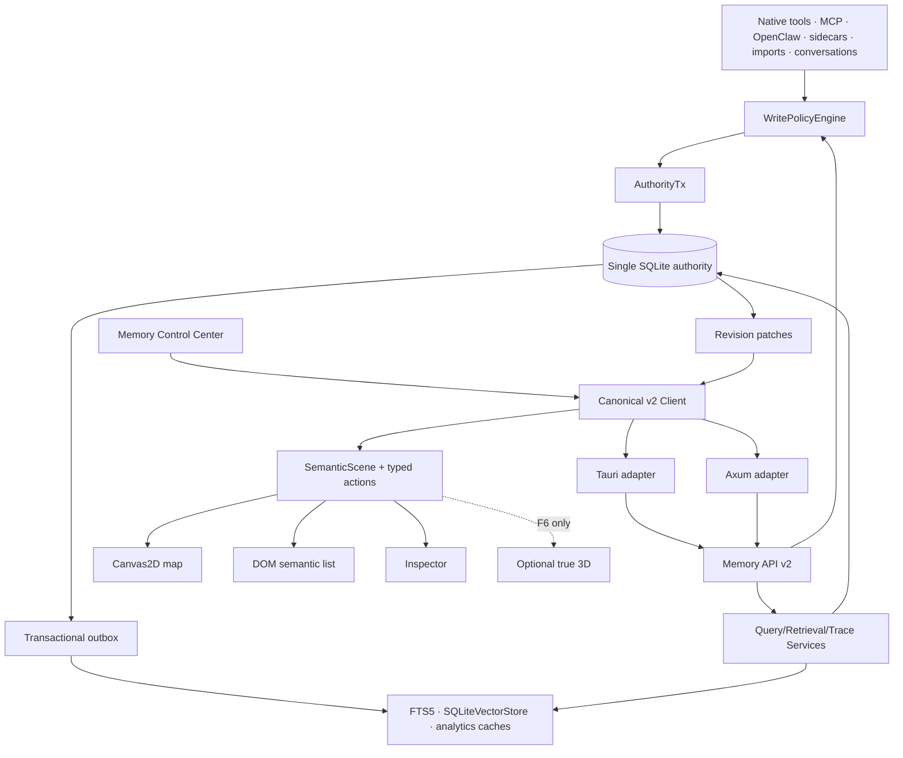
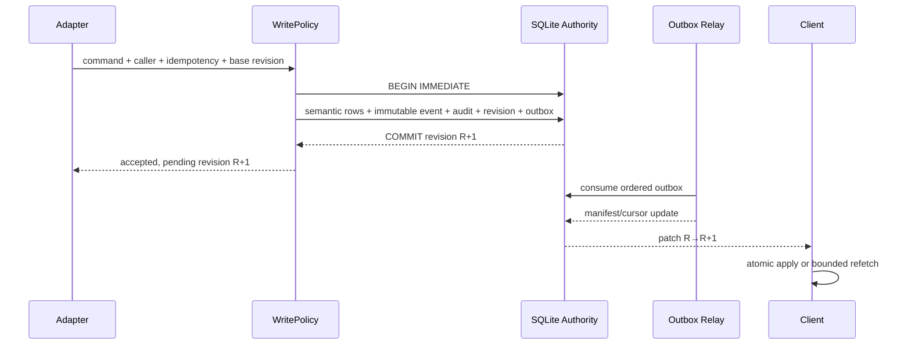
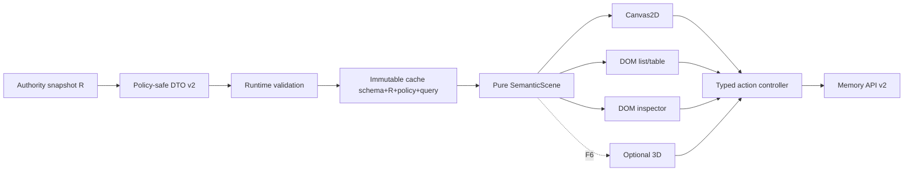
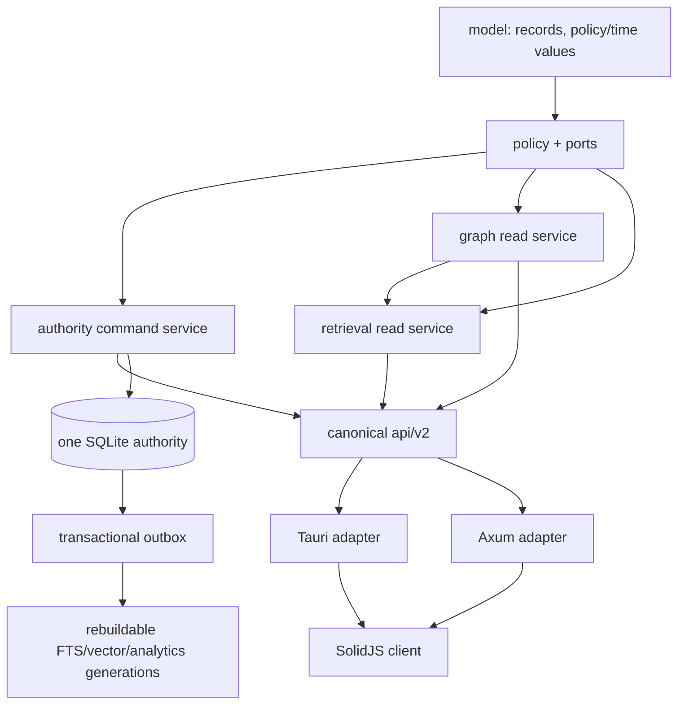
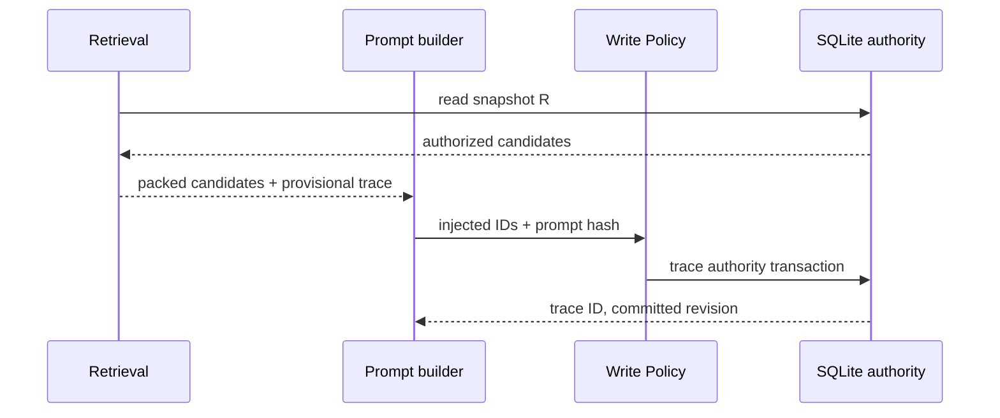
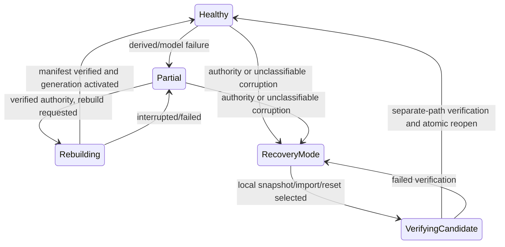
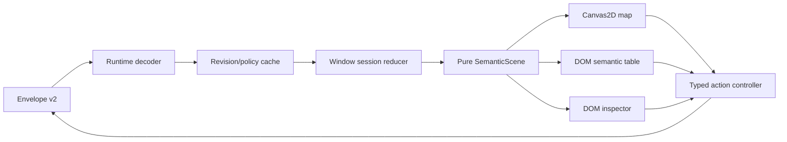
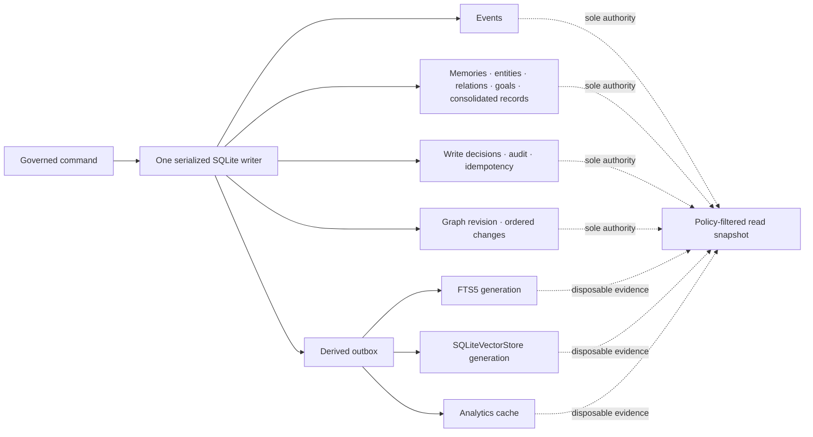
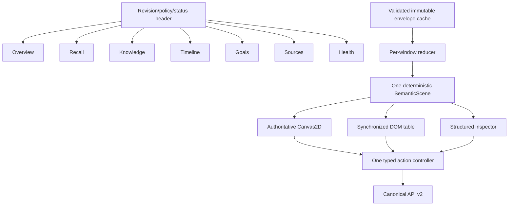

# Memory Graph Production Redesign — Planned Architecture

**Status:** Normative supporting design; Planned, not implementation evidence. `design.md` is the cohesive blueprint and `requirements.md` is the authority.

## Architecture Shape



## Boundary Rules

| Boundary | Owns | Forbidden |
|---|---|---|
| `kria-core::memory` | domain types, policy, authority transactions, retrieval, lifecycle, recovery, canonical DTO semantics | presentation and transport-specific truth |
| SQLite authority | cognitive records, immutable events, audit, revisions, idempotency, outbox | camera/render state; vector/analytics authority |
| Tauri/Axum | authenticated caller conversion, limits, serialization, stream delivery | business rules, direct SQL, alternate DTOs |
| SolidJS client | request generation, immutable snapshot cache, scene projection, actions, UI state | policy enforcement or semantic invention |
| Renderers | pixels, hit testing, camera | record meaning, authorization, persistence |

Current repository paths are observations only. Planned ownership and flow are detailed in `design.md`; risks, gates, and evolution rules are in the other support documents.

## Planned Runtime Topology and Ownership

One process may host multiple bounded workers, but there is one authority writer and no distributed consensus. Reads use short WAL snapshots. CPU/SQLite work expected to exceed 50 ms runs on bounded blocking workers; foreground requests preempt/defer lower priority cognition within 100 ms.

| Component | Input | Output | Failure boundary |
|---|---|---|---|
| Write Policy | caller, command, mode, source trust | rejection/preview/atomic commit | no alternate write path |
| Authority services | validated command | event/audit/revision/outbox | rollback all on pre-commit failure |
| Retrieval engine | query, caller policy, revision, token budget | results + durable/returned trace | strategy failures are explicit Partial |
| Graph query | bounded query at revision | endpoint-complete policy-safe subgraph | cursor/refetch errors, no hidden frontier IDs |
| Derived relay | ordered outbox | generation/manifest | idempotent retry/dead letter/rebuild |
| Recovery | integrity evidence | Healthy/Degraded/Recovery Mode | authority corruption fails closed |
| Client cache | v2 snapshots/patches | immutable query entries | policy/schema/revision mismatch invalidates |
| Window session | per-window intent | scene/camera/focus/pending state | close releases only owned resources |

## Authority and Derived Data Flow



## Security Architecture

Authorization precedes query planning. Cache keys contain schema, caller identity/policy hash, revision, and query hash. Remote mode startup requires explicit enablement, non-placeholder identity validation, operation grants, restrictive origin list, transport protection deployment, replay controls, request/deadline/rate limits, and redacted audit. Missing/malformed/expired/replayed credentials return shape-stable deny responses without protected labels, IDs, counts, topology, or detailed reason. Local Tauri remains available if remote startup is refused.

## Evolution Seams

Stable seams are canonical v2 DTOs, `GraphQueryPort`, `GraphAnalyticsPort`, `VectorStorePort`, relation registry versions, model manifests, schema migrations, and Interchange v1. They do not introduce multi-user, multi-device, consensus, or a second authority. Current release explicitly excludes LanceDB, Qdrant, HNSW/ANN, and external graph databases; any future derived backend must first fail optimized 100k budgets, rebuild from SQLite, consume revisions, enforce policy, and preserve contracts.

## Canonical Contract and Scene Flow



Canonical operations are search, neighborhood, path, trace, aggregate, predict, temporal diff, patch list, inspect, preview/commit/undo, lifecycle, source, goal, health/capabilities, and local interchange/recovery. Hard limits and examples are defined in `design.md`. All operations return one revision and policy context.

## Data and Time Model

Every cognitive record carries stable ID, schema version, source/actor, Effective Policy, Truth State, creation transaction, provenance, and optional Valid Time. Transaction Time is graph revision; it never substitutes for Valid Time. Relationships are unique by policy partition + canonical endpoints + relation registry version/direction + validity identity. Repeated observations append evidence. Navigation groups never enter authority or analytics.

## Patch and Recovery Rules

Clients apply a patch only at matching base revision; duplicates are idempotent; stale patches are ignored; gaps, schema changes, and policy changes trigger bounded active-query refetch. Authority corruption enters read-only Recovery Mode. FTS/vector/analytics corruption deletes/rebuilds only the projection. Recovery accepts only a checksum/schema/event/revision verified local snapshot or Interchange package.

## Deployment Posture

The current release is single-user/single-process/single-laptop. Remote server behavior is a secured optional capability, not an enterprise/multi-user architecture. Loopback is default. Python sidecars, network, LLM, embedder, analytics, and optional renderer may be unavailable without breaking the authority/FTS/lifecycle floor.

## Enforced Dependency and Authority Architecture

The planned dependency graph is one-way: `model → policy/ports → authority and read services → api/v2 → adapters → SolidJS`. Concrete SQLite implementations are selected only in the `kria-core::memory::composition` root. Graph and Retrieval services receive read ports; lifecycle, cognition, tools, MCP, OpenClaw, sidecars, and UI receive `AuthorityCommandBus`. No adapter, renderer, Python process, or derived worker receives a direct authority writer.



`kria-core` is the only semantic authority. The SQLite connection manager provides one serialized authority writer and bounded short WAL readers. Derived FTS/vector/analytics generations may share the SQLite file but remain disposable and cannot be the source of semantic writes. Any page damage whose ownership cannot be proven enters Recovery Mode rather than being treated as safely derived.

## Revision, Policy, and Status Planes

The semantic plane is keyed by Graph Revision and canonical Effective Policy hash. Every user-visible semantic mutation advances one revision exactly once. Rejected/deferred decisions, audit-only observations, scheduler leases, relay attempts, and runtime telemetry retain subject revision and logical time without inventing a semantic revision. The operational plane has a monotonic `statusVersion` and `observedAt`; Health may be newer than the semantic snapshot but must say so. A destination is synchronized only when its semantic DTOs share revision and policy hash.

Effective Policy is a fail-closed meet: same owner or deny, intersection of namespace/scope/capability sets, maximum sensitivity, and provenance hash of all contributors. Empty intersection denies derivation. Declassification is a new governed record. Policy is applied before planning, counts, rank, serialization, cursor creation, cache insertion, scene construction, and rendering.

## Trace and Write Boundary

Retrieval reads at revision `R` and produces a provisional trace. Prompt construction supplies the exact injected set; `RecordRetrievalTrace` then crosses Write Policy and commits before model invocation, storing source revision `R` and committed revision. This preserves a read-only Retrieval Engine while making a durable `Used` claim authoritative. A failed trace commit can return an explicitly Partial in-memory explanation when allowed, but cannot create a durable Used claim.



## Recovery and Projection Convergence

The relay leases outbox work in authority-revision order; deletion outranks stale upsert. Effects are idempotent by target, operation, record, content hash, and model partition. Rebuild writes a temporary generation from authority order, checkpoints, compares count/membership/version manifests, and atomically activates only a verified generation. Old generation remains active until activation. Dead-letter work remains reconciliation-eligible.



Recovery Mode locks the writer before adapters accept writes. Candidate recovery occurs at a separate path and must pass schema, integrity, event checksum/order, revision-chain, policy, and required-manifest checks before atomic activation. In-place guessed repair is forbidden.

## Security Profile and Host Boundaries

Loopback is default. Remote listen is permitted only after validation of explicit enablement, protected transport ownership, restrictive normalized origins, signed short-lived identity with operation grants and replay nonce, OS-keyring secret references, rate/body/deadline limits, and redacted audit. Wildcards, plaintext non-loopback HTTP, placeholder credentials, or writable default grants refuse startup while desktop remains local. The adapter maps identity to `CallerContext`; core policy may narrow but never expand it. Remote auth failures use shape-stable non-revealing errors.

Tauri and Axum host the same versioned operations, DTO decoders, errors, limits, score semantics, and capability dispositions. Host-only capabilities such as local import/recovery are declared unsupported elsewhere, not reimplemented differently.

## Digital Twin Client Architecture

Each window owns destination, query, selection, generation, pending commands, camera, representation, focus, errors, and navigation history. Only immutable entries keyed by schema/revision/policy/query may be shared. Every request and inspector section carries window ID, generation, query hash, policy hash, and base revision; mismatches are discarded. Patch application is atomic only at matching base revision; otherwise the valid prior scene remains Stale while that window refetches its active query.



Routes are `/memory/{overview|recall|knowledge|timeline|goals|sources|health}` with versioned, policy-safe query keys. Timeline is not shown as functional without temporal capability. Knowledge always retains the semantic table if rendering fails. No surface creates topology, counts, status, confidence, or use evidence. The Digital Twin describes data and system state only and never personhood, consciousness, emotion, or autonomous desire.

## Deployment and Evolution Guard

F1 authority/security/lifecycle precedes semantic corrections; F2 semantic contracts precede correction controls; F3 retrieval/truth/goals/cognition precedes production-ready Control Center; F4 completes accessible 2D/list; F5 is release evidence; F6 optional 3D is independent. Stable ports reserve evolution without introducing distributed machinery. After hard cutover, competing stores, adapters, renderers, migrations, tests, and claims are deleted.

## Normative Architecture Closure

This closure is self-contained and takes precedence over earlier shorthand in this file. It remains a **planned target**, not proof that the repository currently implements it. The observed current baseline is SQLite Event/Memory/FTS/vector groundwork, vector+FTS retrieval, legacy relationship surfaces, and an SVG/list UI; the target below requires hard-cutover evidence before any capability is called current.

### Exact module ownership and dependency direction

Only `kria-core::memory::composition` may instantiate concrete stores, clocks, schedulers, key providers, patch sinks, or model runtimes. Source dependencies point inward; adapters depend on the canonical API, never the reverse.

```text
model
  ↑ used by
policy + stores::ports
  ↑ used by
stores::sqlite_* + authority + graph
  ↑ graph/read ports used by
retrieval
  ↑ command/read ports used by
cognition + lifecycle
  ↑ orchestrated by
api::v2
  ↑ called by
kria-desktop::commands::memory_v2 / kria-server::routes::memory_v2
  ↑ consumed by
SolidJS memory client → window reducer → SemanticScene → 2D/table/inspector
```

| Owner | Exclusive responsibility | Forbidden dependency/behavior |
|---|---|---|
| `memory::model` | IDs, typed records, Truth State, Valid Time, provenance, relation/model versions | SQL, transport, presentation |
| `memory::policy` | caller/source facts, Effective Policy meet, memory modes, deterministic admission | concrete SQLite, UI, network identity parsing |
| `memory::stores::ports` | authority transaction/read/index interfaces | policy decisions and DTO presentation |
| `memory::stores::sqlite_*` | one writer, bounded WAL readers, SQL mapping, FTS/vector generations | semantic admission or alternate truth |
| `memory::authority` | serialized transaction, Event Log, idempotency, revision, audit, outbox, integrity | rendering, host-specific auth |
| `memory::graph` | policy-first bounded traversal, temporal projection, entity proposals, named analytics | durable mutation or direct adapter calls |
| `memory::retrieval` | FTS/vector/graph/time/goal candidate generation, fusion, packing, provisional trace | authority writes or policy widening |
| `memory::cognition` | goals, consolidation eligibility, tool observations, scheduler commands | direct SQL or autonomous promotion |
| `memory::lifecycle` | correction/deletion previews and governed lifecycle commands | direct purge claims or key-status-only crypto claims |
| `memory::api::v2` | canonical operations, DTO/error/capability semantics | host policy invention |
| Tauri/Axum | authenticate, create `CallerContext`, enforce transport limits, serialize canonical envelopes | SQL, ranking, graph semantics, divergent DTOs |
| SolidJS | decode, request generation, immutable cache, window state, scene/actions, presentation | granting access, inferring hidden facts, durable state |
| Canvas/table/3D | pixels/DOM, hit testing, camera, focus presentation | topology creation, business actions, persistence |

Native tools, MCP servers, OpenClaw skills, sidecars, imports, conversations, and UI commands receive `AuthorityCommandBus`; none receives a database writer. Python may return bounded untrusted candidates but is optional and cannot be required for authority, FTS5, exact vectors, graph traversal, lifecycle, or Recovery Mode.

### One-authority data plane



Normative authority tables are `authority_meta`, `schema_versions`, `effective_policies`, `events`, `memories`, `entities`, `aliases`, `mentions`, `relation_registry`, `relation_aliases`, `relationships`, `evidence`, `memory_links`, `goals`, `goal_progress`, `episodes`, `consolidated_records`, `consolidation_runs`, `sources`, `retrieval_traces`, `retrieval_trace_items`, `write_decisions`, `tool_observations`, `feedback`, `state_transitions`, `memory_mode_sessions`, `deletion_jobs`, `shred_keys`, `idempotency_results`, `audit_records`, `graph_revisions`, `graph_changes`, `derived_outbox`, `derived_manifests`, `rebuild_generations`, `recovery_snapshots`, and `interchange_imports`. `search_documents`, FTS5 tables, `embedding_partitions`, `mem_vectors`, layouts, scenes, and analytics are rebuildable projections.

Every semantic row references an Effective Policy and carries stable ID, schema version, source/actor, creation Event, Truth State, transaction revision, provenance, and Valid Time where applicable. Relationships are unique by policy partition, canonical typed endpoints, registry relation/version/direction, and validity identity; repeat observations append Evidence. Canonical Memory Links are only `derived_from`, `supports`, `contradicts`, `mentions_entity`, and `superseded_by`. Navigation groups never enter these tables.

### Authority transaction and convergence protocol

```rust
fn commit(caller: &CallerContext, candidate: WriteCandidate) -> Result<Committed, Error> {
    validate_boundary(candidate)?;
    let admission = write_policy.evaluate(caller, candidate)?;
    if !admission.accepted() { return authority.record_decision_only(admission); }
    authority.begin_immediate(|tx| {
        if let Some(result) = tx.replay_matching_idempotency(caller, candidate)? {
            return Ok(result);
        }
        tx.assert_mode_policy_capability_and_base_revision(admission)?;
        let before = tx.read_impacted_authority(candidate)?;
        let result = tx.apply_typed_command(candidate, admission)?;
        let event = tx.append_immutable_event(result.minimized_event())?;
        tx.append_provenance_state_decision_and_audit(result, event)?;
        let revision = tx.advance_graph_revision_exactly_once_if_visible(result)?;
        tx.append_ordered_changes(revision, before, result)?;
        tx.enqueue_idempotent_projection_work(revision, result)?;
        tx.check_mixed_endpoint_policy_and_temporal_invariants()?;
        tx.store_idempotency_result(caller, candidate, revision, result)?;
        Ok(Committed::new(revision, result))
    })
}
```

Any pre-commit error rolls back semantic rows, Event, decision, audit, revision, changes, idempotency result, and outbox together. Post-commit notification failure does not undo truth. The relay consumes `(authority_revision,id)` order; purge supersedes stale upsert. Rebuild streams authority into a temporary generation, checkpoints, compares count/membership/schema/model manifests, and atomically switches only a verified generation. A crash leaves either the old active generation or the verified new pointer—never a half-generation authority.

Startup uses `quick_check`, schema checksums, foreign keys/pragmas, Event order/checksum, revision continuity, and outbox cursor checks. Release/recovery uses full integrity and manifest checks. Proven derived-only damage becomes `Partial/Rebuilding`; unclassified page damage, Event/schema/revision failure, or authority invariant failure enters writer-locked `Recovery_Mode`. Recovery validates a local snapshot or Interchange package at a separate path before atomic activation; otherwise it remains read-only. In-place guessed repair is forbidden.

### Retrieval and truth architecture

The core retrieval snapshot fixes one Graph Revision and policy hash. Policy and Truth-State gates run before candidate creation and again before serialization. Current `SQLiteVectorStore` is exact brute-force cosine over finite, compatible 384-dimensional `f32le` vectors generated by FastEmbed `all-MiniLM-L6-v2`; the pinned manifest includes model/repository revision, artifact and tokenizer checksums, runtime, pooling, normalization, dimension, and reviewed FOSS disposition. FTS5 uses parameterized MATCH over authority-derived documents. Graph expansion is breadth-first, policy-filtered before each expansion, cycle-safe, maximum three hops, and returns only authorized frontier metadata. Temporal ranking respects half-open Valid Time independently of transaction revision. Goal ranking uses only authorized Active goals.

For candidate `d`, query class `c`, available strategies `A`, and profile `p`:

`score(d,c,p) = Σ[s ∈ A ∩ strategies(d)] availability(s) × weight(p,c,s) / (k(p) + rank_s(d))`

Ranks are one-based; default `k=60`; missing weight is not silently redistributed. Profiles are versioned and activated only by offline judged-corpus evidence. After fusion, deterministic truth/version gates and semantic deduplication run, then diversity caps by source/episode/entity/kind, then marginal-utility-per-token packing with exact-identifier and Active-goal reservations. The final trace stores query/profile/classifier/model versions, strategy availability, ranks, weights, contributions, exclusions, token allocations, and exact injected order. Only committed injected membership permits the label **Used**. If vector/model/network/graph/time/goal is unavailable, remaining strategies continue as `Partial`; FTS5 is the offline floor and policy never broadens.

Truth precedence is user-confirmed source, newer successful verification, independent Evidence quality, then statistically significant named Memory Worth. A tie remains Contradicted/Unresolved. Supersession retains and links the predecessor, closes applicable Valid Time, and excludes it from current recall. Merge/split never auto-merges a person from name or embedding alone; acceptance is governed, versioned, reversible, and retains aliases, mentions, relations, evidence, policy, and audit. Consolidation is deterministic Episode → Summary → Skill → Rule with immediate-parent `derived_from` links; source correction marks reachable outputs stale and queues bounded reevaluation.

Tool learning records separate start/completion Events and typed outcome under source namespace/trust/capability. External text remains fenced data and cannot invoke actions. Below 20 comparable observations, reliability and Memory Worth are `Insufficient evidence` and cannot rank/archive. No learned outcome can grant a capability, expand scope, bypass approval, promote a Rule, mutate security policy, delete memory, or override explicit correction/newer tool version.

### Lifecycle, security, and resource planes

Forget sets `Forgotten` with a 30-day restore deadline; restore reuses stable identity. Hard delete immediately denies supported content reads from authority state, closes links, and drives idempotent purge/reconciliation through FTS, vectors, graph, traces, inspector, export, caches, rebuild generations, and scene buffers. Immutable content-bearing Events may still exist; therefore the honest label is deleted/excluded, not physically erased. `Crypto-Shredded` is available only after subject-bound payload encryption, destruction of every recoverable key version, and current/history/snapshot/cache/index decryption-denial evidence. A status-row update alone is `Hard Delete Pending Cryptographic Erasure`.

Loopback is default. Non-loopback startup requires explicit enablement, protected transport, restrictive origins, short-lived signed identity and operation grants, replay nonce cache, OS-keyring secret references, rate/body/deadline limits, and redacted audit. Any missing element refuses remote listen while local Tauri remains. Effective Policy is applied before planning, counts, rank, serialization, cursors, cache, scene, and rendering. Denies reveal no protected IDs, labels, counts, topology, or detailed reason.

Scheduler order is P0 security/stop/correction, P1 foreground read/write/outbox, P2 reconciliation/required verification, P3 embedding/enrichment/analytics, P4 consolidation/polish. Work likely over 50 ms leaves async executor threads; P0 causes lower work to yield/defer within 100 ms. Battery suspends P3/P4; pressure sheds rebuildable caches and lowers concurrency; the 1024 wake queue coalesces while durable Event/outbox cursors preserve eventual work. Telemetry contains aggregate dimensions and correlation IDs, never content, embeddings, secrets, private labels, or hidden IDs.

### Digital Twin architecture and complete 2D gate



`MemoryControlCenter` owns route, policy, revision header, capabilities, and per-window session; destinations own query intent; cache/patch reducer own convergence; scene builder is pure; renderers own no semantics. Every request carries instance ID, generation, query hash, policy hash, base revision, destination, and section. Any mismatch is discarded. A patch applies atomically only at its base revision; a gap preserves the coherent old snapshot as Stale and refetches active queries. Closing one window cancels only its requests/workers/subscriptions.

The exact layouts are: at least 1200 CSS px, `240px navigation / minmax(560px,1fr) workspace / 360px reserved inspector`; 800–1199 px, `72px rail / flexible workspace / 320px focus-managed overlay inspector`; below 800 px **or** below 600 px content height, single-column search-first with mutually exclusive Map/List and full-height inspector sheet. Opening an inspector reframes or visibly marks selection. Coarse targets are at least 44×44 px with pinch-centroid zoom, two-finger pan, and non-hover controls.

Overview, Recall, Knowledge, Timeline, Goals, Sources, and Health all share revision/policy or show Stale/Unavailable. Knowledge uses one bounded Canvas2D and one synchronized semantic table; scene defaults/hard caps are 240/500 nodes, 360/750 edges, 80/160 labels, and 512 KiB/2 MiB payload. Camera zoom is `[0.25,4]`, pan is scene bounds plus 25% viewport margin, and fit-visible/selection/neighborhood plus history are required. Semantic LOD is aggregate → entity/stored relations → selected memories → evidence/source; selected/focused semantics never disappear. The table and inspector complete every task if Canvas fails.

Inspector sections are Identity, Truth, Evidence, Relationships, Use, History, and Actions. Each independently supports idle, loading, ready, empty, partial, stale, offline, unauthorized, timeout, malformed data, worker failure, renderer failure, error, and recovery. It explains Why stored, Why recalled, and How used from distinct authority records. Correction/deletion previews bind base revision and show current/proposed values, evidence, policy, dependent counts, independent-evidence choices, reversibility, purge targets, crypto availability, and audit effect. Pending styling remains until matching revision confirmation.

Visual meaning is redundant: kind uses text+shape/icon; stored/derived/inferred/navigation uses line style+badge; truth uses icon/pattern+text; direction uses arrow+source→target text. Missing metrics consume no visual channel. Body text is at least 14 px, graph labels 12 px at readable LOD, focus is at least 2 px with required contrast, and all tasks survive forced colors, 200% zoom, RTL, CJK, long labels, keyboard, and Orca. Motion is finite: focus 80 ms, selection 120 ms, inspector 180 ms, camera fit 220 ms, confirmation 240 ms, scene 300 ms, temporal diff 320 ms, absolute ceiling 400 ms; reduced motion is immediate/static and all graph-originated loops stop by two seconds.

The Digital Twin describes synchronized data and system state only. It never claims consciousness, sentience, emotion, autonomous desire, or a literal brain.

### Optional 3D and release order

3D cannot begin before complete, accessible, release-ready 2D/list. It must use the same scene/actions and exactly one preregistered authority-backed z-axis, plus LOD/culling, camera/focus, context-loss recovery, reduced-motion static fallback, idle freeze, and approved free/open-source license/SBOM evidence. It ships only if the preregistered task improves median time or error by at least 10%, the real target scene sustains at least 30 FPS, and semantic/accessibility/resource/maintenance gates pass. Any failed gate deletes controls, renderer/worker code, graph-only dependencies/assets/tests, lock/SBOM residue, and shipping claims.

Release order is F0 evidence reset → F1 authority/security/lifecycle → F2 semantic/provenance/entity/time → F3 retrieval/traces/truth/goals/cognition/resources → F4 complete 2D/list → F5 production evidence; F6 is independent. An incomplete capability appears only as Partial or Unavailable. No planned statement in these documents changes current implementation status.