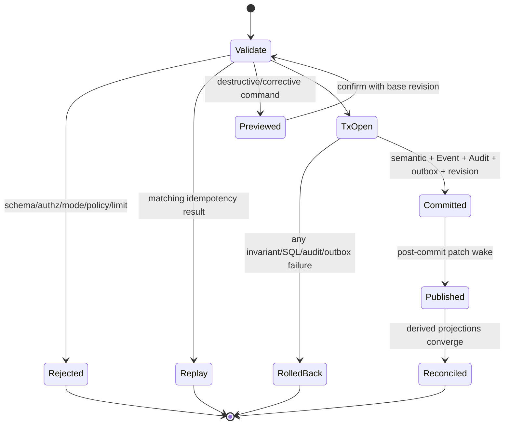
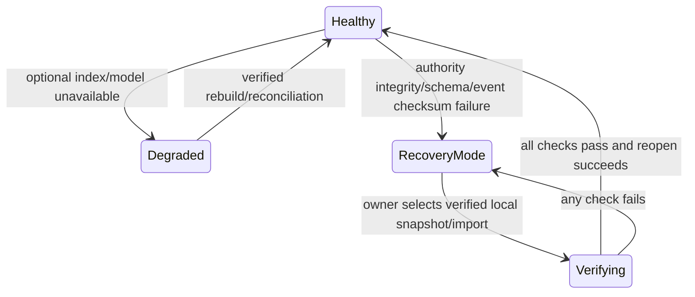
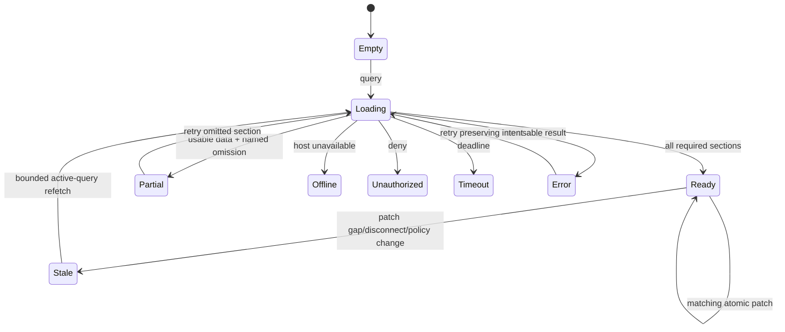
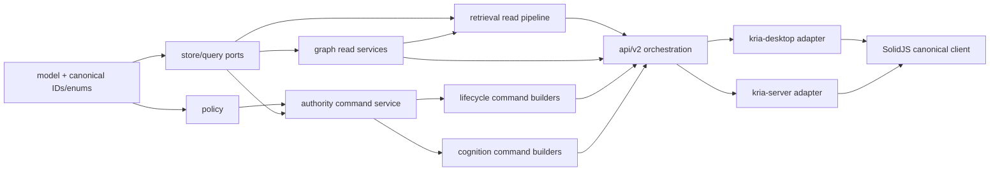
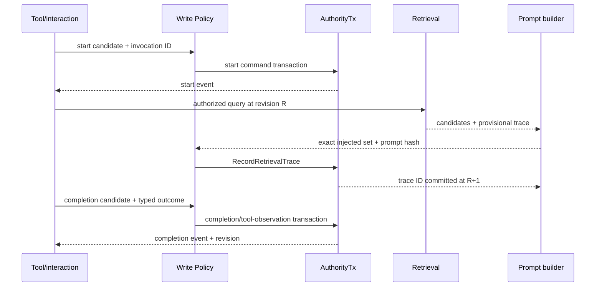
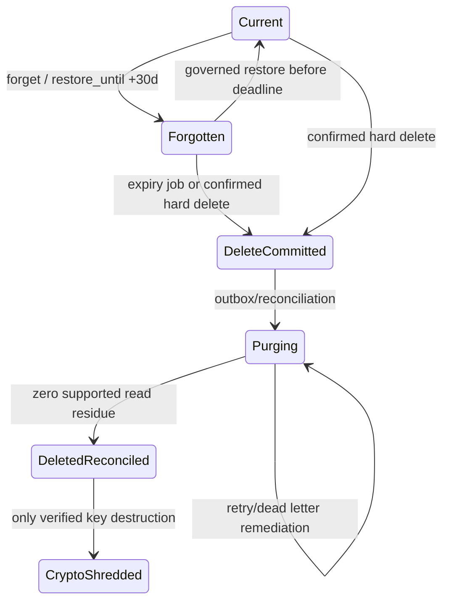

# Memory Graph Production Redesign — Planned Implementation Blueprint

**Status:** Planned target design for MGR-001–MGR-048. Nothing in this document is implementation or release evidence.
**Posture:** single user, single process, single laptop, pre-production; destructive KRIA data reset/hard cutover is acceptable, but truth, privacy, security, accessibility, and correctness are not relaxed.
**Authority:** `requirements.md` is normative. MGD-001–MGD-046 are binding design decisions; MGD-001–MGD-022 are preserved originals, and later extensions or replacements are recorded in `decisions.md`.

## Overview

This is the primary cohesive blueprint for the backend-first Cognitive Memory System and Memory Control Center. It fixes authority, security, lifecycle, semantic, retrieval, and evidence foundations before UI polish; complete authoritative 2D ends at F5 and optional true 3D is an independent F6 outcome.

## Architecture

The architecture is one SQLite authority behind `kria-core`, thin Tauri/Axum adapters, rebuildable derived indexes, canonical v2 contracts, and one renderer-neutral scene/action model. Detailed ownership and flows are in §§2–8 and `architecture.md`.

## Components and Interfaces

Planned Rust/TypeScript ports, module ownership, DTOs, errors, limits, capability matrix, session reducers, and action interfaces are specified in §§3 and 8–10.

## Data Models

The concrete versioned authority and derived schema, constraints, indexes, triggers, record semantics, time model, model manifests, and interchange format are specified in §§4–7 and 14.

## 1. Current Repository Observation vs Planned Target

| Concern | Current repository observation (not ratification) | Planned target |
|---|---|---|
| Authority | SQLite append-only events, memories, FTS5, vector/outbox foundations exist | One versioned authority transaction owns every cognitive record, event, audit, outbox item, and graph revision |
| Retrieval | `retriever.rs` fuses vector + FTS; graph expansion is deferred | Five strategies: FTS5, exact 384d vectors, ≤3-hop graph, temporal, active goal |
| Vectors | SQLite little-endian `f32` blobs, model-version partitioned | Pinned `all-MiniLM-L6-v2`, exact cosine, manifest-verified 384d partitions behind `VectorStorePort` |
| Graph | Legacy free-text relationships, one optional evidence event, coarse commands | Registry-governed identity, multi-evidence links, bounded Graph API v2, revisions and patches |
| Security | Server memory routes are not shown behind complete production auth; permissive CORS and placeholder token logic exist | Loopback default; remote startup fail-closed unless complete identity/authz/origin/transport/rate configuration passes |
| Lifecycle | Forgotten/deleted states and index purge exist; key-status update does not prove unreadability | Governed forget/restore/delete; crypto-shred claimed only after encrypted payload/key-destruction denial evidence |
| UI | Active `MemoryUniverse` SVG and semantic table; `GraphCanvas3D` dormant | Memory Control Center with authoritative Canvas2D map plus synchronized DOM list and shared actions |
| Evidence | Existing tests cover selected memory invariants and a 500-record retrieval fixture | Requirement-linked suites, 100/1k/10k/100k fixtures, ≥200 judged retrieval queries, evidence manifests |
| Licensing | Cargo declares MIT while root `LICENSE` text is Apache-2.0; model/license/SBOM facts are incomplete | Release-blocking exact locks/checksums, approved FOSS dispositions, SBOM, vulnerability report; no inferred license claims |

## 2. Non-Negotiable Design Invariants

1. **A1 Authority:** SQLite is the only transactional authority; FTS5, vectors, analytics, caches, and scenes are disposable projections.
2. **A2 Atomicity:** accepted write = authority rows + immutable event + audit + outbox + one graph revision, all once or none.
3. **A3 Governance:** every durable write, including native/MCP/OpenClaw/sidecar/tool outcomes, enters `WritePolicyEngine`.
4. **A4 Epistemic truth:** no visible claim, score, topology, recency, use, or status is invented; missing data is `Unavailable` or omitted.
5. **A5 Isolation:** authorization and Effective Policy precede planning, counts, ranking, serialization, caching, and rendering.
6. **A6 Boundedness:** traversal is cycle-safe and ≤3 hops; queues, workers, payloads, scenes, labels, cursors, and deadlines are capped.
7. **A7 Temporal duality:** Valid Time and Transaction Time are independent; every response is one graph revision.
8. **A8 Rebuildability:** derived indexes can be deleted and deterministically rebuilt without changing authority.
9. **A9 Human authority:** correction, merge/split, contradiction, forget/restore/delete are previewed, governed, audited, and reversible where promised.
10. **A10 Representation parity:** map, list, inspector, and optional 3D consume one semantic scene and action authorization.
11. **A11 Offline floor:** SQLite writes, policy, FTS5, lifecycle, and correction remain available without network, LLM, or embedder.
12. **A12 Evidence:** Planned remains Planned until executable and manual Evidence Artifacts pass the governing gate.

## 3. Backend-First Ownership and Planned Files

```text
crates/kria-core/src/memory/
├── api/v2/{mod,contract,dto,error,limits,capabilities}.rs
├── authority/{transaction,event_log,idempotency,revision,integrity,recovery}.rs
├── policy/{write_policy,effective_policy,modes,source_trust}.rs
├── model/{record,provenance,truth,temporal,relation_registry,interchange}.rs
├── graph/{query,traversal,projection,entity_resolution,analytics,patch}.rs
├── retrieval/{engine,classifier,rrf,gates,packing,trace,eval}.rs
├── cognition/{goals,consolidation,tool_observation,scheduler}.rs
├── lifecycle/{preview,forget,delete,crypto}.rs
└── stores/{ports,sqlite_authority,sqlite_fts,sqlite_vectors,rebuild}.rs
crates/kria-core/src/memory/db/schema/00NN_memory_graph_v2.sql
crates/kria-desktop/src/commands/memory_v2.rs       # thin Tauri adapter
crates/kria-server/src/routes/memory_v2.rs          # thin Axum adapter
ui/src/shell/spaces/memory/
├── MemoryControlCenter.tsx
├── api/{client,schemas,errors,capabilities}.ts
├── state/{windowSession,snapshotCache,patchReducer}.ts
├── scene/{semanticScene,actions,layout,visualTokens}.ts
├── destinations/{Overview,Recall,Knowledge,Timeline,Goals,Sources,Health}.tsx
└── knowledge/{Graph2D,SemanticList,Inspector,Camera,Status}.tsx
```

`kria-core` owns all domain semantics. Adapters may authenticate, convert caller context, enforce transport byte/time limits, and serialize only. SolidJS runtime-validates DTOs; it cannot grant capabilities or infer hidden state. Existing graph commands, global graph store, synthetic universe logic, and duplicate renderer business logic are deleted only after v2 parity evidence. Python remains optional and cannot become authority or required retrieval.

### Planned Rust Ports

```rust
pub trait AuthorityCommandBus {
    fn execute(&self, caller: &CallerContext, cmd: MemoryCommand)
        -> Result<CommittedCommandV2, MemoryApiErrorV2>;
}

pub trait GraphQueryPort {
    fn query(&self, caller: &CallerContext, request: GraphRequestV2)
        -> Result<GraphResponseV2, MemoryApiErrorV2>;
}

#[async_trait]
pub trait VectorStorePort: Send + Sync {
    async fn ensure_partition(&self, manifest: &EmbeddingPartitionManifest) -> Result<(), IndexError>;
    async fn upsert(&self, item: VectorItemV2) -> Result<(), IndexError>;
    async fn exact_search(&self, q: ExactVectorQueryV2) -> Result<Vec<VectorHitV2>, IndexError>;
    async fn delete(&self, partition: &ModelPartitionId, ids: &[RecordId]) -> Result<(), IndexError>;
    async fn manifest(&self, partition: &ModelPartitionId) -> Result<IndexManifestV2, IndexError>;
    async fn rebuild(&self, source: AuthorizedRecordStream) -> Result<RebuildReportV2, IndexError>;
}
```

## 4. Planned SQLite Authority Schema v2

The hard migration creates a fresh coherent v2 schema; legacy rows are deterministically reconciled or the pre-production database is reset. Every UUID is canonical lower-case text; timestamps are RFC3339 UTC text plus explicit source offset where required; booleans are `INTEGER CHECK (... IN (0,1))`; JSON is canonical UTF-8 with schema/version and `json_valid` checks where SQLite JSON support is enabled. Foreign keys, WAL, `synchronous=FULL` for authority commits, busy timeout, and foreign-key enforcement are asserted at open.

### 4.1 Meta, events, identity, policy, and revisions

| Table | Concrete columns and constraints | Required indexes/triggers |
|---|---|---|
| `schema_versions` | `version INTEGER PK`, `name TEXT UNIQUE NOT NULL`, `checksum TEXT NOT NULL`, `applied_at TEXT NOT NULL` | immutable after insert |
| `authority_meta` | singleton `id=1 CHECK`, `graph_revision INTEGER NOT NULL >=0`, `event_hlc TEXT NOT NULL`, `schema_epoch INTEGER NOT NULL` | singleton trigger rejects delete/extra rows |
| `events` | `id TEXT PK`, `source_event_id TEXT`, `idempotency_key TEXT`, `invocation_id TEXT`, `phase TEXT CHECK(start/completion/observation)`, `outcome TEXT`, `hlc TEXT UNIQUE NOT NULL`, `ts_utc TEXT NOT NULL`, `tz_offset_min INTEGER NOT NULL`, `event_type TEXT NOT NULL`, `source_kind TEXT NOT NULL`, `source_id TEXT NOT NULL`, `actor_id TEXT NOT NULL`, `session_id TEXT`, `parent_event_id TEXT FK events`, policy columns, `payload_cipher BLOB`, `payload_plain TEXT`, `payload_encoding TEXT NOT NULL`, `payload_checksum TEXT NOT NULL`, `shred_key_id TEXT`, `key_version INTEGER`, `schema_version INTEGER NOT NULL`; exactly one payload column non-null | unique `(source_kind,source_id,source_event_id)` where source ID present; indexes HLC/session/invocation/policy/shred; UPDATE and DELETE abort triggers |
| `idempotency_results` | `(caller_partition TEXT,idempotency_key TEXT) PK`, `command_hash TEXT NOT NULL`, `result_json TEXT NOT NULL`, `committed_revision INTEGER`, `event_id TEXT FK`, `created_at TEXT NOT NULL` | replay with different hash returns conflict |
| `graph_revisions` | `revision INTEGER PK`, `base_revision INTEGER NOT NULL`, `tx_id TEXT UNIQUE NOT NULL`, `committed_at TEXT NOT NULL`, `actor_id TEXT NOT NULL`, `policy_hash TEXT NOT NULL`, `change_count INTEGER NOT NULL CHECK >=0` | `base_revision=revision-1`; append-only triggers |
| `graph_changes` | `(revision,ordinal) PK`, `record_kind TEXT`, `record_id TEXT`, `change_kind TEXT CHECK(insert/update/state/delete/invalidate)`, `before_hash TEXT`, `after_hash TEXT`, `policy_partition TEXT NOT NULL`, `payload_json TEXT` | index `(record_kind,record_id,revision)`; append-only triggers |
| `audit_records` | `id TEXT PK`, `event_id TEXT FK`, `command_kind TEXT`, `disposition TEXT CHECK(accepted/rejected/deferred)`, `policy_version TEXT`, `actor_id TEXT`, `caller_partition TEXT`, `reason_codes_json TEXT`, `authority_revision INTEGER`, `created_at TEXT`, `reversal_of TEXT FK` | indexes event/revision/actor; append-only triggers |
| `shred_keys` | `(subject_id,key_version) PK`, `key_ref TEXT NOT NULL`, `algorithm TEXT`, `status TEXT CHECK(active/destroyed/unavailable)`, `created_at`, `destroyed_at`, `destruction_method`, `proof_hash` | no secret key bytes; status transition active→destroyed only |

Policy columns mean `namespace TEXT NOT NULL`, `owner_id TEXT NOT NULL`, `scope TEXT NOT NULL`, `sensitivity INTEGER NOT NULL CHECK 0..3`, `source_id TEXT NOT NULL`, and `policy_version TEXT NOT NULL`. Numeric sensitivity ordering makes `effective = max(contributors)`; namespace/scope/capability intersections are computed by policy code and materialized with a provenance hash.

### 4.2 Cognitive records and semantic links

| Table | Concrete columns and constraints | Required indexes |
|---|---|---|
| `records` | `id TEXT PK`, `record_kind TEXT CHECK(memory/summary/skill/rule)`, `schema_version INTEGER`, `content TEXT`, `content_cipher BLOB`, `content_hash TEXT`, `truth_state TEXT`, `staleness_class TEXT`, `valid_from`, `valid_until`, policy columns, `created_event_id TEXT FK`, `created_at`, `superseded_by TEXT FK records`, `episode_id TEXT FK`, `goal_context_id TEXT FK`, `estimated_tokens INTEGER CHECK >=0`, `shred_key_id`, `key_version`; payload exclusivity and valid interval check | kind/state/policy, content hash, validity, supersession, episode/goal |
| `entities` | `id TEXT PK`, `canonical_id TEXT FK entities`, `entity_type TEXT`, `display_name TEXT`, `truth_state TEXT`, policy columns, `created_event_id TEXT FK`, `created_at`, `revision INTEGER` | canonical/type/policy/display name normalized |
| `aliases` | `id TEXT PK`, `entity_id TEXT FK`, `alias TEXT`, `normalized_alias TEXT`, `alias_type TEXT`, `truth_state TEXT`, policy columns, provenance fields, `valid_from`, `valid_until` | `(normalized_alias,alias_type,namespace,scope)` and entity |
| `mentions` | `id TEXT PK`, `record_id TEXT`, `record_kind TEXT`, `entity_id TEXT FK`, `locator_json TEXT`, `span_start INTEGER`, `span_end INTEGER`, `role TEXT`, `extractor TEXT`, `extractor_version TEXT`, `score REAL`, `score_semantics TEXT`, policy columns, `observed_at`, `created_event_id TEXT FK`; span order check | record/entity/policy |
| `relation_registry` | `(relation_name,version) PK`, `display_forward`, `display_inverse`, `aliases_json`, `direction_class CHECK(directed/symmetric)`, `inverse_name`, `reflexive INTEGER`, `source_kinds_json`, `target_kinds_json`, `validity_policy`, `evidence_policy_json`, `policy_rule_version`, `writable INTEGER` | alias lookup is materialized in `relation_aliases` |
| `relationships` | `id TEXT PK`, canonical endpoints with kind/id, `relation_name/version FK`, `direction_class`, `valid_from`, `valid_until`, `truth_state`, `authority_class CHECK(stored/derived/inferred)`, policy columns, `identity_hash TEXT NOT NULL`, `algorithm`, `algorithm_version`, `created_event_id FK`, `revision`, `superseded_by FK`; non-reflexive and interval checks | unique active `identity_hash` where not superseded/deleted; source/target/type/validity/policy |
| `evidence` | `id TEXT PK`, `subject_kind`, `subject_id`, `source_record_kind`, `source_record_id`, `source_event_id FK`, `locator_json`, `actor_id`, `method`, `method_version`, `polarity CHECK(supports/contradicts)`, `score`, `score_semantics`, policy columns, `observed_at`, `removed_at`, `created_event_id FK` | subject, source, polarity, policy |
| `memory_links` | `id TEXT PK`, `source_kind/id`, `target_kind/id`, `link_type/version FK relation_registry`, `truth_state`, valid time, policy columns, provenance/event/revision | unique active semantic link identity; endpoint indexes |
| `entity_resolution_proposals` | `id TEXT PK`, `left_entity_id`, `right_entity_id`, `rationale_json`, `features_version`, `status CHECK(unresolved/accepted/rejected/reversed)`, `base_revision`, policy columns, `created_event_id`, `resolved_event_id` | pair/status/policy |
| `entity_resolution_actions` | `id TEXT PK`, `proposal_id`, `action_kind`, `before_json`, `after_json`, `reversible_until`, `reversal_of`, `event_id`, `revision` | proposal/revision; append-only |

Required canonical Memory Link registry rows are `derived_from`, `supports`, `contradicts`, `mentions_entity`, and `superseded_by`; no parallel untyped link table is permitted. Endpoint integrity across mixed kinds is enforced by `WritePolicyEngine` because SQLite cannot express a polymorphic FK; invariant triggers reject missing registry rows and invalid temporal bounds, while transaction tests prove endpoint existence.

### 4.3 Goals, episodes, consolidation, sources, tools, traces, feedback

| Table | Concrete columns and constraints | Required indexes |
|---|---|---|
| `episodes` | `id PK`, `session_id`, `task_id`, policy columns, `opened_at`, `closed_at`, `boundary_reason`, `cursor_event_id`, `truth_state`, `revision` | session/task/time |
| `goals` | `id PK`, `kind`, `title`, `status CHECK(candidate/active/paused/completed/conflicted/stale/superseded/deleted)`, `priority 0..10`, `score`, `score_semantics`, `resumption_context`, policy columns, provenance/event, times, `revision` | status/priority/policy/progress |
| `goal_progress` | `id PK`, `goal_id FK`, `event_id FK`, `state`, `summary`, `observed_at`, `revision` | goal/time; append-only |
| `consolidation_runs` | `id PK`, `algorithm/version`, `input_set_hash`, `level CHECK(episode/summary/skill/rule)`, `cursor`, `status`, `started_at`, `completed_at`, `output_id`, `error_code` | unique `(algorithm,version,input_set_hash,level)` |
| `sources` | `id PK`, `source_kind CHECK(native/mcp/openclaw/sidecar/import/library/conversation)`, `external_identity`, `version`, `trust_class`, policy columns, `consent_state`, `content_hash`, `lifecycle_state`, `cursor_json`, times | identity/version/policy/lifecycle |
| `tool_observations` | `id PK`, `invocation_id`, `tool_kind`, `tool_id`, `tool_version`, `capability_id`, `outcome`, `goal_id`, `environment_class`, `input_fingerprint`, `result_summary`, `error_class`, `latency_ms`, retry/recovery fields, policy columns, `start_event_id`, `completion_event_id`, `created_at` | unique invocation completion; tool/version/outcome/window |
| `retrieval_traces` | `id PK`, `response_id`, `task_id`, `query_hash`, `query_class`, `classifier_version`, `profile_id`, `graph_revision`, `policy_hash`, `token_budget`, `status`, `degradation_json`, model versions, `created_at` | response/task/revision/policy |
| `retrieval_trace_items` | `(trace_id,record_id,strategy) PK`, `strategy_rank`, `strategy_score`, `weight`, `rrf_contribution`, `gate_disposition`, `reason_code`, `token_cost`, `allocated_tokens`, `injected_order`, `goal_id` | trace/disposition; unauthorized items use opaque reason rows without hidden record IDs |
| `feedback` | `id PK`, `target_kind/id`, `signal`, `payload_json`, policy columns, actor/event/time, `revision` | target/time/policy |
| `capability_observations` | aggregate key `(tool_id,version,environment_class,window_start)`, counts/outcome counts/latency sketch; no content | tool/window; only displayed when n≥20 |

### 4.4 Derived indexes, outbox, integrity, and export

| Object | Planned exact contract |
|---|---|
| `search_documents` | authority-derived row: `record_kind`, `record_id`, normalized title/body/aliases/source/relation labels, policy columns, truth state, valid time, `content_hash`, `revision`; PK kind/id |
| `search_documents_fts` | FTS5 external-content table over `title, body, aliases, source_text, relation_text`, with `record_kind`, `record_id`, `namespace`, `scope`, `sensitivity`, `truth_state`, `revision` UNINDEXED; tokenizer `unicode61 remove_diacritics 2`; prefix `2 3 4`; content-table insert/update/delete triggers; rebuild command verified by membership hash |
| `embedding_partitions` | `partition_id PK`, exact model identity/revision/hash/license-disposition ID/dim=384/dtype=`f32le`/normalized=1/runtime/tokenizer hashes/status/build time/manifest checksum |
| `mem_vectors` | `(partition_id,record_id) PK`, `vector BLOB NOT NULL CHECK(length(vector)=1536)`, `content_hash`, policy columns, truth state, `revision`; FK partition; index `(partition_id,namespace,scope,sensitivity,truth_state)` |
| `derived_outbox` | `id INTEGER PK AUTOINCREMENT`, target, op, record kind/id, content hash, model partition, authority revision, attempts, status, next attempt, error code, created time; unique semantic `(target,op,record_kind,record_id,content_hash,coalesce(model_partition,''))` |
| `derived_manifests` | target/version, authority revision, member count, membership hash, algorithm/model version, completed cursor/time, status; used for integrity and rebuild comparison |
| `recovery_snapshots` | metadata only: snapshot ID/path reference/schema/revision/checksum/verified time; no claim of valid snapshot until verification passes |
| `interchange_imports` | package/checksum/schema/status/idempotency key/report/event/revision; whole-manifest validation precedes one commit |

FTS5/vector triggers never mutate semantic authority. Event immutability triggers abort update/delete. Revision and audit tables are append-only. A deferred foreign-key/invariant check runs before commit, and startup runs `quick_check`; release/recovery runs `integrity_check`, event checksum/order, outbox cursor, schema checksum, and derived manifest checks.

## 5. Authority Transaction, Patch, Recovery, Rebuild, Deletion, and Crypto Truth

### 5.1 Command state machine



`AuthorityTx` takes the serialized writer, verifies caller/policy/mode/base revision, appends start/completion events for invocations, reserves exactly one revision only when graph-visible, writes ordered changes, audit, idempotency result, and outbox, then commits. Publication failure cannot roll back committed truth; reconnect reads revisions. No access counter blocks a read response.

### 5.2 Snapshot and patch rules

A read transaction captures `R=authority_meta.graph_revision`; all subqueries execute in that WAL snapshot. Cursor = authenticated encryption/MAC over `{schema,query_hash,policy_hash,R,last_sort_key,expires_at}`. Pages never hold a long transaction: the query is deterministic against revisioned rows and rejects expired/incompatible cursors. Patch `{baseRevision,targetRevision,changes[],invalidations[],recoveryCursor}` applies only when client revision equals base. Duplicate is ignored; ahead/stale is ignored; gap/refilter/schema/policy change performs active-query bounded refetch. A pending write is visually confirmed only after matching revision.

### 5.3 Integrity and recovery



Recovery Mode is read-only, discloses only corruption class/correlation ID, and allows diagnostics plus verified restore/import. It never fabricates rows. Derived corruption deletes only the affected projection, marks capability Partial, and rebuilds from policy-authorized authority in revision order using a durable cursor and temporary generation; manifest comparison then atomically activates the generation. Interrupted rebuild resumes or discards the temporary generation.

### 5.4 Lifecycle and erasure truth

Forget sets `Forgotten` with `restore_until=now+30d`; default reads exclude it. Restore retains ID and creates a governed transition. Hard-delete preview computes dependent records, independent evidence, links, source scopes, and choices at base revision. Commit sets authority content `Deleted`, closes relations, emits purge outbox; zero-return is required after reconciliation across FTS5, vectors, graph, trace, inspector, cache, and export.

Application-level **Crypto-Shredded** is unavailable until payloads are encrypted under subject-bound versioned data keys held outside payloads and destroyed-key tests return no plaintext through current/history/snapshot/cache/index paths. Merely setting `shred_keys.status='destroyed'` is displayed as **Hard Delete pending cryptographic erasure**. Until evidence exists, Health states reliance on host OS disk encryption if configured; it never claims application-level unreadability.

## 6. Five-Strategy Retrieval Design

### 6.1 Exact FTS5 and vector contracts

FTS queries compile quoted phrases, normalized terms, and field restrictions into parameterized FTS5 MATCH; no user text becomes SQL. Search spans authorized memory/summary/skill/rule bodies, entity names/aliases, source metadata, goals, and relation labels. BM25 is a strategy-local relative score only. Policy/truth/valid-time constraints are applied in the authority-derived `search_documents` selection before a candidate can enter fusion.

The model target is FastEmbed **`all-MiniLM-L6-v2`, 384 dimensions**. Release does not rely on the current `minilm_v1` label or comments for identity/license. `models/manifest` must pin canonical model ID, source URL/repository revision, artifact and tokenizer checksums, reviewed license disposition, FastEmbed/runtime versions, maximum tokenization contract, pooling, and L2 normalization. Vectors are exactly 384 finite IEEE-754 `f32` values serialized little-endian (`1536` bytes). NaN/Inf, wrong byte count, zero norm, model hash, tokenizer hash, or dimension rejects the partition.

`SQLiteVectorStore.exact_search` SQL-prefilters compatible partition + policy + allowed truth state, reads bounded candidate rows on a blocking worker, decodes safely, computes cosine `dot(q,v)/(||q||·||v||)` in `f64` accumulation, sorts descending by score then stable record ID, and returns top budget. With manifest-required L2 normalization, dot product may optimize cosine but equivalence tests remain normative. It is exact, rebuildable, and non-authoritative. **LanceDB, Qdrant, HNSW, and all ANN are excluded from the current release.**

### 6.2 Query classes and candidate budgets

| Deterministic class v1 | Detection precedence | FTS | Vector | Graph | Temporal | Goal | Fusion profile |
|---|---|---:|---:|---:|---:|---:|---|
| `identifier` | UUID/path/URL/email/code-like exact token | 120 | 30 | 40 | 20 | 20 | `rrf-id-v1` |
| `exact_phrase` | quoted phrase or exact-match operator | 120 | 40 | 30 | 20 | 20 | `rrf-exact-v1` |
| `entity_relation` | resolved entity/relation terms | 80 | 80 | 120 | 30 | 30 | `rrf-graph-v1` |
| `temporal` | parsed instant/range/recency intent | 70 | 60 | 50 | 120 | 30 | `rrf-time-v1` |
| `active_goal` | task/resume/next intent with active context | 60 | 70 | 50 | 40 | 100 | `rrf-goal-v1` |
| `exploratory` | default | 80 | 100 | 60 | 40 | 40 | `rrf-general-v1` |

Hard combined unique-candidate cap is 320; each strategy deadline is 60 ms within a 110 ms core retrieval deadline; graph traversal is ≤3 hops, cycle-safe, and stops at 120 visited nodes/180 edges for retrieval. These are config constants bounded by immutable hard maxima and may change only through versioned profiles and performance/quality evidence.

### 6.3 Weighted adaptive RRF

For candidate `d`, class `c`, available strategy set `A`, profile `p`:

`RRF_p(d,c) = Σ[s∈A and d∈s] availability_s × w_p(c,s) / (k_p + rank_s(d))`

Ranks are one-based, `availability∈{0,1}`, default `k=60`; no missing strategy has its weight redistributed silently. Initial v1 weights `(FTS,Vector,Graph,Temporal,Goal)` are: identifier `(2.0,.5,.6,.3,.3)`, exact `(2.0,.8,.4,.3,.3)`, graph `(.8,1.0,1.8,.5,.5)`, temporal `(.8,.8,.7,1.8,.5)`, goal `(.7,.9,.7,.6,1.8)`, exploratory `(1.0,1.2,.8,.6,.6)`. These are relative profile values, not probabilities.

“Adaptive” means an offline candidate profile may be activated only after the ≥200 judged corpus proves thresholds and no protected-class/deletion regression. Runtime feedback never mutates weights per user request. Each trace stores classifier/profile versions, `k`, availability, ranks, weights, contribution, and activation evidence ID.

### 6.4 Gates, diversity, and token packing

Order is fixed and traceable:
1. authorize source/record before strategy candidate creation;
2. reject Deleted/Forgotten and default-current Superseded; apply Stale/Unverified/Contradicted policy;
3. verify model/record/content version and valid time;
4. exact deduplicate by semantic record ID/content version;
5. calculate RRF; optional named evidence/active-goal/Memory-Worth contributions are separate trace fields (Memory Worth inert below 20 observations);
6. diversity select by source, episode, entity, and record kind with per-group cap `max(2, ceil(selected/3))` and deterministic stable tie-break;
7. greedily pack highest marginal utility per token, reserving 10% for exact identifiers and 10% for active-goal context when present, never exceeding the caller token budget;
8. persist/return trace, then record the exact injected order after prompt construction.

Unavailable vector, graph, temporal, or goal strategies produce `Partial`; FTS5 remains the offline floor. If FTS5 is corrupt, exact metadata reads may remain available but Recall is Partial until rebuild. No fallback broadens policy or reconstructs use from proximity.

### 6.5 Graph, temporal, and goal candidates

Graph seeds are top authorized entity/mention matches, then registry-filtered edges expand breadth-first up to three hops with visited `(node,path)` guards, per-hop caps `(40,30,20)`, evidence minimums, and path-cost tie-breaks. Hidden intermediary means the entire path is omitted; frontier metadata reveals only authorized aggregate tokens.

Temporal strategy ranks records whose Valid Time intersects parsed query time, then source/transaction recency under named `temporal-v1`; “latest” never overrides supersession/truth. Goal strategy uses only caller-authorized `Active` goals matching task/session context; Candidate/Paused/Completed/Conflicted/Stale/Superseded/Deleted contribute zero. Goal IDs/contributions are traced.

## 7. Entity Resolution, Truth, Consolidation, and Tool Learning

### 7.1 Conservative reversible resolution

Normalize aliases by type (Unicode case-folded names; canonical email/URL/repository/path rules). Strong exact identifiers may return an existing canonical entity but still append mention provenance. Person name, fuzzy text, or embedding similarity can only create an `Unresolved` proposal. Proposal features/rationale are versioned; source entities remain unchanged. Preview at one revision shows survivor, aliases, mentions, relationships/evidence, policies, contradictions, affected count, and reversal. Acceptance is one governed transaction; rejection is durable; split uses recorded before-images to restore memberships while retaining audit. Cross-policy canonicalization cannot expose contributors.

### 7.2 Truth maintenance

Deterministic precedence: user-confirmed source, newer successful verification, independent evidence quality, then statistically significant Memory Worth. No dominant candidate means both beliefs remain Contradicted/Unresolved. Supersession closes predecessor Valid Time, links successor, retains predecessor history, invalidates dependent derivations, and excludes predecessor from current recall. Relationship contradiction uses the same state machine.

### 7.3 Deterministic consolidation

Scheduler takes bounded eligible input IDs sorted lexicographically, canonical content hashes, policy intersection, algorithm/version, and level. `semantic_output_id = UUIDv5(level || algorithm_version || sorted(parent_id:content_hash))`. Episode→Summary→Skill→Rule thresholds are configured/versioned; Rule requires independent source count, source diversity, successes, and contradiction check. Self-reflection is untrusted and capped at 0.6 until independently verified. Unchanged replay returns the same output; durable cursor resumes after crash. Every immediate parent receives `derived_from`; correction marks all reachable derivations stale and queues bounded reevaluation.

### 7.4 Tool observations and no escalation

Every native/MCP/OpenClaw/sidecar invocation appends start and completion events under source-specific namespace/trust/scope/sensitivity/invocation/capability context. Outcomes are success, partial, expected failure, unexpected failure, timeout, cancellation, correction, undo, or unknown. Meaningful outcomes may become governed Tool Observations; repeated trivial success only updates bounded aggregate telemetry. Reliability/quantiles display only at n≥20 with version/environment/window. Used-item credit is divided by named attribution policy. Observations can never grant capabilities, widen scope, bypass approval, promote core/Rule, change security policy, or delete memory; explicit user correction and newer tool version retain precedence.

## 8. API v2, DTOs, Errors, Limits, and Host Parity

Base route/command namespace is `memory.v2`; every response envelope has `schemaVersion`, `operation`, `requestId`, `correlationId`, `revision`, `policyHash`, `capabilitiesVersion`, `data`, `page`, `degradation[]`, and `warnings[]`. Unknown optional fields are preserved by interchange but ignored safely by clients; unknown required enum/version returns `UnsupportedSchema` and denies writes.

### 8.1 Operations and hard limits

| Operation | Default / hard maximum | Result |
|---|---|---|
| `search` | page 25/100; query 512 chars; filters 20 clauses | mixed ranked records, match field/rationale, total semantics, target query |
| `neighborhood` | 1/3 hops; 120/500 nodes; 180/750 edges; 512KiB/2MiB | endpoint-complete subgraph + authorized frontier |
| `path` | 3/3 hops; 3/10 paths; 200 visited/1000 | ordered evidence-bearing paths; no hidden intermediary |
| `trace.get` | one response/task; 200/1000 items | Used/Filtered/Available-safe sections and explanation classes |
| `aggregate` | 20/100 groups | authorized count + algorithm/facet + expansion query |
| `predict` | 20/100 candidates | relative ranked hypotheses, evidence rationale, preview token |
| `temporal.diff` | 500/2000 changes; range ≤10y unless paged | additions/expiry/contradiction/supersession/correction |
| `patch.list` | 100/1000 changes; retention 10k revisions or 7d | ordered patches or refetch instruction |
| `inspect` | 7 lazy sections; each ≤200 items | identity/truth/evidence/relationships/use/history/actions |
| `command.preview/commit/undo` | payload 256KiB/1MiB; 30s idempotency minimum retention is not enough—retain 30d | revisioned impact/result/audit |
| `lifecycle.preview/forget/restore/delete` | dependent preview 500/5000 | explicit cascade/independent-evidence choices |
| `source.list/ingest/delete` | chunk ≤1MiB; batch ≤100; queue ≤1024 wakes | consent, cursor, candidates, governed results |
| `goal.list/update/resume` | page 50/200 | status/evidence/progress/resumption |
| `health/capabilities` | 256KiB | authority/index/model/backlog/degradation/remediation |
| `interchange.export/import` | local only at v2; package streaming ≤ configured disk quota | checksummed manifest/report; no secrets beyond authorization |

Request deadline defaults: search/retrieval 120ms core/250ms UI, neighborhood 500ms, prediction 750ms, writes 2s, export/import/rebuild asynchronous jobs. Labels ≤512 Unicode scalar values; arrays ≤hard operation caps; filter nesting ≤4; payload ≤2MiB except streaming interchange. Limit errors never switch to unbounded behavior.

### 8.2 DTO and error interfaces

```rust
#[derive(Serialize, Deserialize)]
pub struct EnvelopeV2<T> {
  pub schema_version: u16, pub operation: OperationV2, pub request_id: Uuid,
  pub correlation_id: Uuid, pub revision: u64, pub policy_hash: String,
  pub capabilities_version: String, pub data: T, pub page: Option<PageV2>,
  pub degradation: Vec<DegradationV2>, pub warnings: Vec<WarningV2>,
}

#[derive(Serialize, Deserialize)]
pub enum MemoryApiErrorCodeV2 {
  Unauthorized, Forbidden, InvalidRequest, LimitExceeded, UnsupportedSchema,
  UnsupportedCapability, RevisionConflict, CursorExpired, RefetchRequired,
  Timeout, Cancelled, DependencyUnavailable, DatabaseBusy, MalformedAuthorityData,
  IntegrityFailure, RecoveryMode, IdempotencyConflict, CryptoErasureUnavailable,
}
```

```ts
export interface GraphNodeV2 {
  id: string; kind: "entity"|"memory"|"evidence"|"source"|"aggregate";
  label: string; revision: number; truthState: TruthStateV2;
  authorityClass: "stored"|"derived"|"inferred"|"navigation";
  policySummary: PolicySummaryV2; validTime?: IntervalV2;
  provenance: ProvenanceSummaryV2; metadata: Record<string, unknown>;
  actions: GraphActionV2[];
}
export type GraphActionV2 =
  | {kind:"select"|"expand"|"inspect"|"findPath"; targetId:string}
  | {kind:"correct"|"merge"|"split"|"relate"|"forget"|"restore"|"delete"; previewToken:string}
  | {kind:"fit"; mode:"visible"|"selection"|"neighborhood"};
```

Error envelope example:

```json
{"schemaVersion":2,"error":{"code":"RevisionConflict","message":"Preview is stale","correlationId":"…","retry":"refresh_preview","details":{"expectedRevision":42,"actualRevision":43}}}
```

Search example:

```json
{"schemaVersion":2,"query":"project atlas","kinds":["entity","memory","source"],"filters":{"truth":["Current"],"namespace":["personal"]},"pageSize":25,"cursor":null}
```

### 8.3 Capability matrix

| Capability | Tauri local | Server loopback | Server remote |
|---|---|---|---|
| search/neighborhood/path/inspect/aggregate/predict/time/trace | Planned supported | Planned supported | Planned supported only with full authn/authz/security |
| revision patches | Tauri event | authenticated SSE | authenticated SSE + replay cursor |
| correction/merge/split/relation/goal/lifecycle | Planned supported | Planned supported | disabled by default; explicit operation grants |
| source ingest | local selected sources | metadata/manual stream only | disabled current release |
| export/import/recovery | local desktop only | unsupported: local ownership/security | unsupported |
| developer diagnostics | local dev-gated | redacted | unsupported |
| optional 3D | client F6 capability | client F6 capability | client F6 capability |

Unsupported operations return `UnsupportedCapability` with stable reason and the UI omits/disables the control. Contract fixtures compare normalized result, security, pagination, time, errors, revision, and lifecycle semantics for every jointly supported operation.

## 9. Memory Control Center Information Architecture

Primary destinations share one caller policy and revision header:

```text
Memory
├── Overview — authority/degradation/recent changes/contradictions/active goals/pending cognition/actions
├── Recall — full-corpus search/saved filters/retrieval rationale/Why this answer
├── Knowledge — authoritative 2D map/semantic list/inspector/path/correction
├── Timeline — valid-time + transaction-time snapshot/diff only when supported
├── Goals — candidate/active/paused/completed/conflicted/stale, evidence, progress, resume
├── Sources — library/native/MCP/OpenClaw/sidecar/import policy, consent, derivations, lifecycle
└── Health — authority/index/model/backlog/resource/degradation/recovery/Evidence Artifacts
```

Overview never implies health from missing data. Empty authority offers goal-led manual onboarding and asks source-specific consent before any scan. Timeline controls are absent if snapshot/diff is unsupported. All destinations display exact revision/policy context or mark themselves Stale/Unavailable; no mixed-revision Digital Twin. Copy describes knowledge state, never a literal brain, consciousness, emotion, desire, or sentience.

### 9.1 Structured inspector and correction

Inspector sections are Identity, Truth, Evidence, Relationships, Use, History, Actions. Each has independent `idle/loading/ready/empty/partial/stale/offline/error` state, retry, and correlation ID. `Use` separates Why stored, Why recalled, How used. Correction preview contains current/proposed value, evidence, scope, affected count, reversibility, base revision, and audit consequence. Revision drift forces a fresh preview. Pending remains beside initiating context; commit shows revision/audit/affected records/undo. Contradiction offers confirm/supersede/keep-both only when capability allows.

### 9.2 UI session and state machines

```ts
export interface MemoryWindowSessionV2 {
  instanceId: string; destination: MemoryDestinationV2; query: QueryStateV2;
  revision?: number; policyHash: string; requestGeneration: number;
  snapshot: "empty"|"loading"|"ready"|"partial"|"stale"|"offline"|"unauthorized"|"timeout"|"malformed"|"worker_failure"|"renderer_failure"|"error";
  selection?: SelectionV2; pending: ReadonlyMap<string, PendingCommandV2>;
  camera: Camera2DV2; history: readonly NavigationEntryV2[];
  representation: "map"|"list"; quality: "minimal"|"balanced"|"high";
}
```

Every request binds instance, generation, query hash, policy hash, and base revision. Focus increments generation and cancels prior work; mismatches are discarded. Single click selects; double click expands/fits neighborhood—disjoint actions. If refresh removes selection, policy-safe re-resolution or close is announced. Cache keys are `(schema,revision,callerPolicyHash,queryHash)`; closing a window only cancels owned requests/subscriptions. Detached restore validates schema/policy/revision before use.



## 10. Semantic Scene and Authoritative 2D Strategy

`buildSemanticScene(snapshot, session, capabilities, tokens)` is pure and deterministic. It validates endpoint completeness; omits malformed/unauthorized items; maps record/authority/truth to semantic tokens; creates an ordered semantic collection; includes only authorized actions; marks navigation groups as containers; computes labels/layout hints; and returns diagnostics without private content. Scene IDs and output hash are deterministic for equal inputs.

### 10.1 Chosen renderer

**Planned authoritative strategy: Canvas2D pixels plus synchronized DOM semantic list/table and DOM inspector.** Static audit evidence shows current SVG can exceed ~1,500 elements at 300 nodes with filters/animations and WebKitGTK risk; Canvas2D removes DOM/filter scaling while retaining local Linux support. This is a design choice, not a benchmark claim: F4 target-hardware profiles must confirm it, and a simpler static DOM/list mode remains the fallback. SVG is not retained as a second business path.

No global force layout. Query-specific deterministic layout:
- search/overview: weighted treemap/grid aggregates, entity-primary;
- one-hop/ego: radial rings by hop, stable sort `(relation,kind,label,id)`;
- path/trace: left-to-right layered DAG with repeated semantic IDs linked visually but not duplicated in the semantic collection;
- temporal diff: horizontal time lanes for added/expired/contradicted/superseded/corrected;
- goals/sources: grouped lanes labeled as navigation containers, never authority edges.

Layout runs on a bounded worker when estimated >50 ms, receives packed arrays, has deterministic seed from query hash/revision, and stops at completion/cancellation. Selected identity never changes because of aggregation.

### 10.2 Scene, culling, and label budgets

Balanced default scene: 240 nodes, 360 edges, 80 visible labels, 512KiB DTO; hard display cap 500 nodes/750 edges/160 labels/2MiB. At cap, UI shows truncation and expansion/narrowing. A uniform spatial grid indexes hit testing and viewport culling; only viewport plus 64px overscan is drawn. Edges draw when either endpoint is visible or selected path requires continuity. Label priority: selected, keyboard focus, path/Used, search match, contradiction, direct neighbor, then stable rank. Collision uses deterministic rectangles; hidden visual labels remain present in semantic list. Selected/focused semantics and their status are never culled.

Quality ladder: remove decoration → reduce nonessential labels → defer analytics → reduce scene toward 120/180 → list-first. Policy, truth, search, inspect, correction, lifecycle, and keyboard actions never degrade. High tier cannot increase semantic hard caps without new evidence.

### 10.3 Camera contract

Camera `{x,y,zoom}` uses world coordinates, zoom `[0.25,4]`, and pan bounds = scene bounds plus 25% viewport margin. Wheel/pinch zoom anchors pointer/centroid; coarse pointer uses two-finger pan and pinch. Actions are fit visible, fit selection, fit neighborhood, reset orientation/zoom, Back, Forward. Inspector resize recomputes usable viewport; selected item is reframed or an offscreen marker is shown. Camera history stores query/filter/focus/camera; incompatible revision reruns query before restoring camera.

## 11. Accessibility, Responsive Composition, Visual Semantics

### 11.1 Exact responsive dimensions

| Condition | Composition |
|---|---|
| width ≥1200px | 240px navigation, flexible workspace minimum 560px, reserved 360px inspector; regions collapse only explicitly |
| width 800–1199px | 72px navigation rail, flexible workspace, 320px focus-managed overlay inspector; map reframes/marks selection |
| width <800px or content height <600px | single-column search-first; mutually exclusive Map/List segment; full-height focus-managed inspector sheet |
| coarse pointer | every target ≥44×44px; non-hover labels/actions; pinch centroid and two-finger pan |
| 200% zoom/forced colors/screen reader | list-first option, no clipped actions, all meaning in text/icon/pattern/semantic state |

Body text ≥14px; graph labels ≥12px at readable LOD; visible focus ≥2px and AA contrast. Long labels wrap in DOM and ellipsize only in map with full accessible name. Required test matrix spans 640×480 through ultrawide, 100–200%, mixed DPI, RTL/CJK.

### 11.2 Composite behavior

Tab enters map composite once. Arrow keys choose spatial nearest neighbor; Home/End move first/last semantic item; typeahead finds visible ordered items; Enter selects; Shift+Enter expands; Menu/Shift+F10 opens actions; Escape closes nested state then restores focus. Help lists only implemented platform-correct shortcuts. The synchronized virtualized DOM list exposes every scene item/action, sort/filter, selected/current/expanded state, relationship direction, and status. Canvas is hidden from the accessibility tree except concise summary; no hundreds of focusable graphics. Dialog/drawer/sheet has initial focus, containment, inert background, Escape, announcement, and restoration. Orca completes all core tasks through the same action controller.

### 11.3 Visual grammar

| Meaning | Redundant encoding |
|---|---|
| entity/memory/evidence/source/aggregate | text kind + shape/icon |
| stored/derived/inferred/navigation | solid/dashed/dotted/container + text badge |
| Current/Unverified/Stale/Contradicted/Superseded/Forgotten/Used | icon/pattern + state text; never opacity alone |
| direction | arrow plus source→target text in inspector/list |
| unavailable metric | omit channel; show `Unavailable` only where useful |
| hidden policy | no revealing color/gap/count/placeholder |

Legend is generated only from encodings present. Futuristic quality comes from precise hierarchy, provenance-linked depth, restrained surfaces, deterministic geometry, and finite transitions—not particles, fake holograms, perpetual glow, or invented confidence.

## 12. Finite Motion and Idle Contract

| Transition | Duration/easing | Semantic purpose | Reduced motion |
|---|---|---|---|
| hover/focus ring | 80ms linear | input acknowledgement | immediate |
| selection emphasis | 120ms ease-out | selection continuity | immediate |
| inspector open/close | 180ms ease-out/in | spatial continuity/focus | immediate |
| camera fit selection | 220ms cubic ease-out | preserve orientation | instant jump + announcement |
| bounded query scene change | 300ms ease-in-out | old→new context continuity | cross-fade ≤80ms or immediate |
| temporal diff step | 320ms ease-in-out | show declared state transition | static before/after |
| inferred→stored confirmation | 240ms ease-out, once | committed state change | immediate token change |
| error/pending status | ≤120ms | status acknowledgement | immediate |
| maximum deliberate transition | **400ms** | hard ceiling | immediate/static |

Animations cancel on new input and commit final semantic state. No ambient node breathing, stars, particles, orbit, edge flow, or continuous telemetry paint. The dirty renderer schedules frames only for input/layout/finite transition and stops immediately at completion; an idle watchdog asserts no graph-originated rAF/render/animation/event loop by 2 seconds. Reduced motion disables nonessential motion immediately.

## 13. Offline, Pressure, Security, and Observability Budgets

Priority: P0 foreground stop/security/correction; P1 search/retrieval/write/outbox; P2 reconciliation/required verification; P3 embedding/enrichment/analytics; P4 consolidation/optional polish. Battery suspends P3/P4. High memory sheds caches and reduces concurrency; thermal/CPU/GPU/model pressure chunks/pauses nonessential work. Wake queue is bounded at 1024 and coalesces by record/target; durable events/outbox preserve work. SQLite/CPU tasks >50ms leave async executor; P0 arrival causes lower priority yield/defer ≤100ms.

Structured metrics: latency, strategy availability, cache hit, revision/outbox lag, enrichment depth, scheduler work, frame time, fallback, data quality. They contain correlation IDs and aggregate dimensions, never content, embeddings, secret values, private labels, or hidden IDs. Idle telemetry ≤1% CPU and ≤1% interactive latency overhead or sampling is reduced. Health shows exact authority/index/model/backlog/pressure/degradation/last-verified/remediation/evidence state. Detailed plans/cache keys/faults are local developer-gated.

Remote security: loopback by default. Non-loopback requires explicit enablement, validated identity, operation authz, restrictive origins, protected transport deployment, replay/idempotency controls, rate/payload/deadline limits, and audit before listener accepts requests. Incomplete config refuses remote startup while Tauri local remains. Unauthorized responses are non-revealing and shape-stable.

## 14. Consent, Ingestion, Interchange, and Long-Lived Evolution

Filesystem/repository/shell-history/library scans require source-specific consent. No consent means no scan and manual onboarding. Candidate preview supports exclude/approve before durable admission. Streams use ≤1MiB bounded chunks, content/item/version hashes, resumable cursors, and Write Policy per semantic record; interruption stops within current unit and commits no partial semantic record. Source deletion uses lifecycle dependency preview.

Interchange v1 is an open canonical-JSON manifest plus content files: schema/ontology/relation/algorithm/model versions, checksums, ordered selected events/records/links, provenance, truth/lifecycle, explicit scope, and no unauthorized secrets. Import validates all required semantics/checksums/limits/policy before one idempotent transaction; unknown required semantics reject atomically, unknown optional fields are retained for re-export. Empty-store round trip preserves semantic IDs/order/links/provenance/state. Every released schema retains fresh-create and migration fixture; hard cutover deletes dead paths rather than maintaining compatibility.

## 15. Optional True 3D — F6 Only

F6 begins only after F5 and complete 2D/list. Before implementation, preregister one task, hypothesis, cohort, measures, and one authority-backed z-axis. `retrieval path depth` is a candidate, not an approved meaning. The implementation must use identical scene/actions; packed transferable worker buffers; integrated LOD/culling; bounded dirty labels with collision/bounds; camera fit/focus/presets; keyboard/touch/comfort; static reduced motion; context-loss recovery; and idle freeze.

GO requires ≥10% median task time or error improvement versus 2D, ≥30 FPS real scene on target WebKitGTK, idle quiet, no core-task/a11y regression, and approved FOSS/license/SBOM/bundle/maintenance evidence. Any failure means deletion of renderer, worker, controls, graph-only dependencies/assets/tests/shipping claims. Existing dormant code is no justification.

## Error Handling

Boundary validation, typed error envelopes, partial/degraded behavior, patch recovery, lifecycle reconciliation, integrity failure, and the client/recovery state machines are specified in §§5, 8, 9, and 13. Errors preserve valid prior snapshots as explicitly stale, never convert failure into false empty data, and never relax policy.

## Correctness Properties

Each property is Planned. Generative tests run ≥100 cases and carry `Feature: memory-graph-production-redesign, Property N`; examples/edge cases supplement properties. The numbered table is the complete property catalog and test oracle source.

### Property 1: Epistemic claim soundness

**Validates: Requirements 1.1, 1.2, 1.3, 1.4, 1.5, 1.6**

For every generated policy-safe DTO and resulting visible semantic claim, the scene either preserves authority, provenance, Truth State, and score semantics or omits/marks the unavailable claim; every `Used` label identifies an item in the exact injected set of a committed Retrieval Trace. This heading anchors the property catalog in Kiro spec format; Properties 2–48 remain enumerated with their full oracles in the table below.

| P | Requirement | Property / required oracle |
|---:|---|---|
| 1 | MGR-001 | Every visible semantic claim has authority/provenance/truth or is omitted/Unavailable; Used implies injected trace membership. |
| 2 | MGR-002 | Projection is typed, endpoint-complete, one-revision, policy-safe; hidden endpoints yield no identifier. |
| 3 | MGR-003 | Anonymous/wrong-origin/scope/replay/oversize remote requests are non-revealing denies; incomplete remote config cannot listen. |
| 4 | MGR-004 | Effective Policy is never less restrictive than any contributor; hidden-record addition is non-interfering to visible result shape. |
| 5 | MGR-005 | Replayed governed relationship command yields one semantic edge/equal result; failure leaves edge/audit/outbox/revision unchanged. |
| 6 | MGR-006 | Full-corpus result membership/rationale/totals obey authorization and strategy degradation semantics; local filter cannot alter corpus claim. |
| 7 | MGR-007 | Every cyclic traversal terminates ≤3 hops, repeats no path node, respects item/byte/deadline caps, and leaks no hidden frontier. |
| 8 | MGR-008 | Duplicate/reordered/missing patches apply-or-refetch to the same active-query projection as authority. |
| 9 | MGR-009 | Work above 50ms is off async executors; cancellation/deadline/pressure preserves authority/cache integrity and P0 preempts ≤100ms. |
| 10 | MGR-010 | Current query never returns `valid_until ≤ instant`; historical Valid Time is independent of revision/Transaction Time. |
| 11 | MGR-011 | Components are never serialized as communities; algorithm/version/predicate/revision changes invalidate comparable analytics. |
| 12 | MGR-012 | Equal DTO/session/capability input produces equal scene hash and domain action authorization across representations. |
| 13 | MGR-013 | Applying any stale generation/policy/revision focus response leaves current session unchanged. |
| 14 | MGR-014 | Every core action reachable in map is reachable in list/keyboard/Orca with equivalent outcome and bounded Tab stops. |
| 15 | MGR-015 | A scene never exceeds declared caps; culling retains selected/focused semantics; camera fit contains the requested bounds. |
| 16 | MGR-016 | Layout switches exactly at width/height conditions; coarse targets ≥44px; required actions remain reachable across the matrix. |
| 17 | MGR-017 | Boundary-invalid data never mutates authority/scene; authority damage enters Recovery Mode; derived damage rebuilds without authority mutation. |
| 18 | MGR-018 | Symmetric endpoint swap preserves identity, directed swap does not unless registry says equivalent; repeated observations increase evidence not edge count. |
| 19 | MGR-019 | Name/embedding-only person match cannot auto-merge; accepted reversible merge followed by split restores memberships and keeps audit. |
| 20 | MGR-020 | Same supported request/caller/revision yields normalized equivalent Tauri/server result/error; unsupported host publishes exact disposition. |
| 21 | MGR-021 | Closing/resetting one session cannot mutate another; shared cache entry is reusable only with equal schema/revision/policy/query key. |
| 22 | MGR-022 | Every graph motion completes ≤400ms and all graph-originated loops stop ≤2s; reduced motion removes nonessential transitions. |
| 23 | MGR-023 | Common query work is bounded by requested window/index selectivity, not total adjacency; cap always returns honest truncation/frontier semantics. |
| 24 | MGR-024 | Correction commit succeeds only for matching preview revision and returns audit/revision/impact; stale preview cannot commit. |
| 25 | MGR-025 | Every Used item belongs to trace injected set; Why stored/recalled/used derive from distinct recorded evidence. |
| 26 | MGR-026 | Scene tokens depend only on available authority semantics; navigation never renders as authority; absent metrics consume no visual channel. |
| 27 | MGR-027 | Release manifest has every applicable requirement→suite→artifact edge; absent P0 artifact prevents Verified/public-ready status. |
| 28 | MGR-028 | Logs/metrics/crash artifacts contain no protected corpus token/embedding/hidden ID and stay within overhead budget. |
| 29 | MGR-029 | Every MGD/MGR/MG ID remains mapped exactly once in its register; task checkbox without artifact cannot transition status. |
| 30 | MGR-030 | Optional renderer preserves action authorization/state and passes every GO gate; any failed gate leaves zero optional code/dependency/claim residue. |
| 31 | MGR-031 | All destinations share one revision/policy or are marked stale/unavailable; displayed controls always have implemented success/failure behavior. |
| 32 | MGR-032 | Export→empty import preserves semantic IDs/order/links/provenance/state; unknown required semantics cause zero committed rows. |
| 33 | MGR-033 | Accepted write commits semantic rows/Event/Audit/outbox/revision exactly once or none; Event update/delete always aborts. |
| 34 | MGR-034 | Supported record/DTO serialize→deserialize preserves every significant field; unknown enum raw value is preserved for diagnostics and denied for writes. |
| 35 | MGR-035 | No durable write exists outside Write Policy; mode state deterministically allows/rejects behavior and insufficient Rule evidence never promotes. |
| 36 | MGR-036 | Five available strategy ranks produce the specified RRF sum; unavailable strategy cannot broaden policy and is named Partial; vector search equals exact cosine oracle. |
| 37 | MGR-037 | Supersession retains predecessor/history/link/closed validity and excludes predecessor from current recall; unresolved ties preserve both beliefs. |
| 38 | MGR-038 | Only authorized Active goals contribute; any non-active transition removes contribution and trace records any active goal weight. |
| 39 | MGR-039 | Equal sorted parents + algorithm version yield one semantic output; every output reaches immediate parents and crash resume creates no duplicate. |
| 40 | MGR-040 | Forget excludes but restores same ID within window; after hard-delete reconciliation no supported read surface returns deleted content. |
| 41 | MGR-041 | Destroyed subject key causes every decryption path to fail with no plaintext; absent encryption evidence capability is not named Crypto-Shredded. |
| 42 | MGR-042 | Interrupted outbox/model migration/rebuild converges idempotently; dimension/hash mismatch is rejected and remaining strategies continue. |
| 43 | MGR-043 | Native/MCP/OpenClaw/sidecar caller cannot change unauthorized reads/writes/counts/timing/paths/traces; unavailable memory produces no alternate store write. |
| 44 | MGR-044 | Tool learning with n<20 cannot affect ranking/archive; no observation can grant capability/widen scope/promote Rule/delete/override explicit correction. |
| 45 | MGR-045 | Offline/pressure preserves declared local floor, bounds queue memory, suspends P3/P4 on battery, and eventually drains durable work after recovery. |
| 46 | MGR-046 | No consent produces no scan; cancellation commits no partial semantic record; duplicate content obeys deterministic reuse/version identity. |
| 47 | MGR-047 | Every shipped component has exact lock/checksum and reviewed FOSS disposition in SBOM; unknown/incompatible component prevents release inclusion. |
| 48 | MGR-048 | Gate state cannot advance while predecessor P0/P1 artifact is absent; incomplete backend capability can only be unavailable/partial, never simulated. |

## Testing Strategy

Planned folders/manifests are normative in `validation.md`. Required layers: domain unit/property; fresh schema/hard migration; authority crash atomicity; contract golden and Tauri/server parity; security non-interference; five-strategy retrieval quality/performance; lifecycle/crypto/rebuild/corruption; frontend reducer/scene/layout/camera/component; Playwright E2E and deterministic visual; axe plus keyboard/Orca; frame/idle/heap/resource; supply-chain SBOM/license/vulnerability; requirement-to-artifact release manifest.

Fixtures are deterministic 100/1k/10k/100k with planted paths, aliases, cycles, hidden intermediaries, contradictions, goals, traces, deletion, source/tool classes, malformed derived records, and exact expected results. Retrieval evaluation has ≥200 human-judged queries and the thresholds in MGR-036. Every performance artifact records hardware/OS/power/build/locks/models/warm state/seed and p50/p95/p99. Human semantic review is mandatory for visual meaning and accessibility.

## 18. Security, Performance, and Release Budgets

| Budget | Planned gate |
|---|---|
| Write policy evaluation | ≤2ms p95 excluding commit |
| Core retrieval, 100k warm | ≤120ms p95 |
| Control Center search | ≤250ms p95 |
| One-hop graph | ≤500ms p95 |
| Prediction | ≤750ms p95 |
| Async blocking | zero memory/graph spans >50ms |
| Foreground preemption | ≤100ms |
| 2D interaction | ≤33.3ms p95 at declared cap |
| Motion/idle | transition ≤400ms; no loop after 2s |
| Idle CPU | ≤2 percentage points over blank Memory view/60s |
| Observability | ≤1% idle CPU and ≤1% interactive latency |
| Privacy/deletion | zero unauthorized leaks; zero deleted content after reconciliation |
| Retrieval quality | Recall@10 ≥.85, nDCG@10 ≥.80, exact ≥.95, forbidden/deleted 100% exclusion |

F0–F5 public readiness requires complete authoritative 2D/list, linked P0/P1 evidence, and zero open Critical/High truth/privacy/security/lifecycle/accessibility/integrity finding. F6 is independent. No target behavior is considered implemented by this document.

## 19. Normative Implementation Closure

This section resolves implementation ambiguities in §§3–18. It is normative where earlier shorthand is less specific; it does not assert that any target is shipped.

### 19.1 Module dependency direction and composition

Only `kria-core::memory::composition` may construct concrete implementations. Compile-time dependency direction is:



| Module | Owns | May depend on | Must not own/depend on |
|---|---|---|---|
| `model` | versioned records, IDs, enums, policy/provenance/time value objects | std/serialization only | SQL, transport, UI |
| `policy` | Effective Policy lattice, modes, source trust, admission decisions | `model`, read-only policy facts port | concrete SQLite, adapters |
| `stores::ports` | authority/read/index transaction traits | `model` | policy decisions, presentation |
| `stores::sqlite_*` | one connection manager, SQL mappings, FTS/vector generations | ports/model | business admission, transport |
| `authority` | serialized writer, idempotency, events, audit, revisions, outbox, integrity | model, policy, store ports | renderer, host identity parsing |
| `graph` | bounded reads, temporal predicate, projection, resolution proposals, analytics | model, read ports | durable writes; concrete adapters |
| `retrieval` | five read strategies, fusion, gates, packing, provisional trace | model, graph/query/index ports | direct authority mutation |
| `cognition` / `lifecycle` | eligibility, previews, governed command construction | model, read ports, `AuthorityCommandBus` | SQL or alternate queues as authority |
| `api/v2` | operation orchestration, canonical DTO/error mapping, capabilities | all public core ports | host-specific auth or UI state |
| desktop/server adapters | authenticate caller, bound bytes/time, invoke canonical API, map transport | `api/v2` only | SQL, policy, ranking, graph semantics |
| SolidJS | validate envelopes, own window intent, build scene, dispatch typed actions | generated/runtime v2 schemas | granting capability, hidden-data inference |

All native tools, MCP, OpenClaw, sidecars, imports, and UI commands call `AuthorityCommandBus`; Python may parse source material and return bounded candidates, but no Python component receives a DB writer or becomes required for authority, FTS, vectors, graph traversal, or lifecycle.

### 19.2 Policy, state, and authority classification

`effective_policies` is authoritative: `id TEXT PK`, `namespace TEXT`, `owner_id TEXT`, `scope_set_json TEXT`, `sensitivity INTEGER CHECK 0..3`, `capability_set_json TEXT`, `source_set_hash TEXT`, `policy_version TEXT`, `canonical_hash TEXT UNIQUE`, `created_event_id TEXT`. Every cognitive row references `effective_policy_id`; duplicated policy columns in hot tables are validated denormalizations only. Canonical JSON sorts set members and rejects duplicate/unknown required values.

Policy meet is `{same owner or deny, namespace intersection, scope intersection, max sensitivity, capability intersection}`. An empty namespace/scope/capability intersection is `DenyDerivation`, never a broader record. `public-core` is an explicit capability grant, not a magic namespace. Declassification creates a new policy/evidence/event/write decision and never mutates contributors. Cache and cursor policy hashes use the canonical Effective Policy plus caller grants.

| State family | Persisted values and authority | Legal transitions |
|---|---|---|
| `truth_state_v1` | `current, unverified, stale, contradicted, superseded, inferred, confirmed, forgotten, deleted`; authority rows only | policy-command transition table; `deleted` terminal; `forgotten→prior governed active state` only before `restore_until` |
| Presentation availability | `idle, loading, ready, empty, partial, stale, offline, unauthorized, timeout, malformed_data, worker_failure, renderer_failure, error, recovery` | client reducer only; `Unavailable` is presentation/capability state and is never persisted as truth |
| Goal status | `candidate, active, paused, completed, conflicted, stale, superseded, deleted` | Candidate requires governed evidence to become Active; only Active contributes to retrieval |
| Source consent/lifecycle | consent `unknown, denied, granted, revoked`; lifecycle `candidate, active, paused, source_deleted, deleted` | no scan before `granted`; revoke stops new work; deletion uses lifecycle preview |
| Outbox/rebuild | `pending, leased, applied, retry_wait, dead_letter, superseded`; generation `building, verified, active, failed` | leased rows return to pending after lease expiry; only verified generation may atomically become active |
| Runtime health | authority `healthy, recovery`; derived capability `ready, partial, rebuilding, unavailable`; model `ready, unavailable, incompatible` | owned by health service with `statusVersion` and `observedAt`, not semantic truth |

All persisted enum columns use `CHECK` constraints or FK registries and carry a schema version. Unknown values are preserved only in raw interchange/diagnostic wrappers; writes and semantic projection fail with `UnsupportedSchema`.

Add authority tables omitted by shorthand schema: `provenance_links(child_kind,child_id,parent_kind,parent_id,method,method_version,derived_at,effective_policy_id,event_id,PRIMARY KEY(...))`; `write_decisions(id,command_id,disposition,policy_version,source_event_id,actor_id,reason_codes_json,subject_revision,created_at)`; `memory_mode_sessions(session_id,mode,entered_event_id,entered_at,purge_state,closed_at)`; `state_transitions(id,subject_kind,subject_id,from_state,to_state,reason,event_id,revision,created_at)`; and `deletion_jobs(id,subject_kind,subject_id,base_revision,mode,restore_until,state,cursor,proof_json,event_id,revision)`. `write_decisions` is distinct from security audit and contains no candidate content.

All semantic claims use half-open Valid Time `[valid_from, valid_until)`; null start means unknown past, null end means open future. The centralized current predicate is `truth_state IN ('current','confirmed','inferred','unverified','stale','contradicted') AND truth_state NOT IN ('superseded','forgotten','deleted') AND (valid_from IS NULL OR valid_from <= :t) AND (valid_until IS NULL OR :t < valid_until)`. Historical queries replace `:t` only; Transaction Time is fixed by the requested snapshot revision.

### 19.3 Canonical Memory Link seeds

| Link | Direction / endpoints | Policy and provenance | Truth/time effect |
|---|---|---|---|
| `derived_from@1` | derived record → immediate Event/Memory/Episode/Summary/Skill | meet of all parents; method/version/time required | parent correction/deletion marks reachable derived records stale or deleted according to lifecycle choice |
| `supports@1` | Evidence → claim/relationship/goal | meet of evidence and subject; source locator required | does not make claim confirmed without named policy; Evidence Valid Time remains independent |
| `contradicts@1` | Evidence or claim → claim/relationship | meet; polarity/rationale required | enters contradiction state machine; never silently deletes either belief |
| `mentions_entity@1` | Event/Memory/source span → Entity | meet; locator/extractor/version required | mention interval follows source observation; no identity merge by itself |
| `superseded_by@1` | predecessor → successor of compatible kind | meet; decision evidence required | closes predecessor at successor valid start when known and excludes predecessor from current recall |

All are directed, non-reflexive, require existing typed endpoints, and are non-writable by raw clients; domain commands create them. A symmetric registry relation canonicalizes endpoints by stable ID before `identity_hash`; directed relations retain order. Relation version changes create a new relationship version and close/supersede the previous one.

### 19.4 Event ingestion and authority transaction

Start and completion are separate idempotent commands keyed by `(sourceKind, sourceId, sourceEventId)` or `(callerPartition,idempotencyKey)`. Completion must reference the start invocation; an orphan completion is rejected or quarantined as malformed, never guessed. A crashed invocation may receive a governed synthetic `unknown` completion only from recovery with explicit method/version.

```rust
fn execute(caller: CallerContext, candidate: WriteCandidate) -> Result<CommandResult, ApiError> {
    validate_boundary(&candidate)?;
    let admission = write_policy.evaluate(&caller, &candidate)?; // deterministic, no SQL write
    if admission.is_rejected_or_deferred() {
        return authority.record_decision_only(caller, candidate.command_id, admission);
    }
    authority.with_immediate_tx(|tx| {
        if let Some(saved) = tx.idempotency_match(&caller, &candidate)? { return Ok(saved); }
        tx.assert_mode_policy_capability_base_revision(&caller, &admission)?;
        let before = tx.read_impacted_rows(&candidate)?;
        let semantic = tx.apply_domain_command(&candidate, &admission)?;
        let event = tx.append_immutable_event(candidate.minimized_event_payload())?;
        tx.append_provenance_and_state_transitions(&semantic, &event)?;
        let decision = tx.append_write_decision(Accepted, &event, &admission)?;
        tx.append_audit(&candidate, &decision)?;
        let revision = if semantic.user_visible_change { tx.advance_revision_once()? } else { tx.current_revision()? };
        tx.append_ordered_graph_changes(revision, before, &semantic)?;
        tx.enqueue_derived_work(revision, &semantic)?;
        tx.check_deferred_invariants()?;
        tx.save_idempotency_result(&caller, &candidate, revision, &semantic)?;
        Ok(CommandResult::committed(revision, semantic))
    })
}
```

Accepted user-visible semantic records—including goals, sources, traces, corrections, lifecycle changes, and entity decisions—advance exactly one Graph Revision. Pure security audits, rejected/deferred write decisions, scheduler leases, outbox attempts, and aggregate telemetry do not; they store `subject_revision`, HLC, and observation time. Rejection is not a failed relationship transaction. Any failure after `BEGIN` rolls back all rows; busy before begin uses bounded jittered retry within deadline; exhausted busy returns `DatabaseBusy`. After commit, patch publication is retryable and never changes the result.

Retrieval itself remains read-only. It returns `ProvisionalTrace` at snapshot `R`; prompt construction reports exact injected IDs/token allocations; before model invocation, `RecordRetrievalTrace` passes Write Policy and commits the trace at `R+1` with `source_revision=R`. If trace persistence is unavailable, the caller may return the in-memory trace as `Partial` only when policy permits, and may not display `Used` after process loss. Trace finalization is idempotent by `(response_id, source_revision, prompt_hash)`.



### 19.5 Relay, rebuild, integrity, and recovery algorithm

Outbox relay leases in `(authority_revision,id)` order. Delete/purge has priority over upsert for the same target/record. A newer content hash marks an older pending upsert `superseded`; applied effects are idempotent by `(target,op,record,content_hash,model_partition)`. Retry delay and maximum attempts are versioned configuration chosen by fault tests; exhausting attempts enters `dead_letter` without losing reconciliation eligibility. Reconciliation compares authoritative eligible membership/version hashes to each generation, repairs missing/orphan/mismatched rows, and never edits semantic authority.

Rebuild creates a new generation, streams eligible authority rows ordered by `(created_revision,kind,id)`, checkpoints the last key, computes membership hash/count/model/schema versions, verifies against an independently computed authority manifest, then swaps the active generation pointer in one short transaction. Crash before activation leaves the previous generation active; crash after activation is resolved by the pointer. Model migration queries only compatible partitions and activates a new partition after verification; it does not dual-fuse incomparable vectors as one rank list.

Integrity classification is conservative:

| Finding | State and allowed action |
|---|---|
| model/embedder unavailable or manifest mismatch | `Partial`; reject partition, preserve authority/FTS, rebuild or reinstall verified artifact |
| logically corrupt FTS/vector generation with authority pages verified | `Partial/Rebuilding`; quarantine generation and deterministic rebuild |
| SQLite page damage whose authority/derived ownership cannot be proven | `RecoveryMode`; no writes; do not classify as derived-only |
| schema checksum, FK, event order/checksum, revision chain, or authority-row invariant failure | `RecoveryMode`; writer lockout before adapters accept writes |
| outbox lag/dead letter with sound authority | `Degraded`; reads truth-filter against authority and expose lag |

Recovery opens the damaged DB read-only, checkpoints/copies WAL only through SQLite-supported recovery APIs, verifies candidate snapshot/import into a separate path, checks schema/event/revision/checksums and required manifests, then atomically swaps the configured DB path and reopens. Failure leaves the original untouched and Recovery Mode active. Supported actions are `diagnostics`, `verify_candidate`, `activate_verified_candidate`, or pre-production `reset_empty`; no in-place guessed repair.

### 19.6 Forget, restore, hard delete, reconcile, and crypto-shred truth



Forget preserves content and audit and is reversible. Hard delete replaces mutable authority payload fields with deletion tombstone metadata where permitted, closes links, and denies content through every supported API immediately from authority state; immutable Events are never updated or deleted. Therefore an older plaintext Event may remain physically present in the SQLite file or snapshots even after hard delete. Such a result is honestly **Deleted and excluded from supported reads**, not physical erasure or Crypto-Shredded. New Event payloads must be minimized to non-content facts where possible; content-bearing events use subject-key encryption only after the crypto capability passes its gate. Audit retains IDs, times, command/reason codes, checksums, and non-secret proof, never deleted content. Trace items retain opaque tombstone identity only when needed for audit and return no label/content.

Deletion preview at base revision lists authorized dependent counts by kind, independent-evidence choices, retained non-content metadata, derived purge targets, restore/irreversibility, and crypto availability. Commit is idempotent; a stale preview fails. `DeletedReconciled` requires zero content in current/history retrieval, graph projection, trace detail, inspector, export, client/server cache, FTS, vectors, active rebuild generations, and temporary scene/layout buffers. Crypto-Shredded additionally requires subject-bound encryption, destruction of every recoverable key version, snapshot/backup denial tests, and non-secret proof.

### 19.7 Complete canonical DTO and typed error algebra

`EnvelopeV2` gains `sourceRevision`, `statusVersion`, and `observedAt` where operational data is included. `revision` always means semantic Graph Revision; Health never masquerades operational freshness as a new semantic revision.

```ts
type TotalV2 = {kind:"exact"|"lower_bound"|"estimate"|"unknown"; value?:number};
type TypedMetadataV2 =
 | {kind:"entity"; entityType:string; canonicalId?:string}
 | {kind:"memory"; recordType:"memory"|"summary"|"skill"|"rule"; tokenEstimate:number}
 | {kind:"evidence"; polarity:"supports"|"contradicts"; method:string; methodVersion:string}
 | {kind:"source"; sourceKind:string; lifecycle:string}
 | {kind:"aggregate"; rule:string; algorithm?:AlgorithmRefV2};
interface GraphEdgeV2 { id:string; sourceId:string; targetId:string; relation:RelationRefV2;
 authorityClass:"stored"|"derived"|"inferred"|"navigation"; truthState:TruthStateV2;
 policySummary:PolicySummaryV2; validTime?:IntervalV2; provenance:ProvenanceSummaryV2;
 evidence:EvidenceSummaryV2; relativeScore?:RelativeScoreV2; actions:GraphActionV2[] }
interface PageV2 { cursor?:string; snapshotRevision:number; total:TotalV2; truncated:boolean;
 truncationReasons:string[]; frontier:AuthorizedFrontierV2[] }
interface PatchV2 { baseRevision:number; targetRevision:number; changes:PatchChangeV2[];
 invalidations:InvalidationV2[]; recoveryCursor:string }
interface RetrievalTraceV2 { id:string; sourceRevision:number; committedRevision?:number;
 status:"complete"|"partial"; queryClass:string; classifierVersion:string; profile:RrfProfileRefV2;
 strategies:StrategyTraceV2[]; items:TraceItemV2[]; injectedOrder:string[]; tokenBudget:number }
interface CommandPreviewV2 { token:string; baseRevision:number; expiresAt:string;
 current:TypedValueV2; proposed:TypedValueV2; evidence:EvidenceSummaryV2[];
 impact:ImpactV2; reversible:boolean; auditConsequence:string }
interface CapabilityV2 { id:string; disposition:"supported"|"partial"|"unavailable"|"forbidden";
 reasonCode:string; contractVersion:string; hosts:string[] }
```

Previewable action DTOs carry a `commandKind` and target, not a preview token; `command.preview` returns the token. Commit requires token, idempotency key, command hash, and matching base revision. Errors have `{code, safeMessage, correlationId, retry: never|same_request|after_delay|refresh|recovery, retryAfterMs?, safeDetails}`. `Unauthorized/Forbidden` share status, body length class, timing budget, and empty safe details remotely. HTTP mappings are canonical (`400` validation, `401/403` non-revealing auth, `409` revision/idempotency, `410` cursor, `413` limit, `423` recovery, `429` rate, `503` dependency/busy, `504` timeout); Tauri returns the same error object without HTTP invention. Runtime decoders retain unknown raw enum strings for diagnostics and refuse semantic use.

### 19.8 Remote security profile v1

Loopback accepts the desktop-owned local identity channel. Non-loopback startup requires all of: explicit `remote_enabled`; a configured TLS termination mode and verified certificate/key ownership; restrictive normalized origin allowlist; signed short-lived bearer identity with audience, subject, expiry, nonce, and operation grants; OS-keyring-backed signing/verification secret references; per-identity and per-origin rate limits; request/body/deadline ceilings; replay cache keyed by `(subject,nonce)` for the token lifetime; and redacted audit sink. Wildcard origins, query-string credentials, placeholder secrets, plaintext non-loopback HTTP, missing clock policy, or writable default grants fail startup before listen. Server authentication produces the same `CallerContext` consumed by core policy; it cannot add scope beyond signed grants.

### 19.9 UI routes, hierarchy, prerequisites, and reducers

Canonical deep links are `/memory/:destination` where destination is `overview|recall|knowledge|timeline|goals|sources|health`. Allowed query keys are versioned: `q`, `kind`, `truth`, `source`, `goal`, `at`, `from`, `to`, `focus`, `representation`, and opaque `cursor`; unknown optional keys are ignored, unknown required route version goes to an explanatory unavailable state. IDs are never placed in a URL unless caller-authorized; opening a stale/unauthorized focus removes it without revealing existence. Back/Forward restores query intent, then revalidates policy/revision before selection/camera.

```text
MemoryControlCenter
├─ MemoryRevisionHeader (semantic revision, policy context, status freshness, mode)
├─ MemoryNavigation (seven destinations + per-destination stale/unavailable badge)
├─ DestinationBoundary
│  ├─ OverviewDashboard
│  ├─ RecallWorkspace → CorpusSearch + ResultList + RetrievalExplanation
│  ├─ KnowledgeWorkspace → KnowledgeToolbar + Graph2D + SemanticTable + InspectorHost
│  ├─ TimelineWorkspace → TemporalFilters + DiffList/Scene
│  ├─ GoalsWorkspace → GoalBoard + GoalInspector
│  ├─ SourcesWorkspace → ConsentPanel + SourceList + DerivationInspector
│  └─ HealthWorkspace → AuthorityCard + ProjectionCards + SchedulerCard + RecoveryPanel
├─ PendingCommandRegion
└─ Announcer
```

| Surface | Backend prerequisite | Empty/partial/stale/offline/error and recovery behavior |
|---|---|---|
| Overview | authority snapshot + capabilities; optional goals/changes/contradictions/health | successful zero records = onboarding; missing cards are named Partial; no synthetic counts/status |
| Recall | FTS authority projection; other strategies optional; trace capability for Why this answer | retains filters; names omitted strategies; no result never means empty store; retry same intent |
| Knowledge | bounded graph DTO + inspect; list is minimum renderer | renderer failure switches to same scene list; gap preserves stale snapshot and refetches active query |
| Timeline | temporal snapshot/diff capability | route is Unavailable and nav explains reason when absent; never draws fake history |
| Goals | goal read capability; writes only if granted | candidate/active states come from authority; unavailable resume is omitted/disabled with reason |
| Sources | source/policy/lifecycle capabilities | no consent means manual onboarding; interrupted ingest shows cursor and no partial semantic record |
| Health | health/status version; recovery actions local-only | authority unknown is Unavailable, not Healthy; Recovery Mode replaces write actions with verified recovery |
| Inspector sections | independent typed inspect endpoints keyed by selection/generation/revision/policy | each section owns idle/loading/ready/empty/partial/stale/offline/error; stale response is discarded |

Client `snapshot` adds `idle`; `empty` is only a successful authorized zero-match result. Each async reducer action carries `{instanceId,generation,queryHash,policyHash,baseRevision,section?}`. Pending command states are `previewing→preview_ready→committing→awaiting_revision→committed` or `failed/conflicted/cancelled`; only matching patch confirms. A destination bundle is rendered as synchronized only when all semantic sections share revision/policy; otherwise valid sections remain visibly stale/partial. Operational Health may have newer `statusVersion`, visibly timestamped.

Breakpoints use the Memory Control Center content-box in CSS pixels after shell chrome and browser zoom. Resize never mutates query/selection: wide→medium preserves camera and opens overlay; medium/wide→compact stores camera, selects Map or List explicitly, and moves an open inspector to the sheet with focus preserved; reverse restores prior representation/camera after scene validation. Pointer gestures capture only after threshold, release on cancel/lost capture, and prevent page scroll only during an active two-finger graph gesture. Reduced motion permits no cross-fade: all nonessential transitions become immediate state changes.

### 19.10 Visual tokens, semantic zoom, and renderer evidence

Visual tokens are centralized as `record.kind.*`, `authority.*`, `truth.*`, `scope.*`, `evidence.*`, `selection.*`, `focus.*`, `surface.depth.*`, `motion.*`. Scope is text badge plus bounded border motif only when caller-authorized; sensitivity never receives a revealing global color. Evidence uses polarity icon/text and line termination; evidence count is shown only when exact and authorized. Selection uses 2px minimum focus/selection rings plus text state; semantic depth uses at most three restrained material planes (base, raised inspector, modal), no blur over text, and no transparency that drops contrast below AA.

Semantic zoom levels are deterministic: L0 aggregate overview with generated-group labels; L1 entity-primary plus stored relationships; L2 selected neighborhood with memory links; L3 evidence/source expansion. Crossing a threshold requests or reveals only authorized scene data, preserves selected stable ID, announces aggregation rule, and never treats screen distance/z-order as confidence. Caps from §10.2 apply at every level.

| Candidate | Current evidence posture | Decision |
|---|---|---|
| Canvas2D + DOM table | no renderer package; bounded immediate drawing; semantics/a11y remain DOM; must pass WebKitGTK/profile gates | authoritative planned 2D |
| SVG | useful for small static scenes but current audit identifies element/filter pressure at target caps | not a second production path; retain only if benchmark disproves Canvas choice before cutover |
| WebGL/Three.js | repository dependency/dormant code is not evidence; adds context-loss, GPU, bundle, license/SBOM work | F6 only after public-ready 2D |
| WebGPU/other engines | platform support, maintenance, accessibility, license, and target-hardware evidence not established | not selected |

Every renderer review compares parity, a11y, Linux WebKitGTK, bundle, CPU/GPU/RAM/battery, maintenance, advisories, and reviewed FOSS license. Optional 3D uses exactly one preregistered authority-backed z-axis; failure of any gate executes the ship-or-delete branch.

### 19.11 Testing seams and performance measurement points

Test doubles exist at `Clock`, `IdGenerator`, `AuthorityConnection`, `PolicyFactsPort`, `VectorStorePort`, `EmbeddingPort`, `GraphReadPort`, `StatusProbe`, `ResourceProbe`, `PatchSink`, `KeyProvider`, and `SceneClock`; production composition is the only place real implementations are selected. SQL constraint tests use the real bundled SQLite/FTS5. Contract golden tests run the same canonical request through direct core, Tauri, and Axum normalization.

Measurement boundaries are fixed: policy latency starts after boundary decode and ends before `BEGIN`; core retrieval starts after authorized query normalization and ends after packing/provisional trace (excluding transport/model invocation); Control Center search starts before adapter dispatch and ends after validated results commit to client state; graph/prediction ends after DTO serialization; frame timing spans input timestamp to final painted frame; preemption spans P0 enqueue to lower-priority yield acknowledgement. Every performance run records the Reference Hardware evidence path rather than embedding guessed hardware in design, uses at least 30 measured iterations after declared warm-up, reports cold separately, records competing local-model load and percentile method, and captures query plans.

Retained-heap/scene steady state is a release-profile artifact: baseline after one completed warm cycle, then 20 query/inspect/close cycles; pass requires no monotonic growth, zero retained closed-window sessions/workers/subscriptions/canvases, and final retained memory within the reviewed bound stored in the evidence manifest. The numeric bound is selected from target-hardware profiling before F4 and becomes versioned release configuration; it is not guessed here.

Named fault seams inject before/after each transaction step, commit-before-publish, lease/apply/checkpoint/activate, malformed DTO, policy change, cursor expiry, patch duplicate/reorder/gap, DB busy, worker crash, model loss, renderer failure/context loss, authority/derived byte damage, and key destruction. Oracles are rollback-or-once commit, non-interference, bounded termination, stale-preserving refetch, deterministic rebuild, zero deleted residue, and fail-closed Recovery Mode.

### 19.12 Physical logical schema and database-enforced invariants

The names below are the normative physical authority tables. Earlier references to generic `records` are logical shorthand only: implementation SHALL use `memories` for level-0 durable memory and `consolidated_records` for Summary, Skill, and Rule. There is no writable generic-record table and no second relationship/link authority.

| Domain | Normative physical tables | Authority/rebuild rule |
|---|---|---|
| Clock, schema, policy | `authority_meta`, `schema_versions`, `effective_policies`, `model_manifests` | authority; singleton revision row and immutable applied migrations |
| Events and provenance | `events`, `provenance_links`, `state_transitions` | authority; Events append-only, provenance never inferred by UI |
| Memory and identity | `memories`, `entities`, `aliases`, `mentions` | authority; stable IDs, policy FK, Truth State, Valid Time |
| Graph claims | `relation_registry`, `relation_aliases`, `relationships`, `evidence`, `memory_links` | authority; one active semantic identity, multiple Evidence rows |
| Goals and consolidation | `goals`, `goal_progress`, `episodes`, `consolidated_records`, `consolidation_runs` | authority; every consolidated output has immediate-parent lineage |
| Retrieval and learning | `retrieval_traces`, `retrieval_trace_items`, `tool_observations`, `capability_observations`, `feedback` | traces/tool observations are governed; aggregate observations contain no content |
| Governance | `write_decisions`, `idempotency_results`, `audit_records`, `graph_revisions`, `graph_changes` | authority; append-only except bounded idempotency retention after its declared horizon |
| Lifecycle and source | `sources`, `memory_mode_sessions`, `deletion_jobs`, `shred_keys` | authority; crypto status is not proof of unreadability |
| Convergence | `derived_outbox`, `derived_manifests`, `rebuild_generations`, `recovery_snapshots`, `interchange_imports` | outbox metadata is authoritative; generated contents are rebuildable |
| Search projections | `search_documents`, `search_documents_fts`, `embedding_partitions`, `mem_vectors` | disposable projections; never accepted as semantic write sources |

`memories` contains `id`, `schema_version`, `memory_kind`, plaintext-or-cipher payload, payload/content checksum, staleness class, Truth State, half-open Valid Time, `effective_policy_id`, source/actor/event IDs, episode/goal context, token estimate, shred-key/version, created/updated revision, and `superseded_by`. `consolidated_records` contains the same claim envelope plus `level CHECK(summary|skill|rule)`, algorithm/version, deterministic input-set hash, minimum-evidence policy version, and immediate-parent count. `relationships` and `memory_links` remain distinct only because the former represents ontology-governed domain relations and the latter represents the five canonical cognitive lineage/evidence semantics; both use the same policy, evidence, validity, revision, and identity rules.

Representative migration SQL is normative in behavior even if identifiers are factored by the migration generator:

```sql
PRAGMA foreign_keys = ON;
PRAGMA journal_mode = WAL;
PRAGMA synchronous = FULL;

CREATE TRIGGER events_no_update BEFORE UPDATE ON events
BEGIN SELECT RAISE(ABORT, 'events are immutable'); END;
CREATE TRIGGER events_no_delete BEFORE DELETE ON events
BEGIN SELECT RAISE(ABORT, 'events are immutable'); END;
CREATE TRIGGER graph_revisions_no_update BEFORE UPDATE ON graph_revisions
BEGIN SELECT RAISE(ABORT, 'revisions are append-only'); END;
CREATE TRIGGER graph_revisions_no_delete BEFORE DELETE ON graph_revisions
BEGIN SELECT RAISE(ABORT, 'revisions are append-only'); END;

CREATE UNIQUE INDEX uq_event_source_identity
  ON events(source_kind, source_id, source_event_id)
  WHERE source_event_id IS NOT NULL;
CREATE UNIQUE INDEX uq_active_relationship_identity
  ON relationships(identity_hash)
  WHERE truth_state NOT IN ('superseded','forgotten','deleted');
CREATE UNIQUE INDEX uq_active_memory_link_identity
  ON memory_links(identity_hash)
  WHERE truth_state NOT IN ('superseded','forgotten','deleted');
CREATE INDEX ix_memory_current_policy_time
  ON memories(effective_policy_id, truth_state, valid_from, valid_until, updated_revision);
CREATE INDEX ix_relation_expand_source
  ON relationships(source_kind, source_id, relation_name, truth_state, valid_until);
CREATE INDEX ix_relation_expand_target
  ON relationships(target_kind, target_id, relation_name, truth_state, valid_until);
CREATE INDEX ix_evidence_subject ON evidence(subject_kind, subject_id, polarity, observed_at);
CREATE UNIQUE INDEX uq_outbox_effect
  ON derived_outbox(target, op, record_kind, record_id, content_hash, ifnull(model_partition,''));
CREATE UNIQUE INDEX uq_trace_finalize
  ON retrieval_traces(response_id, source_revision, prompt_hash);
CREATE INDEX ix_trace_injected
  ON retrieval_trace_items(trace_id, injected_order) WHERE injected_order IS NOT NULL;
CREATE INDEX ix_lifecycle_jobs
  ON deletion_jobs(state, subject_kind, subject_id, base_revision);
```

Mixed-kind endpoint existence, policy meet, relation endpoint kinds, non-reflexivity, evidence minimums, revision continuity, and graph-change completeness are checked by `AuthorityTx` immediately before commit because polymorphic foreign keys cannot express them safely. Database triggers enforce what SQLite can prove locally: Event/revision/audit immutability, legal state transitions, singleton metadata, payload exclusivity, finite numeric values, interval order, and vector byte length. Startup verifies required pragmas rather than assuming connection defaults.

### 19.13 Concrete Digital Twin composition, state contract, and previews

The seven destinations are synchronized siblings, not independent dashboards. `MemoryControlCenter` owns the caller/policy context, semantic revision header, capabilities subscription, route, and per-window session. Each destination owns only its query intent and local presentation state. `SnapshotCache` owns immutable decoded envelopes; `PatchReducer` owns revision convergence; `SemanticSceneBuilder` is a pure function; `KnowledgeActionController` is the sole map/table/inspector dispatcher; renderers own only camera, hit testing, pixels, and ephemeral hover.

```ts
interface MemoryRequestContextV2 {
  instanceId: string;
  generation: number;
  requestId: string;
  queryHash: string;
  policyHash: string;
  baseRevision: number;
  destination: "overview"|"recall"|"knowledge"|"timeline"|"goals"|"sources"|"health";
  section?: string;
}

type LoadStateV2 =
  | {kind:"idle"|"loading"}
  | {kind:"ready"; revision:number}
  | {kind:"empty"; revision:number; authorizedZero:true}
  | {kind:"partial"; revision:number; omissions:string[]; correlationId:string}
  | {kind:"stale"; shownRevision:number; wantedRevision?:number; reason:string}
  | {kind:"offline"|"unauthorized"|"timeout"|"malformed_data"|"worker_failure"|"renderer_failure"|"error"|"recovery"; correlationId:string; retryable:boolean};
```

Every completion is accepted only when all request-context fields still match. `empty` is legal only after a successful authorized response with exact zero semantics. `partial` keeps valid sections and names omissions. `stale` keeps the last internally consistent snapshot and blocks confirmed styling until bounded refetch. `offline` preserves intent and exposes the local capabilities that remain. `renderer_failure` immediately presents the same `SemanticScene` in the table. `recovery` removes all write controls and exposes only local verified recovery actions. Skeletons preserve final region geometry, have text alternatives, and never show fabricated labels/counts.

Exact MGR-016 composition is implemented with container queries on the Memory content box:

```css
/* wide: 240 navigation + >=560 workspace + 360 reserved inspector */
@container memory (min-width: 1200px) {
  .memory-shell { grid-template-columns: 240px minmax(560px, 1fr) 360px; }
}
/* medium: 72 rail + workspace; 320 inspector overlays and triggers reframe/marker */
@container memory (min-width: 800px) and (max-width: 1199px) {
  .memory-shell { grid-template-columns: 72px minmax(0, 1fr); }
  .memory-inspector { position: absolute; inline-size: 320px; inset-inline-end: 0; }
}
/* compact also activates whenever usable content height is below 600px */
@container memory (max-width: 799px), memory (max-height: 599px) {
  .memory-shell { display: grid; grid-template-columns: minmax(0, 1fr); }
  .memory-inspector { position: fixed; inset: 0; }
}
```

Wide regions collapse only by explicit user action. Medium inspector opening calls `fitSelection(remainingViewport)` or shows an accessible offscreen-selection marker. Compact order is search, filter summary, Map/List segmented control, active representation, status/actions; Map and List are mutually exclusive while retaining one scene and selection. The inspector becomes a full-height focus-managed sheet. Coarse-pointer controls are at least 44×44 CSS pixels; hover-only disclosure is forbidden. Keyboard labels are platform-correct and generated only for implemented commands.

| Destination | Concrete primary layout | Backend prerequisite and honest fallback |
|---|---|---|
| Overview | authority/degradation strip; recent-change and contradiction columns; active-goal and pending-cognition rows; safe-next-actions footer | authority snapshot required; optional card failure is Partial; zero authority becomes consent-aware onboarding |
| Recall | persistent full-corpus query/filter bar; ranked result list; rationale rail; trace drawer | FTS5 minimum; absent vector/graph/time/goal is named Partial; no match preserves filters |
| Knowledge | toolbar/search; one Canvas2D viewport and synchronized virtual table; structured inspector; truncation/frontier status | bounded graph + inspect; table is authoritative fallback for worker/renderer failure |
| Timeline | Valid-Time/Transaction-Time controls; diff lane/list; change inspector | hidden/unavailable unless snapshot/diff capability exists; never synthesize history |
| Goals | status lanes/list; evidence/progress panel; resumption context and governed resume | goal read capability; writes omitted or disabled with capability reason |
| Sources | source-kind/policy filters; consent and lifecycle list; derivation inspector; preview queue | no scan before consent; interrupted stream shows durable cursor and no partial semantic record |
| Health | authority card; projection/model cards; scheduler/resource/backlog; evidence links; Recovery panel | status freshness is separately timestamped; unknown is Unavailable, not Healthy |

Inspector sections `Identity`, `Truth`, `Evidence`, `Relationships`, `Use`, `History`, and `Actions` each have independent `LoadStateV2`. `Use` presents three evidence-derived answers: **Why stored** from write decision/event/provenance; **Why recalled** from query class, strategy ranks, RRF profile, truth gates, and token/diversity selection; **How used** only from exact injected order in a committed Retrieval Trace. Proximity, highlighting, or retrieval candidacy never implies Used.

Correction, merge, split, relation, forget, restore, and delete are always preview-then-commit. A preview shows current/proposed values, base revision, Evidence, policy/scope, dependent counts by kind, independent-evidence choices, retained metadata, index/cache purge targets, reversibility/restore deadline, crypto capability, and audit consequence. Commit requires preview token, command hash, fresh base revision, and idempotency key. `awaiting_revision` styling remains pending until the matching patch; conflict retains user input and requests a fresh preview. Delete copy distinguishes `Forget for 30 days`, `Hard delete and reconcile`, and `Crypto-shred` only when key-destruction evidence exists.

Typography uses the shipped, license-reviewed application font stack: body at least 14 CSS px/1.45 line height, graph labels at least 12 px at readable LOD, headings by semantic level rather than visual size, tabular numerals only for metrics, and no all-caps prose. Focus is a minimum 2 CSS px indicator with 3:1 adjacent contrast; text and essential icons meet WCAG 2.2 AA; forced-colors uses system colors and borders/patterns. RTL mirrors layout/camera controls but not directed-edge meaning; CJK and long labels wrap in DOM, while Canvas ellipsis retains the full accessible name.

## 20. Final Requirement-to-Design Coverage Matrix

| Requirement | Primary design sections | Implementation/test seam |
|---|---|---|
| MGR-001 | §§2, 9, 11, 19.2, 19.9 | claim/Used scene property |
| MGR-002 | §§4.2, 8, 10, 19.3, 19.7 | projection golden/property |
| MGR-003 | §§8.3, 13, 19.8 | remote startup/deny non-interference |
| MGR-004 | §§4.1, 13, 19.2 | policy-meet and cache isolation property |
| MGR-005 | §§4.2, 5, 19.3–19.4 | relationship atomicity/idempotency |
| MGR-006 | §§6.1–6.4, 8.1, 9 | 100k full-corpus benchmark |
| MGR-007 | §§6.5, 8.1, 10.2 | bounded cyclic traversal property |
| MGR-008 | §§5.2, 9.2, 19.7, 19.9 | patch permutation/convergence |
| MGR-009 | §§6.2, 13, 19.1, 19.11 | blocking/preemption probes |
| MGR-010 | §§4.2, 6.5, 19.2 | half-open temporal boundary property |
| MGR-011 | §§10–11, 19.10 | algorithm metadata/cache invalidation |
| MGR-012 | §§10, 19.1, 19.7, 19.10 | scene/action parity hash |
| MGR-013 | §9.2, §19.9 | generation/revision discard reducer |
| MGR-014 | §§11.1–11.2, 19.9–19.10 | keyboard/Orca parity |
| MGR-015 | §§10–12, 19.10–19.11 | camera/culling/frame profile |
| MGR-016 | §11.1, §19.9 | responsive/input matrix |
| MGR-017 | §§5.3, 9.2, 19.5, 19.7 | corruption/fault matrix |
| MGR-018 | §§4.2, 7.2, 19.3 | registry/evidence properties |
| MGR-019 | §7.1, §§19.2–19.3 | reversible merge/split property |
| MGR-020 | §§8, 19.1, 19.7 | Tauri/Axum contract goldens |
| MGR-021 | §9.2, §19.9 | multi-window ownership reducer |
| MGR-022 | §§10.2, 12–13, 19.11 | idle/heap/resource profile |
| MGR-023 | §§6.5, 8.1, 10.2, 19.10 | fixture scaling/query-plan gate |
| MGR-024 | §9.1, §§19.7, 19.9 | stale-preview/E2E correction |
| MGR-025 | §§4.3, 6.4, 19.4, 19.7 | injected-set trace soundness |
| MGR-026 | §11.3, §19.10 | semantic visual review |
| MGR-027 | §§16–18, 19.11 | evidence-manifest coverage gate |
| MGR-028 | §13, §19.11 | log/metric leak and overhead tests |
| MGR-029 | §§1, 16, 20 | documentation/evidence mapping lint |
| MGR-030 | §15, §19.10 | F6 study/profile/clean deletion |
| MGR-031 | §9, §19.9 | destination capability/state E2E |
| MGR-032 | §§3–4, 8, 14, 19.1 | migration/interchange round trip |
| MGR-033 | §§4–5, 19.4 | event immutability/crash atomicity |
| MGR-034 | §§4, 8, 19.2, 19.7 | typed serialization round trip |
| MGR-035 | §§3, 5, 19.1–19.4 | write-path audit/mode properties |
| MGR-036 | §6, §§19.4, 19.11 | exact-cosine/RRF/judged corpus |
| MGR-037 | §7.2, §§19.2–19.3 | contradiction/supersession property |
| MGR-038 | §§4.3, 6.5, 9, 19.2 | active-goal contribution tests |
| MGR-039 | §§4.3, 7.3, 19.3 | deterministic lineage/crash resume |
| MGR-040 | §5.4, §§19.2, 19.6 | lifecycle residue/reconcile E2E |
| MGR-041 | §5.4, §19.6 | key-denial/threat-review gate |
| MGR-042 | §§4.4, 5.3, 19.5 | relay/rebuild/model crash property |
| MGR-043 | §§7.4, 13, 19.1–19.2 | source isolation non-interference |
| MGR-044 | §§4.3, 7.4, 19.4 | n≥20/no-escalation properties |
| MGR-045 | §§6.4, 13, 19.5 | pressure/offline/catch-up tests |
| MGR-046 | §14, §§19.2, 19.6, 19.9 | consent/cancel/dedup ingestion |
| MGR-047 | §§10.1, 15, 19.10 | exact-lock/license/SBOM gate |
| MGR-048 | §§1–3, 18–20 | F0→F6 predecessor/evidence gate |
