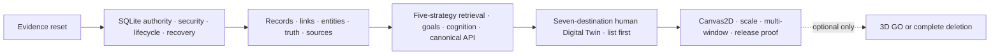

# Memory Graph Production Redesign — Backend-First Implementation Roadmap

**Status:** Planned/Unverified. No work item, milestone, or exit condition below is complete without linked validation artifacts.
**Critical order:** `F0 → F1 → F2 → F3 → F4 → F5`; optional `F6` only after F5. Backend authority, policy, lifecycle, recovery, semantic truth, retrieval, and API evidence must complete before futuristic UI polish.

## 1. Delivery Laws

1. SQLite v2 is the only authority. Each hard cutover deletes the superseded write path after parity evidence; no dual-write, compatibility authority, adapter SQL, renderer authority, or Python authority survives.
2. Security fixes are forward-only. Rollback disables remote/mutation/optional capability or enters read-only safe behavior; it never restores permissive auth, direct writes, client filtering, false crypto, or stale schemas.
3. Every gate has entry evidence, executable exit evidence, user-visible truth, rollback, and artifact manifest. A checked task is not an exit artifact.
4. Resource-heavy work is serialized on the owner laptop: only one 100k generation/evaluation, Cargo release build, Playwright/WebKit run, SBOM scan, model download/build, or corruption campaign at a time. Lightweight schema, Rust unit, TypeScript reducer, fixture authoring, and documentation work may run in parallel when they do not mutate the same contract.
5. Complete semantic DOM list/table workflows are the accessibility and renderer fallback. Canvas2D is planned but evidence-conditional; 3D is never on the F0–F5 critical path.

## 2. Workstreams and Ownership

| Workstream | Scope | Primary requirements | Gate span |
|---|---|---|---|
| `W-EVIDENCE` | fixtures, manifests, coverage/orphan lint, baselines, reviews | MGR-027, 029, 048 | F0–F6 |
| `W-AUTH` | schema, AuthorityTx, events, idempotency, revisions, outbox | MGR-005, 008, 033–035 | F1–F3 |
| `W-SEC` | Effective Policy, memory modes, server boundary, source/tool isolation, observability | MGR-003–004, 028, 043 | F1–F5 |
| `W-LIFE` | forget/restore/delete, crypto honesty, recovery/rebuild | MGR-017, 040–042, 045 | F1–F5 |
| `W-SEM` | records, Memory Links, ontology, entities, truth/time, consented sources | MGR-002, 010, 018–019, 034, 037, 046 | F2–F4 |
| `W-RET` | exact vectors, FTS5, graph/time/goal retrieval, RRF, traces, evaluation | MGR-006–007, 025, 036, 038, 042 | F3–F5 |
| `W-COG` | scheduler, goals, consolidation, tool learning | MGR-009, 038–039, 044–045 | F3–F5 |
| `W-API` | canonical v2 DTO/error/capability, Tauri/Axum parity, patches | MGR-007–008, 020, 032 | F2–F5 |
| `W-HUMAN` | seven destinations, list/table, inspector, correction/lifecycle/action workflows | MGR-012–014, 024, 026, 031 | F4–F5 |
| `W-2D` | deterministic Canvas2D scene, camera, culling, responsive input, quality ladder | MGR-015–016, 022–023, 026 | F4–F5 |
| `W-RELEASE` | multi-window, performance, interchange, SBOM/license, regression, cutover cleanup | MGR-021, 027–029, 032, 047–048 | F5 |
| `W-3D` | optional preregistered renderer study and GO/delete | MGR-030, 047–048 | F6 |

## 3. Gate Plans

### F0 — Evidence Reset and Contract Freeze

**Entry:** normative requirements MGR-001–048, design §20, decisions MGD-001–046, audit source, and current repository observation are available; no implementation status is inferred.

**Implementation slices:**
1. Build machine-readable ID inventory and fail on orphan/duplicate MGR, MGD, MG finding/opportunity, suite, risk, gate, and artifact-class IDs.
2. Freeze fixture generator contracts/seeds and independent expected-answer production; define reference-hardware and evidence manifest schemas.
3. Inventory current claims, live write/read/import/export routes, current SVG/dormant 3D, schema/model/license facts, and classify each as Current, Planned, Unavailable, or Unknown.
4. Capture honest cold/warm baseline limitations without promoting them to acceptance targets. Resolve wording so “Digital Twin,” confidence, Used, community, deletion, crypto, and 3D cannot overclaim.

**Parallelism/resources:** audit mapping, manifest schema, fixture design, and claim inventory may proceed in parallel; do not generate the 100k fixture or run broad builds yet. One owner merges ID registries to avoid drift.

**Hard cutover:** documentation/evidence status vocabulary becomes authoritative for this feature; old checked tasks/readiness prose cannot drive status.

**Exit artifacts:** F0 manifest; 48/48 MGR, 46/46 MGD, 65/65 findings, 31/31 opportunities orphan report; claim inventory; fixture/evidence schemas; command catalog; baseline report; approved risk owners. All remain Planned/Unverified.

**Rollback:** revert only malformed planning edits; never restore false shipped claims. **User-visible milestone:** none—product truth is clarified, not expanded.

### F1 — SQLite Authority, Security, Lifecycle, and Recovery

**Entry:** F0 manifest passes; schema/authority/security/lifecycle contracts and corruption fixtures are frozen; remote profile remains disabled by default.

**Implementation slices:**
1. Fresh-create SQLite v2 meta/events/idempotency/revision/audit/outbox/policy/source/key/lifecycle tables with constraints, append-only triggers, pragmas, checksums, and one core composition root.
2. Implement WritePolicyEngine + AuthorityCommandBus transaction: admission, memory mode, policy meet, semantic rows, immutable Events, Audit, outbox, idempotency result, and exactly one graph revision.
3. Route native, desktop, server, MCP, OpenClaw, sidecar, tool and import durable writes through the boundary; delete direct/legacy paths after parity tests.
4. Enforce loopback default and fail-closed remote startup; implement policy-before-planning, policy-keyed caches/cursors/log redaction and paired-world non-interference.
5. Implement forget/restore/delete preview and reconciliation, truthful crypto capability states, startup integrity, Recovery_Mode, and isolated derived-index rebuild skeleton.
6. Establish FTS5 and vector partition manifests without claiming F3 retrieval readiness.

**Parallelism/resources:** schema/AuthorityTx is the serial spine. Remote security tests, lifecycle UI copy, fixture generation, and rebuild harness may proceed against frozen ports. Serialize DB fault injection, migration, and model artifact work; no F2 semantic writes merge before AuthorityTx and policy properties pass.

**Hard cutover:** initialize/reset the pre-production DB to v2; remove legacy schema writers and unsafe remote routes. Read adapters may temporarily expose v2-only capability errors, never dual truth.

**Exit artifacts:** V-AUTH, V-SCHEMA, V-POLICY, V-LIFE, V-CRYPTO, V-REC and initial V-REBUILD/V-FAULT manifests; zero bypass/direct writes, partial commits, Event mutations, policy leaks, or false crypto claims; remote startup negative matrix; Recovery_Mode demonstration.

**Rollback:** disable mutation/remote and use policy-safe local read-only/Recovery_Mode; reset KRIA data and re-create v2 if needed. Never restore a bypass. **User-visible milestone:** honest local memory lifecycle and Health/recovery state may be exposed only after contracts pass; no futuristic graph claim.

### F2 — Semantic Records, Memory Links, Entities, Truth, and Sources

**Entry:** F1 authority/policy/recovery predecessor manifests pass; schema extension uses the same AuthorityTx; canonical ontology/version rules are frozen.

**Implementation slices:**
1. Add typed Memories, Events, Entities, Aliases, Mentions, Evidence, Goals, Episodes, Summaries, Skills, Rules, Retrieval Traces, Feedback, and source records with complete provenance/policy/truth/time.
2. Make `Memory_Links` the only governed semantic-link model with required types `derived_from`, `supports`, `contradicts`, `mentions_entity`, `superseded_by`; validate mixed endpoints, identity, evidence, direction, reflexivity, validity and revision.
3. Implement dual Valid/Transaction Time, centralized current predicate, contradiction/supersession/correction lineage, and canonical entity-primary graph projection.
4. Implement conservative resolution proposals, previewed merge/split/reversal, strong-ID-only automatic resolution, and policy-preserving mention provenance.
5. Implement consent-gated source ingest/cancel/dedup/revoke/cascade and content-as-data fencing. Generated navigation and analytics never become authority topology.

**Parallelism/resources:** ontology/link, temporal/truth, entity resolution, and source ingestion can develop in parallel after schema IDs/ports freeze; shared migration and canonical DTO changes serialize through one owner. 1k/10k fixtures only; defer judged retrieval and visual polish.

**Hard cutover:** migrate/reset semantic data into canonical records/links and remove free-text/parallel untyped relationship paths after round-trip evidence.

**Exit artifacts:** V-SEM, V-TRUTH, V-ENTITY, V-GRAPH (semantic/cycle base), source consent/cascade and serialization/migration manifests; no generated topology, policy broadening, name-only merge, or lost lineage.

**Rollback:** disable the affected semantic command/source and retain authority read-only; use governed reversal for committed merge/correction; reset/reimport pre-production data rather than maintain parallel schema. **User-visible milestone:** policy-safe inspectable records, relationships, evidence, truth history, sources, and correction previews through developer/API surfaces—not yet polished Digital Twin.

### F3 — Hybrid Retrieval, Goals, Consolidation, Tool Learning, and Canonical API

**Entry:** F2 typed semantics/truth/links pass; exact model manifest/license disposition is approved for testing; judged corpus and 100k fixture hashes are frozen.

**Implementation slices:**
1. Implement exact SQLiteVectorStore for pinned 384d model, f64 cosine-equivalent scoring, model partitions and deterministic rebuild; retain FTS5 offline floor.
2. Implement five bounded strategies—FTS5, exact vector, ≤3-hop cycle-safe graph, temporal, active goal—with deterministic query classes, candidate limits, policy/truth/version gates and named Partial degradation.
3. Implement versioned weighted adaptive RRF, diversity/token packing, exact injected-order Retrieval Trace, ≥200-query evaluation and profile activation records.
4. Implement active goals/resumption and goal-aware recall; deterministic idempotent Episode→Summary→Skill→Rule consolidation; paired tool observations with n≥20/no-escalation learning.
5. Publish canonical v2 search/neighborhood/path/trace/aggregate/predict/diff/patch contracts, limits/errors/capabilities/cursors; thin Tauri/Axum adapters and normalized parity.
6. Implement patch/revision reducers contract and priority scheduler: blocking workers, cancellation, foreground preemption, queue/resource bounds.

**Parallelism/resources:** vector oracle, graph traversal, temporal/goal strategies, API adapters, and cognition may proceed in parallel against frozen DTOs. Serialize 100k generation, model inference, judged evaluation, performance profiling, and corruption tests. UI may build headless DTO validators/reducers only; no futuristic polish or capability copy.

**Hard cutover:** canonical v2 becomes the sole public memory/graph API after transport parity; remove legacy search/graph adapters and full-graph refresh paths.

**Exit artifacts:** V-VECTOR, V-RET-01..03, V-CONS, V-TOOL, V-XPORT, V-PERF, patch/cursor/cycle/fault/degradation reports; judged thresholds and 100k backend budgets pass; no >50ms async blocking span and foreground yield ≤100ms.

**Rollback:** disable failed vector/graph/time/goal strategy as named Partial; retain safe FTS5. Reject new RRF profile, disable patches in favor of bounded v2 refetch, pause cognition/tool learning. Never broaden policy or reload a full graph. **User-visible milestone:** backend Recall/Explain APIs can truthfully report strategy availability, evidence, Used items, goals, and bounded graph answers.

### F4 — Canonical API Integration and Complete Human Digital Twin, List First

**Entry:** F3 backend contracts, negative paths, performance floors, host parity, capability states, and traces pass. Product copy is bound to real capabilities.

**Implementation slices:**
1. Build one Memory Control Center with exactly seven destinations: Overview, Recall, Knowledge, Timeline, Goals, Sources, Health; each consumes one policy/revision-aware client and explicit capability/error states.
2. Deliver semantic DOM list/table + inspector first for find, filter, inspect provenance/truth, explain stored/recalled/used, correct, merge/split, relate/path, goal/resume, source consent/revoke, forget/restore/delete, offline/Recovery workflows.
3. Implement renderer-neutral Semantic Scene and typed authorized actions; reducer guards for generation/policy/revision, pending writes, patch convergence, bounded refetch, focus ownership/restore, per-window intent.
4. Add deterministic Canvas2D implementation only after list/action parity: query-scoped layout, spatial hit testing, camera/fit actions, culling, responsive mouse/touch/keyboard, finite motion, quality ladder and renderer failure fallback.
5. Cover empty/loading/ready/partial/stale/offline/unauthorized/timeout/malformed/pending/conflict/deleted/recovery states and honest relative score/Unavailable/generated navigation language.

**Parallelism/resources:** seven destination shells and reducer/unit tests may parallelize after API/scene schemas freeze; list/inspector/actions precede Canvas. Serialize WebKitGTK Playwright, Orca, visual matrix and frame/heap profiling. Do not begin 3D or decoration ahead of incomplete backend/list workflows.

**Hard cutover:** replace old MemoryUniverse/global graph state only after complete list/action and v2 E2E parity; delete synthetic topology, inert controls, duplicate business logic, and unsupported capability copy.

**Exit artifacts:** V-UI-UNIT, V-DT, V-E2E, V-A11Y, V-VIS and initial V-RESOURCE; every destination and primary workflow succeeds list-first; map/list/inspector action parity; WCAG 2.2 AA/Orca; deterministic semantic screenshots; frame/idle/heap targets; no simulated control.

**Rollback:** list/table/inspector remains complete; disable divergent map action or use static/minimal evidenced 2D; preserve stale labeled snapshot and bounded refetch. **User-visible milestone:** complete accessible human Digital Twin for finding, understanding, correcting, forgetting, and explaining KRIA memory; Canvas is present only if proven.

### F5 — Production Canvas2D, Scale, Multi-window, Interchange, and Release Proof

**Entry:** F4 complete list-first product and conditional Canvas evidence pass; all earlier P0 artifacts linked; release candidate dependencies and hardware manifest frozen.

**Implementation slices:**
1. Run 100k end-to-end correctness/latency/query-plan/resource campaigns under competing local-model workload; tune only within frozen semantic/policy contracts.
2. Prove multi-window session ownership, shared immutable cache keys, patch/refetch convergence, focus isolation and deletion invalidation.
3. Complete derived rebuild/model migration, corruption recovery, deletion residue, export/import/export open-format round trip and optional-field preservation.
4. Complete fault injection, regressions, offline/pressure quality ladder, privacy-safe observability overhead/redaction, deterministic visual/accessibility matrix and release packaging.
5. Produce exact-lock model/asset/Cargo/npm/Python license dispositions, reconcile project license, emit SPDX/CycloneDX SBOM and vulnerability report.
6. Delete superseded schemas, stores, routes, adapters, SVG/renderer business logic, dead tests, dependencies and false documentation claims.

**Parallelism/resources:** report/review preparation may parallelize with focused fixes. Serialize all heavy 100k, release Cargo, WebKitGTK/Orca, SBOM, model and fault campaigns; freeze inputs between run and sign-off. No F6 branch is merged before F5 release manifest.

**Hard cutover:** v2 authority/API/Control Center/conditional Canvas becomes the sole shipped path; remove temporary flags except explicit safe capability disables with owners/removal conditions.

**Exit artifacts:** complete F0–F5 manifest chain; all validation suites and artifact checksums; 48/48 MGR and 46/46 MGD mapped; 65/65 findings and 31/31 opportunities retain evidence-based statuses; zero open blocking risk; independent Backend, Security/Privacy, Data Integrity, Retrieval, Product/UX, Accessibility, Performance, Supply Chain and Release sign-offs.

**Rollback:** disable remote, mutation, analytics, patches, detached windows, Canvas or cognition independently while retaining safe local authority/list workflows; reset pre-production KRIA data if necessary. Never restore legacy paths. **User-visible milestone:** production-ready authoritative 2D/list Memory Control Center with bounded scale, recovery, portability and release evidence.

### F6 — Optional True 3D GO/NO-GO

**Entry:** signed F5 manifest; no open blocking risk; preregistration names one user task, authority-backed z-axis, baseline, sample protocol, ≥10% median task-time/error target, ≥30 FPS/resource/a11y/license thresholds before implementation.

**Implementation slices:** minimal renderer consumes the same scene/actions and semantic list fallback; packed bounded worker data, LOD/culling, labels, camera/focus, touch/keyboard/reduced motion, context recovery and idle freeze. No separate semantics or capability.

**Parallelism/resources:** one isolated spike; serialize real-scene WebKitGTK profiles and user study; do not perturb F5 authority/API.

**GO exit:** V-3D passes every preregistered threshold and supply-chain review. **NO-GO exit:** delete controls, renderer, worker, dependencies, assets, tests, docs/marketing claims; retain only decision/evidence.

**Rollback:** complete removal is mandatory on failure or ambiguity. **User-visible milestone:** either an evidence-qualified optional view or no 3D surface at all; public readiness is unchanged.

## 4. Dependency Critical Path and Cutover Map

`F0 ID/evidence registry → F1 schema + AuthorityTx → F1 Write Policy/isolation → F1 lifecycle/recovery → F2 canonical records/links/truth → F3 exact indexes + five strategies → F3 canonical API/parity/traces → F4 list/inspector/actions → F4 conditional Canvas/accessibility → F5 100k/rebuild/interchange/release proof → optional F6`.

| Cutover | Must exist before | Delete/disable after evidence | Rollback floor |
|---|---|---|---|
| DB v2 | schema/authority/crash tests | legacy writers/schema assumptions | v2 read-only or reset/reimport |
| Canonical links | semantic round-trip/reversal | free-text/parallel link authority | governed reversal/reset |
| API v2 | host parity/limits/fault tests | legacy graph/search/full-refresh routes | bounded v2 read-only/refetch |
| Control Center | seven list-first E2E/a11y | old global graph/synthetic UI | complete semantic list |
| Canvas2D | scene/action/visual/resource proof | duplicate SVG business logic | list + minimal/static evidenced 2D |
| Release | full manifest/sign-offs/SBOM | temporary unsafe/dead paths | capability disable/read-only, never legacy |
| 3D | F6 GO | none if GO; all 3D artifacts if NO-GO | F5 product |

## 5. Gate Status Discipline

A gate is `Planned` until every entry predecessor, required suite, artifact checksum, quantitative threshold, and named reviewer sign-off is linked. `In progress` is not evidence; `Implemented` without executable evidence is not `Verified`. No new implementation is marked complete by this roadmap.
