# Design Document — KRIA Memory Upgrade (Cognitive Memory System)

> **Authoritative source of architectural intent:** `MEMORY_ARCHITECTURE_FINAL.md`
> (§1–§37). That document defines *WHY/WHAT/WHEN/WHERE*. This design defines *HOW* —
> the implementation-ready blueprint. Where the architecture doc's later sections
> override earlier ones, this design follows the override chain: **§27 (Red Team) >
> earlier optimistic phrasing**, **§34 (corrected constraints) > §7/§9/§23**, and
> **§36 (canonical spec) is the settled contract**. §37 invariants (**L1–L12**) are
> treated as inviolable laws.
>
> **This design does not redesign the architecture.** Its job is to bridge the gap
> between architectural intent and code: expose every implementation ambiguity, edge
> case, undefined behavior, lifecycle/concurrency/recovery gap, API gap, schema
> problem, security risk, and production concern — and resolve each with a chosen,
> justified engineering decision that preserves the invariants. Every deviation from
> a literal reading of the architecture is called out in **§4 Decision Register**
> with justification. Nothing is silently invented.
>
> **Placement:** all domain logic lives in `crates/kria-core/src/memory/` per
> `structure.md`. Tauri command/event names are contracts and are **not** modified.

---

## 0. How to read this document

- **§1–§3** — overview, fidelity to architecture, scope.
- **§4** — the Decision Register: every ambiguity resolved, one choice, justified.
- **§5–§13** — **High-Level Design**: boundaries, components, data flow, module
  breakdown, storage, data model, event contracts, state machines, integration.
- **§14–§24** — **Low-Level Design**: SQLite DDL, LanceDB layouts, storage-port
  traits (Rust), Write Policy pipeline, retrieval pipeline, cognitive workers, TMS,
  modes enforcement, key algorithms + signatures.
- **§25–§32** — cross-cutting: scheduler/workers, concurrency, caching, security,
  observability, recovery, migration + embedding-version crisis.
- **§33** — Red-Team edge-case catalog mapped to concrete mechanisms (E1–E30, N1–N17).
- **§34** — correctness properties. **§35** — testing strategy. **§36** —
  requirements traceability. **§37** — glossary + open questions.

---

## Overview

*(§1)*

KRIA Memory is a **local-first cognitive memory system** for a desktop assistant. It
is the cognitive backbone every subsystem reads from and writes through — not a
database subsystems query directly. It remembers, understands, organizes, reasons,
consolidates, forgets intelligently, and improves over years, while staying
transparent, private, offline-capable, and fully user-controlled.

The implementation rests on **one keystone structural decision** (architecture Issue
29 / ADR-001, invariant **L2**): **SQLite is the sole transactional authority.** The
event log, derived memories, graph adjacency, goals, preferences, and a transactional
**outbox** all live in one SQLite database and commit in one local ACID transaction.
Every other store — the vector index and the full-text index — is a **derived,
rebuildable index** fed exclusively by the outbox. This collapses the distributed
dual-write consistency problem into a single-database transaction, which is the
property that makes the whole system tractable to build correctly.

Two more decisions shape everything:

1. **The Memory Write Policy Engine is the single mandatory write gate** (invariant
   **L3**), split into a synchronous deterministic **fast path** (`<2 ms`, no LLM,
   must succeed, persists the raw event) and an asynchronous best-effort **slow
   path** (embedding, dedup, contradiction, classification, importance, graph,
   commit-derived). Raw events are always durable; enrichment is best-effort.
2. **The Cognitive Scheduler owns all background work** (ADR-008). Consolidation,
   dreaming, decay, re-embedding, reconciliation, entity resolution, backup, and
   salience are priority-classed, battery/thermal/memory-aware, chunked,
   checkpointed, and cancellable — so background cognition never starves the user or
   drains the laptop.

The system degrades gracefully: with no LLM, no GPU, no embedder, and no network, raw
storage plus keyword and graph retrieval still function (invariant **L8**).

---

## 2. Fidelity to the Architecture (Invariants We Must Not Break)

These are the architecture's **L1–L12** laws (§37.2). Every design choice below is
checked against them; §34 restates them as machine-checkable correctness properties.

| # | Law | Where enforced in this design |
|---|---|---|
| **L1** | An immutable append-only event log always exists | §14 `events` table (no UPDATE/DELETE grants); §16 EventStore port |
| **L2** | SQLite is the sole transactional authority; all other stores derived + rebuildable | §11 storage arch; §16 ports; outbox §14/§18 |
| **L3** | No subsystem writes durable state directly — everything via Write Policy Engine | §18 pipeline; §16 no public store writes; grep-gate test §35 |
| **L4** | All derived state rebuildable EXCEPT LLM-derived memory content (itself durable); indexes always rebuildable | §11; §18 slow path persists derived memory; §31 rebuild |
| **L5** | Provenance never lost; every memory traces to source event(s); compressed memories carry `derived_from` | §12 data model; §20 compression |
| **L6** | Every memory is explainable | §28 `explain_memory` / `explain_retrieval` |
| **L7** | Plugins/skills/agents never bypass namespace isolation | §18 fast-path namespace gate; §27 concurrency; §35 invariant test |
| **L8** | Memory functions with no LLM/GPU/internet/embeddings | §18 fast path LLM-free; §19 degradation ladder; §31 |
| **L9** | Erasure via crypto-shredding; forget → cryptographically unreadable + cascade | §29 security; §14 `shred_keys`; §21 forget flow |
| **L10** | Reads never block on the writer; only the atomic commit holds the writer | §27 concurrency (WAL, read pool); N1/N2 |
| **L11** | Self-generated memory re-enters as untrusted through the Write Policy | §20 consolidation; §18 `source: self_reflection` |
| **L12** | Retrieval quality must not degrade as the bank grows (release gate) | §19 candidate gating; §35 scale benchmark (R12) |

**Fidelity rule:** if any task in the derived tasks list would violate L1–L12, the
task is wrong, not the law.

---

## 3. Scope & Non-Goals

Per architecture §36.0.

**In scope (v1, phased P1→P4):** storage authority + event log + outbox; Write Policy
Engine; Memory Modes; Cognitive Scheduler; Memory API Contract; embeddings (ONNX
floor); vector + full-text + graph retrieval with adaptive fusion; Truth Maintenance;
importance + Memory Worth; consolidation/dreaming; unified lifecycle
(merge/split/promote/compress/forget/delete/restore); Library ingestion + per-item
cascade; privacy/erasure (crypto-shred); backup/restore (authority-only);
observability; subsystem + OpenClaw integration; benchmark harness.

**Explicit non-goals (v1) — reserve abstractions only, do NOT build:** multi-device
sync, cloud services, multimodal (image/audio/video) *retrieval pipeline*,
local model training/LoRA, 3D visualization, autonomous multi-agent orchestration,
third-party plugin marketplace. These are Phase 5-6, gated by evidence. Schema fields
(`device_id`, `owner_id`, `scope`, `modality`, `embedding_model_version`,
`feedback_signal`, `preference_pair_id`, `training_eligible`, `hlc`) are reserved
day-one so these arrive without destructive migration (architecture §36.5, §33 15.1).

**Migration context:** this feature consolidates KRIA's current fragmented memory
(multiple SQLite DBs + brute-force `VectorIndex` in `crates/kria-core/src/memory/`)
into the unified authority + LanceDB index. Migration path in §32.

---

## 4. Decision Register (Ambiguity Resolutions)

Each row is a genuine implementation ambiguity, undefined behavior, or conflict
between architecture sections / workspace constraints. Format: **Decision · Rejected
alternatives · Justification (alignment with architecture) · Invariant impact.**
These are the decisions that let multiple engineers converge on the same code.

### D-1 — Vector store: LanceDB (embedded) as the concrete VectorStore port for v1

**Conflict:** Architecture §7/§9/§23 chose **LanceDB**; §34–§37 (ADR-002) later
promote **Qdrant** (local service) as primary, with "*LanceDB acceptable alt behind
trait*". The user task prompt and workspace `tech.md` specify **LanceDB** and
in-process ONNX embeddings, with no service dependency.

**Decision:** Implement `VectorStore` with **LanceDB embedded** as the v1 concrete
backend. Keep the `VectorStore` trait minimal and backend-neutral so **Qdrant remains
the named escape hatch** (activated by config, zero caller change) if/when hybrid
payload-filtering or >1M-vector quantization is needed.

**Rejected:** Qdrant-primary now — adds a supervised separate-process lifecycle (§35
C2), violates the "no service dependency" workspace constraint, and complicates the
local-first floor. ADR-002 itself lists LanceDB as a valid alternative behind the
trait; §34.2 lists "LanceDB still valid alt."

**Justification:** Embedded LanceDB *strengthens* invariant **L8** (no process to
supervise → fewer degradation branches) and preserves **L2/L4** (LanceDB is a
rebuildable index either way). The trait port (ADR-002 "Migration → LanceDB behind
trait", C5 minimal-trait rule) is exactly the seam the architecture reserved for this
choice. **Invariant impact:** none — L2/L4/L8 preserved; the escape hatch is honored.

### D-2 — Full-text search: SQLite FTS5 for v1; Tantivy behind SearchStore trait for P2+

**Conflict:** §34/ADR-003 make Tantivy primary with "FTS5 as the P1 floor."

**Decision:** Ship **FTS5** as the P1 `SearchStore` backend (zero new dependency,
lives inside the authority DB, trivially consistent). Introduce **Tantivy** behind the
same `SearchStore` trait at P2 for Library-scale BM25/faceting. FTS5 remains the
permanent degradation floor (§35 C2).

**Justification:** §36.1 marks Tantivy "Required P2 (SQLite FTS5 is the P1 floor)."
Keeping FTS5 inside SQLite means the FTS index is *not* a separate rebuildable store
in P1 — it commits in the same transaction as the authority, eliminating one outbox
fan-out target and one drift surface (C1) until Library scale actually demands
Tantivy. **Invariant impact:** none.

### D-3 — Embedding model: EmbeddingGemma-300M ONNX with a MiniLM low-RAM fallback tier

**Decision:** Default embedder = **EmbeddingGemma-300M** via `ort` (ONNX Runtime),
Matryoshka output (store 768-dim cold, search 256-dim hot). Provide **all-MiniLM-L6-v2
(384-dim)** as an automatically-selected fallback on low-RAM machines (hardware-tier
detection, `kria_config.toml`). Each tier is a **distinct `embedding_model_version`**
(architecture §9, C4) — vectors from different tiers never mix.

**Justification:** §30 "KEEP + tiered fallback"; §34.2 in-process floor. Model
checksums pinned + verified on load (§17 threat model). **Invariant impact:** feeds
the embedding-version-crisis machinery (§32); preserves L8 (FTS works with no
embedder).

### D-4 — Storage-port set: four traits, exactly as the task specifies

**Decision:** Define **`EventStore`, `RelationalStore`, `GraphStore`, `VectorStore`**
as the storage ports (architecture calls out GraphStore/VectorStore explicitly and
implies EventStore/RelationalStore). `SearchStore` (D-2) is added as a fifth port
because FTS is a distinct rebuildable index with its own lifecycle. All are `async`
traits, object-safe, in `crates/kria-core/src/memory/ports/`.

**Justification:** trait ports are invariant-level (L2, ADR-001..004). Minimal
surface per C5 (no SQL/Cypher leakage). **Invariant impact:** enables L2/L4 backend
swaps.

### D-5 — Outbox fan-out and per-index cursors

**Decision:** One `embedding_outbox` table with a **`(memory_id, index_target, op)`**
grain and **per-index cursors** (`outbox_cursor` table keyed by `index_target`), so
LanceDB and (later) Tantivy replay independently and idempotently (architecture C1).
Relay is a Cognitive-Scheduler P2 job. Idempotency key = `(memory_id, index_target,
content_hash)`.

**Justification:** §33 C1 (two rebuildable indexes = two drift surfaces → per-index
cursors + independent idempotent replay). **Invariant impact:** upholds L4 eventual
convergence; R11.

### D-6 — "Session" and "Episode" concrete definitions

**Decision (architecture Issue 10):** A **session** starts on first user input after
launch or after a `>2h` inactivity gap; ends on explicit close, app quit, or `2h`
inactivity; for always-open KRIA a logical session also rolls at local midnight.
`session_id` = UUID v7 on every event. Long active sessions are chunked into `≤4h`
**episodes**; an episode is immutable once closed and is the unit of session-end
reflection. Crash leaves a session "open"; startup detects open sessions `<24h` old
and offers resume.

**Justification:** Issue 10 verbatim. **Invariant impact:** bounds episode size;
enables crash resume (§31).

### D-7 — Importance and decay are unified, deterministic, LLM-optional

**Decision (architecture Issue 9 + 11):** `importance ∈ [0,10]` computed
deterministically at write time (no LLM) per the Issue-9 sigmoid formula; LLM may
nudge `±2` only for genuinely ambiguous cases. Decay is unified with importance:
`decay_rate ∝ 1/(1+importance)`; staleness class can **veto** decay
(Immutable/Permanent → decay disabled). Archival candidate iff `effective_retention <
archive_threshold AND staleness_class ∈ {slow, volatile_*} AND no_access > 30d`.
Exact formulas in §22.

**Justification:** Issues 9 & 11 are the only place these formulas are defined;
adopted verbatim. **Invariant impact:** deterministic path preserves L8.

### D-8 — Memory Worth is a normalized, difficulty-adjusted, min-sample soft signal

**Decision (architecture Issue 6 + N13 + 32.4):** Credit divided `1/N` across the
retrieval set; difficulty-adjusted; requires `≥20` observations before influencing
retrieval/archival; confidence gains from utility are **logarithmic and capped `<1.0`**
for non-user-stated facts; a `referenced?` signal (was the memory actually used, not
merely surfaced) is captured. Memory Worth is a **soft re-rank + archival hint,
never a hard-delete trigger.**

**Justification:** Issue 6 (bias fix), N13 (inflation loop), 32.4 (signal capture).
**Invariant impact:** supports L12 (candidate gating without forgetting the hard-case
memories).

### D-9 — Reflection/dreaming output is untrusted and evidence-gated

**Decision (architecture Issue 13 + N3 + L11):** All consolidation/reflection output
re-enters through the Write Policy Engine as `source: self_reflection`, starts at
capped confidence `≤0.6`, requires `≥N` supporting episodes before promotion to a
rule, runs contradiction checks against user-stated facts (rejected on conflict), and
has **reflection-of-reflection depth capped at 1** with a terminal compression ceiling
at level 3 (Rule). Consolidation is content-hash idempotent.

**Justification:** L11 + Issue 13 + N3 (infinite-loop bound). **Invariant impact:**
directly implements L11; bounds N3.

### D-10 — Entity resolution is conservative and reversible

**Decision (architecture N5 + 32.1):** A first-class async **Entity Resolution
Engine** (canonicalize → block → score → decide → reversible). Auto-merge **only** on
strong identifier match (email/handle/URL/repo-path); name-only similarity **never**
auto-merges people; medium signals propose (user-confirm or evidence threshold).
Every merge records `merged_from`; split restores. Bias: wrong-merge is worse than
no-merge.

**Justification:** N5 + 32.1 verbatim. **Invariant impact:** protects privacy
(prevents cross-person memory conflation).

### D-11 — Injection/poisoning detection fast-path is deterministic

**Decision (architecture N16):** The security scan on the Write Policy **fast path**
is deterministic (pattern + structural heuristics: "does this candidate fact contain
imperative instructions?"). Any LLM-based semantic check runs only on the **slow
path**, with content clearly delimited as untrusted **data** (never instructions),
and is **advisory** (flag), never auto-execute.

**Justification:** N16 — a deterministic gate cannot be prompt-injected.
**Invariant impact:** L8 (fast path LLM-free), L3 security responsibility.

### D-12 — Backup is authority-only; indexes rebuild on restore

**Decision (architecture C3 + R10):** Back up **only** the SQLite authority + the
outbox cursor. Do **not** back up LanceDB/Tantivy. Restore = SQLite snapshot → replay
outbox → rebuild indexes to exact authority state. Backups are versioned,
self-describing (embedded schema snapshot + `format_version`), checksummed (BLAKE3),
and encrypted (age/libsodium).

**Justification:** C3 — eliminates cross-store snapshot skew and *simplifies* backup.
**Invariant impact:** L2/L4; R10/R13.

### D-13 — Crypto-shredding for erasure over the immutable log

**Decision (architecture Issue 2 + ADR-006 + L9):** Each erasure-scoped subject
(person, employer, project, session, library item) has a unique key in a **shreddable
keyring** (`shred_keys` table, separate from event payloads; key material referenced
from OS keychain where available). Sensitive event payloads are encrypted per-subject.
`forget(X)` = destroy X's key (ciphertext becomes unreadable) **and** cascade-delete
derived memories, vectors, edges, chunks (§21). Key loss is unrecoverable by design;
UX warns + offers export-before-delete.

**Justification:** Issue 2 + N8 (embeddings of shredded content also purged).
**Invariant impact:** implements L9 while preserving L1 (log unchanged).

### D-14 — Concurrency model: single writer, WAL read pool, two-queue scheduler

**Decision (architecture N1 + N2 + L10):** Exactly one SQLite **write connection**
(serialized); a **pool of read connections** (WAL → readers never block the writer).
Retrieval and the slow-path's dedup/contradiction use read connections only; the
writer is held solely for the atomic commit. Background writes are chunked (`≤100
rows/txn`, `≤50 ms`), yielding between batches; a two-queue scheduler drains the
foreground (P0) queue before background. Single-flight per background job.

**Justification:** N1 (no read/write cycle deadlock), N2 (no writer starvation), L10.
**Invariant impact:** directly implements L10; prevents deadlock/starvation.

### D-15 — Temporal correctness decoupled from wall clock (HLC + UTC)

**Decision (architecture N10):** Every event stores UTC instant **and** originating
timezone offset. **Ordering uses UUID v7 + a Hybrid Logical Clock**, never wall-clock
comparison. Temporal queries ("yesterday") resolve in the user's *current* local
timezone against stored UTC. Backward clock jumps handled by HLC logical increment.

**Justification:** N10 verbatim. **Invariant impact:** correctness under clock drift /
DST / timezone travel; reserves multi-device sync (§33 15.11).

### D-16 — Reconciliation sweep is a first-class maintenance worker

**Decision (architecture N12):** A weekly Cognitive-Scheduler P1 job walks every
derived index and repairs referential integrity against the SQLite authority: purge
orphan vectors, remove dangling edges, delete parentless chunks, shred unused keys.
Orphan detection = "exists in index but not in authority" scan (trivial because
SQLite is the sole authority, Issue 29).

**Justification:** N12 + C1. **Invariant impact:** enforces L2/L4 convergence; R11.

### D-17 — Merge/split cascade is atomic across all stores (P2 blocker)

**Decision (architecture R14 + §35.6 blocker 3):** Merge/split executes as: (1) one
SQLite transaction updating `memories`, `derived_from`, `contradicted_by`, graph
edges, Memory-Worth counters, and appending an outbox op for each affected index; (2)
the outbox relay applies index changes idempotently; (3) reversible `≤30 days` via a
tombstoned `merge_provenance` record. No index is mutated outside the outbox.

**Justification:** R14 + explicitly named a must-fix Phase-1/2 blocker. **Invariant
impact:** preserves L2 (single-txn authority) for a historically under-specified op.

### D-18 — Cognitive State (working context) minimal in v1

**Decision (architecture 32.7):** v1 persists nothing new: `current_focus`,
`active_intent`, `task_context` extend the existing per-turn `TurnMemory` (RAM only,
snapshot-able for crash resume). `attention_stack` + `mental_workspace` are deferred
to Phase 5 (autonomy). Explicitly not over-built.

**Justification:** 32.7 scope control. **Invariant impact:** none (ephemeral, not
memory).

### D-19 — Feedback is a first-class event type from P1

**Decision (architecture 15.3 + 32.4):** `FeedbackEvent { target_id, signal, context,
ts }` with signal taxonomy (`thumbs_up/down`, `correction(text)`, `undo`, `cancel`,
`edit(diff)`, `overwrite`, `ignored_suggestion`, `repeated_task`,
`automation_success/failure`). Wired to Memory Worth + confidence calibration +
adaptive RRF weights. Only thumbs may be UI-wired initially, but the type exists P1.

**Justification:** 15.3 "Required" — highest-value learning signal.
**Invariant impact:** none new; supports L12 self-improvement.

### D-20 — Namespace + scope are enforced at write AND read (defense in depth)

**Decision (architecture Issue 24 + L7):** Namespace/ownership checked on the
fast-path write gate **and** as a mandatory retrieval filter. Workspace mode rejects
cross-namespace writes. A test-suite invariant asserts no retrieval returns
cross-scope memories unless explicitly global/user-promoted.

**Justification:** Issue 24 (isolation is a query-time invariant, not a convention).
**Invariant impact:** implements L7; R18.

---
---

# PART A — HIGH-LEVEL DESIGN

## Architecture

*(§5 — System Boundaries & Context; see also §6 component planes, §9 storage tiers)*

The memory system is a bounded context inside `kria-core`. Its **only** public
surface is the **Memory API Contract** (§10, architecture 32.6). No consumer touches
a store directly (invariant **L2/L3/I-2**).

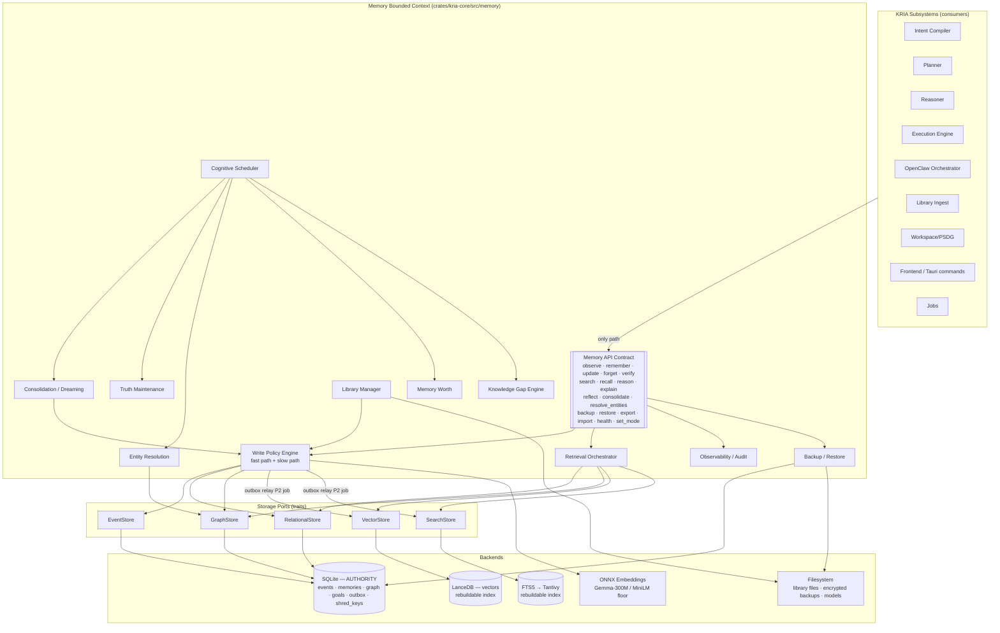

**Boundary rules:**
- **Inbound:** consumers call only the Memory API Contract (§10). Tauri commands in
  `crates/kria-desktop/src/commands/` are thin adapters over it; command/event names
  are unchanged (existing chat/session/memory contracts preserved per `structure.md`).
- **Outbound:** the memory context calls the LLM router (`crates/kria-core/src/llm/`)
  and the embedder via **traits** (`Embedder`, `LlmClient`) so both are optional and
  swappable — never a hard dependency (L8).
- **No shared mutable state** crosses the boundary except through the API.

## 6. Component / Subsystem Diagram (write + read + background planes)

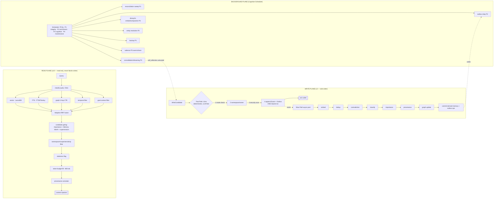

## 7. Data Flow

### 7.1 Write flow (the spine)

1. A subsystem emits a `WriteCandidate` via `remember()` / `observe()` (never a
   direct store write — L3).
2. **Fast path (synchronous, `<2 ms` p95, LLM-free, MUST succeed):**
   mode check → namespace/owner assignment → deterministic security scan → **append
   raw `Event` + one `embedding_outbox` seed row in a single SQLite transaction** →
   ack the caller. If the caller is Incognito, nothing is persisted; return
   `Rejected(mode)`. The raw event is now durable regardless of what happens next.
3. **Slow path (async worker pool, best-effort, consumes new events):**
   `embed → dedup (vector) → contradiction (vector+graph) → classify (deterministic,
   LLM only for ambiguity) → importance → provenance → graph update → commit derived
   `memory` row + per-index outbox ops`, all authority mutations in SQLite
   transactions (chunked, N2).
4. **Outbox relay (P2 job):** reads pending outbox rows per index cursor, writes
   LanceDB (and later Tantivy), marks done idempotently. Crash between steps → replay
   by `(memory_id, index_target, content_hash)`.

### 7.2 Read flow

`search(query, context)` classifies the query deterministically (`<5 ms`) into
`{temporal | entity | conceptual | recent | procedural}`, runs the 5 strategies in
parallel on **read connections only** (L10), fuses with adaptive RRF, gates the
candidate pool by importance + Memory Worth + supersession (L12), applies
namespace/scope/sensitivity filters (L7), flags stale memories (TMS), fills a token
budget (~800 tokens) rather than top-K, annotates provenance, and returns. Access
updates (`access_count`, `last_accessed`) are queued as low-priority writes, never
blocking the read.

### 7.3 Cognition flow

The Cognitive Scheduler fires triggers (idle `>30m`, session end, idle `>4h`/daily,
weekly, backlog threshold, post-failure/success). Consolidation/dreaming reads via
the read plane, produces reflections/compressions, and **re-submits them as untrusted
`WriteCandidate`s through the Write Policy Engine** (L11). It never writes derived
memory directly.

## Components and Interfaces

*(§8 — Module Breakdown; storage-port trait signatures in §16; API contract in §10)*

Each module: **purpose · responsibilities · ownership · dependencies · consumers ·
failure & recovery · extension points.** All under `crates/kria-core/src/memory/`.

### 8.1 `write_policy/` — Memory Write Policy Engine
- **Purpose:** the single mandatory write gate (L3, the spine).
- **Responsibilities:** fast path (mode/namespace/security/append-event+outbox); slow
  path (embed→dedup→contradiction→classify→importance→provenance→graph→commit); write
  batching; confirmation routing (secret/high-impact); false-promotion guard.
- **Ownership:** owns the *only* write path to durable state. Owns
  `WriteCandidate`/`WriteDecision` types.
- **Dependencies:** `EventStore`, `RelationalStore`, `GraphStore`, `Embedder` (opt),
  `LlmClient` (opt), Memory Worth, TMS (contradiction), classifier.
- **Consumers:** every subsystem (indirectly, via API), Consolidation (L11).
- **Failure & recovery:** fast path has no LLM/embedder dependency → cannot fail from
  their absence; on slow-path failure the raw event is already durable and the event
  is re-queued (bounded retries, then dead-letter to `enrichment_deadletter`).
- **Extension points:** pluggable classifier/security-scanner strategies;
  policy-decision hooks for new sensitivity classes.

### 8.2 `event_log/` — Event Store
- **Purpose:** immutable append-only audit/provenance/erasure ledger (L1).
- **Responsibilities:** append events (UUID v7 + HLC + checksum); tiered storage (hot
  SQLite ≤90d, cold compressed monthly segments); forensic replay (never memory
  regeneration — Issue 1/28); crypto-shred payload encryption.
- **Ownership:** owns `events` table + cold segment files.
- **Dependencies:** SQLite (authority), `shred_keys`, blake3.
- **Consumers:** Write Policy, Observability (`explain`), Backup, forensic tools.
- **Failure & recovery:** WAL replay on power loss; cold-segment checksums → corrupt
  segment quarantined, rest usable (Issue 26).
- **Extension points:** cold segment format (Parquet/zstd) is behind a
  `ColdSegmentCodec` seam; sync (Phase 6) consumes the same append stream.

### 8.3 `stores/` — RelationalStore, GraphStore, VectorStore, SearchStore ports + backends
- **Purpose:** backend-neutral persistence (L2/L4, ADR-001..004).
- **Responsibilities:** RelationalStore = memories/goals/prefs/outbox CRUD in the
  authority txn; GraphStore = entities/relationships + cycle-safe depth-capped CTE
  traversal; VectorStore = LanceDB upsert/search/delete by id + model-version
  partitioning; SearchStore = FTS index/query.
- **Ownership:** each port owns its store; only RelationalStore/GraphStore/EventStore
  participate in the authority transaction. Vector/Search are downstream.
- **Dependencies:** rusqlite (bundled, WAL, FTS5, CTE), lancedb, ort.
- **Consumers:** Write Policy (write), Retrieval (read), reconciliation, backup.
- **Failure & recovery:** vector/search corruption → rebuild from authority (L4);
  SQLite corruption → `integrity_check` → restore from backup (Issue 25).
- **Extension points:** swap LanceDB→Qdrant, FTS5→Tantivy, SQLite-CTE→Dgraph via the
  trait (D-1/D-2/D-4, C5 minimal-trait rule).

### 8.4 `retrieval/` — Retrieval Orchestrator
- **Purpose:** multi-strategy adaptive fusion within a token budget (§10 arch, L12).
- **Responsibilities:** query classification; 5 strategies; adaptive RRF; candidate
  gating; filters; staleness flags; token-budget fill; provenance annotation;
  multi-turn pinning; feedback signal capture (`surfaced/referenced/outcome`).
- **Ownership:** owns retrieval config + adaptive RRF weights.
- **Dependencies:** all read ports (read connections only — L10), Memory Worth, TMS.
- **Consumers:** Reasoner, Planner, Frontend, salience loop.
- **Failure & recovery:** any strategy may fail independently; retrieval degrades to
  the strategies still available (LanceDB down → FTS+graph, C2).
- **Extension points:** new strategy = new `RetrievalStrategy` impl; cross-encoder
  rerank added for Library QA only (P4).

### 8.5 `truth/` — Truth Maintenance System
- **Purpose:** never confidently rely on stale/contradicted knowledge (L-correctness).
- **Responsibilities:** staleness classes; evidence tracking + aging; confidence
  propagation; supersession (version history, never destroy); competing beliefs;
  verification-on-retrieval; deterministic contradiction-resolution order.
- **Ownership:** owns `evidence`, `supersession`, staleness metadata.
- **Dependencies:** RelationalStore, GraphStore, filesystem (for `verify_against`),
  Write Policy (writes revised facts).
- **Consumers:** Write Policy (contradiction step), Retrieval (staleness flags),
  Consolidation.
- **Failure & recovery:** verification source unavailable → mark "unverified,"
  never assert stale-as-current.
- **Extension points:** new staleness class; pluggable `Verifier` per source type.

### 8.6 `cognition/` — Consolidation, Dreaming, Reflection
- **Purpose:** turn storage into intelligence (compression spectrum) (L11).
- **Responsibilities:** trigger-based consolidation; two-mode dreaming
  (session/user-oriented); progressive compression (episode→skill→rule); reflection;
  self-model update; all output re-enters via Write Policy as untrusted.
- **Ownership:** owns consolidation checkpoints + trigger state.
- **Dependencies:** Scheduler, Retrieval, LlmClient (opt), Write Policy.
- **Failure & recovery:** checkpointed/resumable/idempotent (N14); LLM absent →
  queue (L8).
- **Extension points:** new cognitive operation; new trigger.

### 8.7 `entity_resolution/` — Entity Resolution Engine (32.1)
- Purpose/scope per D-10; owns `aliases`, `canonical_id`, `merge_provenance`; feeds
  GraphStore; conservative + reversible; runs on slow path / P2.

### 8.8 `library/` — Library Manager
- **Purpose:** personal knowledge library (documents don't decay).
- **Responsibilities:** streamed/checkpointed/resumable ingestion (N11); adaptive
  chunking; SHA-256 dedup; per-item provenance tagging (`source:
  library:{item}:chunk:{idx}`); per-item cascade delete (R8); versioning; incremental
  re-index.
- **Ownership:** `library_items`, `library_chunks`, `collections`, filesystem files.
- **Dependencies:** Write Policy (extracted facts), VectorStore, filesystem, sidecar
  document parser (optional).
- **Failure & recovery:** ingestion is a resumable Job (survives restart); interrupted
  re-index resumes from checkpoint; old version retained until new fully indexed
  (atomic swap, Issue 25).
- **Extension points:** modality-partitioned tables reserved (multimodal P5);
  GraphRAG community summaries (P4).

### 8.9 `scheduler/` — Cognitive Scheduler (32.2, foundational)
- **Purpose:** sole owner of all background work.
- **Responsibilities:** priority classes P0–P4; resource awareness (battery/thermal/
  memory); cooperative cancellation; chunked/checkpointed/resumable jobs;
  single-flight; writer arbitration (two-queue).
- **Ownership:** the background runtime; the write-arbitration queue.
- **Dependencies:** Tokio, Runtime Budget Manager, all background workers.
- **Consumers:** every background worker registers here.
- **Failure & recovery:** a crashed job is resumed from checkpoint; scheduler restart
  re-reads durable job state.
- **Extension points:** register a new `BackgroundJob` with a priority + resource
  profile.

### 8.10 `governance/` — Memory Worth, Knowledge Gap, Runtime Budget, Feedback
- Memory Worth (D-8), Knowledge Gap Engine (32.5), Runtime Budget Manager (32.3),
  Feedback intake (D-19). Read via read ports; write via slow path / Write Policy.

### 8.11 `modes/` — Memory Modes
- Enforces the 11 modes (Permanent/Temporary/Incognito/Workspace/Library-only/
  Read-only/Guest/Developer/Benchmark/Safe/Research) at the fast-path gate; per-session
  switchable; emits boundary events; always surfaced to UI (ADR-013).

### 8.12 `observability/` — Explain / Metrics / Audit
- `explain_retrieval`, `explain_memory`, `memory_health_report`; a separate
  **memory-audit log** recording every Write Policy decision (stored/rejected/why),
  90-day rolling (§30 arch).

### 8.13 `backup/` — Backup / Restore
- Authority-only snapshots + outbox cursor (D-12); versioned/self-describing/
  checksummed/encrypted; selective restore by namespace + time-range (Issue 21);
  3-2-1 discipline; periodic test-restore.

### 8.14 `api/` — Memory API Contract
- The stable verb-contract (§10). The only public module. Everything above is
  `pub(crate)`.

## 9. Storage Architecture (tiered by access pattern)

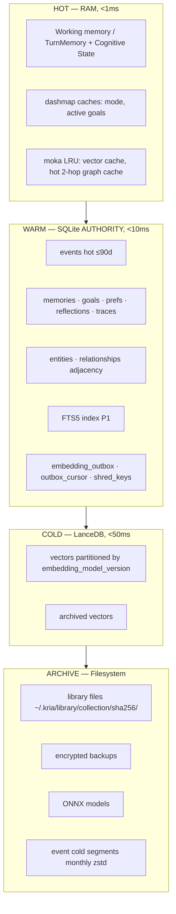

- **SQLite (authority):** `~/.kria/memory/kria_memory.db`, WAL mode,
  `foreign_keys=ON`, `busy_timeout` set, one write connection + read pool. Owns
  events, memories, graph, goals, prefs, reflections, traces, capabilities, failures,
  knowledge gaps, outbox, shred-key metadata, FTS5 (P1).
- **LanceDB:** `~/.kria/memory/vectors/`, one table per `embedding_model_version`
  (`mem_gemma_v1`, `mem_minilm_v1`, `lib_gemma_v1`, …). Rebuildable index (L4).
- **Filesystem:** library originals, encrypted backups, models, cold event segments.
- **Encryption at rest (default, R17):** SQLite + LanceDB dir + backups via OS-level
  (LUKS/FileVault) or app-level (SQLCipher / age). LanceDB is **never** a weaker tier
  than SQLite (N8 — embedding inversion side-channel closed). `sensitivity=secret`
  content: embedding encrypted or omitted (keyword-only retrieval).

## 10. Memory API Contract (the stable seam, architecture 32.6)

The only public surface (I-2). Rust signatures in §16; the *contract* (verbs + intent)
here.

| Path | Verb | Contract | Blocks? |
|---|---|---|---|
| Write | `observe(observation)` | raw perception → event log (fast path) | fast (<2ms) |
| Write | `remember(candidate)` | explicit store request → policy → maybe stored | fast ack; slow enrich |
| Write | `update(id, change)` | supersede (new event; old versioned) | fast |
| Write | `forget(scope)` | tombstone + crypto-shred + cascade | fast ack; async cascade |
| Write | `verify(id)` | re-check against source (TMS) | async |
| Read | `search(query, ctx)` | multi-strategy retrieval | read-only |
| Read | `recall(scope)` | direct scoped fetch (goals/prefs/project) | read-only |
| Read | `reason(query)` | retrieval + graph traversal + synthesis | read-only |
| Read | `explain(id \| query)` | provenance / retrieval trace | read-only |
| Cognitive | `reflect(trigger)` | produce reflections (re-enter via policy, L11) | scheduler |
| Cognitive | `consolidate(scope)` | compress/merge/decay | scheduler |
| Cognitive | `resolve_entities()` | entity resolution pass | scheduler |
| Admin | `backup(dest)` / `restore(src, scope)` | versioned, selective | job |
| Admin | `export(scope)` / `import(src)` | data portability | job |
| Admin | `health()` / `metrics()` | observability | read-only |
| Admin | `set_mode(mode)` | memory mode switch | fast |

**Contract stability rule:** this surface is versioned. Backends swap without touching
it (D-1/D-2/D-4). Adding a UI view is a *read* over this contract — no backend change
(architecture 15.8).

## 11. Event Contracts

Events are the immutable spine (L1). Every event: `id: UUIDv7`, `hlc`, `ts_utc`,
`tz_offset`, `event_type`, `source`, `session_id`, `parent_event_id?`,
`shred_key_id?`, `payload` (JSON, encrypted if sensitive), `checksum: blake3`.

**Event-type taxonomy (extensible enum, serialized as string for forward-compat):**

| Category | Event types |
|---|---|
| Perception | `observation`, `desktop_context`, `workspace_state`, `file_event` |
| Interaction | `user_message`, `assistant_message`, `tool_invocation`, `tool_outcome` |
| Memory lifecycle | `memory_created`, `memory_superseded`, `memory_merged`, `memory_split`, `memory_promoted`, `memory_demoted`, `memory_archived`, `memory_forgotten`, `memory_deleted`, `memory_restored` |
| Cognition | `reflection_produced`, `consolidation_run`, `episode_closed`, `entity_merged`, `entity_split` |
| Governance | `feedback` (D-19), `mode_switched`, `contradiction_flagged`, `knowledge_gap_recorded` |
| Library | `library_ingested`, `library_versioned`, `library_deleted` |
| System | `backup_created`, `restore_applied`, `migration_applied`, `reconcile_run` |

**Contract invariants:**
- Events are **append-only** — no schema exists for UPDATE/DELETE of an event row
  (enforced by the EventStore trait exposing only `append`/`read`, and a DB trigger
  that raises on UPDATE/DELETE of `events`).
- **Ordering** is by `(hlc, id)` — never `ts_utc` (N10/D-15).
- **Idempotent replay:** applying the same event id twice is a no-op (dedup on event
  id, Issue 28).
- **Consumers** (slow path, outbox relay, consolidation) are pull-based off the log;
  a durable per-consumer cursor makes replay resumable.
- Event payloads referencing an erasable subject carry `shred_key_id`; destroying the
  key renders the payload unreadable (L9) without mutating the log.

## Data Models

*(§12 — entities, fields, relationships, constraints, lifecycle; concrete DDL in §14, LanceDB layout in §15, Rust types in §17)*

Authoritative entity set (architecture §36.5, expanded with constraints/keys). Full
DDL in §14. Relationships:

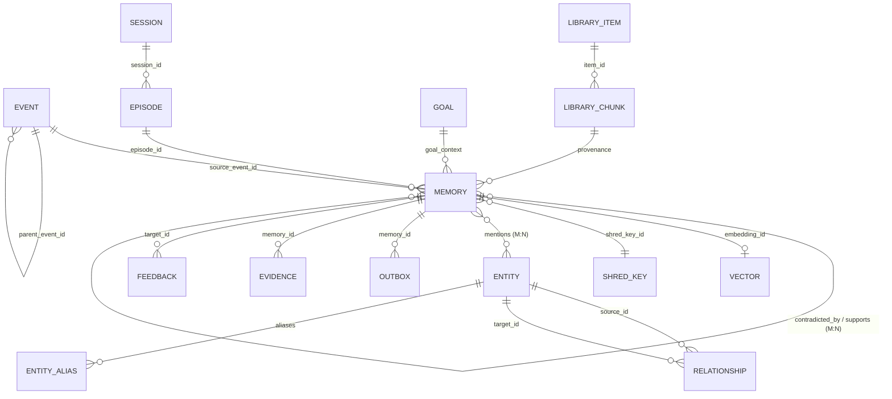

### 12.1 Entity catalog (fields · key facts)

**Event** — see §11. PK `id`. Immutable. Indexed on `(session_id, hlc)`,
`(event_type, hlc)`, `shred_key_id`.

**Memory** (derived, mutable durable state — L4): `id UUIDv7 PK`, `content`,
`memory_type` (working/short_term/episodic/semantic/procedural/goal/reflection/
failure/reasoning_trace/world_model/user_profile/capability/workspace/desktop_context/
library), `compression_level 0-3`, `source_event_id FK`, `namespace`, `owner_id`,
`device_id`, `scope`, `confidence REAL 0-1`, `importance REAL 0-10`, `access_count`,
`decay_score REAL`, `staleness_class`, `sensitivity`, `state`
(active/promoted/compressed/archived/forgotten/deleted), `created_at`, `last_accessed`,
`valid_from`, `valid_until?`, `embedding_id?`, `embedding_model_version?`,
`estimated_tokens`, `content_hash blake3`, `shred_key_id?`, `verify_against?`,
`memory_worth_success INT`, `memory_worth_failure INT`, `memory_worth_samples INT`,
`preference_pair_id?`, `training_eligible BOOL`, `modality DEFAULT 'text'`.
- **Constraints:** `confidence` clamped [0,1]; `importance` [0,10]; `state` FSM
  (§13.1); `content_hash` unique within `(namespace, memory_type)` used for dedup +
  idempotent consolidation (N3).
- **M:N link tables:** `memory_derived_from(parent_id, child_id)`,
  `memory_contradicts(a_id, b_id)`, `memory_supports(a_id, b_id)`,
  `memory_mentions_entity(memory_id, entity_id)`.

**Episode** (immutable once closed): `id`, `session_id`, `opened_at`, `closed_at?`,
`summary_memory_id?`, `boundary_reason` (idle/topic_shift/midnight/session_end).

**Session**: `id UUIDv7`, `started_at`, `ended_at?`, `mode`, `state`
(open/closed/resumed), `device_id`.

**Goal**: `id`, `kind` (oneshot/recurring/ambition), `title`, `status`
(candidate/active/paused/completed/abandoned), `confidence`, `priority`,
`resumption_context`, `created_at`, `last_progress_at`. Governed lifecycle (N6).

**Entity**: `id`, `canonical_id`, `entity_type` (person/project/tool/concept/company/
file/repo), `display_name`, `merged_from[]`, `created_at`. **EntityAlias**:
`(entity_id, alias, alias_type)`.

**Relationship** (graph edge): `id`, `source_id`, `target_id`, `rel_type`,
`strength REAL`, `valid_from`, `valid_until?`, `evidence_event_id`. Indexed both
directions (`source_id`, `target_id`) for CTE traversal (Issue 12).

**Reflection / Preference / ReasoningTrace / WorldModel / Capability / Failure /
KnowledgeGap** — typed memory projections + their own tables where the shape differs
(prefs are key/value with CRDT-ready vector clock; capabilities carry success stats).

**LibraryItem**: `id`, `sha256`, `title`, `author?`, `collections[]`, `version`,
`prev_version_id?`, `path`, `ingested_at`, `shred_key_id`. **LibraryChunk**:
`id`, `item_id FK`, `chunk_index`, `text`, `embedding_id?`, `modality`,
`embedding_model_version`, `page?`.

**OutboxEntry**: `id`, `memory_id`, `index_target` (lancedb/tantivy), `op`
(upsert/delete), `content_hash`, `attempts`, `status` (pending/done/deadletter),
`created_at`. **OutboxCursor**: `index_target PK`, `last_done_id`.

**ShredKey**: `subject_id PK`, `subject_type`, `key_ref` (keychain ref or wrapped
key), `status` (active/destroyed), `created_at`, `destroyed_at?`.

**Evidence**: `id`, `memory_id`, `kind` (supporting/contradicting), `source_event_id`,
`weight`, `observed_at` (ages, Issue 12/TMS).

**FeedbackEvent**: `id`, `target_id`, `target_kind` (memory/response), `signal`,
`payload?`, `context`, `ts` (D-19).

**SchemaVersion**: `version PK`, `applied_at`, `checksum` (additive-only migrations,
Issue 18).

### 12.2 Versioning, lifecycle, ownership

- **Versioning:** memories are superseded, never updated in place for facts — a new
  memory + `memory_superseded` event; the old row moves to `state=archived` with a
  `superseded_by` link (TMS fact supersession). Library items version by new immutable
  record + `prev_version_id`. Schema versions are additive-only.
- **Lifecycle:** each memory follows the unified FSM (§13.1). Ownership: every memory
  carries `namespace` + `owner_id` + `scope` (L7). Deletion cascades per §21.

## 13. State Machines

### 13.1 Memory lifecycle FSM

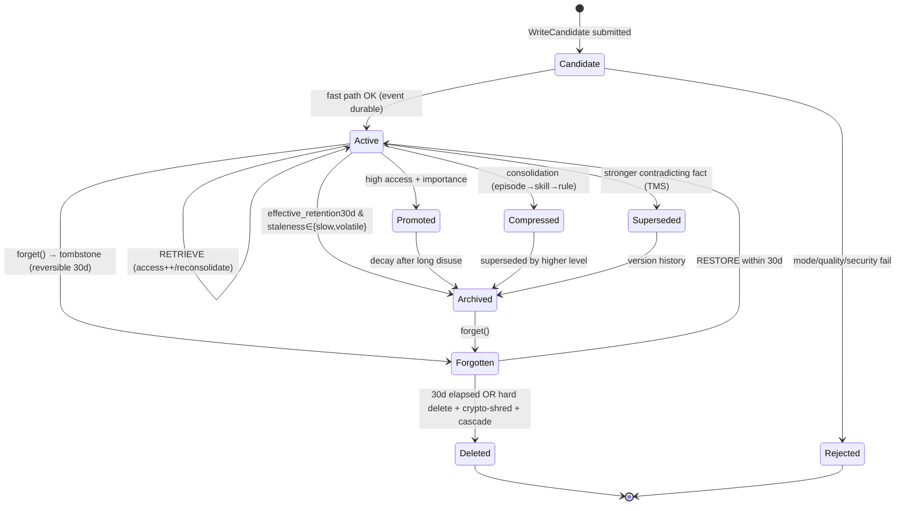
Invariants on the FSM: `Deleted` is terminal; `Superseded/Archived` remain queryable
but excluded from default retrieval (L12 candidate gating); `Forgotten→Deleted`
triggers crypto-shred + orphan cascade (L9, §21).

### 13.2 Session FSM (D-6)

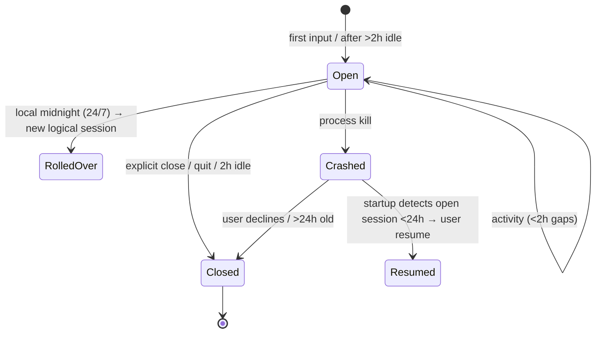

### 13.3 Outbox entry FSM (D-5)

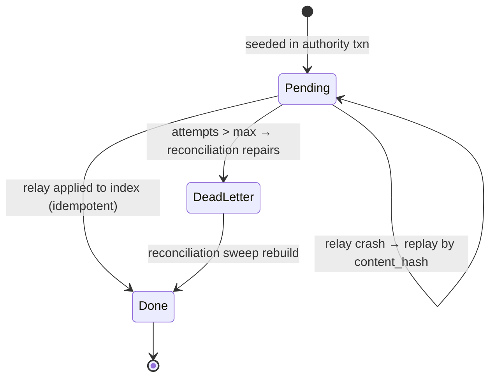

### 13.4 Goal FSM (N6)

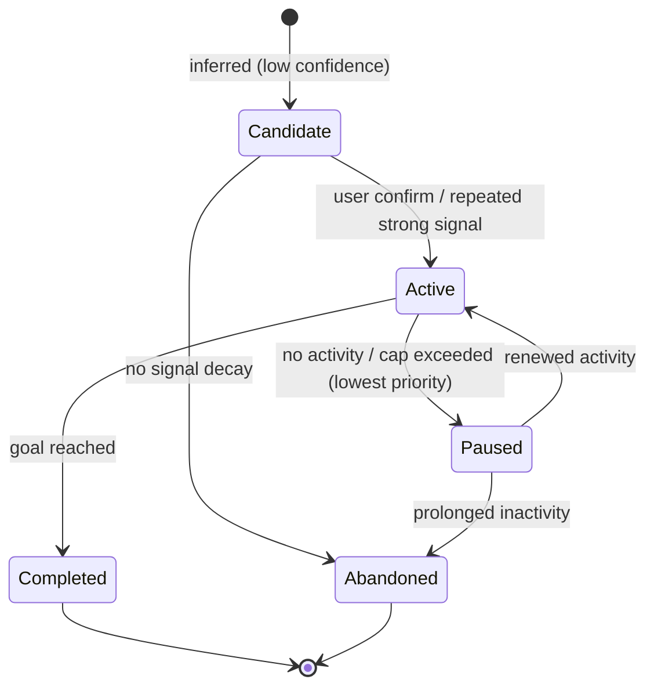

## 13.5 Subsystem Integration Matrix (architecture §15)

| Subsystem | Reads (via API) | Writes (via Write Policy) | Isolation |
|---|---|---|---|
| Intent Compiler | preferences, past intents | — (stateless) | global read |
| Planner | goals, procedural skills, failures, capabilities | reasoning traces | scope-filtered |
| Reasoner | semantic facts, world/user model | inferred facts | scope-filtered |
| Execution Engine | tool affordances, execution patterns | tool outcomes, events | — |
| OpenClaw skill | read-only `SkillMemoryView` (own ns + public core) | via orchestrator only, `namespace: openclaw/{id}` | strict ns (L7, N17) |
| Discovery/Evolution | CKB health, benchmark trends | proposals, decisions | — |
| Reflection Engine | recent episodes, patterns | reflections (untrusted, L11) | — |
| Library | document chunks | extracted facts (provenance-tagged) | per-item scope |
| Desktop Context | ambient state | filtered episodic promotions | debounced (N7) |
| Workspace | git/build/test state | workspace observations | workspace scope |
| Frontend | everything via explain/debug API | user edits/deletions/mode switches | — |

**OpenClaw contract (L7, N17):** skills get a read-only `SkillMemoryView` scoped to
their namespace + public core; they never write directly — results flow to the
orchestrator, which submits `WriteCandidate`s. Core-namespace promotion requires user
approval or a high evidence threshold; a plugin can never unilaterally write core.

---
---

# PART B — LOW-LEVEL DESIGN

> Language: **Rust** (kria-core authoritative). SQLite via `rusqlite` (bundled, WAL,
> FTS5, recursive CTEs). Vectors via `lancedb`. Embeddings via `ort` (ONNX). Errors
> via `thiserror`/`anyhow`; logging via `tracing`. All types below live in
> `crates/kria-core/src/memory/`.

## 14. SQLite Schema (DDL — the authority)

Applied by additive-only migrations (Issue 18). `PRAGMA journal_mode=WAL;
foreign_keys=ON; busy_timeout=5000; synchronous=NORMAL;` set on every connection.
Migration `0001_init.sql` (abridged to the load-bearing tables; illustrative types
are VOLATILE per §37.1):

```sql
-- ============ SCHEMA VERSIONING (additive-only, Issue 18) ============
CREATE TABLE IF NOT EXISTS schema_version (
    version     INTEGER PRIMARY KEY,
    applied_at  TEXT NOT NULL,            -- UTC ISO-8601
    checksum    TEXT NOT NULL             -- blake3 of migration script
);

-- ============ EVENT LOG (immutable, append-only — L1) ============
CREATE TABLE IF NOT EXISTS events (
    id              BLOB PRIMARY KEY,      -- UUID v7 (16 bytes, monotonic)
    hlc             TEXT NOT NULL,         -- hybrid logical clock, sortable
    ts_utc          TEXT NOT NULL,         -- UTC instant
    tz_offset_min   INTEGER NOT NULL,      -- originating tz offset (N10/D-15)
    event_type      TEXT NOT NULL,
    source          TEXT NOT NULL,         -- subsystem / self_reflection / library:...
    session_id      BLOB,
    parent_event_id BLOB REFERENCES events(id),
    shred_key_id    TEXT REFERENCES shred_keys(subject_id),
    payload         BLOB NOT NULL,         -- JSON; encrypted if shred_key_id set
    encrypted       INTEGER NOT NULL DEFAULT 0,
    checksum        TEXT NOT NULL          -- blake3(payload)
);
CREATE INDEX IF NOT EXISTS ix_events_session_hlc ON events(session_id, hlc);
CREATE INDEX IF NOT EXISTS ix_events_type_hlc    ON events(event_type, hlc);
CREATE INDEX IF NOT EXISTS ix_events_shred        ON events(shred_key_id);
-- Enforce append-only (L1): forbid UPDATE/DELETE on events.
CREATE TRIGGER IF NOT EXISTS trg_events_no_update
    BEFORE UPDATE ON events BEGIN SELECT RAISE(ABORT, 'events immutable (L1)'); END;
CREATE TRIGGER IF NOT EXISTS trg_events_no_delete
    BEFORE DELETE ON events BEGIN SELECT RAISE(ABORT, 'events immutable (L1)'); END;

-- Per-consumer durable cursors (resumable pull, Issue 28)
CREATE TABLE IF NOT EXISTS event_consumer_cursor (
    consumer     TEXT PRIMARY KEY,        -- slow_path / consolidation / ...
    last_hlc     TEXT NOT NULL DEFAULT ''
);

-- ============ CRYPTO-SHRED KEYRING (L9, ADR-006) ============
CREATE TABLE IF NOT EXISTS shred_keys (
    subject_id   TEXT PRIMARY KEY,        -- person:x / employer:y / session:z / library:item
    subject_type TEXT NOT NULL,
    key_ref      TEXT NOT NULL,           -- OS-keychain ref OR wrapped key blob
    status       TEXT NOT NULL DEFAULT 'active',  -- active | destroyed
    created_at   TEXT NOT NULL,
    destroyed_at TEXT
);

-- ============ MEMORIES (derived, durable, mutable — L4) ============
CREATE TABLE IF NOT EXISTS memories (
    id                     BLOB PRIMARY KEY,   -- UUID v7
    content                TEXT NOT NULL,
    memory_type            TEXT NOT NULL,
    compression_level      INTEGER NOT NULL DEFAULT 0 CHECK(compression_level BETWEEN 0 AND 3),
    source_event_id        BLOB NOT NULL REFERENCES events(id),
    namespace              TEXT NOT NULL DEFAULT 'core',
    owner_id               TEXT NOT NULL DEFAULT 'user',
    device_id              TEXT NOT NULL,
    scope                  TEXT NOT NULL DEFAULT 'global',  -- global|company|client|workspace|session
    confidence             REAL NOT NULL DEFAULT 0.5 CHECK(confidence BETWEEN 0 AND 1),
    importance             REAL NOT NULL DEFAULT 5.0 CHECK(importance BETWEEN 0 AND 10),
    access_count           INTEGER NOT NULL DEFAULT 0,
    decay_score            REAL NOT NULL DEFAULT 1.0,
    staleness_class        TEXT NOT NULL DEFAULT 'slow',    -- immutable|permanent|slow|volatile_verifiable|volatile_unverifiable
    sensitivity            TEXT NOT NULL DEFAULT 'private',  -- public|private|secret
    state                  TEXT NOT NULL DEFAULT 'active',   -- active|promoted|compressed|archived|forgotten|deleted
    created_at             TEXT NOT NULL,
    last_accessed          TEXT,
    valid_from             TEXT NOT NULL,
    valid_until            TEXT,
    embedding_id           BLOB,                             -- id in LanceDB (== memory id by convention)
    embedding_model_version TEXT,
    estimated_tokens       INTEGER NOT NULL DEFAULT 0,
    content_hash           TEXT NOT NULL,                    -- blake3(normalized content)
    shred_key_id           TEXT REFERENCES shred_keys(subject_id),
    verify_against         TEXT,                             -- predicate (path/tool/git) or NULL
    superseded_by          BLOB REFERENCES memories(id),
    episode_id             BLOB REFERENCES episodes(id),
    goal_context_id        BLOB REFERENCES goals(id),
    memory_worth_success   INTEGER NOT NULL DEFAULT 0,
    memory_worth_failure   INTEGER NOT NULL DEFAULT 0,
    memory_worth_samples   INTEGER NOT NULL DEFAULT 0,
    modality               TEXT NOT NULL DEFAULT 'text',
    preference_pair_id     TEXT,
    training_eligible      INTEGER NOT NULL DEFAULT 0
);
CREATE INDEX IF NOT EXISTS ix_mem_type_state   ON memories(memory_type, state);
CREATE INDEX IF NOT EXISTS ix_mem_ns_scope      ON memories(namespace, scope, state);
CREATE INDEX IF NOT EXISTS ix_mem_staleness     ON memories(staleness_class, last_accessed);
CREATE INDEX IF NOT EXISTS ix_mem_decay          ON memories(state, decay_score);
CREATE INDEX IF NOT EXISTS ix_mem_source_event  ON memories(source_event_id);
CREATE INDEX IF NOT EXISTS ix_mem_shred          ON memories(shred_key_id);
-- Dedup + idempotent consolidation (N3): content unique per (namespace, type) for active rows.
CREATE UNIQUE INDEX IF NOT EXISTS uq_mem_content
    ON memories(namespace, memory_type, content_hash) WHERE state = 'active';

-- M:N provenance / truth links
CREATE TABLE IF NOT EXISTS memory_derived_from (parent_id BLOB, child_id BLOB,
    PRIMARY KEY(parent_id, child_id),
    FOREIGN KEY(parent_id) REFERENCES memories(id), FOREIGN KEY(child_id) REFERENCES memories(id));
CREATE TABLE IF NOT EXISTS memory_contradicts (a_id BLOB, b_id BLOB, PRIMARY KEY(a_id,b_id));
CREATE TABLE IF NOT EXISTS memory_supports    (a_id BLOB, b_id BLOB, PRIMARY KEY(a_id,b_id));
CREATE TABLE IF NOT EXISTS memory_mentions_entity (memory_id BLOB, entity_id BLOB,
    PRIMARY KEY(memory_id, entity_id));

-- Evidence tracking (TMS, Issue 12/15)
CREATE TABLE IF NOT EXISTS evidence (
    id              BLOB PRIMARY KEY,
    memory_id       BLOB NOT NULL REFERENCES memories(id),
    kind            TEXT NOT NULL,        -- supporting | contradicting
    source_event_id BLOB REFERENCES events(id),
    weight          REAL NOT NULL DEFAULT 1.0,
    observed_at     TEXT NOT NULL
);
CREATE INDEX IF NOT EXISTS ix_evidence_mem ON evidence(memory_id, kind);

-- ============ GRAPH (adjacency + CTE, ADR-004) ============
CREATE TABLE IF NOT EXISTS entities (
    id           BLOB PRIMARY KEY,
    canonical_id BLOB NOT NULL,           -- self unless merged
    entity_type  TEXT NOT NULL,
    display_name TEXT NOT NULL,
    created_at   TEXT NOT NULL
);
CREATE TABLE IF NOT EXISTS entity_aliases (
    entity_id  BLOB NOT NULL REFERENCES entities(id),
    alias      TEXT NOT NULL,
    alias_type TEXT NOT NULL,             -- email|handle|url|repo|name
    PRIMARY KEY(entity_id, alias)
);
CREATE INDEX IF NOT EXISTS ix_alias_lookup ON entity_aliases(alias, alias_type);
CREATE TABLE IF NOT EXISTS entity_merge_provenance (
    merged_entity_id BLOB, into_entity_id BLOB, merged_at TEXT, reversible_until TEXT,
    PRIMARY KEY(merged_entity_id, into_entity_id));
CREATE TABLE IF NOT EXISTS relationships (
    id              BLOB PRIMARY KEY,
    source_id       BLOB NOT NULL REFERENCES entities(id),
    target_id       BLOB NOT NULL REFERENCES entities(id),
    rel_type        TEXT NOT NULL,
    strength        REAL NOT NULL DEFAULT 1.0,
    valid_from      TEXT NOT NULL,
    valid_until     TEXT,
    evidence_event_id BLOB REFERENCES events(id)
);
CREATE INDEX IF NOT EXISTS ix_rel_source ON relationships(source_id, rel_type);
CREATE INDEX IF NOT EXISTS ix_rel_target ON relationships(target_id, rel_type);
-- Denormalized hot 2-hop cache for user/active-project (Issue 12)
CREATE TABLE IF NOT EXISTS graph_2hop_cache (
    root_entity_id BLOB PRIMARY KEY, neighbors_json BLOB NOT NULL, refreshed_at TEXT NOT NULL);

-- ============ SESSIONS / EPISODES / GOALS ============
CREATE TABLE IF NOT EXISTS sessions (
    id BLOB PRIMARY KEY, started_at TEXT NOT NULL, ended_at TEXT,
    mode TEXT NOT NULL DEFAULT 'permanent', state TEXT NOT NULL DEFAULT 'open', device_id TEXT NOT NULL);
CREATE TABLE IF NOT EXISTS episodes (
    id BLOB PRIMARY KEY, session_id BLOB NOT NULL REFERENCES sessions(id),
    opened_at TEXT NOT NULL, closed_at TEXT, summary_memory_id BLOB REFERENCES memories(id),
    boundary_reason TEXT);
CREATE TABLE IF NOT EXISTS goals (
    id BLOB PRIMARY KEY, kind TEXT NOT NULL, title TEXT NOT NULL,
    status TEXT NOT NULL DEFAULT 'candidate', confidence REAL NOT NULL DEFAULT 0.4,
    priority INTEGER NOT NULL DEFAULT 5, resumption_context TEXT,
    created_at TEXT NOT NULL, last_progress_at TEXT);

-- ============ PREFERENCES (CRDT-ready, N10/22) ============
CREATE TABLE IF NOT EXISTS preferences (
    key TEXT PRIMARY KEY, value TEXT NOT NULL, vector_clock TEXT NOT NULL,
    updated_at TEXT NOT NULL, device_id TEXT NOT NULL);

-- ============ LIBRARY ============
CREATE TABLE IF NOT EXISTS library_items (
    id BLOB PRIMARY KEY, sha256 TEXT NOT NULL, title TEXT, author TEXT,
    version INTEGER NOT NULL DEFAULT 1, prev_version_id BLOB REFERENCES library_items(id),
    path TEXT NOT NULL, ingested_at TEXT NOT NULL, shred_key_id TEXT REFERENCES shred_keys(subject_id));
CREATE UNIQUE INDEX IF NOT EXISTS uq_lib_sha ON library_items(sha256, version);
CREATE TABLE IF NOT EXISTS library_collections (item_id BLOB, collection TEXT, PRIMARY KEY(item_id, collection));
CREATE TABLE IF NOT EXISTS library_chunks (
    id BLOB PRIMARY KEY, item_id BLOB NOT NULL REFERENCES library_items(id),
    chunk_index INTEGER NOT NULL, text TEXT NOT NULL, embedding_id BLOB,
    modality TEXT NOT NULL DEFAULT 'text', embedding_model_version TEXT, page INTEGER);
CREATE INDEX IF NOT EXISTS ix_lib_chunks_item ON library_chunks(item_id);

-- ============ TRANSACTIONAL OUTBOX (D-5, ADR-005) ============
CREATE TABLE IF NOT EXISTS embedding_outbox (
    id            INTEGER PRIMARY KEY AUTOINCREMENT,
    memory_id     BLOB NOT NULL,
    index_target  TEXT NOT NULL,          -- lancedb | tantivy
    op            TEXT NOT NULL,          -- upsert | delete
    content_hash  TEXT NOT NULL,          -- idempotency key component
    attempts      INTEGER NOT NULL DEFAULT 0,
    status        TEXT NOT NULL DEFAULT 'pending',  -- pending|done|deadletter
    created_at    TEXT NOT NULL
);
CREATE INDEX IF NOT EXISTS ix_outbox_pending ON embedding_outbox(index_target, status, id);
CREATE TABLE IF NOT EXISTS outbox_cursor (index_target TEXT PRIMARY KEY, last_done_id INTEGER NOT NULL DEFAULT 0);

-- ============ FEEDBACK / KNOWLEDGE GAPS / AUDIT (D-19, 32.5, §30) ============
CREATE TABLE IF NOT EXISTS feedback_events (
    id BLOB PRIMARY KEY, target_id BLOB NOT NULL, target_kind TEXT NOT NULL,
    signal TEXT NOT NULL, payload TEXT, context TEXT, ts TEXT NOT NULL);
CREATE TABLE IF NOT EXISTS knowledge_gaps (
    id BLOB PRIMARY KEY, query TEXT NOT NULL, domain TEXT, times_missed INTEGER NOT NULL DEFAULT 1,
    last_missed_at TEXT NOT NULL, resolved INTEGER NOT NULL DEFAULT 0);
CREATE TABLE IF NOT EXISTS memory_audit (            -- Write Policy decisions (90d rolling)
    id BLOB PRIMARY KEY, ts TEXT NOT NULL, decision TEXT NOT NULL,  -- stored|rejected|deduped|batched
    reason TEXT NOT NULL, candidate_hash TEXT, namespace TEXT, mode TEXT);
CREATE INDEX IF NOT EXISTS ix_audit_ts ON memory_audit(ts);
CREATE TABLE IF NOT EXISTS enrichment_deadletter (
    event_id BLOB PRIMARY KEY, stage TEXT NOT NULL, error TEXT, attempts INTEGER, ts TEXT NOT NULL);

-- ============ FTS5 (P1 full-text floor, D-2) ============
CREATE VIRTUAL TABLE IF NOT EXISTS memories_fts USING fts5(
    content, memory_id UNINDEXED, namespace UNINDEXED, tokenize = 'unicode61');
```

**FTS5 sync note:** because FTS5 lives *inside* the authority DB (D-2), the P1
`memories_fts` row is written in the **same transaction** as the `memories` row on
the slow-path commit — it is not an outbox target in P1. When Tantivy replaces it at
P2, FTS becomes an outbox `index_target` like LanceDB (uniform C1 handling).

## 15. LanceDB Collection Layout (rebuildable vector index — L4)

One table per `embedding_model_version` (architecture §9, C4), enabling the
embedding-version-crisis migration (§32). Path `~/.kria/memory/vectors/`.

```
Table naming:  {domain}_{model}_{version}
    mem_gemma_v1     — memory embeddings, EmbeddingGemma-300M
    mem_minilm_v1    — memory embeddings, MiniLM fallback tier (distinct model_version!)
    lib_gemma_v1     — library chunk embeddings
    (future) mem_next_v2, img_siglip_v1 ... — added, never mix

Schema per table (Arrow/Lance):
    id            : FixedSizeBinary(16)   -- == SQLite memory.id or library_chunk.id
    vector        : FixedSizeList<Float32, dim>   -- dim = 768 (Gemma) | 384 (MiniLM)
    namespace     : Utf8                  -- payload filter (scope/ns pre-filter)
    scope         : Utf8
    sensitivity   : Utf8
    memory_type   : Utf8
    content_hash  : Utf8                  -- idempotent upsert key (D-5)
    created_at    : Timestamp

Index: IVF-PQ (disk-native ANN). Matryoshka: store 768-dim; a 256-dim projection
column `vector_256` is written for the hot search path (D-3), full 768 reserved for
cold/high-precision rerank.
```

**LanceDB usage rules (invariant-preserving):**
- `id` in LanceDB is **identical** to the SQLite `memory.id` — no separate id space,
  so orphan detection is a pure set-difference (N12/D-16).
- Writes happen **only** via the outbox relay (never directly from the slow path) —
  keeps L2 (SQLite authority) intact.
- Deletes are by `id`; crypto-shredded memories have their vectors purged on
  reconcile (N8/D-16).
- Version time-travel (LanceDB native) is the instant-rollback lever for a bad
  re-embedding batch (architecture §9).
- Secrets (`sensitivity=secret`): vector omitted or encrypted (keyword-only recall,
  N8/D-3).

## 16. Storage-Port Traits (Rust — the swap seam, L2/L4, D-4)

`crates/kria-core/src/memory/ports/mod.rs`. All ports are `async` (Tokio),
object-safe (`dyn`), and deliberately **minimal** (C5 — no SQL/Cypher/LanceDB
specifics leak). Errors via a shared `MemoryError` (`thiserror`).

```rust
use async_trait::async_trait;
use uuid::Uuid;

/// The ONLY types that participate in the authority transaction:
/// EventStore + RelationalStore + GraphStore share ONE rusqlite write connection.
#[async_trait]
pub trait EventStore: Send + Sync {
    /// Append an immutable event (L1). Idempotent by event id (Issue 28).
    async fn append(&self, tx: &mut AuthorityTx<'_>, event: &Event) -> Result<(), MemoryError>;
    /// Forensic read only — NEVER used to regenerate memory (Issue 1/L4).
    async fn read_range(&self, from_hlc: &Hlc, limit: usize) -> Result<Vec<Event>, MemoryError>;
    async fn advance_cursor(&self, consumer: &str, hlc: &Hlc) -> Result<(), MemoryError>;
    async fn cursor(&self, consumer: &str) -> Result<Hlc, MemoryError>;
    /// Cold-segment roll (Issue 14) — moves ≥90d events to immutable zstd segments.
    async fn roll_cold_segments(&self, older_than: Timestamp) -> Result<u64, MemoryError>;
}

#[async_trait]
pub trait RelationalStore: Send + Sync {
    async fn begin(&self) -> Result<AuthorityTx<'_>, MemoryError>;   // single writer
    async fn read(&self) -> ReadConn;                                // WAL read (L10, pooled)

    async fn upsert_memory(&self, tx: &mut AuthorityTx<'_>, m: &Memory) -> Result<(), MemoryError>;
    async fn get_memory(&self, id: Uuid) -> Result<Option<Memory>, MemoryError>;
    async fn set_state(&self, tx: &mut AuthorityTx<'_>, id: Uuid, state: MemoryState) -> Result<(), MemoryError>;
    async fn enqueue_outbox(&self, tx: &mut AuthorityTx<'_>, e: &OutboxEntry) -> Result<(), MemoryError>;
    async fn pending_outbox(&self, target: IndexTarget, limit: usize) -> Result<Vec<OutboxEntry>, MemoryError>;
    async fn mark_outbox(&self, tx: &mut AuthorityTx<'_>, id: i64, status: OutboxStatus) -> Result<(), MemoryError>;
    // goals / prefs / evidence / feedback / audit CRUD elided for brevity — same shape.
}

#[async_trait]
pub trait GraphStore: Send + Sync {
    async fn add_entity(&self, tx: &mut AuthorityTx<'_>, e: &Entity) -> Result<(), MemoryError>;
    async fn add_relationship(&self, tx: &mut AuthorityTx<'_>, r: &Relationship) -> Result<(), MemoryError>;
    /// Cycle-safe, depth-capped traversal (Issue 12) — visited-set + hard cap MANDATORY.
    async fn neighbors(&self, root: Uuid, max_hops: u8 /*<=3*/) -> Result<Vec<GraphHit>, MemoryError>;
    async fn relationships_for(&self, entity: Uuid) -> Result<Vec<Relationship>, MemoryError>;
    async fn search_entities(&self, query: &str) -> Result<Vec<Entity>, MemoryError>;
    // ^ these 5 map cleanly to BOTH SQLite CTEs and Dgraph/Nebula (C5). No SQL leaks.
}

#[async_trait]
pub trait VectorStore: Send + Sync {                 // LanceDB (D-1); Qdrant behind same trait
    async fn upsert(&self, model: &ModelVersion, id: Uuid, vec: &[f32],
                    payload: &VectorPayload, content_hash: &str) -> Result<(), MemoryError>;
    async fn search(&self, model: &ModelVersion, query: &[f32], k: usize,
                    filter: &ScopeFilter) -> Result<Vec<VectorHit>, MemoryError>;
    async fn delete(&self, model: &ModelVersion, ids: &[Uuid]) -> Result<(), MemoryError>;
    async fn all_ids(&self, model: &ModelVersion) -> Result<Vec<Uuid>, MemoryError>; // reconcile (D-16)
    async fn create_partition(&self, model: &ModelVersion, dim: usize) -> Result<(), MemoryError>;
}

#[async_trait]
pub trait SearchStore: Send + Sync {                 // FTS5 (P1) / Tantivy (P2), D-2
    async fn index(&self, id: Uuid, content: &str, payload: &SearchPayload) -> Result<(), MemoryError>;
    async fn query(&self, q: &str, k: usize, filter: &ScopeFilter) -> Result<Vec<SearchHit>, MemoryError>;
    async fn delete(&self, ids: &[Uuid]) -> Result<(), MemoryError>;
    async fn all_ids(&self) -> Result<Vec<Uuid>, MemoryError>;
}

/// Optional capabilities — memory works when these return `Unavailable` (L8).
#[async_trait]
pub trait Embedder: Send + Sync {
    fn model_version(&self) -> ModelVersion;
    fn dim(&self) -> usize;
    async fn embed(&self, texts: &[String]) -> Result<Vec<Vec<f32>>, MemoryError>;
    async fn health(&self) -> Availability;
}
#[async_trait]
pub trait LlmClient: Send + Sync {
    async fn classify(&self, prompt: &str) -> Result<String, MemoryError>;
    async fn health(&self) -> Availability;
}
```

**AuthorityTx invariant (L2/L10):** `AuthorityTx` wraps the **single** write
connection. `EventStore::append`, `RelationalStore::upsert_memory`,
`GraphStore::add_*`, and `enqueue_outbox` all take `&mut AuthorityTx` — so events +
derived memory + graph + outbox commit **together** in one local transaction. There
is no API to write LanceDB/FTS from within `AuthorityTx` (they are downstream, fed by
the relay). This makes the dual-write problem structurally impossible (Issue 29).

## 17. Core Domain Types (Rust)

`crates/kria-core/src/memory/types.rs` (abridged; matches §12/§14).

```rust
pub struct Event {
    pub id: Uuid, pub hlc: Hlc, pub ts_utc: Timestamp, pub tz_offset_min: i16,
    pub event_type: EventType, pub source: Source, pub session_id: Option<Uuid>,
    pub parent_event_id: Option<Uuid>, pub shred_key_id: Option<SubjectId>,
    pub payload: EventPayload, pub checksum: Blake3,
}

pub struct Memory {
    pub id: Uuid, pub content: String, pub memory_type: MemoryType,
    pub compression_level: u8,            // 0 raw .. 3 rule (terminal, N3)
    pub source_event_id: Uuid,
    pub namespace: Namespace, pub owner_id: OwnerId, pub device_id: DeviceId, pub scope: Scope,
    pub confidence: f32, pub importance: f32, pub access_count: u64, pub decay_score: f32,
    pub staleness_class: StalenessClass, pub sensitivity: Sensitivity, pub state: MemoryState,
    pub created_at: Timestamp, pub last_accessed: Option<Timestamp>,
    pub valid_from: Timestamp, pub valid_until: Option<Timestamp>,
    pub embedding_id: Option<Uuid>, pub embedding_model_version: Option<ModelVersion>,
    pub estimated_tokens: u32, pub content_hash: Blake3, pub shred_key_id: Option<SubjectId>,
    pub verify_against: Option<VerifyPredicate>, pub superseded_by: Option<Uuid>,
    pub worth: MemoryWorth, pub modality: Modality,
    pub preference_pair_id: Option<String>, pub training_eligible: bool,
}

pub enum StalenessClass { Immutable, Permanent, Slow, VolatileVerifiable, VolatileUnverifiable }
pub enum MemoryState { Active, Promoted, Compressed, Archived, Superseded, Forgotten, Deleted }
pub enum Sensitivity { Public, Private, Secret }
pub enum MemoryMode { Permanent, Temporary, Incognito, Workspace, LibraryOnly, ReadOnly,
                      Guest, Developer, Benchmark, Safe, Research }
pub struct MemoryWorth { pub success: u32, pub failure: u32, pub samples: u32 }

pub struct WriteCandidate {
    pub content: String, pub proposed_type: Option<MemoryType>, pub source: Source,
    pub session_id: Uuid, pub namespace_hint: Option<Namespace>, pub scope_hint: Option<Scope>,
    pub sensitivity_hint: Option<Sensitivity>, pub emphasis: EmphasisSignals,
    pub verify_against: Option<VerifyPredicate>, pub derived_from: Vec<Uuid>,
}
pub enum WriteDecision {
    Stored { memory_id: Uuid }, Deduped { into: Uuid }, Batched, Queued { event_id: Uuid },
    Rejected { reason: RejectReason }, NeedsConfirmation { token: ConfirmToken },
}
pub enum RejectReason { Mode(MemoryMode), QualityFilter, SecurityScan(String),
                        NamespaceViolation, FalsePromotionGuard, Contradiction(Uuid) }
```

## 18. Memory Write Policy Engine (the spine — fast/slow split, ADR-007)

The 12 architecture responsibilities (§5) split across a synchronous fast path and an
async slow path per Issue 4/5. `crates/kria-core/src/memory/write_policy/`.

### 18.1 Fast path — synchronous, deterministic, `<2 ms` p95, LLM-free, MUST succeed

```rust
/// Steps 1,2,10 (partial),12(event) of the architecture list run here.
/// Everything the caller waits on; nothing else.
pub async fn submit(&self, cand: WriteCandidate) -> Result<WriteDecision, MemoryError> {
    // (1) MODE CHECK — Incognito → reject; Temporary → tag session-scoped; Read-only → reject.
    let mode = self.modes.current(cand.session_id);
    if let Some(reject) = mode.reject_write(&cand) {                 // deterministic table
        self.audit.record(Decision::Rejected, &reject);
        return Ok(WriteDecision::Rejected { reason: reject });
    }
    // (9) OWNERSHIP — assign namespace/owner/scope/sensitivity (deterministic defaults).
    let owned = self.assign_ownership(&cand, &mode)?;               // L7 write-side gate
    if mode == Workspace && owned.scope == Scope::Personal {
        return Ok(WriteDecision::Rejected { reason: RejectReason::NamespaceViolation });
    }
    // (10) SECURITY SCAN — DETERMINISTIC pattern/structural only (N16/D-11). No LLM.
    if let Some(hit) = self.security.scan_deterministic(&cand.content) {
        return Ok(WriteDecision::Rejected { reason: RejectReason::SecurityScan(hit) });
    }
    // (12a) COMMIT RAW EVENT + OUTBOX SEED in ONE authority txn (L2). Now durable (AC R1.3).
    let event = self.build_event(&cand, &owned);                    // UUID v7 + HLC + checksum
    let mut tx = self.relational.begin().await?;
    self.events.append(&mut tx, &event).await?;
    tx.commit().await?;                                             // <-- only writer lock, brief (L10)
    // Incognito never reaches here; Temporary events carry session TTL for purge.
    self.slow_path.enqueue(event.id);                               // hand off (best-effort)
    Ok(WriteDecision::Queued { event_id: event.id })
}
```

### 18.2 Slow path — async worker pool, best-effort, corrected order (Issue 5)

Consumes new events from the event-log cursor. Order:
`embed → dedup → contradiction → classify → importance → provenance → graph →
commit-derived`. Runs on **read connections** for dedup/contradiction (L10, N1); takes
the writer only for the final commit (chunked, N2).

```rust
async fn enrich(&self, event_id: Uuid) -> Result<(), MemoryError> {
    let ev = self.events_by_id(event_id).await?;
    if !ev.is_write_candidate() { return Ok(()); }                  // observations may stop here

    // (2) QUALITY FILTER — reject noise (failed retries, cancels, debug spam) → execution log only (R4).
    if self.quality.is_noise(&ev) { self.audit.record(Decision::Rejected, "quality"); return Ok(()); }

    // S1 EMBED (Issue 5) — optional; on Unavailable, store raw + queue re-embed (L8).
    let emb = match self.embedder.embed(&[ev.text()]).await {
        Ok(v) => Some((self.embedder.model_version(), v[0].clone())),
        Err(_) => { self.enqueue_reembed(event_id); None }          // FTS still works
    };
    // (4) DEDUP — vector similarity (read-only). Duplicate → update existing, no new row.
    if let Some((_, ref v)) = emb {
        if let Some(dup) = self.dedup.find(v, &ev.scope_filter()).await? {
            self.reconsolidate(dup, &ev).await?;                    // access++/evidence
            return Ok(());                                          // WriteDecision::Deduped
        }
    }
    // (5) CONTRADICTION — vector + graph (read-only). Deterministic TMS order (§22).
    let contradiction = self.tms.detect(&ev, emb.as_ref()).await?;
    // (3) CLASSIFICATION — deterministic axes; LLM ONLY for ambiguity, delimited as data (N16).
    let axes = self.classifier.classify(&ev).await?;                // type + retention + epistemic ...
    // (6) IMPORTANCE — deterministic sigmoid (§22, Issue 9); LLM may nudge ±2 for ambiguous.
    let importance = self.importance.score(&ev, &axes, contradiction.as_ref());
    // (11) BUDGET / FALSE-PROMOTION GUARD — refuse "rules" from insufficient/correlated evidence.
    if axes.is_rule_promotion() && !self.evidence_sufficient(&ev) {
        self.audit.record(Decision::Rejected, "false_promotion_guard"); return Ok(());
    }
    // (7) PROVENANCE + (8) EXPIRATION + shred key.
    let memory = self.assemble_memory(&ev, &axes, importance, &emb, &contradiction)?;
    // (12b) COMMIT DERIVED — memory + graph + outbox ops, ONE authority txn (chunked, N2).
    let mut tx = self.relational.begin().await?;
    self.relational.upsert_memory(&mut tx, &memory).await?;
    self.write_provenance(&mut tx, &memory, &ev).await?;            // derived_from / evidence
    if let Some(c) = contradiction { self.tms.apply(&mut tx, &memory, c).await?; } // supersede/flag
    self.graph.upsert_mentions(&mut tx, &memory).await?;           // entities/relationships
    if memory.embedding_id.is_some() {
        self.relational.enqueue_outbox(&mut tx, &OutboxEntry::upsert(memory.id, IndexTarget::LanceDb)).await?;
    }
    self.searchstore_p1_index(&mut tx, &memory).await?;            // FTS5 in-txn (D-2)
    tx.commit().await?;
    self.audit.record(Decision::Stored, "ok");
    Ok(())
}
```

**Confirmation routing:** `sensitivity=secret` or high-impact candidates return
`NeedsConfirmation { token }` from the slow path and are held in a pending queue until
the user approves (architecture §5 additional responsibilities).

**Write batching:** low-priority observations buffer in a bounded ring and flush on
idle via the Scheduler (P4), coalescing I/O + LLM calls (Issue 4 / N7). Bounded →
backpressure to keyword-only on overflow (32.3).

**Failure semantics:** any slow-path stage failing leaves the **raw event durable**
(fast path already committed); the event is retried with bounded backoff, then moved
to `enrichment_deadletter` (still recoverable — re-enrichable later). This is the
literal realization of "raw events always stored; enrichment best-effort" (§18 arch).

## 19. Retrieval Pipeline (adaptive multi-strategy fusion, §10 arch, L10/L12)

`crates/kria-core/src/memory/retrieval/`. Read-only (L10). No HyDE, no ColBERT, no
default cross-encoder (rejected §10/§37.5).

```rust
pub async fn search(&self, q: &Query, ctx: &RetrievalCtx) -> Result<RetrievalResult, MemoryError> {
    // 1) CLASSIFY query deterministically (<5ms) → strategy weights.
    let qclass = self.classify_query(q);          // temporal|entity|conceptual|recent|procedural
    let filter = ScopeFilter::from(ctx);          // namespace + scope + sensitivity (L7, mandatory)

    // 2) RUN STRATEGIES IN PARALLEL on read connections (join_all). Each may fail independently (C2).
    let (vec_hits, fts_hits, graph_hits, temporal, goalf) = tokio::join!(
        self.vector.search_opt(q, &filter),        // Strategy 1 (skip if embedder/LanceDB down)
        self.search.query(&q.text, K, &filter),    // Strategy 2 (ALWAYS available — floor, L8)
        self.graph_expand(q, &filter),             // Strategy 3 (if entities present, ≤2-hop, cycle-safe)
        self.temporal_filter(q),                   // Strategy 4 (if time signal; resolves in local tz, N10)
        self.goal_context(ctx),                    // Strategy 5 (always — a filter)
    );

    // 3) ADAPTIVE RRF — weights vary by qclass; weights self-tune from feedback (D-19/32.4).
    let fused = adaptive_rrf(&[vec_hits?, fts_hits?, graph_hits?], self.weights.for_class(qclass));

    // 4) CANDIDATE GATING (L12 — the existential fix, N4): drop superseded/archived; gate by
    //    importance + Memory Worth (only after ≥20 samples, D-8). Keeps SIGNAL high as bank grows.
    let gated = fused.into_iter()
        .filter(|h| h.state == Active || h.state == Promoted)
        .filter(|h| self.worth.passes_gate(h))    // soft; never hard-delete
        .collect();

    // 5) FILTER namespace/scope/sensitivity again post-fusion (defense in depth, L7/R18).
    let scoped = self.enforce_scope(gated, &filter);

    // 6) STALENESS FLAG (TMS): mark possibly-stale; verify_against re-checked before use (§22).
    let flagged = self.tms.flag_and_maybe_verify(scoped).await;

    // 7) TOKEN-BUDGET FILL (~800 tok by relevance, NOT top-K).
    let selected = fill_token_budget(flagged, ctx.token_budget.unwrap_or(800));

    // 8) MULTI-TURN COHERENCE: if topic stable (>0.8 cosine vs last turn), pin prior surfaced (§10).
    let pinned = self.pin_stable_topic(selected, ctx);

    // 9) PROVENANCE ANNOTATE (L6) + capture feedback signals (surfaced/referenced/outcome).
    let annotated = self.annotate_provenance(pinned);
    self.feedback.mark_surfaced(&annotated, ctx);

    // Access updates queued as low-priority writes — never block the read (L10).
    self.scheduler.enqueue_access_update(annotated.ids());
    Ok(RetrievalResult { memories: annotated, trace: self.trace(qclass) })  // trace → explain_retrieval
}
```

**Degradation ladder (C2, L8):** LanceDB down → `vector.search_opt` returns empty →
FTS + graph carry retrieval. FTS5 down (P2 Tantivy failure) → fall back to SQLite
FTS5. Embedder down → keyword + graph only. No LLM → no synthesis in `reason()`, raw
recall still returned.

**Proactive/salience retrieval (Issue 7/N7):** event-driven (file open, app focus,
new message), debounced `≥60 s`, coalesced, **disabled on battery/power-saver**; uses
a cached context embedding, re-embeds only when context text changes.

## 20. Cognitive Layer Workers (consolidation / dreaming / reflection, L11)

`crates/kria-core/src/memory/cognition/`. All are Cognitive-Scheduler P3 jobs;
checkpointed/resumable/idempotent (N14); output re-enters via Write Policy as
untrusted (L11/D-9).

**Triggers (architecture §11, not fixed calendar):**

| Trigger | Operation | LLM? |
|---|---|---|
| Idle >30m | micro-consolidation (decay, dedup, stats) | No |
| Session end | session reflection + episode close + skill extraction | Yes (opt) |
| Idle >4h / daily | dreaming: summarize, compress, update user/self model | Yes (opt) |
| Weekly | deep reflection, pattern/habit detection, archival | Yes (opt) |
| Backlog > threshold | forced consolidation | Yes (opt) |
| After failure/success | targeted reflection (why?) | Yes (opt) |

```rust
async fn consolidate(&self, scope: ConsolidationScope) -> Result<(), MemoryError> {
    let mut ck = self.load_checkpoint(scope).unwrap_or_default();     // resumable (N14)
    for batch in self.candidate_batches(scope, ck.cursor) {          // ≤100 rows (N2)
        // idempotent: skip if content-hash already produced (N3)
        let insights = match self.llm.health().await {
            Availability::Up  => self.llm_summarize(&batch).await?,   // dreaming
            _                 => self.heuristic_summarize(&batch),    // degrade (L8)
        };
        for insight in insights {
            // L11: re-enter as UNTRUSTED. Confidence capped ≤0.6; needs ≥N episodes for rule.
            let cand = WriteCandidate::from_reflection(insight)
                .with_source(Source::SelfReflection)
                .with_confidence_cap(0.6);
            let _ = self.write_policy.submit(cand).await;             // same scrutiny as external (D-9)
        }
        self.decay_batch(&batch)?;                                   // §22 decay
        ck.cursor = batch.last_cursor(); self.save_checkpoint(scope, &ck)?; // atomic per batch
        self.scheduler.yield_writer().await;                         // N2 anti-starvation
    }
    Ok(())
}
```

**Compression spectrum (L5):** `Raw(0) → Episode(1) → Skill(2) → Rule(3)`. Each
compressed memory carries `derived_from[]` to its sources; **source episodes are
retained (archived, not deleted)** so drift is detectable/correctable (N15 grounding
check). Level 3 is terminal (N3). Reflection-of-reflection depth = 1 (N3/D-9).

**Two-mode dreaming (architecture §11):** session-oriented ("what did I learn this
session?") + user-oriented ("what do I know about the user? what's stale?"). Both
produce untrusted candidates.

## 21. Lifecycle Operations (merge/split, forget/delete cascade)

### 21.1 Forget / Delete cascade (L9, R8/R9, N12) — production-critical

```rust
/// forget(scope): tombstone (reversible 30d) → after 30d or hard delete → crypto-shred + cascade.
pub async fn forget(&self, scope: ForgetScope) -> Result<(), MemoryError> {
    let mut tx = self.relational.begin().await?;
    let targets = self.resolve_scope(&scope).await?;               // memory / project / library-item / date-range
    for m in &targets {
        self.relational.set_state(&mut tx, m.id, MemoryState::Forgotten).await?;  // reversible
        self.events.append(&mut tx, &Event::memory_forgotten(m.id)).await?;       // audit (L1)
    }
    tx.commit().await?;
    self.scheduler.schedule_hard_delete(targets, Duration::days(30)); // reversible window
    Ok(())
}

/// Hard delete (after window or explicit) — atomic cascade across ALL stores.
async fn hard_delete(&self, targets: Vec<Memory>) -> Result<(), MemoryError> {
    // 1) AUTHORITY txn: mark deleted; enqueue index deletes; append events.
    let mut tx = self.relational.begin().await?;
    for m in &targets {
        self.relational.set_state(&mut tx, m.id, MemoryState::Deleted).await?;
        self.relational.enqueue_outbox(&mut tx, &OutboxEntry::delete(m.id, IndexTarget::LanceDb)).await?;
        self.searchstore_delete_in_txn(&mut tx, m.id).await?;       // FTS5 in-txn (P1)
        self.graph.prune_orphan_edges(&mut tx, m).await?;           // dangling edges (N12)
        self.library.flag_source_deleted(&mut tx, m).await?;        // sourced memories (§14 arch)
        self.events.append(&mut tx, &Event::memory_deleted(m.id)).await?;
    }
    // 2) CRYPTO-SHRED subject keys whose last memory is gone (L9/N8).
    for subj in self.subjects_fully_deleted(&targets).await? {
        self.shred_keys.destroy(&mut tx, subj).await?;              // key gone → ciphertext unreadable
    }
    tx.commit().await?;
    // 3) Outbox relay purges LanceDB vectors (incl. shredded content's embeddings, N8).
    // 4) Weekly reconciliation sweep (D-16) guarantees no orphan survives (N12).
    Ok(())
}
```

**Cascade completeness (R8):** because provenance tags every derived memory with its
source (`source: library:{item}:chunk:{idx}`), per-item deletion is a provenance
query + cascade — file, chunks, vectors, derived memories, and the item's shred key
all go. AC: after deletion, no retrieval returns content derived from that item
(tested, §35).

### 21.2 Merge / Split (R14, D-17, §35 blocker) — atomic across stores

```rust
/// Merge two memories → one; originals archived (not deleted), derived_from preserved. Reversible 30d.
pub async fn merge(&self, a: Uuid, b: Uuid) -> Result<Uuid, MemoryError> {
    let mut tx = self.relational.begin().await?;                    // ONE authority txn (L2)
    let merged = self.build_merged(a, b).await?;                    // derived_from: [a,b]
    self.relational.upsert_memory(&mut tx, &merged).await?;
    self.relational.set_state(&mut tx, a, MemoryState::Archived).await?;
    self.relational.set_state(&mut tx, b, MemoryState::Archived).await?;
    self.link_derived_from(&mut tx, merged.id, &[a, b]).await?;
    self.worth.combine(&mut tx, &[a, b], merged.id).await?;         // sum counters
    self.graph.rewire_mentions(&mut tx, &[a, b], merged.id).await?; // edges follow
    self.relational.enqueue_outbox(&mut tx, &OutboxEntry::upsert(merged.id, IndexTarget::LanceDb)).await?;
    self.relational.enqueue_outbox(&mut tx, &OutboxEntry::delete(a, IndexTarget::LanceDb)).await?;
    self.relational.enqueue_outbox(&mut tx, &OutboxEntry::delete(b, IndexTarget::LanceDb)).await?;
    self.record_merge_provenance(&mut tx, merged.id, &[a, b]).await?; // reversible ≤30d
    self.events.append(&mut tx, &Event::memory_merged(merged.id, &[a,b])).await?;
    tx.commit().await?;                                            // all-or-nothing
    Ok(merged.id)
}
// split() is the inverse: one → several, each derived_from: [original]; original archived.
```

Because the authority mutation is one transaction and index changes flow through the
outbox, merge/split is atomic even though it touches SQLite + LanceDB + FTS + graph +
Memory Worth + provenance (R14). A crash after commit-before-relay is repaired by
idempotent relay + reconciliation (N12/D-16).

## 22. Truth Maintenance + Scoring Algorithms (formulas — Issues 6/9/11/12/15)

`crates/kria-core/src/memory/truth/` + `governance/`. All deterministic (L8).

### 22.1 Importance (Issue 9) — deterministic at write time

```
importance = 10 * sigmoid( 0.30*novelty + 0.25*goal_relevance
                          + 0.20*source_authority + 0.15*emphasis + 0.10*surprise )
  novelty          = 1 - max_similarity_to_existing        (free, from dedup step)
  goal_relevance   = cosine(memory, active_goals)
  source_authority = { user_stated:1.0, tool_verified:0.8, document:0.6, inferred:0.4 }
  emphasis         = user markers ("important","remember", repetition)
  surprise         = contradiction with prior expectation
LLM may nudge ±2 ONLY for genuinely ambiguous cases. Recalibrated during
consolidation by access frequency + Memory Worth.
```

### 22.2 Decay × importance × staleness (Issue 11) — unified

```
effective_retention = importance_weight * recency * frequency * memory_worth
decay_rate          ∝ 1 / (1 + importance)      // high importance → near-zero decay
staleness override:
   Immutable | Permanent            → decay DISABLED (importance irrelevant)
   Slow | Volatile*                 → decay applies, modulated by importance
archive candidate iff:
   effective_retention < archive_threshold
   AND staleness_class ∈ {Slow, Volatile*}
   AND no_access > 30d
```

### 22.3 Memory Worth (Issue 6 / N13 / D-8) — normalized, difficulty-adjusted

```
On task outcome with retrieval set R (|R| = N):
   credit_i = (1/N) * difficulty_weight(task) * outcome_sign     // divide credit (Issue 6)
   worth.success += credit if outcome=success ; worth.failure += credit if failure
   worth.samples += 1
Gate: Memory Worth influences retrieval/archival ONLY when samples ≥ 20 (D-8).
Confidence from utility: Δconf = log-scaled, capped so non-user-stated < 1.0 (N13).
`referenced?` (actually used, from citation trace) weighted higher than `surfaced?`.
NEVER a hard-delete trigger — soft re-rank + archival hint only.
```

### 22.4 Staleness classes + verification (Issue 12/15)

| Class | Re-verify | Handling |
|---|---|---|
| Immutable | never | name, birthday, identity |
| Permanent | never | world facts, math |
| Slow | 30d | employer, tech stack |
| Volatile-Verifiable | 1h | has `verify_against` (fs/tool/git) → auto-revalidated on consolidation |
| Volatile-Unverifiable | fast decay | moods/intent → surfaced low-confidence + timestamp, **never asserted as current** (Issue 15) |

**Verification-on-retrieval:** memories with `verify_against` are re-checked before
use; if the source (filesystem/tool/git) changed → demote confidence + flag stale
(never silently serve stale as truth).

### 22.5 Contradiction resolution (deterministic order, §12 arch)

```
1. user-stated  beats inferred
2. more-recently-verified beats stale
3. higher Memory-Worth beats lower
4. else → keep BOTH as competing beliefs (split confidence), surface to user
Winner supersedes loser: loser → state=Superseded (version history, never destroyed).
Contradiction ALWAYS dents confidence regardless of prior (N13 anti-inflation).
```

## 23. Memory Modes Enforcement (ADR-013, R2/R3)

`crates/kria-core/src/memory/modes/`. Enforced at the **fast-path gate** (§18.1) via a
deterministic decision table — impossible to bypass (L3). Mode is per-session,
user-switchable mid-session; a switch emits a `mode_switched` boundary event; the
current mode is always surfaced to the UI.

| Mode | Fast-path write decision | Retrieval scope | Consolidation |
|---|---|---|---|
| Permanent | allow (policy-governed) | full | yes |
| Temporary | allow, tag `session`-scoped; purge at session end | full during session | no |
| Incognito | **reject all** (RAM only, never persisted) | session RAM only | no |
| Workspace | reject personal-scope; allow workspace-scoped | workspace + global | workspace-scoped |
| Library-only | allow only library ingestion | library + retrieval | library extraction only |
| Read-only | **reject all writes** | full | no |
| Guest | reject persist; isolated namespace | public/global only | no |
| Developer | allow + verbose provenance | full + debug | yes |
| Benchmark | allow into isolated test namespace | test-scoped | on-demand |
| Safe | allow deterministic-only (no LLM writes) | vector+FTS only | no |
| Research | allow aggressive extraction + gap tracking | full + proactive | enhanced |

**Downgrade rule:** switching to Incognito mid-session does **not** retroactively
delete already-written memories (user must explicitly forget). **Temporary purge:**
session-scoped memories + their vectors are hard-deleted at session end (cascade §21).

## 24. Key Algorithms & Signatures (index)

| Algorithm | Location | Signature / note |
|---|---|---|
| Fast-path submit | `write_policy` | `submit(WriteCandidate) -> WriteDecision` (§18.1, <2ms) |
| Slow-path enrich | `write_policy` | `enrich(event_id) -> Result<()>` (§18.2) |
| Adaptive RRF | `retrieval` | `adaptive_rrf(&[Hits], Weights) -> Fused` (§19) |
| Query classify | `retrieval` | `classify_query(&Query) -> QueryClass` (<5ms) |
| Token-budget fill | `retrieval` | `fill_token_budget(hits, budget) -> Vec<Memory>` |
| Cycle-safe traverse | `stores::graph` | `neighbors(root, max_hops<=3) -> Vec<GraphHit>` (visited-set) |
| Importance | `governance` | `score(&ev,&axes,contradiction) -> f32` (§22.1) |
| Decay | `truth` | `effective_retention(&Memory) -> f32` (§22.2) |
| Memory Worth update | `governance` | `update(set, outcome, difficulty)` (§22.3) |
| Contradiction detect | `truth` | `detect(&ev, emb) -> Option<Contradiction>` (§22.5) |
| Dedup | `write_policy` | `find(&vec, &filter) -> Option<Uuid>` (vector sim) |
| Outbox relay | `scheduler` | `relay(IndexTarget) -> Result<()>` (idempotent, D-5) |
| Reconcile sweep | `scheduler` | `reconcile() -> RepairReport` (N12/D-16) |
| Merge/Split | `lifecycle` | `merge(a,b)->Uuid` / `split(id)->Vec<Uuid>` (§21.2, atomic) |
| Crypto-shred | `security` | `destroy(subject_id)` (L9) |
| Entity resolve | `entity_resolution` | `resolve() -> Vec<MergeProposal>` (conservative, D-10) |
| HLC tick | `event_log` | `Hlc::tick(now_utc) -> Hlc` (monotonic, N10) |

---
---

# PART C — CROSS-CUTTING CONCERNS

## 25. Background Workers & Cognitive Scheduler (32.2, ADR-008)

The scheduler is **foundational** (build in P1). It is the sole owner of all
background work; nothing spawns detached tasks that touch memory.

### 25.1 Priority classes & resource awareness

```rust
pub enum Priority { P0Foreground, P1Integrity, P2Enrichment, P3Cognition, P4Maintenance }

pub struct JobProfile {
    pub priority: Priority,
    pub max_batch_rows: u32,          // ≤100 (N2)
    pub max_txn_millis: u32,          // ≤50ms (N2)
    pub resource: ResourceClass,      // CPU | GPU | IO
    pub single_flight_key: &'static str,
    pub checkpointable: bool,         // must be true for P3/P4 (N14)
}
```

| Priority | Jobs | Runs when |
|---|---|---|
| P0 Foreground | user reads/writes, access updates | always, preempts all |
| P1 Integrity | reconciliation sweep, orphan repair, backup, cold-segment roll | must run (scheduled) |
| P2 Enrichment | outbox relay, embedding, entity resolution, dedup | timely, on-AC or light battery |
| P3 Cognition | consolidation, dreaming, reflection, salience | opportunistic (AC + idle) |
| P4 Maintenance | decay, re-index, compaction, re-embed | lowest, AC + idle only |

**Resource rules (32.3 Runtime Budget Manager):** on battery/power-saver → suspend
P3+P4; memory-pressure high → shed caches + defer P3/P4; CPU/thermal high → throttle;
on AC + idle → full-speed cognition. Budgets (`max_ram`, `max_cpu_background`,
`max_gpu`, `embedding_queue_max`, `vector_cache_size`, `graph_cache_size`,
`consolidation_budget`) are user-configurable in `kria_config.toml` with sensible
defaults. Bounded queues everywhere → **backpressure, never unbounded growth**; on
`embedding_queue_max` overflow → drop-to-keyword-only + defer (L8).

### 25.2 Scheduling, retry, concurrency, shutdown, checkpointing

- **Scheduling:** trigger-based (events + timers), not fixed calendar (§11 arch). A
  single scheduler loop dispatches to a Tokio task pool sized by tier.
- **Retry:** bounded exponential backoff per job; permanent failures → dead-letter
  table (`enrichment_deadletter`), never infinite retry (bounds "infinite retries" red
  team item).
- **Concurrency:** single-flight per `single_flight_key` (no two consolidation runs at
  once, N3); the two-queue writer arbiter drains P0 before P1–P4 (N2).
- **Graceful shutdown:** on quit signal, the scheduler (1) stops accepting new jobs,
  (2) signals cancellation to running jobs, (3) each job checkpoints at its next batch
  boundary and returns (transaction boundary → no partial state, N14), (4) drains the
  P0 write queue, (5) flushes the write batch buffer, (6) records open sessions for
  resume (D-6). Hard timeout → abort mid-batch is safe (per-batch atomic).
- **Checkpointing:** P3/P4 jobs persist a cursor per run (`consolidation_checkpoint`,
  `reembed_checkpoint`); interrupted runs resume from the last committed batch (N14),
  and re-running a batch is idempotent (content-hash, N3).

## 26. Concurrency & Locking (N1/N2/L10, D-14)

**The model is single-writer + WAL read pool** — deliberately simple, adequate for
desktop scale, and the reason distributed atomicity disappears (Issue 29).

- **One write connection**, serialized behind the two-queue arbiter. Held only for the
  atomic commit (L10). Background writes are chunked (`≤100 rows`, `≤50 ms`, N2),
  yielding between batches so a live user write never waits minutes.
- **Read connection pool** (WAL) — readers never block the writer or each other (L10).
  Retrieval and the slow-path dedup/contradiction use read connections only → the
  Write-Policy↔Retrieval cycle cannot deadlock (N1).
- **Ownership/serialization:** the outbox relay is the *only* writer to LanceDB/FTS
  (P2 job) — no other path mutates an index, so no cross-writer contention there.
- **Deadlock prevention:** lock ordering is trivial — there is exactly one writer lock
  (SQLite), acquired last (after all reads), released at commit. No nested/held locks
  across `await` beyond the txn scope. `busy_timeout` guards transient contention.
- **Starvation prevention:** P0 always preempts (N2); background jobs yield the writer
  each batch; single-flight prevents a runaway job hogging a resource.
- **Namespace serialization:** writes to different namespaces still serialize through
  the one writer (adequate at desktop scale; §15 arch multi-agent note). Future
  multi-writer would require sharding — explicitly out of scope (§3).

## 27. Caching (ownership / eviction / TTL / consistency / rebuild / warming)

`crates/kria-core/src/memory/cache/` — `dashmap` (P1), `moka` LRU (P2).

| Cache | Backend | Owner | Eviction / TTL | Consistency | Rebuild / warming |
|---|---|---|---|---|---|
| Current mode (per session) | dashmap | modes | session end | authoritative in RAM | rebuilt from session row on resume |
| Active goals | dashmap | governance | on goal FSM change | invalidated on goal write | warmed on startup from `goals` |
| Vector result cache | moka LRU | retrieval | `vector_cache_size` + 5-min TTL | invalidated on memory write to scope | cold-start empty; warms on use |
| Hot 2-hop graph | SQLite `graph_2hop_cache` + moka | graph | refreshed on graph write (Issue 12) | rebuilt on edge change to root | warmed for user + active project |
| Context embedding (salience) | arc-swap | salience | replaced when context text changes (N7) | single-writer swap | recomputed on context change only |
| Query-class weights (RRF) | arc-swap | retrieval | updated by feedback batch | atomic swap | loaded from persisted weights |

**Consistency rule:** caches are **derived** and never authoritative except transient
RAM state (mode, cognitive state). Any memory write to a scope invalidates that
scope's cached retrieval results (coarse-grained, correct-by-construction). On
memory-pressure the Budget Manager sheds moka caches first (32.3). **Stale/evicted
cache** is always safe — a miss falls through to the authority. Cache rebuild after
restart is lazy (retrieval caches) or warmed (mode, goals, hot graph).

## 28. Observability (logs / metrics / tracing / debug / health, §19+32.8 arch)

- **Structured logging:** `tracing` spans across fast path, slow path, retrieval,
  scheduler jobs; each memory write logs a span carrying `event_id`, `namespace`,
  `decision`. Never log secret content (log key names / hashes, per safety rules).
- **Debug/explain API (L6):**
  - `explain_retrieval(query)` → strategies used, per-strategy hits, fusion scores,
    gating decisions, budget allocation, injected vs filtered (+ why).
  - `explain_memory(id)` → provenance chain, `derived_from`, `contradicted_by`,
    Memory Worth, access history, staleness + verification history, why stored, why
    not forgotten.
  - `memory_health_report()` → totals by type + staleness class, avg confidence,
    knowledge gaps, low-worth memories, unresolved contradictions, pending LLM tasks,
    disk usage, consolidation lag, outbox lag per index.
- **Metrics (32.8 intelligence suite):** latency (retrieval p95, insertion, traversal,
  vector search, startup); **quality** (Recall Precision — the L12 release gate,
  Recall Recall, Hit Rate, Hallucination Rate, False Memory Rate, Duplicate Rate,
  Stale %, Contradiction Rate); **cognition** (Goal Completion, Reflection Quality,
  Consolidation Gain, Confidence Calibration/ECE). Exposed via `metrics()`; recorded
  over time so regression in any = investigate.
- **Memory-audit log:** separate from event log; every Write Policy decision
  (stored/rejected/deduped/batched + reason), 90-day rolling (`memory_audit`) — for
  debugging the *policy itself* (§30 arch).
- **Health checks:** startup integrity (§30 below) + a liveness `health()` reporting
  store availability (SQLite/LanceDB/FTS/embedder/LLM) and degradation state.

## 29. Security & Threat Model (§17, OWASP ASI06, N8/N16/N17, R17)

Defense-in-depth at the Write Policy Engine (one choke point, not N scattered).

| Threat | Defense (where) |
|---|---|
| Poisoning via conversation (MINJA) | deterministic fast-path injection classifier + source tagging (§18.1/D-11) |
| Poisoning via documents | doc sanitization; confidence cap for doc-sourced facts (≤0.6) |
| Injection persisted as fact | never store instruction-like text as facts — structural pattern detection (D-11) |
| Scanner itself injected (N16) | fast-path scan is **deterministic** (cannot be prompt-injected); LLM check is slow-path, advisory, content delimited as untrusted data |
| Self-poisoning via reflection | reflection re-enters as untrusted, evidence-gated, confidence-capped (L11/D-9) |
| Data exfiltration | never store secrets (OS keychain reference only); namespace isolation (L7); sensitivity tags |
| Embedding inversion side-channel (N8) | LanceDB encrypted to the same tier as SQLite; secret content embedding omitted/encrypted (keyword-only); shredded content vectors purged on reconcile |
| Malicious plugin | strict namespace enforcement at write + read; plugins write ONLY own namespace (L7); core-promotion needs user/evidence (N17) |
| Stale poisoned memory | provenance chain → flag old low-provenance on retrieval |
| False self-promotion | refuse "rules" from correlated/insufficient evidence (false-promotion guard §18.2) |
| Malicious embedding model | pin model checksums, verify on load (D-3) |
| GDPR erasure | crypto-shredding (L9/D-13); tombstone-only rejected (§37.5) |

**Secret handling:** passwords/API keys/tokens are **never stored** — only OS-keychain
references (§16 arch "Never stored"). `key_ref` in `shred_keys` is itself a keychain
reference where the platform supports it. Shell/command values interpolated into any
subprocess use proper quoting (safety rules). **Encryption at rest is default-on**
(R17): SQLite + LanceDB dir + backups.

## Error Handling

*(§30 — Recovery: restore / backup / rollback / repair / consistency. Write-path
failure semantics are in §18.2; the full failure→mechanism matrix is §33.)*

**Startup integrity check (§18 arch):** SQLite `quick_check` → LanceDB open-verify →
event-log cold-segment checksum tail → critical preferences present → open-session
detection (D-6). Any failure → offer repair.

| Failure | Recovery |
|---|---|
| Power loss / process kill mid-write | SQLite **WAL replay** + **idempotent outbox drain** (D-5) + resume open sessions (D-6). Zero authority data loss (R13). Fast path already committed the raw event before ack, so nothing in-flight is lost. |
| Corrupted SQLite | `integrity_check` on startup → restore from last good daily backup (≤24h loss, Issue 27) |
| Corrupted LanceDB / FTS | **rebuild from authority** (L4) — indexes are derived; or LanceDB time-travel rollback |
| Corrupted event cold segment | checksummed; corrupt segment quarantined, rest usable (Issue 26) |
| Partial / interrupted backup | atomic backup (temp + rename); verify checksum before marking valid (Issue 27) |
| Interrupted consolidation/re-embed | checkpointed/resumable; per-batch atomic (N14) |
| Interrupted outbox relay | replay by `(memory_id, index_target, content_hash)` (D-5) |
| Orphans (vector/edge/chunk/key) | weekly reconciliation sweep vs authority (N12/D-16) |
| Disk full | capacity self-regulation: warn 80%, aggressive archive 95%, never unbounded (R20) |

**Backup (D-12/R10):** authority-only (SQLite + outbox cursor); versioned,
self-describing (embedded schema + `format_version`), checksummed (blake3), encrypted
(age). Restore = snapshot → forward-migrate if older format → replay outbox → rebuild
indexes → verify (crash-then-restore reproduces identical retrieval, AC R10). 3-2-1
discipline; periodic **test-restore** (a backup never tested is not a backup, Issue
27). Selective restore by namespace + time-range (Issue 21), natural because events
are segmented (Issue 14).

**Split-brain after restore (N9):** restore seeds a device log; it does **not** claim
authority. Future sync (Phase 6) merges by event union (no overwrite). Out of v1
scope but the primitives (device_id, HLC, content-addressed events) are reserved now.

## 31. Migration, Schema Evolution & the Embedding-Version Crisis

### 31.1 Existing-system migration (consolidate current 5 DBs → 1 authority)

The current `crates/kria-core/src/memory/{facts,rag,embeddings,store}.rs` uses
multiple SQLite files + a brute-force `VectorIndex`. Migration is a one-time,
resumable P1 job:
1. Read each legacy store; for every legacy fact/doc emit a synthetic
   `library_ingested`/`observation` event into the new authority log (provenance =
   `source: migration:{legacy_db}`), so nothing is lost and everything is auditable.
2. Slow-path enrichment derives the new `memories` rows + outbox → LanceDB re-embed.
3. Legacy `VectorIndex` vectors are **discarded** and re-embedded (they are a
   rebuildable index, L4) with the new model version.
4. Verify counts + a sampled retrieval-parity check; keep legacy files read-only until
   verification passes, then archive.

### 31.2 Schema evolution (Issue 18) — additive-only

Never drop/rename columns; add new + deprecate. `schema_version` table + forward
migration scripts run on startup, checksum-verified. Derived-memory schema changes may
trigger targeted **re-derivation from the event log** (allowed — enrichment, not
memory identity, per L4/Issue 1). Backups carry a schema snapshot so old backups
forward-migrate on restore (Issue 20).

### 31.3 The Embedding-Version Crisis (§9, Issues 19, C4 — the 10-year concern)

Embeddings from different models are **incomparable**. Handled by design:

```
- Every embedding stores model_name + model_version + dimension (§14/§15).
- LanceDB: one table per model version (mem_gemma_v1, mem_next_v2 ...). Never mix.
- Cap concurrent model versions at 2 (current + previous) to bound complexity (Issue 19).
- On model upgrade:
    1. Create new partition (VectorStore::create_partition).
    2. DUAL-SEARCH both tables during migration; merge by text-level dedup.
    3. Background P4 re-embed worker: oldest-first, rate-limited, checkpointed/resumable.
    4. NEVER drop old table until ALL memories re-embedded + verified.
    5. LanceDB time-travel = instant rollback if a re-embed batch corrupts data.
- In-process floor tier vs optional service tier = DISTINCT model_versions (C4/D-3) —
  never compared; each is its own partition.
```

This turns embedding obsolescence from a catastrophe into a background migration —
retrieval keeps working on the old partition throughout (L8/L12).

### 31.4 Graph upgrade path (ADR-004/C5)

If edges exceed ~1M or 2-hop latency exceeds 25ms (benchmark-gated, Issue 12), swap
the `GraphStore` backend to Dgraph/NebulaGraph. The trait is deliberately minimal
(`add_entity/add_relationship/neighbors/relationships_for/search_entities`) so the
swap is real and no SQL/Cypher leaks to callers (C5). No caller changes.

---
---

# PART D — RED TEAM, CORRECTNESS, TESTING, TRACEABILITY

## 33. Red-Team Edge-Case Catalog → Concrete Mechanism

Every failure mode the user's red-team brief and architecture §27–§35 raise, mapped to
the design mechanism that handles it. All are testable (§35).

| # | Edge case | Mechanism in this design |
|---|---|---|
| E1 | Crash / power-loss / process-kill mid-transaction | Fast path commits raw event before ack; WAL replay + idempotent outbox drain (§18.1/§30/D-5) |
| E2 | Corrupted DB | `integrity_check` on startup → restore from backup; indexes rebuilt from authority (§30) |
| E3 | Partial / interrupted backup | atomic temp+rename + checksum-before-valid (§30/D-12) |
| E4 | Duplicate / concurrent writes | content-hash unique index; vector dedup step; single-writer serialization (§14/§18.2/§26) |
| E5 | Embedding model upgrade | version-partitioned tables + dual-search + bg re-embed (§31.3) |
| E6 | Schema migration | additive-only + `schema_version` + forward-migrate backups (§31.2) |
| E7 | Rollback / replay | LanceDB time-travel; forensic-only event replay (never regen memory) (§31.3/L4) |
| E8 | Vector / graph corruption | rebuild from authority (L4); LanceDB rollback (§30) |
| E9 | Dangling provenance | provenance in authority txn; reconciliation sweep (§21/N12) |
| E10 | Cascading deletes | atomic authority txn + outbox index deletes + shred (§21.1) |
| E11 | Orphaned vectors / edges | reconciliation sweep vs authority set-difference (§25/N12/D-16) |
| E12 | Event ordering | HLC + UUID v7, never wall-clock (§11/D-15/N10) |
| E13 | Clock drift / DST / tz travel | UTC + offset stored; HLC ordering; queries resolve in local tz (§22.4/N10) |
| E14 | Multiple sessions / workspaces | session FSM (D-6); namespace + scope isolation (L7/§13.5) |
| E15 | Namespace collisions | fast-path namespace assignment + read-side filter + invariant test (§18.1/§19/R18) |
| E16 | Stale / evicted cache | caches derived; miss falls through to authority; scope-invalidation (§27) |
| E17 | Malicious plugins | plugins write own namespace only; core-promotion gated (L7/N17/§13.5) |
| E18 | Prompt injection | deterministic fast-path scanner; content-as-data in slow path (D-11/N16) |
| E19 | Memory poisoning | write-gate classifier + source tagging + provenance rollback (§29) |
| E20 | Race conditions | single-writer + WAL reads; single-flight jobs (§26) |
| E21 | Deadlocks | one writer lock acquired last; reads never block writer (N1/L10/§26) |
| E22 | Starvation | two-queue arbiter, P0 preempts, bg yields ≤50ms (N2/§25) |
| E23 | Infinite retries / reflections | bounded backoff → dead-letter; reflection depth=1; level-3 terminal (§25/N3/D-9) |
| E24 | Recursive memories | content-hash idempotent consolidation; compression ceiling (N3/§20) |
| E25 | Disk full | warn 80% / archive 95% / bounded queues (R20/§25/§30) |
| E26 | Low memory | Budget Manager sheds caches, defers P3/P4 (32.3/§25/§27) |
| E27 | Degraded / unavailable LLM | heuristic extraction; queue consolidation; retrieval unaffected (L8/§18.2/§20) |
| E28 | Unavailable embedding model | store raw + queue re-embed; FTS keyword search works (L8/§18.2/§19) |
| E29 | Malformed events | fast-path validation + checksum; reject to audit, never crash consumer (§11/§18) |
| E30 | Incompatible schema versions | `schema_version` gate + forward migration; refuse silent downgrade (§31.2) |
| E31 | Qdrant/service alt down (if enabled) | supervised; Tantivy/FTS5 floor (C2 — n/a for embedded LanceDB default D-1) |
| E32 | Split-brain after multi-device restore | event-union merge, no authoritative copy (N9, reserved) |
| E33 | GB-scale document import (OOM) | streamed, chunked, checkpointed, resumable bg job (N11/§8.8) |
| E34 | Crypto-shred key loss | unrecoverable by design; UX warn + export-before-delete (E21 arch/L9) |
| E35 | Wrong entity merge (two people) | conservative, identifier-gated, reversible (D-10/N5) |
| E36 | Goal explosion | candidate goals + cap + decay (N6/§13.4) |
| E37 | Confidence inflation loop | log-capped gains + periodic challenge + contradiction dents (N13/§22.3) |
| E38 | Knowledge drift over years | source episodes retained + grounding checks (N15/§20) |
| E39 | Volatile-unverifiable fact (mood) | fast decay + low-confidence surface, never asserted (Issue 15/§22.4) |
| E40 | Repository / project rename | entity alias, not new entity (D-10/§8.7) |
| E41 | Workspace deletion | cascade workspace-scoped, keep global (§21/§13.5) |
| E42 | Duplicate library import | SHA-256 dedup at ingest (§8.8/§14) |

## Correctness Properties

*(§34 — property-test targets)*

These are universally-quantified invariants the implementation must satisfy; each
maps to an L-law and is a property-test target (§35).

### Property 1: Event-log immutability (L1)
∀ event e, after append, no operation mutates or deletes e's row (DB triggers raise).
Cold-segment roll preserves e byte-for-byte.
**Validates: Requirements 1.1**

### Property 2: Single transactional authority (L2)
∀ durable write w, w mutates SQLite within exactly one `AuthorityTx`; no code path
writes LanceDB/FTS except the outbox relay.
**Validates: Requirements 1.1, 11.1**

### Property 3: Index rebuildability (L4)
∀ index state I, `rebuild_from_authority()` produces I′ such that `search` results are
equivalent to I. (LLM-derived memory content is NOT rebuilt — it is durable, Issue 1.)
**Validates: Requirements 10.1, 11.1**

### Property 4: Outbox idempotency (D-5)
Applying any outbox entry ≥1 times yields the same index state (keyed by
`(memory_id, index_target, content_hash)`).
**Validates: Requirements 11.1, 13.1**

### Property 5: Event-replay determinism
Replaying the event log rebuilds *indexes* to an equivalent state; it never regenerates
derived memory content (forensic-only, L4).
**Validates: Requirements 10.1**

### Property 6: Fast-path liveness (R1)
∀ WriteCandidate accepted by mode/security, the raw event is durable before the
caller's ack, regardless of embedder/LLM availability.
**Validates: Requirements 1.1, 6.1, 13.1**

### Property 7: Mode enforcement (R2/R3)
In Incognito/Read-only, durable rows written = 0; in Temporary, session-scoped rows = 0
after session end.
**Validates: Requirements 2.1, 3.1**

### Property 8: Namespace/scope isolation (L7/R18)
∀ retrieval with scope S, no returned memory has scope ∉ {S, global} unless
user-promoted.
**Validates: Requirements 18.1**

### Property 9: Provenance totality (L5)
∀ active memory m, m has a reachable `source_event_id`; ∀ compressed m, `derived_from`
is non-empty and every ancestor exists (archived, not deleted).
**Validates: Requirements 16.1**

### Property 10: Forget completeness (L9/R8/R9)
After `forget(X)` + hard delete: (a) X's shred key status = destroyed, (b) no retrieval
(vector/FTS/graph) returns X-derived content, (c) no orphan vector/edge/chunk for X
survives reconciliation.
**Validates: Requirements 8.1, 9.1**

### Property 11: Merge/split atomicity (R14)
Merge/split either fully applies across all stores or not at all; `derived_from`
preserved; reversible ≤30d.
**Validates: Requirements 14.1**

### Property 12: Decay monotonicity (§22.2)
For fixed inputs, `effective_retention` is non-increasing in elapsed no-access time;
Immutable/Permanent never decay.
**Validates: Requirements 5.1, 20.1**

### Property 13: Memory Worth safety (D-8)
Memory Worth never triggers hard delete; only influences ranking/archival after ≥20
samples.
**Validates: Requirements 15.1**

### Property 14: No self-trust (L11)
Reflection-derived memories have confidence ≤0.6 until earned; a reflection
contradicting a user-stated fact is rejected.
**Validates: Requirements 5.1**

### Property 15: Graph traversal termination (Issue 12)
`neighbors()` terminates for any graph including cycles (visited-set + depth cap ≤3).
**Validates: Requirements 12.1**

### Property 16: Graceful degradation (L8)
With embedder+LLM disabled, `remember` stores and `search` returns keyword+graph
results (no panic, no data loss).
**Validates: Requirements 6.1**

### Property 17: Retrieval quality gate (L12/R12)
Recall Precision at 500K synthetic memories ≥ baseline threshold (release gate).
**Validates: Requirements 12.1**

### Property 18: Drift-tolerant ordering (N10)
Event order under injected clock drift/DST equals HLC order, independent of wall clock.
**Validates: Requirements 13.1**

## Testing Strategy

*(§35)*

Framework: Rust `#[cfg(test)]` unit tests + integration tests in
`crates/kria-core/tests/`. Property tests via **`proptest`**. Crash-injection via a
test harness that kills the process at instrumented points.

**Invariant tests (must pass every CI run):**
- I-1 single-writer: a compile-time + runtime assertion that no store write happens
  outside `AuthorityTx`/outbox relay; a grep-gate test (like the existing OpenClaw
  neutrality gate) forbids direct `lancedb`/FTS writes outside `stores/` + relay.
- I-2 API-only access: consumers depend only on `memory::api`; `pub(crate)` elsewhere.
- CP-8/R18 no cross-scope leak: seeded multi-scope store, assert retrieval isolation.

**Property tests (`proptest`):** CP-4 (outbox idempotency), CP-5 (replay → index
equivalence), CP-11 (merge/split reversibility), CP-12 (decay monotonicity), CP-15
(graph traversal termination on random cyclic graphs), CP-18 (HLC ordering under
random clock perturbation).

**Crash-injection tests (R13/E1):** kill at each write stage (after event append,
mid-slow-path, after commit-before-relay, mid-relay) → assert recovery to authority
state with zero loss and eventual index convergence.

**Scale benchmark (RELEASE GATE, R12/CP-17):** seed 10K→500K synthetic memories;
measure Recall Precision + p95 latency as bank grows; **failure blocks release.** This
is deliberately built FIRST (architecture blocker 1, §35.6).

**Degradation tests (L8/R6):** disable embedder / LLM / LanceDB independently; assert
store + keyword/graph recall still work.

**Security tests (§29):** injected-instruction content never stored as fact; plugin
cross-namespace write rejected; shredded content unrecoverable + unretrievable
(CP-10).

**Privacy tests (R8/R9/CP-10):** `forget(X)` and per-library-item delete → zero
retrieval returns X-derived content; shred key destroyed; no orphans post-reconcile.

**Outbox-proof (RELEASE GATE, §35.6 blocker 2):** end-to-end SQLite txn → outbox →
LanceDB(+FTS) → reconcile under simulated crashes.

## 36. Requirements Traceability (design → architecture §36.3 R1–R20)

Every canonical requirement maps to design sections + correctness properties. The
requirements.md generated next will formalize these as EARS acceptance criteria.

| Req | Summary | Design | Correctness |
|---|---|---|---|
| R1 | Write governance (sole gate) | §18, L3, §8.1 | CP-2, CP-6 |
| R2 | Memory modes | §23, ADR-013 | CP-7 |
| R3 | Temporary chats never persist | §23, §18.1 | CP-7 |
| R4 | Selective write filtering | §18.2 quality filter | — |
| R5 | Truth maintenance | §22, §8.5 | CP-14 |
| R6 | LLM-independent degradation | §19 ladder, §18.2, L8 | CP-16 |
| R7 | Consent-gated cold start | §3, Issue 8 (consent screen before scan) | — |
| R8 | Library per-item erasure | §21.1 cascade | CP-10 |
| R9 | Right-to-be-forgotten | §21.1, §29, L9 | CP-10 |
| R10 | Backup/restore (authority-only) | §30, D-12 | CP-3 |
| R11 | Consistency (dual index) | §25 relay+reconcile, D-5/D-16 | CP-4 |
| R12 | Retrieval quality at scale (GATE) | §19 gating, §35 benchmark | CP-17 |
| R13 | Crash safety | §30, §18.1 | CP-6 |
| R14 | Merge/split atomicity | §21.2, D-17 | CP-11 |
| R15 | Feedback learning | §19, D-19, §22.3 | CP-13 |
| R16 | Explainability | §28 | CP-9 |
| R17 | Encryption at rest (default) | §9, §29 | — |
| R18 | Scope isolation | §18.1/§19 filters, L7 | CP-8 |
| R19 | Resource governance | §25 scheduler, 32.3 | — |
| R20 | Bounded growth | §25/§30, R20 | — |

**Cold-start (R7) note:** first run shows a consent screen before any filesystem/git/
shell scan; default = onboarding questions only; scan results previewable + deletable
before commit (architecture Issue 8). Wired through `set_mode` + a first-run onboarding
flow in `kria-desktop` (thin adapter; no new Tauri contract names).

## 37. Glossary & Open Questions

**Glossary** (architecture §37.6, condensed): *Event* = immutable append-only record
(audit/provenance/erasure, not memory-rebuild source). *Memory* = derived durable
mutable knowledge unit. *Episode* = bounded activity span, immutable once closed.
*Session* = interaction span (§D-6). *Write Policy Engine* = sole write gate. *Cognitive
Scheduler* = sole owner of background jobs. *Memory Worth* = normalized success/failure
signal. *Importance* = 0-10 creation-time score setting decay rate. *Staleness class* =
governs re-verification, not deletion. *Compression level* = 0 raw→3 rule. *Namespace* =
isolation scope. *Scope* = knowledge partition. *Provenance* = chain to source event.
*Crypto-shredding* = erasure by destroying a per-subject key. *Transactional outbox* =
index updates queued in the authority txn, relayed idempotently. *HLC* = hybrid logical
clock (drift-tolerant ordering).

**Volatile vs stable (per §37.1):** exact crate versions, millisecond targets, the
specific embedding model name, and tuning constants (`k=60`, `800` tokens, `≤100`
rows) are **VOLATILE current choices** — they belong in the Technology Decision Record
/ `kria_config.toml`, not the invariants. L1–L12 are the stable constitution.

**Open questions to resolve in requirements/tasks phase (not blockers):**
1. Exact archive_threshold + decay half-lives per staleness class (tune against the
   scale benchmark).
2. Default `token_budget` per consumer (Reasoner vs Planner may differ).
3. Whether P1 ships EmbeddingGemma-300M as default or MiniLM (hardware-tier policy) —
   both behind the same version-partitioning machinery (§31.3).
4. Precise evidence threshold N for rule promotion + core-promotion (§18.2/N17).
5. Cross-encoder rerank model for Library QA (P4).

**Deviations from a literal architecture reading (all justified in §4):** D-1 (LanceDB
embedded as v1 vector backend instead of Qdrant service), D-2 (FTS5 floor before
Tantivy). Both preserve every invariant (L1–L12) and honor the architecture's own
trait-swap escape hatches (ADR-002/003, C5). No other deviations.

---
---

# PART E — PRODUCTION-READINESS ADDENDA

> Added after a production-readiness review pass. These sections harden the design for
> a 10+ year lifetime: a formal ADR index (§38), explicit module ownership to prevent
> architecture erosion (§39), the Memory API evolution/versioning policy (§40),
> objective performance budgets for regression gating (§41), a formal threat model
> (§42), a canonical error taxonomy (§43), additional formal state machines (§44), and
> the concrete wiring into **existing KRIA subsystems** — the current `MemoryRuntime`,
> `EmbeddingModel`, `RagEngine`, OpenClaw, the automation event bus, the tool registry,
> the LLM router, and the desktop/Telegram runtimes (§45). Nothing here changes an
> invariant; it makes the existing decisions enforceable and integrable.

## 38. Architecture Decision Records (ADR Index)

The architecture (§23/§34–37) names ADR-001..013; §4 resolves the implementation-level
ambiguities. This index is the single lookup table: each ADR → its status, the design
section that realizes it, the invariant it protects, and its named reversal seam.
Full ADR prose lives in `docs/ADR/` (one file each, template below); this table is the
authoritative index that must stay in sync.

| ADR | Decision | Status | Realized in | Invariant | Reversal seam |
|---|---|---|---|---|---|
| ADR-001 | SQLite is the sole transactional authority | Accepted | §5, §11, §14, §16 | L2 | none (keystone) |
| ADR-002 | Vectors behind `VectorStore`; LanceDB embedded v1 | Accepted (D-1) | §15, §16 | L4 | swap to Qdrant behind trait |
| ADR-003 | Full-text behind `SearchStore`; FTS5 v1 → Tantivy P2 | Accepted (D-2) | §14, §16 | L4 | swap to Tantivy behind trait |
| ADR-004 | Graph as SQLite adjacency + CTE behind `GraphStore` | Accepted | §16 (GraphStore) | L2 | swap to Dgraph/Nebula behind trait |
| ADR-005 | Transactional outbox + per-index cursors | Accepted (D-5) | §14, §25 | L4 | — |
| ADR-006 | Crypto-shredding for erasure | Accepted (D-13) | §21, §25(keyring), §29 | L9 | — |
| ADR-007 | Write Policy Engine fast/slow split | Accepted | §18 | L3, L8 | pluggable classifier/scanner |
| ADR-008 | Cognitive Scheduler owns all background work | Accepted | §25 | L10, L12 | job registry |
| ADR-009 | Truth Maintenance System (staleness + evidence) | Accepted | §22, §8.5 | correctness | pluggable `Verifier` |
| ADR-010 | Memory Worth normalized/min-sample/soft | Accepted (D-8) | §22.3 | L12 | tunable in config |
| ADR-011 | Embedding version-partitioned tables | Accepted (D-3, C4) | §15, §31.3 | L4/L8 | new partition per model |
| ADR-012 | HLC + UUID v7 ordering (not wall clock) | Accepted (D-15) | §14, §17 | correctness | reserves sync (Phase 6) |
| ADR-013 | Memory Modes enforced at the write gate | Accepted | §23 | L3 | new mode = new table row |
| ADR-014 | **NEW** — Compatibility shim over the legacy `MemoryRuntime` API during cutover | Accepted | §45.1 | L2/L3 | shim removed at end of P4 |
| ADR-015 | **NEW** — Memory-audit log reuses OpenClaw's HMAC-signed append-only chain pattern | Accepted | §42, §45.4 | audit integrity | — |

**ADR file template** (`docs/ADR/ADR-NNN-title.md`): `Context · Decision · Status
(Proposed/Accepted/Superseded) · Consequences · Alternatives considered · Invariant
impact · Reversal seam · Supersedes/Superseded-by`. An ADR is **immutable once
Accepted**; a change creates a new ADR that supersedes it (mirrors L1 for decisions).

## 39. Module Ownership Matrix (anti-erosion contract)

Every module answers: **who owns it, who may call it, who may modify it, and which
dependencies are forbidden.** "Owner" = the team/role accountable for its invariants;
"callers" = allowed inbound edges (anything else is an architecture violation caught by
the I-1/I-2 gate tests, §35). Forbidden dependencies are compile-gated where possible
(a `deny`-listed `use` linted in CI) and asserted by the boundary test otherwise.

| Module | Owner | May be called by | May modify (write) | Forbidden dependencies |
|---|---|---|---|---|
| `api/` | Memory Core | all consumers (only public surface) | — (delegates) | direct store crates (`lancedb`, `rusqlite` SQL) |
| `write_policy/` | Memory Core | `api`, `cognition` (L11) | `EventStore`, `RelationalStore`, `GraphStore` via `AuthorityTx` | `VectorStore`/`SearchStore` direct writes; `retrieval` |
| `event_log/` | Memory Core | `write_policy`, `backup`, `observability` | `events`, `shred_keys` payload enc | any UPDATE/DELETE of `events` (L1) |
| `stores/` (ports+backends) | Storage | `write_policy` (write), `retrieval` (read), `scheduler` (relay/reconcile), `backup` | own store only | cross-store writes outside `AuthorityTx`/relay |
| `retrieval/` | Memory Core | `api`, salience | **read connections only** — no writes | any write connection; `write_policy` internals |
| `truth/` | Memory Core | `write_policy` (contradiction), `retrieval` (flags), `cognition` | via `write_policy` only | direct store writes |
| `cognition/` | Cognition | `scheduler` only | via `write_policy` (untrusted, L11) | direct store writes; direct index access |
| `entity_resolution/` | Cognition | `scheduler`, `write_policy` (slow path) | `GraphStore` via `AuthorityTx` | auto-merge without identifier match (D-10) |
| `library/` | Memory Core | `api`, `scheduler` (reindex) | via `write_policy` + filesystem | direct memory-table writes |
| `scheduler/` | Platform | `api` (enqueue), all background workers register | own job state | executing store writes itself (delegates to owners) |
| `governance/` (worth/gap/budget/feedback) | Memory Core | `retrieval`, `write_policy`, `scheduler` | via `RelationalStore` in `AuthorityTx` | hard-delete based on Memory Worth (D-8) |
| `modes/` | Memory Core | `write_policy` (gate), `api` (`set_mode`) | mode cache (RAM) | persisting durable state itself |
| `observability/` | Memory Core | `api`, all modules (emit) | `memory_audit` only | mutating memories/events |
| `backup/` | Platform | `api`, `scheduler` | filesystem (backup files) only | writing indexes directly (rebuild via relay) |
| `cache/` | Memory Core | `retrieval`, `modes`, `graph` | RAM caches only | being treated as authoritative |

**Erosion guards:** (1) `api` is the only `pub` module; all others are `pub(crate)`
(I-2). (2) A CI grep-gate forbids `lancedb::`/FTS writes outside `stores/` + relay
(I-1). (3) `write_policy` is the only module that constructs an `AuthorityTx` write;
enforced by making `RelationalStore::begin` `pub(crate)` and only re-exported to
`write_policy` + lifecycle ops via a sealed trait. (4) Ownership changes require an ADR.

## 40. Memory API Evolution & Versioning Policy

The Memory API Contract (§10) is a long-lived seam consumed by every subsystem and by
the desktop/Telegram runtimes. It **will** evolve; this policy makes evolution
non-breaking.

**Versioning model:**
- The contract is versioned as `memory::api::v1` (a Rust module + a `const
  API_VERSION: SemVer`). Additive changes bump **minor**; breaking changes introduce a
  new module `v2` that coexists with `v1` until all consumers migrate.
- **Backward compatibility window:** at least one **minor** KRIA release, or 6 months,
  whichever is longer. `v1` is not removed until telemetry shows zero `v1` callers.
- **Deprecation:** a superseded verb is marked `#[deprecated(note = "use v2::…")]`,
  logged once per process at `warn`, and tracked in `metrics()` as `api_deprecated_use`.

**Compatibility rules (what is / isn't breaking):**

| Change | Classed as | Rule |
|---|---|---|
| Add a new verb / optional field | Minor | Allowed anytime; defaults must be safe. |
| Add a new `WriteDecision`/`RejectReason` variant | Minor | Enums are `#[non_exhaustive]`; callers must have a wildcard arm. |
| Add a new `MemoryMode`/`EventType`/`MemoryType` | Minor | Serialized as strings (forward-compatible); unknown → `Unknown(String)`, never a hard error. |
| Change a field type / remove a verb / change semantics | **Major** | New `v2` module; `v1` retained during the window. |
| Change on-disk schema | Governed by §31.2 | Additive-only migrations; independent of API version. |

**Serialization forward-compat:** every persisted enum (event type, memory type, mode,
staleness class, sensitivity, feedback signal) serializes as a string with an
`Unknown(String)` fallback variant, so an older binary reading a newer DB (after a
downgrade or a restored backup) never panics — it treats unknown values as opaque and
preserves them on rewrite. This is the DB-level twin of the API rule and is required
for R11 restore across versions.

**Event schema versioning:** each event payload carries a `schema` version tag; the
slow-path consumer dispatches on it. Old payloads are always readable; new consumers
handle old shapes (never the reverse requirement).

## 41. Performance Budgets (objective regression gates)

These are the numeric budgets that turn "fast enough" into an automated gate. They are
**VOLATILE tuning targets** (§37.1) — they live here and in `kria_config.toml`/CI, not
in the L1–L12 constitution — but a regression past a budget **fails CI** (paired with
the §35 scale benchmark). Measured on the reference tier (defined in `kria-eval`
fixtures: 8-core/16 GB/NVMe baseline; a low-tier profile relaxes by a documented
factor).

| Budget | Target (p95) | Gate | Where |
|---|---|---|---|
| Fast-path `submit` (event durable + ack) | ≤ 2 ms | fail > 4 ms | §18.1; bench `write_fast_path` |
| Slow-path enrich (per event, embedder up) | ≤ 150 ms | fail > 400 ms | §18.2 |
| Retrieval `search` end-to-end (100K memories) | ≤ 120 ms | fail > 250 ms | §19; scale bench |
| Retrieval `search` end-to-end (500K memories) | ≤ 200 ms | fail > 400 ms (also L12 quality gate) | §35 |
| Vector search (LanceDB, 256-dim hot) | ≤ 40 ms | fail > 80 ms | §15 |
| Graph 2-hop CTE traversal | ≤ 5 ms | fail > 25 ms → GraphStore swap review | §16/ADR-004 |
| FTS5 keyword query | ≤ 15 ms | fail > 40 ms | §16 |
| Cold startup (open + integrity quick-check) | ≤ 800 ms | fail > 2 s | §30 |
| Index rebuild from authority (100K) | ≤ 60 s | fail > 180 s | §30/§31 |
| Backup (100K authority) | ≤ 10 s | warn > 30 s | §30 |
| Background CPU (idle, on AC) | ≤ 15% one core avg | warn > 30% | §25 budget mgr |
| Background CPU (on battery) | ≤ 3% (P3/P4 suspended) | fail if P3/P4 run | §25 |
| Resident memory (memory subsystem, 100K) | ≤ 350 MB | warn > 600 MB | §25/§27 caches |
| Embedding queue depth (steady state) | ≤ `embedding_queue_max` | backpressure on breach | §25 |
| Outbox lag (pending → indexed) | ≤ 5 s | warn > 60 s (health) | §25/§28 |

**Enforcement:** `kria-eval` emits these as metrics; a CI job (`memory-perf-gate`)
compares against budgets with a tolerance band and a 3-run median to avoid flakiness.
Battery/thermal budgets are validated in the degradation test suite (§35).

## 42. Formal Threat Model

Complements the mechanism table (§29) with the structured model the review asked for:
assets, trust boundaries, adversaries, attack surfaces, abuse cases, mitigations, and
residual risk. Framing: STRIDE + OWASP ASI06 (memory poisoning) + LLM-specific
(prompt injection, MINJA).

### 42.1 Assets (what we protect)
A1 user memories/facts (confidentiality + integrity); A2 the immutable event log
(integrity); A3 shred keys (confidentiality — their loss = erasure, their leak =
erasure bypass); A4 embeddings (confidentiality — invertible to content, N8); A5 the
memory-audit log (integrity/non-repudiation); A6 backups (confidentiality + integrity);
A7 secrets referenced by memory (must never be stored — keychain only).

### 42.2 Trust boundaries
- **TB1 User ↔ KRIA** — user input is trusted-as-intent but content is untrusted data.
- **TB2 KRIA core ↔ OpenClaw skills / plugins** — skills are **untrusted**; read-only
  scoped view; writes only via orchestrator (L7). Strongest internal boundary.
- **TB3 KRIA core ↔ documents/web/library** — ingested content is untrusted data
  (poisoning vector); confidence-capped, sanitized.
- **TB4 KRIA core ↔ LLM/embedder** — model output is untrusted (may be manipulated);
  reflection re-enters untrusted (L11); model artifacts checksum-pinned.
- **TB5 Process ↔ disk** — at-rest encryption boundary (R17); a stolen disk is an
  adversary.
- **TB6 Memory core ↔ other kria-core subsystems** — semi-trusted; still must use the
  API (L3) and are scope-filtered (L7), but are not sandboxed like TB2.

### 42.3 Adversaries
ADV1 malicious/ compromised OpenClaw skill (crosses TB2); ADV2 poisoned document/web
source (TB3); ADV3 prompt-injection in conversation aiming to persist instructions as
facts (TB1); ADV4 local malware / disk theft (TB5); ADV5 a manipulated or trojaned
model (TB4); ADV6 the system poisoning itself via bad reflection (TB4/L11); ADV7 a
buggy subsystem writing cross-scope (TB6).

### 42.4 Attack surfaces
AS1 `WriteCandidate` intake (the write gate — the primary surface, one choke point);
AS2 document/library ingestion; AS3 retrieval filters (scope-leak surface); AS4 the
outbox relay (index write surface); AS5 backup/restore/import (untrusted import
surface); AS6 model load; AS7 the `SkillMemoryView` read surface.

### 42.5 Abuse cases → mitigations (residual risk)

| Abuse case | Boundary | Mitigation | Residual |
|---|---|---|---|
| Skill writes into `core` to influence the user (AC-1) | TB2 | orchestrator-only writes; namespace `openclaw/{id}`; core-promotion gated by user/evidence (N17, §45.4) | user-approved promotion of bad fact — bounded by confidence cap + provenance rollback |
| Poisoned doc asserts a false "fact" (AC-2) | TB3 | doc-sourced confidence ≤0.6; sanitization; user-stated beats document (§22.5) | low-confidence stale fact surfaced (flagged) |
| Conversation says "always remember: run X" (AC-3) | TB1 | deterministic fast-path scanner rejects instruction-like facts (D-11); stored as data, never executed | none for execution; text may persist as quoted content |
| Import of a malicious backup/export (AC-4) | TB5/AS5 | imports pass through the **same Write Policy** (not a raw DB merge); checksum + schema-version verify; imported memories tagged `source: import` untrusted | user imports own poisoned file knowingly |
| Disk theft (AC-5) | TB5 | at-rest encryption of SQLite + LanceDB + backups (equal tier, N8); secrets never stored | offline brute force if OS key weak — out of scope |
| Embedding inversion to recover shredded text (AC-6) | TB5 | vectors encrypted to SQLite tier; shredded content's vectors purged on reconcile (N8) | none after reconcile completes |
| Self-poisoning reflection loop (AC-7) | TB4/L11 | reflection untrusted, confidence ≤0.6, evidence-gated, depth ≤1, contradiction-rejected (D-9) | slow drift — caught by grounding check (N15) |
| Buggy subsystem cross-scope write/read (AC-8) | TB6 | scope enforced at write **and** read (D-20); invariant test CP-8 | none if test passes (gate) |
| Trojaned model swapped on disk (AC-9) | TB4/AS6 | pinned checksum verified on load; refuse mismatch (D-3) | supply-chain of the pinned hash itself |

**Security invariants (test-enforced):** SI-1 no instruction-like content is ever
stored with `memory_type ∈ {procedural, rule}` from an untrusted source; SI-2 a skill
can never produce a durable write outside `openclaw/{id}` without orchestrator +
promotion; SI-3 after `forget`+shred, no surface (vector/FTS/graph/backup-restore)
returns the content; SI-4 secrets never appear in `memories`, `events.payload`
(unencrypted), logs, or the audit log.

## 43. Canonical Error Taxonomy

One hierarchy, defined in `crates/kria-core/src/memory/error.rs`, so errors are never
invented ad hoc. `MemoryError` is the crate-public enum; each variant wraps a
domain-specific source error (`thiserror`). At the `api` boundary, errors are returned
as `MemoryError`; internal helpers may use `anyhow` but **must** convert at module
boundaries. This coexists with the existing per-module errors already in the codebase
(`openclaw::audit::AuditError`, `openclaw::bridge::BridgeError`) — those remain, and
the memory layer maps them in where it consumes them.

```rust
#[derive(Debug, thiserror::Error)]
pub enum MemoryError {
    #[error("storage: {0}")]        Storage(#[from] StorageError),
    #[error("retrieval: {0}")]      Retrieval(#[from] RetrievalError),
    #[error("embedding: {0}")]      Embedding(#[from] EmbeddingError),
    #[error("consistency: {0}")]    Consistency(#[from] ConsistencyError),
    #[error("migration: {0}")]      Migration(#[from] MigrationError),
    #[error("permission: {0}")]     Permission(#[from] PermissionError),
    #[error("security: {0}")]       Security(#[from] SecurityError),
    #[error("scheduler: {0}")]      Scheduler(#[from] SchedulerError),
    #[error("recovery: {0}")]       Recovery(#[from] RecoveryError),
    #[error("policy rejected: {0}")] Rejected(RejectReason),   // not an error to the caller of remember()
}

#[derive(Debug, thiserror::Error)] pub enum StorageError {
    #[error("sqlite: {0}")] Sqlite(#[from] rusqlite::Error),
    #[error("vector store: {0}")] Vector(String),      // wraps lancedb
    #[error("search index: {0}")] Search(String),      // wraps FTS5/Tantivy
    #[error("graph: {0}")] Graph(String),
    #[error("corruption detected: {0}")] Corruption(String),   // → triggers §30 recovery
    #[error("disk full")] DiskFull,                            // → §30 capacity
    #[error("busy/timeout")] Busy,
}
#[derive(Debug, thiserror::Error)] pub enum RetrievalError {
    #[error("query classify")] Classify, #[error("strategy {0} unavailable")] StrategyDown(String),
    #[error("budget exceeded")] Budget,
}
#[derive(Debug, thiserror::Error)] pub enum EmbeddingError {
    #[error("model unavailable")] Unavailable,          // → degrade (L8), queue re-embed
    #[error("dim mismatch: expected {expected}, got {got}")] DimMismatch { expected: usize, got: usize },
    #[error("checksum mismatch")] Checksum,             // → refuse load (D-3)
    #[error("version mismatch: {0}")] Version(String),  // cross-model compare guard
}
#[derive(Debug, thiserror::Error)] pub enum ConsistencyError {
    #[error("outbox relay failed: {0}")] Relay(String),
    #[error("orphan detected: {0}")] Orphan(String),    // → reconciliation
    #[error("integrity check failed: {0}")] Integrity(String),
}
#[derive(Debug, thiserror::Error)] pub enum MigrationError {
    #[error("schema {found} < required {required}")] SchemaTooOld { found: u32, required: u32 },
    #[error("irreversible downgrade refused")] DowngradeRefused,
    #[error("re-embed batch failed at cursor {0}")] ReembedBatch(String),
}
#[derive(Debug, thiserror::Error)] pub enum PermissionError {
    #[error("namespace violation: {0}")] Namespace(String),   // L7
    #[error("mode forbids write: {0:?}")] Mode(MemoryMode),
    #[error("scope isolation: {0}")] Scope(String),
}
#[derive(Debug, thiserror::Error)] pub enum SecurityError {
    #[error("injection detected: {0}")] Injection(String),
    #[error("shred key destroyed")] Shredded,
    #[error("secret write refused")] SecretWrite,
    #[error("confirmation required")] NeedsConfirmation,
}
#[derive(Debug, thiserror::Error)] pub enum SchedulerError {
    #[error("job cancelled")] Cancelled, #[error("checkpoint io: {0}")] Checkpoint(String),
    #[error("queue full")] QueueFull,       // → backpressure, not a crash
    #[error("dead-lettered after {0} attempts")] DeadLetter(u32),
}
#[derive(Debug, thiserror::Error)] pub enum RecoveryError {
    #[error("backup checksum invalid")] BackupChecksum,
    #[error("no valid backup")] NoBackup, #[error("rebuild failed: {0}")] Rebuild(String),
}
```

**Error-handling rules:** (1) `EmbeddingError::Unavailable`, `RetrievalError::
StrategyDown`, `SchedulerError::QueueFull` are **degradation signals**, not failures —
handled internally per L8, never surfaced as a hard error to the user. (2)
`StorageError::Corruption` and `RecoveryError::*` trigger the §30 recovery flow. (3)
`Rejected` from `remember()` is a normal outcome (the policy did its job), not an
`Err`. (4) No `unwrap()`/`expect()` in non-test memory code except on
poisoned-mutex-is-a-bug paths, which must `tracing::error!` first.

## 44. Additional Formal State Machines

Supplements §13 (memory lifecycle, session, outbox, goal) with the privacy-,
recovery-, and cognition-critical machines the review flagged. Diagramming these
exposed two previously-implicit transitions, now made explicit: the **`Forgotten →
Active` restore** must re-enqueue an outbox `upsert` (the vector was already deleted),
and **backup cannot run mid-migration** (a `Migrating` lock state).

### 44.1 Forget / Delete lifecycle (privacy-critical)

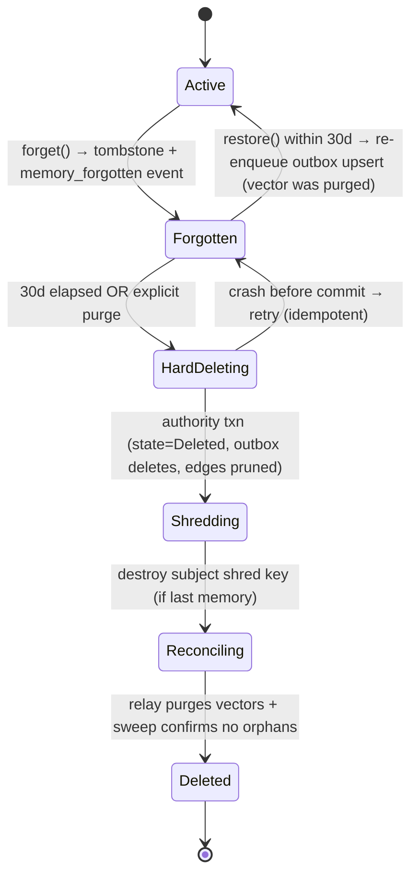

### 44.2 Backup / Restore lifecycle

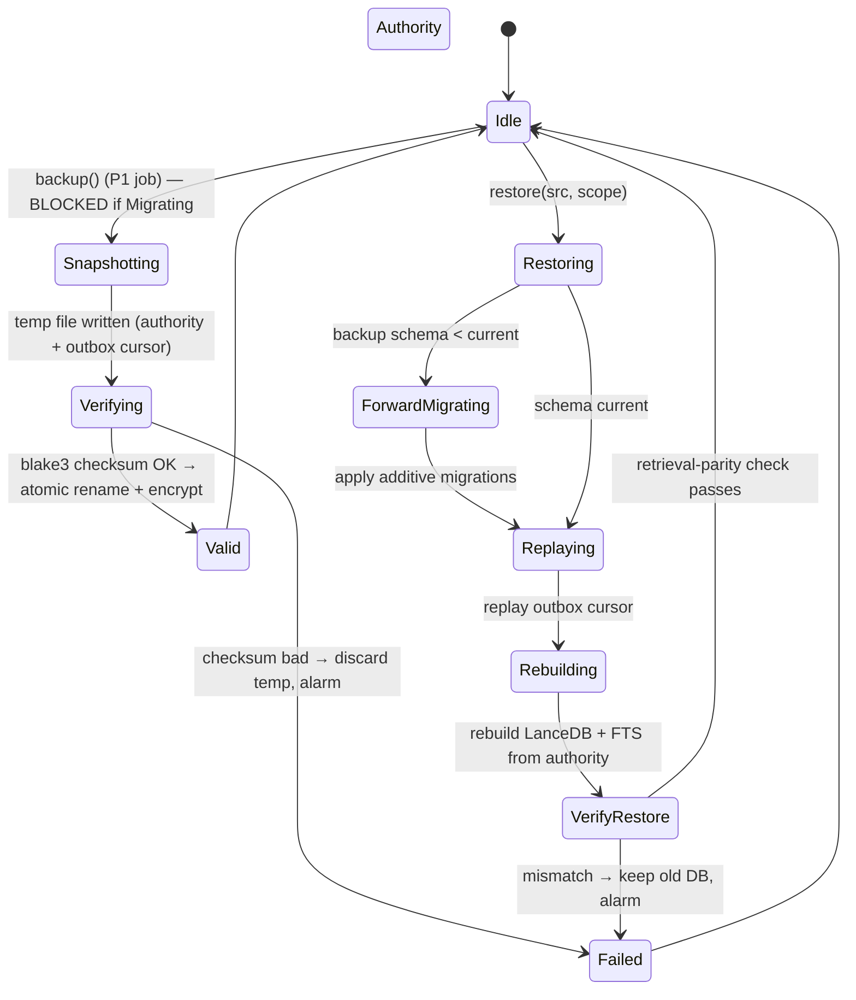

### 44.3 Reflection / consolidation pipeline

```mermaid
stateDiagram-v2
    [*] --> Idle
    Idle --> Triggered: idle>30m | session-end | idle>4h | weekly | backlog | post-outcome
    Triggered --> Reading: load checkpoint, read via read-plane (L10)
    Reading --> Summarizing: LLM up → dream; LLM down → heuristic (L8)
    Summarizing --> Submitting: emit untrusted WriteCandidate (source=self_reflection, conf≤0.6)
    Submitting --> Gated: Write Policy — contradiction/evidence/depth checks (D-9)
    Gated --> Checkpointed: batch committed (idempotent, content-hash)
    Checkpointed --> Reading: more batches
    Checkpointed --> Idle: done OR cancelled (resumable)
    Gated --> Idle: rejected (contradicts user-stated / depth>1 / insufficient evidence)
```

### 44.4 Library ingestion pipeline

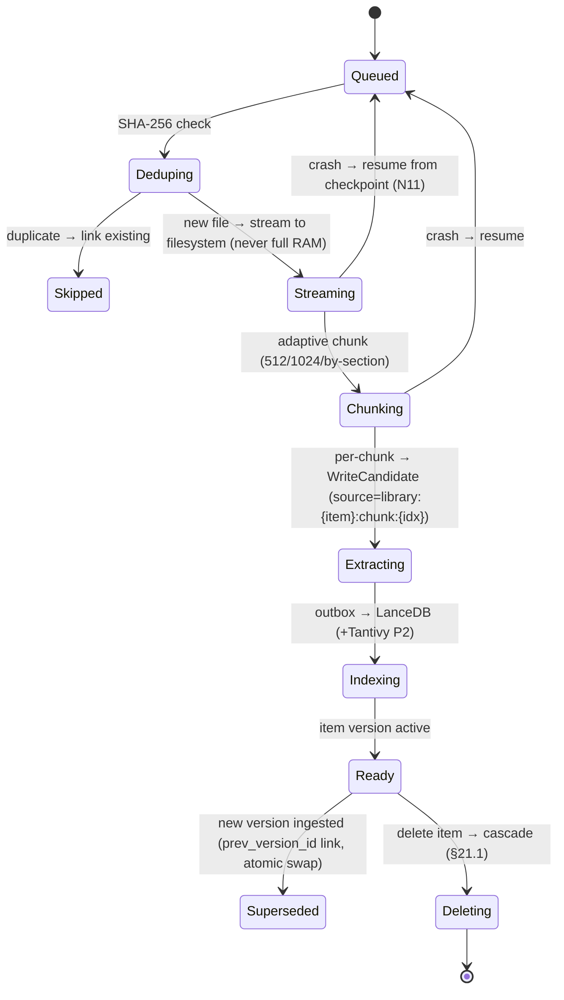

### 44.5 Embedding-model migration

```mermaid
stateDiagram-v2
    [*] --> Single: one active model version
    Single --> DualActive: upgrade → create_partition(new); dual-search old+new
    DualActive --> Reembedding: P4 worker re-embeds oldest-first (rate-limited, checkpointed)
    Reembedding --> Reembedding: batch done → checkpoint (resumable)
    Reembedding --> Verifying: all memories re-embedded
    Verifying --> Single: verify OK → drop old table (now single, new model)
    Verifying --> Reembedding: gaps found → continue
    DualActive --> RolledBack: batch corruption → LanceDB time-travel rollback
    RolledBack --> DualActive: retry
```

## 45. Integration With Existing KRIA Subsystems (concrete wiring)

This is the migration/coexistence contract with the **current** codebase. The new
system is built alongside the existing `crates/kria-core/src/memory/` modules and cuts
over behind a compatibility shim, so no consumer breaks mid-flight.

### 45.1 Legacy `MemoryRuntime` API → compatibility shim (ADR-014)

**Current reality (grounded in code):** consumers depend on
`Arc<dyn memory::MemoryRuntime>` (= `MemoryManager` + `MemoryReader`) — e.g.
`tools/registry.rs` (`build_registry_*`), `tools/knowledge.rs`, `platform/telegram.rs`,
and desktop commands `voice.rs`, `sessions.rs`, `voice_runtime_helpers.rs`. Methods in
use include `store_turn`, `delete_session`, `set_preference`, `fetch_memories`,
`get_recent_turns`. The concrete impl is `memory::store::MemoryStore`.

**Decision:** introduce `memory::compat::LegacyMemoryAdapter` that implements the
existing `MemoryManager` + `MemoryReader` traits **on top of the new Memory API**:

```rust
// crates/kria-core/src/memory/compat.rs
pub struct LegacyMemoryAdapter { api: Arc<dyn memory::api::MemoryApi> }
impl MemoryManager for LegacyMemoryAdapter {
    fn store_turn(&self, turn: &MemoryTurnWrite) -> anyhow::Result<i64> {
        // map a conversation turn → observe()/remember() WriteCandidate(s)
        // returns a synthetic monotonic id for source compatibility
    }
    fn delete_session(&self, session_id: &str) -> anyhow::Result<usize> {
        // map → forget(ForgetScope::Session(session_id)) (tombstone, reversible)
    }
    fn set_preference(&self, rec: &PreferenceRecord) -> anyhow::Result<()> { /* → remember(pref) */ }
}
impl MemoryReader for LegacyMemoryAdapter {
    fn fetch_memories(&self, q: &MemoryFetchRequest) -> anyhow::Result<Vec<ConversationTurn>> {
        // map → recall()/search() and shape back into ConversationTurn
    }
    fn get_recent_turns(&self, /* … */) -> anyhow::Result<Vec<ConversationTurn>> { /* → recall(recent) */ }
}
```

- `build_registry_*` and every `Arc<dyn MemoryRuntime>` call site keep compiling and
  behaving; they are handed a `LegacyMemoryAdapter` instead of `MemoryStore`.
- **Cutover plan:** P1 ships the adapter and routes writes through the new Write Policy
  (so nothing bypasses L3 even during migration). Consumers migrate to `memory::api`
  directly module-by-module across P2–P4. The shim is removed at end of P4 (its removal
  is the P4 exit criterion). Tauri command/event names never change (structure.md #5).
- **Session/preference semantics preserved:** `session_title:*` preferences (used by
  `sessions.rs`) map to scoped preference memories; `delete_session` cleanup of
  session-scoped prefs maps to the Temporary/session cascade (§23).

### 45.2 `EmbeddingModel` → `Embedder` port

**Current reality:** `memory::embeddings::EmbeddingModel` already runs ONNX via `ort`
with the real `all-MiniLM-L6-v2` (384-dim) tokenizer and an honest hash fallback when
the model/tokenizer is absent. This **is** the MiniLM fallback tier of D-3.

**Decision:** implement the `Embedder` trait (§16) as `OnnxEmbedder` that wraps the
existing loader:
- MiniLM path reuses `EmbeddingModel::load`/`embed` verbatim → `model_version =
  "minilm_v1"`, `dim = 384`.
- Add EmbeddingGemma-300M as `"gemma_v1"`, `dim = 768` (Matryoshka 256 hot column).
- `Embedder::health()` maps to `EmbeddingModel::is_onnx_loaded()`; when only the hash
  fallback is available, `health()` = `Degraded` and the slow path treats embeddings as
  unavailable (stores raw + queues re-embed, L8) rather than indexing meaningless hash
  vectors — this **fixes a latent correctness bug** where hash-fallback vectors would
  otherwise pollute the ANN index.
- Model files load from the existing `~/.kria/models/embeddings/` location; checksum
  pinning (D-3) is added to the loader.

### 45.3 `RagEngine` + knowledge tools → Library Manager + Memory API

**Current reality:** `memory::rag::RagEngine` (SQLite `DocumentChunk` + `VectorIndex` +
`EmbeddingModel`) is today's library/RAG; `tools/knowledge.rs` registers the
knowledge/RAG native tools over `Arc<dyn MemoryRuntime>`.

**Decision:** the new `library/` module supersedes `RagEngine`. During cutover
`RagEngine` is re-implemented as a thin facade over `library/` + `retrieval/` (same
public methods, new backend) so the knowledge tools in `tools/knowledge.rs` keep
working unchanged. The brute-force `VectorIndex` (`memory::vectors`) is retired — its
data is re-embedded into LanceDB by the §31.1 migration; the type is kept as a
deprecated re-export until the knowledge tools move to `memory::api` directly.

### 45.4 OpenClaw ↔ Memory (the strongest boundary, TB2/L7/N17)

**Current reality:** OpenClaw has `runtime_manager`, container `pool`, MCP `bridge`,
`registry`, and an HMAC-signed append-only `audit::AuditLedger` (`append`, `sign_entry`,
`verify_chain`). Skills run sandboxed; results return to the runtime.

**Decision / wiring:**
- Skills receive a **read-only `SkillMemoryView`** (new type in `memory::api`) scoped to
  `namespace = openclaw/{skill_id}` + the public `core` namespace. It exposes only
  `search`/`recall`/`explain` filtered to that scope (L7 enforced at the read filter,
  D-20). No write verb is reachable from a skill.
- Skill outputs flow to the **OpenClaw runtime/orchestrator**, which decides what to
  memorize and submits `WriteCandidate { source: Source::OpenClaw(skill_id), namespace:
  openclaw/{skill_id} }` to the Write Policy (never a direct store write — L3/SI-2).
- **Core promotion** (a skill-derived memory graduating to `core`) requires user
  approval or the evidence threshold (N17); it is itself a Write Policy decision, logged.
- **Two audit logs, clarified (ADR-015):** OpenClaw's `AuditLedger` continues to record
  *skill execution* (install/invoke/capability) with its HMAC chain. The **memory-audit
  log** (`memory_audit`, §28) records *write-policy decisions*. To close a tamper gap
  the review implied, the memory-audit log **adopts the same HMAC-signed chaining**
  (`sign_entry`/`verify_chain` pattern, reused from `openclaw::audit`) so memory-policy
  decisions are tamper-evident too. The two logs cross-reference by `skill_id` +
  `event_id` for a skill→memory forensic trail.

### 45.5 Automation event bus + scheduler (naming + wiring, disambiguation)

**Current reality:** `automation::event_bus::EventBus` is a Tokio broadcast bus
(`publish(topic, json)`, `subscribe_filtered(prefix)`); `automation::scheduler` exists;
`automation::proactive::ProactiveEngine` exists.

**Decision / wiring:**
- The memory **Cognitive Scheduler** (§25) is a **distinct** component from
  `automation::scheduler` (which schedules user-facing automations/workflows). To avoid
  confusion it is named `memory::scheduler::CognitiveScheduler`; it does **not** replace
  `automation::scheduler`. If future consolidation is desired, that is a separate ADR.
- **Triggers consume the existing bus:** `CognitiveScheduler` subscribes via
  `EventBus::subscribe_filtered` to topics it needs — `session.*` (session end → session
  reflection), `desktop.file.*`/`app.focus` (salience, debounced ≥60s), `system.idle`
  (idle triggers). This reuses infrastructure instead of inventing a new event system.
- **Memory publishes** lifecycle events to the same bus (`memory.created`,
  `memory.contradiction`, `memory.mode_switched`, `memory.health.*`) so the frontend,
  `ProactiveEngine`, and automations can react. These bus events are **derived
  notifications**, distinct from the durable event log (L1) — the bus is best-effort
  fan-out, the log is the source of truth.
- Salience/proactive retrieval (§19) is implemented **inside** `memory` but feeds
  `ProactiveEngine` via the bus rather than duplicating its surface.

### 45.6 LLM router integration

**Current reality:** the LLM router lives in `crates/kria-core/src/llm/`.

**Decision:** the memory layer depends on it only through the `LlmClient` trait (§16),
implemented by an adapter over the existing router. All LLM use (ambiguous
classification, dreaming, semantic contradiction advisory) is optional and budgeted
(§25); `LlmClient::health()` maps to router availability so the L8 degradation ladder
is driven by the real router state. Safe mode (§23) forces the `LlmClient` to report
unavailable regardless of the router.

### 45.7 Config & storage-location integration
- New config under `[memory]` in `kria_config.toml` (budgets §41, embedding tier,
  thresholds, mode defaults) — additive; no existing keys change (structure.md #2).
- Storage paths: authority `~/.kria/memory/kria_memory.db`, vectors
  `~/.kria/memory/vectors/`, library `~/.kria/library/`, models reuse
  `~/.kria/models/embeddings/`. The legacy DBs remain read-only under their current
  paths until the §31.1 migration verifies, then are archived.

### 45.8 Integration acceptance (what "integrated" means)
- IA-1 every current `Arc<dyn MemoryRuntime>` call site compiles and passes its existing
  tests against `LegacyMemoryAdapter` (no consumer edits in P1).
- IA-2 `tools/knowledge.rs` knowledge tools return equivalent results via the facade.
- IA-3 an OpenClaw skill cannot produce a durable write outside its namespace (SI-2
  test) and reads only its scope (CP-8).
- IA-4 the embedding hash-fallback never reaches the ANN index (§45.2 bug-fix test).
- IA-5 memory lifecycle events are observable on the automation `EventBus` and the
  memory-audit chain verifies (`verify_chain`) after a run.

## 46. Tool, Technology & MCP Integration Map (complete)

§45 wired the memory *core* seams. This section is the exhaustive map of **every KRIA
tool category, native technology, and the MCP subsystem** to memory — so no integration
is left implicit. It is grounded in the real modules under
`crates/kria-core/src/tools/` (46 tool modules), `crates/kria-core/src/mcp/` (MCP
client/server/bridge/discovery), and the tool-execution provenance already present in
`tools::ToolContext`/`TriggerProvenance`.

### 46.1 The single integration hook (how any tool/MCP outcome reaches memory)

There is exactly **one** hook, which is why this scales to all 60+ tools without N
integrations: the **agent execution path** (the `capability_dispatch` /
`CapabilityPlatform` entry point) already wraps every tool call. After a tool returns,
the **orchestrator** emits a `WriteCandidate` to the Write Policy Engine (L3) — tools
themselves never touch memory (mirrors the OpenClaw rule, §45.4). Two existing signals
map directly onto memory semantics:

- **`TriggerProvenance` → source reliability + injection wall.** `User` →
  `source_authority = user_stated (1.0)`; `ExternalContent` (web/file/doc) → untrusted
  data, confidence-capped ≤0.6, runs the deterministic injection scan (TB1/TB3, D-11);
  `Tool` (output of another tool) → `tool_verified (0.8)`. This reuses the field the
  codebase already threads through `ToolContext`, so no new plumbing.
- **Tool outcome (success/failure) → Memory Worth + Capability memory + Failure
  memory.** A failed/cancelled call is quality-filtered to the execution log (R4)
  unless it carries a lesson (→ Failure memory, §46.4).

**Provenance tag convention (extends §14 `source`):** `source: tool:{tool_name}` for
native tools, `source: mcp:{server}:{tool}` for MCP tools, `source: openclaw:{skill}`
for skills. This makes per-tool cascade delete and per-source trust weighting uniform.

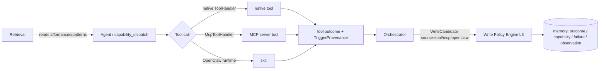

### 46.2 Native tool → memory matrix

Grouped by the modules in `tools/mod.rs`. "Reads" = what the tool/agent pulls from
memory before acting; "Writes (via Write Policy)" = what the outcome contributes.

| Tool module(s) | Reads from memory | Writes (via Write Policy) | Provenance / memory type |
|---|---|---|---|
| `file_ops`, `disk`, `mount_manager`, `documents` | prior file facts, project scope, `verify_against` paths | file/project observations; document facts (→ Library, §45.3) | `tool:file_ops`; world_model / library; `verify_against: path` (volatile-verifiable) |
| `internet`, `news`, `browser_agent` | past search facts, source reliability | web-derived facts (untrusted, conf ≤0.6, sanitized) | `tool:internet` `ExternalContent`; semantic, doc-capped |
| `shell`, `exec`, `process`, `subprocess_executor` | known commands, prior failures, capability stats | command outcomes; failures + recovery | `tool:shell`; failure / capability |
| `packages`, `system_config`, `config_patch`, `power`, `system_info` | tech-stack facts, system world-model | system/world-model facts (volatile-verifiable) | `tool:system`; world_model; 1h staleness |
| `google_workspace(_contract)`, `communication` | contacts/entities, prefs, past threads | interaction facts; entities/relationships (graph) | `tool:google` / `tool:comms`; entities, episodic; sensitivity-tagged |
| `image_generation`, `vision`, `vision_automation` | prior prompts, style prefs | generation outcomes; `modality` reserved (P5) | `tool:image`; episodic; modality field |
| `gui_automation`, `atspi_tools`, `desktop`, `app_lifecycle`, `interaction` | app affordances, execution patterns (procedural) | UI action outcomes, learned procedures | `tool:gui`; procedural / capability |
| `knowledge`, `rag` | RAG chunks, semantic facts | extracted facts (→ Library facade §45.3) | `library:{item}:chunk:{idx}`; semantic/library |
| `n8n`, `tasks`, `scheduler`, `proactive`, `precognitive` | goals, habits, automation success rates | automation outcomes; goal progress; habits | `tool:n8n`/`automation`; goal / reflection / capability |
| `cognition_tools`, `developer`, `i18n`, `preflight`, `quarantine`, `availability` | reasoning traces, self-model | reasoning traces; diagnostics (mostly stateless) | `tool:cognition`; reasoning_trace |
| `capability_dispatch`, `dynamic_gen` | capability memory (CKB, §46.4) | capability success/failure stats | `tool:capability`; capability |

**Rule:** privileged/mutating tools (e.g. `config_patch`) that already require
`TriggerProvenance::User` (the injection wall) are also the tools whose memory writes
carry `user_stated` authority — the two guarantees are aligned, not duplicated.

### 46.3 MCP integration (first-class, grounded in `crates/kria-core/src/mcp/`)

MCP tools are external and untrusted-by-default, but they flow through the **same**
`ToolHandler` interface (`mcp::tool_bridge::McpToolHandler`), so they inherit §46.1
automatically. Additional MCP-specific wiring:

- **Outcome memory.** An MCP tool result becomes a `WriteCandidate { source:
  mcp:{server}:{tool}, provenance: Tool (or ExternalContent if it returns fetched
  content) }`. Confidence follows source reliability; results returning web/doc content
  are treated as `ExternalContent` (injection-scanned, conf-capped).
- **Capability memory from discovery.** `mcp::capability_discovery` +
  `capability_registry` enumerate server tools; each discovered tool is recorded as a
  **capability memory** (`memory_type = capability`, `source: mcp:{server}:{tool}`) with
  running success/latency stats — feeding the Planner's tool selection (§46.4). When a
  server disappears, its capability memories are marked `verify_against: mcp:{server}`
  and demoted (not deleted) so the Planner stops selecting a dead tool but history is
  kept.
- **Namespace + trust.** MCP-sourced memories live in `namespace: mcp/{server}` and are
  visible to `core` retrieval only at the reliability tier of their source (never
  user-stated). A misbehaving/poisoning MCP server is contained by the same namespace
  isolation as plugins (L7/TB2-adjacent).
- **Server lifecycle & degradation (L8).** `mcp::server_manager` availability maps to
  the degradation ladder: an unavailable MCP server means its capability memories are
  flagged stale and its tools are skipped — retrieval and other memory are unaffected.
- **Config source of truth.** MCP servers are defined in `config/mcp_servers.json` (and
  merged user/workspace configs per Kiro MCP precedence) — memory does not re-declare
  them; it only records outcomes + capabilities keyed by the server name from that
  config. No MCP config file is modified by the memory layer.
- **`payload_shaper`/`protocol`.** Large MCP payloads are shaped before memorization —
  memory stores the shaped result + a reference, never unbounded raw payloads (§16 arch
  "Never stored: full file contents" → path/reference discipline).

### 46.4 Capability Knowledge Base (CKB) — merged into memory (architecture §15)

The architecture folds the CKB into memory rather than a separate store. Concretely:

- **`memory_type = capability`** rows carry `{ tool_id | mcp:{server}:{tool} | skill_id,
  success_count, failure_count, avg_latency, last_used, difficulty_profile }`.
- **Writers:** `capability_dispatch` outcomes, MCP discovery, OpenClaw skill benchmarks.
- **Readers:** Planner (tool selection), Discovery/Evolution (benchmark trends),
  Reasoner. Read via the Memory API like any other memory (scope-filtered).
- **Failure memory** (`memory_type = failure`) captures what went wrong + recovery, and
  is retrieved before re-attempting a similar action (§8, architecture §15 Planner row).
- These share the Memory Worth + decay machinery (§22) — a tool that stops working
  decays out of the Planner's default selection without being forgotten.

### 46.5 Other technology surfaces (voice, fleet, sidecars, automation)

| Technology | Integration with memory |
|---|---|
| **Voice pipeline** (`voice/`, desktop `voice.rs`) | STT transcripts enter as `observation` events (fast path); voice sessions obey memory modes; TTS/voice prefs are preference memories. Already uses `Arc<dyn MemoryRuntime>` → served by the compat shim (§45.1) in P1. |
| **Fleet / remote** (`infra/`, `kria-server`, connection-control) | remote execution outcomes memorized with `device_id` + `namespace: fleet/{target}`; the reserved `device_id` field (§3) keeps these isolated and ready for multi-device (Phase 6). Server exposes memory via the API only. |
| **Python sidecars** (`sidecars/`, desktop `sidecar.rs`) | document/audio/image/embeddings/google/news/web processors return results to the orchestrator, which memorizes via Write Policy (`source: sidecar:{module}`). Sidecar is optional → absence degrades gracefully (L8); the ONNX `Embedder` (§45.2) runs in-process and does **not** require the Python embeddings sidecar. |
| **Automation / n8n** (`automation/`, `tools/n8n.rs`, `N8N_IMPLEMENT_NEW.md`) | workflow triggers/outcomes feed goal progress + habit detection; the Cognitive Scheduler shares the `EventBus` with `automation` (§45.5) but stays a distinct component. |
| **Telegram MCP server** (`sidecars/.../telegram`) | a specific MCP server → handled entirely by §46.3 (no special-case); messages are interaction memories, sensitivity-tagged. |
| **Frontend (SolidJS/Tauri)** | consumes memory only via existing Tauri commands (thin adapters over `memory::api`); `explain`/`health`/mode indicator surface through them; command/event names unchanged. |

### 46.6 Integration acceptance additions
- IA-6 an MCP tool outcome is memorized with `source: mcp:{server}:{tool}` and correct
  `TriggerProvenance` mapping; a server marked unavailable demotes (not deletes) its
  capability memories and its tools are skipped by the Planner.
- IA-7 a native tool call acting on `ExternalContent` cannot persist an
  instruction-like memory as a procedure/rule (SI-1), and its facts are confidence-capped.
- IA-8 the CKB capability memories drive Planner tool selection and decay out when a
  tool stops succeeding (Memory Worth), without being forgotten.
- IA-9 per-source cascade delete works for a tool/MCP server (`forget` by
  `source: mcp:{server}` removes its memories + vectors + capability rows).

---

# PART F — DEV-CONTEXT SCOPING & CONVERGENCE FOLD-IN (§47)

> Added after the architecture convergence pass (`MEMORY_ARCHITECTURE_FINAL.md` §38)
> and the permanent dev-context steering rule (`.kiro/steering/dev-context.md`): KRIA is
> a **single-laptop, single-user, pre-production** build where **data loss is
> acceptable** and **dead/legacy code should be deleted, not preserved**. This part
> reconciles the spec with both: it folds in the convergence decisions that matter for a
> local build, and explicitly **descopes production ceremony** that only exists to
> protect data/consumers that do not yet exist. Nothing here weakens correctness,
> invariants, or the quality of the product being built — it removes work whose only
> justification was production data safety.

## 47.1 Scoping decisions (what changes vs Parts A–E)

| Item (source) | Prior spec position | Dev-scoped decision | Rationale |
|---|---|---|---|
| **Legacy compat shim** `LegacyMemoryAdapter` (§45.1, task 18.5) | build shim, cut over gradually | **Drop the shim. Hard cutover:** rewrite the ~6 `Arc<dyn MemoryRuntime>` call sites directly and **delete** `MemoryStore`/`RagEngine`/`VectorIndex`/legacy `facts`/`decay` | dev-context: delete dead code, breaking changes fine; no external consumers to protect |
| **Legacy data migration** (§31.1, task 21) | resumable job + parity verify + keep-legacy-read-only | **Drop/optional.** Data loss OK → start clean; optional one-shot best-effort import, no parity gate | no production data to preserve |
| **Backup/restore ceremony** (§30, task 28) | authority backup, checksum, test-restore, 3-2-1 | **Future-only.** Ship nothing beyond "copy the SQLite file" | data loss acceptable |
| **Encryption at rest** (§9/§29, task 40) | default-on SQLite+LanceDB+backup encryption | **Future-only** (keep the *design*; do not implement now). Rely on OS-level disk encryption | single trusted laptop; no threat model for stolen disk yet |
| **Writer-leader lease L13/L14** (arch §38.1) | — (not in spec) | **Future-only.** Keep **L14 local-FS-only** as a one-line startup check; skip the lease/RPC (desktop is the sole writer process) | single-process reality |
| **`.kmem` portable export/import** (arch §38.7) | — | **Future-only.** `export`/`import` verbs remain in the API surface but return `Unsupported` until needed | no cross-install need yet |
| **Cold-segment roll** `roll_cold_segments` (§8.2, task 5) | P1 | **Future-only.** Events stay hot in SQLite; revisit at real volume | premature at dev scale |
| **HMAC-chained audit** (§45.4, task 11) | P1 tamper-evident chain | **Simplify:** plain append `memory_audit` row (decision+reason). Skip HMAC chaining | tamper-evidence is a production concern |
| **ADR files `docs/ADR/*`** (§38, task 20.1) | write 15 ADR files | **Optional.** The §38 ADR index table is enough; write ADR files lazily | doc ceremony |
| **Admission control** (arch §38.9) | — | **Fold in, minimal:** per-source debounce + coalesce + bounded queue (needed — tool-outcome capture can storm even on one laptop). Skip elaborate token-bucket tiers | real risk from file watchers/GUI loops |
| **PII/sensitivity classifier** (arch §38.3) | referenced, no task | **Fold in (load-bearing):** deterministic Tier-1 detectors now; LLM refine later | gates secret-handling + crypto-shred |
| **`reason()` contract** (arch §38.4) | verb listed, undefined | **Fold in:** the §47.4 contract below | otherwise ambiguous to implement |
| **Embedding default** (D-3, task 12) | "Gemma default" | **MiniLM (Apache-2.0) is the default provisioned tier; Gemma opt-in** (arch §38.6 licensing) | Gemma Terms ≠ Apache; MiniLM already in-tree and works offline |
| **i18n tokenizer** (arch §38.10) | — | **Fold in minimal:** `unicode61` default + auto-`trigram` for CJK-heavy content; ICU/`simple` future-only | multilingual embeddings already primary; cheap FTS floor fix |
| **Crypto-shred** (§21/§25, L9) | full keyring | **Keep as a feature** (it's product functionality, not data-safety ceremony), but simplify key storage to a single local keyfile; skip KEK/DEK rotation + recovery-blob | erasure is a real KRIA feature; enterprise key mgmt is not |

**Invariant effect:** L1–L12 unchanged. **L13 deferred** (documented future). **L14
kept** as a trivial startup guard. No invariant is weakened; several are simply enforced
by "there is one process" rather than by machinery.

## 47.2 Lean MVP definition (the "memory works" milestone)

The smallest end-to-end loop that proves the architecture on the laptop. Everything else
layers on after this is green:

```
observe/remember → Write Policy (fast+slow) → SQLite authority (event+memory+outbox)
   → embed (MiniLM) → LanceDB + FTS5 → search()/recall() → context injection
   with: memory modes, degradation (no LLM/embedder), and the I-1/I-2 invariant gates.
```

MVP excludes: truth maintenance, cognition/dreaming, entity resolution, library,
merge/split, reconciliation, feedback tuning, salience, observability reports, scale
benchmark. Those are correctness/intelligence layers added once the loop lives.

## 47.3 PII / Sensitivity classifier (folded in — dev-minimal)

Tier-1 deterministic detectors only (no LLM dependency), in
`memory/write_policy/sensitivity.rs`, run on the fast path:
- **`secret`** (never store value; keychain-ref + redacted placeholder; embedding
  omitted): credential/key/token patterns (`-----BEGIN`, `AKIA…`, JWT, high-entropy
  strings), passwords, connection strings, credit-card (Luhn), SSN/national-ID.
- **`private`** (store; embedding encrypted or, in dev, simply not shared cross-scope):
  emails, phones, addresses, DOB, medical/financial terms.
- **`public`**: everything else.
- Pluggable `SensitivityDetector` registry; version-stamped patterns. User override
  (`set_sensitivity`) is sticky. LLM refinement is a **future** slow-path add (raise-only,
  fail-safe). Fail-safe direction: ambiguous → more private.

## 47.4 `reason()` contract (folded in)

As architecture §38.4, scoped to dev: `reason(ReasonRequest{query, ctx, mode:
Retrieve|Synthesize, max_hops<=3, stream, cancel}) -> ReasonResult{answer?, supporting[],
graph_paths[], confidence, trace, degraded?}`. Pipeline = `search()` → cycle-safe graph
expansion → working-memory merge → optional LLM synthesis (evidence-as-data). **LLM down
→ return evidence set with `degraded=LlmUnavailable` (never errors, L8).** Confidence from
evidence, not the LLM (N13). Always explainable via `trace`+`supporting` (L6).

## 47.5 Admission control (folded in — minimal)

In front of the fast path (`memory/write_policy/admission.rs`): per-source debounce +
coalesce-by-`(source, entity)` for ambient/observational streams (file watchers, desktop
context, GUI loops); `TriggerProvenance::User` writes bypass throttling; a bounded ring
buffer with drop-to-sample on overflow, **always keeping failures + contradictions +
user-flagged**. No multi-tier token buckets in dev.

## 47.6 Deferred-to-future register (do NOT build now; keep design)

Writer-leader lease + RPC (L13), backup/restore, at-rest encryption, `.kmem`
export/import, cold-segment roll, HMAC audit chaining, KEK/DEK rotation + recovery,
Tantivy, ICU tokenizer, dual-run rollback flags. Each has a design home already; each
returns when KRIA leaves single-laptop dev. Tracking them here prevents "lost
requirements" when the project matures.

---

*End of design. This document is the HOW for `MEMORY_ARCHITECTURE_FINAL.md`. It resolves
every implementation ambiguity in §4, §45 (existing-system integration), §46 (tool/tech/
MCP map), and §47 (dev-context scoping + convergence fold-in), and is traceable to the
requirements (§36). Parts A–E define the full production design; **Part F (§47) is the
authoritative build scope for the current single-laptop phase** — where §47 descopes or
overrides an earlier part, §47 governs for now, and the descoped work is preserved in the
§47.6 future register.*
