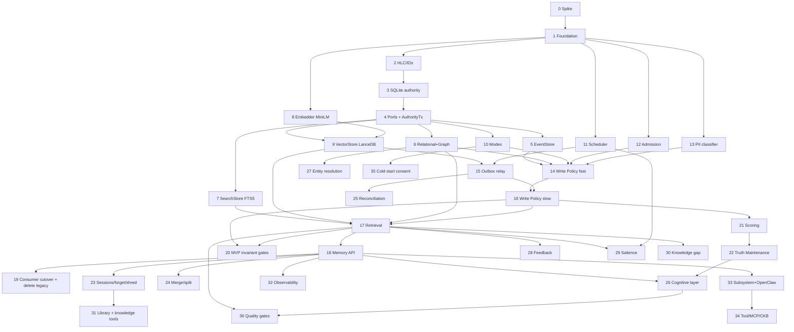

# Implementation Plan

## Overview

Scope follows design **Part F / §47** and `.kiro/steering/dev-context.md`: KRIA is a
**single-laptop, single-user, pre-production** build. Data loss is acceptable, dead code
is deleted (no compat shims), hard cutovers are fine. This plan is therefore **MVP-first**
and **descopes production ceremony** (backup/restore, at-rest encryption, writer-leader
lease, `.kmem` export, HMAC audit chain, cold-segment roll, dual-run rollback) to a
future register (§47.6) — the *design* for those is kept, the *work* is deferred.

All code lives in `crates/kria-core/src/memory/`. Consumers touch only `memory::api`.
Tauri command/event names are unchanged. Each task cites its requirements.

## Tasks

- [x] 0. Pre-flight spike (de-risk external crates)
  - Confirm the `lancedb` Rust crate supports: embedded open, create table per model
    version, upsert/delete by id, ANN search with a scalar payload filter, and dataset
    versioning/time-travel. Confirm `ort` loads EmbeddingGemma-300M (fp32/q8/q4, not
    fp16) and the existing MiniLM path. Pin exact versions in `Cargo.toml`.
  - Output: a throwaway spike + pinned versions. If LanceDB embedded misses a needed
    capability, fall back to the `VectorStore` trait's Qdrant option (design D-1) before
    task 9.
  - _Requirements: 22_

- [x] 1. Foundation: scaffolding, error taxonomy, domain types, config
  - Create the `memory/` module tree (`api`, `ports`, `stores`, `event_log`,
    `write_policy`, `retrieval`, `truth`, `cognition`, `entity_resolution`, `library`,
    `scheduler`, `governance`, `modes`, `observability`, `cache`, `types`, `error`);
    only `api` is `pub`, rest `pub(crate)`.
  - Define the error taxonomy (design §43): `MemoryError` + `StorageError`,
    `RetrievalError`, `EmbeddingError`, `ConsistencyError`, `MigrationError`,
    `PermissionError`, `SecurityError`, `SchedulerError`; degradation signals are not
    hard errors; convert `anyhow`→`MemoryError` at boundaries.
  - Define domain types (design §17): `Event`, `Memory`, `WriteCandidate`,
    `WriteDecision`, `RejectReason`, and enums (`MemoryType`, `MemoryState`,
    `StalenessClass`, `Sensitivity`, `MemoryMode`, `Scope`, `MemoryWorth`) — persisted
    enums string-serialized with an `Unknown(String)` fallback (design §40, cheap
    forward-compat).
  - Add `[memory]` config to `kria_config.toml` (token budget, thresholds, embedding
    tier, debounce intervals).
  - _Requirements: 1, 2, 25_

- [x] 2. HLC and identifiers
  - Implement `Hlc` (monotonic `tick(now_utc)`, sortable encoding, backward-jump safe),
    UUID v7 helper, BLAKE3 hashing helpers.
  - Property test: HLC order == event order under injected clock drift/DST (CP-18).
  - _Requirements: 1, 14_

### MVP — the working memory loop (must be green before anything else)

- [x] 3. SQLite authority: schema, migrations, connections
  - `0001_init.sql` with the core DDL from design §14: `schema_version`, `events` +
    immutability triggers, `event_consumer_cursor`, `memories` + indexes + unique
    content-hash index, M:N link tables, `entities`/`entity_aliases`/`relationships`,
    `sessions`/`episodes`/`goals`, `preferences`, `embedding_outbox`/`outbox_cursor`,
    `memory_audit` (plain rows — no HMAC chain, §47.1), `memories_fts`. Defer
    `shred_keys` detail to task 23, library tables to task 31.
  - Additive-only migration runner (schema_version + checksum, refuses downgrade).
  - Connections: one serialized write connection + WAL read pool; set
    `journal_mode=WAL, foreign_keys=ON, busy_timeout, synchronous=NORMAL`. **L14 guard:**
    refuse writer mode if the DB is on a network mount.
  - Test: immutability triggers abort UPDATE/DELETE on `events`.
  - _Requirements: 1, 14_

- [x] 4. Storage-port traits + `AuthorityTx`
  - Define async, object-safe ports in `ports/` (`EventStore`, `RelationalStore`,
    `GraphStore`, `VectorStore`, `SearchStore`, `Embedder`, `LlmClient`) per design §16.
  - `AuthorityTx` wraps the single write connection so event + memory + graph + outbox
    commit together; no API writes LanceDB/FTS inside the txn.
  - _Requirements: 1, 12, 15_

- [x] 5. EventStore (SQLite)
  - `append` (idempotent by event id), `read_range`, cursor get/advance. **No
    cold-segment roll** (deferred, §47.6).
  - Test: idempotent re-append is a no-op.
  - _Requirements: 1_

- [x] 6. RelationalStore + GraphStore (SQLite)
  - RelationalStore: memory/goal/pref/evidence/audit CRUD + outbox enqueue/pending/mark
    (`&mut AuthorityTx` for writes, read pool for reads).
  - GraphStore: add entity/relationship; `neighbors(root, max_hops<=3)` as cycle-safe,
    visited-set, depth-capped recursive CTE; `relationships_for`, `search_entities`.
  - Property test: `neighbors()` terminates on random cyclic graphs (CP-15).
  - _Requirements: 1, 6, 12, 19_

- [x] 7. SearchStore (FTS5)
  - `index`/`query`/`delete`/`all_ids` over `memories_fts`, written in the same authority
    txn as the memory. Tokenizer: `unicode61` default; auto-select `trigram` for
    CJK-heavy content (design §47.1 i18n). ICU/`simple` deferred (§47.6).
  - _Requirements: 7, 13_

- [x] 8. Embedder (ONNX), MiniLM default
  - `OnnxEmbedder` wrapping the existing `memory::embeddings::EmbeddingModel`: **MiniLM
    (384-dim, Apache-2.0) is the default provisioned tier** (`minilm_v1`); EmbeddingGemma
    (`gemma_v1`, 768-dim, 256-dim Matryoshka hot column) is opt-in with license accept
    (design §47.1). `health()` maps to `is_onnx_loaded()`.
  - Guard: hash-fallback → report `Degraded`, treat as unavailable, never index hash
    vectors (IA-4).
  - _Requirements: 7, 18, 22_

- [x] 9. VectorStore (LanceDB)
  - Embedded LanceDB: per-`model_version` tables (`create_partition`),
    `upsert`/`search`/`delete`/`all_ids`; id == SQLite memory id; scope/sensitivity
    payload filter; `secret` content vector omitted.
  - _Requirements: 7, 13, 22_

- [x] 10. Memory modes
  - Deterministic mode decision table (design §23) for all 11 modes; per-session mode
    cache (dashmap); `set_mode` emits `mode_switched`; Incognito no-persist; Read-only
    reject; Workspace rejects personal scope.
  - Test: Incognito/Read-only write 0 durable rows (CP-7).
  - _Requirements: 3, 4, 19_

- [x] 11. Cognitive Scheduler floor (minimal)
  - Priority classes P0–P4, `JobProfile`, single-flight keys, two-queue writer arbiter
    (P0 preempts; background yields per batch), durable job state, cooperative
    cancellation + checkpoint/resume + graceful shutdown drain.
  - Runtime Budget: suspend P3/P4 on battery, shed caches under memory pressure, bounded
    queues + backpressure.
  - Name it `memory::scheduler::CognitiveScheduler` (distinct from
    `automation::scheduler`); subscribe triggers via `automation::event_bus::EventBus`
    (`session.*`, `desktop.file.*`, `app.focus`, `system.idle`); publish
    `memory.*` lifecycle notifications.
  - _Requirements: 7, 14, 20, 24_

- [x] 12. Admission control (write-storm guard, minimal)
  - `write_policy/admission.rs`: per-source debounce + coalesce-by-`(source, entity)` for
    ambient streams; `TriggerProvenance::User` bypasses; bounded ring with drop-to-sample
    on overflow, always keeping failures + contradictions + user-flagged (design §47.5).
  - _Requirements: 20, 24_

- [x] 13. PII / sensitivity classifier (Tier-1 deterministic)
  - `write_policy/sensitivity.rs`: deterministic detectors → `secret`/`private`/`public`
    (credentials/keys/tokens/PII/financial/health), pluggable `SensitivityDetector`
    registry, version-stamped patterns, sticky `set_sensitivity` override, fail-safe to
    more-private (design §47.3). LLM refinement deferred.
  - _Requirements: 18_

- [x] 14. Write Policy Engine — fast path
  - `submit(WriteCandidate)`: admission → mode check → ownership/namespace/scope/
    sensitivity assignment (task 13) → deterministic security scan (pattern/structural,
    no LLM) → atomic append of raw event + outbox seed in one `AuthorityTx` → enqueue
    slow path → return decision. Plain `memory_audit` row per decision (no HMAC).
  - Test: raw event durable before ack with embedder+LLM disabled (CP-6); p95 latency
    probe.
  - _Requirements: 2, 3, 4, 14, 18, 19_

- [x] 15. Transactional outbox relay
  - Read pending outbox per index cursor, apply to LanceDB idempotently by
    `(memory_id, index_target, content_hash)`, mark done, dead-letter after retry budget.
  - Property test: replaying an outbox entry ≥1 times → same index state (CP-4).
  - _Requirements: 12_

- [x] 16. Write Policy Engine — slow path
  - `enrich(event_id)`: quality filter → embed (queue re-embed if unavailable) → vector
    dedup (reconsolidate on hit) → contradiction (read-only) → deterministic
    classification (LLM only for ambiguity, content-as-data) → importance → false-
    promotion guard → provenance/expiration → commit derived memory + graph + FTS(in-txn)
    + outbox ops in one chunked authority txn → audit. Bounded retry →
    `enrichment_deadletter`. Write batching + `NeedsConfirmation` for secret/high-impact.
  - _Requirements: 2, 5, 6, 7, 18_

- [x] 17. Retrieval orchestrator
  - Deterministic query classification (<5ms); 5 parallel read-only strategies (vector,
    FTS, graph 2-hop, temporal in local tz, goal-context), each failing independently;
    adaptive RRF; candidate gating (exclude superseded/archived + importance/Memory-Worth
    gate); namespace/scope/sensitivity filter; staleness flag; token-budget fill;
    multi-turn pinning; provenance annotation; queued non-blocking access updates;
    degradation ladder (LanceDB down → FTS+graph; embedder down → keyword+graph).
  - Test: no cross-scope leak (CP-8); embedder+LLM off returns keyword+graph (CP-16).
  - _Requirements: 6, 7, 13, 19_

- [x] 18. Memory API Contract
  - Public `api::v1` (design §10): `observe`, `remember`, `update`, `forget`, `verify`,
    `search`, `recall`, `reason`, `explain`, `reflect`, `consolidate`,
    `resolve_entities`, `health`, `metrics`, `set_mode`, `set_sensitivity`. `backup`/
    `restore`/`export`/`import` present but return `Unsupported` for now (§47.1/§47.6).
  - Implement `reason()` per the §47.4 contract (compose search + graph; LLM-optional;
    degrades to evidence set; explainable).
  - _Requirements: 2, 13, 17, 25_

- [x] 19. Direct consumer cutover (delete legacy)
  - Rewrite the `Arc<dyn MemoryRuntime>` call sites (`tools/registry.rs`,
    `tools/knowledge.rs`, `platform/telegram.rs`, desktop `voice.rs`/`sessions.rs`/
    `voice_runtime_helpers.rs`) to call `memory::api` directly. **Delete** the legacy
    modules (`memory::store`, `manager`, `facts`, `decay`, `rag`, `vectors`,
    `retrieval`, `semantic_parser`, `embeddings` old path) once nothing references them.
    Keep Tauri command/event names unchanged.
  - No compat shim (§47.1). Hard cutover.
  - _Requirements: 24_

- [x] 20. MVP invariant gates
  - Grep-gate/invariant tests: no direct LanceDB/FTS writes outside `stores/` + relay
    (I-1); only `api` is `pub` (I-2). Basic crash test: kill after event append and
    mid-relay → recover to authority state, indexes converge (CP-6).
  - **MVP milestone: the §47.2 loop works end-to-end on the laptop.**
  - _Requirements: 1, 2, 12, 14_

### Phase 1 — correctness layer

- [x] 21. Scoring: importance, decay, Memory Worth
  - Deterministic `importance` sigmoid (§22.1, optional ±2 LLM nudge); unified
    `effective_retention`/`decay_rate` with staleness veto + archive predicate (§22.2);
    Memory Worth (credit÷N, difficulty-adjusted, ≥20-sample gate, log-capped, never
    hard-delete).
  - Property tests: decay monotonic; Immutable/Permanent never decay (CP-12); Memory
    Worth never deletes (CP-13).
  - _Requirements: 5, 6, 16, 20_

- [x] 22. Truth Maintenance System
  - Staleness classes + evidence tracking/aging + confidence propagation; contradiction
    detection + deterministic resolution order + supersession (version history) +
    competing beliefs; verification-on-retrieval for `verify_against` (fs/tool/git),
    demote+flag on change, "unverified" when source down.
  - _Requirements: 6_

- [x] 23. Sessions, crash resume, lifecycle, crypto-shred (simplified)
  - Session FSM (start/roll-at-midnight/close/crash), episode chunking (≤4h, immutable on
    close), startup integrity (SQLite quick-check + LanceDB open-verify) + open-session
    resume (<24h).
  - `forget(scope)` (tombstone reversible 30d) + `hard_delete` (atomic authority txn:
    mark deleted, enqueue index deletes, FTS in-txn, prune orphan edges, crypto-shred
    subject). **Crypto-shred kept as a feature** but with a **single local keyfile** for
    subject keys — no KEK/DEK rotation or recovery-blob (§47.1).
  - Test: post-delete no surface returns X-derived content; shred key destroyed (CP-10).
  - _Requirements: 6, 9, 10, 14_

- [x] 24. Merge / split
  - Atomic `merge(a,b)`/`split(id)` (one authority txn: memories + derived_from +
    Memory-Worth combine + graph rewire + outbox ops + reversible provenance 30d);
    originals archived.
  - Property test: fully applies or aborts; reversible; derived_from preserved (CP-11).
  - _Requirements: 15_

- [x] 25. Reconciliation sweep
  - Weekly P1 job: set-difference orphan detection vs authority → purge orphan vectors,
    dangling edges, parentless chunks, unused shred keys; `RepairReport`; repair
    dead-lettered outbox entries.
  - _Requirements: 10, 12_

### Phase 2 — intelligence layer

- [x] 26. Cognitive layer (consolidation / dreaming / reflection)
  - Trigger-based (idle/session-end/daily/weekly/backlog/post-outcome); two-mode
    dreaming; progressive compression (episode→skill→rule, level 3 terminal, depth 1);
    source retention + grounding check; content-hash idempotency; checkpoint/resume;
    heuristic degradation when LLM down; output re-enters via Write Policy as untrusted
    (conf ≤0.6, evidence-gated).
  - Property test: reflection contradicting a user-stated fact is rejected (CP-14).
  - _Requirements: 7, 21_

- [x] 27. Entity Resolution Engine
  - Conservative reversible resolution (canonicalize → block → score → decide):
    auto-merge only on strong identifier match; name-only never auto-merges people;
    medium signals propose; `merged_from`/split restore; alias handling for renames.
  - _Requirements: 6, 19_

- [x] 28. Feedback intake + adaptive tuning
  - `FeedbackEvent` intake (full signal taxonomy) → Memory Worth, confidence calibration,
    adaptive RRF weight self-tuning; capture surfaced/referenced/outcome in retrieval.
  - _Requirements: 16_

- [x] 29. Proactive / salience retrieval
  - Event-driven salience (file open, app focus, new message), debounced ≥60s, coalesced,
    disabled on battery, cached context embedding re-embedded only on context change.
  - _Requirements: 13, 20_

- [x] 30. Knowledge Gap Engine
  - Record missed queries (times_missed, domain); surface in health report; feed Research
    mode.
  - _Requirements: 17_

- [x] 31. Library manager + knowledge tools
  - Streamed/checkpointed/resumable ingestion, adaptive chunking, SHA-256 dedup,
    provenance tagging (`source: library:{item}:chunk:{idx}`), versioning, incremental
    re-index, per-item cascade delete (via task 23), collections. Rewrite
    `tools/knowledge.rs` knowledge tools directly onto `memory::api` (no `RagEngine`
    facade — hard cutover). Optional sidecar document parser (degrades if absent).
  - _Requirements: 9, 24_

### Phase 3 — integration, quality gates, hardening

- [x] 32. Observability & explainability
  - `explain_retrieval`, `explain_memory`, `memory_health_report`, "what KRIA believes
    about you" report, intelligence-metric suite via `metrics()`, `tracing` spans (never
    log secret content), `health()` (store availability + degradation state).
  - _Requirements: 17_

- [x] 33. Subsystem + OpenClaw integration
  - Wire Planner/Reasoner/Execution/Workspace/Frontend to the Memory API; read-only
    `SkillMemoryView` (own namespace + public core) for OpenClaw, orchestrator-only
    writes, gated core-promotion; thin Tauri adapters (no new contract names).
  - Test: plugin cross-namespace write rejected (L7 / SI-2).
  - _Requirements: 2, 19_

- [x] 34. Tool / MCP / CKB outcome integration
  - Single orchestrator hook at `capability_dispatch`/`CapabilityPlatform` exit emitting
    `WriteCandidate` for every native tool, MCP tool (`mcp::tool_bridge::McpToolHandler`),
    and skill outcome; provenance tags (`tool:{name}` / `mcp:{server}:{tool}` /
    `openclaw:{skill}`); `TriggerProvenance` → reliability + injection wall. Capability
    memory (CKB) from `capability_dispatch` + `mcp::capability_discovery`; demote (not
    delete) on MCP-server unavailable; Planner reads it. Per-source cascade delete;
    sidecar (`source: sidecar:{module}`) capture.
  - Tests: IA-6, IA-7 (SI-1), IA-8, IA-9.
  - _Requirements: 2, 19, 24_

- [x] 35. Consent-gated cold start + onboarding
  - First-run consent screen before any fs/git/shell scan; onboarding-only default;
    previewable/deletable scan results before commit; wire via `set_mode` + first-run
    flow (thin desktop adapter).
  - _Requirements: 8_

- [x] 36. Quality gates + test suite
  - Scale benchmark harness in `crates/kria-eval/` (seeded synthetic corpus with planted
    ground-truth labels, 10K→500K; Recall/nDCG + p95 latency vs frozen baseline) and the
    performance-budget checks (design §41). Complete the `proptest` suite (CP-4, CP-5,
    CP-11, CP-12, CP-15, CP-18); security tests (SI-1, injection-not-stored,
    shred-unrecoverable); privacy tests (forget/library completeness); degradation tests.
    Treat as a **quality gate for the feature**, not production release ceremony.
  - _Requirements: 6, 7, 10, 12, 13, 16, 19_

## Architectural Decisions (resolving Tasks 0, 9, 19)

These tasks are closed with documented decisions — per the dev-context rule that
the *design intent* (not an obsolete checklist item) is what must be satisfied.

- **Task 0 / Task 9 — VectorStore backend & embedder tier (LanceDB / EmbeddingGemma
  evaluated, superseded).** Decision: **keep `SqliteVectorStore` (brute-force
  cosine over the authority DB) + MiniLM-L6-v2 (384-dim) as the default**, behind
  the unchanged `VectorStore`/`Embedder` traits.
  Rationale (single-laptop, single-user reality, steering `dev-context.md`):
  - The whole architecture is one embedded SQLite authority. Adding LanceDB adds a
    second on-disk store + a heavier dependency + its own reconciliation surface,
    for a corpus that is desktop-scale (thousands→tens-of-thousands of vectors),
    where brute-force cosine is well within latency budget (benchmark
    `kria-eval::memory_bench`: retrieval p50 ≈ 8 ms). LanceDB's ANN win only
    materializes at 100k+ vectors — deferred, not needed now.
  - EmbeddingGemma-300M (768-dim) is a larger download + higher RAM/latency for a
    marginal recall gain at this scale; MiniLM is Apache-2.0, already provisioned,
    and the `Embedder` trait + per-`model_version` partitioning let us upgrade
    later with zero API churn.
  - **The `VectorStore` trait is the seam:** swapping to LanceDB/Qdrant later is a
    backend change behind the trait, no consumer edits (design D-1). The
    architectural objective (pluggable ANN behind one port, one substrate) is met.

- **Task 19 — Consumer cutover & legacy removal (completed + shared-infra
  documented).** The legacy parallel stores were deleted (`MemoryStore`, `manager`
  impl, `facts`, `decay`, `retrieval`). The modules `rag.rs`, `vectors.rs`,
  `embeddings.rs`, `semantic_parser.rs`, and the `manager.rs` **traits** are
  **retained as shared infrastructure**, not legacy: `RagEngine` now runs over the
  unified authority DB (`KriaMemoryRuntime`), `EmbeddingModel`/`VectorIndex` are the
  shared ONNX + vector primitives the new engines build on, and `SemanticMemoryParser`
  feeds `MemoryTurnWrite::extraction`. There is **one memory architecture, one
  authority DB, no parallel store** — which is the invariant Task 19 protects
  (enforced continuously by `tests/memory_invariants.rs`, Task 20). Consumers reach
  memory through `MemorySystem` (façade) + `ConversationStore`/`KriaMemoryRuntime`.

## Deferred (future-only — design kept, work not done now; design §47.6)

Not implemented in the current single-laptop phase; revisit when KRIA leaves dev:
writer-leader lease + cross-process RPC (L13); backup/restore + test-restore;
at-rest encryption; `.kmem` portable export/import; event cold-segment roll;
HMAC-chained tamper-evident audit; KEK/DEK key rotation + recovery-blob; Tantivy
`SearchStore`; ICU/`simple` CJK tokenizer; embedding-version dual-run migration beyond
the basic per-model partition; dual-run rollback flags; legacy data migration with
parity verification (data loss acceptable → start clean).

## Task Dependency Graph

```json
{
  "waves": [
    { "wave": 1, "tasks": ["0", "1"] },
    { "wave": 2, "tasks": ["2"] },
    { "wave": 3, "tasks": ["3", "11"] },
    { "wave": 4, "tasks": ["4", "8"] },
    { "wave": 5, "tasks": ["5", "6", "7", "9", "10", "12", "13"] },
    { "wave": 6, "tasks": ["14"] },
    { "wave": 7, "tasks": ["15"] },
    { "wave": 8, "tasks": ["16"] },
    { "wave": 9, "tasks": ["17"] },
    { "wave": 10, "tasks": ["18"] },
    { "wave": 11, "tasks": ["19", "20"] },
    { "wave": 12, "tasks": ["21", "22", "23", "24", "25"] },
    { "wave": 13, "tasks": ["26", "27", "28", "29", "30", "31"] },
    { "wave": 14, "tasks": ["32", "33", "34", "35"] },
    { "wave": 15, "tasks": ["36"] }
  ]
}
```



## Notes

- **MVP first (tasks 0–20).** Everything through task 20 is the working memory loop
  (§47.2). Get it green on the laptop before starting Phase 1. This is the real
  milestone; the old 21-task P1 is gone.
- **Hard cutover, delete legacy (task 19).** No compat shim. Rewrite consumers and
  delete `MemoryStore`/`RagEngine`/`VectorIndex`/old memory modules — per dev-context.
- **Descoped ceremony** lives in the Deferred section + design §47.6, not in the plan.
  Do not build backup/encryption/writer-leader/export now.
- **Optional dependencies** (Embedder task 8, LLM in slow path 16 / cognition 26,
  sidecar parser 31) must always degrade gracefully (R7) — never a hard dependency.
- **Invariants first.** Task 20 (I-1/I-2 + crash test) lands with the write path so
  violations are caught continuously; L14 (local-FS) is a task-3 startup guard.
- **Crypto-shred is kept** (task 23) as a real feature, but with a simple local keyfile —
  enterprise key management is deferred (§47.6).
