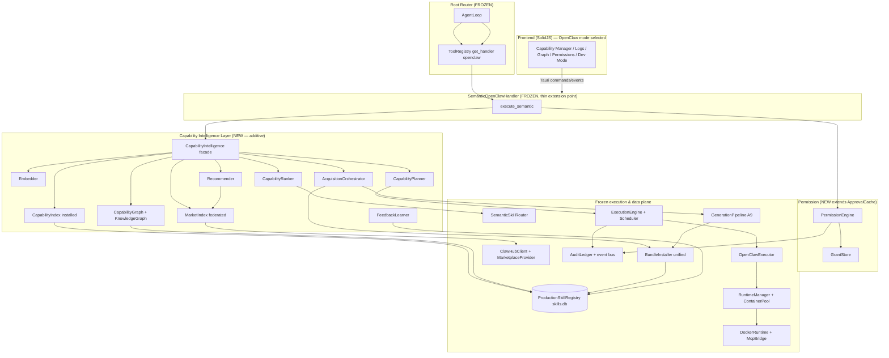
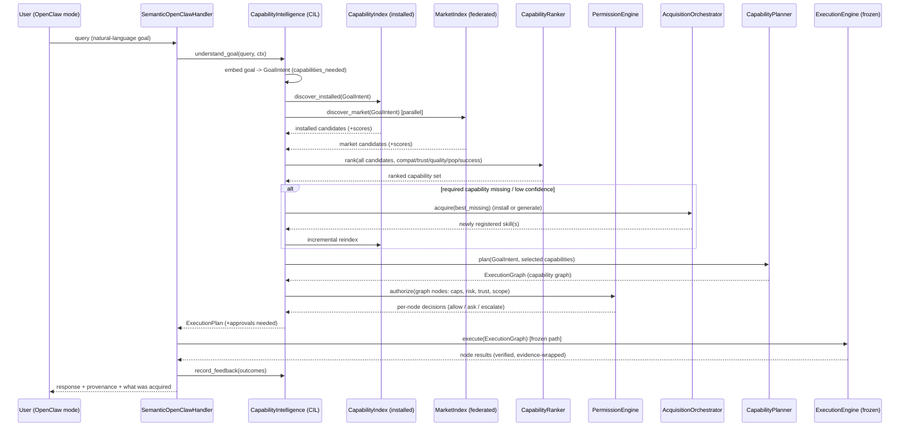
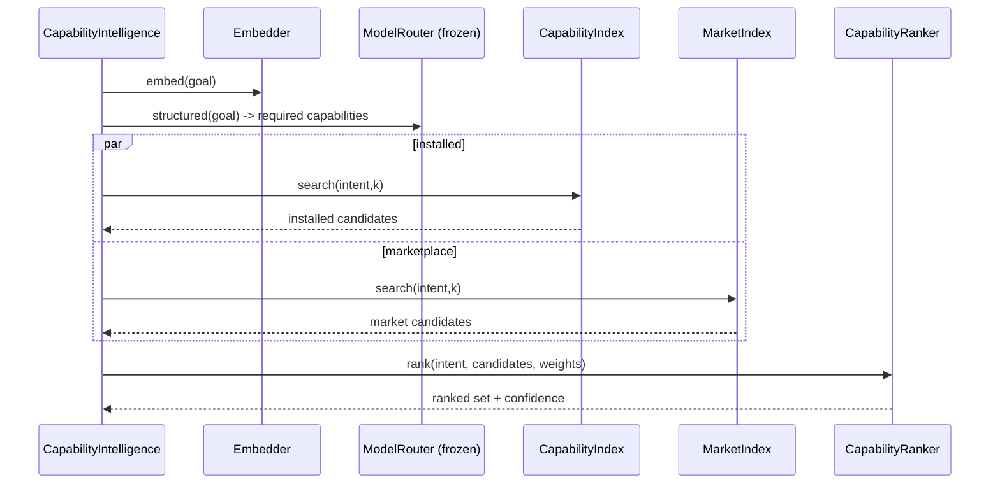
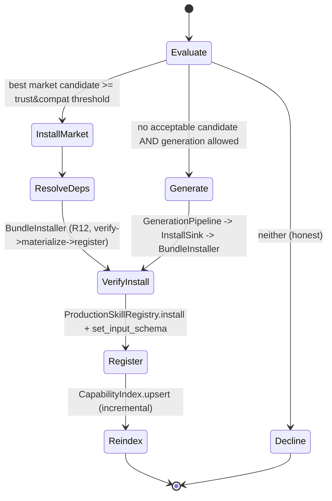
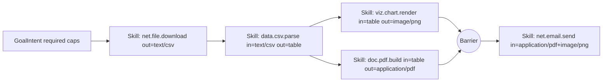
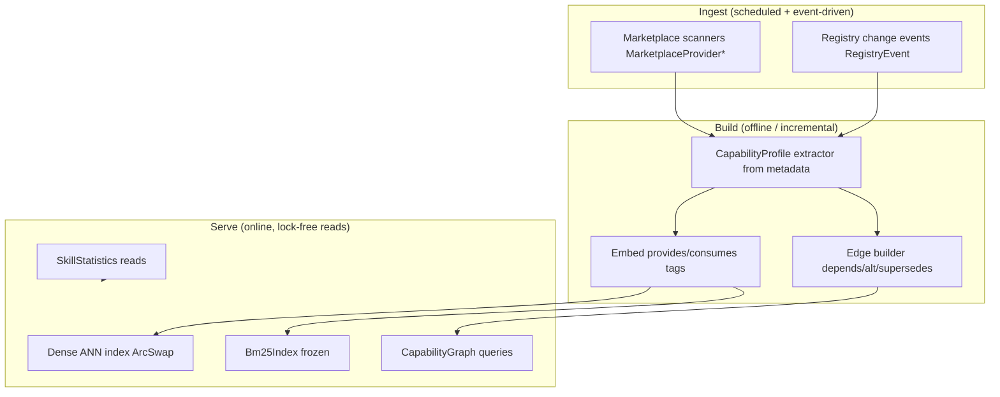
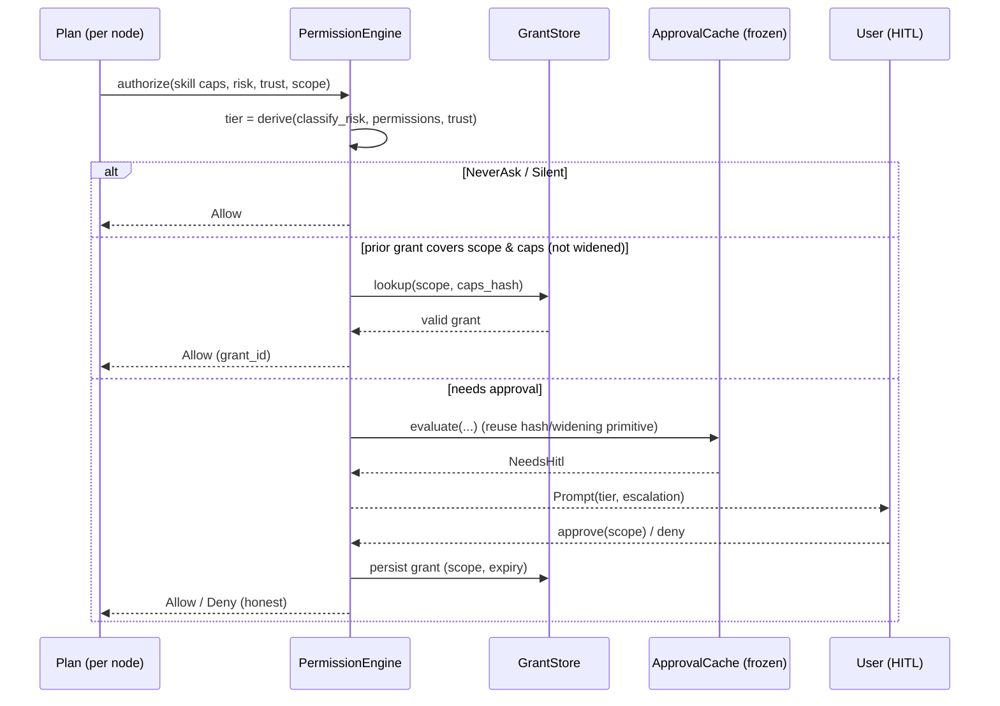
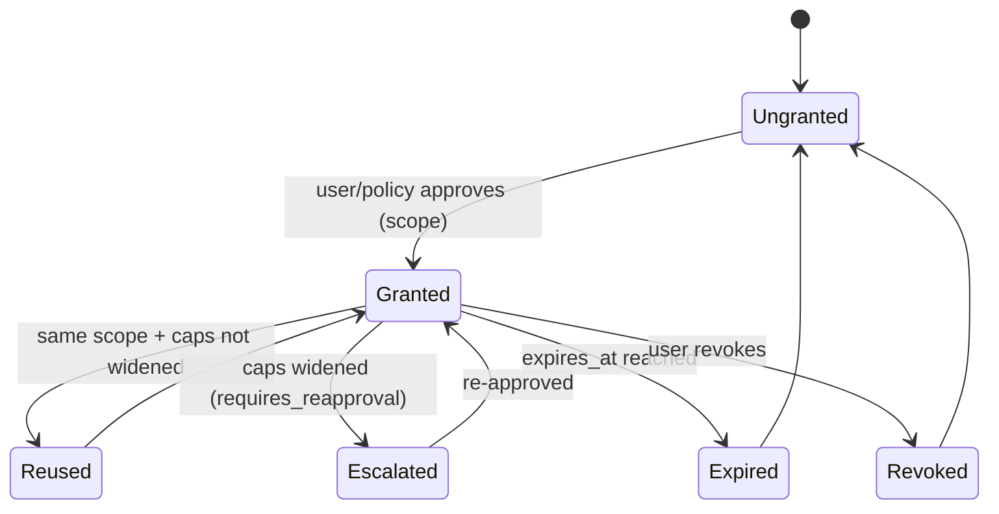

# Design Document: OpenClaw Intelligent Capability Platform (ICP)

> **Spec type:** Feature · **Workflow:** Design-first (Design → Requirements → Tasks) · **Phase:** Design
> **Scope note:** This document is a design/planning artifact only. No code is modified in this phase.
> **Language:** Rust (KRIA `kria-core`) for all traits, contracts, and schemas; SolidJS/TypeScript sketches for frontend contracts. Mermaid for diagrams.

## 0. Grounding — Current Implementation (Phase 0, verified this session)

This design **extends** the frozen OpenClaw architecture (A0–A9). It does **not** redesign or duplicate any
existing component. Every symbol below was read directly from the codebase this session and is the anchor
for the extension it maps to.

### 0.1 The path a chat request takes today (verified)

```
Root Router (agent::loop_engine::AgentLoop)
  └─ ToolRegistry::get_handler("openclaw")  →  SemanticOpenClawHandler::execute_semantic   [handler.rs]
       ├─ create_routing_intent(tool_name, params)               → RoutingIntent
       ├─ SemanticSkillRouter::route(intent)                      [semantic_router.rs]
       │     └─ ProductionSkillRegistry::get_enabled_skills()     [registry.rs]  (fresh read, no cache)
       │        → filter_by_capabilities → filter_by_resources → rank_semantically → make_decision
       ├─ trust_runtime::current()                               [trust_runtime.rs]  (hot TrustConfig)
       ├─ ApprovalCache::evaluate(...)                            [approval.rs]  (keyed by RiskLevel + capability widening)
       ├─ resolve_arguments(selected_skill, params)              [handler.rs → arg_gen.rs]
       │     └─ arg_gen::generate_arguments(backend, schema, request, 3)  (LLM chat_structured + validate/repair)
       ├─ LaunchSpec { grants, mounted_skill_dir, ... }          → DockerRuntime::execute   [runtime/docker.rs]
       │     └─ McpBridge (Content-Length framed JSON-RPC, tools/call)  [bridge.rs]
       ├─ SemanticSkillRouter::record_feedback(...)              (success/latency → registry stats)
       └─ EvidenceWrapper::wrap(...)                              [sanitizer.rs]  → chat
```

### 0.2 Frozen components (source of truth to EXTEND, never fork)

| Frozen component | Real symbol(s) | File |
|---|---|---|
| Root Router | `agent::loop_engine::AgentLoop`, `ToolRegistry` | `agent/loop_engine/`, `tools/registry.rs` |
| Semantic handler | `SemanticOpenClawHandler` (`execute_semantic`, `create_routing_intent`, `resolve_arguments`) | `openclaw/handler.rs` |
| Semantic router | `SemanticSkillRouter` (`route`, `filter_by_capabilities`, `rank_semantically`, `record_feedback`), `RoutingIntent`, `RoutingContext`, `RoutingDecision`, `SkillCandidate`, `RouterConfig` | `openclaw/semantic_router.rs` |
| Registry (single source of truth) | `ProductionSkillRegistry`, `SkillMetadata`, `SkillState`, `DiscoverySource`, `SkillQuery`, `SkillStatistics`, `RegistryEvent`, `MIGRATIONS`/`SCHEMA_VERSION` | `openclaw/registry.rs` |
| Fast pre-filter / index | `CapabilityResolver`, `SkillIndex` (`ArcSwap`), `SkillSnapshot`, `Bm25Index`, `IntentClassifier`, `SkillMatch` | `openclaw/resolver.rs` |
| Argument generation | `arg_gen::{generate_arguments, validate_against_schema, schema_expects_arguments}` | `openclaw/arg_gen.rs` |
| Approval gate | `ApprovalCache`, `ApprovalDecision`, `ApprovalToken` | `openclaw/approval.rs` |
| Capability model | `Capability`, `CapabilityKind`, `CapabilityMode`, `CapabilityScope`, `CapabilityGrant`, `GrantSource`, `Materialization`, `classify_risk`, `requires_reapproval`, `capabilities_of` | `openclaw/capability.rs` |
| Trust (A8) | `TrustFramework`, `PublisherRegistry`, `trust_runtime::current`/`TrustConfig` | `openclaw/platform/`, `openclaw/trust_runtime.rs` |
| Runtime manager (A4) | `RuntimeManager`, `RuntimeContainer`, `ContainerState`, `WarmPoolConfig`, `RuntimeScheduler`, `HealthMonitor`, `RecoverySystem` | `openclaw/runtime_manager.rs` |
| Container pool / runtime (A1) | `ContainerPool`, `DockerRuntime`, `RuntimeRegistry`, `LaunchSpec` | `openclaw/pool.rs`, `openclaw/runtime/` |
| MCP bridge | `McpBridge`, `McpToolDef` (`inputSchema` alias) | `openclaw/bridge.rs` |
| Marketplace / ClawHub (A6-mkt) | `ClawHubClient` (`fetch_remote_index`, `search_remote`, `download_skill_manifest`), `RemoteSkillEntry`, `DomainValidator`, `ClawHubError`, `transpiler::transpile_skill` | `openclaw/clawhub.rs`, `openclaw/transpiler.rs` |
| Unified installer | `BundleInstaller` (`install`), bundle verify/sign | `openclaw/bundle/`, `openclaw/materialize.rs` |
| Execution Engine (A7) | `ExecutionEngine`, `ExecutionScheduler`, `Executor` trait, `ExecutorRegistry`, `ExecutorKind`, `ExecutionGraph`, `GraphNode`, `NodeKind`, `planner::{Goal, plan}`, `DependencyResolver`, `RecoveryManager`, `OpenClawExecutor`, `openclaw_executor_from_pool`, `SkillRuntime` | `execution/` |
| Generation (A9) | `GenerationPipeline`, `InstallSink`, `PipelineOutcome`, `PipelineConfig`, `SkillGenerator`, `SandboxTester`, `SkillDesign` | `openclaw/generation/` |
| Audit / events | `AuditLedger`, `openclaw::event`, `openclaw::events`, `revocation.rs`, `admission.rs` | `openclaw/audit.rs`, `openclaw/event*.rs` |
| Desktop surface | `commands/openclaw.rs` (`openclaw_get_settings`, `openclaw_update_settings`, `openclaw_substrate_status`, `clawhub_install_skill`, `install_skill_bundle`) | `kria-desktop/src/commands/openclaw.rs` |

### 0.3 Known gaps this design must close (from the production-validation effort, real findings)

1. **Permission prompts too frequent** — `ApprovalCache` keyed only by `RiskLevel` + capability widening; no per-session / per-workspace / persistent tiers; no "never ask" for pure GREEN skills as a first-class concept.
2. **No capability graph / multi-skill planning** — `execution/` has a generic `ExecutionEngine` + `planner::Goal`, but nothing composes a multi-capability plan from a user goal; `NodeKind::Subgraph` has no dispatch.
3. **No marketplace intelligence** — `ClawHubClient` fetches a flat `index.json`; no indexing, no embeddings, no cross-marketplace federation, no version/deprecation awareness.
4. **Keyword-only discovery** — `SemanticSkillRouter::calculate_semantic_similarity` is literal word-overlap; `Bm25Index` is lexical. No dense/semantic retrieval over installed **or** marketplace skills.
5. **No recommendations** — nothing proposes "install X to accomplish your goal".
6. **No acquisition-on-miss loop** — router declines when no enabled skill matches; it never searches the marketplace or triggers A9 generation inline.
7. **A9 not wired to a production entry** — `GenerationPipeline` constructed only in tests; reachable only via a desktop command.
8. **Frontend lacks** capability manager, execution logs, developer mode, capability-graph view.
9. **No push-based UI sync**; **no migration framework beyond additive column adds** (mitigated by `MIGRATIONS`).

---

## Overview

OpenClaw ICP transforms OpenClaw from a **tool-execution layer** into an **Intelligent Capability Platform**:
once the user has manually selected OpenClaw Tool Mode, OpenClaw reasons in **goals, not skill names**. It
understands the goal, discovers capabilities across installed + marketplace + generated sources, ranks them
by compatibility/trust/quality, **acquires** what is missing (install from marketplace or generate via A9),
**plans** multi-capability compositions as a capability graph, generates schema-valid arguments, applies an
**intelligent tiered permission model**, executes through the **frozen** runtime, verifies, responds, and learns.

The design introduces exactly one new conceptual subsystem — the **Capability Intelligence Layer (CIL)** — plus
a set of thin, additive extensions to existing frozen components. The CIL is the "brain" that sits between the
Root Router's OpenClaw entry and the frozen router/engine/registry; it is entirely **data/metadata/schema/registry-driven**
with **no hardcoded skill names, prompts, capability mappings, or per-category branches**.

**North-star invariant (applied to every decision in this document):**
> Will this still work with 10,000+ capabilities across hundreds of categories, multiple marketplaces,
> generated skills, and enterprise/cloud/distributed execution, with **no special-case code**? If not, it is redesigned.

## 2. Hard Constraints (honored throughout)

- **Auto Routing Mode is out of scope.** Everything begins **after** OpenClaw mode is selected. The ICP is only
  active inside the `openclaw` tool handler path.
- **A0–A9 is frozen.** Every new component **extends** a named frozen symbol (see §0.2 and §4). No duplication,
  no re-implementation, no second registry/router/engine/installer.
- **No hardcoding.** No hardcoded prompts, skill names, capability→skill maps, routing tables, or per-category
  branches. All behavior derives from skill metadata, JSON schemas, capability descriptors, embeddings, and
  registry state. New capability *kinds* are data, not code.
- **Scale target:** 10,000+ skills, hundreds of categories, multiple marketplaces, generated skills, enterprise +
  cloud + distributed execution — not today's ~11 skills.

## 3. Guiding Principles

1. **Registry is the only source of truth.** The CIL never introduces a competing store; it adds *derived*
   indexes/materialized views keyed by `skill_id`, rebuildable from `ProductionSkillRegistry` at any time.
2. **Everything is a capability descriptor.** Skills advertise *capabilities* (typed, scoped) — never hardcoded
   category names. Compatibility, planning, permission, and recommendation all operate on descriptors.
3. **Generic abstractions over enumerated cases.** A new capability domain (OCR, GPU, k8s, GUI-automation,
   unknown-future) appears by publishing metadata, not by editing OpenClaw.
4. **Pluggable providers.** Marketplaces, embedding backends, planners, and runtime providers are traits with
   multiple implementations discovered by configuration.
5. **Deny-by-default, escalate-by-evidence.** Permission and trust decisions are pure functions of capability +
   trust + risk metadata (extends `classify_risk` / `ApprovalCache`), never blanket allow/deny.
6. **Honesty invariant.** No fake success, no silent bypass; every stage emits telemetry (extends `AuditLedger`
   + `openclaw::event`).
7. **Reversible, phased rollout.** Every extension is feature-flagged; flag-off = byte-for-byte current behavior.

---

## 4. Component → Frozen-Component Extension Map (no duplication)

Every new module is additive and maps to a frozen owner. This table is the contract that guarantees "extend,
never redesign".

| New (ICP) component | Responsibility | EXTENDS (frozen) | How it stays additive |
|---|---|---|---|
| `cil::CapabilityIntelligence` (facade) | Orchestrates discover→rank→acquire→plan for a goal | wraps `SemanticSkillRouter` + `ProductionSkillRegistry` | Called only from `SemanticOpenClawHandler::execute_semantic`; router/registry APIs unchanged |
| `cil::index::CapabilityIndex` | Semantic + lexical index over **installed** skills | reuses `resolver::SkillIndex`/`Bm25Index`/`SkillSnapshot`; adds dense vectors | New ArcSwap snapshot rebuilt from registry; no new source of truth |
| `cil::market::MarketIndex` | Indexed, embedded, **federated** marketplace catalog | wraps `ClawHubClient`; adds `MarketplaceProvider` trait | New read-side cache table; `clawhub.rs` fetch path untouched |
| `cil::embed::Embedder` (trait) | Text→vector for skills, goals, capabilities | reuses KRIA `memory::embeddings` (FastEmbed/ONNX) | Trait; default impl delegates to existing embedder |
| `cil::graph::CapabilityGraph` | Capability + Knowledge Graph (deps, alternatives, provides/requires) | derived from `SkillMetadata.dependencies`/`capabilities` | Materialized view; rebbuildable; no registry schema fork |
| `cil::rank::CapabilityRanker` | Multi-signal ranking (compat/trust/quality/popularity/success) | extends `SemanticSkillRouter` scoring weights | Router keeps its pipeline; ranker is injected scorer |
| `cil::acquire::AcquisitionOrchestrator` | Install-if-missing / generate-if-missing | drives `BundleInstaller` (R12) + `GenerationPipeline` (A9) | Uses existing installer & pipeline; adds no 2nd install path |
| `cil::plan::CapabilityPlanner` | Goal → capability graph → `ExecutionGraph` | emits `execution::ExecutionGraph` via `planner::Goal` | Produces the frozen graph type; engine unchanged |
| `perm::PermissionEngine` | Tiered intelligent permission decisions | extends `ApprovalCache` + `capability::classify_risk` | Superset decision; `ApprovalCache` remains the cache primitive |
| `perm::GrantStore` | Persistent per-scope grants (session/workspace/persistent) | new tables in `skills.db` via additive `MIGRATIONS` | Additive columns/tables only; forward-only |
| `cil::recommend::Recommender` | "I don't have X; here are candidates" | reads `MarketIndex` + `CapabilityGraph` | Pure read; returns suggestions to handler |
| `cil::learn::FeedbackLearner` | Update success/quality/popularity stats | extends `SemanticSkillRouter::record_feedback` + `SkillStatistics` | Writes existing stats tables |
| Desktop: capability manager, logs, dev-mode, graph view | UI surfaces | new Tauri commands in `commands/openclaw.rs` | New commands + events only; existing command names preserved |

---

## Architecture



The CIL is **advisory + orchestration**: it decides *what* to run and *whether to acquire*, then hands a
frozen `ExecutionGraph` to the frozen `ExecutionEngine`. It never touches containers directly.

## 6. Capability Flow (goal → response) — sequence



---

## Data Models

All types are additive Rust in a new `openclaw::cil` module tree. They are **derived** from `SkillMetadata`
and never become a second source of truth.

### 7.1 Capability descriptor (generic, extensible — the anti-hardcoding primitive)

The existing `capability::Capability` (`kind`, `mode`, `scope`) describes a *permission*. ICP adds a
**semantic capability descriptor** that describes *what a skill can do*, expressed as open, namespaced tags —
never a closed enum of categories.

```rust
/// A semantic capability a skill PROVIDES or a goal REQUIRES.
/// `id` is a namespaced, open string (e.g. "io.file.read", "media.image.ocr",
/// "doc.pdf.render", "net.email.send"). New domains = new strings = zero code.
#[derive(Debug, Clone, PartialEq, Eq, Serialize, Deserialize)]
pub struct CapabilityTag {
    /// Reverse-DNS-style capability id. Open vocabulary; NOT an enum.
    pub id: String,
    /// Optional structured qualifiers (e.g. {"format":"pdf"}), matched structurally.
    #[serde(default)]
    pub qualifiers: serde_json::Map<String, serde_json::Value>,
    /// Optional dense embedding of the tag (lazily computed, cached).
    #[serde(skip_serializing_if = "Option::is_none")]
    pub embedding: Option<Vec<f32>>,
}

/// A skill's advertised capability profile — derived from its manifest/metadata.
/// This is a VIEW over SkillMetadata; it is never the authoritative store.
#[derive(Debug, Clone, Serialize, Deserialize)]
pub struct CapabilityProfile {
    pub skill_id: String,
    /// What this skill provides (semantic tags).
    pub provides: Vec<CapabilityTag>,
    /// What this skill needs from other skills to be useful (composition edges).
    pub consumes: Vec<CapabilityTag>,
    /// Permission capabilities it will request at runtime (frozen capability::Capability).
    pub permissions: Vec<crate::openclaw::capability::Capability>,
    /// I/O contract for composition: MIME/type tags in and out (open strings).
    pub inputs: Vec<String>,
    pub outputs: Vec<String>,
}
```

> **Anti-hardcoding proof:** filesystem/image/video/audio/pdf/office/compression/db/git/terminal/OCR/vision/
> browser/OAuth/email/cloud/docker/k8s/GPU/AI-models/GUI-automation/**future-unknown** are all just `CapabilityTag.id`
> strings supplied by skill metadata. Adding OCR support = a skill publishes `provides: ["media.image.ocr"]`.
> OpenClaw contains zero branches on any of these.

### 7.2 Goal intent (goal → needed capabilities)

```rust
/// The parsed, embedded representation of a user's goal. Produced generically
/// via the configured LLM + embedder — NO keyword tables, NO category rules.
#[derive(Debug, Clone)]
pub struct GoalIntent {
    pub raw: String,
    pub goal_embedding: Vec<f32>,
    /// Capabilities the goal appears to require, each with confidence.
    pub required: Vec<(CapabilityTag, f32)>,
    /// Whether the goal likely needs composition (multi-capability).
    pub composite: bool,
    pub max_risk: crate::safety::RiskLevel,
}
```

### 7.3 Candidate + ranked result

```rust
#[derive(Debug, Clone)]
pub enum CandidateSource {
    Installed,                       // in ProductionSkillRegistry, enabled
    Marketplace { provider_id: String, entry: super::market::RemoteRef },
    Generatable,                     // no match; A9 could synthesize it
}

#[derive(Debug, Clone)]
pub struct CapabilityCandidate {
    pub capability: CapabilityTag,
    pub skill_ref: Option<String>,   // skill_id if it exists somewhere
    pub source: CandidateSource,
    pub profile: Option<CapabilityProfile>,
    // Ranking signals (each 0.0..=1.0), combined by CapabilityRanker (weights are config).
    pub semantic: f32,               // dense goal↔capability similarity
    pub lexical: f32,                // reuses Bm25Index
    pub compatibility: f32,          // I/O + runtime + dependency fit
    pub trust: f32,                  // reuses SemanticSkillRouter trust scoring + PublisherRegistry
    pub quality: f32,                // validator/quality metadata (A9 quality, marketplace stars)
    pub popularity: f32,             // install/usage counts (SkillStatistics)
    pub success: f32,                // historical success_rate (SkillStatistics)
}
```

### 7.4 Derived tables (additive schema, forward-only via `MIGRATIONS`)

New rows added to `skills.db` as **additive migrations** (following the existing `Migration`/`SCHEMA_VERSION`
pattern in `registry.rs` — `ALTER TABLE ADD COLUMN` / `CREATE TABLE IF NOT EXISTS` only, never drop/rename):

```sql
-- Migration 3: semantic capability profiles (derived view; rebuildable)
CREATE TABLE IF NOT EXISTS capability_profiles (
    skill_id TEXT PRIMARY KEY REFERENCES skills(skill_id) ON DELETE CASCADE,
    provides_json TEXT NOT NULL DEFAULT '[]',
    consumes_json TEXT NOT NULL DEFAULT '[]',
    inputs_json   TEXT NOT NULL DEFAULT '[]',
    outputs_json  TEXT NOT NULL DEFAULT '[]',
    embedding     BLOB,                    -- f32 vector, nullable
    profile_epoch INTEGER NOT NULL DEFAULT 0
);

-- Migration 4: marketplace catalog cache (federated read model)
CREATE TABLE IF NOT EXISTS market_catalog (
    provider_id TEXT NOT NULL,
    slug        TEXT NOT NULL,
    manifest_json TEXT NOT NULL,
    version     TEXT NOT NULL,
    embedding   BLOB,
    trust_hint  TEXT,
    quality     REAL,
    popularity  REAL,
    deprecated  INTEGER NOT NULL DEFAULT 0,
    fetched_at  TEXT NOT NULL,
    PRIMARY KEY (provider_id, slug)
);

-- Migration 5: persistent permission grants (tiered)
CREATE TABLE IF NOT EXISTS capability_grants_scoped (
    grant_id     TEXT PRIMARY KEY,
    skill_id     TEXT NOT NULL,
    scope_kind   TEXT NOT NULL,     -- never | once | session | workspace | persistent
    scope_key    TEXT,              -- session id / workspace id / null
    caps_hash    TEXT NOT NULL,     -- ApprovalCache::compute_hash payload
    risk         TEXT NOT NULL,
    decision     TEXT NOT NULL,     -- allow | deny
    granted_at   TEXT NOT NULL,
    expires_at   TEXT,              -- null = no expiry
    revoked      INTEGER NOT NULL DEFAULT 0
);
CREATE INDEX IF NOT EXISTS idx_grants_skill ON capability_grants_scoped(skill_id);

-- Migration 6: capability graph edges (derived; rebuildable from metadata)
CREATE TABLE IF NOT EXISTS capability_edges (
    from_skill TEXT NOT NULL,
    to_skill   TEXT NOT NULL,
    edge_kind  TEXT NOT NULL,       -- depends | provides_for | alternative | supersedes
    weight     REAL NOT NULL DEFAULT 1.0,
    PRIMARY KEY (from_skill, to_skill, edge_kind)
);
```

> Every derived table is **rebuildable** from `skills` + marketplace fetch. Corruption/version drift is
> recovered by a full reindex, never by manual repair. This keeps "registry is the only source of truth" true.

---

## Components and Interfaces

All CIL boundaries are traits so backends (embedders, marketplaces, planners, rankers) are pluggable and
scale-testable. Default impls delegate to frozen components.

### 8.1 Embedding provider (reuse KRIA embeddings)

```rust
#[async_trait]
pub trait Embedder: Send + Sync {
    async fn embed(&self, text: &str) -> Result<Vec<f32>, CilError>;
    async fn embed_batch(&self, texts: &[String]) -> Result<Vec<Vec<f32>>, CilError>;
    fn dim(&self) -> usize;
    fn model_id(&self) -> &str;      // for cache invalidation on model change
}
// Default impl wraps crate::memory::embeddings (FastEmbed/ONNX) — no Python required.
```

### 8.2 Marketplace provider (federation, multi-marketplace)

```rust
/// One marketplace. ClawHub is the first impl; enterprise/private repos plug in
/// with NO new installer path (ties to R12 unified installer).
#[async_trait]
pub trait MarketplaceProvider: Send + Sync {
    fn provider_id(&self) -> &str;
    async fn sync_index(&self) -> Result<Vec<MarketEntry>, CilError>;
    async fn fetch_manifest(&self, slug: &str) -> Result<String, CilError>;
    fn trust_hint(&self, entry: &MarketEntry) -> crate::openclaw::types::TrustTier;
}

/// ClawHub adapter — wraps the FROZEN ClawHubClient (fetch_remote_index /
/// search_remote / download_skill_manifest) unchanged.
pub struct ClawHubProvider { inner: crate::openclaw::clawhub::ClawHubClient }
```

### 8.3 Capability index (installed) — extends `resolver::SkillIndex`

```rust
pub struct CapabilityIndex {
    lexical: crate::openclaw::resolver::SkillIndex, // FROZEN Bm25 + ArcSwap snapshot
    dense: ArcSwap<DenseIndex>,                     // NEW: HNSW/flat vectors over provides-tags
    embedder: Arc<dyn Embedder>,
}
impl CapabilityIndex {
    /// Rebuilt from ProductionSkillRegistry::get_enabled_skills() — same source of truth.
    pub async fn rebuild(&self, skills: &[SkillMetadata]) -> Result<(), CilError>;
    /// Incremental upsert after an acquisition (avoids full reindex at 10k scale).
    pub async fn upsert(&self, skill: &SkillMetadata) -> Result<(), CilError>;
    pub async fn search(&self, intent: &GoalIntent, k: usize) -> Vec<CapabilityCandidate>;
}
```

### 8.4 Ranker — extends `SemanticSkillRouter` scoring

```rust
/// Combines signals into a final score. Weights come from RouterConfig-style
/// config (data, not code). No per-skill or per-category branch.
pub trait CapabilityRanker: Send + Sync {
    fn rank(&self, intent: &GoalIntent, candidates: &mut [CapabilityCandidate], w: &RankWeights);
}
#[derive(Clone)]
pub struct RankWeights {
    pub semantic: f32, pub lexical: f32, pub compatibility: f32,
    pub trust: f32, pub quality: f32, pub popularity: f32, pub success: f32,
}
```

### 8.5 Acquisition orchestrator (install-or-generate)

```rust
pub enum AcquisitionOutcome {
    Installed { skill_id: String, provider_id: String },
    Generated { skill_id: String, pipeline: crate::openclaw::generation::PipelineOutcome },
    Declined { reason: String },       // trust/policy/budget/no-candidate — honest, never fake
}

#[async_trait]
pub trait AcquisitionOrchestrator: Send + Sync {
    /// Try marketplace install first (best candidate above trust/compat threshold),
    /// else fall back to A9 generation, else Declined. BOTH paths converge on the
    /// FROZEN BundleInstaller (R12) and register into ProductionSkillRegistry.
    async fn acquire(
        &self,
        need: &CapabilityTag,
        ranked: &[CapabilityCandidate],
        ctx: &AcquireContext,
    ) -> Result<AcquisitionOutcome, CilError>;
}
```

### 8.6 Planner — emits the FROZEN `ExecutionGraph`

```rust
/// Turns a goal + selected capabilities into a capability graph, expressed
/// entirely as the frozen execution::ExecutionGraph (Skill nodes + Barrier/Merge/
/// Wait). The frozen ExecutionEngine executes it unchanged.
pub trait CapabilityPlanner: Send + Sync {
    fn plan(
        &self,
        intent: &GoalIntent,
        selected: &[CapabilityCandidate],
        graph_view: &CapabilityGraph,
    ) -> Result<crate::execution::ExecutionGraph, CilError>;
}
```

### 8.7 Permission engine — extends `ApprovalCache`

```rust
#[derive(Debug, Clone, Copy, PartialEq, Eq, Serialize, Deserialize)]
pub enum PermissionTier {
    NeverAsk,        // GREEN pure skills (calculator/markdown/csv/json/regex/hash)
    AskOnce,         // approve first time, remember persistently
    AskPerSession,   // approve for the current chat session
    AskPerWorkspace, // approve for the current workspace
    Persistent,      // standing approval until revoked
    Silent,          // pre-authorized, no prompt (policy-granted)
    Background,      // long-running / worker; approval + progress contract
    AlwaysAsk,       // system-modifying; never remembered
}

#[derive(Debug, Clone)]
pub enum PermissionDecision {
    Allow { tier: PermissionTier, grant_id: Option<String> },
    Prompt { tier: PermissionTier, escalation: RiskEscalation, prompt: PromptSpec },
    Deny { reason: String },
}

pub trait PermissionEngine: Send + Sync {
    /// Pure function of capability set + risk + trust + scope + prior grants.
    /// Delegates the hash/reuse primitive to the FROZEN ApprovalCache and the
    /// risk primitive to the FROZEN capability::classify_risk.
    fn authorize(&self, req: &AuthorizeRequest, grants: &GrantStore) -> PermissionDecision;
    /// Explicit user revocation (any tier). Writes capability_grants_scoped.revoked.
    fn revoke(&self, grant_id: &str, grants: &GrantStore) -> Result<(), CilError>;
}
```

> **Tier assignment is metadata-driven, not a rule table.** A skill's tier is computed from its
> `classify_risk(granted)` + `CapabilityProfile.permissions` + trust tier. GREEN + pure (no fs/net/subprocess
> capability) ⇒ `NeverAsk`. fs/browser/shell/git/network ⇒ context-dependent (`AskPerSession`/`AskPerWorkspace`).
> System-modifying (writes outside workspace, subprocess-with-host-scope, RED risk) ⇒ `AlwaysAsk`. There is no
> `if skill == "..."` anywhere.

### 8.8 CIL facade (single entry from the handler)

```rust
pub struct CapabilityIntelligence {
    index: Arc<CapabilityIndex>,
    market: Arc<MarketIndex>,
    graph: Arc<CapabilityGraph>,
    ranker: Arc<dyn CapabilityRanker>,
    acquire: Arc<dyn AcquisitionOrchestrator>,
    planner: Arc<dyn CapabilityPlanner>,
    permission: Arc<dyn PermissionEngine>,
    recommender: Arc<Recommender>,
    learner: Arc<FeedbackLearner>,
    registry: Arc<ProductionSkillRegistry>,   // FROZEN — read-through only
    cfg: CilConfig,                            // flags + weights + thresholds (data)
}

impl CapabilityIntelligence {
    /// The single method SemanticOpenClawHandler::execute_semantic calls when
    /// the ICP flag is ON. Flag-OFF: handler uses the current direct router path.
    pub async fn fulfill(&self, query: &str, ctx: &RequestCtx)
        -> Result<Fulfillment, CilError>;
}

pub enum Fulfillment {
    /// A single-skill plan (today's common case) — 1-node ExecutionGraph.
    Plan(crate::execution::ExecutionGraph, Vec<PermissionDecision>),
    /// Nothing installed matches; here are ranked options to install/generate.
    Recommend(Vec<Recommendation>),
    /// Honest decline (out of scope for OpenClaw / native tool better).
    Decline { reason: String },
}
```

---

## 9. Phase A — Intelligent Capability Discovery

**Objective:** goal → intent → discover (installed + marketplace) → rank → compatibility → selection →
install-if-needed → execute → learn. Generic and scale-safe.

**Contract:** `CapabilityIntelligence::fulfill` runs stages 1–4 below; stages 5–7 are §10/§11 and the frozen
engine.

1. **Understand goal** — `Embedder::embed(query)` + one LLM structured call producing `GoalIntent.required`
   (open `CapabilityTag`s, confidences). No keyword tables. Reuses `arg_gen`'s structured-output discipline.
2. **Discover installed** — `CapabilityIndex::search(intent)` fuses dense (new) + `Bm25Index` (frozen) over
   `provides` tags of `get_enabled_skills()`.
3. **Discover marketplace** — `MarketIndex::search(intent)` over the federated `market_catalog` (all
   `MarketplaceProvider`s), embedded offline at sync time. Runs in parallel with (2).
4. **Rank + compatibility** — `CapabilityRanker::rank` combines semantic/lexical/compat/trust/quality/pop/success.
   Compatibility = I/O type fit (`inputs`/`outputs`), runtime requirements vs `RuntimeManager` availability,
   dependency satisfiability (`CapabilityGraph`).



**Scale note (10k+):** installed search is ANN over the dense index (sub-linear) + BM25 (frozen, already
benchmarked at ~11ms/1000 skills). Marketplace search is over a **pre-embedded local cache**, never a live
per-query fetch. Sync is incremental (ETag/`fetched_at`).

## 10. Phase B — Intelligent Capability Acquisition

**Objective:** when a required capability is missing or below threshold: evaluate marketplace candidates
(trust/compat/dependency), install (unified installer) → register → execute; **else** reuse-and-extend A9
generation. Persist result.



**Key rules:**
- **One installer.** Both marketplace and generated skills converge on the frozen `BundleInstaller`
  (satisfies R12). No second install path is created.
- **Dependency resolution** uses `CapabilityGraph` edges (`depends`) + `SkillMetadata.dependencies`; missing
  deps are themselves recursively acquired (bounded depth, cycle-checked via `DependencyResolver`).
- **A9 reuse** — `GenerationPipeline` already returns `PipelineOutcome::Reused` when a similar skill exists;
  ICP passes the installed set so generation prefers reuse over synthesis.
- **Trust gate at acquisition** — `PublisherRegistry` / `TrustFramework` is consulted **before** install
  (closes the "revocation not wired to install" finding): a revoked publisher's skills are never acquired.
- **Honesty** — `Declined` is returned truthfully; never a fake install.

## 11. Phase C — Multi-Capability Planning (capability graph)

**Objective:** compose multiple capabilities into a plan (e.g. *download CSV → parse → chart → PDF → email*).
Capability-driven, not prompt-driven. Emits the **frozen** `execution::ExecutionGraph`.

**Approach:** `CapabilityPlanner` performs **type-directed composition**: it matches each required capability's
`outputs` to the next capability's `inputs`, builds a DAG of `NodeKind::Skill` nodes with dependency edges,
inserts frozen `Barrier`/`Merge`/`Wait` structural nodes for fan-in/fan-out, and hands it to
`ExecutionEngine::execute`. The planner is generic: it never encodes the CSV/chart/PDF example — it composes
whatever capability I/O types connect.



- Composition edges come from `CapabilityProfile.inputs/outputs` — pure data.
- Cycles/missing executors are rejected by the frozen `DependencyResolver::validate` before execution.
- Each node's arguments are produced by the frozen `arg_gen` at execution time (schema-driven).
- Partial failure/retry/cancel is handled by the frozen `ExecutionScheduler` + `RecoveryManager`.
- `NodeKind::Subgraph` (currently a no-op) is a candidate future extension for nested plans; ICP does **not**
  rely on it initially (flagged in Decision Log).

## 12. Phase D — Intelligent Recommendations

**Objective:** when the goal needs a capability the user lacks, recommend candidates ranked by
metadata/compat/popularity/quality/trust/deps/success. Example surfaced to the user:
*"I don't have OCR installed. I found 3 candidates on ClawHub; the best is `oc_ocr_tesseract` (Verified, 4.6★,
1.2k installs, 98% success). Install it?"*

```rust
pub struct Recommendation {
    pub capability: CapabilityTag,
    pub candidate: CapabilityCandidate,
    pub rationale: String,          // generated from real signals, not templated skill names
    pub install_action: AcquireContext,
    pub alternatives: Vec<CapabilityCandidate>,
}
```

- Recommendations are **pure reads** over `MarketIndex` + `CapabilityGraph`; nothing is installed without
  explicit user (or policy) approval.
- The rationale is assembled from real ranking signals — no hardcoded copy per skill/category.
- Alternatives (`edge_kind = alternative`) and successors (`supersedes`) come from the capability graph.

## 13. Phase E — Capability Intelligence Layer (the durable core)

The CIL is the scalable home for: marketplace scanning, capability indexing, embeddings, the Capability Graph +
Knowledge Graph, semantic retrieval, version awareness, deprecation, alternatives, and usage/success/failure
statistics.



- **Version + deprecation awareness:** `market_catalog.version`/`deprecated`; `capability_edges.supersedes`
  drives "a newer skill replaces this" recommendations.
- **Learning:** `FeedbackLearner` extends `SemanticSkillRouter::record_feedback` → updates `SkillStatistics`
  (`success_rate`, `usage_count`, latency); these feed the ranker's `popularity`/`success` signals, closing
  the discover→execute→learn loop.
- **Rebuildability:** every served structure is a materialized view; a version bump or model change triggers a
  background reindex without downtime (ArcSwap swap).

---

## 14. Permission System Redesign

### 14.1 Tier model (metadata-driven)

| Tier | When (derived, not hardcoded) | Prompt? | Remembered |
|---|---|---|---|
| `NeverAsk` | `classify_risk == Green` AND no fs/net/subprocess/browser permission | no | n/a |
| `AskOnce` | Low-elevation caps, stable skill | first time | persistent |
| `AskPerSession` | fs-read / network-scoped / browser | per chat session | session |
| `AskPerWorkspace` | fs-write within workspace, git | per workspace | workspace |
| `Persistent` | user chose "always allow" | until revoked | persistent |
| `Silent` | policy/enterprise pre-authorization | no | policy |
| `Background` | long-running worker / GPU / automation | approve + progress | session/persistent |
| `AlwaysAsk` | RED risk, system modification, host-scope subprocess | every time | never |
| `Revocation` | user revokes any grant | — | clears grant |
| `RiskEscalation` | widened caps vs prior grant (`requires_reapproval`) | re-prompt | supersedes prior |

GREEN pure skills named in the mission (calculator/markdown/csv/json/regex/hash) satisfy the `NeverAsk`
predicate **by their metadata**, not by name-matching.

### 14.2 Permission flow



### 14.3 Grant lifecycle



The frozen `ApprovalCache` remains the in-process hash/widening primitive; `GrantStore` adds durable, scoped,
revocable persistence. `execute_semantic`'s current `evaluate(...)` call is replaced by
`PermissionEngine::authorize`, which delegates to `ApprovalCache` for the widening check — the frozen behavior
is a strict subset.

---

## 15. Frontend Evolution (analyze; build only what's required)

Add capabilities to the OpenClaw Settings surface (`kria-desktop/commands/openclaw.rs` + SolidJS views). New
Tauri commands/events only; **existing command names preserved** (frontend/backend contract rule).

| Surface | Genuinely required? | Backing (frozen/new) |
|---|---|---|
| Capability Manager (goals view of installed capabilities) | Yes — core to the goal-centric model | `CapabilityIndex` + `capability_profiles` |
| Installed Skills (enable/disable/uninstall) | Exists; keep | `ProductionSkillRegistry` |
| Marketplace browse + install | Exists; enrich with search/embeddings | `MarketIndex` |
| Updates / Deprecations | Yes — version awareness | `market_catalog.version/deprecated` |
| Dependencies view | Yes — needed for multi-cap trust | `capability_edges` |
| Trust Levels | Yes | `PublisherRegistry`/`TrustFramework` |
| Permission Management (grants, revoke) | Yes — central to redesign | `GrantStore` |
| Developer Mode (gate not-ready features) | Yes — required by honesty invariant (R15) | new config flag |
| Execution Logs | Yes — no OpenClaw log surface exists today | `AuditLedger` + `openclaw::event` |
| Capability Graph view | Yes — visualize compositions | `CapabilityGraph` |
| Runtime/Container Status | Exists (`openclaw_substrate_status`); keep | `RuntimeManager` |
| Compatibility View | Optional (fold into Capability Manager) | derived |
| Generated Skills view | Yes — provenance visibility | `DiscoverySource::Generated` |

**Push-based sync** (closes the "no push sync" finding): a desktop bridge subscribes to the frozen
`openclaw::event` + `RegistryEvent` streams and `app_handle.emit`s to the UI; the UI reconciles via poll on
missed events (eventual consistency).

---

## 16. Skill Compatibility — generic capability abstractions (NEVER per-category code)

Compatibility across filesystem/images/video/audio/pdf/office/compression/archives/db/git/terminal/programming/
OCR/vision/browser/OAuth/email/cloud/docker/k8s/GPU/AI-models/document-processing/automation/background-workers/
GUI-automation/**future-unknown** is expressed **entirely** through three generic mechanisms:

1. **`CapabilityTag` open vocabulary** — every domain is a namespaced string in `provides`/`consumes`.
2. **I/O type tags** (`inputs`/`outputs`) — composition and compatibility are type matching, not category logic.
3. **Runtime requirements** (`SkillMetadata.runtime_requirements` + `ResourceClass` + `capability::Capability`)
   — GPU/host/network needs are matched against `RuntimeManager` availability generically.

A brand-new capability domain (say, `quantum.circuit.simulate`) requires **zero** OpenClaw changes: a skill
publishes the tag, gets embedded, indexed, ranked, planned, and permission-classified by the same code paths.

---

## 17. Mandatory Architecture-Review Process

This design was produced iteratively. Each iteration records the state, the self-critique, and the resulting change.

### Iteration 1 — Initial architecture → self-critique

**Initial:** put discovery/ranking/acquisition/planning logic directly inside `SemanticOpenClawHandler` and
`SemanticSkillRouter`; add marketplace embeddings inline in `clawhub.rs`; key permissions off a new enum.

**Self-critique:**
- *Duplication / bloat:* stuffing logic into the handler/router violates the frozen-component rule and makes
  `semantic_router.rs` a god-object. **Weakness.**
- *Scalability:* inline marketplace fetch-per-query does not scale past a handful of skills. **Fails at 100+.**
- *Hidden assumption:* assumed one marketplace (ClawHub). Multi-marketplace was unaddressed. **Missing abstraction.**
- *Maintainability:* permission enum with hardcoded skill lists = exactly the per-category code we forbade.
- *Missing abstractions:* no embedder trait, no marketplace trait, no capability descriptor — everything
  keyed off `category: String`.

### Iteration 2 — Improvements → re-critique

**Improvements:** extracted a dedicated `cil` module (facade + traits); introduced `CapabilityTag` open
vocabulary; made `Embedder`/`MarketplaceProvider`/`CapabilityRanker`/`CapabilityPlanner`/`PermissionEngine`
traits; moved permissions to metadata-derived tiers.

**Re-critique:**
- *Source-of-truth risk:* new tables could drift from `skills`. **Resolved** by making all CIL tables *derived
  and rebuildable*, keyed by `skill_id`, never authoritative.
- *Planner coupling:* an ICP-specific plan format would fork the engine. **Resolved** by emitting the frozen
  `execution::ExecutionGraph`.
- *Cold-start:* embeddings for 10k marketplace skills can't be computed per query. **Resolved** by offline
  embedding at sync time into `market_catalog.embedding`.
- *Remaining worry:* incremental index updates after acquisition (full reindex too costly at scale) → added
  `CapabilityIndex::upsert`.

### Iteration 3 — Scale stress-test (100 / 1k / 10k / 100k) → redesign what fails

| Scale | Discovery | Acquisition | Planning | Permissions | Verdict |
|---|---|---|---|---|---|
| 100 | BM25+dense trivial | fine | fine | fine | OK |
| 1k | dense ANN needed; BM25 ~11ms (measured) | dep resolution bounded | DAG small | grant lookups indexed | OK |
| 10k | **flat vector scan too slow** → require ANN (HNSW) + shard by capability namespace | market sync must be incremental (ETag) | composition search must prune by I/O type index | grant table indexed by skill_id | OK after ANN |
| 100k | single-node index RAM pressure; marketplace federation fan-out | generation queue must be bounded (budget) | planner must cap graph breadth/depth | grants partitioned by workspace | **Redesign:** index becomes shardable + optionally externalizable (distributed store behind `CapabilityIndex` trait); marketplace sync becomes provider-parallel with backpressure |

**Redesign outcomes baked in:** `CapabilityIndex` is a trait boundary so an in-process HNSW can be swapped for
a distributed vector store with no caller change; marketplace sync is per-provider concurrent with a bounded
work queue; planner enforces configurable breadth/depth caps.

### Iteration 4 — Principal-engineer review

*"Would Google/OpenAI/Anthropic/Microsoft build this? 5-year survivability? 100s of contributors? 10k+ skills?"*

- **Yes, with these properties:** capability descriptors + typed I/O composition is the same pattern used by
  large tool/skill platforms (open vocabulary, not enums). Trait boundaries allow independent team ownership
  (embeddings team, marketplace team, planner team).
- **Contributor safety:** because there are no per-skill/per-category branches, a contributor adds a skill by
  publishing metadata — they cannot break routing for others. The frozen-component map prevents accidental forks.
- **5-year risk:** the biggest is embedding-model churn → mitigated by `Embedder::model_id` cache invalidation
  and full-reindex rebuildability.
- **Change adopted:** add an explicit `profile_epoch` / `model_id` versioning so index rebuilds are safe and observable.

### Iteration 5 — Production review

- **Performance:** online path is lock-free reads (ArcSwap) + ANN; heavy work (embedding, sync, generation) is
  offline/async. Argument generation reuses the proven `arg_gen` retry/validate loop.
- **Reliability / failure-recovery:** all execution flows through the frozen `ExecutionScheduler` +
  `RecoveryManager` + `RuntimeManager` (leak-tested). Acquisition failures return honest `Declined`.
- **Migration/versioning:** additive `MIGRATIONS` only; `SCHEMA_VERSION` bumped per table. Flag-off parity.
- **Container lifecycle:** unchanged — ICP never touches containers; it only produces graphs.
- **UX/DX:** goal-centric UI + capability manager + logs + dev mode; contributors get trait seams + fixtures.
- **Tech-debt:** the current `SemanticSkillRouter::calculate_semantic_similarity` (word-overlap) is superseded
  by dense retrieval but kept as a fallback when embeddings are unavailable (degraded honesty).
- **Change adopted:** define a **degraded mode** (no embedder / no network): fall back to frozen BM25 + router,
  surfaced honestly in status.

### Iteration 6 — Long-term (10-year) evolution review

- **New runtime providers** (WASM, remote workers, cloud, distributed): already abstracted by the frozen
  `SkillRuntime`/`Executor` traits + `RuntimeRegistry`; ICP planning is provider-agnostic (emits `ExecutorKind`
  tags, engine dispatches).
- **New marketplaces / private / enterprise:** `MarketplaceProvider` trait + federated `market_catalog`.
- **New capability types:** open `CapabilityTag` vocabulary — zero code.
- **New planners:** `CapabilityPlanner` trait — swap type-directed composition for an LLM/HTN planner without
  touching the engine.
- **Cloud/distributed execution + capability graph at fleet scale:** `CapabilityIndex` externalizable;
  `CapabilityGraph` shardable; grants partitioned by workspace/tenant.
- **Generated skills:** already converge on the unified installer + frozen execution path (R12/R13).
- **Conclusion:** the trait seams + open vocabulary + derived-view discipline give a 10-year runway with no
  forced redesign of frozen A0–A9.

---

## 18. Migration Strategy & Backward Compatibility

- **Additive schema only.** New tables/columns via the existing `Migration`/`SCHEMA_VERSION` mechanism in
  `registry.rs`. No drop/rename/rewrite (frozen rule). Bumps: 3 (profiles), 4 (market catalog), 5 (grants), 6 (edges).
- **Feature flag `openclaw_icp_enabled`** (config, default OFF at first ship). Flag-OFF ⇒ `execute_semantic`
  takes the current direct-router path, byte-for-byte. Flag-ON ⇒ handler calls `CapabilityIntelligence::fulfill`.
- **Permission compatibility.** With ICP off, `ApprovalCache` behaves exactly as today. With ICP on, the new
  engine is a strict superset (GREEN still auto-approves; widening still re-prompts).
- **Data backfill.** On first ON boot, a background job builds `capability_profiles` from existing
  `SkillMetadata` (from `input_schema` + `capabilities` + `categories`), embeds them, and builds edges. Until
  it completes, discovery falls back to the frozen router (degraded, honest).
- **Rollback.** Turning the flag off is instant and lossless; derived tables can be dropped and rebuilt.

## 19. Risk Assessment

| Risk | Likelihood | Impact | Mitigation |
|---|---|---|---|
| Embedding model unavailable / drift | Med | Med | `Embedder` trait + degraded BM25 fallback; `model_id` reindex |
| Index/registry drift | Low | High | Derived, rebuildable views; nightly consistency check (extends existing drift finding) |
| Auto-acquisition installs bad/malicious skill | Med | High | Trust gate at acquisition (`PublisherRegistry`), verify (`BundleInstaller`), user/policy approval, `AlwaysAsk` for elevated |
| Permission model too permissive | Low | High | Deny-by-default; `AlwaysAsk` for RED/system-mod; revocation; audit every decision |
| Planner builds wrong/expensive graph | Med | Med | Breadth/depth caps; `DependencyResolver` validation; dry-run + user confirm for multi-step |
| Scale (100k) single-node limits | Low (near-term) | Med | Trait-boundary externalization designed in (Iteration 3) |
| A9 unbounded cost | Med | Med | Frozen `PipelineConfig` budget/approval gates |
| Marketplace federation abuse (SSRF) | Low | High | Frozen `DomainValidator` HTTPS-only allowlist reused for every provider |
| UI/backend desync | Med | Low | Event bridge + poll reconciliation |

## 20. Tradeoff Log

| # | Decision | Chosen | Rejected alternative | Why |
|---|---|---|---|---|
| T1 | Where CIL logic lives | New `openclaw::cil` module | Inline in handler/router | Keep frozen components thin; enable independent ownership |
| T2 | Capability representation | Open `CapabilityTag` strings | Closed enum of categories | Zero-code extensibility to 10k+/unknown domains |
| T3 | Plan format | Frozen `execution::ExecutionGraph` | New ICP plan type | No engine fork; reuse scheduler/recovery |
| T4 | Marketplace search | Offline-embedded local cache | Live per-query fetch | Scale + latency + SSRF surface |
| T5 | Permission persistence | New `GrantStore` + frozen `ApprovalCache` primitive | Replace ApprovalCache | Superset, reversible, flag-off parity |
| T6 | Index engine | In-process ANN behind trait | Hard dependency on external vector DB | Local-first; externalizable later without caller change |
| T7 | Discovery when no embedder | Degraded BM25 + router fallback | Hard-fail | Honesty + local-first resilience |
| T8 | Acquisition default | Prefer marketplace over generation | Generate-first | Cheaper, higher trust, faster; A9 is the fallback |

## 21. Decision Log

- **D1:** ICP is active only inside the `openclaw` tool path (Auto Routing excluded) — matches hard constraint.
- **D2:** `ProductionSkillRegistry` remains the sole source of truth; all CIL stores are derived/rebuildable.
- **D3:** Both marketplace and generated skills MUST converge on the frozen `BundleInstaller` (satisfies R12/R13).
- **D4:** Permission tiers are computed from `classify_risk` + capability/trust metadata — never name/category rules.
- **D5:** `CapabilityPlanner` emits the frozen `ExecutionGraph`; the engine and executors are untouched.
- **D6:** Trust is enforced at **acquisition time** (before install), closing the "revocation not wired" finding.
- **D7:** All new behavior is behind `openclaw_icp_enabled`; default OFF at first ship for safe rollout.
- **D8:** `NodeKind::Subgraph` is NOT relied upon initially (it has no dispatch today); nested plans are flat DAGs first.
- **D9:** Degraded mode (no embedder/network) is a first-class, honestly-reported state — not a failure.
- **D10:** Frontend adds commands/events only; no existing Tauri command/event name changes.

## 22. Rejected Architectures

1. **Second "intelligent router" alongside `SemanticSkillRouter`.** Rejected: duplicates routing, forks safety
   and telemetry, violates frozen-component rule. ICP instead *wraps* and *feeds* the existing router.
2. **Category-typed skills (enum of domains) with per-category handlers.** Rejected: the exact hardcoding the
   mission forbids; cannot scale to unknown/future domains. Replaced by open `CapabilityTag`.
3. **External vector database as a hard dependency.** Rejected for local-first + first-ship; kept as an
   optional future backend behind the `CapabilityIndex` trait.
4. **LLM-plans-everything (free-form prompt → steps).** Rejected as the *primary* planner: non-deterministic,
   hard to verify, prompt-hardcoding risk. Type-directed composition is primary; an LLM planner may plug in
   later behind `CapabilityPlanner`.
5. **Replacing `ApprovalCache` with a brand-new permission store.** Rejected: breaks flag-off parity and the
   proven widening/hash logic. Extended instead.
6. **Live marketplace query per user request.** Rejected: latency, rate limits, SSRF surface, no offline mode.
   Replaced by scheduled/incremental embedded catalog sync.
7. **Storing capability intelligence in a separate database.** Rejected: creates a second source of truth and
   drift. Kept inside `skills.db` as additive, derived tables.

---

## Correctness Properties

These are the invariants the implementation must satisfy. Each is stated as a universally-quantified property
and is the seed for property-based tests (§Testing Strategy) and the later `verification` phase.

### Property 1: Single source of truth. ∀ skill `s`: every CIL query result about `s` is derivable purely from
`ProductionSkillRegistry` (+ marketplace fetch). Rebuilding all derived views yields identical results
(idempotent reindex).

**Validates: Requirements 5.1** (Capability Intelligence Layer — registry is sole source of truth)

### Property 2: No hardcoding / open extensibility. ∀ novel `CapabilityTag t` never seen before: discovery,
ranking, planning, and permission classification operate on `t` with no code change (no branch enumerates
capabilities).

**Validates: Requirements 1.1** (No-hardcoding / generic capability abstractions — scale-safe)

### Property 3: Permission monotonicity. ∀ grant `g`, capability sets `old`,`new`: narrowing (`new ⊆ old`)
never turns an `Allow` into a `Prompt`; widening (`requires_reapproval(old,new)`) always yields
`Prompt`/`Escalated`.

**Validates: Requirements 6.1** (Permission system — tiered, escalation on widening)

### Property 4: Deny-by-default for elevation. ∀ node with `classify_risk == Red` or host-scope subprocess:
decision is `AlwaysAsk` (never remembered), regardless of trust tier, unless an explicit `Silent` policy grant
exists.

**Validates: Requirements 6.2** (Permission system — deny-by-default for system modification)

### Property 5: Never-ask purity. ∀ skill with `classify_risk == Green` AND no fs/net/subprocess/browser
permission: tier is `NeverAsk` and no prompt is ever produced.

**Validates: Requirements 6.3** (Permission system — GREEN pure skills never ask)

### Property 6: Plan validity. ∀ `ExecutionGraph` produced by `CapabilityPlanner`: it passes
`DependencyResolver::validate` (acyclic, all executors registered) before execution.

**Validates: Requirements 3.1** (Multi-capability planning — valid capability graph)

### Property 7: Composition type-safety. ∀ edge `a → b` in a plan: `a.outputs ∩ b.inputs ≠ ∅` (type-directed
composition, not name-based).

**Validates: Requirements 3.2** (Multi-capability planning — type-directed composition)

### Property 8: Installer convergence. ∀ acquired skill (marketplace or A9-generated): it is registered via the
frozen `BundleInstaller` and is structurally identical to an authored skill (provenance is metadata only).

**Validates: Requirements 2.1** (Acquisition — unified installer convergence)

### Property 9: Trust gate. ∀ acquisition from a revoked publisher: outcome is `Declined` (never installed).

**Validates: Requirements 2.2** (Acquisition — trust enforced before install)

### Property 10: Honesty. ∀ operation that did not actually occur: the system returns `Declined`/`degraded`/
error, never a fabricated success; ∀ decision: an `AuditLedger` entry exists.

**Validates: Requirements 7.1** (Honesty invariant — no fake success, full telemetry)

### Property 11: Flag-off parity. With `openclaw_icp_enabled=false`: `execute_semantic` output equals the
current direct-router path byte-for-byte.

**Validates: Requirements 7.2** (Backward compatibility — flag-off parity)

### Property 12: Leak-freedom. ∀ completed/failed/cancelled run: container and lease counts return to baseline.

**Validates: Requirements 4.1** (Discovery→execute→learn — resource cleanliness via frozen runtime)

## Error Handling

| Scenario | Condition | Response | Recovery |
|---|---|---|---|
| Embedder unavailable | no embedding backend / model load fails | Enter **degraded mode**; discovery falls back to frozen BM25 + `SemanticSkillRouter` | Status reports `degraded`; retry embed on next boot / model config change |
| Marketplace unreachable | provider sync/fetch network error (`ClawHubError::Network`) | Serve stale `market_catalog` cache; recommendations flagged "offline" | Incremental resync when reachable (ETag/`fetched_at`) |
| SSRF / bad manifest URL | provider returns disallowed host / oversized manifest | Reject via frozen `DomainValidator`; `Declined` with reason | none needed; never fetched |
| No candidate for capability | discovery + market empty above threshold | `Fulfillment::Recommend([])` or honest `Decline` | Offer A9 generation if allowed |
| Acquisition install fails | `BundleInstaller` verify/hash/signature failure | Abort, register nothing (parity with R3.3); `Declined` | Surface reason; suggest alternative candidate |
| Generation fails/over budget | `GenerationPipeline` abort / budget boundary | `AcquisitionOutcome::Declined`; no partial skill | Report failing stage honestly (no fake success) |
| Plan invalid | `DependencyResolver` finds cycle/missing executor | Reject plan before execution; `CilError::Plan` | Re-plan with reduced scope or decline |
| Permission denied | user denies / policy denies | `PermissionDecision::Deny`; node not executed | Explain; offer narrower-scope alternative |
| Execution failure/cancel | frozen scheduler surfaces failure | Propagate via `ExecutionEngine`; clean container/lease | Frozen `RecoveryManager`; 0-leak invariant holds |
| Derived-view drift | reindex mismatch detected | Full rebuild from registry | Background rebuild; degraded until complete |
| Migration on older DB | new column absent | Additive `Migration` applies `ALTER TABLE ADD COLUMN` | Forward-only; `user_version` bumped after success |

All errors are typed under a single `CilError` (thiserror) and are user-actionable; none silently swallow a
failure (honesty invariant).

## Testing Strategy

- **Unit (frozen-seam contracts):** each trait (`Embedder`, `MarketplaceProvider`, `CapabilityRanker`,
  `CapabilityPlanner`, `PermissionEngine`) gets a mock impl; test ranking determinism, tier derivation,
  planner I/O-type composition, acquisition install-vs-generate branch selection.
- **Property-based tests** (proptest/quickcheck-style, to be finalized in tasks): 
  - *Permission monotonicity:* narrowing caps never escalates a decision; widening always re-prompts
    (mirrors frozen `requires_reapproval`).
  - *Plan validity:* any generated `ExecutionGraph` passes `DependencyResolver::validate` (no cycles/missing).
  - *Source-of-truth invariant:* rebuilding all derived indexes from the registry yields identical query
    results (idempotent reindex).
  - *No-hardcoding invariant:* injecting a synthetic never-before-seen `CapabilityTag` still discovers/ranks/
    plans/permission-classifies with no code change.
- **Integration (real Docker rig, reuse `kria-eval::openclaw_eval`):** goal → discover → (install from test-rig
  marketplace) → plan → execute `oc_calculator`-style skill → verify → 0 leaked containers/leases.
- **Scale tests (`#[ignore]`d):** 1k/10k synthetic skills — discovery latency, incremental upsert, memory,
  reindex time; reuse the existing 1000-skill benchmarks as the baseline.
- **Regression/flag-off parity:** with `openclaw_icp_enabled=false`, assert `execute_semantic` output is
  byte-for-byte the current path.

## 24. Production Validation Strategy

Mirrors the `openclaw-production-validation` methodology (live gate + 0-leak + no-regression):

1. **Live gate per phase (A–E):** enable OpenClaw + ICP flag in the real desktop, run a target goal, observe
   discovery→(acquisition)→plan→execution in logs/telemetry and the UI capability manager.
2. **0 leaks:** container/lease count returns to baseline after every run (frozen `leak_detector`).
3. **Honesty audit:** no fake success on acquisition/planning; `Declined`/`degraded` reported truthfully;
   every decision emits an `AuditLedger` entry (extends telemetry-completeness findings).
4. **Trust enforcement:** revoked publisher cannot be auto-acquired; RED/system-mod always prompts.
5. **Backfill correctness:** derived-view rebuild reproduces query results (idempotency check).
6. **Rollback drill:** flip flag off → confirm byte-for-byte prior behavior and clean derived-table drop.

## 25. Implementation Phases (for later tasks.md)

Ordered to keep each step shippable behind the flag, extending frozen components only:

1. **CIL scaffolding + config flag** — `openclaw::cil` module, `CilConfig`, `openclaw_icp_enabled`, degraded-mode
   plumbing; no behavior change (flag OFF).
2. **Capability profiles + migrations 3–6** — extractor from `SkillMetadata`; additive schema; backfill job.
3. **Embeddings + `CapabilityIndex`** — reuse `memory::embeddings`; dense + frozen BM25 fusion; incremental upsert.
4. **Phase A discovery** — `GoalIntent`, installed discovery, ranker; wire into handler behind flag.
5. **`MarketIndex` + `MarketplaceProvider` (ClawHub adapter)** — federated catalog sync + embed; Phase A over market.
6. **Phase D recommendations** — recommend-on-miss surface + Tauri command/events.
7. **Phase B acquisition** — `AcquisitionOrchestrator` (install via `BundleInstaller`; generate via A9); trust gate.
8. **Phase C planner** — type-directed `CapabilityPlanner` → frozen `ExecutionGraph`; multi-cap execution.
9. **Permission redesign** — `PermissionEngine` + `GrantStore` + tiers; replace `evaluate` call; revocation.
10. **`CapabilityGraph` + Knowledge Graph** — edges, alternatives, deprecation/version awareness.
11. **Frontend evolution** — capability manager, logs, dev mode, permissions, graph view, push-sync bridge.
12. **Learning loop** — `FeedbackLearner` → `SkillStatistics` → ranker signals.
13. **Scale + production validation** — 10k tests, live gates A–E, 0-leak, honesty + rollback drills.

---

## 26. Glossary

- **ICP:** Intelligent Capability Platform — this feature.
- **CIL:** Capability Intelligence Layer — the new orchestration/intelligence subsystem.
- **Capability (semantic):** an open `CapabilityTag` a skill provides or a goal requires.
- **Capability (permission):** frozen `capability::Capability` (kind/mode/scope) governing runtime access.
- **Capability graph:** DAG of skills/capabilities (deps, alternatives, provides-for, supersedes).
- **Frozen component:** any A0–A9 symbol in §0.2 — extended, never redesigned or duplicated.
- **Derived view:** a rebuildable index/table keyed by `skill_id`, never an authoritative store.
- **Degraded mode:** honest fallback when embedder/network is unavailable (frozen BM25 + router).
