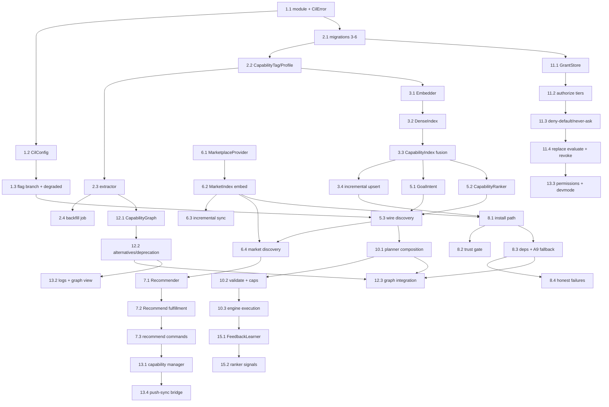

# Implementation Plan: OpenClaw Intelligent Capability Platform (ICP)

## Overview

This plan converts the ICP design (`design.md` §25 "Implementation Phases") into an incremental,
test-driven implementation sequence in **Rust** (`kria-core`), with SolidJS/TypeScript for the
`kria-desktop` frontend. Every task is shippable behind the `openclaw_icp_enabled` feature flag: with the
flag OFF, `SemanticOpenClawHandler::execute_semantic` MUST produce byte-for-byte identical output to the
current direct-router path (Property 11 / R7.2). Every task **extends** a named frozen A0–A9 component and
introduces no second registry, router, engine, installer, or permission store.

All CIL code lives under a new `crates/kria-core/src/openclaw/cil/` module tree (plus `perm/` for the
permission engine). Derived tables live inside the existing `skills.db` via additive, forward-only
`MIGRATIONS`. See the **Notes** section for the conventions (frozen components, no-hardcoding, flag-parity)
that apply to *every* task below.

Property-based tests seed from the design's **Correctness Properties** (§Correctness Properties, Properties
1–12) and the **Testing Strategy** (§23). Real-Docker integration reuses `kria-eval::openclaw_eval`
(§23 / §24). Test-related sub-tasks are marked with `*` and may be skipped for a faster MVP; core
implementation sub-tasks are never optional.

## Tasks

- [x] 1. CIL scaffolding + `CilConfig` + `openclaw_icp_enabled` flag + degraded-mode plumbing
  - [x] 1.1 Create the `openclaw::cil` module tree and `CilError`
    - Add `crates/kria-core/src/openclaw/cil/mod.rs` and register it under `openclaw/mod.rs` (module only; no callers yet)
    - Define the single `CilError` enum with `thiserror` covering the §Error Handling scenarios (`Embed`, `Market`, `Acquire`, `Plan`, `Permission`, `Degraded`, `Io`); all variants user-actionable, none swallowing failures
    - Define the `Fulfillment` enum (`Plan`, `Recommend`, `Decline`) and `RequestCtx`/`Fulfillment` skeleton types from §8.8 (types only, `todo!()` bodies gated so nothing is reachable yet)
    - _Requirements: 5.2, 7.1_
  - [x] 1.2 Add `CilConfig` (flags + weights + thresholds) as data-only config
    - Add `CilConfig` with `openclaw_icp_enabled: bool` (default `false`), `RankWeights`, trust/compat thresholds, planner breadth/depth caps, and generation-allowed flag
    - Wire `CilConfig` into the existing config load path (`kria_config.toml`) as an additive section; no existing keys changed
    - Ensure all thresholds/weights are config values, not constants in code (no-hardcoding)
    - _Requirements: 1.4, 7.2, 11.5_
  - [x] 1.3 Add the flag-gated branch and degraded-mode plumbing in `SemanticOpenClawHandler`
    - In `execute_semantic`, add a single branch: flag OFF → existing direct-router path unchanged; flag ON → call `CapabilityIntelligence::fulfill` (facade may return `Decline` until later phases land)
    - Add a `DegradedState` signal (embedder/network availability) threaded through the facade; default constructor reports non-degraded
    - Ensure flag-ON with no CIL backends still falls back to the frozen router path (honest degraded), never a panic
    - _Requirements: 7.2, 7.3, 13.1, 13.2_
  - [x] 1.4 Write flag-off parity test for `execute_semantic`
    - **Property 11: Flag-off parity** — with `openclaw_icp_enabled=false`, assert `execute_semantic` output is byte-for-byte the current direct-router path
    - **Validates: Requirements 7.2**
  - [x] 1.5 Write unit tests for `CilConfig` load + defaults + `CilError` mapping
    - Assert default flag is OFF, weights/thresholds load from config, and each `CilError` variant renders a user-actionable message
    - _Requirements: 1.4, 7.1_

- [x] 2. Capability profiles + additive migrations 3–6 + backfill job
  - [x] 2.1 Add additive migrations 3–6 to the frozen `MIGRATIONS`/`SCHEMA_VERSION` pipeline
    - Append `capability_profiles` (3), `market_catalog` (4), `capability_grants_scoped` (5) + `idx_grants_skill`, and `capability_edges` (6) exactly as specified in design §7.4 (CREATE TABLE IF NOT EXISTS / ADD COLUMN only — never drop/rename)
    - Bump `SCHEMA_VERSION` per table and confirm forward-only application against an older `skills.db`
    - _Requirements: 5.2, 7.3_
  - [x] 2.2 Implement `CapabilityTag` and `CapabilityProfile` data models (derived view)
    - Add `CapabilityTag { id, qualifiers, embedding }` (open-vocabulary string id; NOT an enum) and `CapabilityProfile { skill_id, provides, consumes, permissions, inputs, outputs }` per §7.1
    - Add serde JSON (de)serialization to/from the `capability_profiles` columns
    - _Requirements: 1.2, 12.1_
  - [x] 2.3 Implement the `CapabilityProfile` extractor from `SkillMetadata`
    - Derive `provides`/`consumes`/`inputs`/`outputs`/`permissions` generically from `SkillMetadata` (`input_schema`, `capabilities`, `categories`) with no per-skill or per-category branch
    - Persist derived profiles into `capability_profiles` keyed by `skill_id`; treat as a rebuildable view, never authoritative
    - _Requirements: 1.4, 5.1, 12.1_
  - [x] 2.4 Implement the first-boot backfill job (SkillMetadata → capability_profiles)
    - Build profiles for all existing skills on first flag-ON boot as a background job; until complete, discovery falls back to the frozen router (degraded, honest)
    - Subscribe to `RegistryEvent` to keep profiles current on install/uninstall
    - _Requirements: 5.1, 5.3, 13.2_
  - [x] 2.5 Write property test for idempotent reindex (source-of-truth invariant)
    - **Property 1: Single source of truth** — rebuilding all derived profiles from `ProductionSkillRegistry` yields identical query results
    - **Validates: Requirements 5.1**
  - [x] 2.6 Write unit tests for migrations + extractor determinism
    - Assert migrations apply forward-only on an older DB, no drop/rename; assert extractor output is deterministic for a fixed `SkillMetadata`
    - _Requirements: 5.2, 1.4_

- [x] 3. Embedder trait + `CapabilityIndex` (dense ANN + frozen BM25 fusion, incremental upsert)
  - [x] 3.1 Define the `Embedder` trait and default impl over `memory::embeddings`
    - Add `Embedder` trait (`embed`, `embed_batch`, `dim`, `model_id`) per §8.1; default impl delegates to KRIA `memory::embeddings` (FastEmbed/ONNX, no Python)
    - Expose `model_id()` for cache invalidation on model change
    - _Requirements: 1.3, 5.4, 13.1_
  - [x] 3.2 Implement the dense index (`DenseIndex`) behind a trait boundary
    - Implement ANN dense retrieval (HNSW/flat) over `provides`-tag embeddings, held in an `ArcSwap` snapshot for lock-free reads
    - Put retrieval behind a trait so an in-process index can be swapped for a distributed vector store without caller changes
    - _Requirements: 11.1, 11.2_
  - [x] 3.3 Implement `CapabilityIndex` fusing dense + frozen `Bm25Index`
    - Compose `resolver::SkillIndex` (frozen BM25 + `ArcSwap` snapshot) with the new dense index; `rebuild` from `get_enabled_skills()` (same source of truth)
    - Implement `search(intent, k)` returning `CapabilityCandidate`s with `semantic`/`lexical` signals populated
    - _Requirements: 4.2, 11.1, 5.1_
  - [x] 3.4 Implement incremental `upsert` (avoid full reindex at scale)
    - Implement `CapabilityIndex::upsert(skill)` with bounded cost for post-acquisition indexing
    - Add model-id/`profile_epoch` versioning so a model change triggers a background reindex without downtime
    - _Requirements: 5.4, 5.5, 11.3_
  - [x] 3.5 Write property test for idempotent reindex over the full index
    - **Property 1: Single source of truth** — rebuilding dense+BM25 indexes from the registry yields identical `search` results
    - **Validates: Requirements 5.1**
  - [x] 3.6 Write property test for no-hardcoding via a synthetic novel `CapabilityTag`
    - **Property 2: No hardcoding / open extensibility** — inject a never-before-seen `CapabilityTag`; assert it is embedded, indexed, and searchable through the same code path with no branch enumerating capabilities
    - **Validates: Requirements 1.1**
  - [x] 3.7 Write unit tests for degraded fallback when embedder unavailable
    - Assert that when the `Embedder` fails to load, `CapabilityIndex` falls back to frozen BM25 and reports degraded honestly
    - _Requirements: 13.1, 13.2_

- [x] 4. Checkpoint — Ensure all tests pass
  - Ensure all tests pass, ask the user if questions arise.

- [x] 5. Phase A discovery (GoalIntent, installed discovery, CapabilityRanker) wired into the handler
  - [x] 5.1 Implement `GoalIntent` derivation (embed + one structured LLM call)
    - Produce `GoalIntent { raw, goal_embedding, required, composite, max_risk }` via `Embedder::embed` + one structured LLM call (reuse `arg_gen` structured-output discipline); no keyword tables or per-category rules
    - _Requirements: 1.3, 4.2_
  - [x] 5.2 Implement `CapabilityRanker` (multi-signal, config weights)
    - Implement the `CapabilityRanker` trait combining semantic/lexical/compatibility/trust/quality/popularity/success using `RankWeights` from config (data, not code); no per-skill/per-category branch
    - Compatibility = I/O type fit + runtime requirements vs `RuntimeManager` availability + dependency satisfiability
    - _Requirements: 1.4, 4.2, 12.2_
  - [x] 5.3 Wire installed discovery into `CapabilityIntelligence::fulfill` behind the flag
    - Facade stage: `GoalIntent` → `CapabilityIndex::search` → `CapabilityRanker::rank` → return `Fulfillment::Plan` for the single-skill case (1-node `ExecutionGraph`), else `Decline`
    - Emit an `AuditLedger` entry for each decision stage (honesty/telemetry)
    - _Requirements: 4.2, 4.4, 7.1_
  - [x] 5.4 Write property test for compatibility ranking generality
    - **Property 2: No hardcoding** — assert ranking treats a synthetic novel `CapabilityTag` identically (compatibility via I/O tags + runtime, not name)
    - **Validates: Requirements 1.1, 12.1**
  - [x] 5.5 Write unit tests for ranker determinism + GoalIntent structured output
    - Assert stable ordering for fixed inputs/weights; assert `GoalIntent.required` parses from structured LLM output without keyword tables
    - _Requirements: 1.3, 4.2_

- [x] 6. `MarketIndex` + `MarketplaceProvider` (ClawHub adapter) — federated sync + offline embedding
  - [x] 6.1 Define the `MarketplaceProvider` trait + `ClawHubProvider` adapter
    - Add `MarketplaceProvider` (`provider_id`, `sync_index`, `fetch_manifest`, `trust_hint`) per §8.2; `ClawHubProvider` wraps the frozen `ClawHubClient` (`fetch_remote_index`/`search_remote`/`download_skill_manifest`) unchanged
    - Reject disallowed hosts / oversized manifests via the frozen `DomainValidator` → `Declined` with reason
    - _Requirements: 9.1, 9.3_
  - [x] 6.2 Implement `MarketIndex` with offline embedding into `market_catalog`
    - Sync catalogs through all providers; embed entries offline at sync time into `market_catalog.embedding`; never do live per-query marketplace fetch during discovery
    - Record version, deprecation, trust hint, quality, popularity per entry
    - _Requirements: 9.2, 9.4_
  - [x] 6.3 Implement incremental, concurrent, bounded catalog sync + offline fallback
    - Incremental sync via ETag/`fetched_at`; process providers concurrently under a bounded work queue
    - On provider unreachable, serve stale `market_catalog` and flag affected results "offline"
    - _Requirements: 9.5, 13.3_
  - [x] 6.4 Add marketplace discovery to the facade (parallel with installed)
    - `MarketIndex::search(intent)` over the pre-embedded cache, run in parallel with installed discovery; merge into the ranked candidate set
    - _Requirements: 4.2, 9.2_
  - [x] 6.5 Write property test for idempotent reindex over the market catalog
    - **Property 1: Single source of truth** — re-syncing/rebuilding `market_catalog` yields identical query results
    - **Validates: Requirements 5.1**
  - [x] 6.6 Write unit tests for DomainValidator rejection + offline staleness flag
    - Assert disallowed host/oversized manifest → `Declined`; assert unreachable provider serves stale cache flagged offline
    - _Requirements: 9.3, 13.3_

- [x] 7. Phase D recommendations (Recommender + Tauri command/events)
  - [x] 7.1 Implement the `Recommender` (pure reads over MarketIndex + capability graph)
    - Return ranked `Recommendation`s ordered by configured signals (compat/popularity/quality/trust/deps/success); assemble rationale from real signals, never templated per skill name/category
    - Never install anything without explicit user/policy approval; empty set or honest decline when nothing is above threshold
    - _Requirements: 8.1, 8.2, 8.3, 8.5_
  - [x] 7.2 Return `Fulfillment::Recommend` on capability-missing from the facade
    - When the goal needs a capability with no acceptable installed candidate, emit `Fulfillment::Recommend(..)` including alternatives/successors from the capability graph
    - _Requirements: 8.1, 8.4_
  - [x] 7.3 Add Tauri command + events for recommendations (preserve existing names)
    - Add new commands/events in `kria-desktop/src/commands/openclaw.rs` for fetching recommendations; do not rename any existing OpenClaw command/event
    - _Requirements: 10.1_
  - [x] 7.4 Write unit tests for recommendation honesty + no fabrication
    - **Property 10: Honesty** — assert no candidate above threshold → empty/decline, never a fabricated candidate; rationale derived from real signals
    - **Validates: Requirements 7.1, 8.5**

- [x] 8. Phase B acquisition (AcquisitionOrchestrator: install via BundleInstaller / generate via A9; trust gate)
  - [x] 8.1 Implement `AcquisitionOrchestrator` marketplace-install path (unified installer)
    - Evaluate best marketplace candidate above trust/compat threshold; install via the frozen `BundleInstaller` → register into `ProductionSkillRegistry`; provenance recorded as metadata only
    - Trigger `CapabilityIndex::upsert` (incremental) after registration
    - _Requirements: 2.1, 2.3, 5.5_
  - [x] 8.2 Add the trust gate before install
    - Consult `PublisherRegistry`/`TrustFramework` before install; a revoked publisher's skill returns `Declined` and is never installed
    - _Requirements: 2.2_
  - [x] 8.3 Implement dependency resolution + A9 generation fallback
    - Resolve declared dependencies via the capability graph + `SkillMetadata.dependencies`, recursively acquiring within bounded depth and rejecting cycles (frozen `DependencyResolver`)
    - When no acceptable candidate and generation allowed, fall back to A9 `GenerationPipeline` → `InstallSink` → frozen `BundleInstaller` (prefer `PipelineOutcome::Reused`)
    - _Requirements: 2.3, 2.4_
  - [x] 8.4 Enforce honest failure handling on acquisition
    - On `BundleInstaller` verify/hash/signature failure → abort, register nothing, return `Declined` with reason; on generation disallowed/failed → `Declined`, never fake success; emit `AuditLedger` entries
    - _Requirements: 2.5, 2.6, 7.1_
  - [x] 8.5 Write property test for installer convergence
    - **Property 8: Installer convergence** — any acquired skill (marketplace or A9) is registered via the frozen `BundleInstaller` and is structurally identical to an authored skill (provenance metadata only)
    - **Validates: Requirements 2.1**
  - [x] 8.6 Write property test for the trust gate
    - **Property 9: Trust gate** — any acquisition from a revoked publisher yields `Declined` (never installed)
    - **Validates: Requirements 2.2**
  - [x] 8.7 Write unit tests for dependency cycle rejection + honest declines
    - Assert bounded-depth recursion, cycle rejection, and `Declined` on install/generation failure with no partial skill
    - _Requirements: 2.4, 2.5, 2.6_

- [x] 9. Checkpoint — Ensure all tests pass
  - Ensure all tests pass, ask the user if questions arise.

- [x] 10. Phase C planner (type-directed CapabilityPlanner → frozen ExecutionGraph)
  - [x] 10.1 Implement `CapabilityPlanner` type-directed composition
    - Emit the frozen `execution::ExecutionGraph` using `NodeKind::Skill` nodes; build composition edges only where `a.outputs ∩ b.inputs ≠ ∅` (type matching, never skill name)
    - Insert frozen `Barrier`/`Merge`/`Wait` structural nodes for fan-in/fan-out; introduce no new plan format and do not modify the ExecutionEngine
    - _Requirements: 3.2, 3.3, 3.4, 12.3_
  - [x] 10.2 Enforce validation + breadth/depth caps
    - Validate every graph via frozen `DependencyResolver::validate` (acyclic, all executors registered) before execution; enforce configurable breadth/depth caps and reject/reduce rather than emit unbounded graphs
    - _Requirements: 3.1, 3.5, 11.5_
  - [x] 10.3 Wire multi-capability execution through the frozen engine
    - Facade hands the validated `ExecutionGraph` to the frozen `ExecutionEngine::execute`; CIL never touches containers; results wrapped as verified/evidence-wrapped output
    - _Requirements: 4.4, 4.5_
  - [x] 10.4 Write property test for plan validity
    - **Property 6: Plan validity** — every `ExecutionGraph` from `CapabilityPlanner` passes `DependencyResolver::validate`
    - **Validates: Requirements 3.1**
  - [x] 10.5 Write property test for composition type-safety
    - **Property 7: Composition type-safety** — every plan edge `a → b` satisfies `a.outputs ∩ b.inputs ≠ ∅`
    - **Validates: Requirements 3.2**
  - [x] 10.6 Write property test for leak-freedom via real Docker (kria-eval)
    - **Property 12: Leak-freedom** — after completed/failed/cancelled runs, container and lease counts return to baseline (frozen `leak_detector`)
    - **Validates: Requirements 4.1**

- [x] 11. Permission redesign (PermissionEngine + GrantStore + tiers; replace evaluate with authorize; revocation)
  - [x] 11.1 Implement `GrantStore` over `capability_grants_scoped`
    - Persist scoped grants (never/once/session/workspace/persistent/silent) with `caps_hash`, risk, decision, expiry, revoked; index by `skill_id` and support partitioning by workspace
    - _Requirements: 6.5, 11.4_
  - [x] 11.2 Implement `PermissionEngine::authorize` (metadata-driven tiers)
    - Derive each tier from `classify_risk` + `CapabilityProfile.permissions` + trust tier (no name/category matching); delegate hash/widening to the frozen `ApprovalCache` and risk to frozen `classify_risk`
    - Reuse a prior grant when scope matches and caps not widened; produce `Prompt`/`Escalated` when `requires_reapproval(old,new)` holds
    - _Requirements: 6.1, 6.4, 6.7, 7.4_
  - [x] 11.3 Implement deny-by-default + NeverAsk tiers
    - `classify_risk == Red` or host-scope subprocess → `AlwaysAsk` (never remembered) unless explicit `Silent` policy grant; `classify_risk == Green` + no fs/net/subprocess/browser → `NeverAsk` (no prompt)
    - _Requirements: 6.2, 6.3_
  - [x] 11.4 Replace the `evaluate` call in `execute_semantic` with `authorize`; implement revocation
    - Swap the current `ApprovalCache::evaluate(...)` call for `PermissionEngine::authorize(...)` (frozen behavior remains a strict subset); implement `revoke(grant_id)` writing `revoked=1` and requiring fresh approval next use
    - Emit an `AuditLedger` entry for every permission decision
    - _Requirements: 6.6, 7.1, 7.4_
  - [x] 11.5 Write property test for permission monotonicity
    - **Property 3: Permission monotonicity** — narrowing (`new ⊆ old`) never turns `Allow` into `Prompt`; widening (`requires_reapproval`) always yields `Prompt`/`Escalated`
    - **Validates: Requirements 6.1**
  - [x] 11.6 Write property test for deny-by-default elevation
    - **Property 4: Deny-by-default for elevation** — RED/host-scope-subprocess node → `AlwaysAsk` (never remembered) regardless of trust, unless `Silent` policy grant
    - **Validates: Requirements 6.2**
  - [x] 11.7 Write property test for never-ask purity
    - **Property 5: Never-ask purity** — GREEN + no fs/net/subprocess/browser permission → `NeverAsk`, no prompt ever
    - **Validates: Requirements 6.3**
  - [x] 11.8 Write unit tests for GrantStore scoping, expiry, and revocation
    - Assert scope persistence (once/session/workspace/persistent), expiry, revoke → fresh approval, and workspace partitioning
    - _Requirements: 6.5, 6.6, 11.4_

- [x] 12. CapabilityGraph + Knowledge Graph (edges, alternatives, deprecation/version awareness)
  - [x] 12.1 Implement `CapabilityGraph` over `capability_edges` (derived, rebuildable)
    - Build `depends`/`provides_for`/`alternative`/`supersedes` edges from `SkillMetadata.dependencies`/`capabilities` + capability profiles; materialized view rebuildable from the registry
    - _Requirements: 5.1, 5.2_
  - [x] 12.2 Add alternatives + deprecation/version awareness
    - Expose `alternative`/`supersedes` queries for recommendations; drive "newer skill replaces this" from `market_catalog.version`/`deprecated` + `supersedes` edges
    - _Requirements: 8.4, 9.4_
  - [x] 12.3 Integrate graph into acquisition dependency resolution + planner compatibility
    - Use graph edges in `AcquisitionOrchestrator` dependency resolution and `CapabilityRanker`/`CapabilityPlanner` satisfiability checks
    - _Requirements: 2.4, 3.2, 12.3_
  - [x] 12.4 Write property test for idempotent edge rebuild
    - **Property 1: Single source of truth** — rebuilding `capability_edges` from metadata yields identical graph queries
    - **Validates: Requirements 5.1**
  - [x] 12.5 Write unit tests for alternatives/supersedes + version awareness
    - Assert alternatives/successors surfaced from edges and deprecation flags respected in queries
    - _Requirements: 8.4, 9.4_

- [x] 13. Frontend evolution (capability manager, logs, dev mode, permissions, graph view, push-sync bridge)
  - [x] 13.1 Add capability manager + generated-skills provenance surface
    - New Tauri commands/events in `commands/openclaw.rs` backed by `CapabilityIndex`/`capability_profiles` and `DiscoverySource::Generated`; SolidJS view under `ui/src/views/`; preserve all existing OpenClaw command/event names
    - _Requirements: 10.1, 10.5_
  - [x] 13.2 Add execution logs + capability-graph view surfaces
    - Logs sourced from `AuditLedger` + `openclaw::event`; graph view backed by `CapabilityGraph`; new commands/events only
    - _Requirements: 10.4, 10.5_
  - [x] 13.3 Add permission management + developer-mode gating
    - Grants list + revoke backed by `GrantStore`; gate not-production-ready features behind a Developer Mode config flag
    - _Requirements: 10.1, 10.3_
  - [x] 13.4 Implement the push-sync event bridge (eventual consistency)
    - Desktop bridge subscribes to frozen `openclaw::event` + `RegistryEvent` and `app_handle.emit`s to the UI; UI reconciles missed events via polling
    - _Requirements: 10.2_
  - [x] 13.5 Write frontend/command tests for event-name preservation + push/poll reconcile
    - Assert existing Tauri command/event names unchanged; assert UI reconciles a dropped event via poll
    - _Requirements: 10.1, 10.2_

- [x] 14. Checkpoint — Ensure all tests pass
  - Ensure all tests pass, ask the user if questions arise.

- [x] 15. Learning loop (FeedbackLearner → SkillStatistics → ranker signals)
  - [x] 15.1 Implement `FeedbackLearner` extending `SemanticSkillRouter::record_feedback`
    - On node completion, update `SkillStatistics` (success rate, usage count, latency) via the frozen `record_feedback`; write existing stats tables only
    - _Requirements: 4.3_
  - [x] 15.2 Feed updated statistics into ranker popularity/success signals
    - `CapabilityRanker` reads updated `SkillStatistics` as `popularity`/`success` signals on subsequent goals, closing the discover→execute→learn loop
    - _Requirements: 4.3_
  - [x] 15.3 Write unit tests for feedback → stats → ranking influence
    - Assert a successful/failed run shifts `SkillStatistics` and that the ranker's popularity/success signals reflect the change on the next goal
    - _Requirements: 4.3_

- [x] 16. Scale + production validation (1k/10k tests, live gates A–E, 0-leak, honesty + flag-off rollback)
  - [x] 16.1 Write scale tests over 1k/10k synthetic skills (`#[ignore]`d)
    - Generate 1k and 10k synthetic skills (each with a distinct `CapabilityTag`); measure discovery latency, incremental `upsert` cost, memory, and reindex time against the existing 1000-skill benchmark baseline
    - **Property 2 / Property 1** — assert novel synthetic tags flow through unchanged and reindex stays idempotent at scale
    - **Validates: Requirements 1.1, 11.1, 11.3**
  - [x] 16.2 Write real-Docker integration test via `kria-eval::openclaw_eval`
    - goal → discover → install from a test-rig marketplace → plan → execute a calculator-style skill → verify → assert 0 leaked containers/leases
    - **Property 8 / Property 12** — installer convergence + leak-freedom on the live path
    - **Validates: Requirements 2.1, 4.1, 4.5**
  - [-] 16.3 Write honesty + telemetry audit tests for phases A–E
    - **Property 10: Honesty** — assert no fake success on acquisition/planning; `Declined`/`degraded` reported truthfully; every decision stage emits an `AuditLedger` entry
    - **Validates: Requirements 7.1**
  - [x] 16.4 Write backfill-correctness + flag-off rollback drill tests
    - **Property 1 / Property 11** — derived-view rebuild reproduces query results (idempotency); flip flag OFF → byte-for-byte prior behavior and clean derived-table drop/rebuild
    - **Validates: Requirements 5.1, 7.2, 7.3**

- [x] 17. Final checkpoint — Ensure all tests pass
  - Ensure all tests pass, ask the user if questions arise.

## Notes

Conventions that apply to **every** task above (from design §2, §3, §16, §18 and the Correctness Properties):

- **Frozen components (extend, never fork).** No task may duplicate or re-implement `RuntimeManager`,
  `ExecutionEngine`, `SemanticSkillRouter`, `ProductionSkillRegistry`, `Marketplace`/`ClawHubClient`,
  `ContainerPool`, `DockerRuntime`, the A9 `GenerationPipeline`, `BundleInstaller`, `ApprovalCache`, or
  `McpBridge`. Each new module maps to a frozen owner per design §4 and only adds derived views/traits.
- **No hardcoding.** No hardcoded prompts, skill names, capability→skill maps, routing tables, or
  per-category branches. All behavior derives from skill metadata, JSON schemas, `CapabilityTag` open
  vocabulary, embeddings, and registry state. New capability domains are data (new tag strings), not code —
  verified by the synthetic-novel-`CapabilityTag` property test (Property 2).
- **Flag parity.** Everything is gated behind `openclaw_icp_enabled` (default OFF). Flag-OFF MUST be
  byte-for-byte identical to the current direct-router path (Property 11); flag-OFF-after-ON is instant,
  lossless, and derived tables are safely droppable/rebuildable.
- **Registry is the only source of truth.** All CIL tables (`capability_profiles`, `market_catalog`,
  `capability_grants_scoped`, `capability_edges`) are derived, keyed by `skill_id`, and rebuildable from
  `ProductionSkillRegistry` + marketplace fetch (Property 1). Schema changes are additive and forward-only.
- **One installer.** Both marketplace and A9-generated skills converge on the frozen `BundleInstaller`
  (Property 8). Trust is enforced *before* install (Property 9).
- **Honesty invariant.** No fake success; `Declined`/`degraded`/error is returned truthfully and every
  decision stage emits an `AuditLedger` entry (Property 10). Degraded mode (no embedder/network) is a
  first-class, honestly-reported state, not a failure.
- **Deny-by-default permissions.** Tiers are metadata-derived; RED/system-modifying/host-scope-subprocess is
  `AlwaysAsk` (Property 4); GREEN pure skills are `NeverAsk` (Property 5); widening re-prompts (Property 3).
- **Tasks marked `*` are optional** (unit/property/integration/scale tests) and may be skipped for a faster
  MVP; core implementation sub-tasks are never optional. Property tests reference the exact design Property
  number and the requirement clause they validate.
- **Language.** Rust in `kria-core` for all CIL/permission code; SolidJS/TypeScript in `kria-desktop`/`ui`
  for frontend surfaces. Real-Docker integration reuses `kria-eval::openclaw_eval`.

## Task Dependency Graph



```json
{
  "waves": [
    { "id": 0, "tasks": ["1.1"] },
    { "id": 1, "tasks": ["1.2", "2.1"] },
    { "id": 2, "tasks": ["1.3", "2.2", "11.1"] },
    { "id": 3, "tasks": ["2.3", "3.1"] },
    { "id": 4, "tasks": ["2.4", "2.5", "2.6", "3.2", "12.1"] },
    { "id": 5, "tasks": ["3.3", "12.2"] },
    { "id": 6, "tasks": ["3.4", "3.5", "3.6", "3.7", "5.1", "5.2", "6.1"] },
    { "id": 7, "tasks": ["5.3", "5.4", "5.5", "6.2"] },
    { "id": 8, "tasks": ["6.3", "6.4", "10.1", "11.2"] },
    { "id": 9, "tasks": ["6.5", "6.6", "8.1", "10.2", "11.3"] },
    { "id": 10, "tasks": ["7.1", "8.2", "8.3", "10.3", "10.4", "10.5", "10.6", "11.4"] },
    { "id": 11, "tasks": ["7.2", "8.4", "8.5", "8.6", "8.7", "11.5", "11.6", "11.7", "11.8", "12.3", "12.4", "12.5", "15.1"] },
    { "id": 12, "tasks": ["7.3", "7.4", "13.1", "13.2", "13.3", "15.2", "15.3"] },
    { "id": 13, "tasks": ["13.4", "13.5"] },
    { "id": 14, "tasks": ["16.1", "16.2", "16.3", "16.4"] }
  ]
}
```
