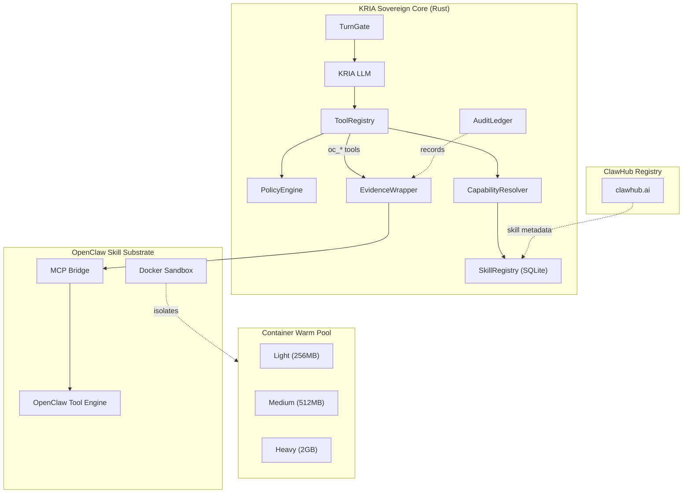

# OpenClaw Integration

> **Last Updated:** 2026-05-11
> **Status:** Production

---

## Executive Summary

OpenClaw integrates community-contributed skills into KRIA as a **headless, network-isolated "Skill Substrate"** — not as a peer assistant, but as a sandboxed execution farm. KRIA's Rust sovereign core remains the sole planner, safety authority, and resource arbiter. OpenClaw skills run in isolated Docker containers with strict resource limits and network policies.

---

## Architecture Overview



---

## Design Invariants

1. **KRIA's Rust core is the only brain.** OpenClaw never runs its own agent loop.
2. **OpenClaw skills are untrusted.** All execution happens in sandboxed containers.
3. **Tool output is never raw text.** All output is wrapped in structured evidence blocks.
4. **Network access is controlled.** Skills can only access PSL-validated domains via proxy.
5. **Containers are ephemeral.** Each invocation gets a fresh container; no state persists.

---

## Skill Descriptor

```rust
pub struct SkillDescriptor {
    pub skill_id: String,           // oc_<name>
    pub name: String,               // Display name
    pub description: String,        // LLM-visible description
    pub category: String,           // web, productivity, media, etc.
    pub parameters: serde_json::Value,  // JSON schema
    pub risk_level: RiskLevel,      // Green/Yellow/Red
    pub network_policy: OpenClawNetworkPolicy,
    pub resource_profile: ResourceProfile,
    pub capabilities: SkillCapabilities,
    pub trust_tier: TrustTier,
    pub source: SkillSource,
    pub installed_at: chrono::DateTime<chrono::Utc>,
    pub last_used_at: Option<chrono::DateTime<chrono::Utc>>,
    pub use_count: u32,
    pub status: SkillStatus,
}
```

---

## Container Pool

### Resource Classes

| Class | Memory | CPU | Use Case |
|-------|--------|-----|----------|
| **Light** | 256MB | 0.5 | Web search, productivity |
| **Medium** | 512MB | 1.0 | General tools |
| **Heavy** | 2GB | 2.0 | Media generation, code compilation |

### Warm Pool

```rust
pub struct ContainerPool {
    pools: Arc<Mutex<HashMap<ResourceClass, VecDeque<WarmContainer>>>>,
    active: Arc<Mutex<HashMap<InvocationId, ActiveInvocation>>>,
    config: PoolConfig,
}

impl ContainerPool {
    /// Checkout a container for tool invocation.
    /// Creates fresh ephemeral workspace for this invocation only.
    pub async fn checkout(&self, class: ResourceClass, skill_id: &str) 
        -> Result<InvocationHandle, PoolError>;

    /// Return container after invocation. Destroys it (no state persistence).
    pub async fn checkin(&self, handle: InvocationHandle) 
        -> Result<(), PoolError>;
}
```

**Key invariant:** `checkin()` destroys the container. No state persists between invocations.

---

## Security Model

### PSL-Aware Domain Validation

Prevents `evilgoogle.com` from matching `google.com`:

```rust
pub struct DomainValidator {
    psl: PslList,  // Public Suffix List
    allowed: HashMap<String, SubdomainPolicy>,
}

impl DomainValidator {
    pub fn is_allowed(&self, hostname: &str) -> bool {
        let registrable = self.psl.domain(hostname)?;
        match self.allowed.get(&registrable) {
            Some(SubdomainPolicy::Exact) => hostname == registrable,
            Some(SubdomainPolicy::AnySubdomain) => 
                hostname == registrable || 
                hostname.ends_with(&format!(".{}", registrable)),
            _ => false,
        }
    }
}
```

### Evidence Wrapper

Tool output is wrapped in structured XML, never passed as raw text:

```xml
<tool_result name="oc_web_search" source="sandbox" trust="untrusted">
  <status>success</status>
  <data>[...escaped data...]</data>
  <metadata bytes="1234" duration_ms="1800" />
</tool_result>
```

The LLM treats `<data>` as external untrusted data, not instructions.

### Description Rewriting

At installation, skill descriptions are rewritten by KRIA's local LLM:

```rust
pub async fn rewrite_description(llm: &dyn LlmRuntime, original: &str) 
    -> Result<String, TranspileError> 
{
    // LLM produces single-sentence verb-noun description
    // Original description is discarded
    // Prevents YAML injection attacks
}
```

### Audit Ledger

Append-only, HMAC-signed audit trail:

```rust
pub struct AuditLedger {
    db: Arc<Mutex<rusqlite::Connection>>,
    hmac_key: Vec<u8>,
}

pub struct AuditEntry {
    pub id: i64,
    pub timestamp: chrono::DateTime<chrono::Utc>,
    pub event_type: AuditEventType,
    pub skill_id: String,
    pub invocation_id: String,
    pub tool_name: String,
    pub input_hash: String,    // SHA-256
    pub output_hash: String,   // SHA-256
    pub signature: String,     // HMAC-SHA256
}
```

---

## Trust Tiers

| Tier | Source | Max Resources | Network | HITL on Install |
|------|--------|---------------|---------|-----------------|
| **Verified** | KRIA-curated | Heavy | Yes | No |
| **Community** | ClawHub | Medium | Yes | Yes |
| **Local** | User-installed | Light | No | Yes |
| **Untrusted** | Known issues | Light | No | Yes |

---

## Capability Resolver

Hybrid BM25 + Dense retrieval for skill selection:

```rust
pub struct CapabilityResolver {
    bm25: BM25Index,
    dense: DenseIndex,  // sentence-transformers
    skill_index: ArcSwap<SkillSnapshot>,
}

impl CapabilityResolver {
    pub async fn resolve(&self, query: &str, max_tools: usize) 
        -> Vec<SkillMatch> 
    {
        // 1. BM25 keyword matching (fast)
        // 2. Dense re-ranking (semantic)
        // 3. Return top-k matches
    }
}
```

Maximum 5-10 OpenClaw tools presented to LLM per turn.

---

## Skill Lifecycle

### Lifecycle Policy

```rust
pub struct SkillLifecyclePolicy {
    pub stale_after_days: u32,        // Flag for review (default: 30)
    pub auto_disable_after_days: u32, // Auto-disable (default: 90)
    pub check_updates: bool,          // Periodic update checks
}
```

### Update Diff

When a skill updates, show capability/resource changes:

```rust
pub struct SkillUpdateDiff {
    pub capability_changes: Vec<CapabilityChange>,
    pub resource_changes: Vec<ResourceChange>,
    pub requires_reapproval: bool,  // True if resources increased
}
```

---

## ClawHub Marketplace

### Registry URL

Default: `https://raw.githubusercontent.com/kria-ai/kria-skills/main/index.json`

Configurable in `~/.kria/config.toml`:

```toml
[openclaw.registry]
url = "https://clawhub.ai/index.json"
allowed_hosts = ["clawhub.ai", "raw.githubusercontent.com"]
```

### Skill Installation Flow

```
1. User requests install from marketplace
2. Download SKILL.md from registry
3. Transpile to SkillDescriptor
4. Rewrite description via local LLM
5. Apply security policies
6. Store in SQLite registry
7. Register as oc_* tool in ToolRegistry
8. Create audit entry
```

---

## Frontend Components

| Component | Purpose |
|-----------|---------|
| `SkillMarketplace` | Browse/search/install skills |
| `PermissionModal` | Approve resource requests + trust tier |
| `ToolCallBadge` | Show execution source (Native/MCP/Sandbox) |
| `SubstrateStatus` | Container pool health indicator |

---

## Testing

### Unit Tests

| Module | Key Tests |
|--------|-----------|
| `transpiler` | YAML parsing, description rewriting, validation |
| `proxy` | PSL domain validation, spoofing prevention |
| `evidence` | XML wrapping, escaping, truncation |
| `pool` | Checkout/checkin, warm pool refill |
| `audit` | HMAC signing, chain verification |

### Security Tests

| Attack | Defense |
|--------|---------|
| YAML injection | Description rewriting |
| Domain spoofing | PSL-aware validation |
| Output injection | Evidence wrapper XML |
| Container escape | Seccomp profiles |
| Network exfiltration | `network_mode: none` + proxy |
| Shared workspace poisoning | Ephemeral containers |

---

## Implementation Status

| Phase | Scope | Status |
|-------|-------|--------|
| A | Core Scaffold | ✅ Complete |
| B | Container Pool | ✅ Complete |
| C | Evidence Layer | ✅ Complete |
| D | Resolver | ✅ Complete |
| E | Frontend | ✅ Complete |
| F | Integration | ✅ Complete |

---

## Related Documentation

- **TOOLS.md** — Tool system overview
- **SAFETY.md** — Policy engine and HITL
- **ARCHITECTURE.md** — System architecture
