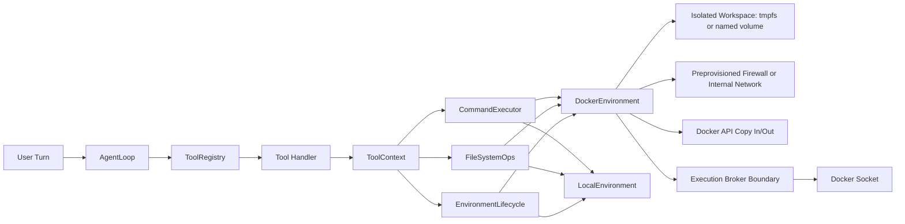

# RFC 001 FINAL: Agnostic Execution Layer for KRIA

## Document Control
- RFC ID: RFC-001-FINAL
- Title: Environment-Agnostic Tool Execution with Local and Docker Providers
- Status: Proposed (Consolidated Final)
- Authors: KRIA Architecture Team
- Date: 2026-05-05
- Target Milestone: Phase-5 completion (Docker-backed eval safety)

## 1. Introduction (Executive Summary and Scope)
KRIA currently executes high-risk shell and file operations directly on the host machine. For an autonomous assistant, that model is unsafe because a single tool call can mutate critical host state, leak data, or damage the operating environment.

This RFC defines a single, implementation-ready architecture for environment-agnostic tool execution. Core planner and tool orchestration logic remain stable while execution is delegated to capability-based providers. The architecture standardizes deterministic shell state handling, enforces strict container hardening, and makes Docker isolation the default for evaluator safety.

The design supports current local workflows, immediate Docker hardening, and future remote execution backends without rewriting the agent loop.

### 1.1 Scope
In scope:
- A modular capability-based execution contract.
- A single-lock shell-state concurrency model.
- Docker-first isolation baseline for autonomous execution.
- Strict network and filesystem hardening requirements.
- Explicit error taxonomy and reset signaling.
- A single consolidated rollout sequence from scaffold to hardened deployment.

Out of scope:
- Planner policy redesign.
- Non-Docker sandbox technologies.
- Full remote orchestrator implementation (future extension only).

## 2. Architectural Principles
1. Safety by default: autonomous execution must not require trusting host shell behavior.
2. Determinism over convenience: explicit state and explicit reset signaling.
3. Interface segregation: tools depend only on capabilities they consume.
4. Fail closed: missing security preconditions block startup.
5. Reproducibility: immutable images and explicit resource limits.

## 3. Execution Architecture

### 3.1 End-to-End Data Flow


### 3.2 Mandatory ToolContext and Single-Lock ShellState Model
Shell state must be managed by exactly one mutex to eliminate lock-graph deadlocks.

```rust
pub struct ShellState {
    pub cwd: std::path::PathBuf,
    pub env_vars: std::collections::HashMap<String, String>,
    pub generation: u64,
}

pub struct ToolContext {
    pub session_id: String,
    pub turn_id: String,
    pub cancellation: tokio_util::sync::CancellationToken,
    pub shell_state: Arc<tokio::sync::Mutex<ShellState>>, // exactly one lock
    pub env: Arc<dyn EnvironmentProvider>,
}
```

Concurrency invariants:
- Exactly one mutex guards persisted shell state.
- No nested shell-state locks are permitted.
- Long-running external execution must never hold the shell-state lock.
- Persisted shell mutations increment generation on successful commit.
- Persisted shell mutations MUST use CAS commit semantics: commit only when `current_generation == snapshot_generation`.
- If generation differs at commit time, provider/runtime MUST return `EnvironmentError::ShellStateConflict` and force retry or replan.

Execution pattern:
1. Acquire lock, snapshot shell state, release lock.
2. Execute provider call with snapshot.
3. If command is a persisted built-in, reacquire lock and compare `current_generation` to `snapshot_generation`.
4. If generations differ, abort commit and return `EnvironmentError::ShellStateConflict`.
5. If generations match, commit deterministic mutation and increment generation.

### 3.3 Standardized Modular Capability Traits
```rust
#[async_trait::async_trait]
pub trait CommandExecutor: Send + Sync {
    async fn execute_command(
        &self,
        request: CommandRequest,
        shell_state_snapshot: ShellState,
    ) -> Result<CommandResult, EnvironmentError>;
}

#[async_trait::async_trait]
pub trait FileSystemOps: Send + Sync {
    async fn read_file(&self, request: ReadFileRequest) -> Result<ReadFileResult, EnvironmentError>;
    async fn write_file(&self, request: WriteFileRequest) -> Result<WriteFileResult, EnvironmentError>;
    async fn list_dir(&self, request: ListDirRequest) -> Result<ListDirResult, EnvironmentError>;
}

#[async_trait::async_trait]
pub trait EnvironmentLifecycle: Send + Sync {
    async fn ensure_ready(&self) -> Result<(), EnvironmentError>;
    async fn reset_environment(&self, reason: ResetReason) -> Result<(), EnvironmentError>;
    async fn shutdown(&self) -> Result<(), EnvironmentError>;
}

pub trait EnvironmentProvider:
    CommandExecutor + FileSystemOps + EnvironmentLifecycle + Send + Sync
{
}
```

Design requirement:
- Tool handlers consume only required capabilities.
- Monolithic god-traits are prohibited.

## 4. Hardened Security Baseline

### 4.1 Network Enforcement
- Runtime application-layer firewall mutation is forbidden.
- Runtime app must not execute privileged iptables operations.
- Network policy is enforced using one of:
  - preprovisioned_firewall mode (required script: scripts/setup-kria-net.sh), or
  - internal mode (Docker internal network, no external egress).
- Startup must verify policy readiness and fail closed if missing.
- Architecture direction is mandatory: introduce an `Execution Broker` (small audited proxy) between KRIA and Docker socket to reduce root-equivalent compromise blast radius.
- Direct KRIA-to-Docker socket access is transitional and must be phased out once broker support is implemented.

### 4.2 Filesystem Isolation and Transfer Model
- Host bind mounts are forbidden for autonomous execution.
- Autonomous evaluation workspace MUST use `tmpfs` only.
- Isolated named volumes are allowed only in Development Mode and are prohibited in evaluator/CI autonomous runs.
- File movement must use Docker/Bollard archive copy APIs only.
- Direct host-path access by autonomous container execution is prohibited.

### 4.3 Container Privilege Hardening
Required baseline:
- cap_drop = ["ALL"]
- no_new_privileges = true
- strict `seccomp` syscall whitelist profile is mandatory for every container and command execution path.
- startup must fail closed if the required seccomp profile is missing or cannot be applied.

Recommended complementary controls:
- read_only_rootfs = true (except isolated writable workspace target)
- pids_limit, memory, and cpu quotas enforced

### 4.4 Runtime Identity
- Docker root default is forbidden for autonomous write paths.
- Linux Tier-1: run with host uid:gid mapping.

### 4.5 Interactivity and Deadlock Prevention
- Commands must run non-interactive.
- Set DEBIAN_FRONTEND=noninteractive.
- Stdin attached to /dev/null.
- Docker exec interactive stdin disabled.

### 4.6 Reproducibility
- latest tags are forbidden.
- Images must be pinned by immutable digest.
- Signed image verification is mandatory (for example Sigstore/cosign) before execution is allowed.
- Verification failure must block environment readiness.

## 5. Shell Persistence Boundary
Persisted shell state is intentionally narrow.

Persisted commands only:
- cd <path>
- export KEY=VALUE
- unset KEY

All other shell runtime mutations are ephemeral and non-persistent, including alias definitions, source, shell functions, prompt customization, shell options, and profile side effects.

Behavioral contract:
- Non-persisted shell mutations emit warning telemetry event (for example: ShellStateBoundaryWarning).
- Planning logic must not assume persistence for boundary-exceeding commands.

## 6. Configuration Contract
```toml
[execution]
provider = "local"                  # local | docker
fail_closed = true

[execution.docker]
image = "ubuntu:24.04@sha256:<verified-digest>"
socket = "/var/run/docker.sock"
network_name = "kria_exec_net"
network_mode = "bridge"
network_policy_mode = "preprovisioned_firewall"  # preprovisioned_firewall | internal
network_policy_ready_check = true

workspace_backend = "tmpfs"         # tmpfs only for autonomous eval; named_volume is development-mode only
workspace_volume_name = "kria_exec_workspace"
workspace_tmpfs_size_mb = 256
development_mode_named_volumes = false
bind_mounts_enabled = false
copy_io_mode = "docker_api"

memory_mb = 512
cpus = 1.0
pids_limit = 128
noninteractive = true
inject_host_uid_gid = true

cap_drop = ["ALL"]
no_new_privileges = true
seccomp_profile = "config/seccomp/kria-seccomp.json"
image_signature_verifier = "cosign"
max_output_bytes = 1048576
max_output_lines = 10000

# planned defense-in-depth boundary
execution_broker_url = "http://127.0.0.1:7777"
```

Required environment overrides:
- KRIA_EXECUTION_ENV
- KRIA_EXEC_DOCKER_IMAGE
- KRIA_EXEC_DOCKER_NETWORK_POLICY_MODE
- KRIA_EXEC_DOCKER_WORKSPACE_BACKEND
- KRIA_EVAL_EXECUTION_ENV (default docker)

## 7. EnvironmentError Taxonomy
Mandatory command flood-control contract:

```rust
pub struct CommandRequest {
    pub program: String,
    pub args: Vec<String>,
    pub timeout_ms: u64,
    pub max_bytes: usize,
    pub max_lines: usize,
}
```

Provider behavior requirement:
- Providers must stream output incrementally and enforce both `max_bytes` and `max_lines`.
- On limit breach, providers MUST truncate buffered output, terminate/kill the running process, and return typed limit error.

```rust
pub enum EnvironmentError {
    ProviderUnavailable { provider: String, details: String },
    StartupPolicyNotReady { policy: String, details: String },
    NetworkPolicyNotReady { mode: String, details: String },
    WorkspaceIsolationViolation { details: String },
    BindMountForbidden { mount: String },
    PathTraversalDenied { path: String },
    ShellStateConflict { expected_generation: u64, actual_generation: u64 },

    CommandFailed { exit_code: i32, stderr: String },
    CommandTimedOut { timeout_ms: u64 },
    CancellationRequested,
    OutputLimitExceeded {
        max_bytes: usize,
        max_lines: usize,
        observed_bytes: usize,
        observed_lines: usize,
    },

    StorageLimitExceeded { limit_bytes: u64, observed_bytes: u64 },
    ContainerOomKilled { exit_code: Option<i64> },
    PidLimitExceeded { limit: i64 },

    EnvironmentResetRequired { reason: String },
    EnvironmentResetFailed { reason: String, details: String },

    DockerApi { operation: String, details: String },
    Io { operation: String, details: String },
    Serialization { details: String },
}
```

Typed error requirements:
- Storage exhaustion must map to StorageLimitExceeded.
- OOM kill must map to ContainerOomKilled.
- PID exhaustion must map to PidLimitExceeded.
- CAS generation mismatch must map to ShellStateConflict.
- Output flood/overflow must map to OutputLimitExceeded with process termination.
- Container recycle with state loss must emit EnvironmentReset event and may return EnvironmentResetRequired where appropriate.

## 8. Runtime Guardrails and Reset Signaling
- Any container recycle event (OOM, PID breach, storage breach, manual recovery) must emit deterministic `EnvironmentReset` signaling to the planner/executor pipeline.
- Retry is allowed only for idempotent read-only operations and must be bounded by policy.
- Stateful operations encountering reset or CAS conflict must return typed errors and force replan instead of silent retry loops.

## 9. Master Phase-by-Phase Implementation Checklist

### Phase 1: Scaffold and Contracts
- [ ] Create environment module files under crates/kria-core/src/infra/environment/.
- [ ] Implement capability traits in traits.rs.
- [ ] Add ShellState with cwd, env_vars, generation.
- [ ] Define CommandRequest, CommandResult, ResetReason, and EnvironmentError.
- [ ] Export module through crates/kria-core/src/infra/mod.rs.

### Phase 2: Local Provider Parity
- [ ] Implement LocalEnvironment capability traits.
- [ ] Preserve existing timeout, output truncation, and process cleanup semantics.
- [ ] Add local provider tests for command and file operations.

### Phase 3: ToolContext Injection and Concurrency Model
- [ ] Introduce ToolContext with env and single shell_state mutex.
- [ ] Thread ToolContext through registry and handler invocation.
- [ ] Implement snapshot-execute-commit flow with generation increments.
- [ ] Remove multi-lock shell-state patterns and deadlock-prone lock graphs.

### Phase 4: Tool Migration and Persistence Semantics
- [ ] Migrate shell tools to CommandExecutor capability.
- [ ] Migrate file tools to FileSystemOps capability.
- [ ] Implement persisted built-ins: cd, export, unset.
- [ ] Emit boundary warning events for non-persistent shell mutations.
- [ ] Maintain output schema compatibility.
- [ ] Add integration tests across migrated tools.

### Phase 5: Docker Hardening and Evaluator Enforcement
- [ ] Implement DockerEnvironment capability traits.
- [ ] Enforce no bind mounts in autonomous mode.
- [ ] Enforce tmpfs-only workspace backend for autonomous evaluation.
- [ ] Restrict named-volume workspace backend to Development Mode only.
- [ ] Implement Docker API copy in/out file pipeline.
- [ ] Enforce cap_drop ALL and no_new_privileges true.
- [ ] Enforce strict seccomp whitelist profile for all Docker execution paths.
- [ ] Enforce non-interactive execution and stdin nulling.
- [ ] Enforce pinned immutable image digest.
- [ ] Enforce signed image verification before environment readiness.
- [ ] Enforce memory/cpu/pids limits.
- [ ] Verify preprovisioned firewall or internal network mode at startup.
- [ ] Implement Single Owner Actor for Docker lifecycle with states: Healthy, Busy, Broken, Recreating.
- [ ] Route all Bollard lifecycle operations through the lifecycle actor mailbox; no direct concurrent lifecycle calls.
- [ ] Add Execution Broker integration plan and phase gate to replace direct Docker socket access.
- [ ] Default evaluator to Docker provider in crates/kria-eval/src/runner.rs.
- [ ] Emit EnvironmentReset event on container recycle and state loss.
- [ ] Update evaluator assumptions in crates/kria-eval/src/judge.rs.

## 10. Acceptance Criteria
- [ ] Single-lock shell-state model is implemented exactly as specified.
- [ ] CAS shell-state commit is enforced with `ShellStateConflict` on generation mismatch.
- [ ] Trait design follows CommandExecutor, FileSystemOps, EnvironmentLifecycle modularization.
- [ ] Autonomous execution prohibits host bind mounts.
- [ ] Autonomous evaluator enforces tmpfs-only workspace backend.
- [ ] Named-volume workspace is restricted to Development Mode and blocked in evaluator/CI autonomous runs.
- [ ] Workspace isolation and Docker API transfer model are enforced.
- [ ] cap_drop ALL and no_new_privileges true are enforced in Docker baseline.
- [ ] Strict seccomp whitelist profile is enforced for every Docker execution.
- [ ] Preprovisioned firewall script workflow is enforced; runtime iptables mutation is absent.
- [ ] Execution Broker integration path is defined and direct Docker socket access is marked transitional.
- [ ] Command output flood controls (`max_bytes`, `max_lines`) are enforced with kill-and-truncate behavior.
- [ ] Signed image verification is enforced before execution.
- [ ] Docker lifecycle uses Single Owner Actor state machine and serialized lifecycle calls.
- [ ] Expanded EnvironmentError taxonomy is implemented and surfaced.
- [ ] Evaluator runs Docker by default and avoids host autonomous side effects.

## 11. Vulnerability Closures and Forward Controls

### 11.1 Docker Socket Privilege Boundary
- Risk: direct Docker socket access is effectively root-equivalent host control.
- Closure now: strict socket policy, audited startup checks, and fail-closed readiness.
- Forward control: mandatory `Execution Broker` abstraction as a minimal audited proxy that exposes only approved lifecycle/exec/file-copy operations and hides raw Docker socket access from KRIA.

### 11.2 Output Flood and Memory Exhaustion
- Risk: unbounded stdout/stderr streams can exhaust memory and destabilize runtime.
- Closure: every `CommandRequest` must carry `max_bytes` and `max_lines`, provider must enforce streaming caps, truncate buffered output, terminate process on breach, and return `OutputLimitExceeded`.

## 12. Rollout and Rollback
Rollout:
- Enable by feature gate and phased environment selection.
- Validate each phase with targeted tests before advancing.

Rollback:
- Revert provider selection to local mode via configuration.
- Keep modular traits and ToolContext contracts intact.
- Maintain backward-compatible interfaces for resumed migration.
