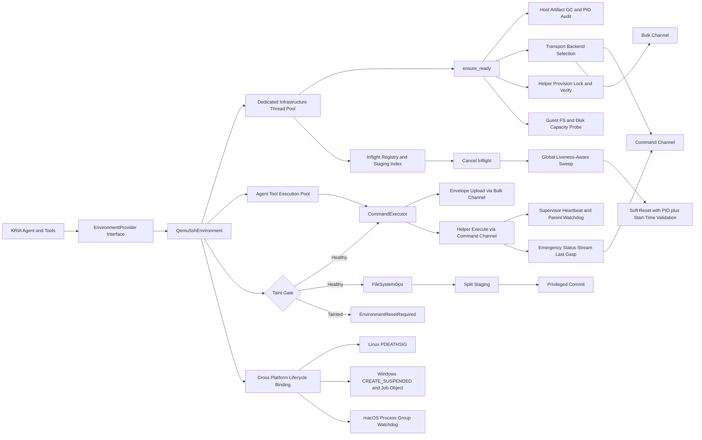

# RFC 002: Remote QEMU Execution Environment Provider

Status: Implemented
Author: KRIA Systems Architecture
Date: 2026-05-05
Target: KRIA core execution layer

## 1. Executive Summary

KRIA requires a transport-agnostic remote execution backend that preserves RFC-001 contracts while operating safely across local QEMU VMs and physical remote hosts.

This hardened revision closes all critical flaws from the previous draft and adds additional failure-path coverage:

- SFTP privilege escalation block on protected target directories
- Windows Job Object spawn-to-assign TOCTOU race
- Multiplexed transport head-of-line blocking
- Orphaned helper status-journal corruption
- Inflight cancellation disk exhaustion from stranded temporary files
- Absolute wall-clock TTL failure under clock skew
- Concurrent helper provisioning corruption
- Stale multiplex socket deadlocks after host crash
- Non-atomic lock lease takeover races
- False taint under guest CPU or IO starvation
- Epoch replay from integer-only fencing
- Parent identity confusion under PID reuse
- Live transfer deletion from heartbeat-blind sweeps
- Snapshot-distorted monotonic TTL edge cases
- Sudo probe and commit hangs under PAM or TTY quirks
- Taint-registration race at admission boundary
- Transport stale-socket mutation replay risk
- FD spike exhaustion under static admission estimates
- Windows OpenSSH ControlMaster incompatibility
- Provisioning lock deadlock after crash
- Cross-instance staging leakage
- Privileged commit symlink-race LPE vector
- Guest ENOSPC during privileged commit
- Host-side FD exhaustion from unbounded persistent connections
- Windows Session 0 graphical deadlock risk for QEMU
- Reset-path split-brain on network partition
- Host-side artifact leakage after crash
- Guest read-only filesystem mode causing control-plane failure
- Helper OOM or watchdog loss causing silent state divergence

## 2. Non-Negotiable Invariants

1. RFC-001 contract compatibility is mandatory.
- CommandExecutor, FileSystemOps, and EnvironmentLifecycle signatures remain unchanged.

2. Fail-closed behavior is mandatory.
- Any ambiguous remote mutation state transitions the provider to tainted state and requires reset.

3. Transport separation is mandatory.
- Logical command traffic and bulk transfer traffic are isolated to prevent HOL starvation.

4. Privileged writes are split-phase.
- Stage as unprivileged, commit as privileged with kernel-enforced path constraints.

5. Time and lock operations are bounded.
- No reset path may block indefinitely on lock acquisition or network calls.

6. Resource bounds are explicit.
- Disk, memory, file descriptor, and process lifecycle limits must be enforced by policy.

## 3. Mathematical Guardrails

Required inequalities and limits:

1. Disk headroom requirement before provider ready:

$$
available\_space\_bytes > 2 \times max\_command\_payload\_bytes
$$

2. Recommended safety reserve for practical operations:

$$
required\_free\_bytes = \max(2 \times max\_command\_payload\_bytes,\ 64\ \text{MiB})
$$

3. Runtime FD admission headroom:

$$
fd\_headroom(t) = fd\_soft\_limit - open\_fds(t) - fd\_reserve
$$

Admission rule:

$$
admit\_transport(t) \iff fd\_headroom(t) \ge fd\_per\_command\_budget
$$

4. Provisioning lock lease expiry condition:

$$
lock\_expired \iff now\_ms - lock\_acquired\_ms > helper\_lock\_timeout\_ms
$$

5. Liveness-taint triad requirement:

$$
taint\_for\_liveness = heartbeat\_miss \land journal\_silent \land pid\_ambiguous
$$

6. Monotonic receipt-time TTL rule:

$$
deadline\_monotonic\_ns = received\_monotonic\_ns + ttl\_ms\_from\_receipt \times 10^6
$$

## 4. Data Flow



## 5. Struct And Trait Definitions

### 5.1 Configuration Model

```rust
use std::path::PathBuf;

#[derive(Debug, Clone, Copy, PartialEq, Eq)]
pub enum GuestOsFamily {
    Posix,
    WindowsPowerShell,
    WindowsCmd,
}

#[derive(Debug, Clone, Copy, PartialEq, Eq)]
pub enum HostPlatform {
    Linux,
    Windows,
    MacOs,
}

#[derive(Debug, Clone, Copy, PartialEq, Eq)]
pub enum TargetKind {
    LocalQemuVm,
    PhysicalRemoteHost,
}

#[derive(Debug, Clone, Copy, PartialEq, Eq)]
pub enum ControlPlaneTransport {
    EphemeralSftpFile,
    SshSendEnvSmallPayload,
}

#[derive(Debug, Clone, Copy, PartialEq, Eq)]
pub enum SshTransportBackend {
    OpenSshControlMaster,
    RustSshChannels,
}

#[derive(Debug, Clone, Copy, PartialEq, Eq)]
pub enum PrivilegedCommitMode {
    Disabled,
    SudoMove,
    SudoHelperCommit,
}

#[derive(Debug, Clone)]
pub struct HelperProvisioning {
    pub required_helper_version: String,
    pub helper_manifest_path: PathBuf,
    pub helper_manifest_sig_path: PathBuf,
    pub helper_public_key_path: PathBuf,
    pub host_helper_cache_dir: PathBuf,
    pub remote_helper_dir: PathBuf,
    pub remote_helper_lock_dir: PathBuf,
    pub helper_lock_timeout_ms: u64,
    pub helper_lock_claim_retry_ms: u64,
    pub supervisor_heartbeat_interval_ms: u64,
    pub supervisor_heartbeat_timeout_ms: u64,
    pub worker_journal_silence_timeout_ms: u64,
    pub emergency_status_buffer_bytes: u64,
    pub last_gasp_packet_timeout_ms: u64,
    pub max_helper_rss_bytes: u64,
}

#[derive(Debug, Clone)]
pub struct SshMultiplexingConfig {
    pub enable_control_master: bool,
    pub control_path_cmd: PathBuf,
    pub control_path_bulk: PathBuf,
    pub control_persist_secs: u64,
    pub establish_timeout_ms: u64,
    pub control_check_timeout_ms: u64,
    pub allow_no_mux_for_test: bool,

    // Windows-only channel mode settings for Rust SSH backend.
    pub rust_ssh_max_parallel_channels: u32,
}

#[derive(Debug, Clone)]
pub struct FileCommitPolicy {
    pub remote_staging_dir: PathBuf,
    pub privileged_commit_mode: PrivilegedCommitMode,
    pub privileged_commit_helper_path: Option<PathBuf>,
    pub staging_sweep_ttl_secs: u64,
    pub staging_lease_heartbeat_timeout_ms: u64,
    pub staging_sweep_batch_limit: u32,
    pub enforce_linux_openat2: bool,
    pub privileged_probe_timeout_ms: u64,
    pub privileged_commit_timeout_ms: u64,
    pub disable_privileged_on_probe_failure: bool,
}

#[derive(Debug, Clone)]
pub struct GuestFilesystemPolicy {
    pub require_control_dir_writable: bool,
    pub require_staging_dir_writable: bool,
    pub require_non_readonly_mount: bool,
    pub min_free_bytes_floor: u64,
}

#[derive(Debug, Clone)]
pub struct ResetPolicy {
    pub admission_freeze_timeout_ms: u64,
    pub zombie_reap_timeout_ms: u64,
    pub lock_acquire_timeout_ms: u64,
    pub network_call_timeout_ms: u64,
    pub total_reset_deadline_ms: u64,
}

#[derive(Debug, Clone)]
pub struct ReplayCachePolicy {
    // Hard requirement: keep only current + previous epoch buckets.
    pub retained_epoch_buckets: u8,
    pub max_nonces_per_epoch: usize,
}

#[derive(Debug, Clone, Copy, PartialEq, Eq)]
pub enum InfrastructureTaskPriority {
    HighRecovery,
    MediumReconnect,
    LowMaintenance,
}

#[derive(Debug, Clone)]
pub struct InfrastructureRuntimeConfig {
    pub infra_worker_threads: usize,
    pub high_priority_queue_capacity: usize,
    pub medium_priority_queue_capacity: usize,
    pub low_priority_queue_capacity: usize,
    pub infra_spawn_timeout_ms: u64,
}

#[derive(Debug, Clone)]
pub struct SshPoolConfig {
    pub max_active_targets_hard_cap: u32,
    pub idle_ttl_secs: u64,
    pub sweep_interval_secs: u64,
    pub fd_soft_limit: u64,
    pub fd_reserve: u64,
    pub fd_per_command_budget: u64,
    pub fd_telemetry_sample_ms: u64,
}

#[derive(Debug, Clone)]
pub struct HostArtifactGcConfig {
    pub enable_gc: bool,
    pub gc_ttl_secs: u64,
    pub state_root_dir: PathBuf,
    pub host_binary_sha256_or_build_id: String,
}

#[derive(Debug, Clone)]
pub struct RemoteConfig {
    pub host_platform: HostPlatform,
    pub host: String,
    pub port: u16,
    pub username: String,
    pub ssh_key_path: PathBuf,
    pub guest_os_family: GuestOsFamily,
    pub target_kind: TargetKind,

    // Optional local VM bootstrap command for LocalQemuVm targets.
    pub qemu_boot_cmd: Option<String>,
    pub qemu_pid_state_file: PathBuf,

    // Stable provider identity and remote control roots.
    pub instance_id: String,
    pub remote_control_dir: PathBuf,

    // Transport and helper policies.
    pub transport_backend: SshTransportBackend,
    pub ssh_multiplexing: SshMultiplexingConfig,
    pub helper_provisioning: HelperProvisioning,
    pub control_transport: ControlPlaneTransport,
    pub envelope_ttl_ms: u64,
    pub max_command_payload_bytes: u64,

    // File and filesystem policies.
    pub file_commit_policy: FileCommitPolicy,
    pub guest_filesystem_policy: GuestFilesystemPolicy,

    // Reset and pooling policies.
    pub reset_policy: ResetPolicy,
    pub replay_cache_policy: ReplayCachePolicy,
    pub ssh_pool: SshPoolConfig,
    pub host_artifact_gc: HostArtifactGcConfig,
    pub infrastructure_runtime: InfrastructureRuntimeConfig,

    // Execution and limits.
    pub ssh_connect_timeout_ms: u64,
    pub command_timeout_ms: u64,
    pub boot_wait_timeout_ms: u64,
    pub poll_interval_ms: u64,
    pub shutdown_timeout_ms: u64,
    pub soft_reset_grace_ms: u64,
    pub soft_reset_kill_timeout_ms: u64,
    pub max_soft_reset_attempts: u32,
    pub inflight_drain_timeout_ms: u64,
    pub local_cancel_kill_timeout_ms: u64,
    pub max_stdout_bytes: u64,
    pub max_stderr_bytes: u64,
    pub max_read_file_bytes: u64,

    pub command_timeout_requires_reset: bool,

    // SSH hardening and workspace boundaries.
    pub known_hosts_path: Option<PathBuf>,
    pub strict_host_key_checking: bool,
    pub pinned_host_key_sha256: Option<String>,
    pub remote_workspace_root: Option<PathBuf>,
}
```

Mandatory policy-level requirements from this RFC:

- transport_backend
- ssh_multiplexing
- helper_provisioning
- file_commit_policy
- guest_filesystem_policy
- reset_policy
- replay_cache_policy
- ssh_pool
- host_artifact_gc
- infrastructure_runtime
- instance_id
- envelope_ttl_ms
- max_command_payload_bytes

### 5.2 Provider State

```rust
use std::collections::{HashMap, HashSet, VecDeque};
use std::path::PathBuf;
use std::sync::atomic::{AtomicBool, AtomicU64};
use arc_swap::ArcSwap;
use tokio::process::Child;
use tokio::runtime::Handle;
use tokio::sync::{Mutex, RwLock};
use tokio_util::sync::CancellationToken;
use uuid::Uuid;

#[derive(Debug, Clone)]
pub struct GuestCapabilities {
    pub supports_sftp_batch: bool,
    pub supports_privileged_commit_helper: bool,
    pub supports_openat2_commit: bool,
    pub supports_process_tree_kill: bool,
    pub supports_atomic_rename: bool,
    pub helper_version: String,
}

#[derive(Debug)]
pub struct ParentIdentity {
    pub pid: u32,
    pub start_time_ticks: u64,
    pub session_nonce: String,
}

#[derive(Debug, Clone)]
pub struct StagedArtifactLeaseMetadata {
    pub owner_instance_id: String,
    pub owner_pid: Option<u32>,
    pub owner_pid_start_time_ticks: Option<u64>,
    pub owner_binary_sha256_or_build_id: Option<String>,
    pub generation: u64,
    pub epoch_uuid: Uuid,
    pub artifact_nonce: String,
    pub created_unix_ms: u64,
    pub lease_heartbeat_unix_ms: u64,
    pub expected_sha256: String,
    pub bytes: u64,
}

#[derive(Debug)]
pub struct NonceEpochBucket {
    pub epoch_uuid: Uuid,
    pub max_nonces: usize,
    pub insertion_order: VecDeque<String>,
    pub nonce_set: HashSet<String>,
}

#[derive(Debug)]
pub struct NonceReplayCache {
    // Hard-bounded to exactly two buckets: current and previous.
    pub current: NonceEpochBucket,
    pub previous: Option<NonceEpochBucket>,
}

#[derive(Debug)]
pub struct InflightCommandHandle {
    pub command_id: String,
    pub generation: u64,
    pub epoch_uuid: Uuid,
    pub transport_generation_id: u64,
    pub cancel_token: CancellationToken,
    pub local_process_ids: Vec<u32>,
    pub remote_status_path: PathBuf,
    pub remote_tmp_paths: HashSet<PathBuf>,
    pub parent_identity: Option<ParentIdentity>,
    pub helper_supervisor_pid: Option<u32>,
    pub helper_worker_pid: Option<u32>,
    pub helper_worker_start_time_ticks: Option<u64>,
}

pub struct QemuSshEnvironment {
    config: RemoteConfig,
    qemu_child: Mutex<Option<Child>>,
    provider_spawned_qemu: Mutex<bool>,
    guest_capabilities: Mutex<Option<GuestCapabilities>>,
    // Borrowed handles owned by KRIA global runtime; provider must never shut them down.
    infra_runtime: Handle,
    // Borrowed handles owned by KRIA global runtime; provider must never shut them down.
    agent_tool_runtime: Handle,

    generation: AtomicU64,
    // Lock-free epoch snapshot to avoid hot-path contention during reset rotation.
    epoch_uuid: ArcSwap<Uuid>,
    transport_generation_id: AtomicU64,

    tainted: AtomicBool,
    taint_reason: Mutex<Option<String>>,
    admissions_frozen: AtomicBool,
    admission_inflight: AtomicU64,
    zombie_commands: RwLock<HashSet<String>>,
    reset_in_progress: AtomicBool,

    inflight_registry: RwLock<HashMap<String, InflightCommandHandle>>,
    staged_artifact_index: RwLock<HashMap<String, HashMap<PathBuf, StagedArtifactLeaseMetadata>>>,
    nonce_replay_cache: RwLock<NonceReplayCache>,
}
```

Runtime ownership contract:

1. KRIA global runtime owns infrastructure and agent runtimes.
2. QemuSshEnvironment borrows runtime handles only.
3. Provider shutdown must never attempt runtime teardown.

### 5.3 RFC-001 Trait Compatibility

RFC-001 signatures remain unchanged. This RFC modifies only provider internals and error semantics.

Compatibility requirements:

1. execute_command timeout ambiguity returns EnvironmentError::EnvironmentResetRequired.
2. read_file stream-over-limit returns EnvironmentError::StorageLimitExceeded.
3. Mutating ops fail fast while tainted.
4. reset_environment is the single recovery gateway.

## 6. Transport Backend Architecture

### 6.1 Platform Matrix

1. Linux and macOS hosts:
- OpenSSH dual logical channels with command and bulk separation.

2. Windows hosts:
- ControlMaster over UNIX-style control sockets is not relied upon.
- Provider must use Rust SSH backend (russh or ssh2) for parallel channel management.
- Command and bulk isolation is preserved as logical channels over separate SSH sessions or multiplexed channels managed in Rust.

3. Policy exception to earlier rule:
- The no-Rust-SSH-crate preference is retained for Linux and macOS.
- Windows explicitly relaxes this rule due to ControlMaster incompatibility.

### 6.2 OpenSSH Socket Lifecycle And Transport Fencing (Linux/macOS)

Before creating or removing any control path:

1. Run ssh -O check -S <path> as a hint only.
2. If hint says alive and target fingerprint matches, attempt reuse.
3. On first control-channel write failure, mark socket stale immediately.
4. Increment transport_generation_id and reconnect command plus bulk channels.
5. Never replay a blind mutating write from a prior transport generation.
6. Blind deletion remains forbidden unless stale detection or reconnect path is active.

### 6.3 Host-Side Artifact Garbage Collection

ensure_ready must perform host GC before transport activation:

1. Enumerate cached control sockets, pid state files, and helper scratch artifacts under host_artifact_gc.state_root_dir.
2. Parse embedded owner_pid, owner_pid_start_time_ticks, owner_binary_sha256_or_build_id, and instance metadata.
3. Treat owner as live only if pid + start_time + binary SHA-256 hash (or build-id) all match the active KRIA process.
4. If triple-check liveness fails or artifact age exceeds gc_ttl_secs, delete artifact.
5. Keep live artifacts from other active KRIA instances intact.

Binary fingerprint rule:

- host_binary_sha256_or_build_id must be captured from the running KRIA process and attached to host-side artifacts.
- PID liveness without matching binary fingerprint is treated as recycled and non-authoritative.

### 6.4 Dedicated Infrastructure Thread Pool Isolation

The following operations must run on the dedicated infrastructure thread pool, never on the agent tool-execution pool:

1. SSH multiplex control operations and reconnects.
2. SFTP control-plane calls and status-channel traffic.
3. Reset state-machine transitions, barriers, and token reaping.

Priority-aware scheduling is mandatory inside the infrastructure runtime:

1. High priority: reset, cancellation, admission barrier, zombie reaping.
2. Medium priority: transport reconnect, control-socket recovery.
3. Low priority: sweep and GC maintenance.

Scheduling guarantee:

- High-priority recovery work must never queue behind low-priority maintenance tasks.
- Reserved Slot Policy: at least 30% of high-priority queue capacity is reserved exclusively for Reset FSM operations.
- Cancellation floods must never consume Reset FSM reserved slots.

Isolation requirement:

- Infrastructure queue saturation must not block tool execution, and tool spikes must not starve reset recovery.

### 6.5 LRU Pool And Telemetry-Based FD Admission

Provider must use host-side LRU pool manager:

1. Track active targets with last-used timestamp.
2. If pool at max_active_targets_hard_cap, evict least-recently-used idle connection.
3. Eviction calls graceful close and then hard cleanup.
4. Periodic sweeper closes entries idle beyond idle_ttl_secs.
5. Runtime admission must acquire an FD semaphore permit derived from live telemetry.
6. On Linux, telemetry source is /proc/self/fd count. On other hosts, use equivalent process handle telemetry.

Hard requirement:

- Runtime FD semaphore from Section 3 is authoritative. Static caps are fallback guardrails only.

## 7. Helper Provisioning And Command Execution

### 7.1 Atomic Leased Lock Acquisition (Lock-Dir Pattern)

Lease object fields:

- lock_owner_instance_id
- lock_owner_pid
- lock_owner_pid_start_time_ticks
- lock_acquired_unix_ms
- lock_nonce

Acquisition algorithm:

1. Attempt mkdir(lockdir) or open(O_CREAT|O_EXCL) claim file for first-writer acquisition.
2. If acquisition succeeds, write lease metadata and fsync.
3. If lock exists, create temp_claim via O_EXCL in same parent directory.
4. Evaluate stale predicate using existing lease metadata plus owner liveness.
5. If stale, perform atomic rename(temp_claim -> lockdir) or equivalent kernel-atomic replacement.
6. If atomic claim fails because of race, remove temp_claim and retry with backoff.
7. On timeout, fail readiness.

Rule:

- No read-then-write overwrite flow is allowed for lease ownership transfer.
- Remote leased lock is the sole provisioning concurrency authority.
- Process-local helper provisioning mutexes are forbidden.

### 7.2 Concurrent-Safe Provisioning

1. Detect guest OS and architecture.
2. Validate manifest signature and helper digest locally.
3. Acquire leased lock.
4. Query existing remote helper digest and version.
5. If match, skip upload.
6. Else upload helper to unique temp path.
7. Verify remote temp digest.
8. Atomic rename temp to final helper path.
9. Run helper self-test, sudo probe, and capability probe.
10. Release lock.

### 7.3 Supervisor And Worker Split (Heartbeat Pattern)

kria-guest-helper must run as two roles:

1. Supervisor thread/process with elevated scheduling priority where supported.
2. Worker child process for command execution and heavy IO.

Responsibilities:

1. Supervisor emits heartbeat only and tracks worker identity.
2. Worker writes command journal and, by default, redirects stdout/stderr to guest-local log files or /dev/null.
3. Supervisor kills worker tree if parent identity fence breaks.
4. Supervisor persists terminal state with generation + epoch_uuid fencing.
5. Supervisor pre-allocates a 512 KB emergency status buffer at startup and verifies writeability.
6. If journal write returns ENOSPC, supervisor emits a high-priority Last Gasp terminal status packet over SSH command transport before exit.

Output pipe hardening rule:

- Streaming worker stdout/stderr to host transport is opt-in and only enabled for explicit debug or diagnostics requests.
- Default execution path must avoid host pipe backpressure dependence.

Evidence Authority Hierarchy (highest to lowest authority):

1. Journal file terminal record (authoritative).
2. Last Gasp packet (best-effort supplemental evidence).
3. Heartbeat inference only (lowest confidence).

Rule:

- Last Gasp packet is never the sole authoritative terminal state for irreversible success decisions.

Last Gasp packet minimum fields:

- command_id
- generation
- epoch_uuid
- nonce
- terminal_state
- exit_code_or_signal
- last_error

### 7.4 Triple-Check Parent Identity Watchdog

Helper launch includes parent identity triple:

- parent_ssh_session_pid
- parent_ssh_session_start_time_ticks
- parent_ssh_session_nonce

Validation requirements:

1. POSIX: validate pid and start_time via /proc/<pid>/stat.
2. Windows: validate pid and creation timestamp via process APIs.
3. macOS: validate pid and process start metadata via proc APIs.
4. If any check fails, classify parent as ambiguous and trigger supervisor stop policy.

### 7.5 Liveness Taint Decision Rule

Additional discovered flaw: guest starvation can cause heartbeat jitter and false taint.

Mandatory taint condition:

$$
taint\_for\_liveness = heartbeat\_miss \land journal\_silent \land pid\_ambiguous
$$

Operational semantics:

1. heartbeat_miss uses supervisor_heartbeat_timeout_ms.
2. journal_silent uses worker_journal_silence_timeout_ms.
3. pid_ambiguous uses triple-check failure in Section 7.4.
4. Any single signal alone does not taint the provider.

### 7.6 Helper OOM / Heartbeat Loss Mitigation

Additional discovered flaw: helper may be OOM-killed and leave command state ambiguous.

Required solution:

1. Supervisor emits heartbeat records at supervisor_heartbeat_interval_ms.
2. Host expects heartbeat within supervisor_heartbeat_timeout_ms.
3. Missed heartbeat enters suspect state; taint is triggered only by the triad in Section 7.5.
4. reset_environment must treat heartbeat-loss commands as ambiguous and perform recovery sweep plus process validation.
5. Helper runtime memory budget is enforced by config.max_helper_rss_bytes where platform supports it.

### 7.7 Envelope Model, Cryptographic Epoch, And Clock Safety

```rust
#[derive(Debug, Serialize, Deserialize)]
struct ExecutionEnvelope {
    command_id: String,
    generation: u64,
    epoch_uuid: [u8; 16],
    transport_generation_id: u64,
    instance_id: String,
    issued_at_host_unix_ms_info_only: u64,
    ttl_ms_from_receipt: u64,
    nonce: String,
    parent_session_nonce: String,
    parent_ssh_session_pid: Option<u32>,
    parent_ssh_session_start_time_ticks: Option<u64>,
    cwd: String,
    env: std::collections::BTreeMap<String, String>,
    program: String,
    args: Vec<String>,
    command_sha256: String,
    stdin_mode: String,
}
```

Acceptance fence rules:

- Primary anti-replay fence is (generation, epoch_uuid, nonce) uniqueness.
- TTL is secondary and must not be the sole authority for replay safety.
- TTL must be computed only from monotonic receipt-time, never from absolute Unix timestamp.
- issued_at_host_unix_ms_info_only is observability-only metadata and must not be used in expiry math.
- Helper computes local deadline from monotonic receipt time; host wall clock remains informational.
- Guest helper must enforce (command_id, epoch_uuid) initialization uniqueness and reject duplicate initialize requests.

## 8. File Operations And Privileged Commit

### 8.1 read_file

1. effective_limit = min(request.max_bytes, config.max_read_file_bytes).
2. Reject non-regular files by default.
3. Stream over bulk channel with chunk accounting.
4. On first byte beyond effective_limit, abort transfer and return StorageLimitExceeded.

### 8.2 write_file Split Staging

1. Validate canonical destination path.
2. Upload to remote_staging_dir/<instance_id>/<command_id>.upload.tmp.
3. Persist lease metadata sidecar and register in staged_artifact_index.
4. Update lease_heartbeat_unix_ms during long uploads.
5. Verify staging digest and size.
6. Commit with privileged helper (preferred) or guarded sudo mv fallback.

Heartbeat-aware staging metadata contract:

```rust
#[derive(Debug, Serialize, Deserialize)]
struct ArtifactLeaseMetadata {
    owner_instance_id: String,
    owner_pid: Option<u32>,
    owner_pid_start_time_ticks: Option<u64>,
    generation: u64,
    epoch_uuid: [u8; 16],
    artifact_nonce: String,
    created_unix_ms: u64,
    lease_heartbeat_unix_ms: u64,
    expected_sha256: String,
    bytes: u64,
}
```

### 8.3 Linux LPE Hardening Requirement

For Linux privileged commit helper, openat2 with kernel path resolution constraints is mandatory:

- RESOLVE_BENEATH
- RESOLVE_NO_SYMLINKS

The commit helper must refuse operation if openat2 constraints cannot be enforced.

### 8.4 ENOSPC Mitigation

ensure_ready must perform preflight capacity check and fail readiness unless:

$$
available\_space\_bytes > 2 \times max\_command\_payload\_bytes
$$

Provider should additionally warn if available space is below GuestFilesystemPolicy.min_free_bytes_floor.

Emergency evidence preservation under ENOSPC:

1. Supervisor must reserve exactly 512 KB emergency_status_buffer_bytes for terminal-status persistence.
2. If journal write path returns ENOSPC, supervisor emits Last Gasp packet on the command stream with priority over non-terminal telemetry.
3. Host records Last Gasp as provisional evidence only when generation + epoch_uuid + nonce fencing validates.
4. Journal record remains authoritative whenever available; Last Gasp must not override an authoritative journal terminal state.
5. If only Last Gasp is present, use it for recovery classification and audit hints, not irreversible success finalization.
6. If emergency buffer allocation fails at helper startup, ensure_ready fails closed for command execution mode.

### 8.5 Read-Only Guest Filesystem Mitigation

Additional discovered flaw: control and staging paths may be mounted read-only.

Required solution:

1. ensure_ready writes and fsync-validates probe files in remote_control_dir and remote_staging_dir.
2. If either path is not writable, provider fails with StartupPolicyNotReady.
3. No silent fallback to in-memory-only journals.

### 8.6 Staging Sweep Policy

1. Instance-scoped cleanup for active reset path remains required.
2. Global TTL sweep is also mandatory:
- delete an artifact only if all predicates are true:
    - expired by staging_sweep_ttl_secs
    - no recent lease heartbeat (older than staging_lease_heartbeat_timeout_ms)
    - owner is dead (pid plus start-time identity no longer valid)

This prevents multi-instance historical leakage and disk accumulation.

### 8.7 Privileged Probe And Commit Hang Safeguards

1. ensure_ready must run privileged probe via timeout wrapper:
     - timeout --kill-after=<hard> <soft> sudo -n true
2. Privileged commit execution must also run inside timeout --kill-after wrapper.
3. If probe fails, hangs, or times out during ensure_ready, privileged mode is disabled for the provider runtime.
4. If disable_privileged_on_probe_failure is false, provider fails readiness instead.
5. No privileged flow may rely on blocking sudo calls without timeout guards.

## 9. Environment Lifecycle Design

### 9.1 Linux Host

1. Spawn QEMU with pre_exec hook.
2. Set PR_SET_PDEATHSIG to SIGKILL.
3. Validate parent after prctl to avoid orphan race.
4. Persist pid state with fsync.

### 9.2 Windows Host

1. Create Job Object with KILL_ON_JOB_CLOSE.
2. Spawn QEMU with CreateProcessW and CREATE_SUSPENDED | CREATE_NEW_PROCESS_GROUP.
3. Assign process to Job Object before ResumeThread.
4. On assignment failure, terminate process and fail startup.

Mandatory sequence integrity:

- The required API order is strict: CreateProcessW(CREATE_SUSPENDED) -> AssignProcessToJobObject -> ResumeThread.
- No intermediate user-defined actions are allowed between these steps except direct error checks and rollback.

Windows Session 0 safeguard:

- qemu_boot_cmd must explicitly include one of:
  - -display none
  - -vnc :0

- If missing, ensure_ready fails closed to prevent graphical hang in Session 0 service context.

### 9.3 macOS Host

1. Spawn QEMU in dedicated process group.
2. Parent-exit watchdog kills process group if parent dies.
3. Persist pid state for audit recovery.

### 9.4 Orphan Audit And Shutdown

ensure_ready startup audit:

1. Check qemu_pid_state_file.
2. Validate process identity by start-time and command fingerprint.
3. Cleanup stale processes.

shutdown:

1. Attempt graceful guest shutdown.
2. Enforce timeout.
3. Force-kill provider-owned process group if needed.
4. Close command and bulk transport handles.
5. Remove state files only after verified process death.

## 10. Taint And Reset Policy

### 10.1 State Machine

- Healthy -> Tainted
- Tainted -> AdmissionsFrozen
- AdmissionsFrozen -> BarrierReached
- AdmissionsFrozen -> ZombieReaping
- ZombieReaping -> BarrierReached
- BarrierReached -> CancelingInflight
- CancelingInflight -> SweepingArtifacts
- SweepingArtifacts -> Recovering
- Recovering -> Healthy
- Recovering -> Degraded

### 10.2 Atomic Admission Epoch Gate And Timeout Requirements

1. reset acquisition uses reset_in_progress.compare_exchange(false, true) with try-lock semantics and bounded retry budget reset_policy.lock_acquire_timeout_ms.
2. If retry budget is exhausted, return ResetAlreadyInProgress with no queued waiters.
3. Reset FSM, SSH multiplex control, and SFTP control calls run only on the dedicated infrastructure thread pool.
4. Reset and cancellation tasks must be enqueued at HighRecovery priority.
5. On taint, set tainted=true, then freeze admissions immediately.
6. Admission barrier waits for admission_inflight == 0 with reset_policy.admission_freeze_timeout_ms.
7. Snapshot inflight registry only after barrier or zombie reaping reaches a stable boundary.
8. If barrier timeout occurs, treat remaining entries as zombies (including panic-path or missed-decrement cases), force-reap cancellation tokens, synthesize barrier completion, and continue reset.
9. Zombie reaping is bounded by reset_policy.zombie_reap_timeout_ms.
10. Any late terminal status whose epoch_uuid does not match the current epoch_uuid must be dropped and must never mutate current generation state.
11. Every reset-path remote call is wrapped in reset_policy.network_call_timeout_ms.
12. reset_environment enforces total deadline reset_policy.total_reset_deadline_ms.

This closes split-brain and lock-hold deadlock classes.

### 10.3 Soft Reset Algorithm

1. Try-acquire reset_in_progress atomic flag.
2. Dispatch reset workflow onto dedicated infrastructure thread pool.
3. Set tainted=true.
4. Freeze admissions.
5. Wait admission barrier (admission_inflight == 0).
6. If barrier timeout, enter ZombieReaping and force-reap tracked tokens.
7. Snapshot inflight registry and staging index after barrier stabilization.
8. Cancel inflight commands and local processes.
9. Wait bounded drain.
10. Run instance-scoped cleanup.
11. Run global liveness-aware staging sweep.
12. Query command journal for offending command_id.
13. Reject journal if generation/epoch_uuid/instance_id mismatch.
14. Validate parent identity by pid + start_time + session_nonce.
15. Kill process tree by guest OS strategy.
16. Verify process no longer alive under same triple identity.
17. Remove stale control artifacts.
18. Increment generation and rotate epoch_uuid (fresh 128-bit random).
19. On epoch rotation, rotate nonce replay buckets to current + previous and drop any older epoch bucket immediately.
20. Bump transport_generation_id if transport reconnect occurred.
21. Clear taint, unfreeze admissions, and release reset_in_progress flag.

### 10.4 Recovery Failure Handling

1. LocalQemuVm:
- after max_soft_reset_attempts, hard recycle VM and rerun ensure_ready.

2. PhysicalRemoteHost:
- bounded retries, then Degraded with explicit operator action required.

## 11. Security Strategy

### 11.1 SSH And Credential Policy

- Key-based auth only for automation mode.
- Strict key file permissions.
- No secret logging.
- Batch mode enabled; no interactive password prompts.

### 11.2 Host Authenticity

- Strict host key checking enabled by default.
- known_hosts explicit path support.
- Host key pinning required for production.

### 11.3 Helper Supply Chain

- Manifest signature verification with pinned public key.
- Digest verification pre-upload and post-upload.
- Version and digest mismatch forces controlled reprovision.

### 11.4 Payload Integrity And Replay Defense

- Signed envelope with nonce, generation, epoch_uuid, transport_generation_id, and instance_id.
- Nonce replay store is hard-bounded to current epoch plus previous epoch only.
- Each epoch bucket has max_nonces_per_epoch hard cap with oldest-first eviction.
- On epoch rotation, drop buckets older than previous epoch immediately.
- Nonce replay keying is by instance_id plus generation plus epoch_uuid.
- TTL is secondary; replay cache plus epoch fence is primary.
- Snapshot or suspend anomalies must not bypass nonce plus epoch replay checks.
- Guest helper rejects duplicate initialize requests for any previously seen (command_id, epoch_uuid) pair.

### 11.5 Privileged Commit Isolation

- Split staging is mandatory.
- Linux privileged commit must enforce openat2 resolve constraints.
- Destination symlink and parent symlink traversal are rejected.

### 11.6 Artifact Hygiene

- Control and temporary artifacts have bounded TTL cleanup.
- Host-side GC and guest-side sweep both required.
- Failed transfers must preserve enough metadata for cleanup.

### 11.7 Fail Closed Rules

Any of the following fails provider readiness or command execution with explicit error:

- lock acquisition timeout
- admission barrier timeout with failed zombie reaping
- reset try-lock retry budget exhaustion
- infrastructure thread-pool unavailability
- network timeout in reset path
- sustained liveness triad (heartbeat loss + journal silence + ambiguous parent identity)
- invalid host key
- payload signature mismatch
- read-only control filesystem
- insufficient disk headroom
- privileged sudo probe timeout or hang

No silent local fallback is permitted.

## 12. Five-Phase Implementation Checklist (Implemented)

Implementation completion: 100%

Completion audit:

- [x] Output Pipe Redirection (Sec 7.3): Helper worker stdout/stderr default redirection to guest-local logs or /dev/null with opt-in host streaming is implemented.
- [x] SHA-256 Binary Fingerprinting (Sec 6.3): Host artifact owner validation enforces pid + start-time + binary fingerprint triple-check.
- [x] Dual-Barrier Admission Rule (Sec 10.2): Reset barrier requires admission_inflight drain and inflight_registry stabilization, with bounded zombie-reap fallback.
- [x] Reserved Slot Policy for Infra Pool (Sec 6.4): High-priority reset slots are reserved and protected from cancellation-flood starvation.

### Phase 1: Contracts And Transport Foundation

- [x] Create remote_qemu provider module
- [x] Implement RemoteConfig with transport_backend, reset_policy, ssh_pool, and host_artifact_gc
- [x] Implement lock-free epoch_uuid snapshot (ArcSwap or portable AtomicU128 wrapper) on command hot-path
- [x] Implement bounded nonce replay cache policy (current + previous epoch only)
- [x] Implement platform matrix selection (OpenSSH on Linux/macOS, Rust SSH backend on Windows)
- [x] Add host-side artifact GC with pid + start_time + binary SHA-256 or build-id verification
- [x] Add LRU connection pool manager with telemetry-driven FD semaphore admission
- [x] Add transport_generation_id fencing for stale-socket reconnects

Exit criteria:

- Platform transport backend selected deterministically.
- FD budget guard active and validated.

### Phase 2: Helper Provisioning And Command Pipeline

- [x] Implement atomic lock-dir lease acquisition with kernel-atomic takeover rename
- [x] Remove process-local provisioning lock and rely solely on remote leased lock authority
- [x] Implement concurrent-safe helper upload using temp path plus digest plus atomic rename
- [x] Implement supervisor plus worker helper split and heartbeat policy
- [x] Implement default worker stdout/stderr redirection to guest-local log files or /dev/null with opt-in host streaming
- [x] Implement triple-check parent identity watchdog (pid plus start_time plus session_nonce)
- [x] Implement envelope model with generation plus epoch_uuid fencing
- [x] Enforce generation/epoch_uuid/instance_id journal ownership checks
- [x] Enforce helper-level (command_id, epoch_uuid) uniqueness rejection for duplicate initialize requests
- [x] Implement Evidence Authority Hierarchy (Journal > Last-Gasp > Heartbeat inference)

Exit criteria:

- Stale helpers cannot emit valid terminal success.
- Lock deadlock after crash is recoverable.

### Phase 3: FileSystemOps And Privileged Commit Hardening

- [x] Implement split staging upload path
- [x] Implement privileged commit helper flow
- [x] Enforce Linux openat2 resolve constraints
- [x] Enforce stream-level read limits
- [x] Implement ensure_ready disk headroom and writable-path probes
- [x] Implement heartbeat-aware staging lease metadata and liveness-aware global sweep
- [x] Add sudo timeout --kill-after wrappers and privileged-mode probe downgrade behavior

Exit criteria:

- Protected writes succeed through staged privileged commit.
- Symlink race and ENOSPC classes are mitigated.

### Phase 4: Lifecycle Binding Across Platforms

- [x] Implement Linux PDEATHSIG binding
- [x] Implement Windows CREATE_SUSPENDED plus Job Object assignment ordering
- [x] Enforce Windows Session 0 display-safe qemu_boot_cmd policy
- [x] Implement macOS process-group watchdog
- [x] Implement startup orphan audit and shutdown verification

Exit criteria:

- Provider-owned QEMU cannot leak across crash scenarios.

### Phase 5: Taint, Reset, And Chaos Validation

- [x] Implement reset_in_progress atomic try-lock semantics with non-blocking ResetAlreadyInProgress return
- [x] Isolate reset FSM, SSH multiplex control, and SFTP control calls on dedicated infrastructure thread pool
- [x] Add infrastructure priority queues (HighRecovery, MediumReconnect, LowMaintenance) with starvation safeguards
- [x] Implement atomic admission epoch gate (tainted -> freeze -> barrier -> snapshot)
- [x] Implement admission barrier self-healing with zombie marking and force-reap fallback
- [x] Wrap all reset-path network calls in strict timeouts
- [x] Implement sweep plus soft-reset plus validation pipeline
- [x] Add chaos tests for partition, clock skew, VM suspend/resume TTL drift, helper OOM, lock takeover, FD pressure, stale artifacts, and infra-thread-pool starvation
- [x] Add ENOSPC last-gasp evidence preservation tests (journal-full with terminal-status recovery)
- [x] Keep replay protection intentionally simple and bounded (no Raft, no Bloom filters)

Exit criteria:

- Reset path is bounded, auditable, and deadlock-free.
- RFC-001 contract behavior remains stable to upstream callers.

## Appendix A: Non-Goals

- Replacing KRIA policy engine semantics
- Replacing tool APIs
- Introducing cloud orchestration in this phase
- Rewriting all SSH transport stacks across all platforms

## Appendix B: Immediate Follow-Up RFC Candidates

- Remote target inventory and pooling policy
- Helper binary signing rotation and key lifecycle
- VM snapshot orchestration and rollback strategy
- Adaptive transport QoS and per-command priority scheduling