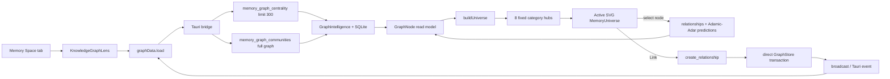
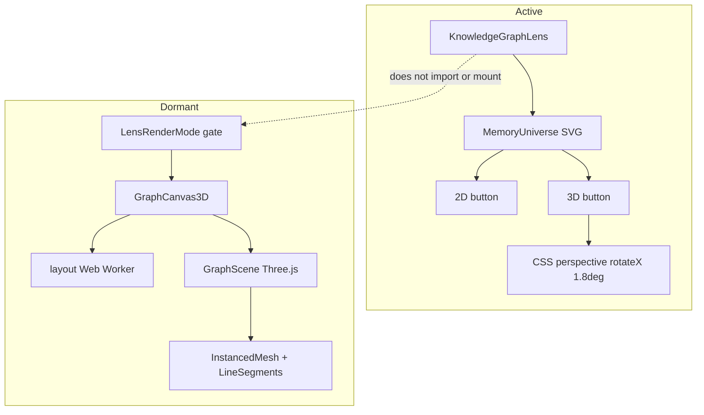
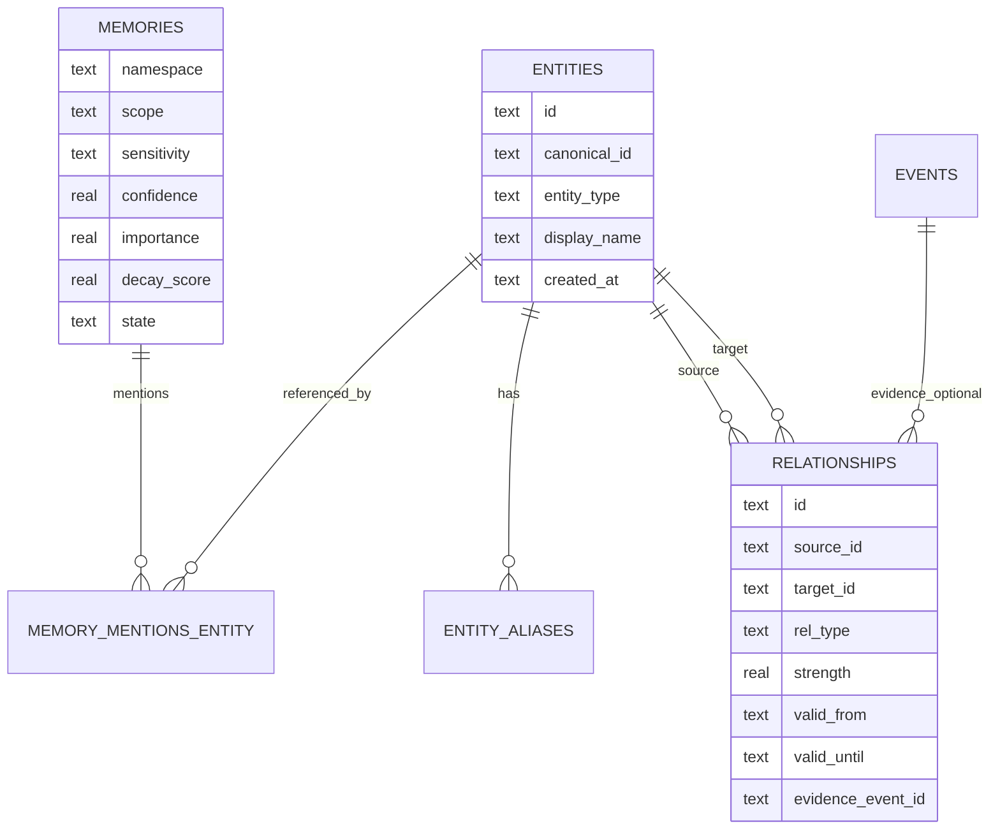

# KRIA Memory Graph Comprehensive Audit

**Status:** Canonical pre-redesign review  
**Audit date:** 2026-07-22  
**Mode:** Read-only architecture-to-UI audit  
**Audience:** Product, design, graphics, frontend, backend, memory, accessibility, security, and performance owners  
**Reviewed build:** Current repository state; active SVG universe plus disconnected Three.js path  
**Confidence:** High for static architecture/code findings; medium for experiential and resource estimates not measured in a live WebKitGTK profile  
**Disposition:** This remains the canonical pre-redesign audit and current-state evidence source. The planned target is defined by `.kiro/specs/memory-graph-production-redesign/`; its `traceability.md` preserves all 65 findings and 31 opportunities as Planned/Unverified until commit-specific evidence passes. This audit does not prove redesign implementation.

# Executive Summary

KRIA's Memory Graph has a compelling visual premise but is not public-launch ready. Current shipped experience is an attractive, deterministic SVG “memory universe” wrapped around a graph-shaped backend, yet it frequently presents inferred, synthetic, or UI-invented meaning as factual AI cognition. Most important mismatch: visible “3D” mode is not 3D. It is the same 2D SVG with a slight CSS perspective tilt. A real Three.js renderer exists, but active lens never mounts it. More fundamentally, initial visualization does not render backend relationships: it invents eight category hubs, classifies entities from label keywords or community modulo, and draws hub spokes that are not knowledge edges. Actual relationships arrive only after selection and accumulate locally.

This creates severe truth, utility, and product-identity problems. Graph looks like KRIA's brain but does not show how KRIA retrieves memories; retrieval remains vector + FTS, with graph expansion explicitly deferred. Inspector displays deterministic ID-derived “confidence,” derived “importance,” generic summaries, and “synchronized moments ago” language without backend evidence. “Semantic search” is substring filtering over at most 300 already-loaded nodes. Community labels are connected components, not semantic communities. Public users could reasonably infer capabilities and evidence that do not exist.

Architecture has good foundations: one SQLite authority, WAL readers, serialized writes, cycle-safe bounded traversal, a GraphStore seam, event-driven refresh, parameterized SQL, typed frontend shaping, an accessible table fallback, reduced-motion handling, worker-based force layout, instanced Three.js nodes, deterministic tests, and explicit Linux/WebKitGTK rendering posture. Those strengths are undermined by disconnected render paths, transport parity drift, graph-wide synchronous analytics in async commands, no incremental/paginated graph contract, duplicate relationship growth, missing scope/sensitivity controls, unauthenticated permissive server routes, and relationship materialization bypassing write-policy/audit/provenance.

At 100 nodes, experience is visually legible but semantically shallow. At 1,000 nodes, active 300-node cap hides scale without honest totals while backend still computes whole-graph communities. At 10,000+, graph-wide adjacency and degree scans become visible latency sources. At 100,000–1,000,000 nodes, current API, SQLite query patterns, full refresh, layout model, local filtering, and interaction model fail as a product even if storage remains technically operable.

**Launch verdict: No-go.** Preserve visual ambition and local-first foundations, but next iteration must first restore epistemic honesty, useful knowledge tasks, privacy boundaries, and one authoritative rendering/data contract. “True 3D” should remain optional and evidence-gated; it must earn value beyond spectacle.

# Overall Product Rating

| Dimension | Score | Readiness |
|---|---:|---|
| Product value / task utility | 42/100 | Prototype |
| UX and interaction | 48/100 | Alpha |
| UI craft / visual identity | 70/100 | Strong concept, incomplete system |
| Information visualization | 34/100 | Demo, not analytical tool |
| True 3D / spatial interaction | 18/100 | Claim not met in active UI |
| Rendering architecture | 50/100 | Promising dormant path |
| Frontend architecture | 55/100 | Split-brain implementation |
| Backend / data architecture | 58/100 | Personal-scale foundation |
| Performance / scalability | 38/100 | Bounded demo scale |
| Accessibility | 51/100 | Good fallback, weak primary graph |
| Security / privacy | 29/100 | Public-launch blocker |
| AI trust / explainability | 22/100 | Public-launch blocker |
| **Overall weighted score** | **43/100** | **No-go for public launch** |

**Finding count:** 7 Critical · 17 High · 28 Medium · 13 Low = **65 findings**.  
**Recommendation count:** 65 finding directions + 31 opportunity recommendations = **96 total recommendations**.

# Current State

## Audit scope and method

This audit traced active UI, dormant renderer, state store, Tauri bridge, desktop commands, memory facade, graph intelligence, SQLite GraphStore, schema, extraction/entity resolution, server transport, event propagation, tests, specs, graphics guidance, and generated screenshots. It used repository dependency mapping plus focused reads; no runtime, data, source, config, or test file was modified. The only created artifact is this report.

Primary evidence:

- Active UI: `ui/src/shell/spaces/memory/graph/KnowledgeGraphLens.tsx`, `MemoryUniverse.tsx`, `memoryUniverseModel.ts`, `KnowledgeGraphLens.css`.
- Read model: `graphData.ts`, `graphModel.ts`, `MemoryGraphFallback.tsx`.
- Dormant 3D: `GraphCanvas3D.tsx`, `GraphScene.ts`, `layout.worker.ts`, `layoutSettle.ts`, `lensController.ts`.
- Platform posture: `platform/capabilities.ts`, `platform/renderMode.ts`, `platform/LensRenderMode.tsx`, `prototypes/gateProbes.ts`.
- Backend: `crates/kria-desktop/src/commands/memory.rs`, `crates/kria-core/src/memory/{api,graph_intel,extraction,entity_resolution,retriever}.rs`, `stores/sqlite_graph.rs`, schema `0001_init.sql`.
- Server: `crates/kria-server/src/{memory_routes,lib,auth,main}.rs`.
- Tests/assets: graph unit tests, `ui/e2e/memory-graph-visuals.spec.ts`, `ui/test-results/memory-universe-final.png`, `ui/test-results/memory-universe-inspector.png`.
- Product intent: `.kiro/specs/kria-ui-redesign/{requirements,design,PROTOTYPE_GATES}.md`, `MEMORY_ARCHITECTURE_FINAL.md`, `docs/LINUX_GRAPHICS.md`.

Limits: generated PNGs are referenced but were not pixel-inspected through an image-analysis tool. No live Tauri/WebKitGTK profiling, GPU capture, screen-reader session, touch session, colorimeter/contrast capture, or usability study was run. Resource figures below are engineering estimates, not benchmark claims.

## Active runtime architecture

## Intended versus actual rendering architecture

The active test explicitly asserts no `<canvas>` and eight SVG hubs. Therefore the user-facing 3D claim is objectively unmet, regardless of dormant code quality.

## Data semantics

Important disconnect: rich memory truth fields do not cross into `GraphNode`, which contains only `id`, `label`, `community`, and `centrality`. UI then fabricates substitutes rather than declaring fields unavailable.

# Product Review

## First impression and emotional impact

The dark “universe” treatment, central luminous KRIA core, radial clusters, glass controls, orbit lines, moving particles, and inspector produce immediate spectacle. It is more memorable than a conventional table and could become recognizable in screenshots. Visual direction communicates “living AI system,” not “database admin.” This is the strongest part of current work.

However, spectacle is fragile because interaction quickly reveals shallow causality. Nodes sit in fixed themed constellations regardless of real topology. The core is always central but has no represented entity or reasoning role. Labels appear mainly on hover. Toolbar modes mostly alter opacity. “Timeline” does not map time. “3D” does not add spatial navigation. The experience moves from premium first impression to staged demo once a user asks: Why is this node here? What does this line mean? Why did KRIA use it? Can I trace an answer? Current product cannot answer reliably.

**Signature-feature test:** visually shareable, not yet behaviorally recommendable. Users may show a screenshot, but experts will not trust it as a knowledge instrument. A signature feature needs a repeatable job—finding forgotten context, validating AI memory, tracing why an answer happened, discovering evidence-backed connections—not only a memorable composition.

## Onboarding, discoverability, and learnability

No graph-specific onboarding explains entity extraction, centrality, communities, predictions, category assignment, or difference between displayed hubs and stored relationships. Empty state tells users to run extraction from Cognition, exposing implementation workflow instead of guiding a meaningful first success. There is no sample journey, progressive first-use annotation, semantic legend for relation types, or explanation of confidence provenance.

Discoverability is mixed. Search, toolbar, zoom, dimensions, inspector, legend, and accessible list are visible. Yet controls overpromise: `⌘K` is decorative, “Semantic search” is lexical filtering, “Knowledge Lens” is only a style state until predictions exist, “Auto arrange” resets selection/camera rather than arranging, pin has no effect in active deterministic layout, and 3D only tilts SVG. This breaks learned trust: visible affordances should perform their named action.

## Product strengths

1. Strong local-first visual identity and a plausible “KRIA brain” metaphor.
2. Always-available table path provides a practical basis for low-power/accessibility use.
3. Entity extraction, relationship inference, temporal relationship fields, graph operations, and event updates form useful substrate.
4. Predicted-link materialization is an interesting human-in-the-loop knowledge-building action.
5. Linux graphics constraints are acknowledged explicitly rather than hidden.
6. Deterministic layout stabilizes screenshots and spatial memory at small scale.

## Product weaknesses

1. Graph is not connected to answer retrieval, so “brain” metaphor is structurally false.
2. Visual topology is largely presentation-generated rather than knowledge-generated.
3. UI communicates unsupported AI certainty and recency.
4. Graph offers no primary user task, success state, or measurable outcome.
5. No correction workflow for category, entity merge, edge type, edge direction, confidence, provenance, or false prediction.
6. Current design favors ambient wonder over epistemic control, despite Memory Space requirement to “see, trust, and correct what KRIA knows.”

# UX Audit

## Core task flows

| Flow | Current behavior | UX assessment |
|---|---|---|
| Enter graph | Full graph analytics load; radial universe appears | Attractive, but no orientation or stated purpose |
| Find memory | Local substring dimming over loaded nodes | Fast at 300, incomplete and mislabeled semantic |
| Select memory | Camera recenters; inspector opens; backend relationships/predictions load | Useful pattern, but async races and synthetic inspector reduce trust |
| Explore relationship | New edges appear after selection; endpoints may show truncated IDs | Context is partial, unstable, and not provenance-aware |
| Discover knowledge | Browse fixed category hubs and predicted links | Categories may be wrong; predictions lack evidence path |
| Confirm link | Click Link; direct relationship is persisted | No preview, type choice, rationale, undo, duplicate protection, or audit evidence |
| Correct graph | Table can hide/pin; no entity/edge correction | Does not satisfy trust-and-correct product promise |
| Understand KRIA answer | No answer-to-memory deep link/path in graph | Key AI explainability journey missing |

## Heuristic evaluation

| Heuristic | Rating | Evidence |
|---|---:|---|
| Visibility of system status | 2/5 | Loading/error exist, but green “active,” sync recency, and counts are unreliable |
| Match with real world | 2/5 | Friendly categories; technical centrality/community concepts lack explanation |
| User control | 2/5 | Pan/zoom/focus; no undo for materialization, no correction, fake pin in active view |
| Consistency | 2/5 | SVG, table, and dormant 3D expose different capabilities and semantics |
| Error prevention | 1/5 | Link writes lack preview/validation; races and stale edges possible |
| Recognition over recall | 3/5 | Visible controls and legend help; edge/node meanings remain hidden |
| Flexibility / efficiency | 2/5 | Some keyboard support; no real shortcuts, saved views, query language, multi-select |
| Minimalism | 3/5 | Strong hierarchy at low density; decorative layers compete with information |
| Error recovery | 2/5 | Load error exists; no retry, partial-failure detail, cancellation, or rollback |
| Help / documentation | 1/5 | No in-product explanation of graph semantics or source evidence |

## Mental model and confidence

Users see “memories,” but nodes are entities extracted from memories. A person, URL, repository, path, or proper noun is not a memory record. Status says “active memories,” hub counts say “memories,” and search says “memories,” while backend returns entities. This category error propagates through every interaction. It obscures what deletion, correction, confidence, and relationships mean.

Users also cannot distinguish four relation classes:

1. stored entity relationships;
2. co-mention edges generated automatically;
3. Adamic-Adar predicted links;
4. UI-created category spokes and core branches.

All are graph-like lines but only some exist in authority storage. Legend’s “Strong connection” and “Weak connection” do not map relationship `strength`; active SVG ignores it. Confidence and importance percentages appear precise despite synthetic derivation. This is an epistemic UX failure, not cosmetic copy debt.

## Empty, loading, partial, and failure states

- Empty state is operational (“run entity extraction”) rather than value-oriented and does not explain why graph is empty.
- Loading overlays existing/stale universe rather than establishing whether visible data is current.
- Communities failure silently assigns neutral communities while overall error remains null; partial degradation is invisible.
- Selection expansion failures are silently ignored; inspector may say zero/emerging context rather than “failed to load.”
- Materialization failure has no visible feedback in active SVG inspector.
- Backend unavailable notice says category universe “remains explorable,” but empty data can make that claim meaningless.
- No oversized/malformed data guard, timeout-specific UI, retry action, offline snapshot status, or stale-data marker.

# UI Audit

## Visual craft

Composition is polished at screenshot scale. Central focal point, restrained node sizes, eightfold radial balance, layered gradients, tokenized colors, luminous edges, glass panels, mono eyebrow labels, and consistent rounded geometry create a coherent sci-fi language. Design feels intentionally art-directed rather than default component assembly.

Craft breaks at system level:

- Three independent glass overlays at top plus vertical camera rail create collision risk.
- Inspector overlays graph rather than reserving space, occluding right-side clusters.
- 8 px SVG labels and 9 px UI microcopy are too small at typical laptop density and worse under scaling.
- Glow, blur, stars, nebula, animated dash, orbit, particles, and breathing core create competing depth cues.
- Category tones are close in cyan/blue/teal space; recognition relies heavily on position.
- Labels appear only on hover/focus, preventing overview scanning and touch discovery.
- All memory nodes are spheres/dots; entity types have weak recognition beyond first four icons per hub.
- Fixed 1100×720 world and fixed hub coordinates leave dead space or compression depending viewport.
- “3D” visual tilt adds distortion but no information.

## Design-system consistency

Graph uses shared tokens and kit icons, which is positive. It also builds bespoke buttons, dialog, inspector, search shell, toolbar tabs, metrics, and chips instead of consistently using accessible kit primitives. Active/selected states use classes without semantic state. Motion exceeds stated design budget: ambient 80 s stars, 32 s nebula, 28 s orbit, 19/13/9 s core orbits, 7 s edge flow, and breathing animations contradict design rule that Core is sole ambient animator.

## Responsive review

Desktop 1176×775 screenshots cover one useful size. CSS has breakpoints at 960 and 680, but adaptations mostly hide toolbar text and legend items. It does not redesign task flow for narrow or short windows.

- Height minimum remains 620–660 px; short laptop windows can clip or force outer scrolling.
- At ≤960 px toolbar becomes unlabeled icons, reducing discoverability; buttons have no guaranteed tooltips/accessible selected state.
- At ≤680 px search and toolbar stack over graph; inspector begins at 140 px and can occupy most width.
- Camera controls, detached-surface control, inspector, and toolbar can overlap.
- Touch targets are often 24–31 px, below comfortable 44 px guidance.
- No pointer-coarse adaptation, pinch gesture, two-finger pan semantics, or touch label behavior.
- Device pixel ratio is irrelevant to SVG sharpness but tiny text remains physically tiny; dormant WebGL caps DPR at 2, a reasonable GPU guard.
- Ultrawide keeps fixed world geometry, producing unused lateral space instead of semantic expansion.
- Multi-monitor/detach exists as shell action but no graph state persistence/hand-off evidence was found.

# Information Architecture

The graph has two taxonomies that conflict:

- Backend community index from connected components.
- Frontend eight fixed categories chosen by keyword matching, then community modulo/hash fallback.

A community can therefore be split across semantic hubs, and unrelated connected components can share a category. Category labels imply ontology but are neither stored nor editable. “Projects,” “Knowledge,” “Goals,” “Skills,” “Events,” “Ideas,” “People,” and “Conversations” are plausible navigation facets, yet they omit artifacts, locations, organizations, repositories, URLs, files, preferences, decisions, claims, and temporal episodes actually extracted by backend.

Hierarchy is also invented: KRIA Core → category hub → entity. Backend has no such core/hub edges. This gives excellent visual order but low information integrity. Importance is degree centrality only; recency, confidence, strength, evidence, contradiction, memory worth, sensitivity, state, and temporal validity are absent. Users cannot switch hierarchy by task (source, time, project, entity type, confidence, retrieval use, contradiction, namespace).

Result: graph organizes screen space, not knowledge semantics.

# Graph Visualization

## Does it communicate knowledge?

Mostly no. It communicates a curated category map of entity labels. A useful graph visualization should expose topology, clusters, bridges, isolates, direction, relation types, strength, uncertainty, provenance, and change. Current initial view exposes degree through size but does not load edges. Category spokes dominate visual structure, so users perceive relationships created by layout rather than storage.

Deterministic radial placement has benefits: stable mental map, low layout cost, repeatable screenshots, immediate hierarchy, no force-layout jitter. Costs are larger: edge crossings emerge when real relationships load across fixed clusters; dense categories add concentric layers beyond hub orbit; labels overlap; high-centrality nodes can remain peripheral; bridge nodes are not positioned between communities; and disconnected nodes appear falsely integrated.

## Layout review

| Property | Current | Consequence |
|---|---|---|
| Global layout | Eight fixed hubs around center | Stable but ontology-invented |
| Local layout | Nine slots/layer, deterministic hash jitter | Predictable; not topology-aware |
| Community layout | Category keyword/modulo mapping | Backend community not faithfully visualized |
| Force simulation | Dormant Three.js worker only | Active graph has no relational settling |
| Edge crossings | No minimization/bundling | Cross-cluster focus can become hairball |
| Density control | 300-node cap | Too many SVG elements; no semantic zoom |
| Isolates | Assigned into a category | Appears connected despite degree zero |
| Dead space | Fixed coordinates | Poor ultrawide/narrow adaptation |
| Stability | Excellent for same node set | Added nodes can shift category slot ordering by centrality |

## Comparison to analytical graph standards

Missing analytical affordances include ego network isolation, N-hop expansion controls, shortest paths, bridge/articulation highlighting, orphan detection, degree/centrality filters, relation-type filters, direction arrows, edge weight mapping, provenance inspection, temporal slicing, diff/change animation, community collapse, semantic zoom, minimap, lasso/multi-select, saved views, export, and query-to-subgraph.

# 3D Review

## Verdict

**Current user-facing experience is a mostly 2D graph inside an SVG renderer—not a genuine AI knowledge universe.** It is not even “2D inside a 3D renderer”: active renderer is SVG. `data-dimension="3d"` applies `perspective(1400px) rotateX(1.8deg) scale(1.015)` to the same scene. There is no z-coordinate, perspective projection of individual nodes, depth sorting, occlusion, orbit camera, parallax from camera movement, volumetric fog, spatial clustering, depth-aware labels, or navigation through space.

## Why it does not feel spatial

1. All nodes share one plane and retain identical screen-space geometry.
2. Pan and zoom are affine SVG transforms around a fixed center.
3. Dragging never changes camera orientation.
4. The slight plane tilt is global; it resembles a card transform, not world depth.
5. Nodes do not exhibit relative parallax or size change by z-distance.
6. Edges are quadratic 2D paths.
7. Visual blur/glow suggests atmosphere but has no depth-buffer relationship.
8. No near/mid/far interaction hierarchy exists in active path.
9. Selection “fly-to” is immediate reframing, not cinematic spatial transit.
10. Spatial memory is category-position memory, not navigable 3D memory.

## Dormant Three.js path

Dormant path is genuine basic 3D: 3D force layout, perspective camera, z positions, constrained orbit, raycasting, instanced spheres, and depth-tested line segments. It remains an engineering scaffold rather than premium spatial experience:

- no semantic use of z-axis;
- no camera fly-to selected node or target retargeting;
- no depth fog, occlusion mitigation, billboarding logic, depth-aware edge attenuation, or spatial landmarks;
- no multi-level clustering or semantic zoom;
- no bloom/post-processing despite active SVG glow aesthetic;
- no animation choreography for entering/exiting communities;
- no keyboard camera navigation or accessible spatial equivalent in same context;
- labels are HTML overlays selected by Euclidean camera distance, without collision avoidance or viewport bounds;
- rendering helper functions for LOD/culling/degrade are tested but not wired into scene;
- pin store is not serialized into worker start requests;
- mode probe tests point clouds, not actual scene cost.

## Meaningful 3D criteria

3D earns complexity only if depth maps a user-understandable variable or enables a task unavailable in 2D. Candidate meanings—not redesign commitments—include time, confidence, abstraction level, source distance, retrieval path depth, or community hierarchy. Current path uses z only as force-layout freedom, increasing occlusion and navigation burden without semantic payoff.

## Spatial comfort and HCI

Dormant orbit limits avoid full inversion, and damping is positive. Risks remain: unconstrained azimuth, pointer drag without mode cue, wheel zoom hijacking, no horizon/grounding frame, no focus target feedback, no camera presets, no “return to selection,” and depth ambiguity in dense line fields. Reduced motion forces 2D globally, which is safe but coarse; some users may tolerate static 3D but not animated camera travel.

# Rendering Review

## Active SVG rendering

For N nodes, active scene emits approximately 4–5 SVG elements per memory (group, halo, shell, light, optional icon, label) plus one satellite edge, eight hub structures, core layers, real edges, particles, gradients, and filters. At 300 nodes this can exceed 1,500 SVG elements before overlays. Main costs likely are SVG filter regions, drop shadows, animated strokes, many composited translucent layers, `backdrop-filter`, and continuous CSS/SVG animations—not Solid reconciliation alone.

There is no virtualization, viewport culling, label collision system, element-level LOD, rendering budget monitor, or auto-degrade in active SVG. Hidden labels still exist as text nodes. Search changes class state across all nodes. Camera pan updates group transform reactively on every pointer move. Graph rebuild sorts and remaps all visible nodes whenever relevant signals change.

WebKitGTK makes this risk acute. Repository docs acknowledge large DOM and blur penalties, yet active flagship graph combines both. Reduced-motion turns animations off, but normal idle never becomes quiet: stars, nebula, branch dashes, particles, orbits, core orbits, and breathing continue indefinitely.

## Dormant Three.js architecture

Strengths:

- single `InstancedMesh` for spheres;
- line segments batched into two geometries;
- DPR capped at 2;
- worker-based layout with max-step stop;
- renderer and geometries disposed on unmount;
- raycasting against instanced mesh;
- resize observer;
- render-loop controller freezes after settled/idle;
- dynamic import keeps GL out of default path.

Weaknesses:

- `SphereGeometry(24,18)` creates hundreds of triangles per node; 1–2k instances still incur high vertex work for tiny far nodes.
- Geometry/material and whole scene are recreated on every graph update, causing allocations, uploads, and selection reset risk.
- Edge `Float32BufferAttribute` objects are reallocated on every layout tick.
- Every worker tick transfers object arrays, not packed transferable buffers; serialization/GC scales poorly.
- Every tick iterates all nodes, creates/replaces `Vector3` objects, updates every matrix, recomputes node bounding sphere, rebuilds all edges, and computes edge bounding spheres.
- HTML labels recompute distances/projections each frame and update Solid signal arrays.
- Frustum/LOD helpers do not affect node mesh detail or draw count.
- No GPU timer/query telemetry, context-loss recovery, power preference, MSAA configuration ladder, or renderer info budget.
- `antialias: true` plus high DPR may be costly on WebKitGTK.
- Three directional lights contradict design spec’s “single soft key + ambient.”
- No post-processing, bloom, FXAA/SMAA choice, tone mapping, color-space setup, or physically calibrated material strategy.
- Transparent canvas plus DOM glass layers can increase compositing cost.
- Raycaster checks all instances on click; acceptable at 300, uncertain at large caps.
- No edge instancing/curves/arrowheads; `LineBasicMaterial` width is effectively one pixel on most WebGL implementations.

## Render passes and state

Active SVG relies on browser paint/composite passes; dormant GL uses one scene render pass. A single pass is efficient but cannot reproduce current glow depth cleanly. Conversely, adding bloom naïvely would multiply fill-rate cost. Any future renderer must define quality tiers rather than assume effects are free.

## Expected resource profile

| State | Current likely behavior | Risk |
|---|---|---|
| SVG idle, 50 nodes | Continuous CSS/SVG animation and compositor activity | Battery/idle violation |
| SVG idle, 300 nodes | Filters + animations + backdrop blur; persistent paint/composite | High WebKitGTK variance |
| SVG interaction | Pointer signal updates, transform, hit testing across dense SVG | Frame pacing spikes |
| Dormant 3D layout | Worker physics plus full object-array transfer and full GPU buffer updates | CPU/GC/IPC bound before GPU bound |
| Dormant 3D settled idle | Controller reaches no rAF | Good, if no surrounding CSS animation |
| Dormant 3D orbit | Instanced draw cheap; labels and per-frame projections add main-thread work | Moderate |

# Camera Review

## Active camera

Camera is a 2D transform with scale 0.66–2.4 and x/y translation. Selection reframes instantly to 1.2, 1.48, 1.55, 1.65, or 1.9. Strengths: deterministic reset, simple drag, wheel zoom, and bounded scale. Deficiencies:

- zoom anchors universe center, not cursor or pinch centroid;
- no animated interpolation despite CSS transform transition being bypassed by rapid state updates;
- no fit-all/fit-selection/fit-neighborhood distinction;
- “Center graph” and “Auto arrange” are nearly duplicate;
- no minimap, breadcrumbs, camera history, back/forward, saved view, or selection offscreen marker;
- no pan bounds, so users can lose graph;
- no keyboard pan/zoom shortcuts;
- double click and single click both invoke async selection, potentially duplicating expansion;
- no cancellation of prior focus transition/data request;
- inspector opening does not adjust framing to preserve selected node visibility.

## Dormant orbit camera

Damped spherical orbit is a sound baseline. It lacks pan, target selection, fly-to, camera presets, roll lock explanation, clipping adaptation to graph bounds, automatic fit, zoom-to-cursor, touch gesture model, keyboard navigation, and motion-comfort settings. Fixed initial radius 60 does not derive from graph extent.

# Motion Review

Current motion system is visually rich but functionally undisciplined. Motion should communicate state change, topology, causality, focus, or progress. Much current motion is ambient: star drift, nebula breathing, rotating dashed orbits, flowing branch strokes, particles, core breathing. It creates “alive” feeling but competes with edge flow, makes every category appear active, and consumes resources indefinitely.

Apple-quality motion would preserve spatial continuity, use one coordinated timing language, respect focus, and stop when informational work ends. Material-quality motion would define enter/exit, container transform, shared axis, and emphasized/decelerated curves. Current system uses token curves for some transitions but mixes 0.01 ms reduced motion, 200–900 ms transitions, 420 ms inspector entry, and many independent long loops.

Selection and camera changes are the moments that deserve motion, yet active reframing is state-jump-oriented and inspector simply slides over graph. Relationship arrival has no clear reveal that distinguishes confirmed from predicted. Materialization has no transition from dotted prediction to confirmed edge. Loading shows a small spinner but graph appearance is not staged. No motion hierarchy or frame budget is documented for this surface.

# Interaction Review

| Input | Current active behavior | Issues |
|---|---|---|
| Hover | Reveals label/halo | Unavailable on touch; dense hit targets |
| Click node | Select, frame, expand | No loading state per node; race prone |
| Double click node | Repeats select with closer framing | Single + double event ambiguity |
| Drag background | Pan | Node drag/pin absent; no pan bounds |
| Wheel | Zoom | Center-anchored; blocks page scrolling |
| Keyboard Tab | Every SVG node/hub/core | Up to 309 stops; no spatial navigation |
| Enter/Space | Select focused SVG item | Good baseline |
| Context menu | None | No inspect/correct/link/hide workflow |
| Search | Dim nonmatching loaded labels | No results list/navigation/semantic backend |
| Touch | Pointer pan/click only | No pinch, long press, hover substitute |
| Multi-select | None | Cannot compare/connect/bulk act |

Predictability is low because toolbar labels are modes but do not consistently alter data or behavior. Timeline only changes opacity. Communities is default styling. Relationships increases line opacity but real edges may not be loaded. Knowledge Lens emphasizes predicted edges only after selecting something. User must infer hidden state dependency.

# Node System

Node size maps square-root degree centrality, a defensible visual encoding. Everything else is weakly grounded. Node color maps frontend category tone, not reliably backend entity type/community. Shapes are uniform circles. Icons appear only for first four nodes in each category and reflect category, not node identity. Major/minor distinction depends index, not explicit importance. Hover/selection states are visible but not always distinguishable from category glow.

No node displays entity type, confidence, recency, source count, contradiction, sensitivity, verification, decay, or active/archived state. Labels truncate only through visual constraints, not data strategy. Newly discovered relationship endpoints can be inserted with first eight UUID characters as label because relationships payload lacks joined entity display data. This is unacceptable recognition quality.

# Edge System

Stored relationships include type, strength, temporal validity, and optional evidence event. Active `GraphEdge` discards strength, validity, ID, evidence, and direction semantics. Rendering uses identical curved paths for real edges and dotted warning lines for predictions. No arrows, labels, tooltips, hit targets, provenance, source memory, confidence, or validity state exist. UI category spokes visually overpower stored edges and have no authority meaning.

Edge merge key uses only `source->target`; different relation types collapse. Reverse edges remain separate despite analytics treating graph as undirected. Predictions persist in local edge set across focus changes. `relationships_for` returns expired edges. Duplicate co-mention rows can inflate storage while analytics deduplicate adjacency. “Strong/weak” legend is disconnected from relationship strength.

Edges therefore do not yet help users understand knowledge; they mostly create atmosphere.

# Inspector

Inspector has strong visual hierarchy: eyebrow, identity, summary, metrics, relationship chips, recent update, predictions, and actions. It resembles a premium AI reasoning surface. Its information integrity is the subsystem’s largest UX risk.

- `confidenceFor(id)` hashes characters into 72–98%; it is synthetic.
- Importance derives from degree or hub count, not memory importance.
- Summary is generic template prose.
- “KRIA uses this context” is unsupported because retriever does not use graph.
- “stable knowledge cluster” is unsupported by connected components and fixed categories.
- “strengthened links” counts visible edges without strength history.
- “Graph synchronized” / “recalculated moments ago” is always shown without timestamp.
- “live context” has no lifecycle definition.
- Prediction score is Adamic-Adar, not calibrated probability, yet displayed as percentage.
- No source, evidence, relation type, direction, validity, memory content, namespace, sensitivity, contradiction, lineage, or correction controls.

Panel also lacks dialog/region focus management, resizable width, tabs, deep link, copy/export, and pending/error state for Link. It scales poorly as richer evidence is added because it is one vertical stream without information architecture.

# Toolbar

Toolbar is visually compact but semantically ambiguous. Communities/Relationships/Knowledge Lens form a mutually exclusive lens set; Timeline is independent; accessible list is an icon action. Markup is plain buttons in nav without `aria-pressed`, tabs, radio semantics, or grouping. At narrow widths labels vanish. No filters exist for entity type, relation type, source, time, confidence, sensitivity, namespace, state, degree, or isolates. No saved views, query builder, undo, export, help, legend toggle, layout selector, performance mode, or graph diagnostics exist.

Future scalability is poor: adding professional commands to one horizontal glass strip will overflow. Command hierarchy and progressive disclosure are absent.

# Search

Search is neither semantic nor complete. It lowercases labels and checks substring on loaded capped nodes. Backend already exposes `memory_graph_search`, but active UI does not call it. Search cannot find aliases, memory content, relation types, source documents, or nodes outside top-centrality cap. It dims mismatches rather than showing ranked results, count, keyboard selection, query tokens, or no-result guidance. Decorative `⌘K` has no event handler and is platform-wrong on Linux.

At scale, local filtering creates a dangerous false negative: “not visible” appears equivalent to “not known.” Search should be evaluated as retrieval, not decoration; current experience fails that standard.

# AI Experience

The surface looks more intelligent than it is. It cannot explain why a memory was stored, when it influenced an answer, what evidence supports an edge, whether confidence changed, what KRIA predicts versus knows, or how a user correction will affect future behavior. Predictions are structurally inferred from shared neighbors, not AI semantic reasoning. That can still be valuable if named honestly.

A trustworthy AI-memory experience must separate:

- **Observed:** directly extracted from source/evidence.
- **Derived:** deterministic transformation or co-mention.
- **Inferred:** graph algorithm/LLM hypothesis.
- **Confirmed:** user-verified.
- **Used:** actually entered retrieval/context for a response.
- **Expired/contradicted:** no longer valid.

Current UI merges these into glow, confidence-like numbers, and “AI reasoning” prose. That makes KRIA feel futuristic briefly but brittle under scrutiny.

# Knowledge Visualization

The graph does not currently improve understanding beyond what a categorized entity browser could provide. It can support browsing and link suggestion, but it cannot yet support causal reasoning, evidence tracing, knowledge-gap detection, contradiction resolution, temporal evolution, source verification, or answer explanation. It visualizes entities without exposing the memory records and evidence that make them knowledge.

Positive opportunity: KRIA owns richer local memory metadata than most competitors—truth state, evidence, temporal validity, sensitivity, importance, decay, lineage, goals, episodes, retrieval traces. If represented honestly, it could exceed conventional note graphs. Current frontend read model discards nearly all of this advantage.

# Frontend Architecture

## Component and state topology

Separation is partly sound: `graphData` owns bridge/read state, `graphModel` owns pure mapping/math, `memoryUniverseModel` owns deterministic composition, and render components consume typed models. Tests cover mapping, cap behavior, fallback interactions, settle lifecycle, gate logic, and event coalescing.

Primary defect is split-brain rendering architecture:

- Active `KnowledgeGraphLens` always renders `MemoryUniverse`.
- `GraphCanvas3D` expects capability-gated mounting but is disconnected.
- `MemoryGraphFallback` is available only from modal overlay, not as shared render-mode fallback.
- `lensRenderMode` state is used only to pass `isStatic`, while active local 2D/3D state ignores global gate.
- Tests validate generic `LensRenderMode`, not actual lens integration.
- Comments claim architecture that runtime contradicts.

This creates dead code, misleading test confidence, duplicated controls, and divergent capabilities. Active SVG supports inspector/lenses/timeline; dormant 3D supports pin/hide/materialize; table supports sorting/hide; no shared interaction contract ensures parity.

## Reactivity and async flow

`createMemo(buildUniverse(...))` is reasonable at 300 nodes. Risks:

- `expand()` lacks generation/AbortController; responses can land after focus changes.
- focus changes do not clear previous predicted edges from `edges`.
- load and expand state have different race controls.
- graph reload resets focus/predictions but not component selection, allowing selected UI to reference disappeared node.
- visible node filtering and edge pruning repeatedly allocate sets/arrays.
- camera pointer move sets reactive state for every event without rAF coalescing.
- backend calls use default timeout, but partial expansion errors are not stored.
- direct global singleton store complicates multiple detached graph windows; cleanup/reset in one lens can clear another.

## Maintainability

`MemoryUniverse.tsx` combines camera, interactions, search, toolbar, SVG renderer, inspector, modal, and business copy in one component. CSS is a large surface-specific stylesheet. This increases coupling and makes truthful data evolution difficult. Conversely, pure model modules and typed store are good extraction points. Dormant Three.js code is isolated cleanly but its documentation overstates integration.

# Backend Architecture

## Query and service path

Desktop graph commands call synchronous SQLite operations from `async fn` without `spawn_blocking`. On a local graph this may seem harmless, but communities and predictions load all valid edges and perform CPU work. Under concurrent desktop tasks, executor threads can block. Centrality uses a grouped join with OR conditions over source/target indexes; it may degrade substantially as relationships grow.

`communities()` builds full adjacency every graph load. `predict_links()` builds it again for every selected node and then performs one display-name DB query per candidate, creating N+1 reads. `degree_centrality()` computes over all entities/relationships before limit. `relationships_for()` scans incident indexes but includes expired rows. BFS calls `relationships_for()` once per visited node, causing repeated queries.

The `graph_2hop_cache` table exists but reviewed paths do not use it. GraphStore abstraction is a useful escape hatch, but `GraphIntelligence` directly uses SQLite and would not swap with GraphStore. Backend seam is therefore partial.

## API contract and transport parity

Tauri provides centrality, communities, neighbors, relationships, entity search, predictions, and relationship creation. Server exposes only centrality at `GET /memory/graph` plus generic memory SSE. `contract.rs` claims one canonical contract preventing drift, but graph shaping is duplicated in desktop commands and contract coverage is only centrality. There is no versioned graph schema, cursor pagination, stable total, ETag/revision, incremental diff endpoint, filter expression, field selection, or streaming neighborhood query.

The event model emits coarse change kinds. Client responds by reloading centrality and full communities after 250 ms. It does not carry entity/edge patches or graph revision. Broadcast lag is signaled, but client event mapping does not implement a consistency recovery protocol beyond generic reload. Detached/multiple windows can duplicate heavy loads.

## Lifecycle and synchronization

One SQLite authority, WAL, foreign keys, and serialized writer are strong for single-user local deployment. Entity extraction is bounded to six entities per memory, limiting per-memory O(k²) edge creation to 15 pairs. Yet each processing event can insert another co-mention relationship because schema has no uniqueness constraint on source/target/type/evidence. Entity name proposals create duplicate entities until merge; graph UI does not surface proposal state.

Real-time updates are local-process broadcasts, Tauri events, and server SSE. There is no graph revision or reconnect cursor, so missed SSE events require full reload. Multi-device sync remains documented future work. Given current single-laptop context this is acceptable operationally, but architecture should not be described as distributed or real-time synchronized beyond process scope.

# Data Model

## Strengths

- typed entities and relationships;
- canonical entity IDs and aliases;
- reversible merge provenance;
- temporal relationship validity;
- relationship strength;
- optional evidence event;
- memory-to-entity mention join;
- graph store interface;
- memory namespace/scope/sensitivity elsewhere in authority;
- cycle-safe bounded traversal.

## Gaps

1. Relationship identity lacks semantic uniqueness. Multiple active identical edges are allowed.
2. No check prevents self-loop creation at API write path.
3. `rel_type` is unbounded free text with no ontology/version/direction rules.
4. Strength has no derivation method, confidence, calibration, or update history.
5. `evidence_event_id` is singular and optional; many relationships need multiple evidence items.
6. Entity has no namespace, owner, scope, sensitivity, confidence, description, attributes, state, valid interval, source count, or last-seen timestamp.
7. Memory-to-entity mention lacks mention span, extraction model/version, confidence, role, timestamp, or provenance event.
8. Co-mention relationship loses which memories produced it.
9. Canonical merged entities remain rows but graph queries do not consistently collapse to canonical IDs.
10. Community and centrality are computed transiently without algorithm/version/snapshot metadata.
11. Predictions have score/shared-neighbor count but no explanation path in frontend contract.
12. No graph revision, tenant partition, or namespace partition index.
13. No relation-level sensitivity propagation.
14. Temporal expiry is ignored by incident-edge read.
15. Rich memory fields cannot be joined back through graph payload for truthful inspector.

# Performance

## Hot paths

1. Graph mount: degree query + full adjacency/community build in parallel.
2. Focus: incident relationship query + full adjacency link prediction.
3. Event refresh: repeats mount work after each relevant change burst.
4. SVG paint/composition: continuous filters, blur, animated dashes/particles/backgrounds.
5. SVG interaction: reactive transform and class updates over dense DOM.
6. Dormant worker: force steps + object-array serialization per tick.
7. Dormant main thread: all-node matrices, all-edge buffers, bounds, labels each tick.
8. Materialization: write → event → full graph reload rather than local revision-confirmed patch.

## Complexity outlook

| Operation | Approximate shape | Concern |
|---|---|---|
| Degree centrality SQL | O(V + E) aggregation, query-plan dependent | Repeated full scan/join |
| Communities | O(V + E) memory/time after full edge load | Every mount/refresh |
| Prediction | O(V + E + neighborhood²) plus N+1 names | Every focus |
| BFS | O(visited nodes × incident query) | Query amplification |
| Co-mention creation | O(k²), k≤6 | Bounded per memory; duplicates accumulate |
| Active model build | O(N log N + E) | Fine at 300, but creates DOM-rich output |
| SVG render | O(N + E) elements, filter/compositor dependent | Main practical ceiling below backend ceiling |
| Dormant layout | iterative O(steps × (V+E)) | Worker protects UI, not battery/total CPU |

## Missing measurements

No graph-specific profile proves frame time, idle CPU/GPU, VRAM, memory, layout duration, DB latency, p95 focus response, context-loss behavior, or thermal/battery effect. G2 measures a synthetic 1,500-point draw in browser context and declares idle quiet by construction after stopping loop. It does not exercise Three.js spheres, edges, labels, force layout, WebKitGTK compositing, blur, or real interaction. Visual E2E uses roughly 47 nodes and captures PNGs without baseline diff assertion.

# Resource Consumption

## Estimated bottlenecks

- **CPU:** SQLite aggregation, full adjacency reconstruction, Adamic-Adar, SVG style/layout/paint, Three.js per-tick object work.
- **GPU/fill rate:** SVG blur/drop shadows/backdrop blur; dormant antialiased high-DPR spheres; future bloom if added.
- **RAM:** adjacency hash sets, duplicate relationship rows, SVG DOM, worker + main-thread position copies, Three.js geometry buffers.
- **GC:** per-tick `Vector3`, arrays, attributes, label arrays, bridge payload objects.
- **Battery/thermal:** perpetual active SVG animation even after user stops interacting; background graph worker until settle; repeated refreshes during cognition bursts.
- **Frame pacing:** blur/filter compositing and synchronous main-thread application of large worker batches.

## Draw calls and allocations

Dormant GL draw-call count is low: one node mesh plus two edge line sets, an excellent baseline. Vertex count is unnecessarily high for distant spheres. Active SVG has no WebGL draw-call concept but many paint primitives/filter applications. The active surface can be slower than a disciplined GL scene despite only 300 nodes because browser compositing overhead dominates.

## Idle posture

Current active graph violates intended idle-main-thread/GPU posture. CSS and SVG animations run indefinitely unless reduced motion or `static` class suppresses them. Lens controller’s freeze governance applies only to dormant GL renderer. A public laptop app should treat idle cost as product quality, especially while local models may also consume CPU/GPU.

# Scalability

## Scale forecast

| Nodes | UX | Frontend/rendering | Backend/API | Verdict |
|---:|---|---|---|---|
| 100 | Attractive, navigable; labels still sparse | SVG likely acceptable on strong device | Full analytics acceptable | Usable prototype |
| 1,000 | Only 300 shown; omissions unclear; local search incomplete | SVG capped; dormant 3D plausible but unproven | Communities still loads all edges | Misleading, not scalable UX |
| 10,000 | Overview loses meaning; need query/subgraph workflow | Full list needs virtualization; 3D all-node view not useful | Full scans/adjacency and payloads become noticeable | Architecture redesign at API/query layer |
| 100,000 | Global graph unusable; discovery must be search/task-led | Render only small semantic windows | Incremental indexes, cached analytics, pagination required | Current design fails |
| 1,000,000 | “Whole brain” view is meaningless | Only aggregation/tiles/subgraphs viable | SQLite adjacency scans/OR joins and in-process analytics untenable | Dedicated analytical/index strategy needed |

## Dimension-by-dimension forecast

- **UX:** density grows faster than human comprehension; a cap does not solve navigation.
- **Rendering:** 300-element window is viable only with truthful selection and server-side query context.
- **Backend:** SQLite remains useful authority at significant scale, but current analytics queries are not scale-ready.
- **API:** must stop returning monolithic communities and start returning revisioned, filtered neighborhoods/aggregates.
- **GPU:** instancing can draw many points, but labels, edges, picking, and cognitive clutter become limits first.
- **CPU:** layout and analytics dominate before raw rasterization.
- **Memory:** adjacency and object-heavy payloads duplicate graph in DB, backend, bridge, store, worker, and renderer.
- **Search:** local substring over top 300 fails immediately; backend ranked entity/content search is mandatory for scope.
- **Camera:** global zoom produces indistinguishable dust; semantic zoom and scoped navigation become necessary.
- **Selection:** picking tiny points and maintaining context becomes impossible without result list/ego view.

# Accessibility

## Strengths

- reduced-motion media query suppresses active animations;
- fallback uses semantic tables, captions, scoped headers, `aria-sort`, live status, and text+icon state;
- fallback provides roving row focus and keyboard actions;
- SVG nodes/hubs/core expose Enter/Space activation and labels;
- no raw HTML injection in labels;
- accessible list is explicitly available.

## Deficiencies

1. Root SVG `role="img"` can cause assistive technologies to treat interactive descendants as part of one image, undermining button roles.
2. Up to 300 node buttons plus hubs/core create an unusable linear tab sequence.
3. No arrow-key spatial navigation, graph tree/list semantics, or roving focus in primary view.
4. Accessible list dialog lacks initial focus, trap, Escape close, inert background, and focus restoration.
5. Inspector appearance does not move or announce focus and has no relationship to selected control.
6. Mode/lens buttons lack `aria-pressed`/tab semantics.
7. Search dimming/result count is not announced.
8. Color palette is not documented/tested for color-vision deficiencies on composited surfaces.
9. Tiny labels and controls challenge low vision and touch.
10. Zoom transforms visual content but offers no text reflow; browser zoom may compound clipping.
11. Hidden labels create hover dependence.
12. No high-contrast graph-specific stylesheet or forced-colors validation.
13. No graph-specific Orca/AT-SPI manual record.
14. Canvas 3D branch has no keyboard picking or screen-reader scene equivalent mounted alongside it.
15. Reduced motion forces 2D globally but active “3D” local toggle can still visually tilt; state systems conflict.

# Security & Robustness

## Privacy boundaries

Entity extraction intentionally captures emails, handles, URLs, repositories, file paths, and proper names. Graph APIs return entity display names without namespace, scope, owner, sensitivity, or caller policy filter. A secret/private memory can therefore contribute a raw sensitive entity to graph display or server response. Graph is a derived data exfiltration surface even when original memory retrieval correctly enforces `ScopeFilter`.

## Server exposure

Full server router uses permissive CORS. Reviewed auth middleware allows missing bearer, accepts any nonempty token, and is not applied in `build_router`. When server binds wildcard/private-LAN interfaces, memory graph and other memory endpoints are network-accessible without effective authentication. Current single-laptop stage reduces immediate audience, but public launch/server mode makes this Critical.

## Write robustness

Relationship materialization:

- bypasses Write Policy and memory audit record;
- stores no evidence event;
- permits arbitrary relation type;
- has no source≠target validation;
- has no active duplicate constraint;
- has no namespace/sensitivity authorization;
- has no provenance/rationale from prediction;
- provides no idempotency key or optimistic revision;
- has no UI undo/expire action.

SQL is parameterized and strength is clamped, which are positives. Foreign keys protect nonexistent IDs if enabled on every connection.

## Failure scenarios

- Very large graph can block async runtime threads and freeze commands.
- Malformed/non-finite backend values are partly normalized for centrality but IDs/labels/payload sizes are not bounded client-side.
- WebGL context loss has no listener/recovery; dormant path may remain blank.
- Worker failure degrades globally, but user context/reason is minimal.
- Rapid selection can show inspector for A with predictions/edges from B.
- Graph reload can invalidate component selection.
- Duplicate IDs or relationships can collapse unpredictably in maps/edge merge.
- Broadcast lag has no explicit graph revision reconciliation.
- No component error boundary is visible around SVG/GL graph.
- Generated labels can be huge, causing layout/DOM/accessibility stress even though escaped.

# Future Extensibility

## Capability matrix

| Future capability | Current readiness | Rewrite risk |
|---|---|---|
| Answer/reasoning trace | Retrieval trace exists elsewhere; graph not connected | High integration work |
| Timeline / replay | Relationship validity exists; UI toggle is cosmetic | Medium-high |
| Semantic zoom | No aggregate/cluster API | High |
| Community clustering | Connected components only | Medium backend + UI |
| Relationship explanation | Evidence field exists but usually null/singular | High data-quality work |
| Graph analytics | Degree, components, Adamic-Adar exist | Medium; direct SQLite coupling |
| AI summaries | No grounded summary contract | Medium-high |
| Predictions | Basic structural prediction exists | Medium to calibrate/explain |
| Knowledge health | Rich memory metadata exists, absent graph join | Medium |
| Contradictions | Memory tables exist, absent graph model | Medium |
| Multimodal entities | Memory modality exists, graph entity model sparse | Medium-high |
| Multi-device sync | HLC/event concepts elsewhere; graph revisions absent | High |
| Million-node graph | GraphStore seam helps; intelligence bypasses seam | High |
| Storytelling/presentations | Stable layout helps | Medium |
| User correction | Entity resolver supports merges; UI lacks tools | Medium |

Current architecture can evolve without total rewrite at SQLite authority/storage level. It cannot support advanced knowledge experience without revising graph contracts, provenance model, analytics boundary, frontend read model, and interaction architecture. Dormant renderer should not dictate product architecture; renderer must consume a renderer-neutral semantic scene contract.

# Critical Issues

Every finding below includes required audit fields. Complexity: S (<1 focused week), M (1–3 weeks), L (3–8 weeks), XL (cross-system/multi-quarter). Estimates describe redesign scope, not implementation commitment.

| ID | Severity | Category | Evidence | Root Cause | Impact | Recommendation Direction | Priority | Dependencies | Complexity |
|---|---|---|---|---|---|---|---|---|---|
| MG-C01 | Critical | Product / 3D truth | `KnowledgeGraphLens.tsx:6-40` mounts only `MemoryUniverse`; `KnowledgeGraphLens.css:62-66` “3D” is global CSS tilt; active test asserts no canvas | Visual promise diverged from runtime integration; dormant renderer mistaken for shipped feature | Materially misleading flagship claim; trust loss; invalid 3D evaluation | Rename/represent current mode honestly or integrate only after value/perf/accessibility gates; one authoritative mode contract | P0 | Product copy, renderer architecture, tests | L |
| MG-C02 | Critical | AI trust | `MemoryUniverse.tsx:17-21,390-469` hashes ID into confidence and templates reasoning/recency claims | UI filled missing backend fields with synthetic precision and anthropomorphic copy | Users cannot distinguish fact from decoration; unsafe reliance on AI memory | Ban synthetic epistemic metrics; require provenance-bearing fields or explicit “unavailable/derived” labels | P0 | Data contract, content design, inspector IA | L |
| MG-C03 | Critical | Information integrity | `graphData.ts:70-114` initial load fetches nodes/communities only; `memoryUniverseModel.ts:27-116` invents hubs/spokes | Visual composition optimized before semantic topology contract | Graph depicts relationships that do not exist and hides those that do until focus | Separate navigational grouping from authority edges; visually label generated structure; load truthful scoped topology | P0 | Graph API, visual encoding, IA | XL |
| MG-C04 | Critical | AI architecture | `retriever.rs:1-8` states graph expansion is future P3; UI says KRIA uses graph context | Graph visualization and retrieval systems evolved independently | “KRIA brain” metaphor false; no answer-level value or explainability | Establish explicit used-in-retrieval trace contract before claiming cognitive role | P0 | Retriever, traces, graph contract, Converse deep links | XL |
| MG-C05 | Critical | Security | `kria-server/src/lib.rs:76-92` permissive CORS; `auth.rs:1-34` placeholder; auth not layered; server can bind wildcard | Local-mode assumptions leaked into server surface | Memory/entity data and mutations may be remotely exposed | Enforce authenticated local/remote threat model, origin policy, bind policy, authorization tests | P0 | Server auth, config, deployment | L |
| MG-C06 | Critical | Privacy | Entities include emails/paths/URLs (`extraction.rs:20-130`); graph queries omit namespace/scope/sensitivity | Derived graph lacks policy metadata and filter propagation | Secret/private data can appear in UI/API despite retrieval scope controls | Propagate and enforce scope/sensitivity at extraction, storage, query, payload, and rendering boundaries | P0 | Schema, GraphStore, API authz, migration | XL |
| MG-C07 | Critical | Write governance | `api.rs:787-831` direct GraphStore transaction; no audit/evidence/duplicate/self-loop/type checks | Graph write treated as simple UI operation outside memory Write Policy | Corrupt/noisy graph, unaudited AI suggestion acceptance, no reversible provenance | Route materialization through validated, idempotent, evidence-bearing, auditable policy path with undo/expiry semantics | P0 | Write Policy, schema constraints, UI confirmation | L |

# Major Issues

| ID | Severity | Category | Evidence | Root Cause | Impact | Recommendation Direction | Priority | Dependencies | Complexity |
|---|---|---|---|---|---|---|---|---|---|
| MG-H01 | High | Search | `MemoryUniverse.tsx:42,157-166` substring check; label says semantic; backend search unused | Decorative search added without retrieval contract | False negatives outside cap; misrepresented capability | Use ranked backend/entity+memory search with results, scope, aliases, and navigation; label honestly | P0 | Search API, graph totals | M |
| MG-H02 | High | Frontend architecture | Active SVG, fallback table, and `GraphCanvas3D` have different mounting and actions | Parallel implementations lack renderer-neutral interaction contract | Dead code, drift, contradictory tests/docs, high redesign cost | Define one semantic scene + action model consumed by each representation | P0 | Component architecture | L |
| MG-H03 | High | Backend performance | `communities()`/`predict_links()` rebuild full adjacency; sync SQLite called in async Tauri commands | Personal-scale algorithms exposed directly to interactive UI | UI stalls/executor blocking and repeated O(E) work | Isolate blocking work; cache/revision analytics; bound/query scoped subgraphs | P0 | Graph intelligence service | L |
| MG-H04 | High | Data honesty | Backend centrality returns `count=out.len()` after LIMIT; frontend caps returned list | Total count contract lost at SQL boundary | “Showing all 300” can hide thousands; user cannot judge completeness | Return total matching count plus page/window metadata atomically | P0 | SQL/API contract | S |
| MG-H05 | High | Semantics | `graph_intel.rs:156-206` communities are union-find connected components | Algorithm named beyond what it computes | One giant component becomes “community”; colors/grouping mislead | Rename to components or use validated community algorithm with version/quality metadata | P0 | Analytics contract | M |
| MG-H06 | High | Async correctness | `graphData.expand()` has no request generation/cancellation; focus updates before awaits | Load race protection not extended to focus path | Inspector/edges/predictions can correspond to wrong node | Add focus generation/revision semantics and explicit per-focus loading/error state | P0 | Store state model | S |
| MG-H07 | High | Temporal correctness | `sqlite_graph.rs:161-178` incident relationships omit `valid_until IS NULL` | Read paths apply inconsistent validity policy | Expired knowledge can appear current | Centralize active-edge predicate and test all graph reads | P0 | GraphStore | S |
| MG-H08 | High | Data growth | Extraction inserts pair edges with new IDs; schema unique only by ID | Evidence aggregation model absent | Duplicate rows, storage growth, skewed payloads and maintenance | Define active-edge identity/evidence aggregation and uniqueness policy | P0 | Schema, extraction semantics | M |
| MG-H09 | High | API scalability | APIs return bounded arrays/full communities; no cursor, revision, filter, aggregate, or patch | Graph contract designed for demo payload | Cannot support 10k+ nodes or reliable incremental clients | Version graph API around queries, windows, aggregates, revisions, and diffs | P1 | Contract, server/Tauri parity | XL |
| MG-H10 | High | Accessibility | Interactive `<g role=button>` descendants inside `<svg role=img>` | Visual SVG semantics used without AT model validation | Screen readers may expose one image or confusing controls | Use tested composite pattern with roving navigation and adjacent equivalent representation | P0 | A11y design, Orca testing | M |
| MG-H11 | High | Accessibility / dialogs | Accessible list `aria-modal=true` has no focus trap/Escape/restoration; inspector similar | Bespoke overlays bypass dialog primitives | Keyboard/AT users can lose context or interact behind modal | Use proven dialog/focus management primitives and integration tests | P0 | UI kit | S |
| MG-H12 | High | Interaction semantics | Mode/lens buttons only use `.active`; `⌘K` not wired | Visual state not represented behaviorally | Keyboard/AT ambiguity; broken shortcut promise | Define button/tab/radio semantics and platform-aware shortcut handling | P1 | Interaction spec | S |
| MG-H13 | High | Edge/node meaning | Frontend discards strength, validity, evidence, entity type; spokes dominate | Read model minimized for rendering demo | Users cannot reason about graph or correct it | Expand renderer-neutral semantic model with provenance and explicit visual channels | P1 | API/schema joins | L |
| MG-H14 | High | Active renderer performance | Up to 300 nodes produce 1,500+ SVG elements, filters, blur, perpetual animation | 300 cap chosen without WebKitGTK scene budget | Frame drops, heat, battery drain on primary platform | Benchmark actual scene; tier effects/elements; ensure idle quiet and bounded DOM | P0 | Perf harness, target hardware | M |
| MG-H15 | High | Responsive UX | Fixed 1100×720 world, 620–660 px minimum height, labels removed under 960 px | Desktop screenshot optimized, not adaptive workflow | Poor short-window, tablet, touch, ultrawide usability | Define responsive information architecture, not only CSS compression | P1 | Product layout, touch model | L |
| MG-H16 | High | Robustness | No graph error boundary, payload size limits, context-loss recovery, or partial expansion error UI | Happy-path prototype posture | Blank/broken scene or silently false state under malformed/large data | Add bounded contracts, recovery states, retries, and fault-injection acceptance criteria | P0 | Bridge/API/renderers | M |
| MG-H17 | High | Consistency / realtime | Coarse events trigger full reload; no graph revision or diff/cursor | Event notification lacks graph consistency protocol | Wasteful refresh, missed-change ambiguity, multi-window races | Introduce graph revision and patch-or-refetch consistency semantics | P1 | Event contract, API | L |

# Minor Issues

## Medium findings

| ID | Severity | Category | Evidence | Root Cause | Impact | Recommendation Direction | Priority | Dependencies | Complexity |
|---|---|---|---|---|---|---|---|---|---|
| MG-M01 | Medium | Camera | Zoom anchors fixed center; no cursor centroid | Minimal camera math | Disorientation during exploration | Adopt task-tested zoom/pan model with bounds and fit states | P1 | Interaction design | S |
| MG-M02 | Medium | Camera | Selection frame ignores inspector occlusion | Overlay and camera unaware of each other | Selected node can hide behind panel | Make framing viewport-aware | P1 | Layout geometry | S |
| MG-M03 | Medium | Interaction | Click and double-click both call async selection | Native event sequence not disambiguated | Duplicate calls and jumpy focus | Define distinct single/double activation or remove duplicate gesture | P1 | UX spec | S |
| MG-M04 | Medium | Node labels | Expanded endpoints may use UUID slice | Relationship payload lacks joined display entity | Low recognition and trust | Return endpoint summaries in neighborhood payload | P1 | API | S |
| MG-M05 | Medium | Edge identity | `mergeEdges` keys only directed endpoints | Simplified dedupe | Multiple relation types collapse; stale predicted edge wins | Key by canonical edge identity/type/status | P1 | Graph model | S |
| MG-M06 | Medium | Prediction state | Old predicted edges remain after focus changes | Predictions mixed into persistent edge array | Visual contamination across explorations | Scope transient predictions to active focus/revision | P1 | Store model | S |
| MG-M07 | Medium | Prediction UX | Adamic-Adar raw score rendered as percentage | Ranking score treated as probability | Miscalibrated certainty | Label as relative score and expose shared-neighbor rationale | P1 | Content/data contract | S |
| MG-M08 | Medium | Timeline | Toggle only changes opacity; no temporal query | Feature label precedes data model integration | Misleading mode; no memory evolution insight | Remove claim or connect to valid-time snapshots/diffs | P1 | Temporal API | L |
| MG-M09 | Medium | Pin | Active SVG pin state does not affect deterministic layout | Shared action copied from dormant layout | Broken action | Disable/rename or provide meaningful persisted view behavior | P1 | Layout contract | S |
| MG-M10 | Medium | Auto arrange | Button resets selection/camera; no arrangement | Icon/action semantics drifted | User confusion | Name action by actual effect or implement only after layout contract | P2 | Content design | S |
| MG-M11 | Medium | Community mapping | Fallback category uses community modulo/hash | Fixed taxonomy forced onto arbitrary components | Same data appears semantically inconsistent | Surface entity type/component honestly; avoid hash-implied meaning | P1 | IA | M |
| MG-M12 | Medium | Ontology | `rel_type` arbitrary string; no direction rules | Extensibility chosen without governance | Duplicate synonyms and unintelligible edges | Define relation registry/version/display/direction policy | P1 | Data governance | L |
| MG-M13 | Medium | Entity resolution | Weak name match creates duplicate/proposal; graph UI hides proposal | Conservative resolver lacks resolution product flow | Duplicate people/concepts clutter graph | Surface merge proposals and canonical status in management workflow | P1 | Entity API/UI | L |
| MG-M14 | Medium | Provenance | Mention link lacks span/confidence/model/source | Extraction output flattened | Users cannot verify why entity exists | Store/query extraction provenance adequate for explanation | P1 | Schema/extractor | L |
| MG-M15 | Medium | GraphStore seam | `GraphIntelligence` uses `Database` directly | Analytics added outside storage port | Dedicated graph backend swap still requires rewrite | Add analytics/query abstraction behind measured need | P2 | Backend architecture | M |
| MG-M16 | Medium | Query efficiency | Prediction does display-name lookup per candidate | Convenience helper inside loop | N+1 reads and lock churn | Batch candidate metadata retrieval | P1 | SQL | S |
| MG-M17 | Medium | Traversal efficiency | BFS calls incident relationship query per visited node | Clarity-first implementation | Query amplification at 3 hops/high degree | Batch/load scoped adjacency for bounded traversal | P2 | GraphStore | M |
| MG-M18 | Medium | Transport parity | Server exposes centrality only; desktop shapes separately | Contract consolidation incomplete | Client capability drift | Put all graph operations in canonical contract or explicitly scope hosts | P1 | Server/Tauri | L |
| MG-M19 | Medium | Detached windows | Global singleton store reset on lens cleanup | Single-view lifecycle assumption | One window can clear another’s graph state | Make store instance/scope ownership explicit | P2 | Window architecture | M |
| MG-M20 | Medium | GL layout | `startLayout()` omits pin coordinates | View pin set disconnected from worker protocol | Dormant 3D pin does not survive relayout | Serialize pinned positions or remove unsupported action | P2 | Scene position store | S |
| MG-M21 | Medium | GL LOD/culling | Pure helpers tested but not wired into `GraphScene` | Governance implemented as utilities, not runtime | False test confidence and wasted work | Add integration acceptance evidence before claiming LOD/culling | P1 | GL renderer | M |
| MG-M22 | Medium | GL allocations | Per-tick object arrays, `Vector3`s, attributes, bounds | Straightforward object-oriented update path | GC/frame spikes at 1–2k nodes | Profile and move to packed reusable buffers/partial updates if justified | P2 | Worker/scene protocol | M |
| MG-M23 | Medium | GL labels | HTML labels update each frame; no collision/viewport guard | Basic projection overlay | Overlap, offscreen labels, layout churn | Add collision/bounds/dirty-state policy | P2 | Label renderer | M |
| MG-M24 | Medium | Visual accessibility | 8–9 px labels/microcopy and 24–31 px controls | Dense cinematic composition | Low-vision/touch difficulty | Enforce readable physical sizes and target dimensions | P1 | Design tokens/responsive | M |
| MG-M25 | Medium | Color encoding | Eight hues cluster around cool palette; no CVD proof | Brand palette prioritized | Communities hard to distinguish | Validate perceptual palette; pair color with shape/text/pattern | P1 | Visual system testing | M |
| MG-M26 | Medium | Motion governance | Many ambient loops contradict “Core only” motion rule | Surface-specific spectacle bypassed design contract | Attention fatigue and resource cost | Create surface motion budget and informational rationale per animation | P1 | Motion system | S |
| MG-M27 | Medium | Testing | E2E captures screenshots without diff; fixture ~47 nodes | Demonstration test, not quality gate | Regressions/perf limits undetected | Add semantic visual assertions and representative scale profiles | P1 | CI/hardware harness | M |
| MG-M28 | Medium | Documentation | UI redesign says on-demand 3D; memory architecture calls 3D future/gimmick; runtime differs from both | Multiple authorities not reconciled | Wrong planning and readiness claims | Name one current-state authority; mark intent versus shipped behavior | P0 | Docs governance | S |

## Low findings

| ID | Severity | Category | Evidence | Root Cause | Impact | Recommendation Direction | Priority | Dependencies | Complexity |
|---|---|---|---|---|---|---|---|---|---|
| MG-L01 | Low | Copy | Status says “active memories,” nodes are entities | Terminology shortcut | Mental-model friction | Use entity/memory terms precisely | P2 | Content design | S |
| MG-L02 | Low | Copy | “Category universe remains explorable” on service failure | Generic fallback copy | Can claim unavailable content exists | State exactly what is cached/available | P2 | Error model | S |
| MG-L03 | Low | Legend | Strong/weak legend not tied to edge strength | Decorative legend | Misinterpretation | Bind legend to encoded data or remove items | P2 | Edge model | S |
| MG-L04 | Low | Toolbar | List icon uses title and loses visible label on compact UI | Space pressure | Discoverability loss | Provide persistent accessible/visual cue in overflow menu | P2 | Toolbar IA | S |
| MG-L05 | Low | Search shortcut | Always shows Mac glyph on Linux-primary app | Hardcoded visual | Platform inconsistency | Render platform-aware shortcut only when implemented | P3 | Shortcut service | S |
| MG-L06 | Low | Empty state | Refers users to Cognition implementation step | Internal workflow exposed | Weak first-run experience | Guide by user goal and offer contextual action | P2 | Onboarding | S |
| MG-L07 | Low | Inspector | “Recent update” has no timestamp | Static card | Trust erosion | Show real time/version or omit | P2 | Graph revision | S |
| MG-L08 | Low | Typography | Uppercase/letter-spaced micro labels overused | Sci-fi styling | Reduced scan speed | Reserve treatment for metadata hierarchy | P3 | Visual design | S |
| MG-L09 | Low | Ultrawide | Fixed world does not use available width | Fixed artboard | Dead space | Fit composition to semantic bounds/aspect | P3 | Layout | M |
| MG-L10 | Low | Focus styling | SVG groups use outline none; custom focus is glow only | Visual aesthetic | Focus may be subtle in bright/high-contrast modes | Add explicit tested focus indicator | P2 | Accessibility tokens | S |
| MG-L11 | Low | Error action | Load notice has no retry button | Event/re-entry assumed | Recovery friction | Provide retry and diagnostic detail | P2 | Store load | S |
| MG-L12 | Low | Theme updates | Dormant GL colors resolved only during graph creation | Theme snapshot model | Live theme may not update scene | Subscribe/rebuild color buffers on theme change | P3 | Theme service | S |
| MG-L13 | Low | Camera controls | Center and auto-arrange icons/functions overlap | Control accretion | Redundant UI | Consolidate around distinct fit/reset/layout actions | P3 | Interaction design | S |

# Missing Features

Missing capabilities are listed as product gaps, not redesign specifications:

- A clear graph job-to-be-done and first-success journey.
- Honest entity-versus-memory distinction.
- Answer → retrieval trace → memory/entity/edge deep link.
- Memory record/evidence inspection from an entity.
- Entity merge/split/correction workflow.
- Relationship create/edit/type/direction/expire/delete/undo workflow.
- Provenance and source snippets for entities/edges.
- Confidence calibration and derivation labels.
- Contradiction/support/derived-from/superseded-by visualization.
- Real semantic/entity search over full scope.
- Scoped subgraph queries and result-driven navigation.
- Filters for namespace, sensitivity, source, type, state, time, confidence, strength, and relation.
- True temporal graph snapshots and change replay.
- Community collapse/expand and algorithm disclosure.
- Orphan, bridge, hub, gap, and health analysis.
- Shortest-path / “how are these connected?” workflow.
- Multi-select, compare, lasso, bulk actions.
- Saved views, history, breadcrumbs, share/export.
- Semantic zoom and level-of-detail aggregation.
- Revisioned incremental graph updates.
- Offline/stale/cached-data status.
- Full screen-reader/keyboard graph composite.
- Touch/pinch/coarse-pointer interaction model.
- Context-loss and low-power quality ladder.
- Real performance diagnostics and scene budget.
- Graph-specific onboarding/help/legend semantics.

# Competitive Analysis

This is a directional product benchmark, not a claim that every named product exposes a comparable graph. Products without graph UI are useful because they reveal what users value more than topology: retrieval, citations, continuity, source control, and low-friction return to work.

| Benchmark | What users learn from it | Where KRIA is behind | Where KRIA could exceed |
|---|---|---|---|
| Apple visionOS | Real spatial design uses depth, scale, parallax, grounded interaction, and comfort—not a tilted plane. Apple explicitly frames true depth/parallax as perspective-responsive spatial experience ([Apple spatial environments](https://developer.apple.com/videos/play/wwdc2026/234/)). | Active 3D has no depth/parallax; dormant path lacks semantic depth and spatial comfort system. | Local knowledge could use evidence-backed spatial landmarks while retaining complete 2D parity. |
| Cursor | Persistent rules provide reusable prompt context ([Cursor Rules](https://docs.cursor.com/en/context/rules)); primary value is invisible continuity inside workflow. | Graph is disconnected from coding/retrieval workflow and cannot show actual context use. | KRIA can expose exact local evidence, lifecycle, and cross-domain memory beyond prompt rules. |
| Claude Desktop / Claude | Chat search and memory retrieve prior context; project memory isolation and import/export set expectations for continuity/control ([Claude chat search and memory](https://support.claude.com/en/articles/11817273-use-claude-s-chat-search-and-memory-to-build-on-previous-context), [memory portability](https://support.claude.com/en/articles/12123587-import-and-export-your-memory-from-claude)). | No answer-linked memory trace, truthful memory inspector, project/namespace graph boundaries, or portability experience in graph. | KRIA can make local memory mechanics more inspectable, correctable, and private than conversational-only memory. |
| Perplexity Spaces / Projects | Project workspaces organize collaborative research and combine internal/external knowledge; source-backed answers are central ([Perplexity Spaces](https://www.perplexity.ai/help-center/en/articles/10352961-what-are-spaces.html), [internal knowledge search](https://www.perplexity.ai/help-center/en/articles/10352914-what-is-internal-knowledge-search.html)). | No source-grounded graph query, citations, collaboration model, or full-corpus search. | Local-first cross-source graph can connect private evidence without cloud upload and reveal relationship paths. |
| Arc | Benchmark for calm interaction, command-driven navigation, spatial organization, and progressive disclosure rather than graph analytics. | Toolbar density and hidden semantics feel like a demo cockpit; no command/search-led workflow. | KRIA can pair ambient identity with task-focused controls and deeper AI evidence. |
| Obsidian | Mature graph expectations include global/local views, filters, groups, display controls, and forces; official graph help exposes settings and command access ([Obsidian Graph view](https://github.com/obsidianmd/obsidian-help/blob/master/en/Plugins/Graph%20view.md)). | Fewer filters/layout controls, no local graph depth control, poor edge semantics, and no note opening/editing equivalent. | Automatic entities, predictions, truth metadata, retrieval traces, and temporal validity could surpass manually linked note graphs. |
| Mem.ai | Semantic related notes and bounded, relevance-ranked search establish practical retrieval-first value ([related notes API](https://docs.mem.ai/api-reference/notes/find-related-notes), [note search](https://docs.mem.ai/api-reference/notes/search-notes)). | “Semantic search” is local substring; graph does not retrieve notes or rank full corpus. | KRIA can combine semantic retrieval with explicit provenance, local operation, and user-correctable graph relations. |
| Fabric | AI organization emphasizes save-anything, meaning-based search, synthesis across formats, and automatic connections ([Fabric research](https://fabric.so/use-cases/research), [Fabric semantic search](https://fabric.so/for/customer-service)). | Current graph captures narrow NER-lite entities and does not search/synthesize underlying multimodal sources. | KRIA’s local event/memory lifecycle and system context could create a more personal, temporal, accountable knowledge model. |
| Rewind | Historical benchmark for a personal time-machine: return to a moment, not inspect a topology. Original Rewind/Limitless service ended in 2025, so it is a precedent rather than current competitor ([Rewind timeline](https://rewind.ai/what-happened-to-rewind/)). | Timeline toggle is cosmetic; graph cannot replay source moments or screen/audio context. | KRIA can offer selective, structured, privacy-controlled memory evolution rather than indiscriminate capture. |
| Microsoft Recall | Recall foregrounds local processing, visible capture status, pause controls, authentication, retention, and deletion controls ([Recall privacy/control](https://support.microsoft.com/en-us/windows/privacy/privacy-and-control-over-your-recall-experience), [snapshot storage controls](https://support.microsoft.com/en-gb/windows/manage-your-recall-snapshots-and-disk-space-2c35b596-5a96-4090-b791-c27fae75f660)). | Graph lacks equally explicit sensitivity boundaries, source capture status, retention controls, and authentication posture. | KRIA can represent semantic relationships and reasoning rather than only chronological snapshots. |
| Notion AI | Enterprise Search cites workspace/connected-app sources and offers a familiar search-first entry ([Notion Enterprise Search](https://www.notion.com/en-gb/help/enterprise-search?nxtPslug=enterprise-search)). | Inspector makes claims without citations; search is incomplete; no source return path. | KRIA can provide local citations plus graph paths, temporal truth, and correction controls. |

## Competitive synthesis

KRIA is ahead in visual ambition, local-first architecture, potential graph transparency, and richness of latent memory metadata. It is behind leaders on the basic promise users actually trust: search the whole corpus, cite the source, show what was used, preserve boundaries, let users correct/delete, and return them to their task. Winning does not require the most spectacular renderer. It requires making the graph the most truthful and useful explanation of a personal AI’s knowledge.

Content from external sources was rephrased for compliance with licensing restrictions.

# Quick Wins

“Quick” means low redesign complexity, not permission to implement during this audit.

1. Remove or qualify “semantic,” “3D,” “AI reasoning,” “confidence,” “synchronized,” and “KRIA uses this context” claims where unsupported.
2. Correct entity/memory terminology and count semantics.
3. Return actual total entity count with centrality result.
4. Filter expired relationships consistently.
5. Add focus generation guards and clear transient predictions per selection.
6. Expose partial-load and materialization errors.
7. Add semantic selected states to lens/mode controls.
8. Fix dialog focus/Escape/restoration through existing kit primitives.
9. Remove decorative `⌘K` until shortcut works and is platform-aware.
10. Remove or rename pin/auto-arrange actions that do nothing in active renderer.
11. Stop ambient graph animation when idle, not only under reduced motion.
12. Reconcile docs/tests with shipped renderer.
13. Bind legend entries only to real encodings.
14. Add retry and stale-data indication.
15. Batch prediction display-name lookups.

# Long-Term Opportunities

## Opportunity recommendation ledger (31)

These 31 directions plus 65 issue remediations produce the report total of 96 recommendations.

| ID | Opportunity direction | Value hypothesis | Prerequisite |
|---|---|---|---|
| MG-O01 | Answer-to-memory trace view | Makes graph explain actual AI behavior | Retrieval trace contract |
| MG-O02 | Evidence-backed edge inspector | Converts topology into trust | Multi-evidence relation model |
| MG-O03 | Entity-to-source memory drill-down | Restores entity/memory mental model | Joined graph query |
| MG-O04 | User-verification states | Separates inferred from confirmed knowledge | Audit + provenance |
| MG-O05 | Full-corpus semantic graph search | Makes graph useful before browsing | Search service |
| MG-O06 | Query-defined subgraphs | Scales cognition beyond global hairball | Filtered graph API |
| MG-O07 | Ego-network depth controls | Supports focused exploration | Neighborhood endpoint |
| MG-O08 | “How connected?” path explanation | Enables concrete knowledge discovery | Shortest-path query + evidence |
| MG-O09 | Temporal snapshots/diff | Shows memory evolution and decay | Revisioned valid-time graph |
| MG-O10 | Knowledge-health overlays | Surfaces stale, weak, conflicted, orphaned knowledge | Metadata joins |
| MG-O11 | Contradiction resolution flow | Turns graph into correction tool | Truth-maintenance API |
| MG-O12 | Entity merge/split workspace | Reduces duplicate/noisy graph | Resolver operations |
| MG-O13 | Relation ontology manager | Improves edge consistency and language | Relation registry |
| MG-O14 | Community summary/collapse | Makes large graphs comprehensible | Real community analytics |
| MG-O15 | Bridge/hub/orphan analysis | Finds structural opportunities | Cached graph metrics |
| MG-O16 | Prediction rationale and calibration | Makes suggestions actionable | Evaluation corpus, calibrated scores |
| MG-O17 | Graph storytelling/bookmarks | Supports sharing and repeat use | Stable saved-view schema |
| MG-O18 | Camera/history breadcrumbs | Prevents spatial disorientation | Navigation state model |
| MG-O19 | Renderer-neutral semantic scene | Prevents SVG/GL/table drift | Shared interaction contract |
| MG-O20 | Evidence-gated true 3D | Preserves wow without false value | Semantic z-axis + G2 real-scene gate |
| MG-O21 | Semantic zoom/aggregation | Enables 10k+ corpus navigation | Aggregate/tiling API |
| MG-O22 | Incremental revision patches | Lowers refresh cost and improves consistency | Graph revision log |
| MG-O23 | Low-power visual tier | Makes local AI sustainable on laptops | Runtime budget signal |
| MG-O24 | Graph observability panel | Makes performance/data quality measurable | Metrics and profiling |
| MG-O25 | Accessibility-equivalent graph composite | Makes primary task inclusive | A11y research + AT testing |
| MG-O26 | Touch-first scoped explorer | Extends tablet usability without shrinking desktop UI | Gesture/task study |
| MG-O27 | Sensitivity-aware visual boundary | Makes privacy visible and enforceable | Policy metadata propagation |
| MG-O28 | Namespace/project graph scopes | Prevents context leakage and clutter | Entity/edge partition semantics |
| MG-O29 | Import/export/interchange | Builds user ownership and portability | Versioned graph schema |
| MG-O30 | Memory replay with source moments | Creates signature temporal experience | Source event linking |
| MG-O31 | Knowledge-gap-to-action workflow | Turns graph analysis into useful next step | Gap detection + grounded recommendations |

# Prioritized Roadmap

This is sequencing guidance for redesign discovery, not an implementation plan.

## P0 — Restore truth, safety, and launch eligibility

**Objective:** no unsupported capability claim; no exposed private graph; no unaudited mutation; no false topology presented as authority.

1. Resolve MG-C01–C07.
2. Define canonical terms: memory, entity, mention, stored relationship, generated grouping, inferred relationship, retrieved context.
3. Establish one runtime/current-state document and one renderer integration contract.
4. Make server auth/origin/bind policy and graph scope/sensitivity enforcement explicit launch gates.
5. Remove synthetic confidence/importance/recency/reasoning claims until grounded payloads exist.
6. Make all visible lines and groups disclose authority status.
7. Repair totals, temporal validity, focus races, transient prediction state, and materialization error handling.
8. Validate primary SVG and fallback with keyboard + Orca; repair modal semantics.
9. Profile active graph in Tauri/WebKitGTK at 50/100/300 nodes, normal/reduced-motion, blur on/off, idle/interaction.
10. Decide whether current release is honestly 2D-only; do not call CSS tilt 3D.

**Exit evidence:** threat-model tests; scope-leak tests; truthful copy review; graph semantic contract; no Critical findings open; measured idle and frame budgets; manual AT record; current docs match runtime.

## P1 — Make graph useful as knowledge product

**Objective:** enable end-to-end jobs—find, understand, verify, correct, and trace.

1. Full-corpus search with ranked result navigation and clear scope.
2. Scoped neighborhood API with endpoint metadata, true totals, revisions, filters, and transport parity.
3. Evidence/source drill-down from entities and relationships.
4. Retrieval-use trace and Converse deep links.
5. Entity merge/correction and relationship validation/undo workflow.
6. Honest community/components algorithm and category/ontology strategy.
7. Renderer-neutral node/edge/selection/action model.
8. Responsive desktop/short-window/touch information architecture.
9. Explicit per-focus loading, empty, partial, failure, and stale states.
10. Scene motion budget and idle-quiet enforcement.

**Exit evidence:** task-based usability study; users correctly explain node/edge/prediction meanings; successful answer-trace and correction journeys; p95 scoped-query budget; zero false-negative implication from search cap.

## P2 — Scale and deepen analysis

**Objective:** support large personal corpora without global hairballs or graph-wide interactive recomputation.

1. Cached/revisioned graph analytics and incremental patches.
2. Query-defined subgraphs, semantic zoom, collapsed communities, and aggregate counts.
3. Temporal diff/replay and knowledge-health overlays.
4. Bridge/orphan/gap/path analytics with evidence explanations.
5. Packed worker protocols, reusable GL buffers, label collision policy, and real LOD/culling if 3D remains justified.
6. Detached/multi-window state ownership and navigation persistence.
7. Power/thermal adaptive quality tiers integrated with local model load.
8. Automated scale corpus and benchmark matrix at 100/1k/10k/100k entities.

**Exit evidence:** bounded response and rendering costs independent of total corpus for common scoped tasks; revision recovery tests; stable resource profile; renderer parity tests.

## P3 — Signature experience and optional spatial layer

**Objective:** earn delight after trust and utility are proven.

1. Evidence-gated true 3D with semantic depth, spatial landmarks, comfort controls, and complete 2D equivalent.
2. Graph storytelling, bookmarks, presentations, and source-moment replay.
3. Grounded AI community summaries and prediction explanations.
4. Knowledge-gap-to-action workflows.
5. Portability/interchange and namespace-aware multi-device evolution if product need emerges.

**Exit evidence:** comparative usability demonstrates 3D or storytelling improves a defined task over 2D; real-scene WebKitGTK G2 passes; accessibility and low-power paths retain full task parity.

## Decision gates

| Gate | Question | Pass condition |
|---|---|---|
| Truth gate | Can every visible claim be traced to source or named derivation? | 100% of metrics/edges/status copy has provenance class |
| Utility gate | Does graph outperform search/list for target tasks? | Measured success/time advantage on at least one core job |
| Scale gate | Does common interaction cost depend on visible scope rather than corpus size? | Bounded payload/render/layout under 100k corpus test |
| Privacy gate | Can secret/private entities leak across UI/API scopes? | Negative authorization tests pass across all transports |
| Accessibility gate | Can keyboard/AT users complete same graph tasks? | Manual Orca + automated semantics + no 300-stop tab path |
| 3D gate | Does depth add comprehension or navigation value? | Task evidence plus real-scene ≥30 fps and idle quiet |
| Motion gate | Does each animation convey state and stop when done? | Motion inventory approved; idle graph quiet |

# Overall Conclusion

KRIA Memory Graph is a visually ambitious prototype built on a credible local memory substrate, not yet a trustworthy knowledge instrument. Its strongest achievement is emotional framing: the surface looks like a living, personal AI universe. Its strongest engineering achievements are local authority storage, bounded traversal, event wiring, typed models, accessible table groundwork, and a resource-conscious dormant Three.js architecture.

Its largest problem is not polish. It is semantic truth. Active UI calls entities memories, calls substring filtering semantic search, calls connected components communities, calls a tilted SVG 3D, calls structural heuristics AI reasoning, and says graph context is used when retrieval does not use it. It also draws invented hub topology more prominently than stored relationships. These choices make visual confidence exceed system confidence.

Public readiness requires reversing that ratio: system evidence must exceed visual claim. Once every node, edge, metric, prediction, and status can answer “what is this, where did it come from, how certain is it, when was it valid, did KRIA use it, and how can I correct it?”, KRIA has a real chance to exceed Obsidian-style graphs and conversational memory products. Its local-first ownership, temporal memory model, truth maintenance, and potential retrieval traces are differentiated assets.

Do not begin next iteration by adding shaders, particles, camera moves, or more graph controls. Begin by deciding what knowledge task this surface uniquely solves and by establishing a truthful semantic contract from authority DB to pixels. Keep 3D optional. If 2D delivers trust and comprehension better, that is success—not fallback.

**Final verdict:** 43/100, public-launch no-go; high-potential concept requiring P0 truth/privacy/architecture correction before visual redesign.

## Screenshot references

- Baseline universe: `ui/test-results/memory-universe-final.png` (1176×775 generated E2E capture).
- Inspector state: `ui/test-results/memory-universe-inspector.png` (1176×775 generated E2E capture).
- Capture fixture: `ui/e2e/memory-graph-visuals.spec.ts` (~47 mocked nodes, eight communities, no visual-diff baseline).

## Finding index

- Critical: MG-C01–MG-C07 (**7**)
- High: MG-H01–MG-H17 (**17**)
- Medium: MG-M01–MG-M28 (**28**)
- Low: MG-L01–MG-L13 (**13**)
- Total findings: **65**
- Total recommendation directions: **96**
