# OpenClaw Flow Guide — KRIA

> **Audience:** A new dev (ya future-you 6 months baad) jise Rust aati hai par ye codebase kabhi nahi dekha.
> **Goal:** Prompt se lekar final UI output tak, OpenClaw execution **end-to-end** samajhna — real code references ke saath.
> **Scope:** Ye implementation guide hai, API reference nahi. Sab kuch current code se verify kiya gaya hai (2026-07). Jahan design docs aur real code alag the, **real code** document kiya gaya hai.

> ℹ️ **Ek line me architecture:** OpenClaw ab KRIA ke andar ek *provider* hai, jo **Capability Provider Platform (CPP)** ke peeche baithta hai. Chat ka `openclaw` tool provider-neutral hai — wo OpenClaw, MCP, ya kisi bhi future provider ko dispatch kar sakta hai. Ek permission engine, ek grant store, ek discovery index.

---

## 1. Overview

### High-level picture

KRIA me user ka prompt Desktop UI (SolidJS) se aata hai, `send_message` Tauri command hit karta hai, backend agent loop chalta hai, aur agent ke paas ek `openclaw` **tool** hota hai. Wo tool = `CapabilityDispatchHandler`, jo CPP ke through discovery → permission → execution karta hai. Actual skill ek **Docker container** (OpenClaw substrate) me chalti hai.

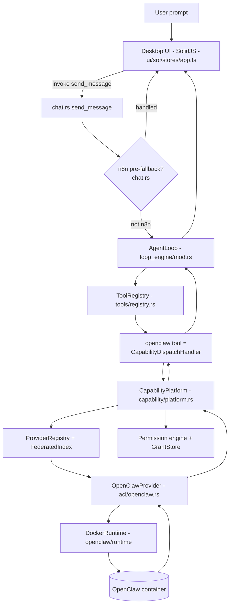

### Who talks to whom

| Layer | Component | File |
|---|---|---|
| Frontend | `sendMessage` store action | `ui/src/stores/app.ts` |
| Desktop cmd | `send_message` Tauri command | `crates/kria-desktop/src/commands/chat.rs` |
| Chat runtime | `process_message` (agent responder) | `crates/kria-core/src/platform/telegram.rs` |
| Agent | `AgentLoop` (ReAct loop) | `crates/kria-core/src/agent/loop_engine/mod.rs` |
| Tool bridge | `openclaw` tool = `CapabilityDispatchHandler` | `crates/kria-core/src/tools/capability_dispatch.rs` |
| Platform | `CapabilityPlatform` | `crates/kria-core/src/capability/platform.rs` |
| Discovery | `ProviderRegistry` + `InMemoryFederatedIndex` | `capability/registry.rs`, `capability/index.rs` |
| Permission | `DefaultPermissionEngine` + `GrantStore` | `capability/permission.rs`, `capability/grants.rs` |
| Provider | `OpenClawProvider` | `crates/kria-core/src/capability/acl/openclaw.rs` |
| Runtime | `DockerRuntime` + `ContainerPool` | `crates/kria-core/src/openclaw/runtime/`, `openclaw/` |

### Why this architecture

- **Anti-hardcoding:** Har capability ek *descriptor* (data) hai. Naya skill = naya data, koi core code nahi. Dekho `capability/descriptor.rs`.
- **Provider-neutral:** Brain (agent) kabhi provider ka naam nahi janta. Sab kuch `CapabilityProvider` trait ke peeche. OpenClaw, MCP — same interface.
- **Ek owner har concern ka:** ek permission engine, ek grant store, ek discovery index, ek dispatcher. Legacy `SemanticOpenClawHandler`/`openclaw::perm`/`cil` delete ho chuke (M12).
- **Honest degrade:** Koi fake success nahi. Match na mile → "no capability, try marketplace". Provider fail → `Declined`/error.

> ⚠️ **Boundary rule (mat todo):** OpenClaw-native types (`ProductionSkillRegistry`, `LaunchSpec`, etc.) sirf `capability/acl/*` ke andar allowed hain. Grep gate: `grep -rn "crate::openclaw\|mcp::client" crates/kria-core/src/capability/ | grep -v /acl/` → empty hona chahiye.

---

## 2. Complete flow (stage-by-stage)

```
User Prompt → Frontend → Desktop cmd → n8n pre-fallback → Agent loop
→ Tool selection → openclaw tool (dispatcher) → Discovery → (Marketplace if miss)
→ Permission → Arg-gen → Execution (Docker) → Result → Agent → UI
```

### Stage A — Frontend
- **Purpose:** Prompt bhejना + streaming response dikhana.
- **Input:** User text. **Output:** `invoke("send_message", { message })`.
- **File:** `ui/src/stores/app.ts` (`sendMessage`). Response async events se aata hai: `agent:token`, `agent:done`, `agent:tool_result`.
- **Failure:** invoke timeout → error message; `agent:done` na aaye to watchdog input unfreeze karta hai.

### Stage B — Desktop command
- **Purpose:** Turn ko backend me route karna.
- **File/Fn:** `chat.rs` → `send_message` (`#[tauri::command]`) → `send_message_with_profile`.
- **Branches:** (1) GUI-cognition override, (2) **n8n pre-fallback**, (3) normal agent loop.

### Stage C — n8n pre-fallback (interceptor — dhyan se)
- **Purpose:** Agar prompt kisi approved n8n workflow se strongly match kare to agent se pehle handle karna.
- **File/Fn:** `chat.rs::desktop_n8n_pre_fallback_command_capture` → `local_api.rs::local_api_n8n_pre_fallback_response_from_app_state` → `n8n/matching.rs::WorkflowRankingEngine::route_chat`.
- **Important:** Weak/low-confidence match ab `UseOtherTool` return karta hai (release to agent). Isse "install a tool" jaise prompt hijack nahi hote.
- **Output:** `Some(...)` → turn n8n ne handle kiya; `None` → agent loop chalega.

### Stage D — Agent loop (ReAct)
- **Purpose:** LLM se tool calls nikalna, execute karna, repeat, phir final answer.
- **File:** `agent/loop_engine/mod.rs` (`AgentLoop`). Entry via `platform/telegram.rs::process_message` (desktop + local API dono isi ko call karte hain).
- **Tools LLM ko:** `ToolRegistry::list_for_tier(hw_tier)` (system prompt me + routed subset).
- **Deterministic flows:** agar LLM koi tool call na de:
  - `PackageFlowState` → OS packages (`search_package`/`install_package`).
  - `CapabilityFlowState` → marketplace (`search_marketplace`/`install_capability`).
- **Failure:** `max tool rounds (10) reached` agar converge na ho.

### Stage E — Tool selection
- **Purpose:** LLM decide karta hai kaunsa tool. Ek semantic **direct-match** fast path bhi hai.
- **File:** `routing/tool_index.rs::SharedToolIndex::match_tool` (cosine sim; threshold cross → LLM skip, seedha tool).
- **openclaw tool** = "kuch actually DO karna" ke liye.

### Stage F — Dispatcher (`openclaw` tool)
- **File:** `tools/capability_dispatch.rs::CapabilityDispatchHandler::execute`.
- **Steps:** discover → re-rank (lexical overlap + score, relevance floor) → permission gate → arg-gen → `platform.execute`.
- **Honest miss:** overlap 0 + score < 0.15 → "No installed capability matches … Try the Marketplace."

### Stage G — Discovery
- **File:** `capability/platform.rs::discover` → `registry.search` → `index.search`.
- **Signal:** semantic (embedding cosine) ⊕ lexical (token overlap) ⊕ learned-success.

### Stage H — Marketplace (miss hone par)
- **Search:** `search_marketplace` → `platform.recommend` → har provider ka `catalog()` (remote ClawHub index).
- **Install:** `install_capability` → `platform.acquire_for_goal` → `OpenClawProvider::acquire` (download → transpile → bundle install) → `platform.refresh()`.

### Stage I — Permission
- **File:** `capability/permission.rs::DefaultPermissionEngine::authorize` + `capability/grants.rs::GrantStore`.
- **Decision:** `Allow` / `Prompt` / `Deny`. Effects-driven (descriptor ke effects se), naam se nahi.

### Stage J — Arg generation
- **File:** `openclaw/arg_gen.rs::generate_arguments`. NL query → skill ke `input_schema` ke typed args. Schema-validated, repair-retry. LLM na ho to honest decline.

### Stage K — Execution (Docker)
- **File:** `capability/acl/openclaw.rs::execute` → `LaunchSpec` → `openclaw/runtime/docker.rs::DockerRuntime` → container.
- **Result:** `CapabilityOutcome::Value(json)` ya honest error.

### Stage L — Response → UI
- Result agent ko wapas → LLM summarize karta hai → `agent:token`/`agent:done` events → UI render.

---

## 3. Frontend flow

| Concern | Where |
|---|---|
| Send prompt | `ui/src/stores/app.ts` → `sendMessage` → `invoke("send_message", { message })` |
| Manual tool mode | `send_manual_tool_message` (e.g. `#tool:gw_gmail_inbox`) |
| Stream events | listeners on `agent:token`, `agent:tool_call`, `agent:tool_result`, `agent:approval_required`, `agent:tool_choice_required`, `agent:done` |
| Thinking guard | `setAssistantIsThinking` + watchdog — `agent:done` na aaye to input freeze na ho |
| Permissions UI | `ui/src/views/PermissionManagerView.tsx` → `invoke("openclaw_revoke_grant", { grantId })`, `openclaw_set_developer_mode` |
| Capabilities UI | `CapabilitiesView` (tabs: Providers / Browser+Run / Marketplace / Approval Center / Timeline / Descriptor) → `cpp_*` commands |

**Streaming model:** `send_message` turant return karta hai (`{status:"processing"}`); asli jawab events ke through async aata hai. Isliye UI ko `agent:done` ka wait karna padta hai.

> 💡 **Tip:** Desktop UI aur local HTTP API (`POST /api/chat`) **same** backend pipeline use karte hain (same n8n pre-fallback + same `process_message`). Isliye GUI ke bina bhi `/api/chat` se real path drive kar sakte ho.

---

## 4. Backend flow

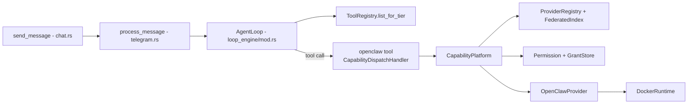

| Component | File | Role |
|---|---|---|
| `AgentLoop` | `agent/loop_engine/mod.rs` | ReAct loop, tool rounds, synthetic flows |
| `process_message` | `platform/telegram.rs` | Agent responder (desktop + API + telegram) |
| `ToolRegistry` | `tools/registry.rs` | `register`, `get_handler`, `list_for_tier`, `list_defs` |
| `CapabilityPlatform` | `capability/platform.rs` | discover / recommend / acquire_for_goal / execute / refresh |
| `ProviderRegistry` | `capability/registry.rs` | providers + refresh + search + circuit breaker |
| Logs | `~/.kria/logs/kria.log.<date>` (JSON) + `pipeline_trace` steps |

**Registration point:** saare CPP tools `crates/kria-desktop/src/commands/runtime.rs` ke ek block me register hote hain (OpenClaw subsystem + Docker pool available hone par). Ye block `platform` banata hai aur `openclaw`, `list_installed_skills`, `search_marketplace`, `install_capability` register karta hai.

---

## 5. Capability Platform (the core)

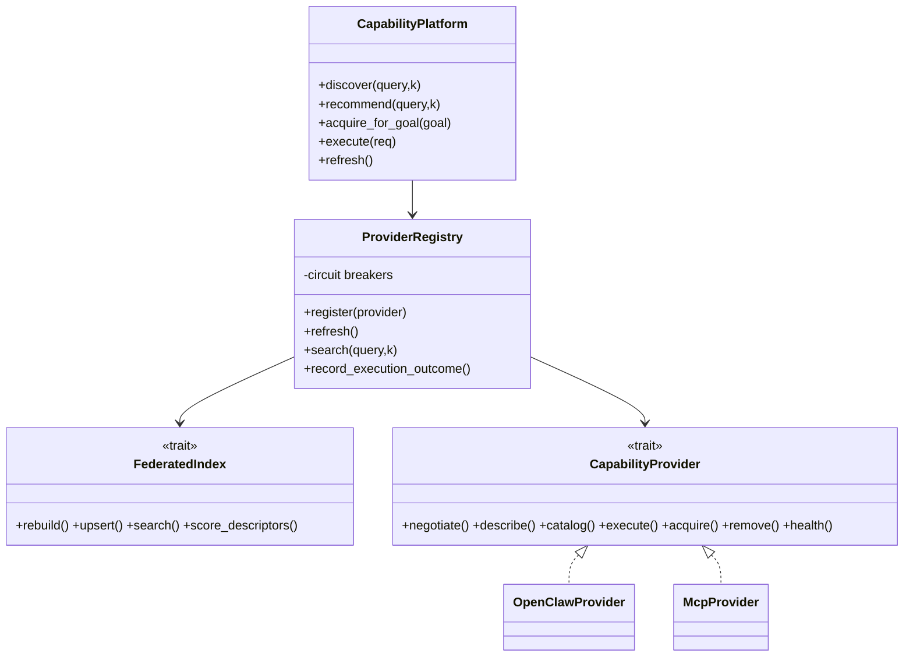

| Type | File | Purpose |
|---|---|---|
| `CapabilityPlatform` | `capability/platform.rs` | Composition root; Brain ka single surface. |
| `ProviderRegistry` | `capability/registry.rs` | Providers hold karta; `refresh()` sabko negotiate+describe karke index rebuild karta. |
| `FederatedIndex` / `InMemoryFederatedIndex` | `capability/index.rs` | Cross-provider retrieval; semantic⊕lexical⊕success fusion (`FusionWeights` 0.65/0.30/0.05). |
| `MemoryEmbedder` | `capability/index.rs` | Shared ONNX all-MiniLM-L6-v2 (nahi mila to hash fallback). |
| `CapabilityDescriptor` / `Effects` | `capability/descriptor.rs` | Self-describing capability + declared side-effects. |
| `GrantStore` | `capability/grants.rs` | Durable SQLite grants (`cpp_grants.db`). |
| `DefaultPermissionEngine` | `capability/permission.rs` | Effects → tier → grant reuse. |
| `CapabilityDispatchHandler` | `tools/capability_dispatch.rs` | `openclaw` chat tool (discover→permission→execute). |
| `MarketplaceSearch/InstallHandler` | `tools/capability_dispatch.rs` | `search_marketplace` / `install_capability`. |

**Rishtे (relationships):** Platform → Registry → (Index + Providers). Dispatcher Platform ko call karta hai + Permission engine + GrantStore ko directly. Index ka ownership Registry ke paas hai.

> 📌 **Key insight:** Registry kabhi authoritative catalog store nahi karta. Har provider apna catalog `describe()` deta hai; federated index sirf ek **derived, rebuildable** view hai (idempotent). Isliye index ko persist karne ki zaroorat nahi.

---

## 6. OpenClaw Provider

**File:** `crates/kria-core/src/capability/acl/openclaw.rs` (`OpenClawProvider`, id = `"openclaw"`).
Ye **anti-corruption boundary** hai — OpenClaw ke native types yahin translate hote hain.

| Method | Kya karta hai |
|---|---|
| `negotiate()` | Mandatory facets advertise; `Lifecycle` sirf jab `with_lifecycle` wired ho (honest). |
| `describe()` | `ProductionSkillRegistry::get_enabled_skills()` → har `SkillMetadata` ko `descriptor_from()` se `CapabilityDescriptor` banata. |
| `catalog()` | ClawHub remote `index.json` fetch → har entry ko installable descriptor (`extensions["installed"]=false`). |
| `execute()` | `LaunchSpec` banakar `DockerRuntime` par chalata; success → `Value(json)`, fail → honest `Execute` error. |
| `acquire()` | Marketplace index fetch → best token-match → validate → download manifest → `transpile_skill` → `synth_marketplace_bundle` → `BundleInstaller.install` (Community tier). |
| `remove()` | Registry se uninstall (lifecycle facet). |

**Effect mapping (`effect_classes`):** `SkillCapabilities` flags → open strings: `read/write/subprocess/browser/network/image_generation/media`. Reversibility: `write` ya `subprocess` ho to `Irreversible`, warna `Reversible`.

**Skills:** har skill ka metadata `ProductionSkillRegistry` (`openclaw/registry.rs`) me. Execution ek sandboxed Docker container me hota hai.

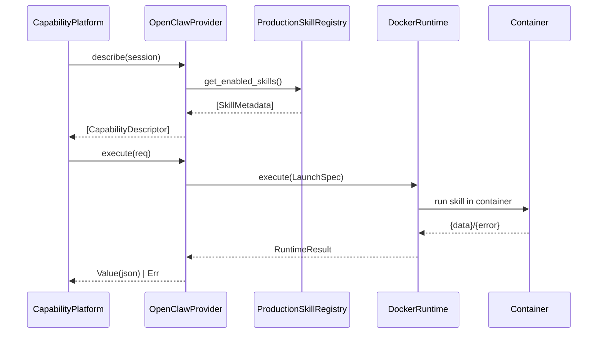

---

## 7. Marketplace

**Remote catalog:** GitHub-hosted `index.json`.
`openclaw/clawhub.rs::DEFAULT_REGISTRY_URL` = `https://raw.githubusercontent.com/ObaidGits/kria-skills/refs/heads/main/index.json` (~30 utility skills: base64, hash, json, csv→json, ip_info, http_get, regex, markdown→html, etc.).

| Action | Path | Notes |
|---|---|---|
| Search | `MarketplaceSearchHandler` → `platform.recommend` → `provider.catalog()` → `index.score_descriptors` | ranked remote candidates |
| Recommend (UI) | `commands/capability.rs::cpp_recommend` | same platform.recommend |
| Install | `MarketplaceInstallHandler` → `platform.acquire_for_goal` → `OpenClawProvider::acquire` | best token match, no skill-name needed |
| Descriptor refresh | `platform.refresh()` acquire ke baad | naya skill turant discoverable/executable |
| Update / Reinstall | acquire idempotent — already installed ho to current descriptor return | |
| Removal | `provider.remove()` / desktop `clawhub_uninstall_skill` | |
| Caching | in-memory federated index (rebuild/upsert par invalidate) | koi alag disk cache nahi |
| Local DB | installed skill metadata `ProductionSkillRegistry` + `skills.db` (audit) | bundles: `data_dir/openclaw_skills` |

**Security:** ClawHub downloads HTTPS-only + `DomainValidator` allowlist (`github.com`, `githubusercontent.com`, config `allowed_hosts`). Remote skills hamesha `TrustTier::Community` (kabhi Verified nahi). Manifest 64 KiB cap.

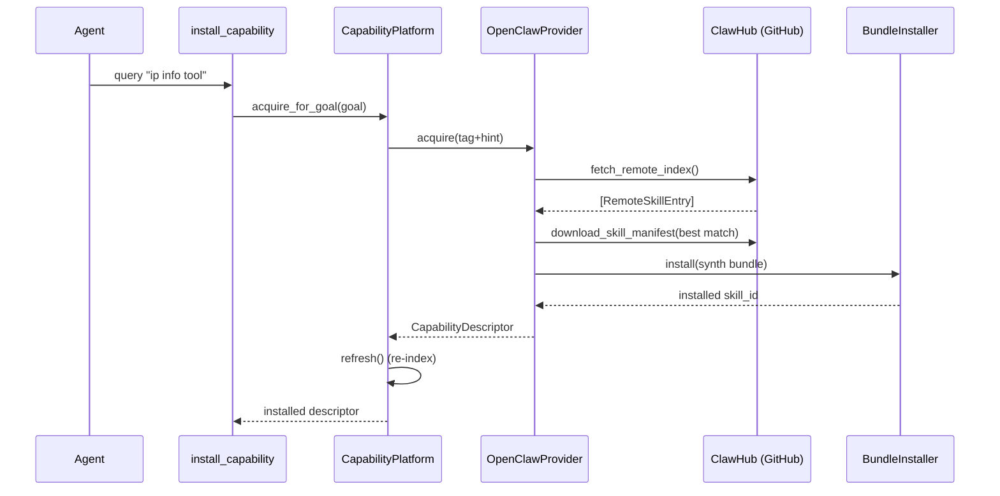

> ⚠️ **Reality check:** Marketplace me sirf format/encode/convert/network utilities hain. PDF-extract, zip-compress, web-search jaise skills **abhi nahi hain** — inke liye honest "no matching capability" milega. Ye skills banana = OpenClaw substrate scope, CPP scope nahi.

---

## 8. Permission System

**Files:** `capability/permission.rs` (engine) + `capability/grants.rs` (durable store).

### Tiers (effects se decide, naam se nahi)

| Condition (descriptor `Effects`) | Tier | Prompt? |
|---|---|---|
| not elevated (pure read/compute, reversible) | `NeverAsk` | never |
| irreversible **or** host subprocess/shell | `AlwaysAsk` | har baar (unless `Silent` policy grant) |
| otherwise elevated (write/network/unknown-reversibility) | `AskPerWorkspace` → `AskPerSession` → `AskOnce` | pehli baar; phir grant se reuse |

`is_elevated()` (`descriptor.rs`): koi write/network/net/subprocess/shell/gpu class, ya reversibility `Irreversible`/`Unknown`.

### Grant store (`cpp_grants.db`, SQLite)

- **Key:** `(provider_id, capability_id)` + **granted effect-class set**.
- **Coverage (`covers`):** requested effects ⊆ granted effects → covered (**narrowing OK, widening re-prompts** = monotonicity).
- **Scopes (`ScopeKind`):** `Once` / `Session` / `Workspace` / `Persistent` / `Silent`.
- **Persistence:** durable across restarts (SQLite). Standing `Deny` ko `Allow` par priority.
- **Chat me scope:** dispatcher `Workspace` scope key `"default"` use karta (`AuthorizeRequest::from_descriptor(&d, None, Some("default"))`), taaki ek approval poore session yaad rahe.

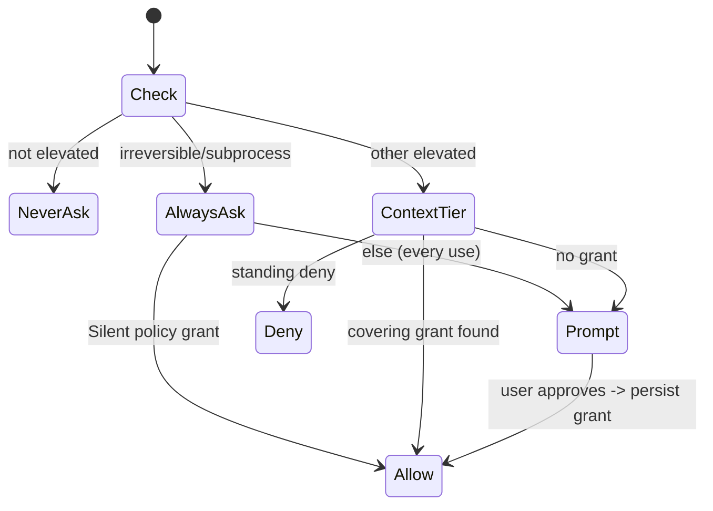

**Approve→persist:** `permission.rs::approval_grant(req, scope, Allow)` ek `ScopedGrant` banata; `GrantStore::insert`. Revoke: `GrantStore::revoke(grant_id)` (UI: `openclaw_revoke_grant`).

> 🔎 **Debug tip (re-prompt bug):** agar simple tool baar-baar poochh raha ho, check karo: (a) descriptor ke `effects.reversible` (galti se `Unknown`?), (b) grant ka `effects` set request se match karta hai ya nahi (`covers`), (c) scope key same hai (`"default"` workspace). `sqlite3 ~/.kria/cpp_grants.db "select * from cpp_grants"`.

---

## 9. Execution Engine

**Chat path (single capability):** `CapabilityPlatform::execute(CapabilityRequest)` → owning provider ka `execute`. Multi-capability planning/graph abhi chat path par active nahi — ek best-match capability chalti hai (`CapabilityDispatchHandler`).

| Runtime | File | Use |
|---|---|---|
| OpenClaw (Docker) | `openclaw/runtime/docker.rs::DockerRuntime` (`SkillRuntime` trait, `openclaw/runtime/mod.rs`) | skill container me chalti |
| MCP (thin) | `McpProvider` (federation) | MCP tools |
| Native tools | `tools/registry.rs` handlers | non-CPP tools (files, web, gw_*, image, news) |

**Execute internals (`platform.rs::execute`):** emit `Started` event → `provider.execute(req)` → `record_execution_outcome` (circuit breaker + learning) → emit terminal event. Outcomes: `Value(json)` / `Declined{reason}` / `Stream` / `Err`.

**Container model:** `ContainerPool` warm containers maintain karta (min per resource-class). `LaunchSpec { skill_id, params, resource_class, timeout, correlation_id }` → runtime skill run karta. `RuntimeManagerSpawn::create_container is not implemented against real Docker` warnings normal hain (prewarm attempts on an already-pooled setup).

**Error handling:** skill ran-but-failed → `CapError::Execute` (honest, kabhi fake success nahi). Provider offline / breaker open → discovery se excluded.

---

## 10. Response flow

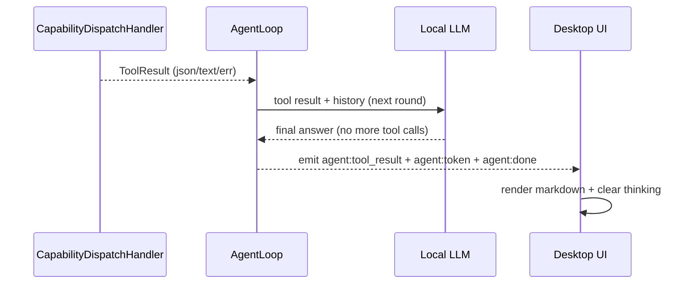

- Dispatcher `ToolResult` (`infra/isolation.rs`) return karta — `ok(json)` / `ok_text` / `err`.
- Agent loop result ko history me daalta, LLM summarize karta.
- Events UI ko stream hote; `agent:done` par input unlock.
- **Model note:** chhota local model (Qwen3VL-4B) kabhi list ko under-summarize kar deta hai (backend 8 skills deta, model 1 dikhata) — ye model-quality, backend bug nahi.

---

## 11. Database flow

| Store | Path | Kya | Kab likhta/padhta |
|---|---|---|---|
| Grants | `~/.kria/cpp_grants.db` | `cpp_grants` table (`GrantStore`) | insert on approve; read on every authorize; revoke on UI action |
| OpenClaw audit | `~/.kria/skills.db` | `AuditLedger` (HMAC-keyed) | install/execute events |
| Installed skills | `ProductionSkillRegistry` + `data_dir/openclaw_skills` | skill metadata + bundle dirs | acquire par write; describe par read |
| Descriptor index | in-memory (`InMemoryFederatedIndex`) | derived, rebuildable | `refresh()`/`upsert()` par rebuild |
| Marketplace catalog | remote `index.json` (GitHub) | remote skill entries | catalog()/acquire par fetch (no local cache) |
| API token | `~/.kria/api_token` (0600) | local API bearer | first run par generate |

> 📌 Data dir = `~/.kria` (`kria_data_dir()`). Grants + audit durable; discovery index memory-only (rebuild se recover).

---

## 12. Startup flow

**File:** `crates/kria-desktop/src/commands/runtime.rs` (main init).

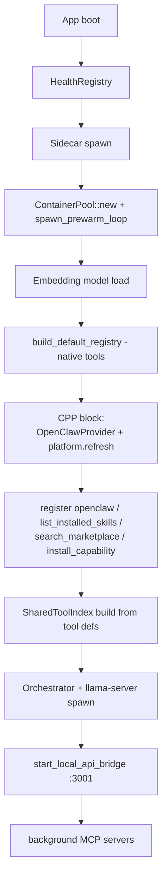

Key order:
1. **ContainerPool** (`ContainerPool::new(openclaw_config)`, retry loop, `spawn_prewarm_loop`).
2. **Embeddings** shared (`MemoryEmbedder::from_model`).
3. **CPP block** (guarded by `openclaw_subsystem` + `openclaw_pool`): `OpenClawProvider::new(...).with_lifecycle(...)` → `CapabilityPlatform::new(registry).with_events(bus)` → `platform.refresh().await` → register 4 CPP tools + open `cpp_grants.db`.
4. **Tool index** built from `tool_registry.list_defs()` (isliye CPP tools index me aate hain).
5. **Orchestrator** llama-server spawn (GPU→CPU fallback), **local API** `:3001`, background **MCP**.
6. **Health checks:** `HealthRegistry` har subsystem track karta.

---

## 13. Shutdown flow

**File:** `runtime.rs` (shutdown fn, `"runtime shutdown started"`).

Order (dekha gaya):
1. `safety::engage_halt("runtime shutdown")` — GUI automation block.
2. GUI orchestrator shutdown.
3. Voice pipeline stop.
4. Telegram bridge stop.
5. MCP `stop_all(&tool_registry)` (tools unregister).
6. Sidecar shutdown.
7. Orchestrator (llama-server) shutdown.
8. **`container_pool.shutdown()`** — OpenClaw containers destroy.
9. `"runtime shutdown completed"`.

> ✅ **Invariant:** shutdown ke baad `docker ps -aq --filter "name=kria-openclaw" | wc -l` → 0 (pool destroyed). Test me `ContainerPool` banao to hamesha `pool.shutdown()` karo, warna warm containers leak.

**Grants/cache:** grants SQLite pehle hi durable (koi flush nahi chahiye). Discovery index memory-only — bas discard.

---

## 14. Error handling

| Failure | Behaviour | Where |
|---|---|---|
| No capability match | honest "No installed capability … Try the Marketplace" | `capability_dispatch.rs` |
| Arg-gen no LLM | honest decline (no fabricated args) | `arg_gen.rs` |
| Skill ran but failed | `CapError::Execute(error)` (no fake success) | `acl/openclaw.rs::execute` |
| Provider negotiate/describe fail | recorded errored, excluded from index (one bad provider ≠ whole fail) | `registry.rs::refresh` |
| Repeated exec failures | circuit breaker opens (3 fails / 30s cooldown, half-open probe) | `registry.rs` |
| Embedding backend down | degrade to lexical-only scoring (no panic) | `index.rs::search` |
| Marketplace index fetch fail | `CapError::Discovery`/`Acquire` surfaced | `clawhub.rs` |
| n8n weak match | `UseOtherTool` → agent handles | `n8n/matching.rs::route_chat` |
| Loop doesn't converge | `max tool rounds (10) reached` | `loop_engine/mod.rs` |

**Graceful degradation:** LLM down → arg-gen/agent honestly fail; Docker down → provider offline; marketplace unreachable → search/install error, installed skills still work.

---

## 15. Sequence diagrams

### Prompt → result (happy path, installed skill)
```mermaid
sequenceDiagram
  participant U as User
  participant UI as UI (app.ts)
  participant CMD as chat.rs send_message
  participant AL as AgentLoop
  participant D as openclaw tool
  participant P as CapabilityPlatform
  participant OCP as OpenClawProvider
  participant DK as Docker
  U->>UI: "Calculate 481*22+7"
  UI->>CMD: invoke send_message
  CMD->>AL: process_message
  AL->>D: openclaw{query}
  D->>P: discover -> best cap
  D->>D: permission (NeverAsk)
  D->>P: execute(req)
  P->>OCP: execute
  OCP->>DK: LaunchSpec
  DK-->>OCP: {result:10589}
  OCP-->>P-->>D-->>AL: ToolResult
  AL-->>UI: agent:token + agent:done
```

### Marketplace install
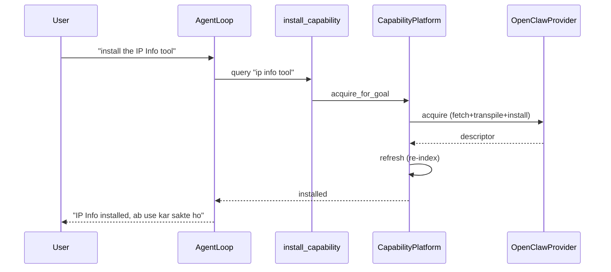

### Permission approval
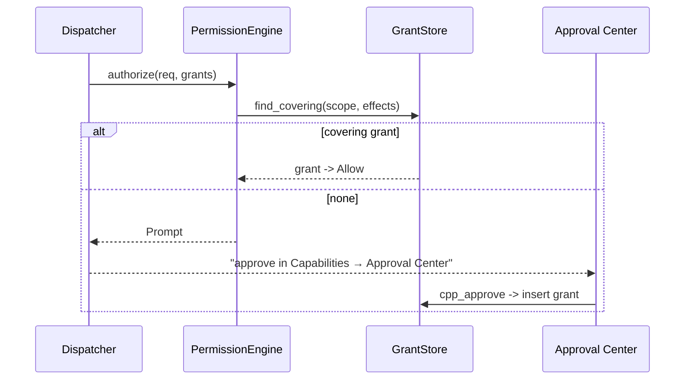

### Provider registration + discovery
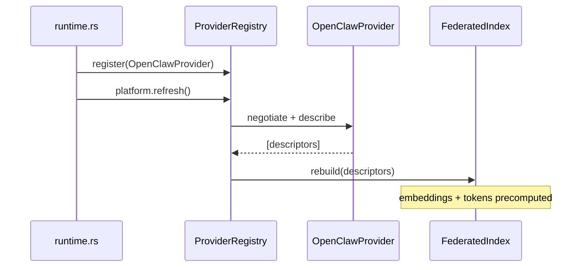

### Restart (grant persistence)
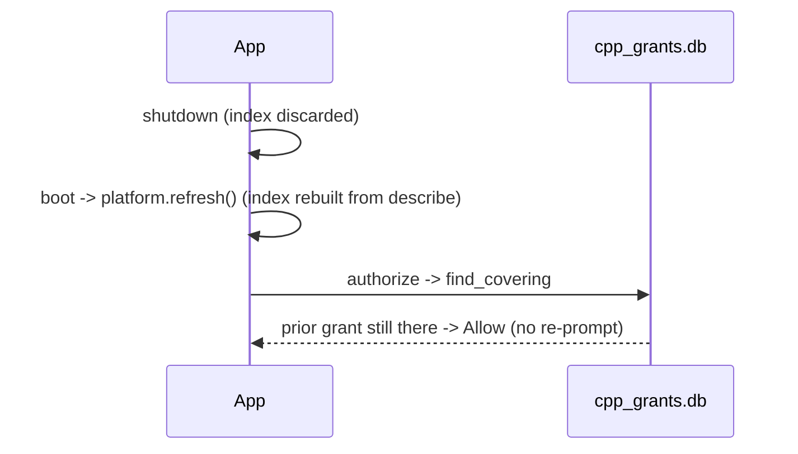

---

## 16. Architecture diagrams

### High-level
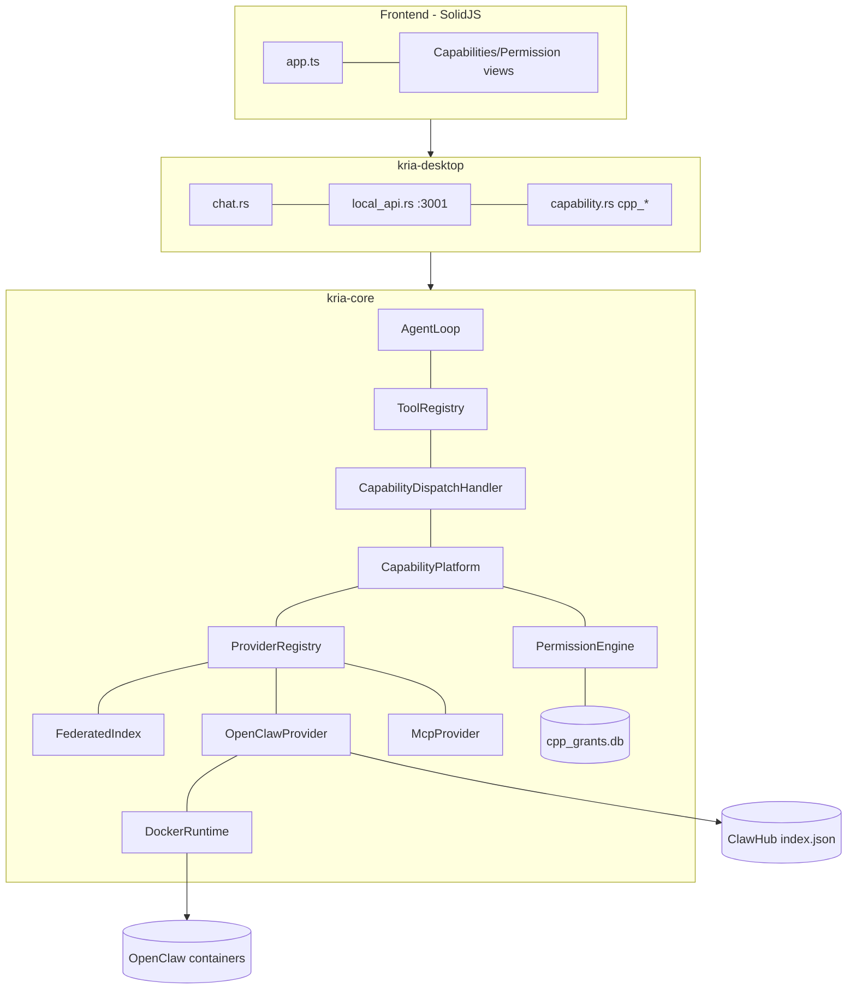

### Grant lifecycle
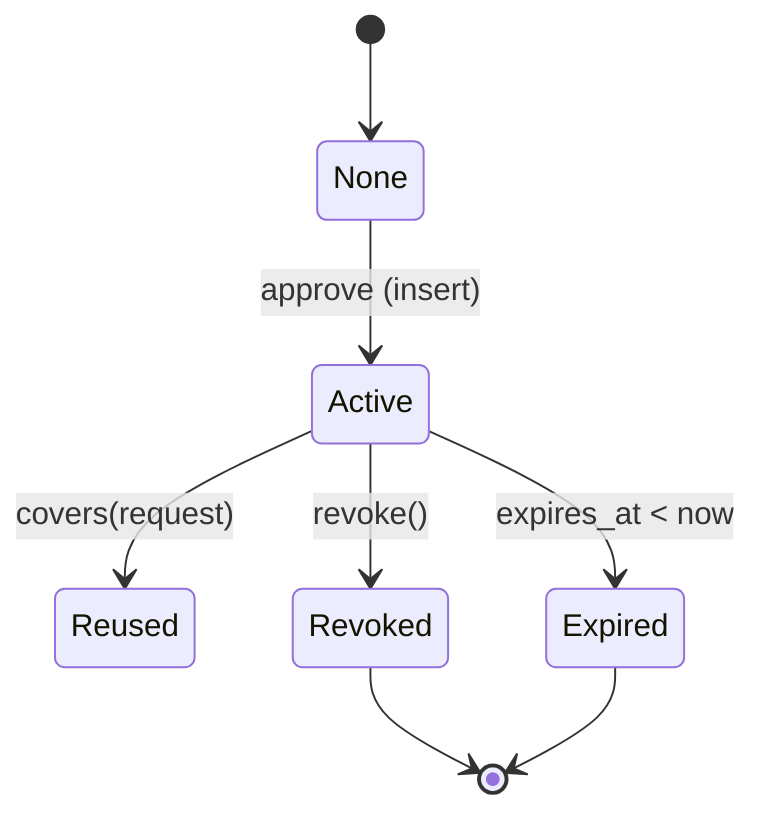

### Marketplace lifecycle
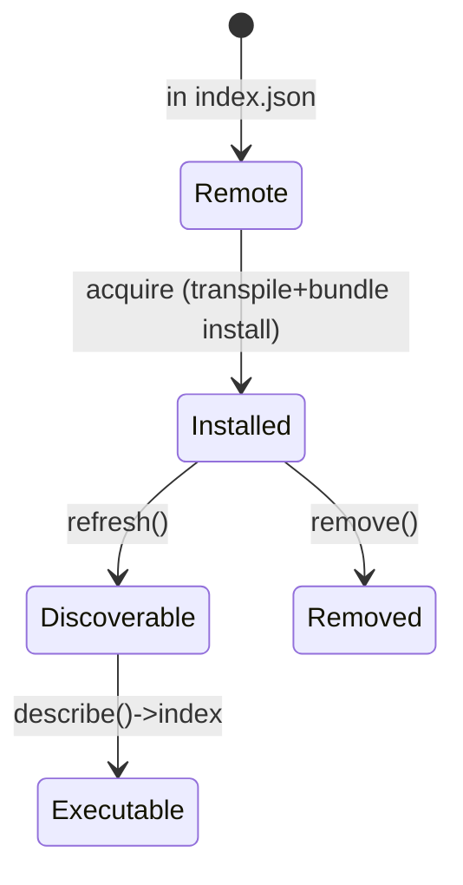

---

## 17. Call graphs

**Prompt → execution:**
```
User prompt
 └─ ui/src/stores/app.ts  sendMessage → invoke("send_message")
    └─ commands/chat.rs  send_message → send_message_with_profile
       ├─ desktop_n8n_pre_fallback_command_capture   (n8n intercept; UseOtherTool → release)
       └─ platform/telegram.rs  process_message
          └─ agent/loop_engine/mod.rs  AgentLoop (rounds)
             ├─ routing/tool_index.rs  match_tool (direct hint)
             ├─ CapabilityFlowState / PackageFlowState (synthetic calls)
             └─ tools/capability_dispatch.rs  CapabilityDispatchHandler.execute
                ├─ capability/platform.rs  discover → registry.search → index.search
                ├─ capability/permission.rs  authorize + grants.rs find_covering
                ├─ openclaw/arg_gen.rs  generate_arguments
                └─ capability/platform.rs  execute
                   └─ capability/acl/openclaw.rs  execute → LaunchSpec
                      └─ openclaw/runtime/docker.rs  DockerRuntime → container
```

**Install:**
```
install_capability (tools/capability_dispatch.rs)
 └─ platform.acquire_for_goal (capability/platform.rs)
    └─ OpenClawProvider.acquire (capability/acl/openclaw.rs)
       ├─ clawhub.rs  fetch_remote_index / download_skill_manifest
       ├─ transpiler.rs  transpile_skill
       ├─ bundle/synth.rs  synth_marketplace_bundle
       └─ bundle  BundleInstaller.install → registry
    └─ platform.refresh() (re-index)
```

---

## 18. File map

| Purpose | File | Importance |
|---|---|---|
| Frontend chat/store | `ui/src/stores/app.ts` | ⭐⭐⭐ |
| Permission UI | `ui/src/views/PermissionManagerView.tsx` | ⭐ |
| Desktop chat command | `crates/kria-desktop/src/commands/chat.rs` | ⭐⭐⭐ |
| Local HTTP API + n8n prefallback | `crates/kria-desktop/src/commands/local_api.rs` | ⭐⭐ |
| CPP desktop commands | `crates/kria-desktop/src/commands/capability.rs` | ⭐⭐ |
| OpenClaw/ClawHub desktop cmds | `crates/kria-desktop/src/commands/openclaw.rs` | ⭐⭐ |
| Startup + shutdown + tool registration | `crates/kria-desktop/src/commands/runtime.rs` | ⭐⭐⭐ |
| Agent responder | `crates/kria-core/src/platform/telegram.rs` | ⭐⭐ |
| Agent loop (ReAct + flows) | `crates/kria-core/src/agent/loop_engine/mod.rs` | ⭐⭐⭐ |
| Package/capability flow helpers | `crates/kria-core/src/agent/loop_engine/helpers.rs` | ⭐⭐ |
| Tool registry | `crates/kria-core/src/tools/registry.rs` | ⭐⭐ |
| **openclaw tool (dispatcher) + marketplace tools** | `crates/kria-core/src/tools/capability_dispatch.rs` | ⭐⭐⭐ |
| Capability platform | `crates/kria-core/src/capability/platform.rs` | ⭐⭐⭐ |
| Provider registry + breaker | `crates/kria-core/src/capability/registry.rs` | ⭐⭐⭐ |
| Federated index | `crates/kria-core/src/capability/index.rs` | ⭐⭐⭐ |
| Descriptor + Effects | `crates/kria-core/src/capability/descriptor.rs` | ⭐⭐⭐ |
| Provider trait + requests | `crates/kria-core/src/capability/provider.rs` | ⭐⭐⭐ |
| Permission engine | `crates/kria-core/src/capability/permission.rs` | ⭐⭐⭐ |
| Grant store (SQLite) | `crates/kria-core/src/capability/grants.rs` | ⭐⭐⭐ |
| **OpenClaw provider (ACL)** | `crates/kria-core/src/capability/acl/openclaw.rs` | ⭐⭐⭐ |
| Arg generation | `crates/kria-core/src/openclaw/arg_gen.rs` | ⭐⭐ |
| ClawHub client | `crates/kria-core/src/openclaw/clawhub.rs` | ⭐⭐ |
| Docker runtime | `crates/kria-core/src/openclaw/runtime/docker.rs` + `mod.rs` | ⭐⭐ |
| Skill registry | `crates/kria-core/src/openclaw/registry.rs` | ⭐⭐ |
| Audit ledger | `crates/kria-core/src/openclaw/audit.rs` | ⭐ |
| n8n routing | `crates/kria-core/src/n8n/matching.rs` | ⭐⭐ |
| Tool semantic index | `crates/kria-core/src/routing/tool_index.rs` | ⭐⭐ |

---

## 19. Important traits

| Trait | File | Kyun / Kaun implement / Kaun call |
|---|---|---|
| `CapabilityProvider` | `capability/provider.rs` | Provider-neutral boundary. Impl: `OpenClawProvider`, `McpProvider`, `FakeProvider` (tests). Call: `ProviderRegistry`. |
| `FederatedIndex` | `capability/index.rs` | Discovery pluggable (in-process ya distributed). Impl: `InMemoryFederatedIndex`. Call: `ProviderRegistry`. |
| `Embedder` | `capability/index.rs` | Text→vector abstraction. Impl: `MemoryEmbedder`. Call: index. |
| `PermissionEngine` | `capability/permission.rs` | Effects→decision. Impl: `DefaultPermissionEngine`. Call: dispatcher + `cpp_*` cmds. |
| `ToolHandler` | `tools/registry.rs` | Har tool ka executor. Impl: `CapabilityDispatchHandler`, `CapabilityListHandler`, `MarketplaceSearch/InstallHandler`, native tools. Call: agent loop. |
| `SkillRuntime` | `openclaw/runtime/mod.rs` | Skill execution abstraction. Impl: `DockerRuntime`. Call: `OpenClawProvider::execute`. |

---

## 20. Important structs

| Struct | File | Key fields / role |
|---|---|---|
| `CapabilityDescriptor` | `capability/descriptor.rs` | `provider_id, capability_id, name, description, tags, input_schema, effects, trust, extensions` — self-describing capability. |
| `Effects` | `capability/descriptor.rs` | `classes[], reversible, idempotent, resource_class` — permission ka source of truth. `is_elevated()`. |
| `CapabilityRequest` / `CapabilityOutcome` | `capability/provider.rs` | execute ka input/output (`Value`/`Declined`/`Stream`). |
| `AcquireRequest` | `capability/provider.rs` | `capability_tag, hint, context` — marketplace install input. |
| `ScoredDescriptor` | `capability/index.rs` | `descriptor, score, semantic, lexical`. |
| `ProviderRegistry` | `capability/registry.rs` | providers + sessions + breakers + index. |
| `AuthorizeRequest` / `PermissionDecision` | `capability/permission.rs` | permission input/output (`Allow`/`Prompt`/`Deny`). |
| `ScopedGrant` / `ScopeKind` | `capability/grants.rs` | persisted grant row + scope. `covers()`, `is_active_at()`. |
| `OpenClawProvider` | `capability/acl/openclaw.rs` | `registry, runtime, lifecycle` — the ACL. |
| `LaunchSpec` / `RuntimeContext` | `openclaw/runtime/mod.rs` | container run spec. |
| `CapabilityDispatchHandler` | `tools/capability_dispatch.rs` | `platform, grants, engine, arg_llm` — the `openclaw` tool. |

---

## 21. Developer notes

### Useful commands
```bash
# Build (low-RAM dev profile)
cargo build -p kria-core
cargo build -p kria-desktop

# Focused tests
cargo test -p kria-core --lib capability::
cargo test -p kria-core --lib tools::capability_dispatch
cargo test -p kria-core --lib n8n::matching
cargo test -p kria-core --lib agent::loop_engine

# Real Docker E2E (needs Docker + kria/openclaw-substrate:latest)
KRIA_CPP_DOCKER=1 cargo test -p kria-core --test capability_e2e_dispatch_docker -- --nocapture

# Drive the REAL chat pipeline (desktop must be running)
bash scripts/cpp_live_probe.sh "Calculate 2+2" "install the IP Info tool from the marketplace"

# Container leak check (must be 0 extra beyond the pool)
docker ps -aq --filter "name=kria-openclaw" | wc -l
```

### Useful logs
- Main JSON log: `~/.kria/logs/kria.log.<YYYY-MM-DD>`.
- Grep tool calls: `grep -aoE '"tool_name":"[a-z_]+"' ~/.kria/logs/kria.log.* | sort | uniq -c`
- Pipeline steps: search `synthetic_capability_calls`, `synthetic_package_calls`, `Direct tool match via semantic index`, `direct_hint_tool`.
- CPP events: `capability::events::CapabilityEventBus` (discovery/execute stages) → Timeline UI.

### Where bugs usually hide
| Symptom | Likely cause | Look at |
|---|---|---|
| "install X" hijacked by n8n | weak-match release threshold | `n8n/matching.rs::route_chat` |
| Install goes to `apt` not marketplace | tool ambiguity / OS package-flow | `loop_engine/helpers.rs::detect_package_intent`, `tools/packages.rs` descriptions |
| Wrong skill matched | discovery ranking / relevance floor | `capability/index.rs`, `tools/capability_dispatch.rs` |
| Re-prompt every time | grant effects/scope mismatch | `capability/permission.rs`, `grants.rs`; inspect `cpp_grants.db` |
| "missing required parameter" | descriptor schema ≠ substrate handler | `arg_gen.rs`, skill manifest |
| Loop "max tool rounds" | two mechanisms fighting (LLM vs synthetic) | `loop_engine/mod.rs` injection block |
| Fake success | should never happen | verify `execute` returns honest error |

### Where to place breakpoints / trace
- `CapabilityDispatchHandler::execute` — discovery + permission + execute in one place.
- `CapabilityPlatform::execute` — provider dispatch + events.
- `DefaultPermissionEngine::authorize` — grant decisions.
- `OpenClawProvider::execute` / `acquire` — Docker + marketplace.
- `AgentLoop` synthetic-call block — tool selection / flow injection.

### Useful greps
```bash
# Boundary invariant (must be empty)
grep -rn "crate::openclaw\|mcp::client" crates/kria-core/src/capability/ | grep -v /acl/
# Where CPP tools get registered
grep -n "search_marketplace\|install_capability\|CapabilityDispatchHandler" crates/kria-desktop/src/commands/runtime.rs
# Grant table
sqlite3 ~/.kria/cpp_grants.db "select provider_id,capability_id,scope_kind,effects_json,decision,revoked from cpp_grants;"
```

### How to trace a full turn
1. Start desktop (`cargo tauri dev`); confirm `:3001/api/health` = 200.
2. `POST /api/chat` (bearer = `~/.kria/api_token`) with the prompt.
3. Tail `~/.kria/logs/kria.log.<date>` and follow `pipeline step` entries: message received → llm_input_prepared → tool calls → tool execution completed → done.
4. For CPP internals, watch `capability::events` stages (Discover/Execute, Started/Ok/Failed/Declined).

---

> **Last verified:** 2026-07-07 against the live codebase (kria-core + kria-desktop). Agar kuch design doc se alag mile, ye document **real implementation** follow karta hai.
