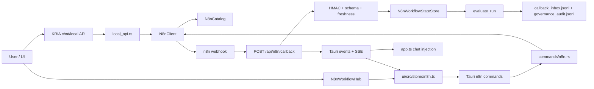
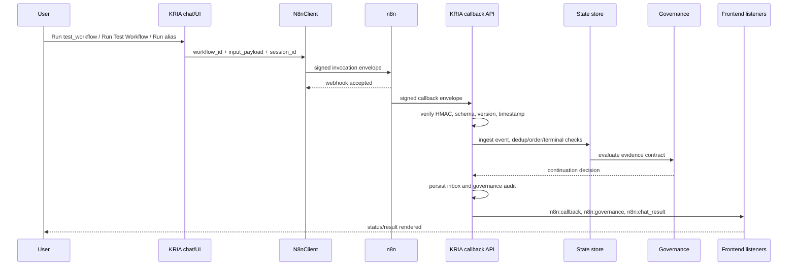
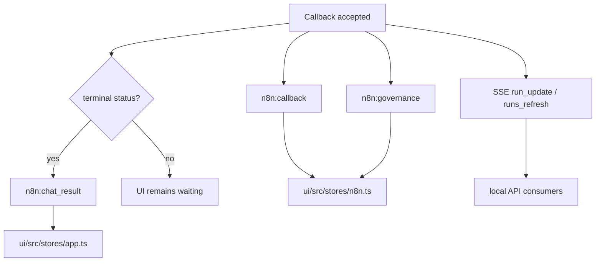

# KRIA n8n Phase 0 to 6 Verification Report

Date: 2026-05-29
Audited repo: `/media/obaid/SSD/KRIA`
Audited runtime: KRIA local API on `127.0.0.1:3001`, n8n on `127.0.0.1:5678`

## 1. Executive Summary

This audit does not support the claim that Phase 0 through Phase 6 are fully
complete in production terms.

The real KRIA to n8n diagnostic workflow path is working well:

- KRIA local API health passed.
- n8n health passed.
- Real n8n webhook execution passed.
- Signed terminal callback passed.
- State machine, governance, persistence, SSE, and chat-result emission passed.
- Reliability suite passed `17/17`.
- Basic prompt eval passed `10/10`.
- Capability eval passed `25 passed / 0 failed / 16 skipped`.

However, the full Phase 0 to 6 implementation claim is not production-ready:

- Phase 4.5 workflow authoring/update validation is not implemented.
- No workflow validation module, authoring eval script, dry import/export
  roundtrip, backup-before-update command, or rollback pipeline exists.
- Phase 2, Phase 3, and Phase 4 gates are mostly static/code-contract checks,
  not full browser or destructive runtime tests.
- The required named event contract is incomplete. KRIA emits `n8n:callback`,
  `n8n:governance`, `n8n:chat_result`, and SSE `snapshot/run_update/runs_refresh`,
  but not the full planned `n8n:workflow_invocation_started`,
  `n8n:workflow_invocation_accepted`, `n8n:workflow_invocation_failed`,
  `n8n:runtime_status`, or `n8n:workflow_timeout` event set.
- Stage 3 intelligence readiness is correctly blocked because only `1/3`
  approved workflows have routing-quality metadata.

Recommendation: **NO-GO for claiming Phase 0 to 6 complete**.

Limited recommendation: **GO for the current approved diagnostic workflow and
external n8n happy path**, with the remaining blockers below tracked before
broader production rollout.

## 2. Architecture Verification

### 2.1 Architecture Diagram

### 2.2 Data Flow Diagram

### 2.3 Event Flow Diagram

Verified event limitation: the planned invocation lifecycle event names are not
implemented as named Tauri events.

## 3. Code Verification

### 3.1 Backend Code Paths

| Area | Implementation | Registration / reachability | Verdict |
| --- | --- | --- | --- |
| Config v2 and secrets | `crates/kria-core/src/n8n/config.rs` `N8nConfig`, `resolve_signing_secret`, migration helpers | Loaded into runtime and catalog setup | PASS |
| Managed Docker settings | `N8nManagedDockerConfig`, `start_managed_n8n` | Registered in `main.rs`; settings UI invokes it | PARTIAL: code exists, but managed start not live-tested in this audit |
| External mode | `test_n8n_connection`, runtime status commands | External n8n live health passed | PASS |
| Catalog/approval | `catalog.rs`, `N8nWorkflowConfig`, metadata validation | Used by client/tool/local API | PASS for registry contracts |
| Invocation | `client.rs` `N8nClient::invoke_workflow` | Called by tool, local API bridge, UI command | PASS |
| Tool registry | `tool.rs` `register`, `n8n_invoke_workflow` | Registered in runtime startup | PASS |
| Local API chat bridge | `local_api.rs` `local_api_chat`, `invoke_local_api_n8n_workflow` | Live `/api/chat` prompt tests passed | PASS |
| Callback verification | `callback.rs` `parse_and_verify_callback` | Live callback route and failure probes passed | PASS |
| State machine | `state.rs` `ingest`, timeout, eviction | Duplicate/order/terminal tests passed | PARTIAL: `seen_events` is unbounded and not TTL-pruned |
| Governance | `governance.rs` `evaluate_run` | Live governance persisted and emitted | PASS |
| Persistence | `local_api.rs` JSONL writes | Inbox and governance audit verified | PASS |
| SSE | `local_api.rs` `/api/n8n/events` | Authenticated snapshot and refresh events observed | PARTIAL: emits full evidence payloads |
| CRUD registry | `commands/n8n.rs` import/approve/disable/delete/list | Registered in `main.rs`, store calls exist | PARTIAL: live destructive CRUD not executed |
| Workflow validation | Expected `workflow_validation.rs` and authoring commands | Not found | FAIL |
| Stage 3 readiness | `readiness.rs`, `get_n8n_status` | Gate script passed and reports blocked | PASS as guardrail, not ready for intelligence |

### 3.2 Frontend Code Paths

| Area | Implementation | Reachability | Verdict |
| --- | --- | --- | --- |
| Settings UI | `N8nSettings.tsx` | Settings modal invokes runtime commands | PASS by static/typecheck |
| Shared n8n store | `ui/src/stores/n8n.ts` | Used by workflow hub, listeners registered | PASS |
| Workflow hub | `N8nWorkflowHub.tsx` | Exposed through app n8n surface | PASS by code/build |
| Workflow cards | `N8nWorkflowCard.tsx` | Run button calls store `runWorkflow` | PASS by code/build |
| Search/filter | `filteredWorkflows` in store and hub controls | Code present | PASS |
| Progress | `N8nRunProgress.tsx`, `n8nProgress.ts` | Static tests passed | PARTIAL: no browser screenshot/e2e render test |
| Evidence | `N8nEvidenceViewer.tsx` | Technical details behind expander | PASS by code/build |
| Diagnostics | `N8nDiagnosticsPanel.tsx` | Shows setup/runtime/readiness | PASS by code/build |
| Management UI | `N8nWorkflowManagementPanel.tsx` | Discover/import/approve/disable/delete actions wired | PARTIAL: destructive live CRUD skipped |
| Chat result injection | `ui/src/stores/app.ts` listener for `n8n:chat_result` | Live E2E verified terminal event path | PASS |

### 3.3 Dead/Orphan/Stale Code Findings

| Finding | Evidence | Risk |
| --- | --- | --- |
| Phase 4.5 artifacts absent | No `workflow_validation.rs`, no `run_n8n_workflow_authoring_validation.sh`, no authoring commands found | Bad workflow JSON can still not be safely created/updated through KRIA |
| Phase 2/3/4 gate scripts are mostly static | Scripts inspect files/strings rather than driving browser/CRUD flows | False confidence if UI wiring compiles but runtime interaction regresses |
| Required invocation event names absent | `rg` found no `n8n:workflow_invocation_started/accepted/failed` or `n8n:workflow_timeout` events | Frontend and evals rely on optimistic state and callbacks instead of complete backend lifecycle |
| `seen_events` unbounded | `N8nWorkflowStateStore` uses `HashSet<String>` with no TTL eviction | Long-running app can accumulate replay IDs indefinitely |

## 4. Test Results

### 4.1 Static, Unit, and Build Results

| Command | Result |
| --- | --- |
| `cargo check -p kria-core` | PASS, existing warnings in non-n8n code |
| `cargo check -p kria-desktop` | PASS, existing warnings in non-n8n code |
| `cargo test -p kria-core n8n --lib` | PASS, `30 passed / 0 failed` |
| `cargo test -p kria-desktop n8n` | PASS, `5 passed / 0 failed` |
| `cd ui && npm run check` | PASS |
| `cd ui && npm run test:run` | PASS, `27 tests` |
| `cd ui && npm run build` | PASS |
| `git diff --check` | PASS |

### 4.2 Phase and Eval Script Results

| Suite | Result | Report |
| --- | --- | --- |
| Phase 0 contract | PASS, `4/4` | `~/.kria/eval_reports/n8n_phase0_contract_20260529_221335.txt` |
| Runtime modes | PASS, `5/5` | `~/.kria/eval_reports/n8n_runtime_modes_20260529_221335.txt` |
| Phase 2 UI contract | PASS, `5/5` | `~/.kria/eval_reports/n8n_phase2_ui_20260529_220533.txt` |
| Phase 3 progress contract | PASS, `5/5` | `~/.kria/eval_reports/n8n_phase3_progress_20260529_220533.txt` |
| Phase 4 management contract | PASS, `5/5` | `~/.kria/eval_reports/n8n_phase4_management_20260529_220533.txt` |
| Phase 5 invocation | PASS, `5/5` | `~/.kria/eval_reports/n8n_phase5_invocation_20260529_220533.txt` |
| Phase 6 readiness gate | PASS, `6/6`, readiness BLOCKED | `~/.kria/eval_reports/n8n_phase6_readiness_20260529_220752.txt` |
| Reliability | PASS, `17/17` | `~/.kria/eval_reports/n8n_reliability_20260529_220850.txt` |
| Live E2E | PASS, `10/10` | `~/.kria/eval_reports/n8n_live_e2e_20260529_220855.txt` |
| Basic n8n eval | PASS, `10/10` | `~/.kria/eval_reports/n8n_eval_20260529_220906.txt` |
| Full capability eval | PASS for testable checks, `25 passed / 0 failed / 16 skipped` | `~/.kria/eval_reports/n8n_capability_20260529_220919.txt` |
| Workflow authoring validation | FAIL: script missing | `scripts/run_n8n_workflow_authoring_validation.sh` not present |

## 5. E2E Results

Live E2E verified:

- KRIA local API healthy.
- n8n reachable.
- Secret file present.
- n8n container has `KRIA_N8N_SIGNING_SECRET`.
- Active n8n test workflow sends signed KRIA callbacks.
- n8n webhook active.
- Chat prompt triggers workflow without raw JSON in primary reply.
- Signed terminal callback accepted by KRIA.
- Governance audit persisted.
- n8n event stream emitted runtime data.

Result: `10 passed / 0 failed`.

## 6. CRUD Results

| Operation | Verification | Result |
| --- | --- | --- |
| Read/list workflows | `/api/chat` list workflow prompt and status code paths | PASS |
| Discover workflows | Command exists and capability eval passed | PASS |
| Import as draft | Command/store/UI code exists; static Phase 4 gate passed | PARTIAL |
| Approve workflow | Metadata validation unit tests passed | PARTIAL |
| Disable workflow | Command/store/UI code exists; unit coverage for disabled execution rejection | PARTIAL |
| Enable workflow | No separate enable command; approval is the available re-enable path | PARTIAL |
| Delete workflow | Command/store/UI code exists; destructive live delete skipped | PARTIAL |
| Export workflow | n8n export used by live E2E setup, but no KRIA user-facing export command found | PARTIAL |
| Backup workflow | Not implemented for n8n workflow updates | FAIL |
| Rollback workflow | Not implemented for n8n workflow updates | FAIL |
| Create/update workflow | Phase 4.5 validator/authoring pipeline missing | FAIL |

Reason destructive CRUD was not executed live: the running repo has one approved
diagnostic workflow. Disabling or deleting it would break the rest of the live
audit unless a temporary workflow registry fixture and rollback path existed.
That fixture/rollback path is part of the missing Phase 4.5 work.

## 7. Event Flow Results

Verified:

- `n8n:callback` emitted from callback route.
- `n8n:governance` emitted from HITL/governance bridge.
- `n8n:chat_result` emitted for terminal callbacks.
- Frontend `app.ts` listens for `n8n:chat_result`.
- Frontend n8n store listens for `n8n:callback`, `n8n:governance`, and
  `n8n:chat_result`.
- `/api/n8n/events` requires auth and emits `snapshot`, `run_update`, and
  `runs_refresh`.

Not verified or missing:

- No named backend events found for `n8n:workflow_invocation_started`,
  `n8n:workflow_invocation_accepted`, `n8n:workflow_invocation_failed`,
  `n8n:runtime_status`, or `n8n:workflow_timeout`.
- Timeout visibility exists through UI progress model and maintenance, but a
  controlled live timeout event was not run because capability eval marks it as
  requiring a 5+ minute wait.
- No Playwright/browser screenshot test exists to prove rendered event updates.

## 8. Failure Injection Results

Live callback probes against `POST /api/n8n/callback`:

| Case | Result |
| --- | --- |
| Invalid signature | HTTP 400, `n8n callback signature is invalid` |
| Missing signature | HTTP 400, `n8n callback signature is missing` |
| Stale callback | HTTP 400, callback too old; max age `300000 ms` |
| Future callback | HTTP 400, timestamp too far in future; max skew `30000 ms` |
| Duplicate callback | First HTTP 200 `accepted`, second HTTP 200 `decision=duplicate` |
| Unknown workflow | HTTP 400, unknown workflow |
| Broken callback payload | HTTP 400, JSON/schema error |
| Oversized payload | Reliability suite PASS |
| Wrong workflow version | Reliability suite PASS |
| Out-of-order callback | Reliability suite PASS |
| Post-terminal callback | Reliability suite PASS |
| Network timeout / n8n unavailable | Not destructively tested in this audit |
| KRIA restart during workflow | Not fully tested; startup replay/timeout was observed indirectly |
| Callback after restart | Not tested against a pre-restart pending workflow |

## 9. Security Findings

| Severity | Finding | Evidence | Recommendation |
| --- | --- | --- | --- |
| High | Phase 4.5 validation/backup pipeline missing | No validator module or authoring eval script | Implement validate-only workflow JSON pipeline before create/update features |
| High | Local API token endpoint is unauthenticated on localhost | `/api/auth/token` returns the bearer token with HTTP 200 without auth | Replace open token endpoint with file/keyring retrieval, Tauri-mediated token access, or same-user OS check |
| Medium | SSE snapshot includes full evidence logs | Authenticated `/api/n8n/events` snapshot includes `evidence_log` bodies | Redact default SSE evidence or split normal vs debug streams |
| Medium | Replay ID cache is unbounded | `seen_events: HashSet<String>` has no TTL | Add bounded TTL cache tied to callback freshness window |
| Medium | Managed Docker default was `latest` before this audit | Fixed in `config/default.toml` and `config.rs` | Keep image version/digest pinned and update intentionally |
| Medium | Destructive CRUD lacks live fixture/rollback verification | Capability eval skips disable/delete/import | Add temporary workflow fixture and rollback-backed CRUD eval |
| Low | Diagnostic workflow requires env access and `crypto` builtin flags | Documented caveat | Keep diagnostic workflow separate from production workflows |

## 10. Reliability Findings

Positive:

- Reliability suite passed all 17 cases.
- Concurrent callbacks passed.
- Correlation isolation passed.
- Duplicate, out-of-order, and post-terminal callbacks are classified safely.
- Persistence and governance audit files are written.
- Live E2E proves the n8n to KRIA callback path works.

Risks:

- Duplicate callback returns HTTP 200 with `decision=duplicate`; this is
  behaviorally safe, but external observability may interpret HTTP 200 as full
  success unless decision is checked.
- Timeout maintenance is global and uses a 5-minute background deadline in the
  runtime task; timeout-class-specific live behavior was not proven in this
  audit.
- Startup replay is indirectly observed but not covered by a controlled
  restart-during-workflow test.

## 11. Production Risks

1. Claiming Phase 4.5 complete would be inaccurate.
2. Prompt-generated or manually updated n8n workflows are not safe to enable yet.
3. Browser-level UX could regress without being caught by current phase scripts.
4. Event contract drift exists between the implementation plan and actual event
   names.
5. Local API auth token exposure weakens protection on multi-user machines.
6. Evidence payloads can flow over authenticated SSE by default.
7. The app currently has only one approved workflow with routing-quality
   metadata, so Stage 3 readiness is correctly blocked.

## 12. Fixed Issues

### 12.1 Redacted Evidence From Normal Callback Logs

Root cause:

- `crates/kria-desktop/src/commands/local_api.rs` logged
  `chat_result_payload = %chat_result`, which included callback evidence.

Fix:

- Replaced full payload logging with safe metadata:
  `workflow_id`, `status`, `has_evidence`, `governance_status`, and
  `governance_action`.

Verification:

- `cargo check -p kria-desktop` passed.
- `cargo test -p kria-desktop n8n` passed.
- `./scripts/run_n8n_live_e2e.sh` passed after the redaction patch.
- `git diff --check` passed.

### 12.2 Pinned Managed Docker Default Image

Root cause:

- `config/default.toml` and `N8nManagedDockerConfig::default()` used
  `n8nio/n8n:latest`, while managed startup correctly refuses `latest`.

Fix:

- Pinned defaults to the locally verified n8n image:
  `n8nio/n8n:2.22.5`
  with digest
  `sha256:a49bc161141d6c4b9c495b5a6e3c7c1932e61d2ed2fe3fdca01262064b4b23ca`.

Verification:

- `./scripts/run_n8n_phase0_contract.sh` passed.
- `./scripts/run_n8n_runtime_modes.sh` passed.
- `cargo check -p kria-core` passed.
- `cargo check -p kria-desktop` passed.
- `cargo test -p kria-core n8n --lib` passed.
- `cargo test -p kria-desktop n8n` passed.
- `git diff --check` passed.

## 13. Remaining Issues

| ID | Issue | Impact | Required fix |
| --- | --- | --- | --- |
| R1 | Phase 4.5 is missing | Cannot safely create/update n8n workflows | Implement validator, backup, draft, dry roundtrip, and authoring eval |
| R2 | No authoring validation eval script | Phase 4.5 cannot be gated | Add `scripts/run_n8n_workflow_authoring_validation.sh` |
| R3 | No live destructive CRUD fixture | Import/disable/delete are not runtime-proven | Add temporary workflow fixture with automatic rollback |
| R4 | Missing named invocation events | Frontend/eval cannot trace start/accepted/failure from backend contract | Emit planned lifecycle events or update contract |
| R5 | No browser screenshot/smoke test | UI layout and rendering are not production-proven | Add Playwright or equivalent Tauri UI smoke |
| R6 | Unbounded replay ID set | Long-running memory growth | Add TTL/cap to `seen_events` and dead letters |
| R7 | Local API token endpoint open on localhost | Local multi-user token bypass | Redesign token access/auth bootstrap |
| R8 | SSE includes evidence payload bodies | Privacy/debug-data exposure | Redact normal stream or require debug mode for evidence bodies |
| R9 | Stage 3 readiness blocked | Intelligence routing should not start | Register at least three approved workflows with metadata and pass gate |
| R10 | Phase 6 gate does not enforce Phase 4.5 completion | Readiness can appear stronger than implementation reality | Include Phase 4.5 evidence in readiness gate |

## 14. Phase-by-Phase Scorecard

| Phase | Score | Evidence |
| --- | --- | --- |
| Phase 0 | PASS | Contract script `4/4`, core n8n tests pass, stale/future callbacks rejected |
| Phase 1 | PASS | Live E2E `10/10`, reliability `17/17`, real n8n webhook/callback path works |
| Phase 1.5 | PARTIAL | Runtime/config/settings code exists and gates pass; managed Docker start was not live-tested and prior default was unpinned until fixed |
| Phase 2 | PARTIAL | Hub/store/cards wired and build passes; no browser-level UI smoke/screenshot test |
| Phase 3 | PARTIAL | Progress model/store/UI exists; named backend lifecycle events and controlled live timeout test are incomplete |
| Phase 4 | PARTIAL | Registry CRUD commands/UI exist; destructive live CRUD, enable/export/backup/rollback not proven |
| Phase 4.5 | FAIL | Validator, backup, dry roundtrip, authoring commands, and eval script are missing |
| Phase 5 | PASS | Real prompt tests by ID, display name, and exact alias passed; no semantic routing introduced |
| Phase 6 | PARTIAL | Readiness gate implemented and blocks correctly, but Stage 3 remains blocked and gate omits Phase 4.5 evidence |

## 15. Production Readiness Score

Overall score: **64 / 100**.

Breakdown:

- Runtime callback reliability: high.
- Diagnostic workflow: production-usable for local verification.
- Native UI: promising, but not browser-e2e proven.
- CRUD/authoring safety: not production-ready.
- Security posture: improved during audit, but local token bootstrap and SSE
  evidence exposure need hardening.
- Intelligence readiness: intentionally blocked.

## 16. Go / No-Go Recommendation

Recommendation: **NO-GO for Phase 0 to 6 completion claim**.

Acceptable near-term GO:

- Use `test_workflow` and approved external n8n workflows that are manually
  validated.
- Use current KRIA callback verification, governance, and persistence path.
- Keep Stage 3/AI routing disabled.

Required before full GO:

1. Implement Phase 4.5 workflow validation and backup pipeline.
2. Add a destructive-safe CRUD fixture/eval.
3. Add browser/UI smoke tests for workflow hub, progress, evidence, settings,
   and management panels.
4. Complete or revise the backend event contract.
5. Harden local API token bootstrap and SSE evidence handling.
6. Add bounded replay/dedup retention.
7. Register at least three approved workflows with routing-quality metadata and
   rerun Phase 6 readiness.

